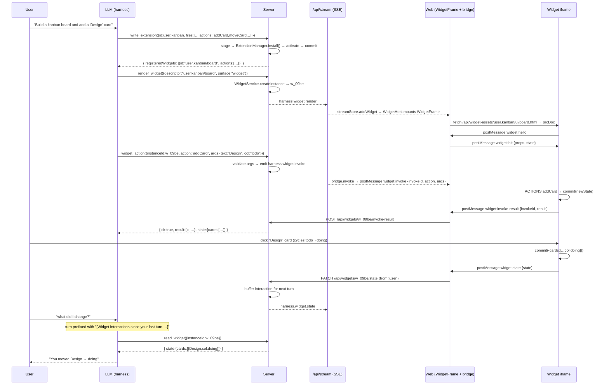

# Feature: Extensions & Widgets

> Hot-loadable **extensions** ship UI, tools, skills, prompts, hooks and commands the agent (and user) can compose at runtime. **Widgets** are the flagship contribution — interactive HTML surfaces the LLM renders **inline** in the chat stream or **full-page** in the right-pane Widget tab. Widgets are sandboxed (null-origin iframes) and communicate with the host over a small `postMessage` protocol. Simple widgets are driven by whole-state overwrite (`update_widget`); **complex** widgets declare a typed **action catalog** the agent invokes verb-by-verb via `widget_action` or in bulk via the code-mode `widget_exec` tool.

Prerequisites in your head: [feature-chat.md](./feature-chat.md), [feature-streaming-events.md](./feature-streaming-events.md), [feature-skills-agents-mcp.md](./feature-skills-agents-mcp.md).

---

## 1. What an extension is

An **extension** is a self-contained folder that a running server hot-loads at boot (and can reload on demand) to add capabilities without a rebuild. On disk it looks like:

```
<extensionId>@<version>/
├── extension.json    ← manifest (metadata + entry pointer)
├── index.js          ← ES module: `export default function loadExtension(ai) { … }`
└── ui/               ← optional widget bundles referenced by descriptor.entry
    └── <component>.html
```

Every extension is loaded into one of three **scopes**:

| Scope | Directory | Typical use |
|---|---|---|
| **system** | `templates/system/extensions/` | Platform demos, first-party contributions (`acme.todo`, `genai.hello-world`). Read-only from the API. |
| **user** | `<XDG_DATA_HOME or ~>/.generatorai/extensions/` | User-authored extensions, including anything the agent installs via `write_extension`. Ids must begin with `user.` — reserved namespaces `genai.*` / `acme.*` are rejected. |
| **workspace** | `<workspaceRoot>/.generatorai/extensions/` | Per-workspace overrides. Resolved through `ExtensionManagerConfig.resolveWorkspaceDir(workspaceId)`. |

The manifest is thin — there is **no** `contributes` block; every capability is registered imperatively from the entry file:

```jsonc
{
  "id": "user.<slug>",                            // fully-qualified id
  "name": "Live Poll",
  "version": "1.0.0",
  "description": "Interactive poll with vote counts",
  "engines": { "generatorai": ">=1.0.0" },
  "entry": "./index.js"                            // REQUIRED
}
```

The **`entry` file** exports a default `loadExtension(ai)` factory. `ai` is the injected [`ExtensionAPI`](../../packages/core/src/services/ExtensionApi.ts) handle — the only dependency the entry file needs. It stages contributions synchronously:

```js
export default function loadExtension(ai) {
  ai.registerWidget({
    id: 'poll',                       // final id becomes "<extensionId>/poll"
    title: 'Live Poll',
    description: 'Interactive poll with vote counts',
    entry: 'ui/poll.html',
    preferredSurface: 'widget',       // 'widget' (full-page, default) | 'inline'
    keywords: ['poll', 'vote'],
    // OPTIONAL — typed verbs the agent can invoke on a live instance:
    actions: [
      { name: 'addOption', description: 'Add a poll option',
        argsSchema: { type: 'object', properties: { label: { type: 'string' } }, required: ['label'] } },
    ],
  });
  // Also available: ai.registerTool, ai.registerCommand,
  // ai.registerHook, ai.registerSkill, ai.registerPrompt.
  ai.log.info('Live poll loaded');
}
```

`ExtensionAPI` stages contributions into a private buffer. `ExtensionManager.commitStagedContributions()` then flushes them atomically into the runtime registries — see §3.

> The `ai` handle exposes: `registerWidget`, `registerTool`, `registerMcpServer`, `registerCommand`, `registerHook`, `registerSkill`, `registerPrompt`, plus `log` and `events`. (Only widgets + tools are wired end-to-end today; the rest are staged for follow-on phases.) There is **no** `registerRightPanePanel` / `addPromptSnippet` / `addPromptGuidelines`.

---

## 2. What a widget is

A **widget** is one contribution kind: an HTML/CSS/JS bundle rendered inside a **sandboxed null-origin iframe**. Widgets are the standard way an agent produces interactive UI (buttons, forms, polls, editors, dashboards, media viewers) without spawning tools per-widget.

Runtime iframe sandbox:

- `sandbox="allow-scripts allow-forms"` (no `allow-same-origin` → null origin).
- CSP: `script-src 'self' 'unsafe-inline' 'unsafe-eval'; style-src 'self' 'unsafe-inline'; connect-src 'none'; img-src data: blob: 'self'`.
- **No** `fetch()`, `XMLHttpRequest`, cookies, `localStorage`, or third-party CDNs — the CSP `connect-src 'none'` blocks all network.
- Same-folder relative assets *are* allowed. A `<base>` tag is injected on serve so `<script src="./bundle.js">` resolves correctly.

Every widget instance carries three pieces of state on the server: **descriptor** (static, from the extension — includes the optional **action catalog**), **props** (per-instance, set by `render_widget`), and **state** (mutable, evolves as the widget, the user, and the agent update it). See §5 for the descriptor / instance schemas.

### 2.1 Separate widget asset origin

Widget assets are **not** served from the API origin. At boot the server opens a **second loopback listener** dedicated to widget assets:

```
[Server] GeneratorAI server listening on port 3100
[Server] Widget asset origin listening on http://127.0.0.1:3101
```

Because the iframe `src` points at a *different origin* than the SPA, the browser applies a real cross-origin boundary on top of the `sandbox` attribute. That earns each widget its own storage partition and lets a widget opt into `fetch()` back to the API without punching a hole in the app's own origin — the CSP `connect-src` is granted explicitly via `WIDGET_CONNECT_SRC` rather than being blanket-denied.

| Var | Default | Purpose |
|---|---|---|
| `WIDGET_PORT` | `3101` (API port + 1) | Port for the widget asset origin. In desktop/standalone mode it is auto-assigned next to the ephemeral API port (e.g. API `49870` → widgets `49871`). |
| `WIDGET_ORIGIN` | computed from `WIDGET_PORT` | Full origin URL injected into the iframe `src`. Override when fronting behind a proxy. |
| `WIDGET_CONNECT_SRC` | the API origin | CSP `connect-src` granted to widgets so they can call back into `/api`. |

Implication for authors: **never hardcode `http://localhost:3100`** in widget code. Read the host-provided origin from the bridge handshake instead — the port is dynamic in desktop builds.

---

## 3. Load lifecycle

```
apps/server/src/composition-root.ts
       │
       ▼
packages/core/src/services/ExtensionManager.ts
       │  systemDir  → scanDirectory('system')  ─┐
       │  userDir    → scanDirectory('user')    ─┼→ per folder: tryLoadFromDir
       │  workspace  → resolveWorkspaceDir()    ─┘
       │
       ▼
tryLoadFromDir(dir, scope):
   1. Read + validate manifest (Zod schema in packages/shared). `entry` is required.
   2. Instantiate InstalledExtension record.
   3. activate(ext) → activateEntryFile(ext)  ← dynamic import(index.js) + call loadExtension(ai).
   4. commitStagedContributions(ext) → WidgetRegistry.register / customToolRegistry.register.
   5. ext.ready = true
```

There is a single activation path: the entry file's `loadExtension(ai)` factory. (The former declarative `manifest.contributes.*` path has been removed.)

Two entry points converge on this pipeline:

- **Boot scan** — `ExtensionManager.loadAll()` sweeps system + user + workspace dirs sequentially. Failures are recorded on the `installed[id].errors` array and never crash boot.
- **REST install** — `POST /api/extensions { path, scope, force }` stages a folder outside `.../extensions/`, copies it to the scope directory, then runs the same `tryLoadFromDir`. `write_extension` (the agent-facing built-in tool) is the primary caller; it stages files under `~/.generatorai/extensions/.staging/<id>@<version>/` first, hands to `install()`, then cleans up staging.

Hot reload semantics (`POST /api/extensions/:id/reload` or `POST /api/extensions/reload`):

- `deactivate(ext)` — unregister every widget + tool + skill + prompt + hook the previous version contributed. `WidgetRegistry.unregisterByExtension(id)` removes the descriptors; existing `WidgetInstance` rows are left alone so the SPA doesn't lose UI mid-turn (they surface `"error"` state if the new version doesn't re-register the descriptor).
- `this.installed.delete(id)` — clean the in-memory record.
- Re-run `tryLoadFromDir(scope-dir, scope)`.

The full sequence — deactivate → drop → reload → activate → commit — is atomic per extension; failure at any step is caught and surfaced on `errors`.

---

## 4. `ExtensionManager` (source of truth)

Lives at [packages/core/src/services/ExtensionManager.ts](../../packages/core/src/services/ExtensionManager.ts). Public surface:

| Method | Purpose |
|---|---|
| `loadAll()` | Sweep every configured scope. Idempotent; safe to call from the composition root and again from a REST handler. |
| `install({ path, scope, force })` | Copy a staging folder into the scope dir, then `tryLoadFromDir`. `force: true` uninstalls a prior version of the same id atomically. Returns the fully-loaded `InstalledExtension`. |
| `uninstall(id)` | `deactivate` + remove the on-disk folder. |
| `reloadOne(id)` | Rehydrate a single extension from its existing on-disk folder. |
| `getUserDir()` | Absolute path to the user scope directory (needed by `write_extension` for staging). |
| `list()` | All currently-installed records with `{ manifest, scope, rootPath, ready, errors }`. |

Contributions flow into three shared registries owned by the composition root:

- **`WidgetRegistry`** ([packages/core/src/services/WidgetRegistry.ts](../../packages/core/src/services/WidgetRegistry.ts), port [`IWidgetRegistry`](../../packages/core/src/domain/ports/IWidgetRegistry.ts)) — descriptor catalog keyed by `<extensionId>/<component>`.
- **`customToolRegistry`** — the same registry the composition root uses for the agent-authoring tools (see §8), extension-contributed tools, and MCP-provisioned tools.
- **`SystemArtifactService`** — extension-contributed skills / prompts / agents merge into the same registry that scans `templates/system/artifacts/` (see [feature-skills-agents-mcp.md](./feature-skills-agents-mcp.md)).

---

## 5. Entity & DB shape

### `WidgetDescriptor` (in-memory only)

Defined in [packages/shared/src/types/Widget.ts](../../packages/shared/src/types/Widget.ts):

```ts
interface WidgetDescriptor {
  id: string;                                        // "<extensionId>/<component>"
  extensionId: string;
  component: string;
  title?: string;
  description?: string;
  preferredSurface: WidgetSurface;                   // 'inline' | 'widget'
  entry: string;                                     // relative to extension root
  propsSchema?: Record<string, unknown>;             // JSON Schema
  stateSchema?: Record<string, unknown>;
  permissions?: WidgetPermission[];
  keywords?: string[];                               // used by search_widget ranking
  actions?: WidgetActionDef[];                        // typed verb catalog (complex widgets)
}

interface WidgetActionDef {
  name: string;                                      // verb, e.g. 'moveCard'
  description?: string;
  argsSchema?: Record<string, unknown>;              // JSON Schema for the args object
  returns?: string;                                  // human note on the return value
}
```

`WidgetSurface` has exactly two values: `'widget'` (default — full-page in the right-pane Widget tab) and `'inline'` (in the chat streaming panel). `normalizeWidgetSurface(s)` coerces any legacy value on ingest: `chat` → `inline`; `canvas` / `right-pane` → `widget`.

### `WidgetInstance` (persisted)

Backed by the `widget_instances` table (created in migration v14; **surface constraint tightened to `('inline','widget')` in migration v16** — see [packages/db/src/migrations/index.ts](../../packages/db/src/migrations/index.ts)):

```
id                TEXT PRIMARY KEY    "w_<uuid>"
descriptor_id     TEXT NOT NULL       "<extensionId>/<component>"
session_id        TEXT NOT NULL
chat_id           TEXT                  nullable — set for chat-owned widgets
workflow_run_id   TEXT                  nullable — set for run-owned widgets
stage_run_id      TEXT                  nullable — set for stage-owned widgets
message_id        TEXT                  nullable — assistant message this instance belongs to
surface           TEXT NOT NULL       CHECK(surface IN ('inline','widget'))
props             TEXT                  JSON of the initial props
state             TEXT                  JSON of the latest committed state
status            TEXT NOT NULL       'active' | 'suspended' | 'closed' | 'error'
error             TEXT                  populated on error status
created_at, updated_at   INTEGER (ms)
```

Indexes on `session_id`, `chat_id`, `workflow_run_id`, `stage_run_id`. Refreshing the page replays the instance because `chatMessageToBlocks` re-reads this table.

---

## 6. Server architecture

```
apps/server/src/routes/extensions.ts      REST verbs: list / read / install / delete / reload
                                          + widget-asset routes (/api/widget-assets)
apps/server/src/routes/widgets.ts         REST verbs: list / read / render / state / actions / invoke-result / close
             │
             ▼
packages/core/src/services/WidgetService.ts   ← lifecycle for WidgetInstance rows
             │  owns   IWidgetInstanceRepository
             │  emits  harness.widget.* on EventBus (§7)
             │  reads  IWidgetRegistry for descriptor lookup on render
             │
packages/core/src/services/WidgetRegistry.ts  ← in-memory descriptor catalog (IWidgetRegistry)
packages/core/src/services/ExtensionManager.ts ← disk → registries
packages/core/src/services/ExtensionApi.ts     ← the `ai` handle passed to loadExtension
```

### REST endpoints — `/api/extensions`

| Method | Path | Purpose |
|---|---|---|
| `GET`  | `/`                       | List every installed extension (system + user + workspace). |
| `GET`  | `/widgets`                | Flat list of every registered `WidgetDescriptor`. |
| `GET`  | `/:id`                    | Single extension record. |
| `POST` | `/`                       | Install from a `{ path, scope, force? }` body. Runs the staging→install→activate pipeline. |
| `PATCH`| `/:id`                    | Update user-controlled toggles (enabled flag / permissions). |
| `POST` | `/reload`                 | Reload every extension (dev-time convenience). |
| `POST` | `/:id/reload`             | Reload one extension. |
| `DELETE` | `/:id`                  | Uninstall (deactivate + delete folder). |

### REST endpoints — `/api/widgets`

| Method | Path | Purpose |
|---|---|---|
| `GET`   | `/?sessionId=&chatId=&workflowRunId=` | List widget instances scoped to one owner. |
| `GET`   | `/:id`                               | Read one instance (returns `{ instance }` with props + state). |
| `POST`  | `/`                                  | Create an instance directly (agent flow uses `render_widget` — this REST verb is for tests / SDK callers). |
| `PATCH` | `/:id/state`                         | Overwrite state — called by the SPA's widget bridge when the iframe posts `widget:state`. Persists + emits `harness.widget.state` (tagged `from:'user'`). |
| `POST`  | `/:id/actions`                       | Dispatch a semantic user action — called by the SPA when the iframe posts `widget:action`. Persists + emits `harness.widget.action`. |
| `POST`  | `/:id/invoke-result`                 | Client bridge posts the result of an agent-dispatched `widget:invoke` round-trip; resolves the server-side pending `widget_action` / `widget_exec` promise. |
| `DELETE`| `/:id`                               | Close the instance (soft — row kept for replay). |

### REST endpoints — `/api/widget-assets`

Regex mount: `GET /api/widget-assets/:extensionId/*` serves any file under the extension's root. Injects a `<base>` tag so relative asset paths resolve inside the null-origin iframe. Content-type is derived from the file extension. This is the URL `WidgetFrame` fetches on the client (see §9).

### Composition-root wiring

Every server boot wires:

1. `WidgetRegistry` singleton.
2. `WidgetService` with the widget repo + eventBus + `IWidgetRegistry`.
3. `ExtensionManager` with `{ widgetRegistry, customToolRegistry, eventBus }` as `deps`.
4. `chatExtensions.widgetService` / `widgetRegistry` / `widgetAssetsBase` — so `ChatManagementService` binds widget tools per-chat (see §8).
5. `buildWriteExtensionTool({ extensionManager, widgetRegistry })` and `buildReloadExtensionTool({ extensionManager })` registered on the process-wide `customToolRegistry` so every chat gets them.

---

## 7. Event surface

`WidgetService` emits five kinds on the shared `EventBus` (routed onto the `session:<sessionId>` scope, then fanned out to `chat:<chatId>` and/or `run:<workflowRunId>` when set):

```
harness.widget.render     A new instance was created. Payload: instanceId, descriptorId,
                          extensionId, component, surface, title, props, entry, assetsBase.
harness.widget.state      State was overwritten (by agent update_widget OR by a user
                          postMessage widget:state → PATCH /:id/state).
                          Payload: instanceId, state, patch?.
harness.widget.action     Semantic user action dispatched. Payload: instanceId, action,
                          payload, from: 'agent' | 'user'.
harness.widget.invoke     Agent → widget imperative action dispatch. Payload: instanceId,
                          invokeId, action, args. The client bridge forwards this to the
                          iframe as `widget:invoke`; the widget replies `widget:invoke-result`
                          which POSTs to /:id/invoke-result and resolves the tool promise.
harness.widget.closed     Instance closed. Payload: instanceId, reason?.
```

These flow over the unified SSE endpoint like any other event — see [feature-streaming-events.md](./feature-streaming-events.md#4-scope-fan-out).

---

## 8. Agent access — built-in tools

The agent never speaks to `WidgetService`, `WidgetRegistry`, or `ExtensionManager` directly. It uses nine tools, all registered by [packages/core/src/tools/widgetTools.ts](../../packages/core/src/tools/widgetTools.ts) and [packages/core/src/tools/extensionAuthorTools.ts](../../packages/core/src/tools/extensionAuthorTools.ts):

| Tool | Purpose |
|---|---|
| `search_widget({ query, surface?, limit? })` | Ranked search over the registry (keyword + title + description). Use when the LLM does not know a descriptor id. |
| `render_widget({ descriptor, props?, initialState?, surface?, title? })` | Create an instance. Returns `{ instanceId, descriptor, surface, actions, hint }`. `surface` is `'inline'` or `'widget'`. |
| `update_widget({ instanceId, state, patch? })` | Overwrite the whole state so the widget re-renders. Best for **simple** state-only widgets. |
| `read_widget({ instanceId })` | Return the CURRENT `{ state, props, surface, status, updatedAt, actions }`. Authoritative — both user clicks and agent updates land in the same `state`. Pass `updatedAt` back as `expectedUpdatedAt` for optimistic concurrency. |
| `describe_widget({ instanceId? , descriptor? })` | Return the descriptor + **action catalog** (verb names, arg schemas, returns) + (for an instance) current state. Call this before driving a complex widget. |
| `widget_action({ instanceId, action, args, expectedUpdatedAt? })` | Invoke **one** typed verb on a live widget. Validates args against the action's schema, round-trips to the iframe (`widget:invoke`), returns the widget's result + post-action state. |
| `widget_exec({ instanceId, code })` | **Code mode.** Run an async script that calls several actions in sequence (with a typed `widget` API, `read()`, `log()`) in one tool call. Ideal for multi-step operations. |
| `list_widgets({ includeClosed? })` | Enumerate open widgets in the current chat (falls back to session scope). Useful when the user says "the widget" without giving an id. |
| `close_widget({ instanceId, reason? })` | Dismiss. Row is kept for replay. |
| `write_extension({ extensionId, version?, files, force? })` | Author or overwrite a user-scope extension and hot-load it. Returns `{ registeredWidgets: [{ id, component, title, actions, … }] }` — the fully-qualified descriptor ids the runtime just registered, so the agent can call `render_widget` without a follow-up `search_widget`. |
| `reload_extension({ extensionId })` | Re-import an existing extension from disk. Rarely needed — `write_extension` with the same id triggers an atomic reload. |

**Choosing how to drive a widget:** simple state-only widgets (poll, toggle, stopwatch) → `update_widget`. Complex widgets that declared an `actions` catalog → `describe_widget` → `widget_action` (one verb) or `widget_exec` (many verbs). This keeps the tool set flat (one dispatch tool) no matter how many widgets/verbs exist, and lets the agent mutate without reproducing the entire state or clobbering a concurrent user edit.

### System-prompt hint

[`ChatManagementService.sendPrompt`](../../packages/core/src/services/ChatManagementService.ts) appends a compact `[Widgets]` + `[Authoring Extensions From Chat]` section to the harness system message once the widget tools are wired. It:

1. Tells the LLM about the tool set, the two surfaces, and the `<extensionId>/<component>` descriptor shape.
2. Explains the drive-a-widget decision (update_widget vs widget_action/widget_exec) and optimistic concurrency.
3. Documents the required manifest / entry-file / HTML skeletons, incl. the optional action catalog.
4. Enforces the **agent-controllable widget rules** (see §10) — declarative state, `commit()` every user change, one `applyState()` path for `widget:init` + `widget:state`, and (for complex widgets) a `widget:invoke` handler that replies `widget:invoke-result`.
5. Directs the LLM to `read_widget` (not browser automation) to observe user clicks. User interactions since the last turn are also auto-summarized at the top of each turn.

The same guidance is packaged as the [`extension-author` skill](../../templates/system/artifacts/skills/extension-author.md) so `SystemArtifactService` exposes it under `/api/system/artifacts`. See [feature-skills-agents-mcp.md](./feature-skills-agents-mcp.md).

---

## 9. Frontend (SPA)

**Widget tab** in the shared `RightPane`. Chat and Workflow Run pages both host a **Widget** tab that is auto-added to the tab strip the first time a widget lands on the `widget` surface. The panel is [`WidgetHost`](../../apps/web/src/components/widgets/WidgetHost.tsx) — a stacked list of active `WidgetFrame`s, each rendered `fullscreen` so a single widget fills the pane cleanly.

**Inline surface (`surface: 'inline'`)** — widgets appear inline in the message transcript / streaming panel. `WidgetBlock` is a first-class member of the `StreamBlock` union in [apps/web/src/stores/streamStore.ts](../../apps/web/src/stores/streamStore.ts), so a widget renders exactly where it was emitted, alongside tokens and tool calls.

### `WidgetFrame` — sandboxed iframe host

Component: [apps/web/src/components/widgets/WidgetFrame.tsx](../../apps/web/src/components/widgets/WidgetFrame.tsx).

- Fetches the entry HTML once per instance from `GET /api/widget-assets/<extensionId>/<entry>` (module-scoped promise cache — remounts don't refetch).
- Renders an `<iframe srcDoc={html} sandbox="allow-scripts allow-forms" referrerPolicy="no-referrer">`. `srcDoc` is used instead of `src` to eliminate the `ERR_ABORTED` race that happens when React re-renders during pending iframe navigation.
- Registers the instance with the module-scoped `widgetBridge` ([apps/web/src/lib/widgetBridge.ts](../../apps/web/src/lib/widgetBridge.ts)) so postMessage envelopes are routed to the right instance.
- Pushes updated state into the iframe whenever `block.state` changes (agent-driven updates).

### Widget bridge — the postMessage protocol

The bridge mediates iframe ⇄ host traffic. Envelopes:

```
widget → host:
  { type: 'widget:hello' }                             mount signal → replies with widget:init
  { type: 'widget:ready' }                             after first render
  { type: 'widget:resize', height }                    optional; drives host onHeight
  { type: 'widget:state', state }                      full-state snapshot → PATCH /:id/state
  { type: 'widget:action', action, payload? }          semantic event  → POST /:id/actions
  { type: 'widget:invoke-result', invokeId, result?, error? }
                                                       reply to an agent invoke → POST /:id/invoke-result
  { type: 'widget:close' }                             dismiss self    → DELETE /:id
  { jsonrpc: '2.0', method, params, id }               generic RPC (e.g., chat.send)

host → widget:
  { type: 'widget:init', props, state }                reply to widget:hello
  { type: 'widget:state', state }                      agent-pushed new state (update_widget)
  { type: 'widget:invoke', invokeId, action, args }    agent-dispatched action (widget_action / widget_exec)
  { type: 'jsonrpc:response', id, result | error }
```

Point to internalize: **`widget:state` from either direction converges on the same server row and emits `harness.widget.state`**. That's why the agent's `read_widget` is authoritative regardless of whether the last mutation came from a user click, an `update_widget`, or a `widget_action`. Agent actions travel the parallel `widget:invoke` → `widget:invoke-result` round-trip so the tool call awaits the real result.

### Replay

The streaming store keeps every `harness.widget.*` event across turns (never dropped by the "keep only current turn" filter in `replayEvents.ts`), so returning to a chat page reconstitutes the widget without a fresh render.

---

## 10. Agent-controllable widgets — the rules

For the agent to drive the same UI the user drives, every widget MUST obey:

1. **State is declarative + idempotent.** Never encode imperative commands (`{cmd: 'start'}`). Encode the CURRENT VISUAL as data. For a stopwatch: `{ running, startedAtEpoch, accumulatedMs }`; the display is `accumulatedMs + (running ? now - startedAtEpoch : 0)`. This must survive a remount — on `widget:init` the widget receives only the last persisted state and must reconstruct the full render from it.
2. **Every user change commits.** Wrap mutation in `function commit(next) { state = {...state, ...next}; parent.postMessage({type: 'widget:state', state}, '*'); render(); }`. Never mutate widget-local variables without also posting `widget:state`, or the host loses the change.
3. **`widget:init` and `widget:state` share one path.** Both must call the same `applyState(msg.state) → render()`. This is what makes `update_widget` and a user click produce the exact same visual.
4. **(Complex widgets) handle `widget:invoke`.** If the descriptor declares an `actions` catalog, the widget must handle `widget:invoke` messages: run the named action, `commit()` the new declarative state, then reply `parent.postMessage({type:'widget:invoke-result', invokeId, result}, '*')` (or `{..., error}` on failure). This is what makes `widget_action` / `widget_exec` work — the agent invokes verbs by name instead of overwriting the whole state, so it never clobbers a concurrent user edit and `read_widget` stays authoritative.

Widgets that violate rules 1–3 are silently broken — they render on first mount, `update_widget` appears to succeed (state persists), but the user's `<iframe>` never re-renders because the visual came from JS-local variables the state model doesn't cover. A complex widget that ignores rule 4 will make every `widget_action` time out (the tool waits for a `widget:invoke-result` that never arrives). The system prompt and the [extension-author skill](../../templates/system/artifacts/skills/extension-author.md) enforce these rules verbatim.

**Do NOT drive widget buttons via `run_playwright_code` / `open_browser_page`.** The iframe is null-origin and unreachable from browser automation. `update_widget` / `widget_action` / `widget_exec` are the only correct paths from the agent side; user clicks route through the bridge automatically.

---

## 11. Life of a single interaction

Trace of *user prompt → LLM authors → LLM drives via action → user clicks → LLM observes*:



Key invariants:

- Widget events are **persisted in `widget_instances` + broadcast on SSE** — they are NOT auto-injected into the LLM transcript, but **user-driven** state/action changes since the last turn ARE summarized into a short note prepended to the next prompt. The agent still calls `read_widget` for the authoritative full state.
- `harness.widget.state` fires from *both* directions (agent update + user click), so the SPA always sees fresh state regardless of who moved.
- Rendering is fully idempotent: closing and reopening the chat page re-plays the same `widget_instances` row and mounts the same iframe with the same state.

---

## 12. Testing & catalog references

- Playwright E2E: [agent-tests/hooks-e2e.spec.ts](../../agent-tests/hooks-e2e.spec.ts) covers hook-driven widget renders; [agent-tests/workflow-comprehensive-e2e.spec.ts](../../agent-tests/workflow-comprehensive-e2e.spec.ts) exercises the widget surface end-to-end.
- Session memory: `/memories/repo/session-82-extension-authoring-skill.md` captures the LLM-authoring hardening; the surface-collapse + action-catalog + code-mode work (this doc's current shape) is the follow-on session.

---

## 13. Extending the extension model

To ship a new contribution kind (e.g., "screensavers", "chat quick-replies"):

1. Add a `StagedXInput` type + a `registerX(...)` staging method to [ExtensionApi.ts](../../packages/core/src/services/ExtensionApi.ts).
2. Register it in `ExtensionManager.commitStagedContributions` — usually by writing into the same shared registry another feature already uses (e.g., `customToolRegistry`).
3. If it needs persistence, add a table via a new migration (`packages/db/src/migrations/index.ts`) following the `widget_instances` pattern.
4. Surface the new events on the bus using the `harness.<name>.*` prefix so they flow through the unified SSE broker with zero routing changes.
5. Document the contribution shape in the [extension-author skill](../../templates/system/artifacts/skills/extension-author.md) so the LLM can author it directly from chat.
