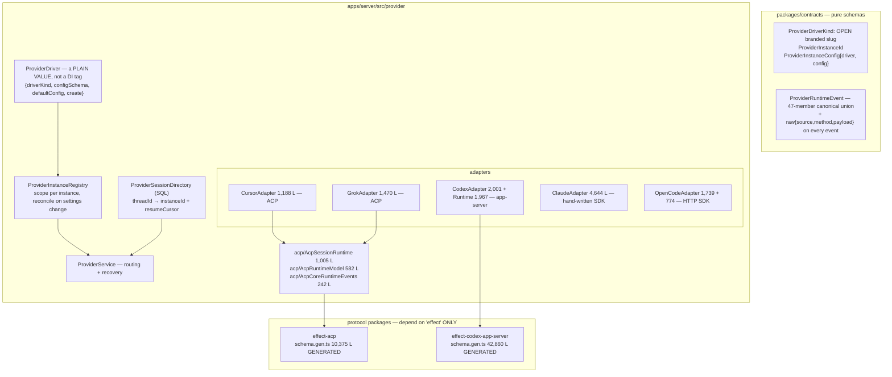
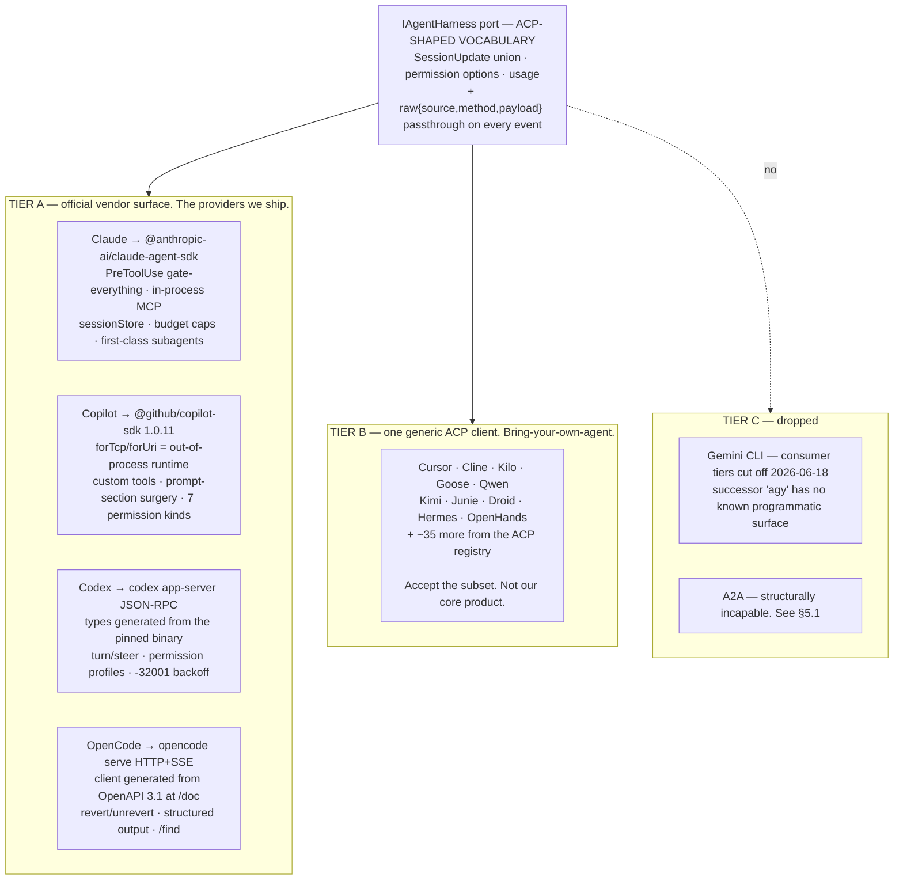

# Agent Provider Integration — Comparative Analysis

> Companion to [ARCHITECTURE_V2_MASTER_PLAN.md](ARCHITECTURE_V2_MASTER_PLAN.md) and [ARCHITECTURE_V2_ACP_AND_SECURITY.md](ARCHITECTURE_V2_ACP_AND_SECURITY.md).
> **Contains three material corrections** to earlier recommendations — see §1.3, §4.3 and §5.5.
> **Date:** 2026-08-17, Part 5 added 2026-08-18 · Sources: full source audit of `t3code`, `pi`, `KiroCrew`, `orca`, `omnigent` (local) + primary-source research on the ACP spec/registry, the A2A spec and Linux Foundation governance, Codex app-server, Claude Agent SDK, `@github/copilot-sdk`, Gemini CLI, OpenCode. No code written.
>
> **Read Part 5 first if you are short on time.** It answers the decision question: no protocol has feature parity with the vendor SDKs, and the tier model in §4.3 is inverted from what §4 originally recommended.

---

# PART 1 — Which agents support ACP

## 1.1 The support matrix

Source of truth is the **ACP Registry** (`cdn.agentclientprotocol.com/registry/v1/latest/registry.json`), the machine-readable list clients use for install and auto-config.

> **Repo moves you need to know:** `zed-industries/agent-client-protocol` → **`agentclientprotocol/agent-client-protocol`**. `zed-industries/claude-code-acp` → **`agentclientprotocol/claude-agent-acp`**. `zed-industries/codex-acp` → **`agentclientprotocol/codex-acp`** (old repo archived 2026-07-22). `sst/opencode` → **`anomalyco/opencode`**.

| Agent | ACP support | Invocation |
|---|---|---|
| **GitHub Copilot CLI** | **Native — public preview since 2026-01-28** | `copilot --acp` (also `--acp --port 8080` for TCP) |
| **Gemini CLI** | **Native**, in-tree at `packages/cli/src/acp/` | `gemini --acp` *(flag is now `--acp`, not `--experimental-acp`)* |
| **OpenCode** | **Native**, dedicated docs page | `opencode acp` |
| **Cursor CLI** | **Native**, plus five `cursor/*` extension methods | `cursor-agent acp` |
| **Qwen Code** | **Native** | `qwen --acp`; also `qwen serve` (HTTP+SSE, experimental) |
| **Cline** | **Native** | `npx cline --acp` |
| **Kilo Code** | **Native** | `kilo acp` |
| **Goose** (Block → Linux Foundation AAIF) | **Native, both directions** — it is an ACP agent *and* an ACP client | `goose acp` |
| **Hermes Agent** (Nous Research) | **Native**, ships `acp_adapter/` | `hermes acp` |
| **OpenHands** | **Native** (self-labelled experimental) | `openhands acp` |
| **Droid** (Factory) | **Native** | `droid exec --output-format acp-daemon` |
| **Claude Code** | **Official adapter**, not native. Maintained by the ACP org, **not Anthropic** | `npx @agentclientprotocol/claude-agent-acp` |
| **OpenAI Codex CLI** | **Official adapter**, not native. Wraps the Codex app-server | `npx @agentclientprotocol/codex-acp` |
| **Pi** | **Third-party adapter only**, self-described "MVP-style" | `npx -y pi-acp` |
| **Kiro CLI** | Listed in the registry | — |
| **Crush** (Charmbracelet) | **None found** | — |
| **Aider** | **None found / unverified** | — |

Plus ~30 more in the registry: Junie (JetBrains), Devin, Kimi CLI, Poolside, Mistral Vibe, Grok Build, Auggie/Augment, Snowflake Cortex Code, Docker cagent, LangChain DeepAgents, and others.

**Clients** that consume ACP: **Zed** (originator, native), **JetBrains IDEs** (native, AI Assistant 2026.2), **Neovim** (CodeCompanion, avante), **Emacs** (`agent-shell.el`), **marimo**, **Qt Creator**, **Visual Studio** (extension). **VS Code has no first-party ACP client** — only community/vendor extensions. Copilot in VS Code is *not* an ACP client; Copilot **CLI** is an ACP *agent*.

## 1.2 The finding that matters most for us

**GitHub Copilot CLI — our default provider — speaks ACP natively.**

That means our bespoke `CopilotProvider.ts` and the entire single-shared-CLI process model behind it (issue `P0-13`) could potentially collapse into a **configuration entry** on a generic ACP client. This needs a hands-on verification pass (§4.4), but if it holds it is the single biggest simplification available in the provider layer.

## 1.3 ⚠️ Correction: ACP v2 deletes the terminal and filesystem surface

**ACP v2 was published as a Draft on 2026-07-20 and it is a genuine breaking revision.** From the official migration guide:

> **`fs/read_text_file`, `fs/write_text_file`, and all five `terminal/*` methods are REMOVED.**
> Rationale: *"this surface was inconsistently implemented outside of a few IDEs, and agents already needed their own file and execution handling for clients that didn't offer it."*
> Clients that want to expose file/exec surfaces must supply an **MCP server** instead. Terminal becomes agent-owned, display-only state.

**This invalidates recommendation R4** in [ARCHITECTURE_V2_ACP_AND_SECURITY.md](ARCHITECTURE_V2_ACP_AND_SECURITY.md) §A.3 item 3 and the master plan's R4 ("invert terminal ownership on the desktop surface using ACP's client-provided terminal capability"). **Do not build our terminal architecture on that surface.**

The local evidence agrees independently. Both serious ACP clients we audited **decline the capability**:

- **t3code**: `initializeClientCapabilities` hardcodes `fs.readTextFile: false`, `fs.writeTextFile: false`, `terminal: false` for **every** provider.
- **KiroCrew**, with the reason stated in code:
  > *"`fs` and `terminal` stay false: KiroCrew does not serve the agent's file or terminal requests over ACP — the agent uses its own tools for that, and advertising them would invite requests we have no handler for."*

**Revised position:** we keep our own PTY Host and own terminal ownership end to end (master plan W14 is unchanged and unaffected). ACP is adopted for the **conversation** — sessions, prompts, streaming, cancellation, permissions, usage — and not for file or terminal delegation. If we later want to expose our terminal to an agent, the v2-sanctioned route is **an MCP server**, which fits our architecture better anyway because it is transport-agnostic.

Other v2 changes worth tracking: `session/prompt` no longer ends the turn (it acknowledges with `{}`; the turn ends via a new `state_update`); `session/load` → `session/resume` + `replayFrom`; modes fold into config options; `messageId` becomes required; diffs become structured changes. **v1 remains a safe target** — zero wire-breaking changes have shipped within v1, and the docs explicitly instruct implementers to keep serving it.

## 1.4 Maturity and governance — the honest read

| | |
|---|---|
| **Protocol version** | v1 stable. **v2 in Draft** since 2026-07-20, with explicit guidance: *"gate your implementation behind version negotiation AND feature flags. Don't ship it by default in production."* |
| **Breaking changes within v1** | **Zero.** ~15 RFDs shipped additively via capabilities. |
| **Official SDKs** | Rust `agent-client-protocol` 2.0.0 (~3.7M downloads), TypeScript `@agentclientprotocol/sdk` 1.3.0 (~5M weekly). Both hit 1.0 on 2026-06-25. Python, Kotlin, Java also official. |
| **Activity** | 69 releases, 143 contributors, 4.0k stars. `claude-agent-acp` alone has 134 releases and ships near-daily. |
| **Governance** | **Zed + JetBrains, interim joint governance**, "working toward transitioning to an independent foundation." Two lead maintainers with veto. **Security triage goes to `security@zed.dev`.** Compare A2A, which was donated to the Linux Foundation with a multi-vendor TSC. **ACP is behind on neutrality.** |
| **Transport** | **stdio only.** Streamable HTTP/WebSocket is an Active RFD with a reference implementation in Goose, but not shipped. Remote ACP today is community bridges. |
| **Per-agent variance** | High, and documented. `pi-acp` has no fs/terminal delegation and no thought stream. Cursor's ACP mode lacks team MCP servers. OpenCode's lacks `/undo`/`/redo`. OpenHands calls it experimental. **Per-agent capability probing is mandatory, not optional.** |

**One security note we must design around**, from Hermes' own docs: hosts that auto-answer `session/request_permission` silently convert ACP's human-in-the-loop guarantee into arbitrary code execution — *"I asked one to run `rm -rf` against a scratch directory and it deleted it, no prompt anywhere."* Our auto-approve path must be a deliberate, audited, keystone-gated decision.

---

# PART 2 — How t3code integrates providers

t3code is the closest analogue to us: TypeScript, multi-surface, drives multiple provider CLIs. It supports **Codex, Claude, Cursor, Grok, OpenCode**.

## 2.1 The architecture



## 2.2 The empirical argument for ACP — from their own line counts

| Provider | Protocol | Adapter LOC | Shared code reused |
|---|---|---|---|
| Cursor | **ACP** | 1,188 | 1,829 L ACP runtime + generated schema |
| Grok | **ACP** | 1,470 | same |
| Codex | app-server | 3,968 | generated schema only |
| OpenCode | HTTP SDK | 2,513 | none |
| **Claude** | **hand-written SDK** | **4,644** | **none** |

**~1.2–1.5k lines per ACP provider over a shared runtime, versus 4,644 lines for the one provider they wired by hand — with a 4,613-line test file alongside it.**

That Claude adapter reimplements assistant segmentation, tool classification, plan extraction from `TodoWrite`, subagent fleet tracking, workflow progress parsing, token-usage normalisation across six shapes, and context-window inference — **all of which the ACP path gets from shared code.**

This is the number to remember. It is our own situation: we have two hand-written adapters and are contemplating a third.

## 2.3 The provider port — reproduced

```ts
export interface ProviderAdapterShape<TError> {
  readonly provider: ProviderDriverKind;
  readonly capabilities: ProviderAdapterCapabilities;      // DECLARED, not probed

  readonly startSession:  (input) => Effect<ProviderSession, TError>;
  readonly sendTurn:      (input) => Effect<ProviderTurnStartResult, TError>;
  readonly interruptTurn: (threadId, turnId?) => Effect<void, TError>;
  readonly respondToRequest:   (threadId, requestId, decision) => Effect<void, TError>;
  readonly respondToUserInput: (threadId, requestId, answers) => Effect<void, TError>;
  readonly stopSession:   (threadId) => Effect<void, TError>;
  readonly listSessions:  () => Effect<ReadonlyArray<ProviderSession>>;  // CANNOT FAIL
  readonly hasSession:    (threadId) => Effect<boolean>;                 // CANNOT FAIL
  readonly readThread:    (threadId) => Effect<ProviderThreadSnapshot, TError>;
  readonly rollbackThread:(threadId, numTurns) => Effect<ProviderThreadSnapshot, TError>;
  readonly stopAll:       () => Effect<void, TError>;
  readonly streamEvents:  Stream<ProviderRuntimeEvent>;                  // NEVER FAILS
}
```

Note which methods **cannot fail**. `hasSession` is called before deciding whether to recover a session, so a probe that can error would break routing. `streamEvents` never terminating until the instance scope closes is what makes stream termination a valid teardown signal.

Separately, the **driver** is a plain value, not a dependency-injection tag, and the header comment says exactly why:

> *"`ProviderDriver` is a record, not a Context.Service. … There are intentionally no per-driver Context tags because tags are singleton-per-runtime and **we need many instances of the same driver**."*

That is our `HarnessRegistry` limitation stated precisely — we can have one Copilot and one Claude, not two Copilot accounts.

## 2.4 The five things t3code does that we should copy

### (a) Persist provider ownership as an instance id, and make it the only routing key

This is exactly our issue `P1-42` (wrong provider after restart), solved in the database:

```ts
interface ProviderRuntimeBinding {
  threadId; provider; providerInstanceId;   // ← the routing key
  adapterKey?; status?;
  resumeCursor?: unknown | null;            // opaque, provider-owned
  runtimePayload?: unknown | null;          // { cwd, model, activeTurnId, … }
  runtimeMode?;
}
```

with the invariant documented: *"The persistence layer promotes legacy null rows before exposing bindings; **runtime callers must not infer this from `provider`**."* Legacy rows get `?? defaultInstanceIdForDriver(provider)` **at the persistence boundary only**, so hot routing code never guesses.

The routing rule is one function: read binding → require instance id → get adapter → `hasSession` → route, or recover. Recovery has two named strategies (`adopt-existing`, `resume-thread`) and refuses to cross-contaminate: persisted cwd and resume cursor are only reused **if the instance id matches**, so a thread moved from one account to another is never handed the wrong resume token.

### (b) Cancellation is a success value, and pending approvals are settled first

```ts
const cancelledResponse = { stopReason: "cancelled" };
// fork the prompt RPC, keep the fiber in a Ref
return yield* Fiber.join(promptRpcFiber).pipe(
  Effect.catchCause((cause) =>
    Cause.hasInterruptsOnly(cause) ? Effect.succeed(cancelledResponse) : Effect.failCause(cause)));
```

and on cancel: interrupt the fiber first, then fire the protocol cancel **in the background** so cancel returns immediately. Critically, `interruptTurn` **settles every pending approval as "cancel" and every pending user-input as `{}` before cancelling** — otherwise the RPC handler blocked on that promise deadlocks forever.

That last detail is the one we would have missed.

### (c) Bound every fan-out with concurrency **and** two timeouts

```ts
Effect.forEach(childTurns, ([tid, turnId]) =>
  client.request("turn/interrupt", { threadId: tid, turnId })
        .pipe(Effect.timeoutOption("3 seconds"), Effect.ignore),
  { concurrency: 8, discard: true },
).pipe(Effect.timeoutOption("10 seconds"), Effect.ignore);
```

with the rule stated in-comment: *"the transport awaits an unbounded Deferred per request, so a wedged child would otherwise block the parent interrupt forever — exactly during the runaway fleet where Stop matters most."*

### (d) Provider status is a `Ref` read, refreshed only on demand, cached to disk

Four mechanisms:
- `getSnapshot` is a **pure `Ref.get`** — reading provider state costs nothing.
- The refresh loop runs **only if something is actually watching** (`hasProviderStatusDemand`). No UI subscriber → no probe.
- A semaphore makes concurrent refreshes impossible.
- **Generational enrichment**: slow network enrichment runs on a fiber stamped with a generation; results from a superseded generation are discarded. Late async results can never clobber fresh state.
- On boot, hydrate from `<cacheDir>/<instanceId>.json`, gated on instance id **and** driver **and** enabled all matching — *"the filename alone is not trusted as a routing key."*

This is the direct replacement for our `P2-22` (both providers cold-probed every 5 minutes on the create-conversation path).

### (e) Generate the protocol schema; never hand-write it

A 252-line generator produces 10,375 lines of ACP schema, pinned to a release tag, downloaded from the GitHub release, with the upstream JSON deleted by a finalizer. Codex pins by git commit instead.

**This is what makes "one adapter for many providers" true rather than aspirational.**

## 2.5 Three things t3code got wrong — do not copy

| Their mistake | Why it matters |
|---|---|
| **No protocol version negotiation.** `protocolVersion: 1` is hardcoded; the response version is stored and never compared; the exported `PROTOCOL_VERSION` constant has **zero consumers**. | When an agent moves to ACP v2 this fails at runtime with a schema-decode error on some unrelated method. **Given v2 is already in Draft, we must negotiate from day one.** |
| **Child stderr is discarded** (`Sink.drain`). | When a provider CLI dies during `initialize`, the operator gets `ProcessExited{code:1}` and nothing else. Buffer the last N KB and attach it to the error. |
| **Orphan prevention is scope-based only** — no PID tracking, no process-group kill, no exit handler. | A hard kill of the server leaks every provider child. **This is our 24-orphan problem, unsolved.** Our W20 (parent-PID heartbeat + boot reaper) is correct and t3code does not have it. |
| Unmodelled protocol events silently dropped (`default: break`) | Schema drift becomes invisible. Emit a warning event or a counter. |
| A defect thrown on the hot event path for correlation mismatch | One buggy adapter kills the subscription fiber and the thread goes silent. Log and drop instead. |

---

# PART 3 — How the other harnesses do it

## 3.1 Pi — the cheapest provider abstraction in the set

**~15 lines of code per provider, median, across 40 providers.** Groq, in full:

```ts
export function groqProvider(): Provider<"openai-completions"> {
  return createProvider({
    id: "groq", name: "Groq",
    baseUrl: "https://api.groq.com/openai/v1",
    auth: { apiKey: envApiKeyAuth("Groq API key", ["GROQ_API_KEY"]) },
    models: Object.values(GROQ_MODELS),
    api: openAICompletionsApi(),
  });
}
```

**The insight that makes this possible: they split "provider" from "wire protocol."**

- 40 providers → **10** wire APIs (`openai-completions`, `anthropic-messages`, `openai-responses`, `bedrock-converse-stream`, `google-generative-ai`, …).
- Protocol layer: **11,399 LOC across 10 APIs**. Provider layer: **~1,000 LOC across 40 providers.** An 11:1 ratio.
- Every module under `src/api/` exports `stream` and `streamSimple`, so **the module itself satisfies the `ProviderStreams` interface**. There is no adapter class at all.

**GitHub Copilot in Pi is 34 lines and serves three wire APIs simultaneously** — Anthropic Messages, OpenAI Completions, and OpenAI Responses — dispatched by `model.api`. That is a different axis from ACP and it is directly relevant to us: if we write `AnthropicHarnessAdapter` and `CopilotHarnessAdapter` as peers, we will duplicate the Anthropic-Messages decoder into both.

**Other Pi mechanisms worth taking:**

- **`lazyStream` — return the stream synchronously, run setup behind it.** Auth resolution, OAuth refresh and dynamic `import()` are all async, but `stream()` returns immediately and setup failure arrives as an in-band `{type:"error"}` event rather than a rejected promise. **One error path, not two.** Each lazy shim is 4 lines; importing 40 providers loads zero SDK code.
- **Cancellation is a terminal message, stated as a contract:** *"Once invoked, request/model/runtime failures should be encoded in the returned stream, not thrown. Error termination must produce an AssistantMessage with stopReason 'error' or 'aborted'."*
- **Retry classification with issue-numbered patterns.** Non-retryable checked **first** (`insufficient_quota`, `quota exceeded`, `billing`) — retrying a quota exhaustion burns wall-clock across every concurrent run simultaneously. And abort during backoff is normalised to the same aborted shape *"so callers do not need to care when cancellation happened."*
- **A 708-line fake provider shipped in the package, not in tests** — scripts multi-turn tool loops, streams with configurable token cadence, and **checks abort at five distinct points**. Without it you cannot test cancellation, parallel tools or truncation without a network.
- **Capabilities are fully declarative and generated**, never probed: `reasoning: boolean`, `thinkingLevelMap` where `null` means unsupported, `input: ["text","image"]`, and a `compat` record of ~25 flags discriminated by wire API. `getModels()` **must not throw**; its failure mode is an empty list.
- **The two agent-loop guards we lack**, verbatim from their source:
  - Truncated arguments: *"A 'length' stop means the output was cut off by the token limit, so every tool call in the message may carry truncated arguments. Fail them all instead of executing potentially borked calls."*
  - Parallel tools: a batch runs parallel unless the config says otherwise **or any single tool declares `executionMode: "sequential"`** — a poison-pill downgrade. Declaration lives on the tool, so a mutating tool is safe by construction. *(Note: Pi has no numeric cap. We should add one.)*

## 3.2 KiroCrew — the only one using ACP, and the honest cost

**15,527 lines of Python** for a full ACP client. `client.py` alone is 5,696 lines; `session_handle.py` 2,794; `runtime.py` 2,306. That serves **three** backends, of which two are operator-selectable.

**The mechanisms worth copying:**

- **Fail-closed handshake.** Agent capabilities are read from the `initialize` response and **default to closed**:
  > *"Fails closed: an un-handshaked or silent backend reports False, so the prompt path sends text only instead of an image block the agent may reject."*
- **Client capabilities advertise only what is actually served** — `fs: false`, `terminal: false`, because *"advertising them would invite requests we have no handler for."*
- **Capabilities are opt-in frozensets, never negations**, with the reasoning spelled out:
  > *"`not is_claude_backend` reads correctly with two backends and then silently hands the capability to the third, so a harness that has never demonstrated the capability inherits it — and the operator who never opted into that harness is the one who finds out."*
- **Single-reader demux** — one reader task owns stdout and routes by request id, then by `sessionId`, then broadcasts. This is the model in our master plan W12.
- **Cancel with a grace budget and a synthesised terminal event.** If the agent never acknowledges the cancel, the dispatch loop unblocks the caller with `EVENT_COMPLETE, stop_reason="error: cancel unacked"`. On a shared runtime *"we cannot force-kill the process (co-tenant sessions would die), so recovery is a synthesized terminal event rather than a hard kill."* **A cancel always produces a terminal event on the stream.**
- **Permission responses echo an `optionId` the agent itself advertised**, recorded when the permission event was built — *"This keeps kiro-cli (`allow_once`/`allow_always`) and claude-agent-acp (`allow`/`allow_always`) working without the caller knowing the backend."* That is what makes one client work against two different agents.
- **Recycle by age and memory, with the distinction stated:** `is_alive()` and `is_stale()` are different questions — *"a runtime can be perfectly healthy yet still be stale — the background runtime observed growing unbounded (multi-GB RSS) over ~24h because the multiplexed design has no per-turn compaction or lifetime cap."*
- **Liveness is a verdict oracle, not a timeout:** `WORKING → never act`, `DEAD → act immediately`, `STUCK_INPUT → act with a nameable cause`, `UNKNOWN → the only timeout-governed class, with non-lethal actions.`

## 3.3 orca — CLI-level, and a cautionary tale

orca owns **no protocol with any provider**. It launches a vendor CLI in a PTY, sends prompts as **keystrokes**, cancels with **Ctrl-C**, learns status from the vendor's **hook system**, and learns content by **tailing the vendor's own JSONL transcript on disk**.

The numbers tell the story: **36 launchable agents, but transcripts for only 4.** The transcript pipeline is 3,377 LOC plus ~200 LOC per decoder plus ~4,700 LOC of tests — a **1.4:1 test-to-source ratio**, which is what schema-tailing costs.

And the honest artefact of the approach, from their own source: a hard-coded **500 ms sleep between typing text and pressing Enter**, plus per-agent keystroke handling because *"pasting 'Blue' + Enter commits the highlighted FIRST option — Claude's AskUserQuestion and Codex 0.145's request_user_input card both behave this way, so answers must be delivered as per-option keystrokes."*

**One thing orca gets exactly right and we should copy:** the decoder contract is *one pure function per provider*, stateless, and **it never throws**:

> *"Each decoder is stateless: it takes a single JSONL line plus a stable fallback id and returns one message or null (unknown/empty records are skipped, never thrown — schema drift). "*

Vendor schema drift degrades to missing messages, never a crash. Their per-record 2 MiB cap with drop-on-exceed is also worth taking.

**Do not build this** unless integrating a CLI that offers no other surface.

## 3.4 omnigent — capability methods with safe defaults, and 29-line providers

Two stacked abstractions: an in-process `Executor` ABC, and an out-of-process `HarnessApp` served over a Unix socket.

**Every capability is a boolean method with a conservative default:**

```python
def supports_streaming(self) -> bool: return False
def handles_tools_internally(self) -> bool: return False
async def interrupt_session(self, session_key) -> bool: return False   # not raise
def supports_tool_boundary_interrupt(self) -> bool: return False
```

`handles_tools_internally()` is the load-bearing one — it is what lets a raw-LLM executor and a full Claude-Code-SDK executor share one interface.

**Two ideas worth taking:**

1. **Cancellation is an event class carrying a phase** — `TurnCancelled(reason, phase)` so the consumer knows whether the *model* or a *tool* was cut. And `ToolCallStatus` has four members — `SUCCESS | ERROR | BLOCKED | CANCELLED` — so a policy-blocked call is distinguishable from a genuine error.
2. **Retryability is declared by the emitter, not inferred by regex.** `ExecutorError(message, retryable)` where `retryable=True` means a transient turn-level error and `False` means auth/SDK/protocol failures that would recur. Pi classifies retryability by regex *after the fact*; omnigent classifies at the source. **Both beat catch-and-guess.**

Also: their provider contract *is* the app's own public API served over a socket — *"there is no separate protocol module."* A new out-of-process provider is **29 lines** because a shared adapter owns SSE, heartbeats, turn lifecycle and shutdown.

And their liveness conclusion matches KiroCrew's from the opposite direction: *"a wall-clock read timeout would either fire too early (slow legitimate tool call) or too late."* **In-band heartbeat, ~5 s cadence, ~3 missed = dead.**

---

# PART 4 — Where we stand, and what changes

## 4.1 Comparison

| | **Ours (today)** | **t3code** | **Pi** | **KiroCrew** | **omnigent** |
|---|---|---|---|---|---|
| Abstraction level | Vendor SDK | Protocol + SDK mix | **Wire protocol** | **Protocol (ACP)** | Two-tier |
| Providers | **2** | 5 | **40** | 3 | 10 + 12 |
| Per-provider cost | ~2,000+ LOC | 1.2k (ACP) / 4.6k (hand) | **~15 LOC** | membership set | 29–329 LOC |
| Multiple accounts per provider | **No** | **Yes** (instance ids) | Yes | Yes | Yes |
| Ownership persisted | **No** | **Yes** | Yes (on the model) | Yes | Yes |
| Capabilities | **Discovered by throwing** | Declared struct | **Declared + generated** | Fail-closed + opt-in sets | Defaulted methods |
| Cancellation | **Throws** | Success value | Terminal message | Notification + grace + synthetic terminal | Event class with phase |
| Parallel tool cap | **None** | Bounded fan-out | Poison-pill, no numeric cap | Pool semaphores | — |
| Truncated-arg guard | **None** | Speculative parse + fingerprint | **Fail the whole batch** | — | — |
| Provider status | **Probe on create path** | Ref + demand-gated + disk cache | Non-throwing `check()` | Verdict oracle | Heartbeat |
| Orphan prevention | **None (24 live)** | **None** | n/a | PID sweep-shield | PID sentinel + sweep |
| Fake provider | **No** | — | **Shipped in package** | — | — |
| Uses ACP | No | **Yes (2 of 5)** | No | **Yes** | No |

## 4.2 Is anything in our approach better?

Honestly: **one thing, and it is real.**

**Our `IAgentHarness` port boundary is genuinely well enforced.** No provider SDK types leak past `packages/agent-harness-providers/` — services, routes and the SDK facade only ever see `IAgentHarness`, `AgentEvent`, `ConversationResponse`, `HarnessClientEvent`, `HarnessModel`. t3code has the same discipline; Pi has it; orca does not have a port at all. That boundary is why this migration is *possible* rather than a rewrite — we can swap what sits behind it without touching callers.

**Everything else, we are behind on.** We have the fewest providers, the highest per-provider cost, no multi-account support, no persisted ownership, exception-based capability discovery, throwing cancellation, no tool caps, no truncation guard, a probe on the hot path, and 24 orphaned processes right now.

## 4.3 The revised integration strategy — vendor SDK first, ACP for breadth

> **This supersedes the earlier "Tier 1 = generic ACP client" recommendation.** Part 5 contains the evidence. The short version: **ACP is a strict subset of every vendor's own surface, including where ACP is first-party**, and for two of our capabilities the gap is disqualifying rather than merely lossy.



**Why this inversion.** The original plan optimised for provider count. But provider count is not our product — depth on the two or three agents our users actually run is. And the two capabilities we would lose are not cosmetic:

1. **We could not gate every tool call on Claude.** Our capability-grant and consent architecture depends on intercepting *every* tool invocation. Anthropic documents that `canUseTool` *"is invoked only when the permission evaluation flow resolves to a prompt … To gate every tool call, use a `PreToolUse` hook instead."* Hooks are **function-valued** — they cannot cross a JSON-RPC boundary, and `claude-agent-acp` has zero references to in-process MCP or `sessionStore`. **This is a security regression, not a feature gap.**
2. **Copilot's ACP mode makes tool filtering server-global.** `--available-tools`, `--excluded-tools` and `--effort` are fixed by whoever launches the ACP server and *"apply to every session for every connecting client"*; `session/new` cannot override them. We run many concurrent sessions with different scopes on one server. That is disqualifying on its own.

**Tier B is still worth building** — it is one client that carries ~45 agents forever, and it is how a user brings their own agent. It is just not where Claude, Copilot, Codex or OpenCode should live.

**Keep the ACP-shaped vocabulary regardless.** ACP's `SessionUpdate` union, permission-option model and usage record are better-designed than what we would invent, they make Tier B a decoder rather than a rewrite, and t3code proves the pattern works when paired with a `raw` passthrough field on every event so Tier-A depth survives normalisation.

## 4.4 Verification tasks before committing

1. **Confirm `@github/copilot-sdk` `RuntimeConnection.forTcp()` / `.forUri()` gives us one runtime per workspace instead of one per server.** This is the direct fix for `P0-13` and it needs no protocol change at all. *Highest-value task in the plan.*
2. **Generate Codex app-server types from our pinned binary** (`codex app-server generate-ts --out …`) and diff them in CI. Confirm the `-32001` backpressure path and whether we need `experimentalApi`.
3. **Generate an OpenCode client from `GET /doc`** and confirm the SSE bus event names from `types.gen.ts`.
4. **Build the Tier-B ACP client against Goose or Cursor**, not against Claude or Copilot — pick a target where ACP is the only surface, so the subset is not a regression.
5. **Negotiate the ACP protocol version explicitly** and gate v2 behind a flag. Do not repeat t3code's hardcoded `protocolVersion: 1` with an unread response.

## 4.5 Additions to the master plan

These are **new** work items or amendments arising from this analysis.

| ID | Change | Fixes |
|---|---|---|
| **W11-a** | Tier-1 generic ACP client on the official SDK, config-driven spawn, **explicit version negotiation** with a legible failure | X-4, P1-42, provider breadth |
| **W11-b** | Typed `_meta` extension registry with `handleUnknownExtRequest` → `-32601` fallback, never a crash | Subagent transcripts, vendor extensions |
| **W12-a** | **Split `provider` (credential/account) from `api` (wire protocol)** on the persisted model record; one account may serve several protocols | Duplicate decoders; multi-account support |
| **W12-b** | `ProviderInstanceId` as the persisted routing key + `ProviderRuntimeBinding` table with opaque `resumeCursor`; legacy promotion at the persistence boundary only | **P1-42** |
| **W12-c** | Driver-as-value + instance registry with scope-per-instance and reconcile-on-settings-change; **open branded `driverKind`**, unknown drivers degrade to an "unavailable" snapshot rather than failing boot | Multi-account; hot reconfiguration |
| **W13-a** | `lazyStream` — return the stream synchronously, funnel setup failure into the same error channel | **P2-22**, boot cost |
| **W13-b** | Provider status as a `Ref` read + demand-gated refresh + generational enrichment + disk cache gated on instance∧driver∧enabled | **P2-22** |
| **W13-c** | Capability struct with **declared** fields; dynamic capabilities read from the protocol's own advertisement, never probed; **fail-closed** defaults; **opt-in membership sets, never negations** | Capability-by-exception |
| **W13-d** | Cancellation: settle pending approvals/user-inputs **first**, interrupt, fire the protocol cancel in the background, return `stopReason: "cancelled"` as a **success**, with a **grace budget → synthesised terminal event** if never acknowledged | **X-4** |
| **W13-e** | Fail **all** tool calls when the turn stopped on `length`, with model-legible re-issue guidance; per-record byte cap with drop-on-exceed | **X-2** |
| **W13-f** | `MAX_PARALLEL_TOOLS` **plus** poison-pill downgrade on any tool declaring sequential execution; results emitted in call order; permission checks serialised even when execution is not | **X-1** |
| **W13-g** | Bound every provider fan-out with concurrency **and** per-item **and** overall timeouts | Wedged-child head-of-line |
| **W20-a** | Capture and attach the last N KB of child stderr to spawn/exit errors | Undiagnosable provider startup failures |
| **W29-a** | Ship a **faux provider** in the package (not tests) that aborts at every yield point, scripts multi-turn tool loops, and delivers exhaustion as an error message | Untestable cancellation/truncation/parallelism |
| **W29-b** | Generate the ACP schema from the pinned upstream release; never hand-write it | Schema drift |
| **~~R4~~** | **WITHDRAWN** — do not build terminal ownership on ACP's `terminal/*`. That surface is **removed in v2**, and both serious ACP clients we audited decline it. Keep W14 (our own PTY Host). If we later expose our terminal to an agent, use an **MCP server**. | Corrects a wrong recommendation |

---

# PART 5 — A2A, and the feature-parity question

*Added 2026-08-18 after a second research pass. This part answers: is there any protocol — A2A, ACP, or a vendor JSON-RPC — with **full feature parity** to the official SDKs? And can we use a protocol the vendor does not officially support?*

## 5.1 A2A — not applicable, and the proof is Google's own

**A2A (Agent2Agent)** is a Linux Foundation protocol for **remote autonomous agents delegating work to each other across organizational boundaries.** It is not a client-drives-local-agent protocol. Its own spec, §1:

> *"an open standard designed to facilitate communication and interoperability between **independent, potentially opaque AI agent systems**."*

And the guiding principle that settles the question, §1.2:

> **"Opaque Execution:** Agents collaborate based on declared capabilities and exchanged information, **without needing to share their internal thoughts, plans, or tool implementations."**

**We cannot build an agentic coding UI on a protocol whose stated design principle is hiding what the agent is doing.**

### What A2A structurally cannot give us

| Capability we need | In A2A? |
|---|---|
| **Tool-call visibility** | **No `ToolCall` type exists anywhere in the spec.** Absent by design |
| **Mid-turn permission prompt with options** | **No.** There is an `AUTH_REQUIRED` task state, but §7.6.4: *"The A2A protocol **does not define the scope, representation, validity, or revocation semantics** of the authorization decision."* No permission object, no option list, no binding to a tool call |
| Token-level deltas | Partial — `TaskArtifactUpdateEvent{append, lastChunk}`, but **untyped**: no way to distinguish prose from reasoning from tool output |
| Reliable session replay | **No.** §3.7: *"Messages **MUST NOT be considered a reliable delivery mechanism**"* — no event cursor |
| Filesystem / terminal delegation | **No** |
| Modes, model selectors, plans, slash commands, usage/cost, diffs | **No** |
| stdio transport | **No — network bindings only.** §13.2 tells implementers to **reject localhost and private IP ranges**, which is exactly our topology |

### The decisive empirical evidence

**Google wrote A2A. Google also ships Gemini CLI. To make A2A work for coding, Google had to invent a proprietary sub-protocol smuggled through A2A's `metadata` escape hatch:**

```ts
// packages/a2a-server/src/types.ts — "Interfaces and enums for the CoderAgent protocol."
export enum CoderAgentEvent {
  ToolCallConfirmationEvent = 'tool-call-confirmation',
  ToolCallUpdateEvent       = 'tool-call-update',
  TextContentEvent          = 'text-content',
  ThoughtEvent              = 'thought',
  StateChangeEvent          = 'state-change', …
}
```

That is a re-derivation of ACP's `SessionUpdate` union and `session/request_permission` — because A2A does not provide them. It ships as `@google/gemini-cli-a2a-server`, a **separate package**, whose entire README reads *"All code in this package is experimental and under active development."* It is **pinned to A2A v0.3, not v1.0**, it is **not mentioned once in the Gemini CLI README**, and it has ~3,690 weekly downloads. Meanwhile the *same* Gemini CLI ships native, documented, first-class ACP.

And **Qwen Code, which is a fork of Gemini CLI, deleted the `a2a-server` package and added an `acp-bridge`.**

### A2A support among the agents we care about

| Agent | A2A server | A2A client |
|---|---|---|
| Claude Code / Agent SDK | **No** — zero references across the entire `anthropics` GitHub org | **No** |
| GitHub Copilot CLI | **No** — zero mentions in docs, full changelog, or SDK | **No** |
| OpenAI Codex CLI | **No** — `repo:openai/codex agent2agent` → 0 results | **No** |
| OpenCode | **No** | **No** |
| Cursor, Cline, Goose, Qwen, Amp | **No** (Goose's `Cargo.toml` declares `agent-client-protocol 2.0.0`; no `a2a` crate) | **No** |
| Gemini CLI | Yes — separate experimental package, v0.3, proprietary events | Yes — remote subagents |

**One of twelve is an A2A server. Zero are documented A2A clients. Anthropic, OpenAI, Zed, Cursor and Sourcegraph are absent from A2A's 8-seat TSC and its 200+ partner list.**

**Verdict: A2A is a complement at a different layer, not an option here.** Its legitimate future use for us is the *opposite* direction — exposing *our orchestrator* as a discoverable agent to enterprise systems (ServiceNow, Salesforce, SAP, Workday are all on the TSC). That is a Phase-6+ product question, not a provider-integration question.

> **Naming trap worth recording:** there are two protocols called ACP. **Agent *Client* Protocol** (Zed/JetBrains) is ours. **Agent *Communication* Protocol** (IBM/BeeAI) is a different thing that **merged into A2A on 2025-08-29**. "ACP merged into A2A" is true of IBM's and false of the one we are adopting.

## 5.2 Feature parity — the direct answer

**No protocol has full parity with the vendor SDKs. Not ACP, not A2A, not any generic JSON-RPC.** Ranked against what a host application can actually do:

| Surface | Parity | Character of the gap |
|---|---|---|
| Vendor's own SDK / protocol | **100%** by definition | — |
| Vendor's own ACP mode (Copilot, Gemini, OpenCode, Cursor) | **~70–85%** | Strict subset. **Silent** degradation in Copilot's case |
| Third-party ACP adapter (Claude, Codex) | **~60–75%** | Subset, plus a vendor `_meta` dialect, plus a third-party release train |
| A2A | **~15%** | Structural. Cannot be closed by an extension |

### The gaps that actually matter to us

| Capability | Claude SDK | Claude via ACP | Copilot SDK | Copilot via ACP | Codex app-server | Codex via ACP | OpenCode HTTP | OpenCode via ACP |
|---|:--:|:--:|:--:|:--:|:--:|:--:|:--:|:--:|
| Gate **every** tool call | ✅ `PreToolUse` | **❌** | ✅ | ⚠️ | ✅ | ⚠️ | ✅ | ⚠️ |
| **Per-session** tool filtering | ✅ | ✅ | ✅ | **❌ server-global** | ✅ | ⚠️ | ✅ | ⚠️ |
| In-process MCP server | ✅ | **❌** | ✅ custom tools | **❌** | — | — | — | — |
| External session store | ✅ `sessionStore` | **❌** | ✅ | ❌ | ✅ | ❌ | ✅ | ❌ |
| Budget / cost caps | ✅ | ⚠️ `_meta` | ✅ | ❌ | ✅ | ❌ | — | — |
| Subagent transcripts | ✅ first-class | ⚠️ `_meta` opt-in | ✅ | ⚠️ | ✅ | ⚠️ not addressable | ✅ | ⚠️ |
| Structured output | ✅ | **❌** | ✅ | ❌ | ✅ `outputSchema` | **❌** | ✅ json_schema | **❌** |
| Checkpoint / rewind / revert | ✅ `rewindFiles()` | **❌** | ✅ | ❌ | ✅ | ❌ | ✅ revert/unrevert | **❌ `/undo`,`/redo`** |
| Compaction control | ✅ Pre/PostCompact | **❌** | ✅ thresholds | ❌ | ✅ | ⚠️ `_meta` | ✅ | ⚠️ |
| Mid-turn steering | — | — | — | — | ✅ `turn/steer` | ⚠️ `_session/steering` | ✅ | ⚠️ |
| Rich permission decisions | ✅ | ⚠️ | ✅ 7 kinds | ⚠️ | ✅ execpolicy/network amendments | ⚠️ opaque without `_meta` | ✅ | ⚠️ |
| Backpressure contract | — | — | — | — | ✅ `-32001` | **❌** | — | — |
| Streaming, cancel, resume, usage | ✅ | ✅ | ✅ | ✅ | ✅ | ✅ | ✅ | ✅ |

**Two entries are red lines, not trade-offs:**

- **Claude + ACP cannot gate every tool call.** Hooks are function-valued and cannot cross JSON-RPC. `claude-agent-acp` has **zero references** to `createSdkMcpServer`, `sessionStore`, or compaction hooks — verified by call-site count in its bundle, which only ever calls `interrupt`, `setPermissionMode`, `setModel`, `applyFlagSettings`, `getContextUsage`, `close` and three initialisation methods. Everything else in the SDK's ~18 control methods: never called.
- **Copilot + ACP makes tool filtering server-global.** Multi-session servers cannot scope tools per session. That is us.

## 5.3 "We can only use it if the official vendor supports it" — mostly right, with a sharper test

Your instinct is correct, but the useful test is **two questions, not one**:

**Q1 — Is the surface first-party?**

| Provider | ACP is… | Maintainer |
|---|---|---|
| **Copilot CLI** | **First-party** — `copilot --acp`, in the vendor binary | GitHub. *Implementation is closed source* |
| **OpenCode** | **First-party** — `opencode acp`, vendor subcommand + vendor docs | Anomaly |
| **Gemini CLI** | **First-party** — in-tree `packages/cli/src/acp/`, open source | Google |
| **Claude Code** | **Third-party.** `package.json` author field literally reads **`"Zed Industries"`** | Zed / ACP org. **Zero references to it anywhere in the `anthropics` GitHub org.** Absent from Anthropic's own tool-comparison table |
| **Codex CLI** | **Third-party.** Wraps `codex app-server` | ACP org. `learn.chatgpt.com/llms.txt` has **0 matches** for ACP |

**Q2 — Is it sufficient?** Even where it is first-party, it is a subset — and the Copilot per-session-tool-filter gap is disqualifying regardless of who maintains it.

**So the rule is:** first-party is necessary but not sufficient. **Sufficiency is the binding constraint, and nothing except the vendor's own SDK is sufficient for a provider we want depth on.**

The dependency-chain risk on the third-party adapters is worth stating plainly. Driving Claude over ACP means: **our client → JSON-RPC → Zed's adapter (a whole extra Node process) → Anthropic's SDK → `claude` binary → stream-json.** Three processes, two protocols, and Zed pins `@anthropic-ai/claude-agent-sdk` at an **exact** version — so *they* control which SDK version we run. Against that, the SDK path is one dependency, two processes, one protocol, and we control upgrades.

## 5.4 Official surface per provider — what we should actually use

| Provider | Use this | Why | Risk |
|---|---|---|---|
| **Claude** | **`@anthropic-ai/claude-agent-sdk`** *(already ours)* | Only path to `PreToolUse` gate-everything, in-process MCP, `sessionStore`, budget caps, first-class subagents. 30 hook events | Still `0.x`, no SemVer. Release every 1–2 days. **Mitigation: feature-detect via `system/init.capabilities`, documented as an open set** |
| **Copilot** | **`@github/copilot-sdk` 1.0.11** *(already ours)* | Richest surface of any vendor here. **`RuntimeConnection.forTcp()` / `.forUri()` lets the runtime live out-of-process and be re-attached — the direct fix for our one-process-per-server defect.** Custom tools, custom slash commands, prompt-section surgery, 7 permission kinds, elicitation UI, BYOK | Breaking config changes inside patch releases. **Pin exact versions, diff changelogs** |
| **Codex** | **`codex app-server`** JSON-RPC, types generated from the pinned binary | `codex proto` was **deleted** (PR #4520, 2025-09-30). The TS SDK only wraps `codex exec --experimental-json` and has no steering/interrupt/approvals; **the Python SDK is the real app-server reference client** | **High churn: ≥98 commits in 31 days, and there is no `protocolVersion` field.** Pin the binary, generate types from it, diff in CI, implement `-32001` backoff |
| **OpenCode** | **`opencode serve` HTTP+SSE**, client generated from **OpenAPI 3.1 at `GET /doc`** | Versioned contract, generated types, multi-client, network-transparent, strict superset of its ACP mode — and it is the surface OpenCode's own TUI, web UI and VS Code extension are built on | Org moved `sst/` → **`anomalyco/`**; default branch is `dev`; several endpoints marked experimental |
| **Gemini** | **Nothing — drop it** | See §5.5 | — |
| **Everything else** | **One generic ACP client** | ~45 agents at zero marginal cost. Accept the subset | ACP v2 is a breaking draft; Goose already ships v2 |

## 5.5 ⚠️ Second correction: Gemini CLI is partially sunset, and the date has passed

**Google announced on 2026-05-19 that Gemini CLI is being transitioned to Antigravity CLI.** On **2026-06-18 — two months ago — Gemini CLI stopped serving requests for Google AI Pro, Ultra, and free Gemini Code Assist for individuals.** Code Assist Standard/Enterprise and paid API keys continue.

The successor, **Antigravity CLI (binary `agy`)**, is **closed source**, written in Go, has 615 open issues, and Google's own blog says *"there won't be 1:1 feature parity right out of the gate."* **No evidence of ACP or any programmatic surface was found** — it is presented purely as a TUI.

**Action:** remove Gemini CLI from the roadmap as a planned provider. If it arrives via Tier B's registry, it costs us nothing. Do not build anything specific to it, and do not count it as one of the "free" Tier-1 wins in the earlier analysis.

## 5.6 What this changes in the plan

| ID | Change |
|---|---|
| **W11-a** *(revised)* | ACP client is **Tier B — breadth only**, built and validated against Goose or Cursor. It is explicitly **not** the path for Claude, Copilot, Codex or OpenCode |
| **W11-c** *(new)* | **Codex provider on `codex app-server`.** Types generated from the pinned binary and diffed in CI; `-32001` exponential backoff with jitter; `optOutNotificationMethods` to cut IPC volume; treat every union as open |
| **W11-d** *(new)* | **OpenCode provider on `opencode serve`.** Client generated from `GET /doc`; use `--attach` for warm reuse |
| **W13-h** *(new)* | **Keep the Claude Agent SDK and put the policy gate in a `PreToolUse` hook**, not `canUseTool`. `canUseTool` only fires on permission fall-through and cannot be our security boundary. Note that an SDK-callback hook that times out **fails closed**, while a *command* hook that times out **fails open** — we need the callback form |
| **W13-i** *(new)* | **Move the Copilot runtime out-of-process via `RuntimeConnection.forTcp()`/`.forUri()`** — one runtime per workspace, re-attachable, replacing the single shared CLI process for the whole server |
| **W29-c** *(new)* | Capability **feature-detection** against `system/init.capabilities` (Claude, documented as an open set) and the app-server experimental-capability error string (Codex). Never assume a version |
| **~~Gemini CLI~~** | **REMOVED from the roadmap.** Consumer tiers cut off 2026-06-18; successor has no known programmatic surface |
| **A2A** | **Rejected for provider integration.** Revisit only as an outbound surface if we ever expose our orchestrator to enterprise agent platforms |

---

## Bottom line

**Which agents support ACP:** nearly all of them. Copilot CLI, Gemini, OpenCode, Cursor, Qwen, Cline, Kilo, Goose, Hermes, OpenHands, Droid natively; Claude Code and Codex via adapters in the ACP org that Anthropic and OpenAI have no involvement in; ~45 in the registry.

**Which support A2A: essentially none, and it would not help.** A2A is built on "Opaque Execution" — it has no tool-call type and no structured permission mechanism. Google itself had to bypass A2A's own model to make Gemini CLI's A2A server work for coding.

**Is there full feature parity anywhere? No.** ACP is a strict subset of every vendor's surface, including where ACP is first-party. Two of those gaps are red lines for us: we could not gate every tool call on Claude, and Copilot's ACP mode makes tool filtering server-global.

**Therefore: your instinct is right — use the official vendor SDK for the providers we ship.** We are already on the correct surfaces for Claude and Copilot; add Codex app-server and OpenCode HTTP as new Tier-A providers, and keep ACP as one Tier-B client for the long tail. Keep the ACP-shaped vocabulary internally with a `raw` passthrough, so Tier-A depth survives normalisation and Tier-B is a decoder rather than a rewrite.

**How the others integrate providers:** t3code proves the economics (1.2k lines per ACP provider vs 4,644 for one hand-written); Pi proves you can get to ~15 lines per provider by splitting credential from wire protocol; KiroCrew proves ACP works but costs 15k lines to implement well; orca proves what CLI-level integration costs; omnigent proves capability-by-defaulted-method and retryability-declared-at-source.

**Is anything in our approach better?** Our `IAgentHarness` port boundary is genuinely well enforced, and that is what makes this tractable. On every other axis we are behind.

**Three corrections issued by this document:**
1. **ACP v2 deletes the terminal and filesystem client surface entirely.** The recommendation to invert terminal ownership onto ACP is withdrawn. We keep our own PTY Host (W14).
2. **ACP is not the right transport for our core providers.** The tier model is inverted: vendor SDK first, ACP for breadth.
3. **Gemini CLI is partially sunset as of 2026-06-18** and is removed from the roadmap.

