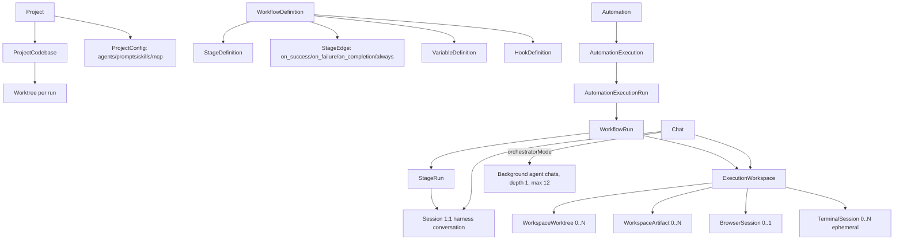
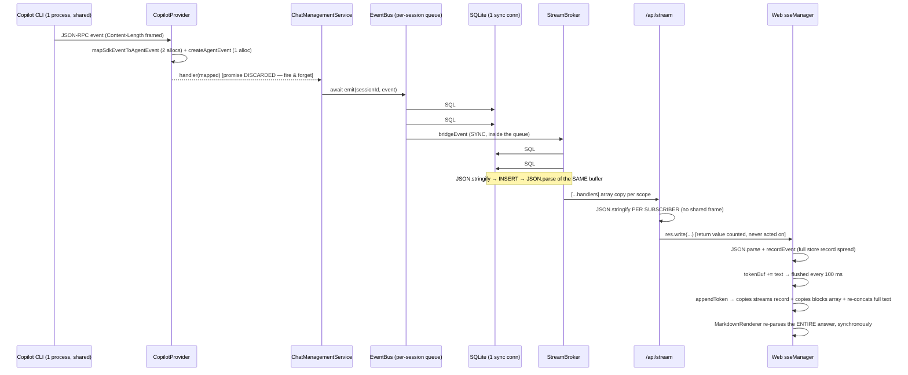
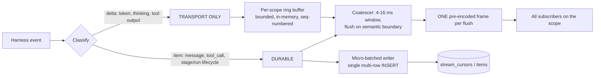

# GeneratorAI — End-to-End Architecture & Performance Review

> **Status:** Review document. No code was changed.
> **Date:** 2026-08-16
> **Method:** full source audit of `apps/*` + `packages/*`, live measurement against the running dev server (uptime 6.5 h at time of probe), live measurement of the 1.76 GB dev database, plus comparative study of 8 locally-cloned reference agentic apps and published architecture from Claude Code, Codex CLI, VS Code, Zed, Warp, Cursor.
> **Audience:** you, for review before any remediation work is scheduled.

---

## 0. Verdict in one page

GeneratorAI is **feature-complete far beyond its runtime's ability to carry those features concurrently.** The feature surface — 4 client surfaces, 3 execution objects, orchestrated background agents, multi-terminal, multi-browser, computer use, widgets/extensions, automations — is genuinely broad and, in places, well designed at the *domain* level. The **execution substrate underneath it is a single Node event loop, a single synchronous SQLite connection, and a single shared agent CLI process**, with no admission control, no work budget, no priority, and no isolation between subsystems.

The three structural facts that determine everything else, none of which are written down anywhere in the docs:

1. **Every streamed token performs ~12.8 synchronous SQL statements across 3.7 rows on one `better-sqlite3` connection, on the main thread.** Measured. That is the global throughput ceiling for the entire product — chats, runs, automations, orchestrator waves, all of them.
2. **Copilot is one CLI process for the whole server; Claude is one CLI process per turn.** The two providers have *inverted* failure modes and the orchestration layer above them is written as if neither existed. The `Semaphore(8)` documented as bounding "harness subprocess fan-out" bounds nothing for the default provider and does not apply to chats at all.
3. **Every expensive subsystem has its own cap tuned in isolation, and nothing anywhere reasons about their combined cost on the one event loop they share.** 5 terminals/workspace, 20 global, 5 browsers, 1 computer-use permit, 8 stages, unbounded chats, unbounded orchestrator workers. The caps bound *count*, not *work*. Five idle terminals cost nothing; two busy ones cost more than the entire browser subsystem.

**Empirically, right now, on your machine:**

| Measurement                             | Value                                                               | What it means                                                                                                         |
| --------------------------------------- | ------------------------------------------------------------------- | --------------------------------------------------------------------------------------------------------------------- |
| Server process RSS after 6.5 h          | **1,219 MB**                                                  | Unbounded map growth + retained turn closures + 4 MiB terminal buffers                                                |
| Orphaned`claude.exe` processes        | **24** (oldest 7 days old, ~870 MB total)                     | Per-turn CLI spawns with no reaper and no restart-time scan                                                           |
| Dev database                            | **1,759 MB**                                                  | `stream_cursors` 2.30 M rows / 893 MB + `events` 1.19 M rows / 531 MB = **81 % of the DB is the token log** |
| `chat_messages` rows                  | **6,922**                                                     | The actual conversational content is ~0.3 % of the DB by row count                                                    |
| Retention sweeper deletions to date     | **zero**                                                      | TTL default is 90 days; the oldest row is 85 days old                                                                 |
| Web bundle                              | **3,188 KB gzip** vs its own declared **800 KB** budget | `pnpm check:bundle` fails; 389 chunks; 385 KB gz entry chunk                                                        |
| Active workflow runs on the live server | **22**                                                        | 22 ×`setInterval(3000)` pollers, each re-scanning all stage rows, forever                                          |
| Idle API latency (p50)                  | 6–8 ms                                                             | Fine*when nothing is streaming*. This is the point: the system is only fast at rest.                                |

**The honest summary:** the architecture is not "slow." It is **unbounded**. Latency is fine at rest and degrades non-linearly and without warning under exactly the concurrent load the product is being sold on. Nothing sheds load; nothing rejects; nothing prioritises. It buffers until it stalls, and when it fails it fails hard (an unhandled rejection kills the process outright — §5.8.1).

The good news: **two config-level changes recover an 11× headroom improvement on the token path before any architectural work** (§9.1), and the reference projects on your own disk contain a proven blueprint for the rest.

---

# PART A — End-to-end architecture map

## A.1 Surfaces (where the core is exposed)

| Surface             | Path                                | Transport to core                                                                 | Independent code?                                                                             |
| ------------------- | ----------------------------------- | --------------------------------------------------------------------------------- | --------------------------------------------------------------------------------------------- |
| **Web SPA**   | `apps/web`                        | HTTP/1.1 REST +`EventSource` SSE + raw WS (terminal, browser, STT)              | Yes — 2,100-line hand-rolled`sseManager.ts`                                                |
| **Desktop**   | `apps/desktop` (Electron)         | Spawns the*real* server on a loopback port, loads `apps/web/dist` same-origin | Adds`WebContentsView` browser host + `cua-driver` computer-use host                       |
| **CLI / TUI** | `apps/cli` (Commander + Ink)      | HTTP REST + SSE                                                                   | Own store, own`EventRenderer`                                                               |
| **Mobile**    | `apps/mobile` (React Native/Expo) | HTTP REST + SSE, via relay or LAN pairing                                         | **Uses the shared `packages/client-core` event router** — the only surface that does |
| **SDK**       | `packages/sdk`                    | In-process (`createGeneratorAI()`) or HTTP                                      | Exposes`HarnessProxy`, which the server does not use                                        |
| **MCP**       | `packages/mcp-server`             | Tool adapter only; no standalone binary yet                                       | —                                                                                            |

**Architectural observation:** `packages/client-core/src/stream/eventRouter.ts` exists, is battle-tested, and is used by **mobile only**. Web reimplements the same semantic contract in a 2,100-line file whose header forbids anyone from touching it. Two implementations of one contract, with the better one running on the smallest surface. Mobile is architecturally superior to web on *every* axis measured in this review (§7.6).

## A.2 Execution objects and the domain model



Three execution objects — **Chat**, **Workflow Run**, **Automation** — all observed through one unified SSE endpoint `GET /api/stream?scope=…&id=…` with `Last-Event-ID` resume.

## A.3 The five planes (this is the map that matters)

The system is best understood as five planes that **all land on one thread and one DB connection**:

```mermaid
graph TB
  subgraph CP["CONTROL PLANE — Express, single process"]
    R[~30 REST routers] --> MW[requestId → metrics → CORS → json(2mb,+rawBody) → auth → rateLimit]
  end

  subgraph EP["EVENT / STREAM PLANE"]
    HB[Harness callback] --> EB[EventBus per-session promise queue]
    EB --> EV[(events table — v1, nothing reads it live)]
    EB --> BR[bridgeEvent → StreamBroker]
    BR --> SC[(stream_cursors — v2)]
    BR --> SUB[SSE subscribers: per-subscriber JSON.stringify]
  end

  subgraph NP["NATIVE RESOURCE PLANE"]
    T[NodePtyHost → terminal-ws] 
    B[ServerPlaywrightHost / ElectronBridgeAdapter → browser-ws]
    CU[CuaDriverBridge — NAPI in-process on Windows]
  end

  subgraph PP["PERSISTENCE PLANE"]
    DB[(ONE synchronous better-sqlite3 connection)]
    TXQ[withTransaction = global mutex, held across awaits]
  end

  subgraph XP["EXTENSION PLANE"]
    EXT[Hot-loaded extensions → widgets/tools/skills/prompts/hooks]
    WF[Widget iframes on :3101]
  end

  CP --> DB
  EP --> DB
  NP --> EP
  XP --> EP
  TXQ --> DB
```

**There is no boundary anywhere in this picture.** A terminal producing build output, a browser encoding JPEG frames, a computer-use accessibility walk, 4 chats streaming tokens, 22 workflow-run pollers and every HTTP request are the same thread contending for the same connection.

## A.4 End-to-end trace: one `harness.token` (the hottest path in the product)



Measured cost of one token, server side: **~12.8 SQL statements, 4 uncached `sqlite3_prepare_v2` compiles, 5 `JSON.stringify`, 2 `JSON.parse` (of a buffer it just produced), 3.71 rows, ~1.5 KB of disk, ~350 µs of blocking main-thread time.** With statement caching that drops to ~30 µs — an 11× delta from one change.

Client side, the same token contributes to an **O(N²)** markdown re-parse: a 40 KB answer costs ~4 s of cumulative main-thread parsing; a 200 KB answer locks the tab.

## A.5 Feature catalogue (what exists, and its concurrency posture)

| Feature                        | Concurrency limit                                                           | Enforced where                                               | Durable across restart?                           |
| ------------------------------ | --------------------------------------------------------------------------- | ------------------------------------------------------------ | ------------------------------------------------- |
| Chats                          | **none**                                                              | —                                                           | Session rows yes; in-flight turn no               |
| Workflow runs                  | `stageSemaphore(8)` **process-global**                              | `WorkflowRunService.ts:181`                                | Yes (`claimForExecution` atomic claim, redrive) |
| Automations                    | `maxConcurrency` default 1, **no ceiling**, in-process `for` loop | `AutomationService.ts:660`                                 | **No — undispatched iterations are lost**  |
| Orchestrator background agents | 12 per orchestrator,**no global cap**, depth 1 (enforced)             | `OrchestratorService.ts:48`                                | **No — task map is in-memory only**        |
| Terminals                      | 5/workspace, 20 global (counts corpses)                                     | `TerminalService.ts:143`                                   | No (ephemeral by design)                          |
| Browsers                       | 5 —**two independent caps, only one gets the env var**               | `BrowserService.ts:134` vs `ServerPlaywrightHost.ts:215` | Descriptor yes, process no                        |
| Computer use                   | **global semaphore of 1** (max 4)                                     | `ComputerService.ts:302`                                   | No                                                |
| Widgets (full-page)            | 6                                                                           | `ChatPage.tsx:1042`                                        | n/a                                               |
| Widgets (inline)               | **unbounded, never torn down**                                        | —                                                           | n/a                                               |
| Hooks                          | 22 stage phases + 10 workflow phases                                        | `HookExecutor.ts:130`                                      | Function-handler registry lost on restart         |
| SSE connections                | 6 per`(scope,id)`, 32 global scope — **no global total cap**       | `sseConnectionCap.ts:36`                                   | n/a                                               |

---

# PART B — Critical findings

Severity: **P0** = will cause visible failure/data loss under the stated target load. **P1** = major degradation. **P2** = measurable waste. **P3** = hygiene.

## B.1 Persistence — the global throughput ceiling

### P0-1 · `verbose` callback taxes every single SQL statement

`packages/db/src/index.ts:232-244`

```ts
verbose: (message?: unknown) => {
  const sql = typeof message === 'string' ? message : '';
  const op = sql.trimStart().split(/\s/)[0]?.toUpperCase() ?? 'UNKNOWN';
```

Three compounding problems:

1. Setting `verbose` at all forces `better-sqlite3` to call `sqlite3_expanded_sql()` on **every statement execution** — materialising the SQL with all parameters inlined, i.e. **re-serialising the entire ~1.5 KB JSON payload into a fresh JS string on every `stream_cursors` INSERT**.
2. `split(/\s/)` on that string is not lazy — it allocates an array of *every* whitespace-delimited token (hundreds of substrings) and discards all but `[0]`.
3. A `queueMicrotask` per statement, and the duration it records is measured to a microtask boundary, so the metric is also wrong.

**The meter is a no-op unless `OTEL_ENABLED=true`** (`instrumentation.ts:24`). You pay full price for metrics that are discarded by default. At 12.8 statements/token: roughly **1,000–4,000 transient string allocations per streamed token**. Four concurrent sessions at 50 tok/s ≈ 800 k allocations/s into the young generation.

### P0-2 · `prepare()` inside the transaction, twice, per event

`packages/db/src/repositories/StreamCursorRepository.ts:65,84`

No statement cache anywhere. Drizzle's `better-sqlite3` session also re-prepares on every query (`session.cjs:45`). **Measured: 350 µs/token uncached vs 30 µs/token cached — 11×.**

### P0-3 · Broker `append` bypasses `withTransaction`, so a broadcast event can be rolled back

`StreamCursorRepository.ts:58` uses `sqlite.transaction()` directly. When it fires while a `withTransaction` is open (`packages/db/src/index.ts:206`), better-sqlite3 degrades the nested transaction to a **SAVEPOINT inside the outer transaction** — meaning **a `stream_cursors` row can be rolled back after it has already been broadcast to SSE clients.** This directly violates the commit-then-broadcast invariant the entire streaming design rests on (AGENTS.md invariant #3).

### P1-4 · Two durable event logs; nothing reads one of them live

`events` (v1) and `stream_cursors` (v2). SSE reads **exclusively** from `stream_cursors` (`stream.ts:318` → `StreamBroker.subscribe` → `replayAfter`). The v1 log is written first, synchronously, on every event, and its `(workflow_run_id, stage_run_id)` columns are **unindexed** — measured full scan of **579 ms**.

Worse: the broker's noise filter drops `harness.session_info` / `harness.unknown` (reportedly ~98 % of one orchestrator turn's 19 k events) — but **after** `EventBus._doEmit` has already allocated a sequence and inserted the row.

### P1-5 · `withTransaction` is a global mutex held across `await`

`packages/db/src/index.ts:160,207,228`. One connection, one `BEGIN` at a time, per DB handle = process-global. Every multi-row write (run creation, stage rows, automation open) across *all* concurrent runs queues here. The 10 s deadline **rejects the caller but does not abort `fn`** (`:191`) — a runaway `fn` keeps issuing statements against a connection that has already `ROLLBACK`ed and moved on.

### P1-6 · Retention has never deleted a row

TTL default **90 days** (`AppConfig.ts:225`); oldest row is 85 days old. Result: `stream_cursors` 2.30 M rows / 893 MB, `events` 1.19 M rows / 531 MB = **81 % of a 1.76 GB DB**. Boot cost: `migrateDB` runs `INSERT OR IGNORE … SELECT MAX(sequence_id) FROM events GROUP BY session_id` **every boot** — measured **2.13 s cold**.

Also: `chats(project_id)` is declared in `schema.ts:345` but **is not on disk** → full scan. No `ANALYZE` has ever run (`sqlite_stat1` absent). `mmap_size=0`.

## B.2 Streaming backbone

### P0-7 · Backpressure is counted and then thrown away

`apps/server/src/routes/stream.ts:94-113`

```ts
const flushed = res.write(payload);
if (flushed) return true;
state.queued += 1;
if (state.queued > BACKPRESSURE_HIGH_WATER) { /* drop */ }
return true;   // ← caller is told everything is fine
```

- `drainWaiters` is declared (`:292`), spliced in `onDrain` (`:296`), cleared (`:356`) — **and never pushed to.** The "pause publishes until drain" mechanism described in the file's own header does not exist.
- `state.queued` counts *failed write calls*, not bytes, and resets to 0 on any drain. Effective ceiling is "256 consecutive failed writes", ≈ 400 KB of Node-internal buffer per connection — a proxy for the wrong quantity.
- `apps/server/src/composition/sseWrite.ts` implements a **correct** drain-awaiting writer. **Zero importers. Dead code.**

Good news: there is **no compression middleware** anywhere, and `X-Accel-Buffering: no` is set. The classic SSE killer is absent.

### P0-8 · The producer never slows down

`CopilotProvider.ts:1473-1477` calls `handler(mapped)` and **discards the returned promise**. The SDK read loop never blocks. If SQLite stalls (WAL checkpoint, retention sweep), the per-session emit chain grows without bound, each link retaining its event payload. **No depth limit, no shed policy, no memory ceiling** — not on the emit queue, not on `StreamBroker.subscribe`'s catch-up buffer (`:160`), not on per-connection SSE bytes.

### P1-9 · EventBus per-session queue serialises the *entire* fan-out, not just the DB write

`packages/core/src/events/EventBus.ts:88-100,179-183`. One queue per session (correct, and cleanup is correct). But `emitter.emit()` runs synchronously *inside* `_doEmit`, so `bridgeEvent` — 8 SQL statements, 2 JSON round-trips, all SSE writes — completes before the queue advances. **Token N+1 cannot begin until token N has finished writing to every subscriber.** The queue is not ordering the writes; it is the throughput ceiling of a single session's stream.

### P1-10 · No shared/pre-encoded SSE frame

`stream.ts:314` — every subscriber does its own `JSON.stringify({kind, payload})`. K subscribers on one scope = K serialisations of the same object, plus K template concats, plus K utf8→Buffer conversions.

### P1-11 · A second, entirely unmanaged SSE endpoint

`apps/server/src/routes/computer.ts:620-692` is hand-rolled SSE that: does **not** call `acquireSseSlot` (no cap), ignores `res.write()`'s return entirely, and runs a `while` loop **polling the filesystem every 250 ms** per connection. Every open Computer panel is a permanent 4 Hz fs-polling loop on the main thread.

### P2-12 · Duplicate SSE connections from bypass call sites

`sseManager` ref-counts by `${scope}:${scopeId}` correctly — but **four call sites bypass it and open raw `EventSource`s**: `ChatPage.tsx:429`, `ChatPage.tsx:492`, **every** `BrowserPanel.tsx:414` instance, `ComputerPanel.tsx:614`, `WorkflowRunPageV2.tsx:193`. With 3 browser tabs open (max 5 allowed), a single chat page holds **7 EventSources on the identical origin**.

**Chrome's HTTP/1.1 limit is 6 per origin, marked "Won't fix" in Chrome and Firefox** ([MDN](https://developer.mozilla.org/en-US/docs/Web/API/Server-sent_events/Using_server-sent_events)). The server is `node:http` with no HTTP/2 anywhere (`apps/server/src/index.ts:32,262`). So **every REST request, every image, every widget asset queues behind the streams, forever** — and `openAuthenticatedEventSource` retries with backoff on failure, so the symptom is a retry storm, not an obvious hang. **This is already exceeded today by one chat with three browser tabs, or two chat tabs with none.**

## B.3 Process & concurrency model

### P0-13 · Copilot: one CLI process for the entire server

`CopilotProvider.ts:338` constructs exactly one `CopilotClient`; `HarnessRegistry.ts:176-198` guarantees at most one adapter per type. **Every chat, every stage, every orchestrator worker, every automation iteration is an SDK *session* multiplexed over one JSON-RPC stdio pipe into one CLI process.**

Consequences:

- One runaway session (a multi-MB tool result) is buffered whole by `StreamMessageReader` and **blocks every other session's events** while it is read. Structural head-of-line blocking.
- Tool round-trips (browser `read_page`, widget state, computer-use screenshots) traverse the *same* pipe in the other direction.
- A CLI crash kills every conversation simultaneously. **Zero blast-radius isolation.**
- No pool, no cap, no backpressure, no per-session fairness.

### P0-14 · Claude: one CLI process per turn, unbounded

`ClaudeAgentProvider.ts:781,874` — `sendPrompt` spawns a `claude` CLI per call; `initialize()` is a no-op. **`ChatManagementService.sendPrompt` has no semaphore, no queue, no cap** (`maxConcurrentSessions` is enforced only in the legacy `SessionService`, which is not on the v2 chat path). 10 concurrent chats = 10 concurrently spawned CLIs. Nothing prevents 100.

**Measured live: 24 orphaned `claude.exe` processes, oldest 7 days old, ~870 MB.** Nothing reaps them; `StartupRecoveryService` scans for orphaned Docker containers but not for stray CLI processes.

### P0-15 · Synchronous `appendFileSync` per event, per active run

`packages/core/src/events/StreamLogger.ts:60-76,117`. `RunLogger` subscribes via `subscribeAll` (every event in the process) and **blocking-writes each match**. With 22 active runs, *every token event in the process is offered to 22 handlers*, and each match performs a blocking syscall on the event loop. This alone will dominate a CPU profile.

### P1-16 · `stageSemaphore(8)` is process-global and held across HITL waits

`WorkflowRunService.ts:181`, `Semaphore.ts:56-63` (holds until settle). The permit is held for the entire stage lifetime — including **human approval waits**, validation-retry loops, hook retry backoff (`retries=10` × up-to-60 s = 10 minutes), and the summary turn. **Eight stages parked on HITL and every workflow on the server stops**, including runs that need no approval. Chats keep working (they bypass the semaphore entirely), which makes the failure look random rather than systemic. No per-run, per-project or per-automation sub-allocation; plain FIFO with an unbounded waiter queue.

### P1-17 · Stage timeout does not cancel the model

`StageExecutionService.ts:1434-1441` — `Promise.race([sendPromptAndWait(...), createTimeout(ms)])` passes `undefined` as the abort signal, and `createTimeout` (`:2661`) never clears its timer. On timeout the model **keeps running and burning tokens forever**, the semaphore permit is released while the work continues, and a dangling timer is retained per stage. `releaseSessionSafe` (`:2675`) leaks a second 10 s timer per stage.

### P1-18 · Per-run 3 s polling loop layered on top of an event bus

`WorkflowRunService.ts:786-819`. One `setInterval(3000)` per active run, unconditional, doing `getById` + `getByRunId` + `onStageCompleted`/`onStageFailed` for **every terminal stage** on every tick, deduped only by an in-memory Set whose pruning is wrapped in `catch {}`. **With the 22 runs currently active, that is ~200 DB queries every 3 seconds doing nothing, forever.** You have both push and pull for the same state transition.

### P1-19 · DAGScheduler recomputes a SHA-1 of the whole definition on the hot path

`DAGScheduler.ts:67-83,129-138`. `hashDefinition` sorts stages and edges, `JSON.stringify`s every condition, and SHA-1s the lot. It is called from `getReadyStages`, `routeFromTerminalStage`, `getSkippableStages`, `isDAGComplete` and `getRootStages` — **several times per stage completion**. And it is computed *after* the two DB reads it exists to make cheap, so the cache saves only a Kahn sort, never the I/O. **Net negative.** A single stage completion drives roughly **a dozen DB round-trips** before the next stage launches.

Also: `runQueues`/`runQueueActive` are **module-level globals**, not instance state (`:27-28`) — two `DAGScheduler` instances silently share one lock namespace.

### P1-20 · ~7 git subprocess spawns per stage start *and* per chat turn

`GitShadowRefStore.ts:44-72` → `git rev-parse`, `git add -A`, `git write-tree`, `git commit-tree`, `git update-ref`, `git diff --numstat`, `git diff --name-status -z`, **per repo**, awaited before the first token (`StageExecutionService.ts:790`, `ChatManagementService.ts:1957`). `git add -A` walks the whole worktree. 8 concurrent stage starts = **56 git processes at once**; on Windows (spawn ~30–80 ms) that is seconds of wall clock plus disk saturation before any prompt is sent.

### P2-21 · Up to 5 sequential model round-trips per stage

Predecessor context (`:1204`), validation feedback (`:1237`), each hook context message (`:1261`), the main prompt, and the summary (`:1610`) are each a **separate full turn**. In `contextFilter: 'full'` mode the predecessor turn carries every predecessor's complete raw output (`:1150-1158`) — the fastest possible way to blow the context window on a wide DAG.

### P2-22 · `HarnessRegistry.refresh()` cold-probes *both* providers on the create-conversation path

`MultiHarness.ts:82-86` → `HarnessRegistry.ts:213-283`, TTL 5 min. Every 5 minutes the first new chat pays a **~10 s stall** while the *other* provider's CLI boots, including Claude's `withControlSession` spawn just to list models.

## B.4 Native resources

### P0-23 · Terminal scrollback is `Buffer.concat` per chunk — the worst line in the codebase

`packages/core/src/services/TerminalService.ts:189-196`

```ts
const next = Buffer.concat([rec.scrollback, chunk]);
if (next.length > this.cfg.scrollbackBytes) {
  rec.scrollback = next.subarray(next.length - this.cfg.scrollbackBytes);
```

Once the buffer saturates at 4 MiB (default), **every single PTY chunk allocates a fresh ~4 MiB `ArrayBuffer` and memcpys 4 MiB into it.** These are far above `Buffer.poolSize`, so each is an external allocation the GC must reclaim, and the `subarray` view makes the previous one garbage immediately.

At 200 chunks/s (a normal `pnpm build`): **800 MB/s of memcpy and 800 MB/s of 4 MiB external allocations, per terminal.** At 1000 chunks/s (`cat` a large file, `yarn install`): **4 GB/s.** This saturates a core and drives major GC pauses that stall the entire event loop — which means **your chat tokens stutter because someone ran a build in a terminal tab.**

The code has the memory bound of a ring buffer with the cost profile of an unbounded array. The docs describe it as "an in-memory ring buffer."

### P0-24 · Browser screencast generator deadlocks on stop — leaks on the *normal* path

`ServerPlaywrightHost.ts:863-871`

```ts
while (!entry.disposed) {
  if (queue.length === 0) {
    await new Promise<void>((resolve) => { waiter = resolve; });   // never resolved
    continue;
  }
```

`stop()` sets `entry.disposed = true` (`:530`) and closes the context — but **never resolves `waiter`**, and nothing else can (the CDP session that would has just been detached). Cascade:

1. The generator hangs forever; its `finally` never runs → subscriber never removed, `screencastActive` stays `true`, handler stays attached.
2. `streamViaScreencast`'s `await iterator.next()` hangs → **`clearInterval(keepaliveTimer)` never runs** (`browser-ws.ts:177-180`).
3. A permanent timer plus its entire closure (ws, iterator, host entry) leaks, calling `seedFrame()` → throw → swallowed by `.catch(() => undefined)`, forever.
4. The outer `ws.close()` never runs.

**This leaks on every LRU eviction and every idle-pause — the normal path, not an edge case.**

### P0-25 · The idle sweeper kills a browser the user is actively watching

`BrowserService.ts:153-170` stops any session with `visibility !== 'visible'` after 5 minutes. Default visibility is `'headless'` (`:1059`) and the **only** thing that bumps `lastActivityAt` is `emitAction` (`:1099`). Neither `screencast()` (`:505`) nor `frame()` (`:516`) touches it. **Watch the live browser pane for five minutes without the agent acting and your browser is killed underneath you** — and it leaks a timer on the way out (P0-24).

### P1-26 · One full Chromium browser tree per workspace

`ServerPlaywrightHost.ts:239` — `launchPersistentContext` per workspace, each with its own profile dir and `--remote-debugging-port`. **These are browsers, not contexts.** Five concurrent = 5 browser processes + 5 GPU processes + 5 network services + ≥5 renderers ≈ **1.5–2.5 GB**.

Nothing requires this. Profile isolation, permissions, `context.route()` allowlists, `addInitScript` and cookies are all **per-context** APIs. The only thing genuinely needing a separate browser is the per-session CDP port for `playwright-cli` attach — and that is one port per browser anyway. **This is the largest single memory win available in the codebase.**

Cold start is **1.0–2.5 s fully blocking the caller**: `findFreePort` sequentially binds/closes up to 200 real sockets (`:1396`), then `launchPersistentContext` (600–2000 ms), then `waitForCdpReady` 50 ms-polling `/json/version` (100–400 ms), then 5 sequential CDP awaits plus **4 `addInitScript` calls**. And LRU eviction runs `await this.stop(victim)` **inline on that path** (`BrowserService.ts:245`).

### P1-27 · No output coalescing on the terminal WebSocket — and the doc claims otherwise

`terminal-ws.ts:131` — `ws.send(chunk, {binary:true})` fires **once per PTY chunk**, unconditionally. No `setImmediate` accumulator, no flush timer, no 32 KB cap.

`feature-integrated-terminal.md` states: *"Server also coalesces PTY chunks with `setImmediate` and flushes every ~4 ms, up to 32 KB per WS frame."* **That code does not exist.** At 500 chunks/s × 5 terminals you are making 2,500 `send()` calls/s, each traversing the ws sender queue into `net.Socket.write` — straightforwardly 4–10× more event-loop work than the documented design.

### P1-28 · Terminal watermark is per-connection but acts on the shared PTY

`terminal-ws.ts:118-200` — `unackedBytes`/`paused` are locals of `handleConnection`, but `pause`/`resume` act on the shared session. Two clients on one sid: A pauses at 256 KB unacked, B's ACK resumes the PTY that A is drowning in. A's `bufferedAmount` grows until the circuit breaker fires, and gets undone by B's next ACK.

### P1-29 · Computer use serialises everything through a global permit of 1

`ComputerService.ts:302`, `AppConfig.ts:278` — `maxConcurrentSessions` default **1**, max 4. The name is a lie: it is the permit count for **actions**, and `ComputerService` is a composition-root singleton, so the semaphore is **process-global across every workspace, every chat, every run**. `withPermitFor` holds until the work settles (explicitly not on the timeout race), and `actionTimeoutMs` is 30 s. **One stuck driver call blocks every computer-use action server-wide for 30 seconds.**

Partly defensible — there is one physical desktop — but **read-only operations (`snapshot`, `list_windows`, `verify`) do not touch the foreground and are needlessly serialised behind 30 s synthetic-input calls.** A reader/writer split is the correct model.

### P1-30 · 3–4 driver round-trips + a full-screen PNG per computer-use action

`ComputerService.ts:1090-1160` — one `computer_click` costs: `listApps` + `list_windows`, a consent DB read, semaphore acquire, `list_windows` **again** (`reResolve`, unconditional even when consent was cached), the actual driver call, a **full-screen PNG written to disk** (`screenshotEveryAction` defaults to **`true`**, `AppConfig.ts:285`), an artifact DB row, an audit DB write, and an EventBus emit (which is itself DB-backed). At 1920×1080 that is **1–3 MB written per click**.

Additionally, **the driver runs in-process via NAPI on Windows by default** (`CuaDriverBridge.ts:10-18`). Every UIA tree walk occupies one of the **four** default libuv threadpool slots — the same pool serving all `fs` work, artifact reads and workspace creation. A 1200-element snapshot of a slow app blocks 25 % of the fs threadpool. Nothing raises `UV_THREADPOOL_SIZE`.

And the accessibility tree crosses the boundary as **JSON three times**: Rust struct → JSON string → `JSON.parse` → `parseWindowState` → `ComputerElement[]`. For a 1200-element snapshot that is 300 KB–1 MB materialised, doubled transiently, then retained.

### P1-31 · `readScreenshot` loads every artifact row to find one by id

`ComputerService.ts:1449-1471` — `findByWorkspace()` (all artifacts) → linear `.find()` → `fs.readFile` the **whole** file → **then** check `screenshotMaxBytes` → then a base64 copy (+33 %). Three copies of the image resident at peak, and the size check happens after the read.

### P1-32 · Browser input: a hardcoded 120 ms sleep after every click, inside a global chain

`ServerPlaywrightHost.ts:737-747` + `browser-ws.ts:83-96`. `inputChain` is a single FIFO promise chain across *all* event types for the connection (correct for ordering), and every `mouse.click` adds **120 ms of dead time** to it. `mouse.down`/`up` each do a `mouse.move` first (2 CDP round-trips per half-click). `Ctrl+Shift+P` = **7 sequential CDP round-trips**. There is **no input rate limit** on the browser WS (unlike the terminal's 200/s) and **no bound on `inputChain` depth** — a client sending `mouse.move` at 500 Hz builds an unbounded chain the server processes for minutes after the client stops.

### P1-33 · Transport is chosen by catching an exception

`browser-ws.ts:115-131` — try `streamViaScreencast()` (CDP `Page.startScreencast`), and if the first `iterator.next()` throws, fall back to `streamViaPolling()`: a **20 fps `page.screenshot()` loop**. Each `page.screenshot()` is a `Page.captureScreenshot` round-trip with full-viewport re-encode, measured 15–40 ms — **30–80 % duty cycle of an entire core, permanently, per browser**, and it never actually reaches 20 fps.

This path is reached whenever anything opens the stream endpoint against a desktop native-mode workspace: mobile, a second web client on the LAN, the relay, an E2E test. That is **the worst of both worlds** — full on-screen `WebContentsView` rendering *plus* a 20 fps compositor readback that visibly stutters the UI. `IBrowserBridge` should expose `supportsScreencast: boolean`; capability negotiation by exception is not negotiation.

There is also a **third** capture path running concurrently: the SPA polls `GET /workspaces/:id/browser/screencast.jpg` every ~500 ms (`BrowserPanel.tsx:1116`), each poll a full `page.screenshot()`.

### P1-34 · Screencast FPS/quality is negotiated by three independent clamps

env default 20 (`browser-ws.ts:104`) → host clamp `Math.min(15, …)` default 5 (`ServerPlaywrightHost.ts:817`) → `BrowserConfig.screencastFps: 5` (never reached). **Per-workspace `browserConfig.screencastFps/Quality` are silently ignored.** And `Page.startScreencast` params are set by the **first subscriber only** — a second client asking for different settings piggybacks on the first's, silently.

Per-frame cost at 1280×800 q60 (~80 KB JPEG): Chromium encode 3–8 ms, CDP base64 wrap ~107 KB, `JSON.parse` → **~214 KB transient UTF-16 string**, `Buffer.from(...,'base64')` 80 KB, one `screencastFrameAck` round-trip. At 15 fps that is **~3.2 MB/s of transient UTF-16 strings per session**; at N=5, ~25–60 % of a core of non-parallelisable event-loop time plus 50–125 % of a core of Chromium encode.

Backpressure exists but only as a **drop**: `bufferedAmount > 512 KB` skips the send (`browser-ws.ts:108`) — **it does not throttle capture.** Chromium keeps encoding, the ack keeps firing, the base64 decode keeps running, and the frames go in the bin. **A slow client costs exactly as much CPU as a fast one.**

## B.5 Resource lifecycle & leaks

### P0-35 · `browserService.stop` is not registered on workspace delete

`WorkspaceManager.registerBeforeDelete` has five listeners (`composition-root.ts:903,966,1150,1264,1292`): review threads, checkpoints, agent staging, computer service, terminal service. **The browser is not one of them.** Deleting a workspace `fs.rm`s the tree, including `<rootPath>/browser/profile`, **while a Chromium is still running against it.** Chromium with a yanked profile dir does not exit — it thrashes on failed writes. The process leaks, its CDP port leaks, its `HostEntry` leaks. Nothing reaps it.

Note also that the listener order is **registration order**, awaited sequentially, errors swallowed. It is *accidentally* correct today (DB work before native-handle release) purely because those services happen to be constructed last. There is no priority, no phase, no dependency declaration.

### P0-36 · Git worktrees are never unregistered — orphans accumulate in the user's own repos

`WorkspaceManager.ts:266-292` `fs.rm`s `<rootPath>/source/<alias>` but **never calls `git worktree remove` or `git worktree prune`**. `WorktreeService.removeWorktree` (`:138-159`) exists and does the right thing; **nothing on the workspace-delete path calls it.** Instead `worktreeRepo.deleteByWorkspace(workspaceId)` drops the rows that would let anyone find the orphans later — and `cleanupOrphanedWorktrees` (`:173-200`) finds orphans *via those rows*, so it can never see them.

**Every deleted workspace leaves a stale entry in the user's own repository** under `.git/worktrees/<alias>` pointing at a path that no longer exists. These accumulate forever, slow down every `git worktree list` / `git status` in that repo, and can block re-creating a worktree with the same branch name. **This is the only defect in this review that damages state outside the app's own directories.**

### P1-37 · Unbounded in-process maps

| Map                                                                                        | File:Line            | Status                                                                                                                                                                                                              |
| ------------------------------------------------------------------------------------------ | -------------------- | ------------------------------------------------------------------------------------------------------------------------------------------------------------------------------------------------------------------- |
| `EventBus.sequenceCounters`                                                              | `EventBus.ts:25`   | **never pruned** — one entry per session ever seen, for process lifetime                                                                                                                                     |
| `EventBus.persistFailures`                                                               | `EventBus.ts:48`   | values capped at 200;**keys never pruned**                                                                                                                                                                    |
| `ChatManagementService.conversationBindings`                                             | `:867`             | set at`:1472`/`:1884`, **never deleted**                                                                                                                                                                  |
| `ChatManagementService.{turnContexts,turnFinalizers,cancelledTurns,activeSubscriptions}` | `:192-211`         | cleared on`harness.idle` — **a turn that never reaches idle leaks all four**, including the `finalizeTurn` closure retaining the full turn metadata (thinking text, every tool call, every text segment) |
| `OrchestratorService.{tasks,waveWarmup,activeByParent,parentSubs,parentSessions}`        | `:87-95`           | five parallel maps,**no cancellation path clears them**                                                                                                                                                       |
| `WorkflowRunService.processedStageRuns`                                                  | `:51`              | pruned best-effort inside`catch {}`                                                                                                                                                                               |
| `rateLimit.perKeyBuckets`                                                                | `rateLimit.ts:74`  | "opportunistic GC" scans 32 entries per request above 1024 —**an eviction policy that cannot keep up with its own insertion rate**                                                                           |
| `workflowRunStore.timelineEvents` (web)                                                  | `:283-287`         | **unbounded, O(n²) append, retains raw `outputData`**                                                                                                                                                      |
| `streamStore.streams['stageRun:*']` (web)                                                | —                   | **never cleared** for the page's lifetime                                                                                                                                                                     |
| Inline widget iframes (web)                                                                | `reducer.ts:18-21` | preserved by design across every turn; accumulate for the page's lifetime                                                                                                                                           |

**Live evidence: 1,219 MB server RSS after 6.5 h.**

### P1-38 · Immortal terminals

`TerminalService.ts:382-385` bumps `lastActivityAt` on every **output** chunk. A `pnpm dev` server logging once a minute keeps its PTY alive **forever** with no client attached and no persistence — an invisible PTY nobody can find in the UI after a reload, permanently consuming one of the 20 global slots. The global cap check uses `this.sessions.size`, which **includes exited-but-not-yet-reaped corpses** (retained 5 min), so you can be refused a spawn server-wide because of 20 dead records.

### P1-39 · Listener leak inside a `while` loop

`computer.ts:145-168` — `res.on('close', …)` is registered **inside** the tail-follow loop. `res` is long-lived, `chunk` is not. After 11 chunks Node emits `MaxListenersExceededWarning`; over a long recording it accumulates hundreds of closures each retaining a promise resolver. It also `fs.stat`-polls every 250 ms instead of using `fs.watch`.

## B.6 Durability & correctness

### P0-40 · Any unhandled rejection kills the server

`apps/server/src/index.ts:67-73`

```ts
process.on('unhandledRejection', (reason) => {
  if (isDeadPipeError(reason)) { ...; return; }
  throw reason;
});
```

Throwing inside an `unhandledRejection` handler produces an `uncaughtException`. **There is no `process.on('uncaughtException')` anywhere in the server.** Therefore **any unhandled promise rejection that is not EPIPE-class kills the process.** That would be defensible if floating promises were rare — they are not (e.g. `chats.ts:313` calls `eventBus.emitGlobal({...})` inside a `.catch()` handler with no `await` and no `.catch()`; if sequence allocation throws on `SQLITE_BUSY` past the 5 s busy_timeout, the process dies). **One failing session can take down the whole server**, and no supervisor is described in `index.ts`.

### P0-41 · Automations lose work on restart, silently

`AutomationService.ts:600-655` builds `iterations[]` in memory and drives it with an in-process `for` loop. **Only *dispatched* attempts get an `automation_execution_runs` row** (`:840`). `AutomationRecoveryService` only *finalizes* executions (`:83-158`) — it never resumes one. **A 1000-row batch that dies at row 40 loses 960 rows silently**, and the execution row sits in `running` until a later boot finds all children settled and mislabels it `completed`.

### P1-42 · `MultiHarness` conversation ownership is not persisted

`composition-root.ts:306-310` constructs it with `store = undefined`, so `hydrate()` is a no-op and `ownerOf` falls back to `registry.primary` (`MultiHarness.ts:70-72`). **After restart, a Claude-owned chat routes to Copilot with a session id Copilot has never seen.** One-line wiring fix for a correctness bug.

### P1-43 · Orchestrator state is in-memory only

`OrchestratorService.ts:87-95`. Restart = total amnesia; `check_background_agent` returns a synthetic `failed` digest for a worker that is in fact still running (`:361-364`).

### P1-44 · The hook bridge — the whole "block a tool before it runs" feature — is inert

`ChatManagementServiceExtensions.buildHookBridge` is optional (`ChatManagementService.ts:115`) and a workspace-wide grep finds **zero assignments outside tests**. `HookInterceptor.buildHookBridge` (`:353-373`) is real code that would run `pre_tool_use`/`post_tool_use` on every tool call — but it is never wired. This is simultaneously a **feature/correctness gap** and, if it were wired, a **P1 perf problem** (`HookExecutor.ts:130` does an O(n) filter + O(n log n) sort per invocation with no phase index — 40 hooks × 200 tool calls = 16,000 filter+sort passes on the critical path).

### P1-45 · Chat worktree creation is fire-and-forget while `workingDirectory` already points at it

`ChatManagementService.ts:1173-1202` sets `conversationConfig.workingDirectory` to the *predicted* path at `:1186` before `git worktree add` has created it. The comment itself admits creation "can take 10-30s for large repos." **If the user sends a message inside that window, the SDK session's cwd does not exist.** There is no readiness gate.

### P2-46 · Blocking workspace creation on the create-chat request

`WorkspaceManager.ts:74-149` — **11 sequential `fs.mkdir`, 5–11 `git` process spawns, 3 DB round-trips**, all `await`ed inline. `initCodeRootRepo` runs `git add -A` on the **entire user repo** when it has no HEAD (`:565-570`), with a 15 s timeout per git call — so **worst case this holds an HTTP request for 90+ seconds.** No `Promise.all` on the mkdirs, no background handoff. Workflow worktree creation iterates codebases **sequentially** (`WorktreeService.ts:102-133`): four codebases = four serial full checkouts on the request path, for independent repos.

## B.7 Web frontend

### P0-47 · Full markdown + syntax-highlight re-parse of the entire answer, 10×/sec

`StreamPanel.tsx:138` passes `seg.text` — the full accumulated answer — to `MarkdownRenderer`. Every 100 ms flush it grows, the memo misses, and the whole pipeline re-runs: `micromark → mdast → remark-gfm → remarkPreserveMeta (recursive full-tree walk) → mdast-to-hast → rehype-highlight with detect:true → hast-to-React`.

`detect: true` runs **highlight.js language auto-detection on every unlabelled fence, on every pass** — the most expensive mode of the most expensive plugin.

Total work is Σ c·(iN/k) ≈ **c·N·k/2 — quadratic in answer length**:

| Answer | Flushes | Total main-thread parse                                                  |
| ------ | ------- | ------------------------------------------------------------------------ |
| 5 KB   | 60      | ~0.12 s                                                                  |
| 40 KB  | 500     | **~4 s**                                                           |
| 200 KB | 2500    | **minutes, at 2–4× the flush budget — the tab is unresponsive** |

The 200 KB case is not hypothetical: `harness.message_complete` injects the entire response in one shot when the provider doesn't stream deltas (`sseManager.ts:355-366`).

`MarkdownBody` is exported and documented (`:42-45`) as existing precisely so "block-level streaming can skip re-parsing blocks whose source slice hasn't changed." **No caller uses it. The fix was designed and never wired up.**

Meanwhile the app boots **8 Shiki web workers preloading 16 grammars at the app root** (`App.tsx:26`, `DiffProviders.tsx:26-43`) — on the Dashboard, on Settings, on every page — and that highlighter is used **only by the diff surfaces**. The app pays for two highlighters and offloads the one that isn't in the hot path.

### P0-48 · Chat virtualization is unreachable dead code, and there is no way to load more than 50 messages

`ChatMessageList.tsx:29` switches to `@tanstack/react-virtual` above **80** messages. `useChatMessages(chatId)` defaults to **50** (`queries.ts:388`) and `ChatPage.tsx:71` passes no limit. **The threshold is never crossed. There is no pagination UI and no infinite scroll.** So the honest answer to "what happens at 2000 messages" is: *you can never see more than the last 50, and there is no way to ask for more.* That is a correctness bug wearing a performance fix's clothes.

### P0-49 · `WorkflowRunPageV2` subscribes to the entire `streams` record

`WorkflowRunPageV2.tsx:90` — `useStreamStore((s) => s.streams)` subscribes the run page to **every stream in the app**, including unrelated chats. `pickStageStreams` then builds a fresh object every time (`deriveRunView.ts:346`), so the downstream `useMemo` on `deriveRunView` (`:255`) **never hits**. The comment at `:84-85` claiming the subset selector keeps re-renders scoped is wrong. 20 stages × 500 blocks × 3 passes × 10 Hz ≈ **300 k block visits/sec**.

### P1-50 · Hidden RightPane tabs stay fully live

`RightPane.tsx:748-756` mounts every tab and hides inactive ones with `invisible pointer-events-none` — layout still computed, effects still run, sockets still stream, timers still fire. `ChatPage.tsx:977` passes `open={true}` unconditionally, so **up to 5 hidden browser tabs keep decoding JPEG at full fps.** There is a `document.visibilityState` gate on the HTTP polling fallback but **none on the WebSocket path** — a backgrounded window keeps pulling and decoding frames.

Compounding it: `tabs={{…}}` is an inline object literal (`ChatPage.tsx:931`) with fresh render closures, so `RightPane` calls `def.render(...)` for **every mounted tab on every ChatPage render** — 10×/s during a stream.

### P1-51 · The invalidation storm is worse than the polling

Global `staleTime: 0` + `refetchOnWindowFocus: true` (`QueryProvider.tsx:45-48`) means every `invalidateQueries` on a mounted query is an immediate refetch, and **every alt-tab refetches every mounted query (~15 simultaneous requests on a run page)**.

- `harness.message_complete` → two rounds of invalidation, the second on a bare `setTimeout(…, 1000)` (`sseManager.ts:370-373`)
- `workspace.changed` → **7** keys; `checkpoint.restored` → **8** keys
- **every** `stage_run.*` event invalidates the whole `workflowKeys.runs` list (`:1301`) — a 20-stage run with ~8 status events/stage = **160 full run-list refetches per run**

Plus **24 distinct polling loops** — with 5 runs open that is **~350 requests/min sustained**, on top of 5 SSE streams, against a server with one synchronous SQLite connection.

Mobile solves exactly this by de-duplicating invalidations per 16 ms tick (`useChatStream.ts:71-101`). Web does not.

### P1-52 · Bundle is 4× over its own declared budget

`pnpm check:bundle` → `total gzip: 3188.4 KB (budget 800.0 KB)` **FAIL**. Entry chunk **1,286.6 KB raw / 385.4 KB gzip**; **389 JS chunks**; 13.87 MB raw total. `vite.config.ts:121-124` has **no `manualChunks`, no vendor split** — React/router/query/zustand/lucide all in one entry chunk that changes on every app edit, defeating long-term caching. `sourcemap: true` in production ships 5.4 MB of `.map` for the entry chunk alone. Most of the 389-chunk count and the `emacs-lisp`/`cpp`/`wasm`/`wolfram` chunks are Shiki grammars pulled in by the root-mounted `DiffProviders`.

### P1-53 · Widget sandbox collapses to same-origin when `assetsBase` is empty

`WidgetFrame.tsx:216` uses `sandbox="allow-scripts allow-forms allow-same-origin allow-downloads"` — the canonical sandbox escape, *currently* safe only because the frame loads from `127.0.0.1:3101`. But `WidgetFrame.tsx:64` falls back to `''` (host-origin-relative) when `assetsBase` is empty, and `sseManager.ts:424` defaults `assetsBase` to `''` when the event omits it. **An empty `assetsBase` grants the widget full same-origin access to the app: DOM, `localStorage`, and whatever the auth runtime keeps there.** The bridge has the same fallback (`:128` → `window.location.origin`), so origin-pinned `postMessage` validation (`widgetBridge.ts:143`) also collapses to "accept anything from the host." Flagged here because widgets are LLM-authorable via `write_extension`.

### P2-54 · Terminals are the only RightPane resource with no instance cap

`ChatPage.tsx:999-1002` — browser has 5, widget has 6, **terminal has none**. Each terminal takes a WebGL context; Chrome silently drops the oldest past ~16 live contexts, which surfaces as a randomly-blank terminal with no error.

Credit where due: the terminal client is the **best-engineered surface in the web app** — `term.write(bytes, cb)` with a client ACK every 64 KB (`TerminalPanel.tsx:135,386-392`) is real end-to-end flow control, `scrollback: 5000`, WebGL with try/catch fallback. It is the one place the codebase gets streaming right.

### P2-55 · CLI TUI does one full Ink reconcile per token

`store.ts:267-278,369` — `applyEvent` per event with no coalescing; `useSyncExternalStore` turns each into a **full Ink component-tree re-render**. `maxFps: 30` (`launch.tsx:206`) throttles the terminal **write**, not the reconcile or the Yoga layout pass. At 200 tok/s that is **200 reconciles/second of the whole workbench**, of which 30 produce visible output. The comment calls it a "render cap"; it is a paint cap. The fix is to port mobile's 16 ms drain loop — the CLI already has the pieces.

## B.8 Middleware & boot cost

| Item                                                                                                                     | Evidence                                     | Cost                                                                                                                          |
| ------------------------------------------------------------------------------------------------------------------------ | -------------------------------------------- | ----------------------------------------------------------------------------------------------------------------------------- |
| `resolveRoutePolicy` iterates **all ~45 policies**, re-splitting **both** the request path and each prefix | `packages/auth/src/routePolicy.ts:160-172` | **~90 `String.split` + ~90 array allocs per `/api` request**, for a table that is static at module load             |
| Every authenticated API call performs a**device-table UPDATE** (`devices.touch`)                                 | `AuthService.ts:234`                       | 1 DB write per request                                                                                                        |
| Opening one SSE connection costs**3 DB operations** (ticket consume + device read + audit write)                   | `AuthService.ts:282-327`                   | A web client opens 4 per chat tab; reconnect storms are write storms                                                          |
| `express.json({verify})` retains `req.rawBody` (up to 2 MB) on **every** JSON request for one webhook route    | `app.ts:79-87`                             | Needless retention per in-flight request                                                                                      |
| `fs.existsSync` per non-API GET in production                                                                          | `staticFiles.ts:50`                        | Sync syscall on the loop                                                                                                      |
| `httpActiveRequests` never decrements for open SSE; `http.route` cardinality unbounded                               | `requestMetrics.ts:41-51`                  | The metric is wrong precisely when it matters                                                                                 |
| `DurableSleepService` polls every **5 s** whether or not any stage has ever slept                                | `DurableSleepService.ts:122`               | **17,280 no-op queries/day**                                                                                            |
| Push target refresh every 30 s rebuilds the full Map**even with zero push tokens**                                 | `composition-root.ts:1033`                 | 2 DB reads/30 s forever                                                                                                       |
| `migrateDB` boot aggregate over `events`                                                                             | `composition-root.ts:165`                  | **2.13 s cold boot** on the current DB                                                                                  |
| Pino`redact` includes `sessionId`                                                                                    | `Logger.ts:55`                             | **The primary correlation key is scrubbed from every log** — this actively obstructs the debugging of everything above |

## B.9 Documentation ↔ code divergences

These matter because reviewers and agents trust the docs.

| Doc claim                                                                                                                      | Reality                                                                                                                            |
| ------------------------------------------------------------------------------------------------------------------------------ | ---------------------------------------------------------------------------------------------------------------------------------- |
| Terminal "coalesces PTY chunks with`setImmediate`, flushes every ~4 ms, up to 32 KB per WS frame — 4–10× fewer WS frames" | **No such code.** One `ws.send` per chunk, `terminal-ws.ts:131`                                                          |
| Terminal scrollback is "an in-memory**ring buffer**"                                                                     | `Buffer.concat` + `subarray`, O(n) per append, 4 MiB alloc per chunk                                                           |
| "real OS-level XOFF via node-pty"                                                                                              | `proc.pause()` pauses the reading socket → pipe backpressure. Different mechanism, different latency, weaker ordering on ConPTY |
| `browserConfig.screencastFps` / `screencastQuality` are user-configurable                                                  | Ignored; the WS path reads env vars and re-clamps twice                                                                            |
| `GENERATORAI_BROWSER_MAX_CONCURRENT=5` is *the* cap                                                                        | Two independent caps (soft LRU in`BrowserService`, hard throw in `ServerPlaywrightHost`); only one receives the env var        |
| `maxConcurrentSessions` (computer use)                                                                                       | A per-**action** semaphore, process-global, default **1**                                                              |
| `registerBeforeDelete` "so their native processes never outlive a deleted workspace"                                         | True for PTYs and the CUA driver.**Chromium is not registered at all**                                                       |
| `Semaphore(8)` "bounds how many harness subprocesses spawn at once"                                                          | Bounds nothing for Copilot (one process total) and does not apply to chats at all                                                  |
| Session caps → HTTP 429                                                                                                       | Enforced by`err.message.includes('cap (')` string matching                                                                       |
| AGENTS.md invariant#3: commit-then-broadcast                                                                                   | Violated whenever a broker append nests inside a`withTransaction` (SAVEPOINT)                                                    |
| AGENTS.md invariant#6: `acquireSseSlot` release in `res.on('close')` for every SSE handler                                 | `computer.ts:620` never acquires a slot at all                                                                                   |

---

# PART C — What actually happens under the target load

**Scenario:** 5 chats + 3 workflow runs + 1 automation × 20 iterations + 5 terminals + 3 browsers + 2 computer-use sessions. Single Node process. Copilot primary. This is the load the product is being positioned on.

**Steady-state resident:**

|                                                                              |                                                                                                                                                             |
| ---------------------------------------------------------------------------- | ----------------------------------------------------------------------------------------------------------------------------------------------------------- |
| 3 × Chromium browser trees                                                  | 0.9–1.5 GB                                                                                                                                                 |
| 5 × 4 MiB terminal scrollback                                               | 20 MB resident, plus transient churn below                                                                                                                  |
| 2 × computer-use snapshot caches                                            | 20–80 MB                                                                                                                                                   |
| Node heap (5 chats' stream state, 23 run loggers, event bus, unbounded maps) | 0.3–1.2 GB (**measured 1.2 GB at 6.5 h idle-ish**)                                                                                                   |
| Timers                                                                       | 23 × 3 s run pollers, ~16 SSE heartbeats, 1 × 5 s durable-sleep poll, 1 × 2 s browser keepalive per session, 1 × 250 ms computer preview per connection |

**Failure sequence, in order:**

1. **Terminal `Buffer.concat` GC storm dominates.** Two of five terminals producing build output at 200 chunks/s = **1.6 GB/s of memcpy + 1.6 GB/s of 4 MiB external allocations**, plus 400 unbatched `ws.send()`/s. The memcpy alone is 40–60 % of a core; the allocation rate forces continuous major GC. **Every major GC pause stalls SSE delivery to all 5 chats.** Users report "the chat froze" and blame the model.
2. **Event-loop starvation from `appendFileSync`.** 500–2000 events/s × (1 `events` INSERT + 1–3 `stream_cursors` INSERTs on a *synchronous* driver + 23 handler dispatches + ≥1 blocking file append). The loop is pinned. SSE latency spikes into seconds; the web client's dedup starts discarding late events.
3. **Semaphore starvation.** The automation's 4 concurrent iterations × 6 stages compete with 3 manual runs for **8 global permits**. Four stages parked on HITL = half capacity. Eight = **every workflow on the server stops.** Chats keep working (they bypass the semaphore), which makes it look random.
4. **Copilot pipe head-of-line blocking.** One stage doing `read_file` on a large artifact produces a multi-MB JSON-RPC frame; `StreamMessageReader` buffers it whole and **no other session's events move until it is parsed.**
5. **Checkpoint git storm.** 8 concurrent stage starts × ~7 git spawns = **56 git processes at once**, each running `add -A` over a worktree. Orchestrator workers share the parent's workspace by default, so 12 of them serialise on one `CheckpointService` per-(workspace,repo) lock, each holding it across those 7 spawns.
6. **Browser live view degrades to a slideshow while costing full CPU.** `bufferedAmount > 512 KB` silently discards frames; Chromium keeps encoding them. The user sees a frozen page while the agent reports successful clicks.
7. **Any 5-minute lull kills a browser** (P0-25) **and leaks a hung generator + timer** (P0-24). Over an hour of mixed use you accumulate several permanently-hung screencast generators.
8. **Computer-use actions queue with a 30 s worst-case head-of-line block.** Chat A's `computer_click` waits for chat B's `computer_snapshot`.
9. **Starting a 4th browser LRU-evicts a live one** inline on the request path, adding a `context.close()` to an already 1–2.5 s start, and triggering P0-24.
10. **Creating a 5th chat blocks its HTTP request for 0.2–90 s** on 11 mkdirs and 5–11 git spawns, competing for the same 4-slot libuv threadpool the computer-use NAPI driver is holding.
11. **On the browser side**, one chat page with 3 browser tabs is already at **7 EventSources against a 6-connection HTTP/1.1 limit** — REST requests queue indefinitely and the SSE retry logic turns it into a reconnect storm, which is *also* 3 DB writes per reconnect.
12. **A restart here loses data.** Workflow runs recover. The automation *execution* does not — undispatched iterations vanish silently. Orchestrator waves vanish. Claude-owned chats route to the wrong provider. And the 24 orphaned `claude.exe` processes on your machine right now show that even a *clean* restart leaves debris.

**The failure is not graceful.** There is no global admission control, no shared work budget, and no priority anywhere. Nothing rejects; nothing sheds; nothing degrades. It buffers until GC or the pipe or the DB gives out.

---

# PART D — How high-performance agentic apps actually do this

Synthesised from the 8 reference projects on your disk (deep read of `orca`, `t3code`, `omnigent`, `mastra`) and published architecture from Anthropic, OpenAI, Microsoft, Zed and Warp. **Every one of these is a technique GeneratorAI is currently missing.**

## D.1 The single most important consensus: **tokens are not the persistence unit**

**No system examined writes a durable row per token.**

- **Codex CLI** treats deltas as *rendering events* and `item/completed` as authoritative — and states outright that *"the final `plan` item may not exactly equal the concatenated deltas."* A client can even **opt out of the entire delta class per connection** via `optOutNotificationMethods`.
- **Claude Code** persists the transcript **asynchronously** and documents that it *"is written asynchronously and may lag the in-memory conversation"* — compensating by pushing `last_assistant_message` into the hook payload so nobody has to read the lagging store. Its display hook coalesces to **whole lines**, never tokens.
- **t3code** (on your disk) made buffered assistant delivery the **default**; token streaming is behind `enableLegacyTokenStreaming`. Deltas accumulate in memory and flush at turn/segment boundaries, with only a 24,000-char safety valve spilling early.
- **orca** never re-persists chat at all — it tails the provider CLI's own JSONL by byte offset.
- **omnigent** persists `conversation_items`, never deltas.
- **mastra** persists at message level, batched 50 rows.

**GeneratorAI writes 3.71 rows and ~1.5 KB of disk per token, to two separate logs, one of which nothing reads.** That single decision explains 81 % of a 1.76 GB database and most of the throughput ceiling.

## D.2 Credit-based flow control, with credit granted at *consume* time

**VS Code's terminal is the reference implementation** (`src/vs/platform/terminal/common/terminal.ts`):

```ts
HighWatermarkChars = 100000,  // pause pty above this many unacked chars
LowWatermarkChars  = 5000,    // resume pty below this
CharCountAckSize   = 5000     // client acks in 5000-char batches
```

with the source-comment invariant: *"must be less than or equal to `LowWatermarkChars` or the terminal will never unpause."* The counter clamps at 0 to heal from drift, and there is a force-resume escape.

**orca goes further and documents the exact bug GeneratorAI has:** ACKing at IPC receipt made its 512 KB window mean *"bytes RECEIVED, not bytes PARSED — under flood the renderer's write queue grew unbounded behind instant ACKs, main saw no backpressure, crossed its pending cap, and dropped output."* Credit now fires at the scheduler's **consume point**. It also uses **TCP-style monotonic cumulative `sentChars`/`ackedChars`** rather than relative counters, *"so a lost ACK self-heals on any later ACK, where relative in-flight counters would make each lost ACK a permanent debt."*

**GeneratorAI's web terminal client already does this correctly** (64 KB ACKs). Nothing else in the system does.

## D.3 Push backpressure all the way to the producing OS process

Only orca does this, and it is the difference between "bounded memory" and "no memory growth at all": `pty-producer-flow-control.ts` calls `node-pty.pause()` above 256 KB pending → kernel backpressure → **the flooding shell blocks in `write()`**. Wide hysteresis (256 KB / 32 KB) prevents flapping; a 5 s reassert covers lost resumes.

## D.4 Two-stage coalescing with a deliberately *small* first window

Every system that streams high-frequency bytes coalesces at least twice, and keeps the upstream window tiny because the latency taxes compound:

| System   | Constants                                                                                                                                                                                                           |
| -------- | ------------------------------------------------------------------------------------------------------------------------------------------------------------------------------------------------------------------- |
| orca     | `STREAM_DATA_BATCH_INTERVAL_MS = 2` (daemon) **and** `PTY_BATCH_INTERVAL_MS = 2` (main) — the comment explicitly costs the double half-window at *"~8ms of the measured ~19ms DSR-under-load latency"* |
| t3code   | `Stream.groupedWithin(512, 50ms)` on the shell stream                                                                                                                                                             |
| omnigent | greedy`get_nowait()` merge up to 64 KB/frame — *"chunks that would otherwise be ~10 WS frames into one"*                                                                                                       |
| Archon   | 50 ms client-side text flush                                                                                                                                                                                        |
| mastra   | `BatchPartsProcessor`, `batchSize = 5` + optional `maxWaitTime`                                                                                                                                               |

**And the universal rule: never coalesce across a semantic boundary.** mastra's `emitOnNonText: true` flushes the text batch the instant a tool call arrives and defers the non-text part one tick. Archon calls `flushText()` explicitly before dispatching `tool_call`. t3code queues its completion marker *alongside* raw live events so it "cannot overtake an event still waiting in the coalescing window." orca inserts control frames at their exact byte position with `data: ''` so they never count against gates or drop caps.

GeneratorAI's `sseManager` 100 ms buffer is *directionally* right but degenerates to per-token cost under thinking↔text interleaving (the "cross-buffer flush"), and the reducer beneath it is O(blocks) per write.

## D.5 Hidden/background work is lossy **by policy**, with a visible gap marker

Unbounded retention for invisible surfaces is universally rejected. orca's keep-tail drop is the most developed:

- Backgrounded sessions are never paused; their oldest queued bytes are dropped to a keep-tail and replaced by a `dataGap` control event.
- `BACKGROUND_SESSION_KEEP_TAIL_CHARS = 512 KB`, sized *"to comfortably cover a full TUI repaint (~cols×rows×SGR ≈ 100 KB)"*.
- A **global** budget `BACKGROUND_GLOBAL_KEEP_BUDGET_CHARS = 2 MB` divided across droppable sessions, justified by measurement: *"9 MB queued → 2.5 s hidden restore vs the 1.5 s budget… keeps the total ~2 MB, so any reveal drains in ~250 ms."*
- `DROPPED_QUERY_SALVAGE_MAX_CHARS = 4096` — reply-eliciting escape sequences (DSR/DA/DECRQM) are **carved out of dropped data and still delivered**, because the hidden program blocks waiting for the reply.
- Distinct user-visible banners for background vs foreground drops, **so a drop is never silent**.

GeneratorAI's equivalent is `bufferedAmount > 512 KB → skip the send`, with no marker, no budget, and no reduction in upstream cost.

## D.6 Snapshot + **bounded** catch-up replay

- **t3code**: `THREAD_RESUME_MAX_GAP = 1_000`; past it, reset the client with a windowed snapshot. The comment records that unbounded replay *"has OOM-killed servers on large databases."*
- **orca**: byte-log replay is abandoned for checkpoint-only restore when the batch `seq` is non-contiguous, with the principle *"reading a corrupt checkpoint is worse than reading a slightly stale one."*
- **Archon**: TTL-bounded (60 s) 500-event reconnect buffer with a fail-fast invariant tying TTL to the reconnect grace window.
- **Codex**: `thread/list` reads a SQLite index; `useStateDbOnly: true` skips *"scanning JSONL thread logs to repair metadata."* JSONL is truth, SQLite is a **rebuildable index**.

**And the subscription race, solved identically twice in t3code**: fork the live PubSub into a scope-bound queue **before** reading the snapshot, then concatenate catch-up ahead of the buffered live tail, deduping by sequence client-side. GeneratorAI's `StreamBroker.subscribe` three-phase buffer does get this right — but its buffer is unbounded.

## D.7 Process isolation is the norm, not the exception

| System                | Isolation                                                                                                                                                                                                                                                                                                                                                                                                                    |
| --------------------- | ---------------------------------------------------------------------------------------------------------------------------------------------------------------------------------------------------------------------------------------------------------------------------------------------------------------------------------------------------------------------------------------------------------------------------- |
| **orca**        | PTYs in a**detached daemon** (survive app restart/crash), AI-Vault as a **supervised service process**, computer-use as **native per-OS sidecars** over a Unix socket, remote as a standalone relay. The isolation doc's stated reason for moving off `worker_threads`: a worker is *"a separate V8 isolate, but the same OS process, priority class, failure domain, and overall memory accounting."* |
| **t3code**      | Resource telemetry is a**standalone Rust executable over inherited fd 4/5**, deliberately not a Node addon: *"No N-API, ffi-rs, or dynamic-library ABI is loaded into the server process. A monitor crash cannot corrupt the Node runtime."*                                                                                                                                                                         |
| **omnigent**    | Server ↔**separate runner process** ↔ harness subprocesses, over an HTTP-in-WebSocket tunnel                                                                                                                                                                                                                                                                                                                         |
| **VS Code**     | Extension host is a separate process*specifically* so extensions cannot impact startup, slow UI, or modify the UI                                                                                                                                                                                                                                                                                                          |
| **Claude Code** | One append-only JSONL**per session**, and a **separate file per subagent** — concurrency by file partitioning, not locking                                                                                                                                                                                                                                                                                      |

**GeneratorAI runs a NAPI accessibility driver in-process on Windows, on the same 4-slot libuv threadpool as all filesystem I/O.**

## D.8 Reject, don't buffer

**Codex app-server**, verbatim: *"In WebSocket mode, app-server uses bounded queues. When request ingress is full, the server rejects new requests with JSON-RPC error code `-32001` and message `"Server overloaded; retry later."` Clients should retry with an exponentially increasing delay and jitter."*

**Claude Code**: 20 concurrent subagents (`CLAUDE_CODE_MAX_CONCURRENT_SUBAGENTS`) — over the cap it fails with an error that **explicitly tells the model not to retry**. Depth cap 3 — at the limit the `Agent` tool is **withheld from the tool list entirely** rather than erroring, so the model never sees an affordance it can't use.

**mastra**: explicit `backpressure: 'queue' | 'reject' | 'fallback-sync'` as a first-class option.

**GeneratorAI has exactly one rejection path in the whole system** (SSE cap → 503) and it is per-`(scope,id)` with no global ceiling.

## D.9 Screencast: one pending frame slot, latest wins, ack the *discarded* frame

orca's `browser-screencast-stream.ts` is the only browser-video implementation in the reference set and it is the CDP pattern done carefully: a single `pendingFrame`; a newer frame **replaces** the pending one and the superseded frame's `sessionId` is **immediately acked so Chromium keeps producing**; `minFrameIntervalMs` + `everyNthFrame` pacing; `BACKPRESSURE_RETRY_MS = 50` when the consumer refuses; device-pixel downscale before send; and a **compact binary header** (16 bytes + seq + format byte + length-prefixed metadata JSON) rather than JSON-wrapped base64.

The CDP protocol itself is the argument: `screencastFrameAck` is a **credit channel** so Chrome cannot outrun the consumer; frames are driven by **compositor swaps**, so a static page produces nothing (vs a polling loop producing N identical JPEGs/s); and `everyNthFrame` **decimates before encode**. `Page.startScreenRecording` returns an `IO.StreamHandle` and skips per-frame base64 (~33 % inflation) entirely.

## D.10 Frontend: append-only rendering, containment over windowing

- **[streaming-markdown](https://github.com/thetarnav/streaming-markdown)** (3 kB gz) is optimistic — opens `<code>` on a partial fence — and critically *"is only adding new elements to the DOM, not modifying the existing ones,"* which is *why* *"the user should be able to select the text that has already been streamed in and copy it."* Re-parsing the accumulated buffer destroys selection, scroll anchoring, animations and prior highlighting, and is O(n²).
- **`content-visibility: auto` + `contain-intrinsic-size`** skips layout and paint for off-screen messages **while keeping them findable by Ctrl+F, tab-navigable, selectable, and present in the accessibility tree** — all of which JS windowing breaks. Rendered elements retain their intrinsic size after scrolling out, so scroll stays stable. Baseline 2024.
- **TanStack Virtual now ships a dedicated Chat guide** — which is itself the admission that general-purpose virtualization doesn't hold for streaming, because a growing message invalidates its own measurement and every offset after it on every chunk. The escape is hybrid: **virtualize settled history, render the streaming message unvirtualized at the bottom.**
- **Shiki**: *"Highlighter instance should be long-lived singleton… Avoid calling `createHighlighter` in hot functions or loops."* `createHighlighter` up front in a worker → every subsequent `codeToHtml` is **synchronous** inside the worker, and output carries inline per-token styles so the main thread just inserts a string.
- **`useSyncExternalStore`**: *"If the store is mutated during a non-blocking Transition update, React will fall back to performing that update as blocking… React will call `getSnapshot` a second time just before applying changes to the DOM. If it returns a different value… React will restart the update from scratch."* **A store that mutates per token defeats `startTransition` entirely** — token writes must be coalesced to a frame boundary.
- **GPUI (Zed)**: `emit`/`notify` invoke **zero listeners synchronously** — they push onto an effect queue drained by `flush_effects()` after the outermost update, then invalidate dirty windows **once**. Run-to-completion, no reentrancy, N notifies → 1 repaint. Motivated by a real production bug in Atom.

## D.11 SQLite, done properly

From [sqlite.org/wal.html](https://www.sqlite.org/wal.html):

- With `synchronous=NORMAL`, *"the checkpoint is the only operation to issue an I/O barrier or sync operation. If an application therefore runs checkpoint in a separate thread or process, the main thread… **will never block on a sync operation**."*
- Default autocheckpoint (1000 pages) runs **on whichever thread committed**, so *"most COMMIT operations are very fast but an occasional COMMIT… much slower."* Disable it and drive `wal_checkpoint(RESTART)` from a `fs.stat` watchdog on `*.db-wal` (better-sqlite3's own docs give the snippet).
- **Checkpoint starvation**: *"if a database has many concurrent overlapping readers and there is always at least one active reader, then no checkpoints will be able to complete and hence the WAL file will grow without bound."*
- **A WAL-reset corruption race existed from 3.7.0 (2010) through 3.51.2 (2026-01-09), fixed in 3.51.3** — relevant because the CLI and server may open the same DB.

`node:sqlite` now ships **`createTagStore([maxSize=1000])`** — a built-in LRU of prepared statements keyed on the template string — plus `returnArrays: true` (skip per-row object allocation), `setAuthorizer` (per-action allow/deny, a genuine sandbox for agent-generated SQL), and the **session extension** (changesets as a built-in CDC primitive).

## D.12 Constants carry their measurement, and every risky optimization has a kill switch

This is cultural, but it is what makes orca and t3code auditable and GeneratorAI not:

- Every tuning constant in orca is annotated with the measurement that produced it: *"~30MB/s within DRAIN_TIME_BUDGET_MS"*, *"9MB queued → 2.5s hidden restore vs the 1.5s budget"*, *"gapped on essentially every observation, where `rename` gapped on none in ~14,500 probes."*
- Kill switches on everything risky: `ORCA_DAEMON_SHALLOW_SOCKET_GATE`, `ORCA_DAEMON_BACKGROUND_STREAM_DROP`, `PRODUCER_FLOW_CONTROL_ENABLED`, t3code's `enableLegacyTokenStreaming`.
- Benchmarks live beside the code as `*.bench.test.ts`, `describe.skipIf(!benchEnabled)` — out of CI, one env var from reproducible.
- **Wedge detection is a first-class subsystem**: orca runs a main-thread hang watchdog **on a worker thread**, freeze breadcrumbs, delivery-resync probes, and a debug snapshot that flags "a PTY both hidden-gated and reported visible" as starvation. KiroCrew arms `faulthandler.dump_traceback_later(..., exit=True)` from a heartbeat *specifically because it runs on a C thread and survives a loop blocked in `waitpid()`*.

---

# PART E — Recommended target architecture

Ordered by **impact ÷ risk**. Nothing here requires a rewrite; the domain layer, state machines, DAG validator and port abstractions are sound and stay.

## E.1 Phase 0 — Config-level wins (hours, ~11× on the hot path)

These are the highest-leverage changes in the entire review and carry almost no risk.

| #    | Change                                                                                                                                               | Expected effect                                                                 |
| ---- | ---------------------------------------------------------------------------------------------------------------------------------------------------- | ------------------------------------------------------------------------------- |
| 0.1  | **Gate the `verbose` callback on `OTEL_ENABLED`** (`packages/db/src/index.ts:232`). Do not pass `verbose` at all when metrics are off. | Removes 35–45 % of per-token CPU and ~1–4 k allocations/token                 |
| 0.2  | **Add a prepared-statement cache** in `StreamCursorRepository` (hoist the two `prepare()` calls out of the transaction).                   | **350 µs → ~30 µs per token, measured**                                |
| 0.3  | **Delete the v1 `events` write from the hot path** (or make it opt-in). Nothing reads it live.                                               | −1 SQL statement + −1 row + −1`JSON.stringify` per event; halves DB growth |
| 0.4  | **Move the noise filter above `EventBus._doEmit`.** `harness.session_info`/`harness.unknown` were ~98 % of one orchestrator turn.        | Potentially −90 % of event volume on orchestrator workloads                    |
| 0.5  | **Set retention TTL to something that fires** (7–14 days), add the missing `chats(project_id)` index, run `ANALYZE`, set `mmap_size`.   | Reclaims ~1.4 GB; kills the 579 ms scan and the 2.13 s boot aggregate           |
| 0.6  | **`screenshotEveryAction` default → `false`.**                                                                                            | Removes 1–3 MB of disk + 1 artifact row + 1 audit row per computer-use click   |
| 0.7  | **Turn off the 5 s `DurableSleepService` poll when no sleeper exists**; make the per-run poller a single 30–60 s process-wide reconciler.   | −17 k queries/day, −(22 × 2) queries/3 s                                     |
| 0.8  | **Memoize `resolveRoutePolicy`** (the table is static at module load).                                                                       | −90 allocations per API request                                                |
| 0.9  | **Remove `sessionId` from Pino `redact`.**                                                                                                 | Makes every other finding here debuggable                                       |
| 0.10 | **Move `DiffProviders` out of `App.tsx`** into the diff surfaces.                                                                          | −8 workers, −16 grammars, −most of 389 chunks, on every page load            |
| 0.11 | **Add `process.on('uncaughtException')`** with structured logging + graceful drain, or stop rethrowing in `unhandledRejection`.            | Eliminates the single-rejection-kills-the-server class                          |

## E.2 Phase 1 — The streaming spine (the core architectural change)

**Adopt the delta/item split (D.1). This is the decision everything else hangs off.**



Concretely:

1. **Classify every `AgentEvent` as `delta` or `item`.** Deltas go to a bounded per-scope ring buffer and the coalescer. Items are durable. A reconnecting client gets: last durable item snapshot + a **bounded** replay window; deltas past the window are simply gone, exactly as in Codex/t3code/omnigent.
2. **Coalesce deltas in a 4–16 ms window, flushing immediately on any non-delta event** (mastra's `emitOnNonText`). This preserves the thinking↔token ordering the cross-buffer flush exists to protect, *without* defeating the batcher.
3. **Serialise the frame once per flush, not once per subscriber.** Pre-encode to a `Buffer` and `res.write` the same buffer to all subscribers on the scope.
4. **Batch the durable writes.** One multi-row `INSERT` per flush window instead of one `BEGIN…COMMIT` per event per scope.
5. **Make the `EventBus` fan-out asynchronous relative to the per-session queue.** Keep the queue for *ordering of durable sequence allocation*; do not hold it across SSE writes.
6. **Implement real backpressure end-to-end:**
   - Wire up the already-written `sseWrite.ts` (drain-awaiting), or push `drainWaiters`.
   - Give the coalescer a **bounded** queue with an explicit **drop policy + a visible gap marker** for background scopes (orca's `dataGap`), and an explicit **`503`/typed rejection** for control-plane overload (Codex's `-32001`).
   - Grant credit at the **client's consume point**, not at receipt (orca's post-mortem).
7. **Replace SSE with one multiplexed WebSocket per client** (or enable HTTP/2). This is not optional: 7 EventSources against a 6-connection HTTP/1.1 limit is already breaking today, and the agent control plane needs client→server steer/cancel/approve mid-turn anyway. **None of Codex, ACP or Claude Code uses SSE for the agent control plane.** Keep SSE as a compatibility path for the CLI.

**Expected outcome:** DB write volume down 1–2 orders of magnitude; per-token main-thread cost from ~350 µs to single-digit µs amortised; the 6-connection wall removed; a real answer to "what happens when a client is slow."

## E.3 Phase 2 — Process isolation and admission control

1. **Move PTYs out of the server process** into a supervised host process (orca's daemon; VS Code's pty host). Immediate wins: terminal GC storms stop affecting chat streaming; **terminals survive a server restart** (VS Code's reconnect vs revive distinction); `node-pty`'s documented thread-unsafety is respected by sharding on process, not thread.
2. **Move the computer-use NAPI driver out of the server process** onto its socket runtime **on Windows too** (the code already supports 3 out of 4 runtimes). It should never share the 4-slot libuv pool with artifact I/O.
3. **Decide the Copilot process model explicitly.** Either (a) accept one CLI and add **per-session fairness + a priority lane above the pipe** so one multi-MB tool result cannot stall every other session, or (b) shard into a small pool keyed by workspace. Today the choice is implicit, undocumented, and the `Semaphore` comment describing it is factually wrong.
4. **Cap Claude's per-turn spawns** and add a **restart-time reaper** that scans for stray CLI processes (you have 24 right now, oldest 7 days).
5. **Introduce a single global admission controller** with a **work budget**, not per-subsystem count caps. Terminals, browsers, computer-use, stages and chats should draw from one budget with priority classes:

   - `interactive` (keystroke echo, active-pane frames, foreground chat tokens) — reserved lane, never starved
   - `ordinary` (background chat tokens, stage events)
   - `bulk` (hidden terminals, hidden browser frames, artifact transfers) — droppable

   orca's `DispatcherWriterLaneScheduler` (weighted round-robin, `PRODUCER_WRITES_BEFORE_BULK = 4`) is the model.
6. **Scope the stage semaphore per-run/per-automation**, and **release the permit across HITL waits and hook backoff.**

## E.4 Phase 3 — Native resource hosts

| Change                                                                                                                                                    | Rationale                                                                                                                                                            |
| --------------------------------------------------------------------------------------------------------------------------------------------------------- | -------------------------------------------------------------------------------------------------------------------------------------------------------------------- |
| **Terminal scrollback → real fixed-allocation ring buffer** with a write cursor                                                                    | Removes 0.8–4 GB/s of memcpy per busy terminal. Single highest-value change in this class.                                                                          |
| **Implement the WS coalescing the docs already describe** (`setImmediate` accumulator, ~4 ms, 32 KB cap)                                          | 4–10× fewer WS frames                                                                                                                                              |
| **Move the watermark from per-connection to per-session**                                                                                           | Fixes the two-viewer pause/resume fight                                                                                                                              |
| **`tailBytes` on scrollback replay** (the route already supports it)                                                                              | Stops shipping 4 MB per tab remount                                                                                                                                  |
| **One Chromium, N `browser.newContext()`**                                                                                                        | **~1 GB back at 5 concurrent.** Everything the code needs (profile isolation, permissions, routing, init scripts, cookies, CDP sessions) is a per-context API. |
| **Resolve `waiter` in `stop()`; bump `lastActivityAt` in `screencast()`/`frame()`**                                                       | Two one-line changes that kill a guaranteed leak and a guaranteed user-visible bug                                                                                   |
| **`IBrowserBridge.supportsScreencast: boolean`**; native mode refuses the stream endpoint                                                         | Removes the 20 fps`page.screenshot()` fallback entirely                                                                                                            |
| **Single-slot latest-wins frame coalescing + ack the discarded frame + throttle capture on backpressure**                                           | A slow client should cost less CPU, not the same                                                                                                                     |
| **Binary frame header instead of JSON-wrapped base64**                                                                                              | −33 % wire, −214 KB transient UTF-16 per frame                                                                                                                     |
| **Register `browserService.stop` in `registerBeforeDelete`**, and give the listener list **explicit phases** (DB → native handles → fs) | Stops leaking Chromium against a deleted profile dir                                                                                                                 |
| **Call `git worktree remove`/`prune` on workspace delete** before dropping the rows                                                             | Stops corrupting the user's own repositories                                                                                                                         |
| **Reader/writer split on the computer-use semaphore**; drop the unconditional `reResolve` when consent was cached                                 | `snapshot`/`list_windows`/`verify` stop queueing behind 30 s input calls                                                                                       |
| **Fetch one artifact by id**, stream it, check size before reading                                                                                  | Removes a 3-copy full-file buffer per screenshot read                                                                                                                |
| **Parallelise workspace mkdirs and worktree creation; move workspace creation off the request path** with a readiness gate                          | Removes the 0.2–90 s create-chat block and the worktree TOCTOU                                                                                                      |

## E.5 Phase 4 — Web frontend

1. **Block-level streaming markdown.** Split on fence/paragraph boundaries and render each block with the **already-written `MarkdownBody`**; only the last block changes per flush. **O(N²) → O(N).** This alone fixes the single worst client-side defect and the component exists.
2. **Move syntax highlighting into the existing Shiki worker pool** and drop `rehype-highlight` with `detect: true` from the chat path. One highlighter, off the main thread.
3. **Route the 4 bypass EventSources through `sseManager`.** The `browser:<ws>` scope alone collapses 4+ sockets into 1.
4. **Fix the `streams` whole-record subscription** in `WorkflowRunPageV2` and memoize `pickStageStreams`, so `deriveRunView`'s `useMemo` actually hits.
5. **Gate hidden RightPane tabs**: `open={isActive}`, a `visibilityState` check on the WS frame path, and a terminal `maxInstances`.
6. **Cap `timelineEvents`** (ring buffer, like the CLI's 2000) and strip raw payloads from retained entries. Clear `stageRun:*` streams on terminal status.
7. **Adopt `content-visibility: auto` + `contain-intrinsic-size`** for settled messages instead of (or alongside) windowing — it preserves Ctrl+F, tab order, selection and the a11y tree, which windowing breaks.
8. **Fix the 50-message cap** — add pagination or infinite scroll. Right now there is no way to see message 51.
9. **De-dupe query invalidations per tick** (port `apps/mobile/src/stream/useChatStream.ts:71-101`), raise `staleTime` above 0, and stop invalidating the whole runs list on every `stage_run.*`.
10. **`manualChunks` + vendor split + `sourcemap: 'hidden'`.** The bundle budget already exists and already fails.
11. **Port the mobile 16 ms drain loop to the CLI TUI** to stop 200 full Ink reconciles/second.
12. **Refuse to render a widget when `assetsBase` is empty or resolves to `window.location.origin`.**
13. **Retire the duplicate stream router**: make web consume `packages/client-core/src/stream/eventRouter.ts` like mobile does.

## E.6 Phase 5 — Durability & orchestration

1. **Persist the automation iteration queue** — write rows for all N up front and claim them atomically the way `claimForExecution` already does for stages. Restart then resumes instead of silently losing 960 of 1000 rows.
2. **Persist orchestrator task state.**
3. **Wire `MultiHarness`'s `ConversationOwnershipStore`** (one line).
4. **Pass an `AbortSignal` from the stage timeout into `sendPromptAndWait`**; `clearTimeout` in `createTimeout` and `releaseSessionSafe`.
5. **Replace the DAG hash cache with an incremental frontier** — maintain ready-set state on stage completion instead of re-reading + re-hashing the whole definition a dozen times per completion.
6. **Make `RunLogger` async + buffered**, or delete it and read the durable log.
7. **Decide the fate of the hook bridge** — either wire `buildHookBridge` (and add a phase index first) or remove it and the docs describing it.
8. **Fix the nested-transaction hazard**: route broker appends through the same transaction manager, or assert that no broker append can run inside an open `withTransaction`.

## E.7 Making the architecture pluggable and extensible

The port/adapter structure (`IAgentHarness`, `IBrowserBridge`, `ITerminalHost`) is genuinely good and should be the model for the rest. What is missing:

1. **A `StreamTransport` port.** Today SSE is hardcoded in the route. Make it a port with SSE, WebSocket and in-process (Electron `MessagePort`) implementations. Electron's docs are explicit: a reply stream should be a **per-request `MessageChannel`**, not repeated `ipcRenderer.send`, and ports should be transferred so renderer↔worker traffic never traverses main.
2. **A `ResourceHost` supervision contract.** Terminal, browser and computer-use hosts should share one lifecycle interface (spawn / health / drain / kill / reap-on-boot / register-for-workspace-delete) rather than three ad-hoc shapes with three different cap semantics and one missing delete hook.
3. **Capability negotiation instead of exception-catching.** `supportsScreencast`, `supportsPersistentSessions`, `supportsNativeView` — declared, not discovered by throwing.
4. **Move business logic out of the composition root.** ~1,800 lines containing the event-scope routing table, durable-sleep orchestration, four hook handlers, the browser gate, and the whole review re-anchoring pipeline — none of it testable without building the whole container. The `chatExtensions` object being **mutated after** being handed to `createCoreServices` is a documented temporal-coupling landmine.
5. **Make `DAGScheduler`'s lock instance state**, not module globals.
6. **Stop reaching through Drizzle to the raw driver** (`(this.db as unknown as {session:{client}}).session.client` appears in three places). The `DatabaseConfig` "driver seam" is decorative while the hot write path is hardcoded to SQLite semantics and hand-written SQL.
7. **Delete the dead abstractions** — `sseWrite.ts` (zero importers), `drainWaiters` (never populated), `VirtualChatList` (unreachable), `MarkdownBody` (never called), `HarnessProxy` (unused by the server). Each one is a place where a reader concludes a safety property exists when it does not.

## E.8 Guardrails to institutionalise

Borrowed from orca/t3code, because a fix that isn't defended regresses:

1. **Every tuning constant carries its measurement in a comment.** No naked magic numbers.
2. **Every risky optimization gets an env kill switch** (`enableLegacyTokenStreaming` is the pattern).
3. **Benchmarks live beside the code** as `*.bench.test.ts`, `describe.skipIf(!benchEnabled)` — out of CI, one env var from reproducible. Minimum set: tokens/s through the event spine; terminal MB/s end-to-end; browser frames/s at N sessions; time-to-first-token for stage start.
4. **A budget CI gate for the bundle** — you already have `check:bundle`; it currently fails at 4× and nothing enforces it.
5. **A wedge watchdog**: main-thread heartbeat observed from a worker thread, with breadcrumbs. Every long-lived multi-session app in the reference set assumes it will freeze and instruments for it.
6. **A load-test scenario in `agent-tests/`** that runs the Part C load and asserts p95 token latency, RSS ceiling and zero orphan processes. Today nothing in the test suite exercises concurrency at all.
7. **Documented invariants with the divergences in §B.9 fixed.** Docs that describe code that does not exist are worse than no docs — an agent reading `feature-integrated-terminal.md` will "preserve" a coalescer that was never written.

---

## F. Complete bottleneck register

| ID    | Sev | Area         | Defect                                                                                                    | Evidence                                                       |
| ----- | --- | ------------ | --------------------------------------------------------------------------------------------------------- | -------------------------------------------------------------- |
| P0-1  | P0  | DB           | `verbose` → `sqlite3_expanded_sql` + full-string split per statement                                 | `packages/db/src/index.ts:232-244`                           |
| P0-2  | P0  | DB           | `prepare()` inside txn, ×2 per event, no cache                                                         | `StreamCursorRepository.ts:65,84`                            |
| P0-3  | P0  | DB           | Broker append nests as SAVEPOINT → broadcast rows can roll back                                          | `StreamCursorRepository.ts:58` vs `db/index.ts:206`        |
| P0-7  | P0  | SSE          | Backpressure counted, never applied;`drainWaiters` dead; `sseWrite.ts` unused                         | `stream.ts:94-113,292`; `sseWrite.ts:22`                   |
| P0-8  | P0  | Stream       | Producer never slows; emit chain unbounded; no drop policy                                                | `CopilotProvider.ts:1473`; `EventBus.ts:88`                |
| P0-13 | P0  | Harness      | One Copilot CLI for the whole server, one pipe, no isolation                                              | `CopilotProvider.ts:338`; `HarnessRegistry.ts:176`         |
| P0-14 | P0  | Harness      | Claude spawns per turn, unbounded; chats bypass all limits                                                | `ClaudeAgentProvider.ts:781`; **24 orphans measured**  |
| P0-15 | P0  | Runs         | `appendFileSync` per event per active run, on the loop                                                  | `StreamLogger.ts:60-76,117`                                  |
| P0-23 | P0  | Terminal     | `Buffer.concat` 4 MiB per PTY chunk → 0.8–4 GB/s memcpy                                               | `TerminalService.ts:189-196`                                 |
| P0-24 | P0  | Browser      | Screencast generator deadlocks on stop; keepalive timer leaks forever                                     | `ServerPlaywrightHost.ts:863-871`; `browser-ws.ts:177`     |
| P0-25 | P0  | Browser      | Idle sweeper kills a browser the user is watching                                                         | `BrowserService.ts:153-170` vs `:505,516`                  |
| P0-35 | P0  | Lifecycle    | `browserService.stop` missing from `registerBeforeDelete`                                             | `composition-root.ts:903,966,1150,1264,1292`                 |
| P0-36 | P0  | Lifecycle    | Worktrees never unregistered → orphans in the user's own repos                                           | `WorkspaceManager.ts:266-292`                                |
| P0-40 | P0  | Availability | `unhandledRejection` rethrows, no `uncaughtException` handler                                         | `apps/server/src/index.ts:67-73`; `chats.ts:313`           |
| P0-41 | P0  | Durability   | Automation iterations lost on restart, silently                                                           | `AutomationService.ts:600-655,840`                           |
| P0-47 | P0  | Web          | O(N²) markdown +`detect:true` highlight re-parse, 10 Hz, main thread                                   | `StreamPanel.tsx:138`; `MarkdownRenderer.tsx:49`           |
| P0-48 | P0  | Web          | Chat capped at 50 messages; virtualization unreachable; no "load more"                                    | `queries.ts:388`; `ChatMessageList.tsx:29`                 |
| P0-49 | P0  | Web          | `WorkflowRunPageV2` subscribes to the whole `streams` record                                          | `WorkflowRunPageV2.tsx:90`; `deriveRunView.ts:346`         |
| P1-4  | P1  | DB           | Two logs; v1 unread on the live path; unindexed columns (579 ms scan)                                     | `stream.ts:318`; `schema.ts`                               |
| P1-5  | P1  | DB           | `withTransaction` global mutex held across `await`; deadline doesn't abort `fn`                     | `db/index.ts:160,191,207,228`                                |
| P1-6  | P1  | DB           | Retention has never fired; 81 % of a 1.76 GB DB is the token log                                          | `AppConfig.ts:225`; measured                                 |
| P1-9  | P1  | Stream       | Per-session queue serialises the full fan-out, not just the write                                         | `EventBus.ts:179-183`                                        |
| P1-10 | P1  | SSE          | Per-subscriber`JSON.stringify`, no shared frame                                                         | `stream.ts:314`                                              |
| P1-11 | P1  | SSE          | `/computer/preview/stream`: uncapped, no backpressure, 250 ms fs poll                                   | `computer.ts:620-692`                                        |
| P1-16 | P1  | Runs         | `stageSemaphore(8)` global, held across HITL and hook backoff                                           | `WorkflowRunService.ts:181`; `Semaphore.ts:56`             |
| P1-17 | P1  | Runs         | Stage timeout doesn't abort the harness; 2 timers leak per stage                                          | `StageExecutionService.ts:1434,2661,2675`                    |
| P1-18 | P1  | Runs         | Per-run 3 s poller on top of an event bus (22 live today)                                                 | `WorkflowRunService.ts:786-819`                              |
| P1-19 | P1  | Runs         | SHA-1 of the whole DAG recomputed several times per completion                                            | `DAGScheduler.ts:67-83,129`                                  |
| P1-20 | P1  | Runs         | ~7 git spawns per stage start and per chat turn                                                           | `GitShadowRefStore.ts:44-72`                                 |
| P1-26 | P1  | Browser      | One full Chromium per workspace; 1–2.5 s blocking cold start                                             | `ServerPlaywrightHost.ts:239,1396,1415`                      |
| P1-27 | P1  | Terminal     | No WS coalescing (docs claim otherwise)                                                                   | `terminal-ws.ts:131`                                         |
| P1-28 | P1  | Terminal     | Watermark per-connection, PTY shared                                                                      | `terminal-ws.ts:118-200`                                     |
| P1-29 | P1  | CU           | Global permit of 1 across all workspaces; 30 s head-of-line                                               | `ComputerService.ts:302`; `AppConfig.ts:278`               |
| P1-30 | P1  | CU           | 3–4 driver round-trips + full-screen PNG + 3 DB writes per action; NAPI in-process on Windows            | `ComputerService.ts:1090-1160`; `CuaDriverBridge.ts:10-18` |
| P1-31 | P1  | CU           | `readScreenshot` loads all artifacts; reads before size check                                           | `ComputerService.ts:1449-1471`                               |
| P1-32 | P1  | Browser      | 120 ms sleep per click inside a global unbounded input chain                                              | `ServerPlaywrightHost.ts:737-747`; `browser-ws.ts:83`      |
| P1-33 | P1  | Browser      | Transport chosen by exception; 20 fps`page.screenshot()` fallback; 3rd polling path                     | `browser-ws.ts:115-131,183-216`; `BrowserPanel.tsx:1116`   |
| P1-34 | P1  | Browser      | Three FPS clamps; per-workspace config ignored; first-subscriber wins                                     | `browser-ws.ts:104`; `ServerPlaywrightHost.ts:817`         |
| P1-37 | P1  | Leaks        | 10+ unbounded maps (server + web); 1,219 MB RSS at 6.5 h                                                  | see §B.5 table                                                |
| P1-38 | P1  | Terminal     | Output bumps idle timer → immortal PTYs; corpses consume the global cap                                  | `TerminalService.ts:382,143`                                 |
| P1-39 | P1  | CU           | `res.on('close')` registered inside a `while` loop                                                    | `computer.ts:145-168`                                        |
| P1-42 | P1  | Correctness  | `MultiHarness` ownership store is `undefined` → wrong provider after restart                         | `composition-root.ts:306-310`                                |
| P1-43 | P1  | Durability   | Orchestrator task state in-memory only                                                                    | `OrchestratorService.ts:87-95`                               |
| P1-44 | P1  | Feature      | Hook bridge never wired — tool gating is inert                                                           | `ChatManagementService.ts:115`                               |
| P1-45 | P1  | Correctness  | Chat worktree TOCTOU: cwd set before`git worktree add` completes                                        | `ChatManagementService.ts:1173-1202`                         |
| P1-50 | P1  | Web          | Hidden RightPane tabs fully live; inline`tabs={{}}` re-renders all                                      | `RightPane.tsx:748`; `ChatPage.tsx:931,977`                |
| P1-51 | P1  | Web          | `staleTime:0` + focus refetch + 24 pollers + per-event invalidation storms                              | `QueryProvider.tsx:45`; `sseManager.ts:1301`               |
| P1-52 | P1  | Web          | Bundle 3,188 KB gz vs 800 KB budget; 389 chunks; prod sourcemaps                                          | measured;`vite.config.ts:121`                                |
| P1-53 | P1  | Security     | Widget sandbox collapses to same-origin on empty`assetsBase`                                            | `WidgetFrame.tsx:64,216`; `sseManager.ts:424`              |
| P2-12 | P2  | SSE          | 4 bypass EventSource call sites → 7 sockets vs a 6-connection limit                                      | `ChatPage.tsx:429,492`; `BrowserPanel.tsx:414`             |
| P2-21 | P2  | Runs         | Up to 5 sequential model round-trips per stage                                                            | `StageExecutionService.ts:1204,1237,1261,1610`               |
| P2-22 | P2  | Harness      | `HarnessRegistry.refresh` cold-probes both providers every 5 min (~10 s stall)                          | `HarnessRegistry.ts:213-283`                                 |
| P2-46 | P2  | Workspace    | Blocking create: 11 mkdirs + 5–11 git spawns, up to 90 s                                                 | `WorkspaceManager.ts:74-149,565`                             |
| P2-54 | P2  | Web          | No terminal instance cap; WebGL contexts silently dropped past ~16                                        | `ChatPage.tsx:999-1002`                                      |
| P2-55 | P2  | CLI          | 200 full Ink reconciles/s;`maxFps` is a paint cap not a render cap                                      | `store.ts:267`; `launch.tsx:206`                           |
| P2-a  | P2  | Auth         | 90`String.split` per API request; device UPDATE per call; 3 DB ops per SSE connect                      | `routePolicy.ts:160`; `AuthService.ts:234,282`             |
| P2-b  | P2  | HTTP         | `express.json` `verify` retains up to 2 MB `rawBody` on every JSON request                          | `app.ts:79-87`                                               |
| P2-c  | P2  | Boot         | `migrateDB` aggregate = 2.13 s cold boot                                                                | `composition-root.ts:165`                                    |
| P2-d  | P2  | Timers       | DurableSleep 5 s poll; push refresh 30 s with zero tokens                                                 | `DurableSleepService.ts:122`; `composition-root.ts:1033`   |
| P3-a  | P3  | Obs          | `sessionId` redacted from all logs                                                                      | `Logger.ts:55`                                               |
| P3-b  | P3  | Obs          | `httpActiveRequests` never decrements for SSE; unbounded route cardinality                              | `requestMetrics.ts:41-51`                                    |
| P3-c  | P3  | HTTP         | `fs.existsSync` per non-API GET in prod                                                                 | `staticFiles.ts:50`                                          |
| P3-d  | P3  | Config       | `GENERATORAI_SSE_CAP_PER_SCOPE` clamps `global` **down** from 32                                | `sseConnectionCap.ts:48-52`                                  |
| P3-e  | P3  | Web          | `placeholderBg` built char-by-char over a whole JPEG every 20 frames                                    | `BrowserPanel.tsx:1076-1082`                                 |
| P3-f  | P3  | Arch         | Dead abstractions:`sseWrite`, `drainWaiters`, `VirtualChatList`, `MarkdownBody`, `HarnessProxy` | see §E.7                                                      |

---

## G. Closing assessment

**What is genuinely good and should not be touched:**

- The domain layer: entities, ports, state machines, `DAGValidator`, the `IAgentHarness` boundary. SDK types really do not leak.
- `StreamBroker.subscribe`'s three-phase catch-up buffer — the race is solved correctly (t3code solves the same race the same way).
- The computer-use security model: opaque blocklist refusals, `withResolvedApp` overwriting the caller's target, membership-not-range snapshot fencing, the blind-input tripwire. This is careful work.
- Workflow-run crash recovery, including the atomic `claimForExecution`.
- The web terminal client's 64 KB ACK flow control — the one place streaming is done right.
- Mobile's entire streaming architecture. It should be promoted to the shared implementation, not left as the outlier.

**What the review actually says:** the problem is not that individual pieces are badly written. Most of them are written thoughtfully in isolation. The problem is that **there is no layer that reasons about them together.** Twelve subsystems each made a locally reasonable choice — a 4 MiB scrollback, a 20 fps screencast, a 3 s reconcile poll, a per-event durable write, a global action semaphore, an 8-permit stage pool — and every one of those choices assumed it was the only thing running.

The reference projects on your own disk solved exactly this, and their solution is consistent enough to be called a pattern: **classify work by priority, coalesce with a small window, grant credit at the consume point, drop the background tier honestly, persist items not deltas, isolate the expensive things into their own processes, and annotate every constant with the measurement that produced it.**

Phase 0 alone should be scheduled immediately — it is roughly a day of work for an 11× improvement on the single hottest path in the product, plus ~1.4 GB of disk back.
