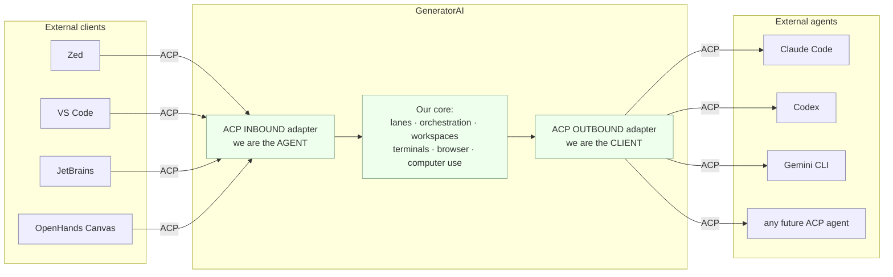
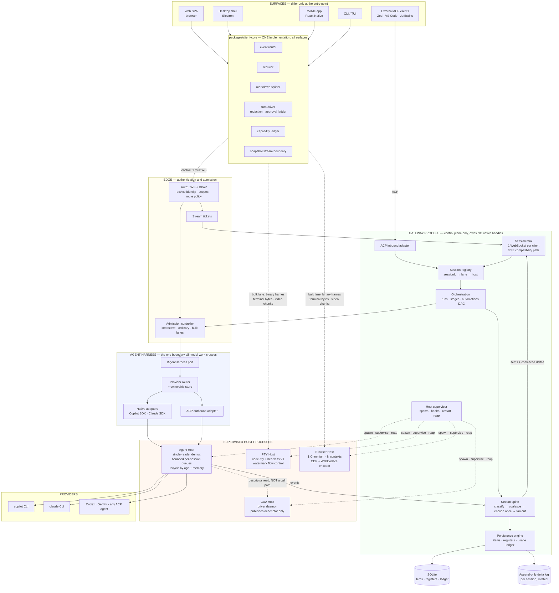
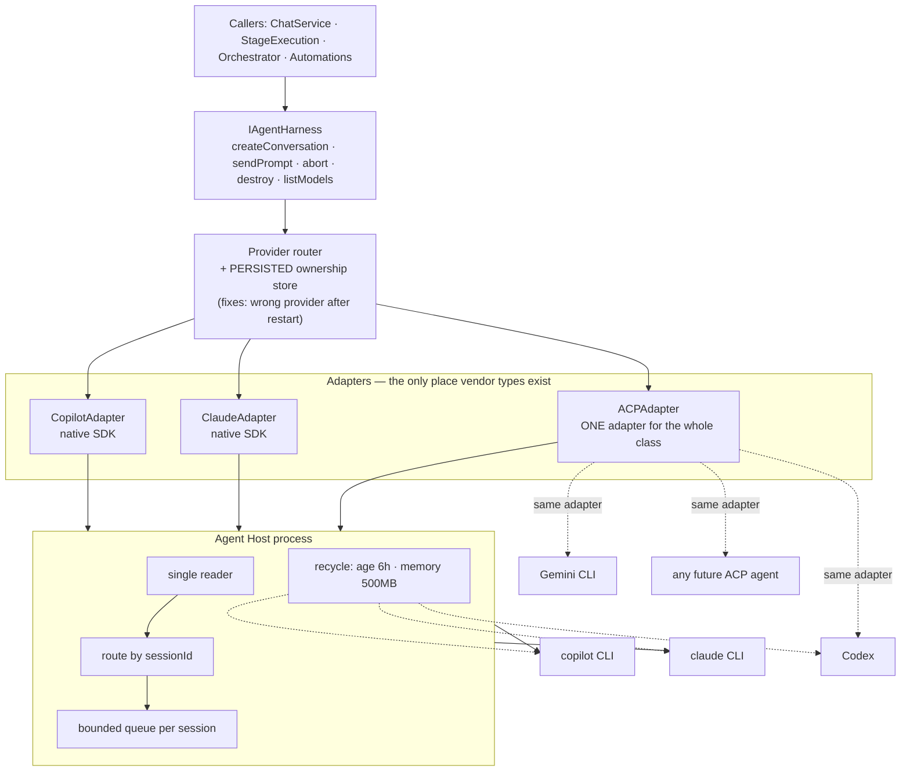
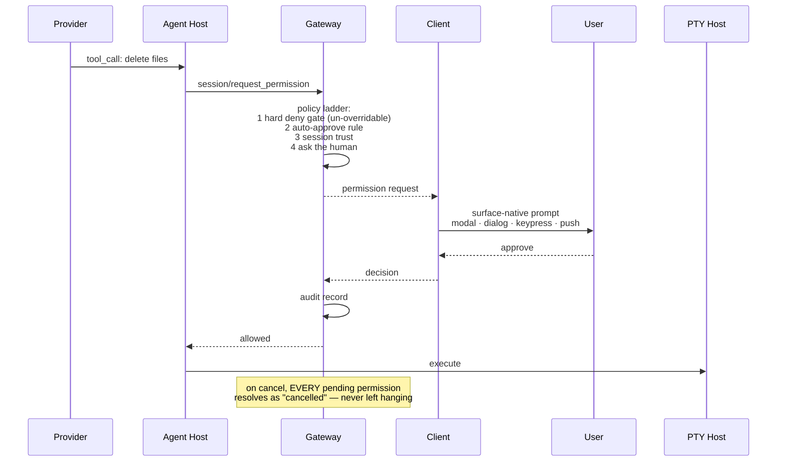
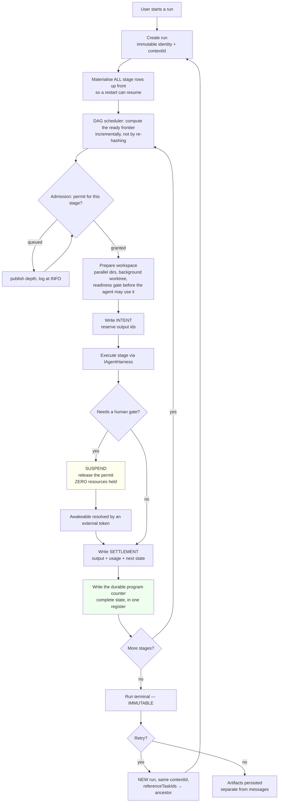
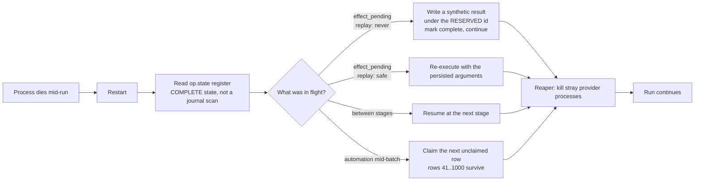
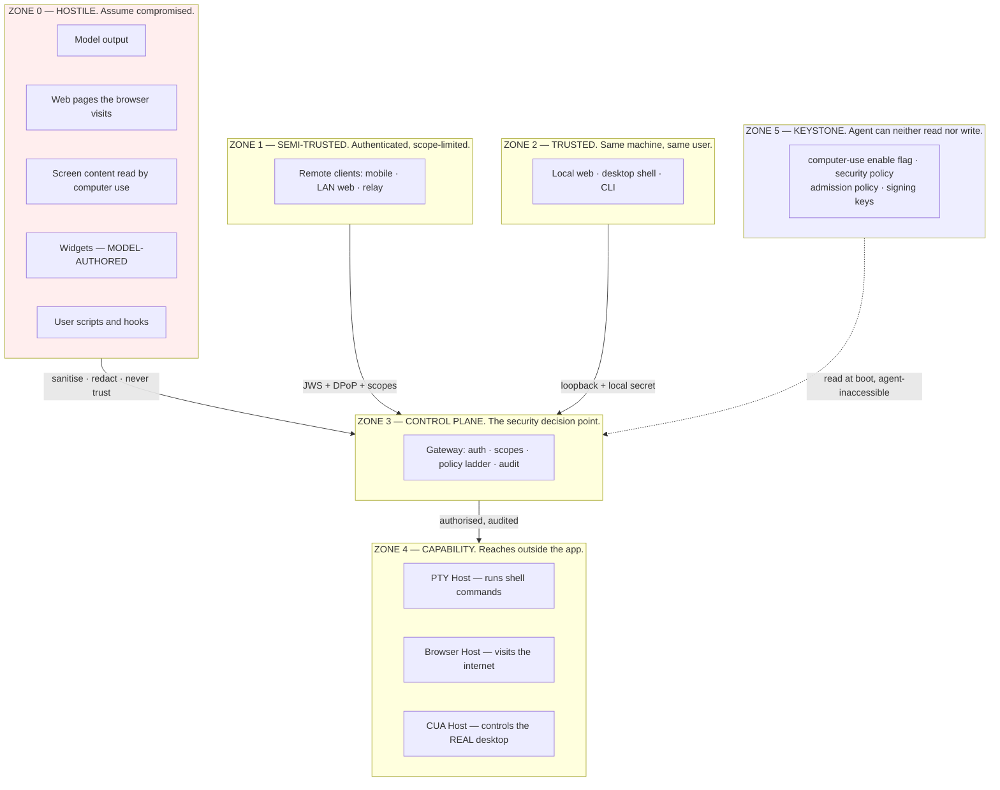
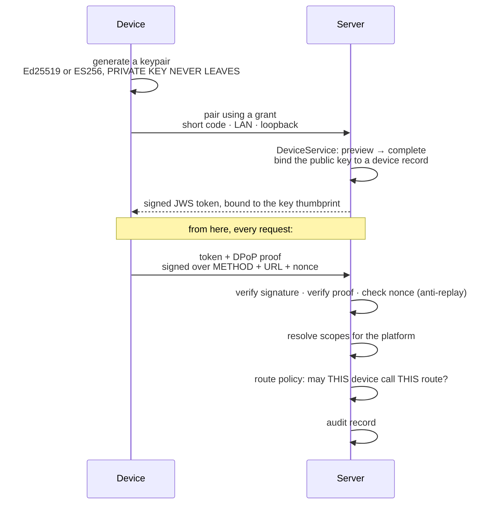
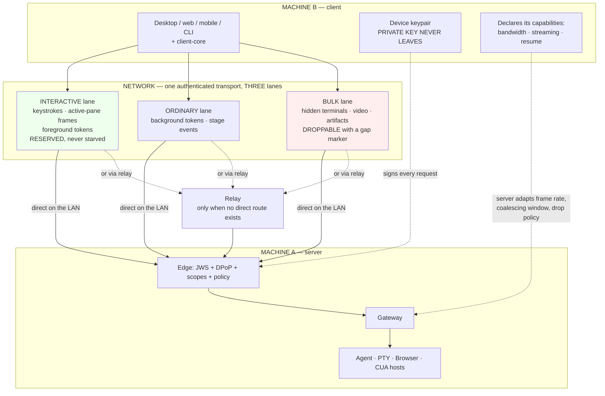

# GeneratorAI v2 — ACP, End-to-End Architecture, and Security

> Companion explainer to [ARCHITECTURE_V2_MASTER_PLAN.md](ARCHITECTURE_V2_MASTER_PLAN.md).
> Answers: what ACP is and what it fixes · why ACP and not plain JSON-RPC · the full client↔server↔agent architecture · the end-to-end flow · the security model · how a client on machine B connects to a server on machine A.
> **Date:** 2026-08-17 · No code written.

---

# PART A — What ACP is, and exactly what it solves

## A.1 The one-sentence version

**ACP (Agent Client Protocol) is a published, versioned contract for the conversation between "a thing that shows an agent to a human" and "a thing that runs an agent."** It is JSON-RPC 2.0 on the wire, but the value is not the envelope — it is the ~40 decisions it has already made about *what messages exist and what they mean*.

Zed, VS Code and JetBrains are ACP **clients**. Hermes Agent ships an `acp_adapter/`. OpenHands' Agent Canvas runs *"OpenHands, Claude Code, Codex, Gemini, or any ACP-compatible agent."*

## A.2 We plug it in at two edges, and they are independent



| Edge | Direction | We are the… | What it buys |
|---|---|---|---|
| **Inbound** | editor → us | agent | Zed / VS Code / JetBrains / OpenHands can drive GeneratorAI. Our orchestration, workspaces, terminals and computer use become available *inside their editor*. |
| **Outbound** | us → external agent | client | Claude Code, Codex and Gemini become providers behind `IAgentHarness` **with no vendor-specific adapter code**. Adding a provider becomes configuration. |

**These are separate adapters and can ship independently.** Outbound is the higher-value one for us; inbound is the distribution play.

## A.3 The six concrete problems ACP solves for us

These are not theoretical. Each maps to an issue in the master plan's register.

### 1. Cancellation currently renders as an error toast — `X-4`

Provider SDKs throw when you abort them. Our code lets that exception escape, the client sees an unrecognised error, and the user who pressed **Stop** gets a red failure box.

ACP makes this normative and unambiguous:
- `session/cancel` is a **notification**, not a request — no round trip.
- The agent **must catch the SDK's abort exception** and return `stopReason: "cancelled"` on the original prompt call. It is a *successful* return with a semantic outcome, not an error.
- All non-finished tool calls are marked cancelled **preemptively at the moment cancel is sent**, not when the model eventually notices.
- All pending permission requests resolve as `cancelled`.

That is four behaviours we would each get wrong once, in production, on a different surface.

### 2. Approval UI is reimplemented per surface — `P1-44`, surface drift

Today HITL and tool gating are our problem on web, desktop, CLI and mobile separately — and the hook bridge that was supposed to gate tools is **inert** (zero wiring outside tests).

ACP inverts the ownership: **`session/request_permission` is a method the *client* implements.** The agent asks; the client renders whatever its surface makes sense — a modal on web, a native dialog on desktop, a keypress prompt in the TUI, a push notification on mobile. One contract, four presentations, and the agent side is written once.

### 3. The terminal is owned by the wrong process — `X-19`, `P1-28`, `P0-23`

ACP defines a **client-provided terminal capability**: `terminal/create`, `terminal/output`, `terminal/wait_for_exit`, `terminal/kill`, `terminal/release`.

The consequence is significant for us: on the desktop surface, **the shell owns the PTY and the agent borrows it.** An agent-run command and a user-typed command become *the same terminal object* — one flow-control implementation, one scrollback, one lifecycle, one place where the watermark lives. That is a direct structural fix for the per-connection-watermark bug and the "terminals die on restart" gap.

### 4. Message boundaries are detected heuristically — `P0-47`

Our renderer guesses where one message ends and the next begins, which is part of why block segmentation and the "cross-buffer flush" are fragile.

ACP attaches a **`messageId` to every chunk**. Same id = same message. Changed id = new message. The renderer stops guessing. That removes a whole class of segmentation bug from the streaming markdown work.

### 5. There is no standard context/cost signal — `X-6`

We currently derive a context gauge client-side, differently on each surface, and we have **no cache-miss accounting at all** — which the research identified as the dominant avoidable cost in a many-session app.

ACP ships `usage_update` carrying `{used, size, cost: {amount, currency}}` as a first-class stream event. One gauge, identical on web, desktop, CLI and mobile, with no duplicated token estimation.

### 6. Every new provider is a bespoke adapter — `P1-42`, `X-11`

Today: `CopilotProvider.ts`, `ClaudeAgentProvider.ts`, a `MultiHarness`, a `HarnessRegistry`, a `HarnessProxy` the server doesn't use, and an ownership store that was never wired.

With outbound ACP: **one adapter for the entire class.** Any ACP agent is a provider. Native SDK adapters remain only where a vendor gives us something ACP doesn't expose.

## A.4 What ACP does *not* solve — be clear about this

| Not solved | Still ours |
|---|---|
| Multi-tenant transport, pairing, device identity | Our existing DPoP/JWS/pairing stack (Part F) |
| Workflow DAGs, stages, automations, run durability | Master plan W22–W24 |
| Browser sessions, computer use, widgets | Master plan W15–W17 (ACP has no opinion) |
| Delta-vs-item persistence, coalescing, backpressure | Master plan W04–W07. **ACP defines the message shapes; it does not define your streaming spine.** |
| Multi-client fan-out for one run | We take A2A's broadcast contract for that |

ACP is the **contract at the edge**. It is not the runtime.

---

# PART B — Why ACP, and not "just use JSON-RPC"

This is the right question to ask, so here is the honest answer.

## B.1 JSON-RPC is an envelope. ACP is the decisions inside it.

JSON-RPC 2.0 gives you exactly four things: a request shape, a response shape, a notification shape, and an error shape. It tells you **nothing** about what a session is, how streaming works, what cancellation means, how permissions are requested, or how a client and agent negotiate capabilities.

If we "just use JSON-RPC", we still have to invent all of that. Here is what we would be inventing — and, from the audit, what we would probably get wrong:

| Decision | ACP's answer | What we'd likely do first, and the bug it causes |
|---|---|---|
| Cancellation | Notification; agent returns `stopReason: "cancelled"` as a **success** | Reject the promise → user sees an error toast for their own Stop press. **We already ship this bug.** |
| Streaming updates | One-way `session/update` notifications with `messageId` | Correlate by array index or timestamp → boundary bugs on interleaved reasoning. **We already ship this bug.** |
| Who owns approval UI | The **client**, via `session/request_permission` | Build it per surface → 4 implementations that drift. **We already have this drift.** |
| Terminals | Client capability with an explicit 5-method lifecycle including `release` | Server-owned PTY with no release semantics → immortal terminals. **We already ship this bug.** |
| Resume | `session/load`, gated on a declared `loadSession` capability | Assume everyone can resume → silent failures on clients that can't |
| Capability negotiation | Explicit, at `initialize`, with custom capabilities allowed | Try it and catch the exception. **We already do this for browser screencast — `P1-33`.** |
| File paths | **MUST be absolute; line numbers 1-based** | Mixed relative/absolute → cross-platform bugs that only appear on one OS |
| Extension without forking | `_meta` fields, `_`-prefixed methods, custom capabilities | Add fields ad hoc → old clients break on unknown keys |
| Usage/cost | `usage_update` with an explicit currency-bearing cost object | Derive client-side per surface → four different numbers for the same turn |

**Every row in the "what we'd do" column is a bug we have already shipped at least once**, per the audit. That is the argument in one sentence: *we have empirical evidence that we get these decisions wrong, and ACP has already made them.*

## B.2 The network effect is one-directional and free

A custom protocol gets us zero external clients and zero external agents. ACP gets us both, from the same adapter:

- **Inbound**, we become drivable by Zed, VS Code, JetBrains and OpenHands Canvas.
- **Outbound**, every ACP agent becomes a backend — and that set is growing, not shrinking.

With a custom protocol, each of those is a bespoke integration project, forever.

## B.3 We would build 70–80% of ACP anyway, worse

Look at what we already have, hand-rolled:

| We already have | ACP equivalent | Status of ours |
|---|---|---|
| Session create / prompt / cancel | `session/new` · `session/prompt` · `session/cancel` | Cancel is broken |
| Streaming events | `session/update` | No `messageId`; heuristic boundaries |
| HITL gates | `session/request_permission` | Per-surface, hook bridge inert |
| Terminal API | `terminal/*` | No `release`; immortal sessions |
| File read/write tools | `fs/read_text_file` · `fs/write_text_file` | Mixed path conventions |
| Context gauge | `usage_update` | Derived client-side, four ways |
| Provider capability checks | `initialize` capabilities | **Discovered by throwing** |

We are not choosing between "ACP" and "nothing." We are choosing between **ACP** and **a worse, undocumented, single-vendor ACP that we maintain ourselves.**

## B.4 Where ACP is genuinely the wrong tool — and what we use instead

Intellectual honesty matters here. ACP does not cover everything, and we should not force it to.

| Need | Right tool | Why not ACP |
|---|---|---|
| Multi-surface fan-out of one run | **A2A's broadcast contract** | ACP assumes one client per session |
| Structured in-progress activity (gate cards, stage progress) | **AG-UI Activity channel** (snapshot + JSON patch) | ACP has messages, not a structured activity channel |
| Terminal bytes and browser frames | **Binary frames on a dedicated lane** | JSON-RPC would base64 them — a 33% inflation tax on the highest-volume data in the app |
| Tool discovery/invocation | **MCP** | Different axis; ACP explicitly reuses MCP's JSON shapes where they overlap |
| Device pairing, tokens, transport auth | **Our existing DPoP/JWS stack** | Out of ACP's scope |

So the real answer is: **ACP for the agent conversation, A2A's data model for run identity, AG-UI's vocabulary for our own surfaces, binary frames for bulk media, and our own auth underneath all of it.** Four contracts, each on the axis it was designed for — instead of one homegrown protocol trying to be all four.

## B.5 Cost and risk, stated plainly

| | |
|---|---|
| **Cost** | Two adapters (inbound, outbound). A JSON-RPC framing layer we largely need anyway. Mapping our internal events to `session/update` shapes. |
| **Risk** | ACP is young and still evolving. |
| **Mitigation** | Our internal event model stays canonical; ACP is a **boundary translation**, not our internal representation. If ACP changes, one adapter changes. This is the same isolation the `IAgentHarness` port already gives us for provider SDKs — and that boundary has held. |
| **Not a risk** | Lock-in. ACP is a translation at the edge, not a rewrite of the core. |

---

# PART C — End-to-end architecture

## C.1 The full picture



## C.2 Module placement — what lives where and why

| Module | Process | Owns | Never does |
|---|---|---|---|
| `client-core` | every surface | Event routing, reduction, splitting, turn driving, capability declaration | Know about transports or platform APIs |
| Surface renderers | each surface | Widget mapping only | Business logic, redaction, approval ordering |
| Auth / DPoP / device service | Gateway edge | Identity, scopes, route policy, tickets, audit | Touch agent state |
| Admission controller | Gateway | Lanes, queueing, published depth, dynamic sizing | Execute work |
| Session registry | Gateway | `sessionId → lane → host` routing | Hold conversation content |
| Orchestration | Gateway | Runs, stages, DAG, automations, gates | Spawn native handles |
| **Agent harness (`IAgentHarness`)** | Gateway | The **only** boundary model work crosses | Leak provider SDK types upward |
| Provider router | Gateway | Which provider owns which conversation, persisted | Talk to a CLI directly |
| Stream spine | Gateway | Classify · coalesce · encode once · fan out · backpressure | Block on a slow client |
| Persistence engine | Gateway | Items, registers, usage ledger, delta log | Write per token |
| Host supervisor | Gateway | Spawn, health, restart caps, boot reaping | Relay host data |
| **Agent Host** | separate | Provider CLIs, single-reader demux, recycling | Serve HTTP |
| **PTY Host** | separate | All PTYs, headless VT scrollback, watermarks | Know about chats |
| **Browser Host** | separate | One Chromium, N contexts, encoder | Know about workflows |
| **CUA Host** | separate | Driver daemon, OS permission identity | Be called by the gateway on the action path |

**The rule that makes this work (Law L5):** *native handles never live in the control-plane process.* The gateway supervises and routes; it is never on the data path of a PTY, a browser or a driver.

## C.3 How control flows — narrated

1. **A surface starts.** It loads `client-core`, declares its `TransportCapabilities` (does it support streaming edits? how many buttons? can it resume?), and opens **one** authenticated WebSocket.
2. **The edge authenticates.** JWS token + DPoP proof → device identity → scopes → route policy decides what this device may call. A stream ticket authorises the socket.
3. **The client subscribes to scopes** on that one socket — this chat, that run, global. No second connection. *(This alone fixes the 6-connection browser wall we already exceed today.)*
4. **The user sends a prompt.** The gateway resolves `sessionId → lane`. The admission controller checks the lane: **attended work bypasses the cap; unattended work queues** and publishes its depth.
5. **The call crosses `IAgentHarness`** — the single boundary. Above it, nobody knows which provider is in use.
6. **The provider router** looks up who owns this conversation (persisted, so it survives restarts) and picks native SDK or ACP outbound.
7. **The Agent Host** runs the provider process. **One reader owns stdout** and routes frames by session id into **bounded** per-session queues. A huge tool result in one session cannot stall another.
8. **Events flow back into the stream spine**, are classified delta or item, coalesced in a 4–16 ms window (flushing immediately on any item), encoded **once**, and fanned out to every subscriber on the scope.
9. **Items are batched into the database**; deltas go to the append-only log. Nothing writes per token.
10. **Tools that need native resources** are routed to the right host: shell → PTY Host, page actions → Browser Host, desktop actions → the driver **directly**, via a descriptor the gateway only reads.
11. **Bulk media** — terminal bytes, video chunks — travels on a separate lane so it never queues behind control messages.

---

# PART D — How a call reaches the agent

## D.1 The harness boundary

`IAgentHarness` is the one port everything model-related crosses. It survives v2 unchanged in *shape* — what changes is what sits behind it.



**The important asymmetry:** adding Copilot or Claude cost us a full adapter each. Adding Codex, Gemini, or anything else that speaks ACP costs us **a configuration entry**.

## D.2 Provider matrix

| Provider | Adapter | Process model | Why |
|---|---|---|---|
| GitHub Copilot | Native SDK | One long-lived CLI, **demuxed** by session | SDK exposes things ACP doesn't; today's single-process design becomes safe once frames are routed |
| Claude Agent SDK | Native SDK | Bounded spawn concurrency + boot reaper | Per-turn spawn is the SDK's model; we bound and reap it |
| Claude Code | **ACP** | Subprocess | Speaks ACP natively |
| Codex | **ACP** | Subprocess | Speaks ACP natively |
| Gemini CLI | **ACP** | Subprocess | Speaks ACP natively |
| Future | **ACP** | Subprocess | Zero adapter code |

## D.3 One chat turn, end to end

```mermaid
sequenceDiagram
  autonumber
  participant U as User
  participant CL as Surface + client-core
  participant ED as Edge auth
  participant GW as Gateway
  participant AD as Admission
  participant H as IAgentHarness
  participant AH as Agent Host
  participant PR as Provider CLI
  participant PT as PTY Host
  participant SP as Stream spine
  participant DB as Persistence

  U->>CL: types a prompt
  CL->>ED: send on the existing mux socket
  ED->>ED: verify JWS + DPoP, resolve scopes
  ED->>GW: authorised
  GW->>GW: resolve session → lane
  GW->>AD: request permit
  alt attended (a human is watching)
    AD-->>GW: immediate, bypasses the cap
  else unattended
    AD->>AD: queue, publish {cap, running, waiting}, log at INFO
    AD-->>GW: permit
  end
  GW->>H: sendPrompt
  H->>H: resolve owner from the PERSISTED store
  H->>AH: dispatch
  AH->>PR: prompt

  loop streaming
    PR-->>AH: frames on shared stdout
    AH->>AH: single reader routes by sessionId → bounded queue
    AH-->>SP: AgentEvent
    SP->>SP: classify delta vs item
    SP->>SP: coalesce 4-16 ms, flush NOW on any item
    SP->>SP: encode ONCE per flush
    SP-->>CL: one frame to every subscriber
    CL->>CL: apply on the next animation frame, append-only render
    Note over SP,DB: deltas → append-only log (batched)<br/>items → batched multi-row insert
  end

  PR->>AH: tool call: run a shell command
  AH->>PT: terminal/create + write
  PT->>PT: watermark; pause the shell above 100k unacked
  PT-->>CL: bytes on the BULK lane, direct, 5 ms coalesced
  CL-->>PT: ACK from inside the parse-completion callback
  PT-->>AH: exit status + captured output
  AH->>PR: tool result

  PR-->>AH: message complete
  AH-->>SP: ITEM
  SP->>DB: durable write
  SP-->>CL: final message + usage_update {used, size, cost}
  GW->>AD: release permit
```

**Read three things off this diagram:**
- The **only** per-token database write is gone. Deltas batch into a log; items are what get durably stored.
- Terminal bytes **never touch the gateway loop** — they go host → client on the bulk lane.
- The permit is released at turn end, and — critically — it is **also released across an approval wait**, which is the fix for eight parked stages stopping every workflow.

## D.4 A tool call that needs permission



The ladder order is a **security property**: the hard deny gate runs *before* auto-approve and session trust, so a deny can never be overridden by a convenience setting.

---

# PART E — End-to-end workflow flow

## E.1 A workflow run with a human gate



**Three mechanisms doing the heavy lifting:**

| Mechanism | Fixes |
|---|---|
| **Suspension at a gate** — the permit is released and no process state is retained | 8 stages on approval no longer stop every workflow; a 24-hour gate costs nothing |
| **Intent → effect → settlement**, with output ids reserved in the intent | On restart, an operation stuck mid-effect gets a synthetic result under the *already reserved* id. Every tool call has a result; nothing runs twice. |
| **The durable program counter** — one register holds the *complete* current state after every step | Recovery reads state and switches on it. It never infers position from what is missing. |

## E.2 Crash and restart



**`replay: never`** = terminal commands, computer-use actions, file writes, git operations, HTTP POSTs.
**`replay: safe`** = reads, greps, searches, window lists, page snapshots.

Today, a crash at row 40 of a 1000-row automation **silently loses 960 rows**. After this, it resumes at 41.

---

# PART F — Security architecture

## F.1 Trust zones



**The central idea: the agent is in Zone 0, not Zone 3.** Everything the model produces or reads is untrusted input.

## F.2 The identity chain (what we already have — it stays)

You already have a genuinely good stack in `packages/auth`. v2 keeps it and extends it to the new process boundaries.



**Why DPoP matters here:** the token is **sender-constrained**. A stolen token is useless without the private key that never left the device. For a product where a phone connects to a laptop over a home network, that is the correct choice.

### What changes in v2

| Change | Reason |
|---|---|
| **Auth moves to the edge, before admission** | One authorisation decision per connection instead of per request |
| **Stream tickets cost 1 operation, not 3** | Today opening one stream costs a ticket consume + a device read + an audit write. With one multiplexed socket per client, that happens once per *client*, not 4× per chat tab. Reconnect storms stop being write storms. |
| **Device touch-writes are batched** | Every authenticated call currently performs a device-table write |
| **Hosts get their own authentication** | New requirement — see F.3 |
| **Route policy is memoised** | It currently re-splits the path against ~45 policies on every request |

## F.3 New in v2: securing the process boundary

Splitting into host processes creates a new attack surface. Each host is handled explicitly.

| Host | Bound to | Authentication | Rule |
|---|---|---|---|
| **Agent Host** | loopback socket or inherited pipe | Per-spawn secret in the environment, never on a command line | Never listens on a routable address |
| **PTY Host** | loopback / transferred port | Per-session capability token issued by the gateway | A client can only attach to a terminal its scopes permit |
| **Browser Host** | loopback / transferred port | Same | Frames are authorised per session |
| **CUA Host** | Unix socket or named pipe with owner-only permissions | Descriptor file written atomically, mode 0600 | **The gateway never calls it.** It publishes a descriptor; the agent's tool proxy connects. |

**Three rules taken directly from the reference systems:**

1. **Credentials never travel on a command line.** A process listing is world-readable to every local process. Secrets go in a mode-0600 temp file that is deleted when the turn settles.
2. **The computer-use driver must be started by the process that owns the OS permission grant.** On macOS the operating system attributes a spawned child to its *responsible process*. If a background service starts the driver, the permission identity silently becomes the service's and the permission check **cannot detect the misattribution**. So: the desktop shell starts the driver and publishes a descriptor; the gateway only reads it.
3. **Agent-issued shell commands run with a scrubbed environment allowlist** so provider and account credentials cannot leak through a tool call or a child process.

## F.4 Zone-0 defences — treating the agent as hostile

| Threat | Defence |
|---|---|
| **Prompt injection from a web page or the screen** | Use the *official* computer-use tool type so the provider's injection classifiers run — they add approximately zero latency and no cost, and **do not run on custom tool definitions**. Plus explicit untrusted-content boundaries in the prompt. |
| **Model-authored widget escaping its sandbox** — `P1-53` | **Refuse to render** when the assets base is empty or resolves to the host origin. Origin-pinned message handshake, not ambient messaging. Content security policy on the origin. *(Today an empty value silently grants full access to the app's DOM, storage and auth state.)* |
| **Agent flipping its own capability gates** | Enable flags live in **keystone files** the agent's file tools cannot read or write. This single mechanism is what makes the ceiling un-disableable. |
| **Agent reaching a blocked application or site** | Blocklist checked **twice** — on the requested name and on the resolved identity. URL policy enforced at the browser protocol layer so **subresources** are blocked too, not just navigations. Blocked results are **shape-identical to "not found"** so the blocklist cannot be enumerated. |
| **Credential leaking through streamed output** | Rolling-buffer redaction that withholds a trailing credential-shaped run until it is provably safe. Per-chunk redaction misses secrets split across chunk boundaries. Protocol de-framing runs **before** redaction. |
| **A refusal message leaking secrets** | Refusals go through the **same** redaction as success paths. A refusal is prose about the user's screen; the one path that skips redaction would be the easiest way to read a token out of a status bar. |
| **Stale approval buttons after a restart** | The widget carries a `(sessionKey, transcriptTimestamp)` token in its own id; a click is judged against the persisted transcript. Zero server state, restart-proof. |
| **Tool acting on a stale UI snapshot** | Element index keyed by `(session, window)`, monotonic-clock TTL, and fingerprint drift verified against a fresh scan before every mutating action. **Hard fail, never a lazy re-scan** — a lazy re-scan silently lets the model act on a tree it was never shown. |
| **Truncated tool arguments** — `X-2` | When a response was cut off by the token limit, **all** tool calls in that batch fail with an explanatory synthetic error. A salvaged path handed to a delete tool is data loss, not a wasted token. |
| **Unbounded resource use as denial of service** | Admission control with lanes; bounded queues everywhere; configuration clamps that are logged and audited so tampering is detectable even though the loader self-heals. |

## F.5 Threat model summary

| Threat | Today | v2 |
|---|---|---|
| Stolen bearer token | Mitigated (DPoP binding) | Same |
| Replayed request | Mitigated (nonce) | Same |
| Malicious widget | **Sandbox can collapse to same-origin** | Refused; CSP; port handshake |
| Prompt injection via screen/page | Partial | Official tool type + classifiers; boundaries |
| Secret in a process listing | Partial | Never on a command line; 0600 files |
| Agent disabling its own gates | Partial | Keystone files |
| One session crashing the server | **Any rejection kills the process** | Handlers everywhere; supervised hosts; capped restarts |
| Resource exhaustion | **No admission control** | Lanes + bounded queues + clamps |
| Orphaned processes | **24 live right now** | Parent-PID heartbeat + boot reaper |
| Stale UI action | Fingerprint only | `(session, window)` key + TTL + drift + hard fail |

---

# PART G — Remote connection: client on machine B, server on machine A

## G.1 What you have today

You already support this, with four connection modes:

| Mode | Path | Auth |
|---|---|---|
| **Loopback** | same machine | Local secret + loopback check |
| **LAN pairing** | direct over the local network | Short pairing code → device grant → JWS + DPoP |
| **Short-code pairing** | user reads a code from the host | Grant preview → complete → device session |
| **Relay** | through `apps/relay` when there is no direct route | Host broker + stream bridge, still device-authenticated end to end |

Plus **host pinning**, so a client remembers which host it trusts and will not silently accept a different one.

**This model is sound and stays.** What changes is *what travels over it* and *how it is prioritised*.

## G.2 What changes in v2

The problem today is not the pairing — it is that **everything shares one undifferentiated pipe**. A remote mobile client watching a run competes with a terminal flooding build output, with no notion of priority, on a link that may be far slower than loopback.



### The four changes

**1. Lanes, not a flat pipe.** Weighted scheduling with a reserved interactive lane and anti-starvation counters. A terminal flooding output can never delay a keystroke echo, because bulk traffic is chunked and interleaved rather than sent as one giant write.

**2. Capability-aware behaviour.** The client declares what it is. A mobile client on a poor connection gets a lower frame rate, a wider coalescing window, and — following the lesson that *editing one message per chunk reads as a stutter on a high-latency surface* — possibly **block delivery instead of token streaming**. That is a `TransportCapabilities` decision, not a hardcode.

**3. Bulk data is droppable, with an honest marker.** For a remote client, a hidden terminal's backlog is worthless. Drop the oldest, keep a tail large enough to repaint the screen, and emit a **visible gap marker**. Never silently lose data.

**4. Resume that tells the truth.** A stream-id-scoped cursor rides in the transport's own id field, so a browser client resumes with no client code. The `hello` frame carries `{cursor, resumed}` — and if the cursor fell off the end, **it says so**, because a partial replay would leave a permanent hole in the client's state.

## G.3 Where do host processes fit for a remote client?

This is the subtlety worth being precise about. In the master plan I said terminal bytes go "client ↔ host directly." That means two different things depending on location:

| Client location | Mechanism | What "direct" means |
|---|---|---|
| **Same machine** (desktop, local web, CLI) | Transferred message port (Electron) or a loopback socket handed off after the gateway authorises | Genuinely direct. Bytes never enter the gateway process. |
| **Remote** (LAN, relay, mobile) | A **separate lane on the same authenticated transport**, brokered by the gateway | Not a separate socket — but a separate *lane*, so bulk data never queues behind control messages and is scheduled independently |

**In both cases the property that matters is preserved:** terminal and video data never sits in the gateway's request-handling queue behind chat tokens. Locally we get that by transferring a port. Remotely we get it by lane scheduling on one authenticated connection.

## G.4 Connecting from machine B — the full sequence

```mermaid
sequenceDiagram
  autonumber
  participant U as User on machine B
  participant C as Client
  participant N as Network
  participant S as Server on machine A
  participant H as Hosts

  Note over U,S: FIRST TIME — pairing
  U->>S: on machine A, generate a pairing code
  S->>S: DeviceService.createPairingGrant<br/>short-lived, single-use
  U->>C: enter the code on machine B
  C->>C: generate a keypair; PRIVATE KEY STAYS HERE
  C->>N: discover the host — LAN, or relay if no direct route
  N->>S: previewPairingGrant
  S-->>C: host identity + fingerprint
  C->>C: PIN this host; a different fingerprint later = refuse
  C->>S: completePairing + public key
  S->>S: bind the key to a device record<br/>assign platform-default scopes
  S-->>C: signed JWS token, bound to the key thumbprint
  S->>S: audit: device paired

  Note over U,S: EVERY SESSION AFTERWARDS
  C->>S: open ONE mux socket<br/>token + DPoP proof over method+URL+nonce
  S->>S: verify signature, proof, nonce; resolve scopes; route policy
  S-->>C: authorised; negotiate lanes + capabilities
  C->>S: subscribe to scopes: this chat, that run
  S-->>C: snapshot, then live deltas

  Note over U,H: NORMAL OPERATION
  C->>S: prompt on the interactive lane
  S->>H: dispatch after admission
  H-->>S: events
  S-->>C: coalesced frames, one encode, lane-scheduled

  Note over C,S: DISCONNECT — laptop closes, train tunnel
  C--xS: link drops
  S->>S: run KEEPS RUNNING — lifecycle is independent of the stream
  C->>S: reconnect with the cursor
  S-->>C: hello {cursor, resumed:true} + bounded replay
  Note over S,C: if the cursor fell off the end:<br/>resumed:false → fresh snapshot. NEVER a partial replay.
```

**The property that makes this feel good:** *the run's lifecycle is independent of any individual stream's lifecycle.* Close the laptop, the run continues. Open the phone, it joins the same run mid-flight. Three surfaces can watch one run simultaneously, receiving the same events in the same order, and closing one affects none of the others.

## G.5 Security properties of the remote path

| Property | How |
|---|---|
| No shared password on the wire | Public-key pairing. The private key never leaves machine B. |
| Stolen token is useless | DPoP binds the token to the key. |
| Replay blocked | Server nonce in every proof. |
| Host impersonation blocked | Host pinning — a changed fingerprint is refused, not silently accepted. |
| Pairing codes cannot be brute-forced | Short-lived, single-use, rate-limited, audited. |
| Least privilege per device | Platform-default scopes; a phone need not have the same rights as the desktop. |
| Revocation | Device records are revocable; a revocation generation invalidates issued tokens. |
| Relay cannot read traffic | Device-authenticated end to end; the relay brokers, it does not terminate trust. |
| Every decision is auditable | Hash-chained audit log for pairing, permission decisions and capability use. |

---

# PART H — Why this improves things

## H.1 Performance

| Path | Today | v2 | Mechanism |
|---|---|---|---|
| One streamed token | **~12.8 SQL statements, 3.7 rows, ~350 µs blocking** | ≤2 statements amortised, ~30 µs | Delta/item split + statement cache + batching |
| Database growth | **81% of a 1.76 GB database is the token log** | Token log is a rotating file; the database holds items | Deltas are transport, not storage |
| One chat page, 3 browser tabs | **7 connections against a 6-connection browser limit** — REST queues indefinitely | 1 multiplexed connection | One socket, many scopes |
| Busy terminal | **0.8–4 GB/s of memory copying, stalls every chat** | O(lines × columns), in another process | Headless VT model + host split |
| 5 concurrent browsers | **1.5–2.5 GB** | Well under 1 GB | One Chromium, N contexts |
| Slow browser client | **Costs the same CPU as a fast one** | Costs less | Backpressure throttles *capture*, not just delivery |
| One computer-use click | **3–4 round trips + a full-screen PNG + 3 DB writes** | 1 round trip, 0 server hops, 0 DB writes | Fused act+observe + descriptor model |
| 200 KB answer in the UI | **Locks the tab** | Streams smoothly | Append-only render, frame-aligned |
| Chat history | **Capped at 50, no way to load more** | Full history | Pagination + hybrid virtualization |
| 8 stages awaiting approval | **Every workflow on the server stops** | Unrelated runs continue | Permit released across gates |
| Restart mid-automation | **Silently loses 960 of 1000 rows** | Resumes at row 41 | Rows claimed atomically + program counter |
| Orphaned processes | **24 live, oldest 7 days** | Zero | Parent-PID heartbeat + boot reaper |
| One unhandled rejection | **Kills the server** | Logged | Handlers + supervised hosts |
| Wedged event loop | **Indistinguishable from a thinking model** | Detected and attributed in ~30 s | Off-thread monitor + loop-turning probe |

## H.2 Process and product

| Improvement | Why it follows |
|---|---|
| **Adding a provider becomes configuration** | One ACP adapter covers the whole class |
| **We become embeddable** | Inbound ACP means Zed / VS Code / JetBrains can drive us |
| **Surfaces stop drifting** | One `client-core`, one splitter, one turn driver, one capability ledger with a test that fails on an unclassified field |
| **Failures are attributable** | Fallback counters, wedge detection, published queue depth, and `sessionId` no longer scrubbed from every log |
| **Regressions get caught** | Benchmarks beside the code; a concurrency load test in CI — today nothing exercises concurrency at all |
| **Blast radius shrinks** | A provider crash, a browser crash or a PTY crash no longer takes down chat |
| **Throttling is visible** | "The fleet is throttled" and "a worker is hung" stop looking identical |
| **Cost becomes visible** | Usage events and cache-miss accounting surface the dominant avoidable spend |

## H.3 The single sentence

> Today, twelve subsystems each made a locally reasonable choice, and each assumed it was the only thing running. v2 draws **one protocol boundary** so those subsystems agree on what they are saying, and **one process boundary** so they stop competing for the same event loop — and then makes every queue between them bounded, prioritised, and honest about what it drops.
