# GeneratorAI — Architecture v2 Master Plan

> # ⚠️ SUPERSEDED
> **This document has been replaced by [ARCHITECTURE_V2_MASTER_PLAN_FINAL.md](ARCHITECTURE_V2_MASTER_PLAN_FINAL.md)**, which consolidates all six analysis documents, applies three corrections (ACP terminal capability, vendor-SDK provider tier, Gemini removal), adds the Codex/OpenCode integrations, the migration work, and a full 8-phase delivery plan.
>
> It is kept for history only. **Do not plan from this file.**

---

> **What this document is.** The single consolidated output of the two prior reviews:
> - [ARCHITECTURE_PERFORMANCE_REVIEW.md](ARCHITECTURE_PERFORMANCE_REVIEW.md) — audit of *our* code, with live measurements.
> - [HARNESS_RESEARCH_AND_REVISED_ARCHITECTURE.md](HARNESS_RESEARCH_AND_REVISED_ARCHITECTURE.md) — audit of five external systems (Pi, KiroCrew, VS Code, OpenMausBot, plus web research) and the reversals they forced.
>
> This document supersedes both for planning purposes. It contains: **(1)** the complete issue register, **(2)** the target architecture end to end with diagrams, **(3)** the technical implementation specification, **(4)** the phased delivery plan, and **(5)** a traceability matrix proving every issue is addressed.
>
> **Date:** 2026-08-17 · **Status:** plan for review. No code has been written.
> **Language note:** written in plain technical English. Where a term is unavoidable it is defined at first use.

---

## Table of contents

| Part | Contents |
|---|---|
| **0** | Executive summary — the three root causes and what changes |
| **1** | The complete issue register — 90 issues across 15 domains, with evidence and impact |
| **2** | Architecture laws — the rules the new design must obey |
| **3** | Target architecture — process topology, protocol layer, component deep dives, pipeline diagrams |
| **4** | Feature-by-feature integration plan |
| **5** | Implementation specification — 33 work items with technical detail |
| **6** | Phased delivery plan |
| **7** | Traceability matrix — every issue → work item → phase |
| **8** | Guardrails, benchmarks, and acceptance criteria |
| **9** | Open decisions requiring your call |

---

# PART 0 — Executive summary

## 0.1 What is actually wrong

The application is not slow. It is **unbounded**. It is fast when idle (measured p50 6–8 ms) and degrades non-linearly, without warning, under exactly the concurrent load the product is positioned on. Nothing rejects, nothing sheds, nothing prioritises. It buffers until garbage collection, the provider pipe, or the database gives out — and when it fails, it fails hard (one unhandled promise rejection kills the whole server process).

Three root causes explain roughly 80% of the 90 issues below.

### Root cause 1 — We persist the wrong thing

Every streamed token performs **~12.8 synchronous SQL statements across 3.7 rows on one database connection, on the main thread**. Measured. This is the global throughput ceiling for chats, workflow runs, automations and orchestrator waves simultaneously.

Not one of the five external systems studied does this. Pi writes one line per finished message. KiroCrew writes an append-only file plus a 5-second flush. OpenMausBot writes a file per thread. Hermes writes one row per message. Codex CLI states outright that its streaming deltas *"may not exactly equal"* the final item and treats only the completed item as authoritative.

**Live consequence:** the development database is **1,759 MB**, of which **81% is the token log** (`stream_cursors` 2.30 M rows / 893 MB + `events` 1.19 M rows / 531 MB). Actual conversation content is 6,922 rows — about 0.3% of the database by row count. The retention sweeper has never deleted a single row because its default TTL (90 days) is longer than the oldest row (85 days).

### Root cause 2 — There is no process boundary and no protocol boundary

Everything runs on one Node.js event loop, sharing one synchronous SQLite connection and one bag of in-memory maps. A terminal printing build output, a browser encoding JPEG frames, a computer-use accessibility scan, four chats streaming tokens, twenty-two workflow-run pollers, and every HTTP request are all the same thread.

We confirmed today that the codebase contains **zero** `worker_threads` and **zero** `utilityProcess` usage. The process split is greenfield.

Every system studied solved this by drawing a boundary and making the boundary the only place coordination happens:
- **VS Code** — separate pty host, agent host, shared process, extension host, file watcher; the renderer talks to each *directly* via a transferred message port, and the main process *"does not relay any agent service calls."*
- **KiroCrew** — a gateway that multiplexes nine surfaces onto a commodity agent runtime, with six thread pools split by blocking class.
- **Pi** — three stores, one atomic write primitive, a durable program counter, lanes.
- **OpenMausBot** — the host process owns the computer-use driver and publishes a connection descriptor; the server is *not on the action path at all*.

### Root cause 3 — Every subsystem was tuned in isolation

Twelve subsystems each made a locally reasonable choice, and each assumed it was the only thing running:

| Subsystem | Its cap | What the cap actually bounds |
|---|---|---|
| Terminals | 5/workspace, 20 global | count, not work — 5 idle terminals cost nothing, 2 busy ones cost more than the entire browser subsystem |
| Browsers | 5 (two independent caps, only one reads the env var) | count |
| Computer use | 1 global permit | *actions*, process-wide, across every workspace |
| Workflow stages | 8 global permits, held across human approval waits | count |
| Chats | **none** | — |
| Orchestrator workers | 12 per orchestrator, **no global cap** | per-parent only |
| Inline widgets | **none, never torn down** | — |

Nothing anywhere reasons about their combined cost on the one event loop they share.

## 0.2 What the new architecture does

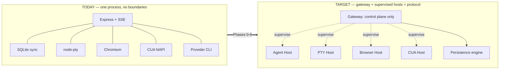

Five structural changes, in dependency order:

1. **Split delta from item.** Streaming tokens become transport-only (coalesced, bounded, droppable, resumable by sequence). Only completed messages, tool calls and lifecycle events become durable. Expected: database write volume down 1–2 orders of magnitude.
2. **Adopt ACP** (Agent Client Protocol) as the contract, inbound and outbound, *before* splitting processes — so the boundary is drawn on a stable contract rather than on today's ad-hoc events.
3. **Move native work into supervised host processes** — provider CLIs, PTYs, Chromium, computer-use driver — with clients talking to each host over a dedicated channel rather than through the API process.
4. **Add one admission controller with priority lanes** that all subsystems draw from, replacing seven independent count caps.
5. **Rebuild the client streaming path** on one shared runtime with frame-aligned coalescing and append-only rendering.

## 0.3 What is genuinely good and stays untouched

- The domain layer — entities, ports, state machines, `DAGValidator`, the `IAgentHarness` boundary. Provider SDK types genuinely do not leak.
- `StreamBroker.subscribe`'s three-phase catch-up buffer solves the subscribe/snapshot race correctly (t3code solves it identically).
- The computer-use *security* model: opaque blocklist refusals, target overwriting so consent-for-A/deliver-to-B is impossible, membership-not-range snapshot fencing, blind-input tripwire. This is careful work.
- Workflow-run crash recovery, including the atomic `claimForExecution`.
- The web terminal client's 64 KB acknowledgement flow control — the one place streaming is currently done right.
- `packages/client-core` (confirmed present: `stream/eventRouter.ts`, `reducer.ts`, `contextUsage.ts`, `api/client.ts`, `diff/parseUnifiedDiff.ts`) — this becomes the foundation for all four surfaces.

---

# PART 1 — The complete issue register

**90 issues.** Severity: **P0** = visible failure or data loss under target load · **P1** = major degradation · **P2** = measurable waste · **P3** = hygiene. IDs prefixed `X-` were surfaced by the external research and were not in the original audit.

**Fix** column references a Work Item defined in Part 5.

## 1.A Persistence and data layer

| ID | Sev | Issue | Evidence | Impact | Fix |
|---|---|---|---|---|---|
| P0-1 | P0 | The `verbose` callback forces SQLite to rebuild the full SQL text with all parameters inlined on **every statement**, then runs a non-lazy whitespace split over it and discards all but the first token. The metrics it feeds are discarded unless `OTEL_ENABLED=true`. | `packages/db/src/index.ts:232-244`; `instrumentation.ts:24` | ~1,000–4,000 transient string allocations **per streamed token**; 35–45% of per-token CPU | W01 |
| P0-2 | P0 | `prepare()` is called **inside the transaction, twice, per event**. No statement cache anywhere; Drizzle also re-prepares per query. | `StreamCursorRepository.ts:65,84` | **Measured 350 µs → 30 µs per token when cached (11×)** | W01 |
| P0-3 | P0 | Broker append uses the raw driver's `transaction()` instead of the shared manager. Nested inside an open `withTransaction`, SQLite degrades it to a savepoint — so **a row can be rolled back after it was already broadcast to clients.** | `StreamCursorRepository.ts:58` vs `db/index.ts:206` | Breaks the commit-then-broadcast invariant the whole streaming design rests on | W03 |
| P1-4 | P1 | Two durable event logs. Nothing reads the v1 `events` table on the live path, yet it is written first and synchronously on every event; its `(workflow_run_id, stage_run_id)` columns are unindexed. | `stream.ts:318`, `schema.ts` | **Measured 579 ms full scan**; doubles write volume for zero benefit | W01 |
| P1-5 | P1 | `withTransaction` is a **process-global mutex on one connection, held across `await`**. Its 10-second deadline rejects the caller but does not abort the function, which keeps issuing statements against a connection that has already rolled back. | `db/index.ts:160,191,207,228` | All concurrent runs serialise on every multi-row write | W03 |
| P1-6 | P1 | Retention has never deleted a row. Missing `chats(project_id)` index (declared in schema, absent on disk). No `ANALYZE` ever run. `mmap_size=0`. | `AppConfig.ts:225`; measured | 1.76 GB database, 81% token log; **2.13 s cold boot** from a startup aggregate over `events` | W02 |
| P2-c | P2 | `migrateDB` runs `INSERT OR IGNORE … SELECT MAX(sequence_id) FROM events GROUP BY session_id` on **every boot**. | `composition-root.ts:165` | 2.13 s added to every start | W02 |
| X-9 | P1 | No size cap or streaming fallback on `JSON.parse`/`stringify` of tool results. | Node.js guidance | A 50 MB payload costs **0.7 s to stringify + 1.3 s to parse** — a multi-second stall for every other session | W19 |

## 1.B Streaming and event backbone

| ID | Sev | Issue | Evidence | Impact | Fix |
|---|---|---|---|---|---|
| P0-7 | P0 | Backpressure is counted and then discarded. `res.write()`'s return value is checked, but the caller is always told success. The `drainWaiters` array is declared, spliced and cleared — **but nothing ever pushes to it.** A correct drain-aware writer exists in `sseWrite.ts` with **zero importers**. | `stream.ts:94-113,292`; `sseWrite.ts:22` | Slow client accumulates ~400 KB in-process before any action; the documented pause-until-drain mechanism does not exist | W06 |
| P0-8 | P0 | The producer never slows down. The provider callback discards the returned promise, so the read loop never blocks. No depth limit, no shed policy, no memory ceiling on the emit queue, the catch-up buffer, or per-connection bytes. | `CopilotProvider.ts:1473`; `EventBus.ts:88` | Unbounded memory growth whenever the database stalls | W06 |
| P1-9 | P1 | The per-session queue serialises the **entire fan-out**, not just the durable write — 8 SQL statements, 2 JSON round trips and all client writes complete before the queue advances. | `EventBus.ts:179-183` | The queue is the throughput ceiling of a single session's stream | W05 |
| P1-10 | P1 | Every subscriber performs its own `JSON.stringify` of the same payload. No shared or pre-encoded frame. | `stream.ts:314` | O(K) serialisation for K subscribers on one scope | W05 |
| P1-11 | P1 | A second, entirely unmanaged SSE endpoint: no connection cap, ignores write backpressure completely, and runs a **250 ms filesystem polling loop per connection.** | `computer.ts:620-692` | Every open Computer panel is a permanent 4 Hz filesystem poll on the main thread | W05, W08 |
| P2-12 | P2 | Four call sites bypass the ref-counted stream manager and open raw connections. One chat page with three browser tabs holds **7 streams** against Chrome's **6-connection HTTP/1.1 limit** (marked "Won't fix" by Chrome and Firefox). No HTTP/2 anywhere. | `ChatPage.tsx:429,492`; `BrowserPanel.tsx:414`; `server/index.ts:32,262` | Every REST request, image and widget asset queues behind the streams **today**, and the retry logic turns it into a reconnect storm | W09 |
| X-25 | P1 | Stage results live in the message stream, which is inherently lossy on reconnect. There is no separate durable result channel. | A2A spec | "Reconnect loses content" is structural, not a transport bug | W23 |

## 1.C Process and concurrency model

| ID | Sev | Issue | Evidence | Impact | Fix |
|---|---|---|---|---|---|
| P0-13 | P0 | **One Copilot CLI process for the entire server.** Every chat, stage, orchestrator worker and automation iteration multiplexes over one pipe. A large tool result is buffered whole and blocks every other session's events. A crash kills every conversation at once. | `CopilotProvider.ts:338`; `HarnessRegistry.ts:176` | Structural head-of-line blocking; zero blast-radius isolation | W12 |
| P0-14 | P0 | **Claude spawns one CLI per turn, with no cap anywhere.** The v2 chat path has no semaphore, no queue, no limit. Nothing reaps stray processes on restart. | `ClaudeAgentProvider.ts:781` | **Measured live: 24 orphaned `claude.exe`, oldest 7 days old, ~870 MB** | W12, W20 |
| P0-15 | P0 | A **synchronous, blocking file append per event, per active run.** The logger subscribes to every event in the process. | `StreamLogger.ts:60-76,117` | With 22 active runs, every token event is offered to 22 handlers, each doing a blocking syscall. Dominates any CPU profile. | W07 |
| P1-16 | P1 | The 8-permit stage semaphore is **process-global and held across human approval waits**, validation retry loops, hook backoff (up to 10 minutes) and the summary turn. | `WorkflowRunService.ts:181`; `Semaphore.ts:56` | 8 stages parked on approval stops **every workflow on the server**. Chats keep working, so it looks random. | W18 |
| P1-17 | P1 | Stage timeout passes `undefined` as the abort signal, so the model keeps running and burning tokens forever. The timer is never cleared; a second 10-second timer leaks per stage. | `StageExecutionService.ts:1434,2661,2675` | Unbounded token burn after timeout; permit released while work continues | W13 |
| P1-18 | P1 | One 3-second polling interval **per active run**, unconditional, re-invoking completion handlers for every terminal stage on every tick — layered on top of an event bus that already does this. | `WorkflowRunService.ts:786-819` | With 22 live runs: **~200 database queries every 3 seconds doing nothing, forever** | W18 |
| P1-19 | P1 | The DAG scheduler recomputes a SHA-1 hash of the entire definition several times per stage completion — and computes it *after* the database reads it exists to avoid. Its lock maps are module-level globals, not instance state. | `DAGScheduler.ts:67-83,129` | Net negative cache; ~12 database round trips before the next stage launches | W24, W33 |
| P1-20 | P1 | ~7 git subprocess spawns per stage start **and per chat turn**, awaited before the first token. `git add -A` walks the whole worktree. | `GitShadowRefStore.ts:44-72` | 8 concurrent stage starts = **56 git processes at once**; seconds of wall clock on Windows | W25 |
| P2-21 | P2 | Up to **5 sequential model round trips per stage** (predecessor context, validation feedback, hook context, main prompt, summary). In "full" context mode the predecessor turn carries every predecessor's complete raw output. | `StageExecutionService.ts:1204,1237,1261,1610` | Latency multiplied 5×; fastest possible way to exhaust the context window on a wide DAG | W24 |
| P2-22 | P2 | The harness registry cold-probes **both** providers on the create-conversation path, every 5 minutes. | `HarnessRegistry.ts:213-283` | ~10 s stall on the first new chat after each TTL expiry | W13 |
| X-10 | P1 | CPU-bound and I/O-bound work share the single default libuv thread pool (4 slots). | Node.js guidance; `CuaDriverBridge.ts:10-18` | One accessibility scan consumes 25% of the pool that also serves all file I/O | W19 |
| X-22 | P1 | No boot-time reaper for stray provider processes. The startup recovery service scans for orphaned Docker containers but not for CLI processes. | `StartupRecoveryService.ts` | The 24 orphans accumulate across restarts | W20 |

## 1.D Agent provider integration

| ID | Sev | Issue | Evidence | Impact | Fix |
|---|---|---|---|---|---|
| P1-42 | P1 | The multi-provider router is constructed with **no ownership store**, so after a restart a Claude-owned chat routes to Copilot with a session id Copilot has never seen. | `composition-root.ts:306-310` | Silent correctness bug; one-line wiring | W12 |
| X-1 | P1 | **No cap on parallel tool execution.** Confirmed today: zero matches for `maxParallelTools` or `maxConcurrentTools` in the entire codebase. Whatever the model emits fans out at once. | verified 2026-08-17 | A model emitting 30 tool calls spawns 30 concurrent effects — 30 shells, 30 file writes | W13 |
| X-2 | P1 | **No guard for truncated tool arguments.** Confirmed today: zero `stopReason` handling in providers. When a response is cut off by the token limit, the salvage parser can produce arguments that parse and validate but are silently incomplete. | verified 2026-08-17 | A truncated path handed to a delete or write tool. **Data loss, not just wasted tokens.** | W13 |
| X-3 | P1 | No guard against a tool emitting a progress update *after* its result has settled. | Pi regression test `5208` | Corrupted UI state; resurrected spinners on finished tool cards | W13 |
| X-4 | P1 | Cancellation surfaces as a thrown error rather than a semantic "cancelled" outcome. Provider SDKs throw on abort, and unrecognised errors render as error toasts. | ACP spec | A user pressing Stop sees a red error. Known symptom in our own history. | W11, W13 |
| X-5 | P1 | Mid-run context insertion (hooks injecting context, stages prepending system notes, variable substitution) lands **before** the previous request's tail, invalidating the provider's prompt cache. | Pi `harness.md §2.5` | Silently multiplies the provider bill on every affected turn | W13 |
| X-6 | P2 | No prompt-cache-miss accounting. The dominant avoidable cost in a many-session app is completely invisible. | Pi `cache-stats.ts` | Cannot see or attribute cache-miss spend | W30, W32 |
| X-11 | P2 | No conformance suite for harness providers or storage backends. "Does this adapter behave correctly?" is a code-review question, not a CI question. | Pi `session/testing/conformance.ts` | Provider adapters drift silently | W29 |
| X-13 | P2 | No session lineage across compaction events. | Hermes | After two compactions, "why did the agent forget X?" is unanswerable | W24 |

## 1.E Terminal integration

| ID | Sev | Issue | Evidence | Impact | Fix |
|---|---|---|---|---|---|
| P0-23 | P0 | **Scrollback is `Buffer.concat` per PTY chunk.** Once saturated at 4 MiB, every chunk allocates a fresh 4 MiB buffer and memory-copies 4 MiB into it. These are above the pooling threshold, so each is an external allocation the collector must reclaim. | `TerminalService.ts:189-196` | **800 MB/s of copying at 200 chunks/s; 4 GB/s at 1000 chunks/s, per terminal.** Saturates a core and drives major collection pauses that stall the entire loop — *your chat tokens stutter because someone ran a build.* | W14 |
| P1-27 | P1 | **No output coalescing on the WebSocket** — one send per PTY chunk. The feature documentation explicitly describes a 4 ms / 32 KB coalescer that **does not exist in the code.** | `terminal-ws.ts:131` vs `feature-integrated-terminal.md` | 2,500 socket sends/second at 5 busy terminals; 4–10× more loop work than the documented design | W14 |
| P1-28 | P1 | The flow-control watermark is per-connection but acts on the **shared** PTY. Two viewers: one pauses, the other's acknowledgement resumes the PTY the first is drowning in. | `terminal-ws.ts:118-200` | Oscillating pause/resume; circuit breaker fires and is immediately undone | W14 |
| P1-38 | P1 | Idle timers are bumped on **output**, not client activity. A dev server logging once a minute keeps its PTY alive forever with no client attached. The global cap counts exited-but-unreaped corpses. | `TerminalService.ts:382,143` | Immortal invisible PTYs; spawn refused server-wide because of 20 dead records | W14 |
| P2-54 | P2 | Terminals are the only right-pane resource with **no instance cap** (browser has 5, widget has 6). Each takes a WebGL context; Chrome silently drops the oldest past ~16. | `ChatPage.tsx:999-1002` | Randomly blank terminals with no error | W27 |
| X-19 | P1 | Terminals do not survive a server restart, and there is no distinction between *reconnect* (window reload, process still alive) and *revive* (app restart, relaunch with original environment). | VS Code `ptyService.ts:229-300` | Any long-running command is lost on restart | W14 |

## 1.F Browser integration

| ID | Sev | Issue | Evidence | Impact | Fix |
|---|---|---|---|---|---|
| P0-24 | P0 | The screencast generator **deadlocks on stop**. `stop()` sets the disposed flag and closes the context but never resolves the waiting promise, and nothing else can. The `finally` never runs, so the subscriber is never removed, the keepalive timer is never cleared, and the socket is never closed. | `ServerPlaywrightHost.ts:863-871`; `browser-ws.ts:177` | **Leaks on every eviction and every idle pause — the normal path, not an edge case.** A permanent timer plus its whole closure. | W15 |
| P0-25 | P0 | The idle sweeper kills a browser the user is **actively watching**. Only agent actions bump the activity timestamp; neither the frame path nor the screencast path touches it. | `BrowserService.ts:153-170` vs `:505,516` | Watch the live pane for 5 minutes without agent activity and your browser is killed underneath you — and it leaks a timer on the way out | W15 |
| P1-26 | P1 | **One full Chromium browser tree per workspace**, not one browser with N contexts. Five concurrent = 5 browser + 5 GPU + 5 network processes. Nothing requires this: profile isolation, permissions, request routing, init scripts and cookies are all per-*context* APIs. | `ServerPlaywrightHost.ts:239` | **1.5–2.5 GB.** The largest single memory win available. Cold start 1.0–2.5 s fully blocking, including up to 200 sequential socket binds to find a free port. | W15 |
| P1-32 | P1 | A hardcoded **120 ms sleep after every click**, inside a single global input chain. Mouse down/up each do a preceding move. Ctrl+Shift+P is 7 sequential round trips. No input rate limit, no bound on chain depth. | `ServerPlaywrightHost.ts:737-747` | 125 ms minimum for click-then-anything; a client sending moves at 500 Hz builds an unbounded chain processed for minutes after it stops | W15 |
| P1-33 | P1 | **Transport is chosen by catching an exception.** If the first frame throws, it silently falls back to a 20 fps screenshot loop — each a full protocol round trip with viewport re-encode. A third capture path polls a JPEG endpoint every 500 ms concurrently. | `browser-ws.ts:115-131,183-216`; `BrowserPanel.tsx:1116` | **30–80% duty cycle of an entire core, permanently, per browser**, and it never reaches 20 fps. On desktop this means full native rendering *plus* a capture loop that stutters the UI. | W15 |
| P1-34 | P1 | Frame rate and quality pass through **three independent clamps with three different defaults**; per-workspace settings are silently ignored. Parameters are set by the first subscriber only. Backpressure exists only as a **drop after encoding** — Chromium keeps encoding, the acknowledgement keeps firing, frames go in the bin. | `browser-ws.ts:104`; `ServerPlaywrightHost.ts:817` | ~3.2 MB/s of transient strings per session; **a slow client costs exactly as much CPU as a fast one** | W15 |
| P3-e | P3 | The placeholder background is rebuilt character-by-character over an entire JPEG every 20 frames. | `BrowserPanel.tsx:1076-1082` | ~100 KB of string garbage every 2 s per browser tab | W27 |
| X-17 | P1 | A full accessibility snapshot is auto-attached to every browser tool result. | Playwright MCP `--snapshot-mode` | The dominant token cost in a browser loop | W16 |
| X-14 | P1 | Screenshot downscaling is delegated to the provider API. The model returns coordinates **in the space of the image it saw**, so the scale factor is hidden from us. | Anthropic CUA docs | *"Lower model accuracy and slower performance"*; a top cause of clicks landing at 80% of where the model aimed | W16, W17 |

## 1.G Computer use

| ID | Sev | Issue | Evidence | Impact | Fix |
|---|---|---|---|---|---|
| P1-29 | P1 | **A global permit of 1 for all *actions*, process-wide** across every workspace, chat and run — despite the name saying "sessions". Held until the work settles, with a 30-second timeout. | `ComputerService.ts:302`; `AppConfig.ts:278` | **One stuck driver call blocks every computer-use action server-wide for 30 s.** Read-only operations that never touch the foreground queue behind synthetic input. | W17 |
| P1-30 | P1 | One click costs **3–4 driver round trips** (app list, window list, an unconditional re-resolve even when consent was cached), a **full-screen PNG written to disk**, an artifact row, an audit row, and an event emit. The driver runs **in-process on Windows**, on the 4-slot pool shared with all file I/O. The accessibility tree crosses the boundary as JSON **three times**. | `ComputerService.ts:1090-1160`; `CuaDriverBridge.ts:10-18` | **1–3 MB written per click**; a 1200-element scan blocks 25% of the file-I/O pool | W17 |
| P1-31 | P1 | Reading one screenshot loads **every artifact row for the workspace**, scans linearly, reads the whole file, **then** checks the size limit, then makes a base64 copy. | `ComputerService.ts:1449-1471` | Three copies of the image resident at peak; size check after the read | W17 |
| P1-39 | P1 | A response close listener is registered **inside a `while` loop**. The response is long-lived; the chunk is not. | `computer.ts:145-168` | Listener warning after 11 chunks; hundreds of retained closures over a long recording. Also polls file stats every 250 ms instead of watching. | W17 |
| X-15 | P1 | No frame integrity validation. A truncated JPEG still starts with a valid header. | OpenMausBot `computer-proxy.ts:265` | The model silently receives a grey half-frame and acts on it | W17 |
| X-16 | P2 | Identical consecutive frames are resent to the model in full. | OpenMausBot `computer-observation.ts:118` | **~1.2k tokens each**, and the worse failure: the agent re-clicks a button it already submitted | W17 |

## 1.H Workspaces, worktrees and filesystem

| ID | Sev | Issue | Evidence | Impact | Fix |
|---|---|---|---|---|---|
| P0-35 | P0 | **The browser is not registered in the workspace-delete hook.** Deleting a workspace removes the tree — including the browser profile directory — while Chromium is still running against it. Chromium with a yanked profile does not exit; it thrashes on failed writes. | `composition-root.ts:903,966,1150,1264,1292` | Process, port and host entry all leak. Nothing reaps them. Listener order is registration order and only *accidentally* correct. | W25 |
| P0-36 | P0 | **Git worktrees are never unregistered.** The tree is removed but `git worktree remove`/`prune` is never called; the rows that would let anyone find the orphans are deleted first, so the orphan cleaner can never see them. | `WorkspaceManager.ts:266-292` | **Every deleted workspace leaves a stale entry in the user's own repository.** Accumulates forever, slows every `git status`, can block reusing a branch name. **The only defect that damages state outside our own directories.** | W25 |
| P1-45 | P1 | Chat worktree creation is fire-and-forget while the working directory is already set to the not-yet-existing path. The code's own comment admits creation "can take 10-30s for large repos." | `ChatManagementService.ts:1173-1202` | If the user sends a message in that window, the session's working directory does not exist | W25 |
| P2-46 | P2 | Workspace creation blocks the HTTP request: 11 sequential directory creations, 5–11 git process spawns, 3 database round trips. On a repo with no history it runs `git add -A` over the **entire user repository** with a 15-second timeout per call. | `WorkspaceManager.ts:74-149,565` | **Worst case holds an HTTP request for 90+ seconds.** Worktree creation for multiple codebases is sequential despite being independent. | W25 |

## 1.I Orchestration, workflows, automations, durability

| ID | Sev | Issue | Evidence | Impact | Fix |
|---|---|---|---|---|---|
| P0-41 | P0 | **Automations lose work on restart, silently.** Iterations are built in memory and driven by an in-process loop; only *dispatched* attempts get a database row. Recovery only finalises executions — it never resumes one. | `AutomationService.ts:600-655,840` | **A 1000-row batch that dies at row 40 loses 960 rows silently**, and the row sits in `running` until a later boot mislabels it `completed` | W22 |
| P1-43 | P1 | Orchestrator task state is in-memory only. | `OrchestratorService.ts:87-95` | Restart is total amnesia; the checker returns a synthetic "failed" for a worker that is still running | W24 |
| P1-44 | P1 | **The hook bridge is inert.** The "block a tool before it runs" feature is real code that is never wired — zero assignments outside tests. If it *were* wired it would be a performance problem too (an O(n) filter plus sort per phase per tool call, no index). | `ChatManagementService.ts:115`; `HookExecutor.ts:130` | A documented security feature does not exist at runtime | W13, W33 |
| X-20 | P1 | No termination conditions for orchestrator waves — no time budget, no convergence threshold, no arbiter. | Anthropic multi-agent patterns | *"Systems that treat termination as an afterthought tend to cycle indefinitely or stop arbitrarily when one agent's context fills."* | W24 |
| X-21 | P2 | Scheduled automations reuse long-lived sessions. | Hermes | Scheduled runs inherit unrelated context and drift | W24 |
| X-23 | P1 | No rules governing side effects around human-approval pauses. On resume the stage re-runs from its start, so any pre-pause side effect repeats; index-matched resume values make loops re-execute exponentially. | LangGraph documented failures | Duplicate database rows and exponential replay, both silent | W22 |
| X-24 | P1 | "Retry" mutates a terminal run in place rather than creating a new run in the same context. | A2A task immutability | Ambiguity about what state a row is in; parallel follow-ups impossible | W23 |

## 1.J Web UI rendering

| ID | Sev | Issue | Evidence | Impact | Fix |
|---|---|---|---|---|---|
| P0-47 | P0 | **The entire assistant answer is re-parsed as markdown, with syntax highlighting and language auto-detection, ten times per second, synchronously on the main thread.** The component built to avoid this (`MarkdownBody`, documented as existing precisely for block-level streaming) has **no callers**. | `StreamPanel.tsx:138`; `MarkdownRenderer.tsx:49` | Quadratic in answer length: 40 KB ≈ **4 s** of parsing; 200 KB locks the tab. Meanwhile 8 syntax-highlight workers with 16 grammars boot at the app root and are used **only by diff views**. | W27, W28 |
| P0-48 | P0 | **The chat is capped at 50 messages and there is no way to load more.** Virtualization exists but activates above 80 messages — a threshold that can never be reached. No pagination, no infinite scroll. | `queries.ts:388`; `ChatMessageList.tsx:29` | You can never see message 51. **A correctness bug wearing a performance fix's clothes.** | W27 |
| P0-49 | P0 | The workflow run page subscribes to **every stream in the application**, including unrelated chats, and rebuilds a fresh object each time so the downstream memo never hits. The code comment claiming otherwise is wrong. | `WorkflowRunPageV2.tsx:90`; `deriveRunView.ts:346` | 20 stages × 500 blocks × 3 passes × 10 Hz ≈ **300,000 block visits/second** | W26, W27 |
| P1-50 | P1 | Hidden right-pane tabs stay fully live — mounted, streaming, decoding. Up to 5 hidden browser tabs keep decoding at full frame rate. There is a visibility check on the HTTP fallback but **none on the WebSocket path**. An inline object literal makes every mounted tab re-render on every parent render. | `RightPane.tsx:748`; `ChatPage.tsx:931,977` | Background windows keep pulling and decoding frames indefinitely | W27 |
| P1-51 | P1 | Zero stale time plus refetch-on-focus globally, **24 distinct polling loops**, and per-event invalidation storms (one event invalidates 7–8 keys; every stage status event invalidates the whole run list — ~160 full refetches per 20-stage run). | `QueryProvider.tsx:45`; `sseManager.ts:1301` | ~350 requests/minute with 5 runs open, plus ~15 simultaneous refetches on every tab switch. **Mobile already solves this with 16 ms de-duplication; web does not.** | W26 |
| P1-52 | P1 | Bundle is **3,188 KB gzipped against its own declared 800 KB budget** — 4× over, 389 chunks, no vendor split, production source maps shipped. | measured; `vite.config.ts:121` | The budget check exists and fails; nothing enforces it | W28 |
| X-7 | P2 | Markdown chunking/splitting logic is duplicated per surface. | KiroCrew (*"six splitters grew independently"*) | A fix in one never reaches the others | W29 |

## 1.K CLI, TUI and mobile

| ID | Sev | Issue | Evidence | Impact | Fix |
|---|---|---|---|---|---|
| P2-55 | P2 | The CLI does **one full component-tree reconcile per token**. The frame-rate setting throttles the terminal *write*, not the reconcile or layout pass. | `store.ts:267`; `launch.tsx:206` | **200 reconciles/second** of the whole workbench, of which 30 produce visible output | W26 |
| X-12 | P2 | No capability declaration per surface. Surfaces silently diverge in what they support. | KiroCrew `transport.py:32` | Features half-work on one surface with no way to detect it | W29 |
| — | — | *Note:* mobile is architecturally **better** than web on every axis measured (16 ms drain, de-duplicated invalidation, always-on list virtualization, memoized rows, shared event router). It should be promoted to the shared implementation. | `apps/mobile/src/stream/useChatStream.ts` | — | W26 |

## 1.L Security

| ID | Sev | Issue | Evidence | Impact | Fix |
|---|---|---|---|---|---|
| P1-53 | P1 | The widget sandbox **collapses to same-origin when the assets base is empty**. `allow-scripts` plus `allow-same-origin` is the canonical sandbox escape; it is only safe today because the frame loads from a different port. Both the frame and the message bridge fall back to the host origin. | `WidgetFrame.tsx:64,216`; `sseManager.ts:424` | An empty value grants a widget full access to the app's DOM, local storage and auth state — **and widgets are model-authorable** | W31 |
| P0-40 | P0 | **Any unhandled promise rejection kills the server.** The handler rethrows, and there is no uncaught-exception handler anywhere. Floating promises are not rare. | `apps/server/src/index.ts:67-73`; `chats.ts:313` | One failing session takes down the whole process. Top availability risk. | W20 |
| X-18 | P2 | No identity check on port acquisition. | OpenMausBot `main.mjs:139` | A dev server on the same port with the same API shape can be adopted by the packaged app | W20 |
| — | P2 | No content security policy on an origin that renders model-authored markdown. | (gap; OpenMausBot has the same gap) | Model-authored content executes with no policy | W31 |

## 1.M Observability and operability

| ID | Sev | Issue | Evidence | Impact | Fix |
|---|---|---|---|---|---|
| P3-a | P3 | `sessionId` is in the log redaction list. | `Logger.ts:55` | **The primary correlation key is scrubbed from every log line.** This actively obstructs debugging every other issue in this document. | W32 |
| P3-b | P3 | The active-request gauge never decrements for open streams; route label cardinality is unbounded. | `requestMetrics.ts:41-51` | The metric is wrong precisely when it matters most | W32 |
| X-8 | P1 | No wedge or hang detection. A blocked event loop is indistinguishable from a thinking model. Liveness is inferred from socket state. | KiroCrew observed a **10-hour** frozen backend behind a green "Connected" badge | Users see an eternal spinner; we cannot attribute it | W21 |

## 1.N Middleware, boot and infrastructure

| ID | Sev | Issue | Evidence | Impact | Fix |
|---|---|---|---|---|---|
| P2-a | P2 | Route policy resolution iterates **all ~45 policies**, re-splitting both the request path and each prefix, per request — for a table that is static at module load. Every authenticated call performs a device-table **write**. Opening one stream costs **3 database operations**. | `routePolicy.ts:160`; `AuthService.ts:234,282` | ~90 allocations per API request; reconnect storms become write storms; a web client opens 4 streams per chat tab | W19, W20 |
| P2-b | P2 | The JSON body parser retains the raw buffer (up to 2 MB) on **every** JSON request, for the benefit of one webhook route. | `app.ts:79-87` | Needless retention per in-flight request | W19 |
| P2-d | P2 | The durable-sleep service polls every **5 seconds** whether or not any stage has ever slept. Push-target refresh rebuilds its full map every 30 seconds with zero tokens registered. | `DurableSleepService.ts:122`; `composition-root.ts:1033` | **17,280 no-op queries/day**, plus 2 pointless reads every 30 s forever | W18 |
| P3-c | P3 | A synchronous filesystem existence check on every non-API GET in production. | `staticFiles.ts:50` | Blocking syscall on the loop per page load | W19 |
| P3-d | P3 | The stream connection-cap environment variable clamps the *global* scope **down** from 32. | `sseConnectionCap.ts:48-52` | Raising the cap can break global fan-out | W18 |
| P3-f | P3 | Dead abstractions that make readers conclude a safety property exists when it does not: the drain-aware writer (zero importers), the drain waiter list (never populated), the virtual chat list (unreachable), `MarkdownBody` (never called), the harness proxy (unused by the server). | see §E.7 of review 1 | Each is a trap for the next reader | W33 |

## 1.O Documentation contradicting code

These matter because both humans and AI agents trust the documentation and will "preserve" behaviour that was never written.

| Documented claim | Reality | Fix |
|---|---|---|
| Terminal *"coalesces PTY chunks with `setImmediate`, flushes every ~4 ms, up to 32 KB per frame — 4–10× fewer frames"* | **No such code.** One send per chunk. | W14 |
| Terminal scrollback is *"an in-memory ring buffer"* | `Buffer.concat` + slice; O(n) per append; 4 MiB allocation per chunk | W14 |
| *"Real OS-level XOFF via node-pty"* | Pauses the reading socket → pipe backpressure. Different mechanism, different latency, weaker ordering on Windows. | W14 |
| Per-workspace browser frame rate and quality are configurable | Silently ignored; the socket layer reads environment variables and re-clamps twice | W15 |
| `GENERATORAI_BROWSER_MAX_CONCURRENT` is *the* cap | Two independent caps; only one receives the variable | W15 |
| `maxConcurrentSessions` (computer use) | A per-**action** semaphore, process-global, default 1 | W17 |
| The delete hook ensures *"native processes never outlive a deleted workspace"* | True for PTYs and the driver. **Chromium is not registered at all.** | W25 |
| `Semaphore(8)` *"bounds how many harness subprocesses spawn at once"* | Bounds nothing for the default provider (one process total) and does not apply to chats | W18 |
| Invariant: commit-then-broadcast | Violated whenever a broker append nests inside an open transaction | W03 |
| Invariant: every stream handler releases its connection slot on close | One endpoint never acquires a slot at all | W08 |

## 1.P What happens under the target load — the failure narrative

**Scenario:** 5 chats + 3 workflow runs + 1 automation × 20 iterations + 5 terminals + 3 browsers + 2 computer-use sessions.

1. **Terminal copy storm dominates.** Two busy terminals at 200 chunks/s = **1.6 GB/s of memory copying plus 1.6 GB/s of large allocations**, plus 400 unbatched socket sends/s. Continuous major garbage collection. **Every collection pause stalls token delivery to all 5 chats.** Users report "the chat froze" and blame the model.
2. **Event-loop starvation from blocking file appends.** 500–2000 events/s × (1 insert + 1–3 inserts on a synchronous driver + 23 handler dispatches + a blocking file write). The loop is pinned.
3. **Stage semaphore starvation.** 4 automation iterations × 6 stages compete with 3 manual runs for 8 global permits. Four stages on approval = half capacity. Eight = **every workflow stops**. Chats keep working, so it looks random.
4. **Provider pipe head-of-line blocking.** One large tool result is buffered whole; **no other session's events move** until it is parsed.
5. **Checkpoint git storm.** 8 concurrent stage starts × 7 git spawns = **56 git processes at once**. Orchestrator workers share one workspace, so 12 of them serialise on one lock, each holding it across those 7 spawns.
6. **Browser view becomes a slideshow at full CPU cost.** Frames are discarded after encoding. The user sees a frozen page while the agent reports successful clicks.
7. **Any 5-minute lull kills a browser and leaks a hung generator plus a timer.** Over an hour you accumulate several.
8. **Computer-use actions queue with a 30-second worst-case block.** Chat A's click waits for chat B's scan.
9. **Starting a 4th browser evicts a live one inline on the request path**, adding a close to an already 1–2.5 s start, and triggering the leak.
10. **Creating a 5th chat blocks its request for 0.2–90 s**, competing for the same 4-slot pool the computer-use driver is holding.
11. **The browser client is already over the 6-connection limit** with one chat and three browser tabs — REST queues indefinitely and the retry logic makes it a storm, which is *also* 3 database writes per reconnect.
12. **A restart here loses data.** Automation iterations vanish silently. Orchestrator waves vanish. Claude-owned chats route to the wrong provider. And even a clean restart leaves debris.

---

# PART 2 — Architecture laws

These are the rules the new design must obey. Each is stated as an enforceable invariant with the issues it prevents. **Every design decision in Part 3 traces back to one of these.**

| # | Law | Prevents |
|---|---|---|
| **L1** | **Tokens are transport, not storage.** Only completed items — messages, tool calls, lifecycle transitions, artifacts — are durable. Deltas are coalesced, bounded, droppable and resumable by sequence number, and never written per-token. | P0-1, P0-2, P1-4, P1-6, P0-15 |
| **L2** | **Every queue is bounded, and its overflow behaviour is stated in code.** Either it applies backpressure to its producer, or it drops with a visible marker. Never "grow until something breaks." | P0-8, P1-11, P1-32, P1-37 |
| **L3** | **Backpressure is granted at the consume point, never at receipt.** An acknowledgement means "the consumer finished with it," not "the bytes left the kernel." | P0-7, P1-28, P1-34 |
| **L4** | **The pool that recovers from a wedge must never be the pool that wedges.** Blocking classes get separate pools. CPU-bound and I/O-bound work never share. | X-10, P1-30, P2-46 |
| **L5** | **Native handles never live in the control-plane process.** PTYs, browsers, computer-use drivers and provider CLIs run in supervised host processes; the control plane supervises and routes but is never on their data path. | P0-13, P0-14, P0-23, P1-26, P1-30 |
| **L6** | **A detector must not be downstream of the failure it detects.** Liveness probes must exercise the thing that can fail. Watchdogs live outside the loop they watch. | X-8 |
| **L7** | **Rejection is a typed value, not an exception — and agent work queues rather than rejects.** Refusals enumerate their reasons so callers cannot forget to handle them. Control-plane overload rejects; agent work queues and publishes its depth. | P1-16, P3-d, no admission control |
| **L8** | **Provider context grows only at the tail within one lane.** Any insertion before the previous request's tail invalidates the prompt cache and multiplies cost. Mid-run writes defer to checkpoints. Compaction is the one deliberate invalidation. | X-5, X-6 |
| **L9** | **Every capability is declared, never discovered by throwing.** Hosts publish what they support; callers branch on the declaration. | P1-33, X-12 |
| **L10** | **One core, N surfaces, one contract.** Surfaces differ only at the entry point. Shared logic lives in one package; capability differences are declared and tested. | P0-49, P1-51, P2-55, X-7, X-12 |
| **L11** | **A terminal run never restarts.** Retry creates a new run in the same context, referencing its ancestor. Results are artifacts; messages are conversation and are explicitly unreliable. | X-24, X-25 |
| **L12** | **Recovery reads state, it does not infer it.** Every operation writes its complete current state to one place after each step. Every side-effecting tool declares whether it is safe to replay. | P0-41, P1-43, X-23 |
| **L13** | **Every native resource has one owner, one lifecycle, and a registered teardown ordered by phase.** | P0-35, P0-36, P1-38 |
| **L14** | **Every tuning constant carries the measurement that produced it, and every risky optimisation has a kill switch.** | all of §1.O |
| **L15** | **Every expensive fallback increments a counter that a test asserts on.** "Is the fast path still being taken?" must be a boolean, not a stopwatch. | P0-47, P1-33, regression prevention |

---

# PART 3 — Target architecture

## 3.1 Process topology

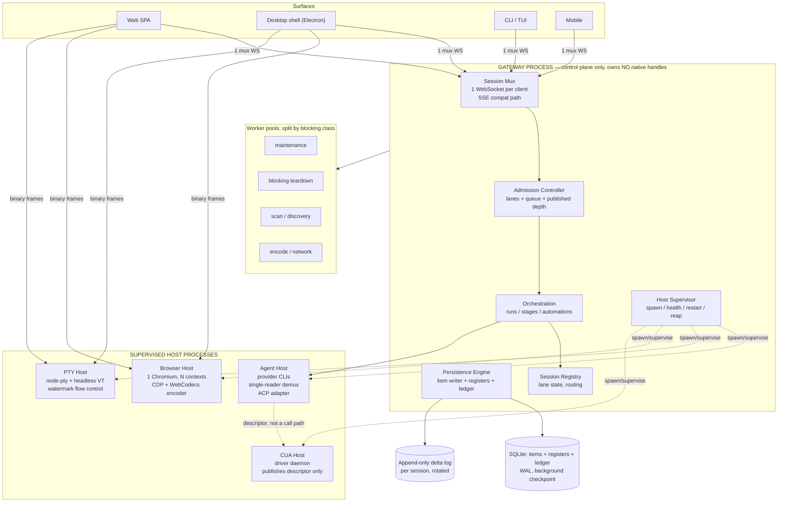

**Reading the diagram:**
- The gateway is a **router and a bookkeeper**. It never holds a PTY handle, a browser page, or a driver connection.
- Terminal bytes and browser frames go **client ↔ host directly**. They do not traverse the gateway loop. (In Electron this is a transferred message port; on a server it is a dedicated socket the gateway hands off after authorising.)
- The computer-use host is reachable by the *agent*, not by the gateway. The gateway publishes a descriptor; the agent's tool proxy connects to the driver socket. **Our server leaves the action path entirely.**

## 3.2 Protocol layer

We stop inventing wire formats and adopt three existing ones, each on the axis it was designed for.

| Axis | Protocol | What we get | Replaces |
|---|---|---|---|
| Editor/client ↔ our agent | **ACP** (JSON-RPC over stdio/socket) | Cancellation as a semantic outcome; client-owned approval UI; usage updates carrying cost; message-id stream segmentation; absolute-path convention | Ad-hoc event kinds; error-toast cancellation; per-surface approval UI |
| Our agent ↔ external agents | **ACP** (outbound, **breadth tier only**) | ~45 registry agents (Cursor, Cline, Kilo, Goose, Qwen, Kimi, Junie, Droid…) become pluggable with **no bespoke adapter each** | A hand-written provider for every long-tail vendor |
| Our agent ↔ **Claude · Copilot · Codex · OpenCode** | **The vendor's own SDK / protocol** | `PreToolUse` gate-everything hooks; in-process MCP; per-session tool filtering; budget caps; structured output; steering | — (this is a **correction**: ACP is a strict subset and cannot carry our policy gate — see [AGENT_PROVIDER_INTEGRATION_ANALYSIS.md](AGENT_PROVIDER_INTEGRATION_ANALYSIS.md) Part 5) |
| Run/task data model | **A2A** concepts (not necessarily the wire) | Task immutability, `contextId` grouping, `referenceTaskIds` lineage, **artifacts separate from messages**, normative multi-stream broadcast | In-place run mutation; results lost on reconnect |
| Our surfaces ↔ our gateway | **AG-UI** event vocabulary | Activity channel (snapshot + patch) for gate cards and stage progress; chunk events with auto-close; encrypted reasoning passthrough | Gate cards forced into the message stream; spinners stuck when a producer dies |

**Why this ordering matters:** adopting the contract *before* splitting processes means the process boundary is drawn on a stable, externally-specified interface rather than on today's internal event shapes. This is Phase 1.5 in the plan and it is deliberately placed before Phase 2.

### The three normative rules we inherit

1. **Cancellation** — the agent must catch abort errors from provider SDKs and return a semantic `cancelled` outcome. All non-finished tool calls are marked cancelled **preemptively when the cancel is sent**, and all pending permission requests resolve as cancelled. (Fixes X-4.)
2. **Multi-stream broadcast** — all active streams for a run receive the same events in the same order; closing one does not affect others; **run lifecycle is independent of stream lifecycle.** (This is the spec for web + desktop + mobile watching one run.)
3. **Messages are unreliable; artifacts are the result.** Stage outputs become artifacts with a stable id and append/last-chunk semantics. Conversation stays in messages. (Fixes X-25.)

## 3.3 The stream spine

This is the single most important component. It replaces the current path where one token costs 12.8 SQL statements.

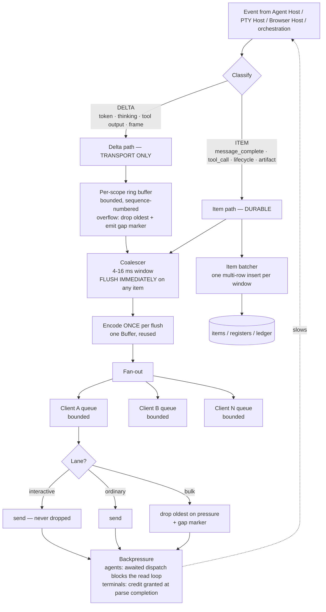

### Delta versus item — the exact split

| Class | Examples | Persistence | Replay | Loss policy |
|---|---|---|---|---|
| **Delta** | token, thinking chunk, tool stdout chunk, browser frame, terminal bytes | Append-only log file, batched, best-effort | Bounded window only (default 1,000 events) | **Droppable** for bulk lanes, with a visible gap marker |
| **Item** | `message_complete`, `tool_call_started/completed`, `stage_run.*`, `run.*`, artifact chunk, usage update | SQLite, batched multi-row insert | Full, from the item log | **Never dropped**; producer is blocked instead |

A reconnecting client receives: the last durable item snapshot, plus a bounded delta replay window. Deltas older than the window are simply gone. This matches Codex, t3code and omnigent exactly, and their own comment records that unbounded replay *"has OOM-killed servers on large databases."*

### Coalescing rules

- Window **4–16 ms** (adaptive; small because two-stage coalescing compounds latency — orca measured the double half-window at ~8 ms of a ~19 ms total).
- **Flush immediately on any item.** Never coalesce a text delta together with a tool call, an approval request or a lifecycle event. This preserves the thinking↔text ordering the current "cross-buffer flush" exists to protect, *without* defeating the batcher.
- The trailing flush **re-serialises at delivery time**, so a coalesced frame is never a stale frame.
- One encoded buffer per flush, sent to every subscriber on the scope. (Replaces P1-10's per-subscriber serialisation.)

### Backpressure — two mechanisms, chosen by producer type

| Producer | Mechanism | Why |
|---|---|---|
| Agent (provider CLI) | **Awaited sequential dispatch + a drain subscriber.** Listeners are awaited in order; one no-op subscriber awaits the slow sink's drain. The agent loop blocks itself, so token consumption from the provider stops. | We control the read loop. ~15 lines, no protocol. (Pi's approach.) |
| PTY | **Credit window with acknowledgement at parse completion.** Pause above the high watermark, resume below the low watermark, acknowledge in batches from inside the terminal's write-completion callback. | The producer is an OS process we can pause. Acknowledging at receipt is the documented failure mode. (VS Code's approach.) |
| Browser frames | **Single pending slot, latest wins, acknowledge the discarded frame immediately** so the browser keeps producing; drop on encoder queue depth. | A stale frame has negative value. |

### Constants, with their justification

| Constant | Value | Justification |
|---|---|---|
| `DELTA_COALESCE_MS` | 4–16 (adaptive) | Two-stage coalescing compounds; upstream window must stay small |
| `DELTA_RING_EVENTS` | 1,000 per scope | Matches t3code's resume gap ceiling; beyond it, snapshot instead of replay |
| `ITEM_BATCH_MS` | 25 | One multi-row insert per window; below the perceptual threshold for item arrival |
| `PTY_HIGH_WATERMARK` | 100,000 chars | VS Code's measured value |
| `PTY_LOW_WATERMARK` | 5,000 chars | **Must be ≥ the acknowledgement batch size or the terminal never unpauses** |
| `PTY_ACK_BATCH` | 5,000 chars | Ditto |
| `PTY_COALESCE_MS` | 5 | VS Code's per-terminal buffering window |
| `TERMINAL_SCROLLBACK_LINES` | 1,000 (100 for cross-restart revive) | Memory becomes O(lines × columns), not O(bytes emitted) |
| `BROWSER_MIN_FRAME_MS` | 66 (≈15 fps), single clamp | Replaces three contradictory clamps |
| `ENCODER_QUEUE_DROP` | > 2 | Chrome's own documented idiom for live encoding |
| `CLIENT_QUEUE_BULK` | 256 frames | Bounded; drop-oldest with a gap marker |
| `MAX_PARALLEL_TOOLS` | 8 | Currently unbounded (verified) |
| `TOOL_OUTPUT_MAX_LINES / BYTES` | 2,000 / 50 KB | Whichever hits first; overflow spilled to a file whose path is given **to the model** |
| `JSON_PAYLOAD_MAX` | 8 MB | Above this, stream — a 50 MB payload is a 2-second stall |

## 3.4 Persistence engine

Three stores, one write primitive. This replaces the current two-log design where one log is written synchronously and never read.

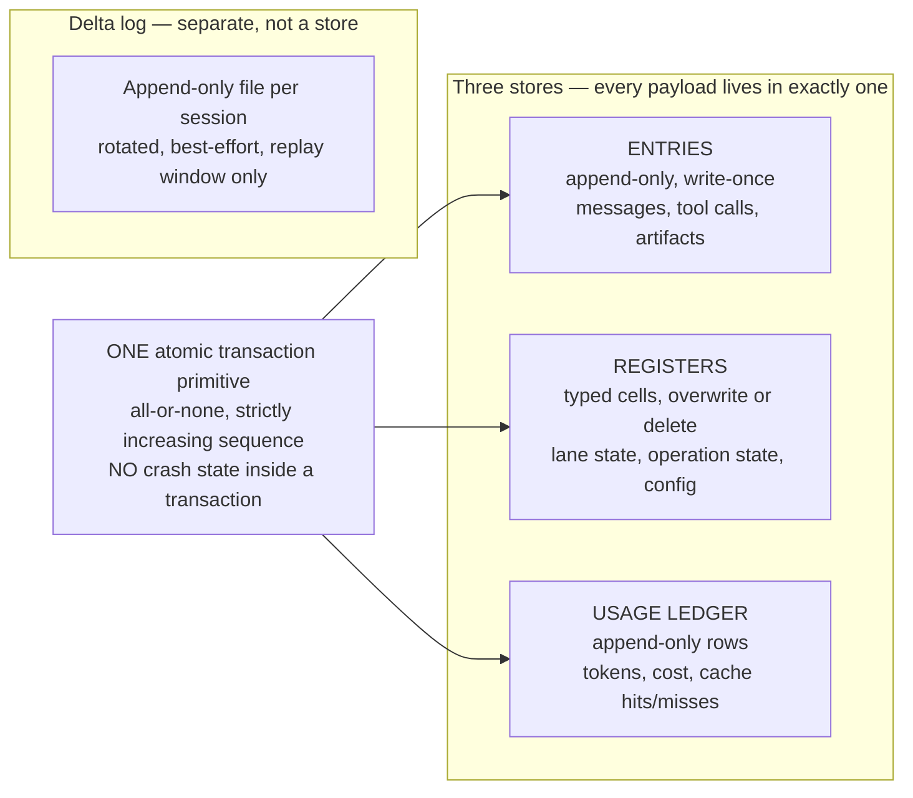

**Key mechanisms:**

- **The durable program counter.** After every step, one register (`op.state/{operationId}`) is overwritten with the **complete** current state. Recovery reads that register and switches on it. It never infers position from what is missing. The state is total — it never depends on a previous state.
- **The effect sandwich.** Commit intent (including **reserving the output ids**) → perform the uncertain effect → commit the settlement. On restart, an operation stuck at "effect pending" is resolved by writing a synthetic result **under the id reserved in the intent**, so every tool call has a result and nothing runs twice.
- **Per-tool replay policy.** Each tool declares `replay: "never" | "safe"`.
  - `never`: terminal commands, computer-use actions, file writes, git operations, HTTP POSTs.
  - `safe`: file reads, greps, searches, window lists, page snapshots.
- **Lanes.** A lane is three registers (`lane.leaf`, `lane.config`, `lane.state`) and owns **at most one operation**. N concurrent runs over one session cost three registers each and **zero history duplication**. This is how "multiple workflows in one chat" and "background agents over shared history" become cheap.
- **Corruption is a closed enum.** States the single-writer protocol cannot produce are **rejected**, not repaired.
- **Torn-tail repair.** A parse error on the *last line only* of an append-only file is an unacknowledged partial write → rewrite the valid prefix via temp-file-and-rename. A parse error anywhere else is fatal.
- **Fenced writer lease** for the shared database (Electron main, CLI and mobile relay can all touch it): claim by incrementing a fence, only steal an *expired* lease, renewal asserts exactly one row changed.

**SQLite configuration:** WAL mode, `synchronous=NORMAL`, **autocheckpoint disabled** with a background checkpoint driven from a size watchdog on the write-ahead file (so the writer never blocks on a disk sync), `busy_timeout` set, `ANALYZE` on schedule, `mmap_size` set, prepared-statement cache, and retention that actually fires.

## 3.5 Agent Host (provider integration)

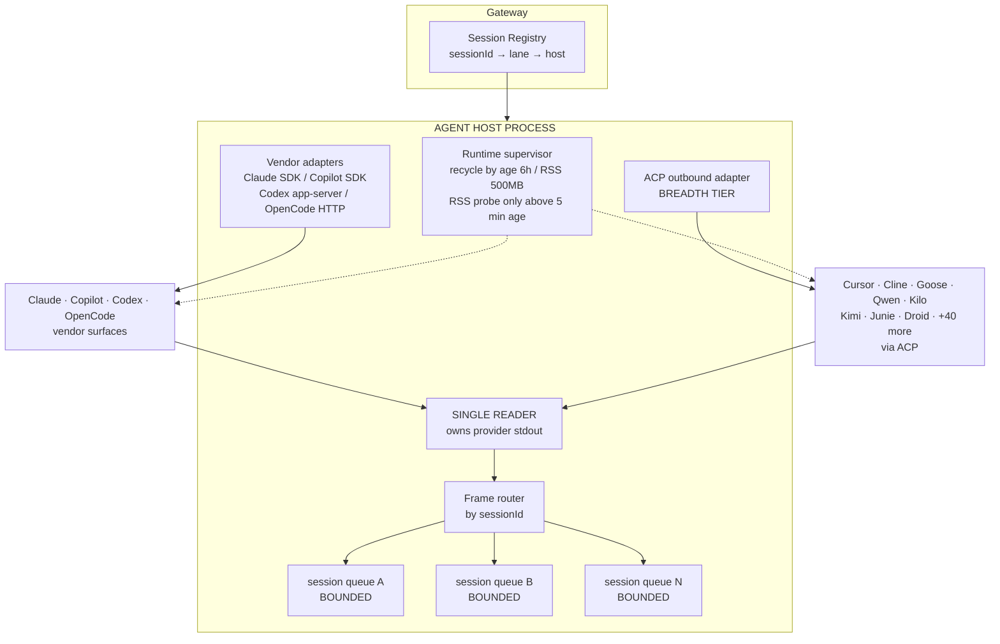

**What changes:**

| Today | Target |
|---|---|
| One Copilot CLI for the whole server, no routing, head-of-line blocking | **Single-reader demux**: one reader owns stdout and routes frames by session id into **bounded** per-session queues |
| Claude spawns one CLI per turn, uncapped, orphans forever | Bounded spawn concurrency + **boot-time reaper** + parent-PID heartbeat in every child |
| One bespoke adapter per vendor | **Vendor SDK/protocol for the four providers we ship** (Claude, Copilot, Codex, OpenCode); **one ACP client** for ~45 long-tail agents. Gemini CLI is **dropped** — consumer tiers stopped being served 2026-06-18 |
| No process hygiene | **Recycle by age (6 h) and memory (500 MB)**, with the memory probe skipped for young runtimes so the hot path stays CPU-only |
| Provider ownership lost on restart | Ownership store wired; a Claude-owned chat routes to Claude after a restart |
| Unbounded tool fan-out | `MAX_PARALLEL_TOOLS = 8`, with a **poison-pill downgrade**: one tool declaring sequential execution serialises the batch, but results are still emitted **in call order** so the transcript stays deterministic |
| Truncated arguments executed | **All tool calls in a batch fail** when the response was cut off by the token limit, with a synthetic error explaining why and instructing a re-issue |
| Cancellation throws | Semantic `cancelled` outcome; non-finished calls marked cancelled preemptively; pending permissions resolved as cancelled |
| Both providers cold-probed every 5 minutes on the create path | **Lazy provider modules behind a synchronously-returned stream** — a failed import or auth arrives as an in-band error event, not a rejected promise |
| Context inserted mid-run | **Append-only context invariant** enforced; mid-run writes defer to checkpoints; prompt assembled in `stable → context → volatile` tiers so caching works |

**Prompt cache management** (Law L8): four cache breakpoints — **one on the stable prefix, up to three on the most recent tool results, cleared and re-placed each turn.** Screenshots and large tool results pruned **in batches** (keep 3, prune every 25) so the prefix stays byte-identical for 25 turns between invalidations. Cache-miss cost computed, attributed to idle time or model change, and surfaced.

## 3.6 PTY Host (terminal integration)

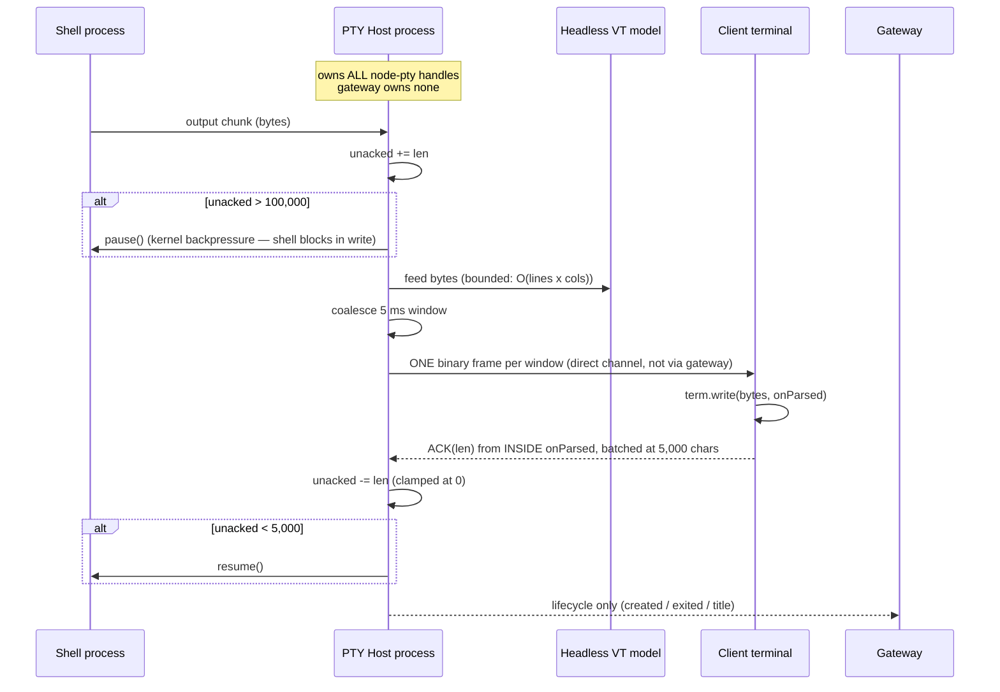

| Issue | Fix |
|---|---|
| P0-23 copy storm | **Scrollback becomes a headless terminal model** — memory O(lines × columns), default 1,000 lines, 100 for cross-restart revive. Where a byte buffer is still needed it is a string array with head removal, **never concatenation on the write path.** |
| P1-27 no coalescing | 5 ms window per terminal id, joined into one frame — the coalescer the docs already promise |
| P1-28 per-connection watermark | Watermark moves to the **session**; acknowledgements are per-session, not per-viewer |
| P1-38 immortal PTYs | Idle timer keyed on **client attachment**, not output. Corpses excluded from the cap. |
| X-19 no restart survival | **Reconnect** (window reload → reattach to the live process, replay the serialised buffer) is distinguished from **revive** (host restart → relaunch with the original environment). Only sessions that produced output are serialised. |
| P2-54 no instance cap | Instance cap with a typed refusal |
| Doc divergence | Documentation rewritten to match; the coalescer exists |

**Additionally:** an agent-run command and a user-typed command must be **the same terminal object**, with one flow-control implementation, one scrollback and one lifecycle. We achieve this **in our own PTY Host**, on every surface.

> ⚠️ **Correction (2026-08-18).** An earlier draft proposed inverting terminal ownership onto **ACP's client-provided `terminal/*` capability**. That is withdrawn: **ACP v2 removes all five `terminal/*` methods and both `fs/*` methods**, on the stated grounds that *"this surface was inconsistently implemented outside of a few IDEs."* Both serious ACP clients audited (t3code, KiroCrew) hardcode `terminal: false, fs: false`. If we later need to expose our terminal to an external agent, the v2-sanctioned route is an **MCP server**.

## 3.7 Browser Host

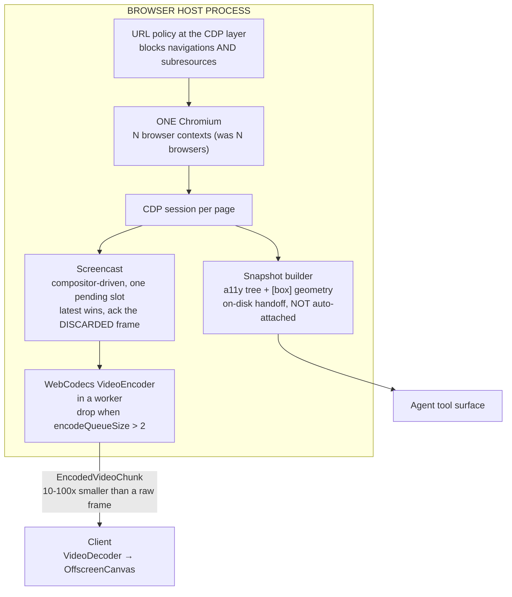

| Issue | Fix |
|---|---|
| P0-24 deadlock leak | Resolve the waiting promise in `stop()`; the cleanup path runs; the timer clears |
| P0-25 sweeper kills a watched browser | Activity timestamp bumped by the frame and screencast paths, not only by agent actions |
| P1-26 one browser per workspace | **One Chromium, N contexts.** Everything needed (profile isolation, permissions, request routing, init scripts, cookies, CDP sessions) is a per-context API. Port allocation replaced with a counter. |
| P1-33 transport chosen by exception | **`supportsScreencast` declared** (Law L9). Native mode refuses the stream endpoint outright rather than silently falling back. The concurrent JPEG polling path is deleted. |
| P1-34 three clamps, drop-after-encode | One clamp. Backpressure **throttles capture**, not just delivery: single pending slot, latest wins, acknowledge the discarded frame immediately so the browser keeps producing, and drop on encoder queue depth. |
| P1-32 120 ms click sleep | Replaced with a real readiness check; input chain depth bounded; rate limit added |
| X-17 snapshot on every result | Snapshot **not** auto-attached. The tool result is a short line (url, title, snapshot path); the tree stays on disk until the agent asks for it. |
| X-14 provider-side downscale | We own the downscale, record the factor per capture, and use per-model pixel budgets |
| — | Screenshot codec defaults to WebP/JPEG with a server-side max width — **3–5× smaller than PNG** |
| — | **Page-id routing** so N agents share one browser instead of one browser each |

**Desktop:** a native view positioned by bounds, with the compositor drawing it — **zero frames cross a process boundary.** Explicit capture remains available as a size-capped on-demand action. Untrusted contents are tracked by identity so permission handlers refuse **before** any origin heuristic runs.

## 3.8 Computer-Use Host

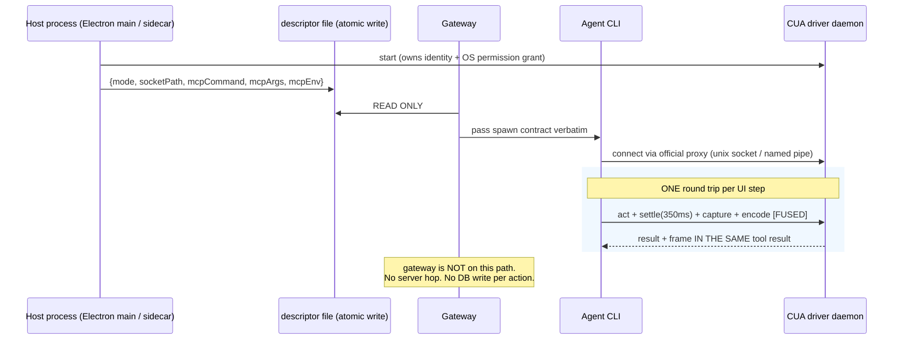

| Issue | Fix |
|---|---|
| P1-29 global permit of 1 | Concurrency becomes the driver's problem, per target. Where serialisation is still needed, a **reader/writer split**: read-only operations never queue behind synthetic input. |
| P1-30 3–4 round trips + PNG + 3 writes | **Fused act+observe: one round trip.** Their measured claim: this *"halves the model inferences per UI step."* Screenshot-every-action defaults off. Driver moves out of the server process **on Windows too** (the code already supports 3 of 4 runtimes). |
| P1-31 loads all artifacts | Fetch by id, stream it, check size **before** reading |
| P1-39 listener leak | Listener registered once, outside the loop; file watching replaces stat polling |
| X-15 no frame integrity | **Validate the terminator and byte length**, not just the magic number — a truncated JPEG has a valid header and renders as a grey half-frame. One-way latch disables the inline path after the first bad payload. |
| X-16 duplicate frames | Hash the **canonical full frame before cropping**; if unchanged, send text only, with a response that explicitly tells the agent **not to retry** (re-clicking a submitted button is the expensive kind of wrong). Fail open if the hash is unavailable. |
| X-14 coordinate space | Scaling computed at the far end from geometry resolved in the same command; factor recorded per capture; per-model pixel budgets; **instruction text placed before the image** |
| — | Use the **official computer tool type** so prompt-injection classifiers run — they add *"approximately zero latency and no cost"* and **do not run on custom tool definitions** |
| — | Native module import is **side-effect free**; nothing loads until an explicit capability call. Blocking work lives in a module with no async imports so it cannot be accidentally awaited. **Nested deadlines**: per-call *and* aggregate. |

## 3.9 Admission controller and lanes

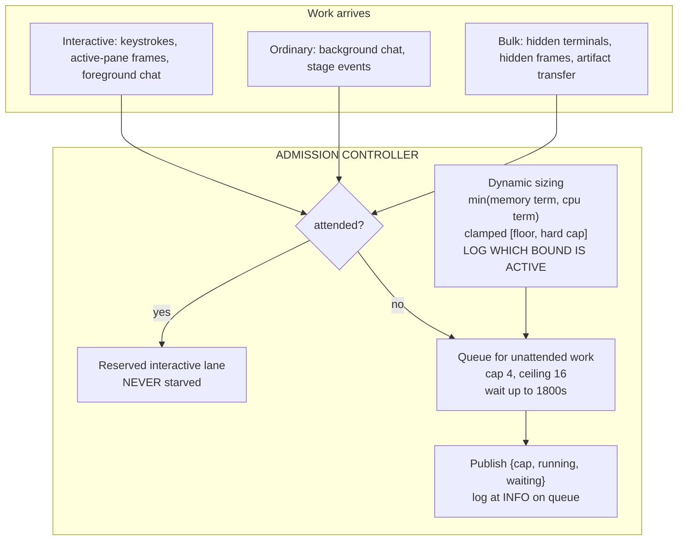

**Design decisions, each with its reason:**

| Decision | Reason |
|---|---|
| **Queue agent work; reject only control-plane overload** | *"A rejected turn loses the issue it was mid-way through, while a queued one only starts late."* |
| **The lane discriminator is one predicate — `attended`** | Human-watched turns bypass the cap entirely; unattended work queues. Costs nothing on the interactive path. |
| **The queue wait has its own timeout (1800 s), separate from the turn timeout** | Otherwise the queue wait consumes the turn's own ceiling and the failure is misattributed |
| **Log at INFO when queued** | *"This is the difference between 'the fleet is throttled' and 'a worker is hung'."* |
| **Publish depth in the health endpoint** | Makes throttling visible instead of mysterious |
| **Size from measured cost, and log which bound is active** | An explainable startup line beats a hardcoded number that is wrong on every machine |
| **Clamp configuration values on load, log, and audit** | So tampering is detectable after the fact even though the loader self-heals |

This **replaces** the seven independent caps: the 8-permit stage semaphore (which will also release across approval waits), the computer-use permit of 1, the browser cap, the terminal caps, and the absence of a chat cap.

## 3.10 Client runtime

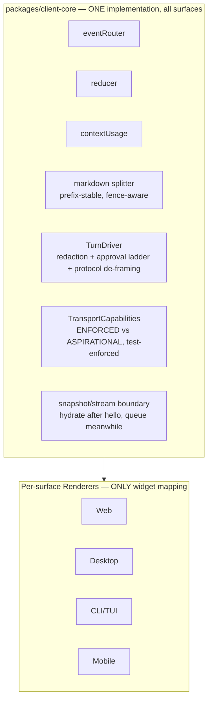

**Client-side rules:**

| Rule | Fixes |
|---|---|
| Coalesce delta application to **one animation frame**; flush the tail on completion | P0-47, P2-55, and the documented React behaviour where a store mutating per token defeats concurrent rendering entirely |
| **Append-only markdown rendering** with a prefix fast-path; full re-render only on divergence | P0-47 — turns quadratic into linear |
| Syntax highlighting in a **long-lived worker**, created once, with an explicit language allowlist | P0-47, P1-52 |
| **Visibility gating as a hard early return**, not a flag check; hidden frames released by default, retain is opt-in | P1-50 |
| **De-duplicate query invalidations per tick**; raise stale time above zero; stop invalidating the whole run list per stage event | P1-51 |
| **Bounded stores** — ring buffer for timelines, cleared on terminal status, raw payloads stripped | P1-37 |
| **Hydrate only after the stream says hello; queue frames arriving during hydration** | Snapshot/stream race |
| One splitter, one turn driver, one capability ledger | X-7, X-12 |

---

# PART 4 — Feature-by-feature integration plan

For each user-visible feature: what it depends on in the new architecture, what changes, and what the user notices.

| Feature | New components it uses | What changes | User-visible result |
|---|---|---|---|
| **Chat (single)** | Gateway mux → Admission (interactive lane) → Agent Host → Stream spine → client-core | Deltas stop being persisted; item batching; awaited-dispatch backpressure; append-only rendering | Tokens arrive smoothly under load; long answers no longer lock the tab; a 2-hour chat stays responsive |
| **Multiple concurrent chats** | Lanes (3 registers each); bounded per-session queues in Agent Host; single-reader demux | No head-of-line blocking between sessions; a large tool result in one chat cannot stall another | Chats are independent; one heavy session does not freeze the others |
| **Chat history** | Item log + artifact store; virtualization or content containment | 50-message cap removed; pagination added | You can scroll a 10,000-message chat |
| **Workflow run (single)** | Orchestration → Admission → Agent Host; durable program counter; item stream | Per-run poller replaced by a single reconciler; DAG frontier maintained incrementally instead of re-hashed | Stage transitions are instant, not up to 3 seconds late |
| **Multiple concurrent workflow runs** | Per-run lanes; per-run stage budget instead of one global 8 | Permit released across approval waits | One run parked on approval no longer stops every other run |
| **Human-in-the-loop gates** | Awakeable primitive (one-shot, external token); suspension | A pending gate holds **zero** process resources; side effects around gates are idempotent by rule | A gate can stay open for days at no cost; approving does not duplicate work |
| **Mid-run steering** | Signal primitive (named, resolvable repeatedly) | Distinct from the gate primitive | You can redirect a running agent without cancelling it |
| **Automations (loop/batch)** | Durable step memoization; all iterations written up front and claimed atomically | Restart resumes instead of losing undispatched rows | A 1000-row batch survives a restart |
| **Orchestrator / background agents** | Persisted task state; termination conditions (budget + convergence + arbiter); global worker cap | Restart no longer loses the wave; waves terminate deterministically | Background work is durable and bounded |
| **Integrated terminal** | PTY Host; credit flow control; headless VT scrollback; 5 ms coalescing | Terminal work leaves the gateway loop entirely | A build in a terminal no longer stutters your chat; terminals survive a reload |
| **Multiple terminals** | Per-session watermarks; instance cap; idle keyed on attachment | Two viewers no longer fight over pause/resume | Predictable behaviour with many tabs open |
| **Integrated browser** | Browser Host; one Chromium N contexts; WebCodecs pipeline | ~1 GB memory returned at 5 concurrent; capture throttles under pressure | Live view stays smooth; browsers stop dying while you watch them |
| **Multiple browser sessions** | Contexts + page-id routing | Concurrent agents share one browser | Faster start, far less memory |
| **Computer use** | CUA Host descriptor; fused act+observe; frame integrity + dedupe | Gateway leaves the action path; one round trip per UI step | Roughly half the model calls per UI step; no server-wide 30-second blocks |
| **Widgets / extensions** | Origin-pinned frames with a port handshake; bounded inline widget lifetime | Sandbox cannot collapse to same-origin; widgets are torn down | Safer, and no unbounded frame accumulation |
| **Agent provider switching** | ACP outbound + native adapters; ownership store; lazy modules | New providers need no bespoke adapter | Add a provider by configuration, not code |
| **Desktop app** | Same gateway, hosts co-located; native browser view; transferred `MessagePort` so bytes never touch the main event loop | No divergent code path | Native performance where it matters, identical behaviour elsewhere |
| **CLI / TUI** | client-core + frame-aligned drain | 200 reconciles/s → ~60 | Responsive TUI under fast streams |
| **Mobile** | client-core (already the reference implementation) | Promoted, not rewritten | Parity, and it stops being the outlier |
| **Cost and context visibility** | Usage update event + cache-miss accounting | New | You can see context fill and what a cache miss cost you |

---

# PART 5 — Implementation specification (33 work items)

Each item: **what**, **why**, **where**, **acceptance**.

### W01 — Database hot-path surgery
**What:** Gate the verbose callback on telemetry being enabled (do not pass it at all when off). Add a prepared-statement cache keyed on query text, hoisted out of the transaction. Remove the v1 event write from the hot path. Move the noise filter **above** the emit so filtered events cost nothing.
**Why:** The four changes together are the single largest measured win in the codebase.
**Where:** `packages/db/src/index.ts`, `StreamCursorRepository.ts`, `EventBus.ts`.
**Acceptance:** Per-token statement count ≤ 2. Measured per-token blocking time ≤ 40 µs. Benchmark asserts it.

### W02 — Storage configuration and retention
**What:** Retention TTL that fires (7–14 days for deltas, longer for items). Add the missing index. Schedule `ANALYZE`. Set `mmap_size`. Disable autocheckpoint and drive checkpointing from a size watchdog on a background path. Replace the boot-time aggregate with a maintained counter.
**Acceptance:** Cold boot < 300 ms. Database size stabilises. No full scans in the query plan for stream reads.

### W03 — Transaction manager rework
**What:** One transaction primitive. Broker appends route through it. No nesting that can degrade to a savepoint. No lock held across an `await` on external work. Per-key queues (promise-tail) replace the global mutex, with the tail catching rejections so a failure reaches its caller but never poisons the queue.
**Acceptance:** A test proves a broadcast row can never be rolled back. Concurrent independent writes do not serialise.

### W04 — Event classification
**What:** Every event is typed `delta` or `item` at its source. A lint rule fails on an unclassified kind.
**Acceptance:** Exhaustive switch; no default case.

### W05 — Coalescer and fan-out
**What:** Per-scope bounded ring buffer, 4–16 ms adaptive window, immediate flush on any item, one encoded buffer per flush, per-client bounded queue, lane-based drop policy with a visible gap marker.
**Acceptance:** One serialisation per flush regardless of subscriber count. A slow client drops bulk frames and receives a gap marker; it never drops items.

### W06 — Backpressure
**What:** Awaited sequential dispatch plus a drain subscriber for agent producers. Credit window with acknowledgement at parse completion for terminals. Delete the dead drain-waiter code and the orphaned writer, or wire the writer.
**Acceptance:** With an artificially slow client, server memory stays flat and the provider read rate drops. No unbounded queue anywhere.

### W07 — Durable item writer
**What:** Micro-batched multi-row inserts. Append-only delta log per session with rotation and torn-tail repair. The blocking per-event file append is replaced with an asynchronous buffered writer — or deleted, since the durable log already carries the information.
**Acceptance:** Zero synchronous file writes on the event path. Batch size and window are configurable and measured.

### W08 — Stream cursors and resume
**What:** Stream-id-scoped cursors carried in the transport's own id field so browser clients resume with no client code. A `hello` frame carrying `{cursor, resumed}` that tells the truth when the cursor fell off the end. Bounded replay. Per-client subscription filters. The unmanaged endpoint acquires a slot like every other.
**Acceptance:** Reconnect after a server restart never replays another run's frames. A client past the window is told so and re-snapshots.

### W09 — Multiplexed transport
**What:** One WebSocket per client carrying all scopes, behind a `StreamTransport` port with three implementations: WebSocket, SSE (compatibility), and in-process message port (Electron). Route the bypassing call sites through the shared manager.
**Why:** We are already over the 6-connection browser limit with one chat and three browser tabs, and the agent control plane needs client→server steering, cancellation and approval mid-turn.
**Acceptance:** One chat page with 5 browser tabs uses **one** stream connection. REST latency does not degrade with tabs open.

### W10 — ACP inbound adapter
**What:** Expose GeneratorAI as an ACP agent over stdio/socket. Sessions, prompts, cancellation, permission requests, usage updates, message-id segmentation.
**Acceptance:** Zed or VS Code can drive a GeneratorAI session end to end.

### W11 — ACP outbound provider adapter *(breadth tier)*
**What:** Consume any ACP agent as a backend behind `IAgentHarness`, on the official `@agentclientprotocol/sdk`, with **explicit protocol-version negotiation** and a typed `_meta` extension registry that falls back to `-32601` rather than crashing. Cancellation normalised to a semantic outcome.
**Scope correction (2026-08-18):** this is the **long-tail tier only** — Cursor, Cline, Kilo, Goose, Qwen, Kimi, Junie, Droid and ~40 more. It is **not** the path for Claude, Copilot, Codex or OpenCode, because ACP is a strict subset of every vendor surface and two gaps are disqualifying: `canUseTool` fires only on permission fall-through so ACP **cannot gate every tool call** on Claude (hooks are function-valued and cannot cross JSON-RPC), and Copilot's ACP mode makes tool filtering **server-global rather than per-session**.
**Acceptance:** Goose or Cursor runs end to end as a provider with no vendor-specific adapter code. Version negotiation fails legibly against a v2-only agent.

### W11-c — Codex provider on `codex app-server`
**What:** Native Codex provider over the app-server JSON-RPC protocol. Types generated from the **pinned binary** (`codex app-server generate-ts`) and diffed in CI. `-32001` exponential backoff with jitter. `optOutNotificationMethods` to cut IPC volume. Every union treated as open with non-fatal defaults.
**Why:** `codex proto` was deleted (PR #4520). The official TS SDK only wraps `codex exec --experimental-json` and has no steering, interrupt or approval callbacks. The app-server carries `turn/steer`, permission profiles, execpolicy/network amendments and paginated history.
**Acceptance:** A schema drift between the pinned binary and our generated types fails CI. Backpressure produces backoff, not a dropped turn.

### W11-d — OpenCode provider on `opencode serve`
**What:** Native OpenCode provider over HTTP + SSE, client **generated from the OpenAPI 3.1 spec at `GET /doc`**. Use `--attach` for warm reuse.
**Why:** It is a strict superset of OpenCode's own ACP mode (which is missing `/undo` and `/redo`), it has a versioned contract, and it is the surface OpenCode's own TUI, web UI and VS Code extension are built on.
**Acceptance:** Client types regenerate from `/doc` in CI.

### W12 — Agent Host process
**What:** A supervised host owning provider processes. Single-reader demux routing by session id into bounded queues. Recycling by age and memory. Ownership store wired. Bounded spawn concurrency.
**Acceptance:** A multi-megabyte tool result in one session does not delay another session's tokens (measured). Provider crash restarts within the cap and does not take the gateway down.

### W13 — Provider hardening
**What:** `MAX_PARALLEL_TOOLS` with order-preserving results and poison-pill downgrade. Fail all tool calls when the response was truncated. Late-update guard. Semantic cancellation. Abort signal threaded from the stage timeout, with timers cleared. Lazy provider modules. Append-only context invariant enforced with cache breakpoint placement. Hook bridge decision: wire it (with a phase index) or remove it and its documentation.
**Policy gate (2026-08-18):** the tool-call gate must be a **`PreToolUse` hook**, not `canUseTool`. Anthropic documents that `canUseTool` *"is invoked only when the permission evaluation flow resolves to a prompt"* — calls already allowed by `allowedTools`, a settings rule, or the permission mode **never reach it**, so it cannot be a security boundary. Note also that an SDK-**callback** hook that times out **fails closed**, while a **command** hook that times out **fails open** — we need the callback form.
**Acceptance:** Named tests for each. A truncated response never executes a tool.

### W14 — PTY Host
**What:** Supervised host owning all PTYs. Headless terminal model for scrollback. Ring-style byte recorder where bytes are still needed. 5 ms coalescing. Per-session watermark with acknowledgement at parse completion. Reconnect versus revive. Idle keyed on attachment. Instance cap with typed refusal. Tail-limited scrollback replay.
**Acceptance:** A `yes`-style flood is interruptible; terminal memory is O(lines × columns); chat token latency is unaffected by terminal load (measured).

### W15 — Browser Host
**What:** One Chromium with N contexts. Resolve the stop deadlock. Bump activity on frame and screencast paths. Declared screencast capability. Single clamp. Single pending frame slot, latest wins, acknowledge the discarded frame. WebCodecs encode in a worker with queue-depth drop; decode to an offscreen canvas on the client. Bounded input chain with a rate limit; the fixed click sleep replaced with a readiness check. Delete the concurrent polling path.
**Acceptance:** 5 concurrent browsers under 1 GB. A slow client reduces host CPU. No leaked timers after 100 start/stop cycles.

### W16 — Browser tool surface
**What:** Hybrid snapshots (accessibility tree plus per-element geometry). Snapshot not auto-attached; the tool result is a short line plus a path. Page-id routing. URL policy at the protocol layer so subresources are blocked. Screenshot codec and size owned by us.
**Acceptance:** Token cost per browser step drops measurably. Blocked URLs cannot load subresources.

### W17 — CUA Host
**What:** Descriptor model — the host owns the driver and publishes a connection descriptor; the gateway reads it and hands the spawn contract to the agent. Fused act+settle+capture in one round trip returning the frame in the same tool result. Frame integrity validation with a one-way latch. Duplicate suppression with explicit no-retry guidance. Owned downscale with per-model budgets and recorded factors. Instruction text before image. Official tool type. Reader/writer split. Side-effect-free import. Nested deadlines. Batch action support for visually-independent sequences.
**Acceptance:** One click = one driver round trip, zero server hops, zero database writes on the action path. Model calls per UI step drop measurably.

### W18 — Admission controller
**What:** Lanes, attended/unattended predicate, queue-don't-reject for agent work, published depth, dynamic sizing from measured cost with the active bound logged, configuration clamps with audit. Replace the per-run poller with one process-wide reconciler. Conditional polling for durable sleep. Fix the global-scope clamp inversion. Release the stage permit across approval waits and hook backoff; scope it per run.
**Acceptance:** With 8 stages on approval, unrelated runs still progress. Health endpoint shows cap/running/waiting.

### W19 — Worker pools and boundary costs
**What:** Pools split by blocking class. Size cap and streaming fallback for large payload serialisation. Memoised route policy. Raw-body retention limited to the routes that need it. Remove the synchronous existence check from the static path.
**Acceptance:** A large accessibility scan does not delay file I/O. No single payload can stall the loop for more than a bounded time.

### W20 — Process supervision
**What:** Parent-PID heartbeat in every child. Both uncaught-exception and unhandled-rejection handlers, logging through one funnel, deregistered on dispose. Restart caps with a **conditional** predicate (do not restart on unrecoverable system errors or a single failing sub-request). Boot-time reaper for stray provider processes. Identity-checked port acquisition with a fallback ladder. Cross-platform process-tree kill.
**Acceptance:** Kill the gateway; every child exits within 5 s. Zero orphans after 50 restart cycles. A rejection is logged, never fatal.

### W21 — Wedge detection
**What:** Event-loop delay monitored from a **worker thread** so it survives main-thread starvation. On trip: write a diagnostic report and replay it to the log on next boot. Liveness probes hit a **loop-turning endpoint**, not the socket, with an in-flight guard and once-per-episode firing. Unresponsiveness attributed by acknowledgement counting, with the checker cancelled when nothing is outstanding.
**Acceptance:** An artificially blocked loop produces a diagnostic and a user-visible state within 30 s. An idle system costs zero timers.

### W22 — Durable execution engine
**What:** Step memoization (each step runs once, result persisted and injected on re-execution). Journal at **stage boundaries only** — token streams never enter the journal. Three coordination primitives: Signal (steering), Awakeable (approval), workflow promise (read-many). Suspension so a pending gate holds zero resources. All automation iterations written up front and claimed atomically. Lint rules for the interrupt hazards (idempotent pre-gate side effects; no gate inside a loop; id-keyed parallel resume).
**Acceptance:** Kill the process mid-batch at row 40 of 1000; on restart it resumes at 41. A gate open for 24 hours consumes no memory.

### W23 — Run identity model
**What:** Task immutability — a terminal run never restarts; retry creates a new run in the same context with an ancestor reference. Artifacts separated from messages. Multi-stream broadcast contract implemented as specified.
**Acceptance:** Three surfaces watching one run receive identical ordered events; closing one affects none.

### W24 — Orchestration hardening
**What:** Persist orchestrator task state. Termination conditions: time budget **and** convergence threshold **and** arbiter. Incremental DAG frontier replacing per-completion re-hashing. Fresh agent with no history for scheduled runs. Session lineage across compaction. Reduce the 5-round-trips-per-stage.
**Acceptance:** Restart mid-wave recovers. A non-converging wave terminates on its own.

### W25 — Workspace and worktree lifecycle
**What:** Teardown hooks ordered by **declared phase** (database → native handles → filesystem), with the browser registered. `git worktree remove`/`prune` before dropping rows. Parallel directory creation and parallel worktree creation. Workspace creation moved off the request path with a readiness gate the agent must pass before using the directory.
**Acceptance:** Delete a workspace with a live browser, terminal and worktree: no orphan process, no orphan worktree entry in the user's repository, no leaked port. Chat creation returns in < 500 ms.

### W26 — Client runtime consolidation
**What:** All four surfaces consume `packages/client-core`. Frame-aligned coalescing. Snapshot/stream boundary with hydrate-after-hello and a re-entrancy guard. Invalidation de-duplication per tick. Fix the whole-record store subscription. Port the frame-aligned drain to the CLI.
**Acceptance:** One event-routing implementation. Web request volume with 5 runs open drops by an order of magnitude.

### W27 — Web rendering
**What:** Append-only incremental markdown with a prefix fast path and a word-rate buffer. Highlighting in a worker; drop auto-detection from the chat path. Virtualization for settled history plus content containment; the streaming message rendered unvirtualized. Remove the message cap and add pagination. Visibility gating as an early return. Bounded stores. Terminal instance cap. Remove the character-by-character placeholder build.
**Acceptance:** A 200 KB answer streams without a dropped frame. A 10,000-message chat scrolls at 60 fps.

### W28 — Bundle
**What:** Manual chunking and vendor split. Diff providers mounted lazily in the surfaces that use them. Hidden source maps. Budget enforced in CI.
**Acceptance:** Under the declared budget, enforced.

### W29 — Surface parity
**What:** Transport capability ledger per surface with enforced/aspirational classification and a test that fails on an unclassified field. One turn driver plus per-surface renderers; the shared pipeline owns the teardown ordering. One prefix-stable, fence-aware markdown splitter. Shipped conformance suites for harness providers and storage backends.
**Acceptance:** A new provider passes or fails in CI. A capability claim that the code does not honour fails a test.

### W30 — Experience
**What:** Context gauge and cost meter from the usage event. Cache-miss notice. Activity channel for gate cards and stage progress. Chunk events with client-side auto-close. Two-phase stop with an arming window and a force-reset escape hatch. Restart-proof widget tokens. Widget overflow degradation in shared code. Capture-failure-as-permission-signal. Explainable startup and queue depth in the UI.
**Acceptance:** Stop always stops. No spinner outlives its producer. The user can see what a turn cost.

### W31 — Security
**What:** Refuse to render a widget when the assets base is empty or resolves to the host origin. Content security policy on the origin rendering model-authored content. Credentials in a restricted temp file deleted on settle, never on a command line. Environment allowlist for agent-issued shell. Process-tree kill. Configuration clamps with audit. Capability enable-flags in files the agent cannot read or write.
**Acceptance:** A widget with an empty assets base does not render. No secret appears in a process listing.

### W32 — Observability
**What:** Remove `sessionId` from redaction. Counters on every expensive fallback, asserted in tests. Metrics facade that costs nothing when disabled and validates before emitting. Benchmarks beside the code, out of CI, one flag from reproducible. A load-test scenario running the Part 1.P load.
**Acceptance:** The load test asserts p95 token latency, a memory ceiling, and zero orphan processes.

### W33 — Extensibility and cleanup
**What:** Ports with shipped defaults; the core never branches on which implementation is loaded. DAG scheduler lock as instance state. Composition root split — business logic moved out of wiring. Stop reaching through the ORM to the raw driver. Delete the dead abstractions. Layering rules that prevent shared code importing the web framework, Electron, or the database driver.
**Why the layering rule matters:** without it, nothing can move out of process cleanly. It is a prerequisite for Phase 2, not a cleanup task.
**Acceptance:** Lint enforces the boundaries. The same service code runs in the gateway, a host process, and a unit test unchanged.

---

# PART 6 — Phased delivery plan

```mermaid
gantt
  dateFormat X
  axisFormat %s
  section Phase 0
  Stop the bleeding            :p0, 0, 1
  section Phase 1
  Stream spine                 :p1, after p0, 3
  section Phase 1.5
  Protocol adoption            :p15, after p1, 2
  section Phase 2
  Process split + admission    :p2, after p15, 4
  section Phase 3
  Native hosts                 :p3, after p2, 4
  section Phase 4
  Client rebuild               :p4, after p15, 3
  section Phase 5
  Durability + orchestration   :p5, after p2, 3
  section Phase 6
  Guardrails                   :p6, after p3, 2
```

*(Phase 4 can run in parallel with Phase 2/3 — it depends only on the protocol, not on the process split.)*

### Phase 0 — Stop the bleeding
**Work items:** W01, W02 (partial), W20 (partial)
**Contents:** verbose gate · prepared-statement cache · drop the v1 write · noise filter above emit · retention TTL · missing index · `ANALYZE` · uncaught-exception handler · parent-PID heartbeat in every child · boot reaper · screenshot-every-action off · instruction-before-image · screenshot codec to WebP/JPEG with a max width · `unref()` audit · remove `sessionId` from redaction · diff providers out of the app root · replay buffer keeps sequence slots but drops screen payloads.
**Exit criteria:** per-token blocking time ≤ 40 µs measured · zero orphan processes after a restart cycle · ~1.4 GB of disk reclaimed · cold boot < 300 ms.
**Risk:** very low. All changes are local and individually revertible.

### Phase 1 — Stream spine
**Work items:** W03, W04, W05, W06, W07, W08, W09
**Exit criteria:** database write volume down ≥ 10× on a streaming benchmark · one serialisation per flush · a deliberately slow client causes flat server memory and reduced provider read rate · one chat page with 5 browser tabs uses one connection · reconnect after restart never replays a foreign run.
**Risk:** medium — this is the core change. Mitigate with a kill switch that restores the legacy per-event path, and a benchmark gate.

### Phase 1.5 — Protocol adoption
**Work items:** W10, W11, W23 (data model only)
**Why here:** the process boundary in Phase 2 should be drawn on a stable external contract, not on today's internal event shapes.
**Exit criteria:** an external ACP client drives a session end to end · Claude Code runs as a backend with no vendor adapter · retry creates a new run in the same context.
**Risk:** low-medium. Additive; existing paths keep working.

### Phase 2 — Process split and admission control
**Work items:** W12, W18, W19, W20 (complete), W21, W33 (layering rules first)
**Order within the phase:** layering rules → Agent Host → admission → pools → supervision → wedge detection.
**Exit criteria:** a large tool result in one session does not delay another (measured) · 8 stages on approval do not stop unrelated runs · health endpoint publishes queue depth · an artificially blocked loop is detected and attributed within 30 s.
**Risk:** high — this is a structural change. Mitigate by shipping the Agent Host behind a flag that falls back to in-process, and by running both paths in the load test.

### Phase 3 — Native hosts
**Work items:** W14, W15, W16, W17, W25
**Exit criteria:** terminal memory O(lines × columns) · a terminal flood does not affect chat latency · 5 browsers under 1 GB · a slow client reduces browser host CPU · one click = one driver round trip with zero server hops · workspace delete leaves no orphan process, port or worktree entry.
**Risk:** high per host, but the hosts are independent — ship them one at a time.

### Phase 4 — Client rebuild *(parallelisable with 2 and 3)*
**Work items:** W26, W27, W28, W29, W30
**Exit criteria:** a 200 KB answer streams without a dropped frame · a 10,000-message chat scrolls at 60 fps · the bundle is under budget and enforced · one event-routing implementation across four surfaces · stop always stops.
**Risk:** medium. Highly visible, so ship behind feature flags per surface.

### Phase 5 — Durability and orchestration
**Work items:** W22, W23 (complete), W24, W13
**Exit criteria:** kill mid-batch at row 40 of 1000 and resume at 41 · a 24-hour gate consumes no memory · restart mid-wave recovers · a non-converging wave terminates on its own · a truncated response never executes a tool.
**Risk:** medium. Test with deliberate crash injection.

### Phase 6 — Guardrails
**Work items:** W29 (conformance), W31, W32, W33 (complete)
**Exit criteria:** the Part 1.P load test runs in CI and asserts p95 latency, a memory ceiling and zero orphans · every expensive fallback has a counter with a test · every tuning constant carries its measurement · every risky optimisation has a kill switch · documentation matches the code.
**Risk:** low. This is what stops the whole effort regressing.

---

# PART 7 — Traceability matrix

**Every issue from Part 1, mapped to the work item that fixes it and the phase that delivers it.** This is the completeness check.

| Issue | Sev | Work item | Phase |
|---|---|---|---|
| P0-1 verbose SQL tax | P0 | W01 | 0 |
| P0-2 prepare-per-event | P0 | W01 | 0 |
| P0-3 nested transaction rollback after broadcast | P0 | W03 | 1 |
| P0-7 backpressure counted then discarded | P0 | W06 | 1 |
| P0-8 producer never slows; unbounded queues | P0 | W06 | 1 |
| P0-13 one provider CLI, head-of-line blocking | P0 | W12 | 2 |
| P0-14 unbounded per-turn spawns; 24 orphans | P0 | W12, W20 | 0 (reaper), 2 (host) |
| P0-15 blocking file append per event per run | P0 | W07 | 1 |
| P0-23 terminal copy storm | P0 | W14 | 3 |
| P0-24 screencast deadlock leak | P0 | W15 | 3 |
| P0-25 sweeper kills a watched browser | P0 | W15 | 3 |
| P0-35 browser missing from delete hook | P0 | W25 | 3 |
| P0-36 worktrees never pruned | P0 | W25 | 3 |
| P0-40 rejection kills the process | P0 | W20 | 0 |
| P0-41 automations lose work silently | P0 | W22 | 5 |
| P0-47 quadratic markdown re-parse | P0 | W27 | 4 |
| P0-48 50-message cap, no pagination | P0 | W27 | 4 |
| P0-49 whole-store subscription | P0 | W26, W27 | 4 |
| P1-4 two logs, one unread, unindexed | P1 | W01 | 0 |
| P1-5 global transaction mutex across await | P1 | W03 | 1 |
| P1-6 retention never fires; missing index | P1 | W02 | 0 |
| P1-9 queue serialises fan-out | P1 | W05 | 1 |
| P1-10 per-subscriber serialisation | P1 | W05 | 1 |
| P1-11 unmanaged endpoint, 250 ms poll | P1 | W05, W08 | 1 |
| P1-16 global stage semaphore across approvals | P1 | W18 | 2 |
| P1-17 timeout does not abort; timers leak | P1 | W13 | 5 |
| P1-18 per-run 3 s poller | P1 | W18 | 2 |
| P1-19 DAG re-hash on hot path; module globals | P1 | W24, W33 | 5, 2 |
| P1-20 7 git spawns per stage and per turn | P1 | W25 | 3 |
| P1-26 one Chromium per workspace | P1 | W15 | 3 |
| P1-27 no terminal coalescing | P1 | W14 | 3 |
| P1-28 per-connection watermark on shared PTY | P1 | W14 | 3 |
| P1-29 global computer-use permit of 1 | P1 | W17 | 3 |
| P1-30 3–4 round trips + PNG + in-process driver | P1 | W17 | 3 |
| P1-31 screenshot read loads all artifacts | P1 | W17 | 3 |
| P1-32 120 ms click sleep; unbounded chain | P1 | W15 | 3 |
| P1-33 transport chosen by exception | P1 | W15 | 3 |
| P1-34 three clamps; drop after encode | P1 | W15 | 3 |
| P1-37 unbounded maps (server and web) | P1 | W03, W27 | 1, 4 |
| P1-38 immortal terminals | P1 | W14 | 3 |
| P1-39 listener leak in a loop | P1 | W17 | 3 |
| P1-42 provider ownership lost on restart | P1 | W12 | 2 |
| P1-43 orchestrator state in memory only | P1 | W24 | 5 |
| P1-44 hook bridge inert | P1 | W13, W33 | 5, 6 |
| P1-45 worktree readiness race | P1 | W25 | 3 |
| P1-50 hidden tabs fully live | P1 | W27 | 4 |
| P1-51 invalidation storm + 24 pollers | P1 | W26 | 4 |
| P1-52 bundle 4× over budget | P1 | W28 | 4 |
| P1-53 widget sandbox collapse | P1 | W31 | 6 |
| P2-12 bypass streams; connection limit | P2 | W09 | 1 |
| P2-21 5 round trips per stage | P2 | W24 | 5 |
| P2-22 both providers cold-probed | P2 | W13 | 5 |
| P2-46 blocking workspace creation | P2 | W25 | 3 |
| P2-54 no terminal instance cap | P2 | W27 | 4 |
| P2-55 CLI reconcile per token | P2 | W26 | 4 |
| P2-a route policy + auth writes | P2 | W19, W20 | 2 |
| P2-b raw body retained on every request | P2 | W19 | 2 |
| P2-c boot aggregate 2.13 s | P2 | W02 | 0 |
| P2-d unconditional 5 s and 30 s polls | P2 | W18 | 2 |
| P3-a sessionId redacted | P3 | W32 | 0 |
| P3-b metrics wrong for streams | P3 | W32 | 6 |
| P3-c sync existence check | P3 | W19 | 2 |
| P3-d cap clamps global down | P3 | W18 | 2 |
| P3-e placeholder built char-by-char | P3 | W27 | 4 |
| P3-f dead abstractions | P3 | W33 | 6 |
| X-1 no parallel-tool cap | P1 | W13 | 5 |
| X-2 truncated arguments executed | P1 | W13 | 5 |
| X-3 late update after settle | P1 | W13 | 5 |
| X-4 cancellation as error | P1 | W11, W13 | 1.5, 5 |
| X-5 mid-run context breaks cache | P1 | W13 | 5 |
| X-6 no cache-miss accounting | P2 | W30, W32 | 4, 6 |
| X-7 duplicated splitters | P2 | W29 | 6 |
| X-8 no wedge detection | P1 | W21 | 2 |
| X-9 unbounded payload serialisation | P1 | W19 | 2 |
| X-10 shared CPU/IO pool | P1 | W19 | 2 |
| X-11 no conformance suites | P2 | W29 | 6 |
| X-12 no capability ledger | P2 | W29 | 6 |
| X-13 no session lineage | P2 | W24 | 5 |
| X-14 provider-side downscale | P1 | W16, W17 | 3 |
| X-15 no frame integrity check | P1 | W17 | 3 |
| X-16 duplicate frames to the model | P2 | W17 | 3 |
| X-17 snapshot auto-attached | P1 | W16 | 3 |
| X-18 no port identity check | P2 | W20 | 0 |
| X-19 terminals lost on restart | P1 | W14 | 3 |
| X-20 no wave termination conditions | P1 | W24 | 5 |
| X-21 scheduled runs reuse sessions | P2 | W24 | 5 |
| X-22 no boot reaper | P1 | W20 | 0 |
| X-23 interrupt hazards | P1 | W22 | 5 |
| X-24 run mutated in place | P1 | W23 | 1.5 / 5 |
| X-25 results in messages, not artifacts | P1 | W23 | 1.5 / 5 |
| §1.O doc divergences (10 items) | — | W14, W15, W17, W18, W03, W08, W25 | 1–3 |
| Missing content security policy | P2 | W31 | 6 |

**Coverage check:** 90 issues + 10 documentation divergences → all mapped. **No issue in Part 1 is unassigned.**

Work items with no issue mapped to them (i.e. purely enabling work): **W04** (classification, enables W05/W07), **W10** (inbound ACP, enables external integration), **W29** partially, **W32** partially. All are justified in Part 5.

---

# PART 8 — Guardrails and acceptance

## 8.1 The rules that stop this regressing

| Rule | Mechanism |
|---|---|
| Every tuning constant carries the measurement that produced it | Code review; a lint rule flagging bare numeric constants in the listed hot-path files |
| Every risky optimisation has an environment kill switch | Naming convention plus a registry test that every switch is documented |
| Every expensive fallback increments a counter | Counter registry; tests assert deltas |
| Documentation matches code | Doc-drift check for the ten claims in §1.O; a failing check blocks merge |
| Shared code cannot import the web framework, Electron, or the database driver | Layering lint (prerequisite for Phase 2) |
| No new synchronous filesystem or process call on the event loop | Lint tripwire with a shrink-only allowance for existing sites |
| No `stream.on('data', d => other.write(d))` | Lint rule; measured cost of ignoring backpressure is ~17× memory for zero throughput gain |
| Disposables registered at creation | Lint rule |
| A new capability field must be classified enforced or aspirational | Capability ledger test |
| A new harness provider or storage backend must pass the shipped conformance suite | CI |

## 8.2 Benchmarks (beside the code, out of CI, one flag from reproducible)

| Benchmark | Asserts |
|---|---|
| Token throughput through the spine | Statements per token; blocking microseconds per token; allocations per token |
| Terminal end-to-end | Megabytes/second sustained; interrupt latency under flood; memory ceiling |
| Browser frames | Frames/second at N sessions; host CPU with a slow consumer versus a fast one |
| Stage start latency | Round trips and process spawns to first token |
| Client render | Frames dropped while streaming a 200 KB answer; scroll at 10,000 messages |
| Cold start | Time to first usable UI; time to first response on the API |

## 8.3 The load test that must pass

The Part 1.P scenario — 5 chats + 3 workflow runs + 1 automation × 20 iterations + 5 terminals + 3 browsers + 2 computer-use sessions — running in CI, asserting:

- p95 token delivery latency below a threshold
- resident memory below a ceiling for the duration
- **zero orphan processes at the end**
- zero unbounded queue growth (sampled)
- no dropped items (deltas may drop on bulk lanes; items never)
- clean shutdown within 5 seconds

Today **nothing in the test suite exercises concurrency at all.** This is the single most important addition in Phase 6.

---

# PART 9 — Open decisions requiring your call

These are genuine forks where the research supports more than one answer. Each needs a decision before the phase that depends on it.

| # | Decision | Options | Recommendation | Needed by |
|---|---|---|---|---|
| D1 | **Delta log storage** | (a) append-only files per session, (b) SQLite with aggressive retention, (c) in-memory only with no delta replay | **(a)** — every system studied uses files for this; SQLite is then purely the item index and can be rebuilt | Phase 1 |
| D2 | **Transport** | (a) one multiplexed WebSocket, (b) keep SSE and enable HTTP/2, (c) both | **(c)** — WebSocket as primary (the control plane needs client→server steering anyway), SSE retained for the CLI and simple integrations | Phase 1 |
| D3 | **Host process mechanism** | (a) `utilityProcess` in Electron and `child_process` on the server, (b) `worker_threads`, (c) fully separate services | **(a)** — the isolation argument against workers is explicit: a worker is a separate isolate but the *same* process, priority class, failure domain and memory accounting | Phase 2 |
| D4 | **Durable engine** | (a) build step memoization on our SQLite, (b) embed an existing engine, (c) deterministic replay | **(a)** — step memoization has no determinism rules on our TypeScript and self-hosts on the database we already have | Phase 5 |
| D5 | **Browser live view** | (a) keep JPEG with the fixes, (b) WebCodecs over the existing socket, (c) WebRTC | **(b)** — encoded chunks are 10–100× smaller than raw frames, hardware-accelerated, off the main thread, one transport, no signalling infrastructure. WebRTC is not required; the reference implementation for high-fps desktop streaming demotes it to opt-in. | Phase 3 |
| D6 | **Browser tool surface** | (a) MCP server, (b) shell capability with an on-disk handoff, (c) both | **(c)** — shell capability as the default (removes tool schemas from every request), MCP retained for exploratory loops. Microsoft's own position on their MCP server supports this split. | Phase 3 |
| D7 | **How far to go with ACP** | (a) inbound only, (b) outbound only, (c) both | **(c)** — inbound makes us drivable by editors; outbound makes every ACP agent a backend. The cost is one adapter. | Phase 1.5 |
| D8 | **Chat transcript rendering** | (a) JS virtualization, (b) CSS content containment, (c) hybrid — virtualize settled history, render the streaming message normally | **(c)** — containment preserves find-in-page, tab order, selection and the accessibility tree, all of which windowing breaks; the hybrid handles the unstable-height streaming message | Phase 4 |
| D9 | **Per-run sandbox isolation** | (a) git worktrees as today, (b) copy-on-write overlay mounts, (c) full sandboxes with pause/resume | **(a) now, (b) evaluated in Phase 3** — overlays give isolated writable views without copying the tree or creating a worktree | Phase 3 |
| D10 | **Heavyweight concurrency unit** | (a) in-process lanes only, (b) lanes plus profile isolation (separate home, config, database, host set) | **(b)** — profile isolation is a much cheaper failure-containment boundary than a container and makes "two agents, two codebases" a supported mode | Phase 2 |

---

## Final completeness review

**Checked against both source documents:**

- ✅ All 65 numbered issues from the first review's register (Part F) appear in Part 1 and Part 7.
- ✅ All 25 externally-surfaced issues (X-series) from the second document appear in Part 1 and Part 7.
- ✅ All 10 documentation-versus-code divergences are listed (§1.O) and assigned.
- ✅ All 12 reversals (R1–R12) from the second document are incorporated: R1 backpressure (W06), R2 demux (W12), R3 ACP (W10/W11), R4 terminal ownership (W14), R5 durable execution (W22), R6 run identity (W23), R7 computer use (W17), R8 live view (W15), R9 browser surface (W16), R10 admission control (W18), R11 pools (W19), R12 surface parity (W29).
- ✅ All 12 experience items from the second document's Part VII are in W30 and Part 4.
- ✅ All 90 "adopt" entries from the second document's register are represented across W01–W33; all 12 "reject" entries are recorded as things we deliberately do not copy.
- ✅ Every phase has explicit exit criteria and a risk note.
- ✅ Every work item has an acceptance test.
- ✅ The load test covering the failure narrative (Part 1.P) is a delivery requirement, not an aspiration.
- ✅ Ten open decisions are surfaced rather than assumed.

**The two highest-leverage decisions remain the ones that are not on the performance axis:** adopt the protocol contract (Phase 1.5) so the boundary has a definition, then draw the boundary (Phase 2). Everything else is a well-evidenced detail hung off those two — and **Phase 0 is worth doing tomorrow regardless**, because it is roughly a day of work for an 11× improvement on the hottest path in the product plus about 1.4 GB of disk reclaimed.
