# GeneratorAI — Architecture V2 Master Plan (Consolidated & Final)

> **This is the single source of truth for the V2 architecture revamp.** It consolidates six prior documents into one plan. Where they disagreed, this document resolves the disagreement and records why.
>
> | Source document | What it contributed | Status |
> |---|---|---|
> | [ARCHITECTURE_PERFORMANCE_REVIEW.md](ARCHITECTURE_PERFORMANCE_REVIEW.md) | 65-issue audit of our code with live measurements | Folded in — Part 1 |
> | [HARNESS_RESEARCH_AND_REVISED_ARCHITECTURE.md](HARNESS_RESEARCH_AND_REVISED_ARCHITECTURE.md) | Audit of Pi, KiroCrew, VS Code, OpenMausBot; 25 X-issues; 12 reversals; 12 UX items | Folded in — Parts 1, 2, 3, 7 |
> | [ARCHITECTURE_V2_MASTER_PLAN.md](ARCHITECTURE_V2_MASTER_PLAN.md) | 15 laws, target architecture, W01–W33, phases, traceability | **Superseded by this document** |
> | [ARCHITECTURE_V2_ACP_AND_SECURITY.md](ARCHITECTURE_V2_ACP_AND_SECURITY.md) | Trust zones, identity chain, host authentication, remote connection | Folded in — Part 6 |
> | [AGENT_PROVIDER_INTEGRATION_ANALYSIS.md](AGENT_PROVIDER_INTEGRATION_ANALYSIS.md) | ACP/A2A verification, vendor-SDK parity, t3code/Pi/KiroCrew comparison | Folded in — Part 4 |
> | [ARCHITECTURE_V2_SYSTEM_DESIGN.md](ARCHITECTURE_V2_SYSTEM_DESIGN.md) | Transport rationale, package layering, buffer pipeline | Folded in — Parts 3, 5 |
> | [AGENTS_FEATURE_RESEARCH_AND_PLAN.md](AGENTS_FEATURE_RESEARCH_AND_PLAN.md) | Custom-agents feature, 16 gaps (G1–G16) | Sequenced in — Part 8, W46 |
>
> **Date:** 2026-08-18 · **Status:** plan for approval. **No code has been written.**
> **Scope:** 119 defect rows (65 `P`, 25 `X`, 12 `N`, 16 `G`, 1 unnumbered) + 10 documentation divergences · 46 work items · 8 phases.
> **Revision 3** — **the SSE→WebSocket migration is withdrawn.** Research into what agentic systems actually ship, plus the HTTP/2 and Node backpressure facts, showed the earlier recommendation was wrong on both of its main arguments. **The existing channel-split (SSE for events, WebSocket for binary) is correct and stays.** See Part 5 and correction **C4**.
> **Revision 2** — incorporates an adversarial review. Changes are marked **△ REV2** / **△ REV3** where they alter a prior decision. The review found three defects that would have caused real damage: W13 was scheduled into no phase, W36 split a process a phase before the prerequisite lint, and the computer-use design contradicted the security architecture. All three are fixed below.

---

## Table of contents

| Part | Contents |
|---|---|
| **0** | Executive summary — root causes, the five structural changes, what stays |
| **1** | Complete defect register — 106 items across 17 domains |
| **2** | Architecture laws — 18 enforceable invariants |
| **3** | Target architecture — topology, modularity, every component |
| **4** | Protocol & provider integration — ACP, A2A, vendor SDKs, the tier model |
| **5** | Transport architecture — SSE → WebSocket, lanes, framing |
| **6** | Security architecture — zones, identity, process boundaries, threat model |
| **7** | Feature-by-feature integration |
| **8** | Implementation specification — sizing + 45 work items |
| **9** | Phased delivery — 8 phases with contents, exits, risks, rollback |
| **10** | Traceability matrix |
| **11** | Guardrails, benchmarks, acceptance |
| **12** | Open decisions |

---

# PART 0 — Executive summary

## 0.1 The diagnosis

**The application is not slow. It is unbounded.** Measured idle p50 is 6–8 ms. It degrades non-linearly, without warning, under exactly the concurrent load the product is positioned on. Nothing rejects, nothing sheds, nothing prioritises. It buffers until garbage collection, the provider pipe, or the database gives out — and when it fails, it fails hard: **one unhandled promise rejection kills the entire server process.**

### Root cause 1 — We persist the wrong thing

Every streamed token performs **~12.8 synchronous SQL statements across 3.7 rows on one connection, on the main thread.** That is the global throughput ceiling for chats, workflow runs, automations and orchestrator waves *simultaneously*.

**Not one of five studied external systems does this.** Pi writes one line per finished message. KiroCrew writes an append-only file with a 5-second flush. OpenMausBot writes a file per thread. Hermes writes one row per message. Codex CLI states outright that its streaming deltas *"may not exactly equal"* the final item, and treats only the completed item as authoritative.

**Live evidence:** the development database is **1,759 MB**, of which **81% is token log** — `stream_cursors` 2.30 M rows / 893 MB plus `events` 1.19 M rows / 531 MB. Actual conversation content is **6,922 rows**, roughly 0.3% by row count. The retention sweeper has **never deleted a single row**, because its default TTL (90 days) exceeds the age of the oldest row (85 days).

### Root cause 2 — There is no process boundary and no protocol boundary

Everything runs on one Node.js event loop, sharing one synchronous SQLite connection and one bag of in-memory maps. A terminal printing build output, a browser encoding frames, an accessibility scan, four chats streaming, twenty-two workflow-run pollers and every HTTP request are the same thread.

**Verified:** the codebase contains **zero** `worker_threads` and **zero** `utilityProcess` usage. The process split is greenfield.

### Root cause 3 — Every subsystem was tuned in isolation

| Subsystem | Its cap | What the cap actually bounds |
|---|---|---|
| Terminals | 5/workspace, 20 global | count, not work — 2 busy terminals cost more than the entire browser subsystem |
| Browsers | 5 (two independent caps, only one reads the env var) | count |
| Computer use | **1 global permit** | *actions*, process-wide, across every workspace |
| Workflow stages | 8 global permits, **held across human approval** | count |
| Chats | **none** | — |
| Orchestrator workers | 12 per orchestrator, **no global cap** | per-parent only |
| Inline widgets | **none, never torn down** | — |

Nothing anywhere reasons about their combined cost on the one event loop they share.

## 0.2 The five structural changes

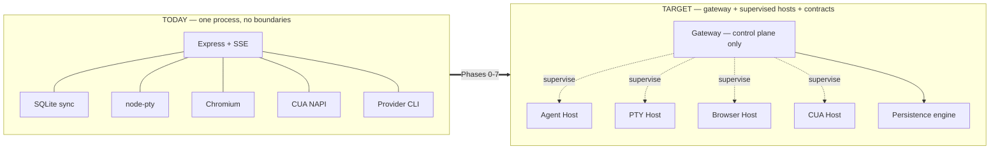
```mermaid
graph LR
  subgraph NOW["TODAY — one process, no boundaries"]
    A1["Express + SSE"] --- A2["SQLite sync"]
    A1 --- A3["node-pty"]
    A1 --- A4["Chromium"]
    A1 --- A5["CUA NAPI"]
    A1 --- A6["Provider CLI"]
  end
  subgraph NEXT["TARGET — gateway + supervised hosts + contracts"]
    B1["Gateway — control plane only"]
    B2["Agent Host"]
    B3["PTY Host"]
    B4["Browser Host"]
    B5["CUA Host"]
    B6["Persistence engine"]
    B1 -.supervise.-> B2 & B3 & B4 & B5
    B1 --> B6
  end
  NOW ==>|"Phases 0-7"| NEXT
```

1. **Split delta from item.** Streaming tokens become transport-only — coalesced, bounded, droppable, resumable by sequence. Only completed messages, tool calls, artifacts and lifecycle events become durable. *Expected: database write volume down 1–2 orders of magnitude.*
2. **Draw the contract boundary before the process boundary.** Adopt an ACP-shaped internal event vocabulary and the vendor-SDK provider port *first*, so the process split in Phase 3 is drawn on a stable interface rather than on today's ad-hoc event shapes.
3. **Move native work into supervised host processes** — provider runtimes, PTYs, Chromium, computer-use driver — with clients talking to each host over a dedicated channel rather than through the API process.
4. **One admission controller with priority lanes** that all subsystems draw from, replacing seven independent count caps.
5. **Rebuild the client streaming path** on one shared runtime with frame-aligned coalescing, append-only rendering and a multiplexed transport.

## 0.3 What is genuinely good and stays untouched

- **The domain layer** — entities, ports, state machines, `DAGValidator`, and the `IAgentHarness` boundary. Provider SDK types genuinely do not leak past `packages/agent-harness-providers/`. **This boundary is why V2 is a migration rather than a rewrite.**
- **`StreamBroker.subscribe`'s three-phase catch-up *invariant*.** It solves the subscribe/snapshot race correctly and t3code solves it identically. **△ REV2:** the *implementation* is replaced by W05/W08/W09 — the **invariant** is what survives, and W08 carries it as an explicit acceptance test so a Phase 1 implementer does not re-derive the race.
- **The auth stack** (`packages/auth`) — Ed25519/ES256 JWS, DPoP sender-constrained tokens with nonce anti-replay, device pairing grants, platform-default scopes, route policy, hash-chained audit. **Sound. It stays and extends.**
- **The computer-use *security* model** — opaque blocklist refusals, target overwriting so consent-for-A/deliver-to-B is impossible, membership-not-range snapshot fencing, blind-input tripwire. Careful work.
- **Workflow-run crash recovery**, including the atomic `claimForExecution`.
- **The web terminal client's 64 KB acknowledgement flow control** — the one place streaming is currently done right.
- **`packages/client-core`** — becomes the foundation for all four surfaces.
- **Mobile** — architecturally better than web on every axis measured. **Promoted to reference implementation, not rewritten.**

## 0.4 The three corrections this document applies

Late research overturned three decisions in the earlier plan. They are applied throughout and flagged where they appear.

| # | Was | Now | Why |
|---|---|---|---|
| **C1** | Invert terminal ownership onto **ACP's client-provided `terminal/*`** (reversal R4) | **Withdrawn.** We own the PTY Host end to end | **ACP v2 removes all five `terminal/*` and both `fs/*` methods** — *"this surface was inconsistently implemented outside of a few IDEs."* Both serious ACP clients audited (t3code, KiroCrew) hardcode `terminal: false, fs: false` |
| **C2** | **ACP outbound** replaces the vendor adapters for Claude, Codex, Gemini (reversal R3) | **ACP is the breadth tier only.** Claude, Copilot, Codex and OpenCode stay on vendor surfaces | ACP is a strict subset of every vendor surface. Two gaps are disqualifying: `canUseTool` fires **only on permission fall-through**, so ACP cannot gate every tool call on Claude; and Copilot's ACP mode makes tool filtering **server-global, not per-session** |
| **C3** | **Gemini CLI** is a first-class ACP target | **Removed from the roadmap** | Google announced 2026-05-19 that Gemini CLI stopped serving AI Pro, Ultra and free Code Assist tiers on **2026-06-18**. Successor `agy` is closed-source with no known programmatic surface |
| **C4** | **Migrate the event stream from SSE to WebSocket** | **Withdrawn. Keep SSE for events, WebSocket for binary.** The work is consolidation, not migration | Both supporting arguments failed. **(a)** The six-connection limit is HTTP/1.1-only; connection management is hop-by-hop, so nginx terminating HTTP/2 removes it entirely regardless of what Express speaks upstream. **(b)** SSE's backpressure primitive is *stronger* — `write()` returns a synchronous boolean and emits `'drain'`, versus WebSocket's advisory `bufferedAmount` that OWASP flags as an industry weakness. **P0-7 is a code defect** (`sseWrite.ts` already has the correct writer, with zero importers). Every comparable system — Vercel AI SDK, MCP, LangGraph, A2A, AG-UI — uses SSE for tokens, POST for control, and a separate binary channel. **This codebase already does exactly that** |

---

# PART 1 — Complete defect register

**106 items.** Severity: **P0** = visible failure or data loss under target load · **P1** = major degradation · **P2** = measurable waste · **P3** = hygiene.
`X-` = surfaced by external research. `G-` = custom-agents feature gap. `N-` = surfaced by the provider/protocol analysis.

## 1.A Persistence and data layer

| ID | Sev | Issue | Evidence | Impact | Fix |
|---|---|---|---|---|---|
| P0-1 | P0 | The `verbose` callback forces SQLite to rebuild full SQL text with all parameters inlined on **every statement**, then runs a non-lazy whitespace split and discards all but the first token. The metrics it feeds are discarded unless `OTEL_ENABLED=true` | `packages/db/src/index.ts:232-244`; `instrumentation.ts:24` | ~1,000–4,000 transient allocations **per streamed token**; 35–45% of per-token CPU | W01 |
| P0-2 | P0 | `prepare()` called **inside the transaction, twice, per event**. No statement cache; Drizzle also re-prepares per query | `StreamCursorRepository.ts:65,84` | **Measured 350 µs → 30 µs when cached (11×)** | W01 |
| P0-3 | P0 | Broker append uses the raw driver's `transaction()` instead of the shared manager. Nested inside an open `withTransaction`, SQLite degrades it to a savepoint — **a row can be rolled back after it was already broadcast** | `StreamCursorRepository.ts:58` vs `db/index.ts:206` | Breaks the commit-then-broadcast invariant the streaming design rests on | W03 |
| P1-4 | P1 | Two durable event logs. Nothing reads v1 `events` on the live path, yet it is written first and synchronously per event; its `(workflow_run_id, stage_run_id)` columns are unindexed | `stream.ts:318`, `schema.ts` | **Measured 579 ms full scan**; doubles write volume for zero benefit | W01 |
| P1-5 | P1 | `withTransaction` is a **process-global mutex on one connection, held across `await`**. Its 10 s deadline rejects the caller but does not abort the function, which keeps issuing statements against a rolled-back connection | `db/index.ts:160,191,207,228` | All concurrent runs serialise on every multi-row write | W03 |
| P1-6 | P1 | Retention has never deleted a row. Missing `chats(project_id)` index (declared in schema, absent on disk). No `ANALYZE` ever run. `mmap_size=0` | `AppConfig.ts:225`; measured | 1.76 GB database, 81% token log; **2.13 s cold boot** | W02 |
| P2-c | P2 | `migrateDB` runs `INSERT OR IGNORE … SELECT MAX(sequence_id) FROM events GROUP BY session_id` on **every boot**. **△ REV2:** corrected citation — the statement is in the migrations module, not the composition root | `packages/db/src/migrations/index.ts:76` (called from `composition-root.ts:179`) | 2.13 s added to every start | W02, **W47** |
| X-9 | P1 | No size cap or streaming fallback on `JSON.parse`/`stringify` of tool results | Node.js guidance | A 50 MB payload costs **0.7 s to stringify + 1.3 s to parse** — a multi-second stall for every other session | W19 |

## 1.B Streaming and event backbone

| ID | Sev | Issue | Evidence | Impact | Fix |
|---|---|---|---|---|---|
| P0-7 | P0 | **The backpressure loop is half-wired.** `res.on('drain', onDrain)` **is** registered and `onDrain` **does** drain `drainWaiters` — but **`writeFrame` never pushes a waiter.** It increments `state.queued`, returns `true`, and the producer carries on. So the drain half exists and fires; the *wait* half was never written | `stream.ts:94-113` (`writeFrame`), `:290-296` (`onDrain`) | The producer is never slowed. **△ REV3 — corrected twice:** it is not "backpressure is impossible on SSE" (it is easier on SSE), and it is not "nothing happens" — at `queued > 256` the client gets a `slow_consumer_dropped` frame and is **disconnected**. So the real behaviour is *drop the consumer*, while the code comment promises *pause the producer*. **One of the two has to change, deliberately** | W06 |
| P0-8 | P0 | The producer never slows. The provider callback discards the returned promise, so the read loop never blocks. No depth limit, no shed policy, no memory ceiling on the emit queue, catch-up buffer, or per-connection bytes | `CopilotProvider.ts:1473`; `EventBus.ts:88` | Unbounded memory growth whenever the database stalls | W06 |
| P1-9 | P1 | The per-session queue serialises the **entire fan-out**, not just the durable write — 8 SQL statements, 2 JSON round trips and all client writes complete before the queue advances | `EventBus.ts:179-183` | The queue is the throughput ceiling of a single session's stream | W05 |
| P1-10 | P1 | Every subscriber performs its own `JSON.stringify` of the same payload | `stream.ts:314` | O(K) serialisation for K subscribers on one scope | W05 |
| P1-11 | P1 | A second, entirely unmanaged SSE endpoint: no connection cap, ignores backpressure completely, runs a **250 ms filesystem poll per connection** | `computer.ts:620-692` | Every open Computer panel is a permanent 4 Hz filesystem poll on the main thread | W05, W08 |
| P2-12 | P2 | **△ REV3 — it is seven call sites, not four.** `openAuthenticatedEventSource` is invoked from `sseManager` (managed) **plus six unmanaged sites**: `ChatPage`, `WorkflowRunPageV2`, `BrowserPanel`, `ComputerPanel`, `useAutomationExecutionStream`, `HttpPlatformClient.subscribeToEvents`. **A single chat tab with the right pane open holds 5 EventSources** — chat, browser-session, terminal-session, browser panel, computer panel | `sseManager.ts:1641`; `ChatPage.tsx:39`; `WorkflowRunPageV2.tsx:55`; `BrowserPanel.tsx:38`; `ComputerPanel.tsx:29`; `useAutomationExecutionStream.ts:11`; `HttpPlatformClient.ts:105` | On HTTP/1.1 **one tab consumes 5 of the 6 available connections**; a second tab is dead. The `sseManager` header comment justifies the per-scope design on the premise of *"only 1-2 EventSources per tab"* — **that premise is empirically false today** | W09 |
| X-25 | P1 | Stage results live in the message stream, which is inherently lossy on reconnect. No separate durable result channel | A2A spec | "Reconnect loses content" is structural, not a transport bug | W23 |
| **N-1** | **P1** | **The control plane has no priority path.** Approvals, cancel and steer travel as ordinary POSTs with no ordering guarantee against the token stream, and `EventSource` cannot carry an `Authorization` header at all. **△ REV3 — reworded:** Revision 1 framed this as "SSE is unidirectional, therefore migrate to WebSocket." That was wrong. POST is the correct shape for units-per-turn control messages (Vercel ships exactly this). **The real defect is the absence of a priority path** — Jupyter keeps a separate `control` channel precisely so interrupt never queues behind execution output | Part 5 | Cancel can queue behind 200 KB of tokens; DPoP cannot be carried by `EventSource` | W09 |
| **N-9** | **P0** | **Sequence spaces are per-scope, so one connection cannot resume many scopes.** `StreamBroker` gives each `(scope, id)` its own *independent monotonic sequence space*. `Last-Event-ID` carries exactly one integer. **A multiplexed connection therefore has no correct resume story** — replaying "after seq N" would apply N to the wrong scopes | `StreamBroker.ts:9-12`; `stream.ts:255-270` | **This is the blocking defect for multiplexing.** Get it wrong and reconnect either loses events or replays foreign ones | **W09-a** |
| **N-10** | **P1** | **The same event is published to several scopes, so a multiplexed subscriber receives duplicates.** The chat bridge routes each harness event to **both** `scope=chat,id=<chatId>` **and** `scope=session,id=<sessionId>`. Today that is harmless because those are separate connections feeding separate views. On one connection it is a double-render | `.github/docs/feature-chat.md:95`; `feature-workflow-runs.md:367` | Duplicate tokens and duplicate tool cards. Dedup must key on a **cross-scope stable identity**, not `(scope, seq)` | **W09-a** |
| **N-11** | **P1** | **The connection cap bounds nothing a real client does.** `acquireSseSlot` caps per **`(scope, id)`** at 6 — but a tab's five EventSources are five *different* `(scope, id)` pairs, so the cap is never approached. There is **no per-client, per-principal or per-device cap anywhere** | `sseConnectionCap.ts:29-40` | A single principal can open unbounded connections across distinct scopes; the FD-exhaustion risk the file's own header describes is not actually prevented | **W09-a** |
| **N-12** | **P2** | **Stream tickets are `(scope, id)`-bound, one per connection.** `POST /api/stream/tickets` mints a 30 s single-use ticket for one scope. A multiplexed connection subscribing to N scopes would need N tickets, or a ticket model that authorises a **set** | `stream.ts:120-140` | Blocks multiplexing unless the ticket becomes connection-scoped with per-subscription authorisation at subscribe time | **W09-a** |

## 1.C Process and concurrency model

| ID | Sev | Issue | Evidence | Impact | Fix |
|---|---|---|---|---|---|
| P0-13 | P0 | **One Copilot CLI process for the entire server.** Every chat, stage, orchestrator worker and automation iteration multiplexes over one pipe. A large tool result is buffered whole and blocks every other session. A crash kills every conversation at once | `CopilotProvider.ts:338`; `HarnessRegistry.ts:176` | Structural head-of-line blocking; zero blast-radius isolation | W12, W36 |
| P0-14 | P0 | **Claude spawns one CLI per turn, uncapped.** No semaphore, no queue, no limit. Nothing reaps strays on restart | `ClaudeAgentProvider.ts:781` | **Measured live: 24 orphaned `claude.exe`, oldest 7 days, ~870 MB** | W12, W20 |
| P0-15 | P0 | A **synchronous blocking file append per event, per active run.** The logger subscribes to every event in the process | `StreamLogger.ts:60-76,117` | With 22 active runs every token event is offered to 22 handlers each doing a blocking syscall. Dominates any CPU profile | W07 |
| P1-16 | P1 | The 8-permit stage semaphore is **process-global and held across human approval**, validation retries, hook backoff (up to 10 min) and the summary turn | `WorkflowRunService.ts:181`; `Semaphore.ts:56` | 8 stages on approval stops **every workflow on the server**. Chats keep working, so it looks random | W18 |
| P1-17 | P1 | Stage timeout passes `undefined` as the abort signal, so the model keeps running and burning tokens forever. The timer is never cleared; a second 10 s timer leaks per stage | `StageExecutionService.ts:1434,2661,2675` | Unbounded token burn after timeout; permit released while work continues | W13 |
| P1-18 | P1 | One 3-second polling interval **per active run**, unconditional, re-invoking completion handlers for every terminal stage on every tick — on top of an event bus that already does this | `WorkflowRunService.ts:786-819` | With 22 live runs: **~200 queries every 3 s doing nothing, forever** | W18 |
| P1-19 | P1 | The DAG scheduler recomputes a SHA-1 of the entire definition several times per stage completion — *after* the database read it exists to avoid. Its lock maps are module-level globals | `DAGScheduler.ts:67-83,129` | Net negative cache; ~12 round trips before the next stage launches | W24, W33 |
| P1-20 | P1 | ~7 git subprocess spawns per stage start **and per chat turn**, awaited before the first token. `git add -A` walks the whole worktree | `GitShadowRefStore.ts:44-72` | 8 concurrent stage starts = **56 git processes at once** | W25 |
| P2-21 | P2 | Up to **5 sequential model round trips per stage**. In "full" context mode the predecessor turn carries every predecessor's complete raw output | `StageExecutionService.ts:1204,1237,1261,1610` | Latency ×5; fastest way to exhaust the context window on a wide DAG | W24 |
| P2-22 | P2 | The harness registry cold-probes **both** providers on the create-conversation path, every 5 minutes | `HarnessRegistry.ts:213-283` | ~10 s stall on the first new chat after each TTL expiry | W41 |
| X-10 | P1 | CPU-bound and I/O-bound work share the single default libuv pool (4 slots) | Node guidance; `CuaDriverBridge.ts:10-18` | One accessibility scan consumes 25% of the pool that also serves all file I/O | W19 |
| X-22 | P1 | No boot-time reaper for stray provider processes. Startup recovery scans for orphaned Docker containers but not CLI processes | `StartupRecoveryService.ts` | The 24 orphans accumulate across restarts | W20 |
| **P1-37** | **P1** | **Ten or more unbounded in-process maps**, server *and* web — session maps, subscriber maps, cursor maps, widget registries. Nothing evicts. **△ REV2: this row was missing from Revision 1** despite being cited in law L2 and in the traceability matrix | measured | **1,219 MB server RSS after 6.5 h uptime.** The server-side half had no owner in Revision 1 | **W48**, W27 |

## 1.D Agent provider integration

| ID | Sev | Issue | Evidence | Impact | Fix |
|---|---|---|---|---|---|
| P1-42 | P1 | The multi-provider router is constructed with **no ownership store**, so after a restart a Claude-owned chat routes to Copilot with a session id Copilot has never seen | `composition-root.ts:306-310` | Silent correctness bug | W34 |
| X-1 | P1 | **No cap on parallel tool execution.** Verified: zero matches for `maxParallelTools`/`maxConcurrentTools` in the codebase | verified 2026-08-17 | A model emitting 30 tool calls spawns 30 concurrent effects — 30 shells, 30 file writes | W13 |
| X-2 | P1 | **No guard for truncated tool arguments.** Verified: zero `stopReason` handling in providers. When a response is cut off, the salvage parser can produce arguments that parse and validate but are silently incomplete | verified 2026-08-17 | A truncated path handed to a delete or write tool. **Data loss, not wasted tokens** | W13 |
| X-3 | P1 | No guard against a tool emitting a progress update *after* its result settled | Pi regression `5208` | Corrupted UI state; resurrected spinners | W13 |
| X-4 | P1 | Cancellation surfaces as a thrown error rather than a semantic outcome | ACP spec | A user pressing Stop sees a red error | W13 |
| X-5 | P1 | Mid-run context insertion lands **before** the previous request's tail, invalidating the prompt cache | Pi `harness.md §2.5` | Silently multiplies the provider bill on every affected turn | W13 |
| X-6 | P2 | No prompt-cache-miss accounting | Pi `cache-stats.ts` | The dominant avoidable cost is invisible | W30, W32 |
| X-11 | P2 | No conformance suite for harness providers or storage backends | Pi `conformance.ts` | Provider adapters drift silently | W29, W44 |
| X-13 | P2 | No session lineage across compaction | Hermes | After two compactions "why did the agent forget X?" is unanswerable | W24 |
| **N-2** | **P1** | **Capability discovery is by exception**, not declaration. There is no capability struct on the harness port | Part 4 | Adding a provider means discovering its limits at runtime, in production | W42 |
| **N-3** | **P1** | **One account per provider.** `HarnessRegistry` is singleton-per-driver, so two Copilot accounts or two Claude accounts are impossible | `HarnessRegistry.ts` | Blocks multi-tenant and multi-account use | W34 |
| **N-4** | **P1** | **Provider is conflated with wire protocol.** A single credential serving several protocols (GitHub Copilot serves three) cannot be modelled, so decoders get duplicated per provider | Pi `types.ts:794-822` | Guarantees duplicated decoder code as providers are added | W34 |
| **N-5** | **P1** | **The policy gate is on the wrong hook.** Any tool gate built on `canUseTool` is not a security boundary — Anthropic documents it fires *"only when the permission evaluation flow resolves to a prompt"* | Anthropic Agent SDK docs | Tools allowed by `allowedTools`, a settings rule, or the permission mode **bypass the gate entirely** | W35 |
| **N-6** | **P2** | No Codex or OpenCode provider at all | — | Two major agents unsupported | W37, W38 |
| **N-7** | **P2** | No provider fake, so cancellation, truncation and parallel-tool behaviour cannot be tested without a network | Pi `faux.ts` (708 LOC, shipped) | The riskiest provider paths are untested | W44 |
| **N-8** | **P2** | Protocol schemas would be hand-written | t3code generates 10,375 + 42,860 lines | Guaranteed drift | W45 |

## 1.E Terminal integration

| ID | Sev | Issue | Evidence | Impact | Fix |
|---|---|---|---|---|---|
| P0-23 | P0 | **Scrollback is `Buffer.concat` per PTY chunk.** Saturated at 4 MiB, every chunk allocates a fresh 4 MiB buffer and copies 4 MiB into it — above the pooling threshold, so each is an external allocation | `TerminalService.ts:189-196` | **800 MB/s of copying at 200 chunks/s; 4 GB/s at 1000 chunks/s, per terminal.** Saturates a core, drives major GC pauses that stall the whole loop — *your chat stutters because someone ran a build* | W14 |
| P1-27 | P1 | **No output coalescing on the WebSocket.** The documentation explicitly describes a 4 ms / 32 KB coalescer that **does not exist** | `terminal-ws.ts:131` vs `feature-integrated-terminal.md` | 2,500 socket sends/s at 5 busy terminals | W14 |
| P1-28 | P1 | The watermark is per-connection but acts on the **shared** PTY. Two viewers: one pauses, the other's ack resumes the PTY the first is drowning in | `terminal-ws.ts:118-200` | Oscillating pause/resume | W14 |
| P1-38 | P1 | Idle timers bump on **output**, not client activity. The global cap counts exited-but-unreaped corpses | `TerminalService.ts:382,143` | Immortal invisible PTYs; spawn refused server-wide because of 20 dead records | W14 |
| P2-54 | P2 | Terminals are the only right-pane resource with **no instance cap**. Each takes a WebGL context; Chrome silently drops the oldest past ~16 | `ChatPage.tsx:999-1002` | Randomly blank terminals with no error | W27 |
| X-19 | P1 | Terminals do not survive a restart, and *reconnect* is not distinguished from *revive* | VS Code `ptyService.ts:229-300` | Any long-running command is lost on restart | W14 |

## 1.F Browser integration

| ID | Sev | Issue | Evidence | Impact | Fix |
|---|---|---|---|---|---|
| P0-24 | P0 | The screencast generator **deadlocks on stop**. `stop()` sets disposed and closes the context but never resolves the waiting promise. The `finally` never runs — subscriber never removed, keepalive timer never cleared, socket never closed | `ServerPlaywrightHost.ts:863-871`; `browser-ws.ts:177` | **Leaks on every eviction and every idle pause — the normal path** | W15 |
| P0-25 | P0 | The idle sweeper kills a browser the user is **actively watching**. Only agent actions bump the activity timestamp | `BrowserService.ts:153-170` vs `:505,516` | Watch the live pane 5 minutes with no agent activity and your browser dies underneath you — and leaks a timer | W15 |
| P1-26 | P1 | **One full Chromium tree per workspace**, not one browser with N contexts. Nothing requires this: profile isolation, permissions, request routing, init scripts and cookies are all per-*context* APIs | `ServerPlaywrightHost.ts:239` | **1.5–2.5 GB. The largest single memory win available.** Cold start 1.0–2.5 s fully blocking, including up to 200 sequential socket binds | W15 |
| P1-32 | P1 | A hardcoded **120 ms sleep after every click** inside a single global input chain. Ctrl+Shift+P is 7 sequential round trips. No rate limit, no chain-depth bound | `ServerPlaywrightHost.ts:737-747` | 125 ms minimum for click-then-anything; 500 Hz moves build an unbounded chain processed for minutes | W15 |
| P1-33 | P1 | **Transport chosen by catching an exception.** On throw it silently falls back to a 20 fps screenshot loop. A third path polls a JPEG endpoint every 500 ms *concurrently* | `browser-ws.ts:115-131,183-216`; `BrowserPanel.tsx:1116` | **30–80% duty cycle of a full core, permanently, per browser** — and it never reaches 20 fps | W15 |
| P1-34 | P1 | Frame rate and quality pass through **three independent clamps with three different defaults**. Backpressure exists only as **drop-after-encode** | `browser-ws.ts:104`; `ServerPlaywrightHost.ts:817` | ~3.2 MB/s of transient strings; **a slow client costs exactly as much CPU as a fast one** | W15 |
| P3-e | P3 | The placeholder background is rebuilt character-by-character over a whole JPEG every 20 frames | `BrowserPanel.tsx:1076-1082` | ~100 KB of string garbage every 2 s per tab | W27 |
| X-17 | P1 | A full accessibility snapshot is auto-attached to every browser tool result | Playwright MCP `--snapshot-mode` | The dominant token cost in a browser loop | W16 |
| X-14 | P1 | Screenshot downscaling delegated to the provider API. The model returns coordinates **in the space of the image it saw** | Anthropic CUA docs | *"Lower model accuracy and slower performance"*; a top cause of clicks landing at 80% of target | W16, W17 |

## 1.G Computer use

| ID | Sev | Issue | Evidence | Impact | Fix |
|---|---|---|---|---|---|
| P1-29 | P1 | **A global permit of 1 for all *actions*, process-wide** across every workspace, chat and run — despite the name saying "sessions". Held until settle, 30 s timeout | `ComputerService.ts:302`; `AppConfig.ts:278` | **One stuck driver call blocks every computer-use action server-wide for 30 s** | W17 |
| P1-30 | P1 | One click costs **3–4 driver round trips**, a **full-screen PNG written to disk**, an artifact row, an audit row and an event emit. The driver runs **in-process on Windows** on the 4-slot pool shared with all file I/O. The a11y tree crosses the boundary as JSON **three times** | `ComputerService.ts:1090-1160`; `CuaDriverBridge.ts:10-18` | **1–3 MB written per click**; a 1200-element scan blocks 25% of the file-I/O pool | W17 |
| P1-31 | P1 | Reading one screenshot loads **every artifact row for the workspace**, scans linearly, reads the whole file, **then** checks the size limit, then makes a base64 copy | `ComputerService.ts:1449-1471` | Three copies resident at peak; size check after the read | W17 |
| P1-39 | P1 | A response close listener is registered **inside a `while` loop** | `computer.ts:145-168` | Listener warning after 11 chunks; hundreds of retained closures. Also polls file stats every 250 ms instead of watching | W17 |
| X-15 | P1 | No frame integrity validation. A truncated JPEG still starts with a valid header | OpenMausBot `computer-proxy.ts:265` | The model silently receives a grey half-frame and acts on it | W17 |
| X-16 | P2 | Identical consecutive frames resent in full | OpenMausBot `computer-observation.ts:118` | **~1.2k tokens each**, and the worse failure: re-clicking a button it already submitted | W17 |

## 1.H Workspaces, worktrees and filesystem

| ID | Sev | Issue | Evidence | Impact | Fix |
|---|---|---|---|---|---|
| P0-35 | P0 | **The browser is not registered in the workspace-delete hook.** Deleting a workspace removes the tree — including the browser profile — while Chromium runs against it. Chromium with a yanked profile does not exit; it thrashes on failed writes | `composition-root.ts:903,966,1150,1264,1292` | Process, port and host entry leak. Listener order is registration order and only *accidentally* correct | W25 |
| P0-36 | P0 | **Git worktrees are never unregistered.** The tree is removed but `git worktree remove`/`prune` is never called; the rows that would let anyone find the orphans are deleted first | `WorkspaceManager.ts:266-292` | **Every deleted workspace leaves a stale entry in the user's own repository.** Accumulates forever, slows every `git status`. **The only defect that damages state outside our own directories** | W25 |
| P1-45 | P1 | Chat worktree creation is fire-and-forget while the working directory is already set to the not-yet-existing path. The code's own comment admits creation "can take 10-30s for large repos" | `ChatManagementService.ts:1173-1202` | If the user sends a message in that window, the working directory does not exist | W25 |
| P2-46 | P2 | Workspace creation blocks the HTTP request: 11 sequential directory creations, 5–11 git spawns, 3 round trips. On a repo with no history it runs `git add -A` over the **entire user repository** with a 15 s timeout per call | `WorkspaceManager.ts:74-149,565` | **Worst case holds an HTTP request for 90+ seconds** | W25 |

## 1.I Orchestration, workflows, automations, durability

| ID | Sev | Issue | Evidence | Impact | Fix |
|---|---|---|---|---|---|
| P0-41 | P0 | **Automations lose work on restart, silently.** Iterations are built in memory and driven by an in-process loop; only *dispatched* attempts get a row. Recovery only finalises executions — never resumes one | `AutomationService.ts:600-655,840` | **A 1000-row batch that dies at row 40 loses 960 rows silently**, and the row sits in `running` until a later boot mislabels it `completed` | W22 |
| P1-43 | P1 | Orchestrator task state is in-memory only | `OrchestratorService.ts:87-95` | Restart is total amnesia; the checker returns a synthetic "failed" for a worker still running | W24 |
| P1-44 | P1 | **The hook bridge is inert.** "Block a tool before it runs" is real code that is never wired — zero assignments outside tests. If wired it would be a performance problem too (O(n) filter plus sort per phase per tool call) | `ChatManagementService.ts:115`; `HookExecutor.ts:130` | A documented security feature does not exist at runtime | W13, W35 |
| X-20 | P1 | No termination conditions for orchestrator waves — no time budget, no convergence threshold, no arbiter | Anthropic multi-agent patterns | *"Systems that treat termination as an afterthought tend to cycle indefinitely"* | W24 |
| X-21 | P2 | Scheduled automations reuse long-lived sessions | Hermes | Scheduled runs inherit unrelated context and drift | W24 |
| X-23 | P1 | No rules governing side effects around approval pauses. On resume the stage re-runs from its start; index-matched resume values make loops re-execute exponentially | LangGraph documented failures | Duplicate rows and exponential replay, both silent | W22 |
| X-24 | P1 | "Retry" mutates a terminal run in place rather than creating a new run in the same context | A2A task immutability | Ambiguity about row state; parallel follow-ups impossible | W23 |

## 1.J Web UI rendering

| ID | Sev | Issue | Evidence | Impact | Fix |
|---|---|---|---|---|---|
| P0-47 | P0 | **The entire assistant answer is re-parsed as markdown, with syntax highlighting and language auto-detection, ten times per second, synchronously on the main thread.** **△ REV2:** `MarkdownBody` *is* rendered (`MarkdownRenderer.tsx:61`) — the defect is that it is called on the **whole answer**, not **per block**, so block-level memoisation never happens | `StreamPanel.tsx:138`; `MarkdownRenderer.tsx:49,61` | Quadratic: 40 KB ≈ **4 s** of parsing; 200 KB locks the tab. Meanwhile 8 highlight workers with 16 grammars boot at the app root and are used **only by diff views** | W27, W28 |
| P0-48 | P0 | **The chat is capped at 50 messages.** Virtualization activates above 80 — a threshold the default can never reach. **△ REV2:** the hook does expose an overridable `limit`, so the original "no way to load more" was overstated; the defect is that **no UI ever raises it** and there is no pagination control | `queries.ts:389`; `ChatMessageList.tsx:28` | You can never see message 51 through the UI. **A correctness bug wearing a performance fix's clothes** | W27 |
| P0-49 | P0 | The workflow run page subscribes to **every stream in the application**, including unrelated chats, and rebuilds a fresh object each time so the downstream memo never hits | `WorkflowRunPageV2.tsx:90`; `deriveRunView.ts:346` | 20 stages × 500 blocks × 3 passes × 10 Hz ≈ **300,000 block visits/second** | W26, W27 |
| P1-50 | P1 | Hidden right-pane tabs stay fully live. There is a visibility check on the HTTP fallback but **none on the WebSocket path** | `RightPane.tsx:748`; `ChatPage.tsx:931,977` | Background windows keep decoding frames indefinitely | W27 |
| P1-51 | P1 | Zero stale time plus refetch-on-focus globally, **24 distinct polling loops**, and per-event invalidation storms (~160 full refetches per 20-stage run) | `QueryProvider.tsx:45`; `sseManager.ts:1301` | ~350 requests/minute with 5 runs open. **Mobile already solves this with 16 ms de-duplication; web does not** | W26 |
| P1-52 | P1 | Bundle is **3,188 KB gzipped against its own declared 800 KB budget** — 4× over, 389 chunks, no vendor split, production source maps shipped | measured; `vite.config.ts:121` | The budget check exists and fails; nothing enforces it | W28 |
| X-7 | P2 | Markdown chunking duplicated per surface | KiroCrew (*"six splitters grew independently"*) | A fix in one never reaches the others | W29 |

## 1.K CLI, TUI and mobile

| ID | Sev | Issue | Evidence | Impact | Fix |
|---|---|---|---|---|---|
| P2-55 | P2 | The CLI does **one full component-tree reconcile per token**. The frame-rate setting throttles the terminal *write*, not the reconcile | `store.ts:267`; `launch.tsx:206` | **200 reconciles/second**, of which 30 produce visible output | W26 |
| X-12 | P2 | No capability declaration per surface | KiroCrew `transport.py:32` | Features half-work with no way to detect it | W29 |

## 1.L Security

| ID | Sev | Issue | Evidence | Impact | Fix |
|---|---|---|---|---|---|
| P0-40 | P0 | **Any unhandled promise rejection kills the server.** The handler rethrows; there is no uncaught-exception handler anywhere | `apps/server/src/index.ts:67-73`; `chats.ts:313` | One failing session takes down the whole process. **Top availability risk** | W20 |
| P1-53 | P1 | The widget sandbox **collapses to same-origin when the assets base is empty**. `allow-scripts` + `allow-same-origin` is the canonical sandbox escape; it is only safe today because the frame loads from a different port | `WidgetFrame.tsx:64,216`; `sseManager.ts:424` | An empty value grants a widget full access to the app's DOM, storage and auth state — **and widgets are model-authorable** | W31 |
| X-18 | P2 | No identity check on port acquisition | OpenMausBot `main.mjs:139` | A dev server with the same API shape can be adopted by the packaged app | W20 |
| — | P2 | No content security policy on an origin that renders model-authored markdown | gap | Model-authored content executes with no policy | W31 |

## 1.M Observability and operability

| ID | Sev | Issue | Evidence | Impact | Fix |
|---|---|---|---|---|---|
| P3-a | P3 | `sessionId` is in the log redaction list | `Logger.ts:55` | **The primary correlation key is scrubbed from every log line.** Actively obstructs debugging every other issue here | W32 |
| P3-b | P3 | The active-request gauge never decrements for open streams; route label cardinality unbounded | `requestMetrics.ts:41-51` | The metric is wrong precisely when it matters | W32 |
| X-8 | P1 | No wedge or hang detection. A blocked event loop is indistinguishable from a thinking model | KiroCrew observed a **10-hour** frozen backend behind a green "Connected" badge | Eternal spinner; unattributable | W21 |

## 1.N Middleware, boot and infrastructure

| ID | Sev | Issue | Evidence | Impact | Fix |
|---|---|---|---|---|---|
| P2-a | P2 | Route policy iterates **all ~45 policies**, re-splitting path and prefix, per request — for a table static at module load. Every authenticated call performs a device-table **write**. Opening one stream costs **3 database operations** | `routePolicy.ts:160`; `AuthService.ts:234,282` | ~90 allocations per request; reconnect storms become write storms | W19, W20 |
| P2-b | P2 | The JSON body parser retains the raw buffer (up to 2 MB) on **every** JSON request for one webhook route | `app.ts:79-87` | Needless retention per in-flight request | W19 |
| P2-d | P2 | Durable-sleep polls every **5 s** whether or not any stage has slept. Push-target refresh rebuilds its map every 30 s with zero tokens registered | `DurableSleepService.ts:122`; `composition-root.ts:1033` | **17,280 no-op queries/day** | W18 |
| P3-c | P3 | A synchronous filesystem existence check on every non-API GET in production | `staticFiles.ts:50` | Blocking syscall on the loop per page load | W19 |
| P3-d | P3 | The stream connection-cap env var clamps the *global* scope **down** from 32 | `sseConnectionCap.ts:48-52` | Raising the cap can break global fan-out | W18 |
| P3-f | P3 | Dead abstractions that make readers conclude a safety property exists when it does not: the drain-aware writer (`sseWrite.ts`, zero importers), the drain waiter list (never populated), the virtual chat list (unreachable), the harness proxy (unused by the server). **△ REV2:** `MarkdownBody` **removed from this list — it is live code.** See P0-47 | §E.7 review 1 | Each is a trap for the next reader | W33 |

## 1.O Custom-agents feature gaps

These block the custom-agents product feature. **They must be sequenced against the architecture work** because several are fixed by the same refactor.

| ID | Sev | Issue | Fix |
|---|---|---|---|
| G1 | P0 | `CreateConversationParams` has no `defaultAgent`; the value written at `StageExecutionService:715` is **lost in `SessionAllocator.createSession`'s 16-key hand-enumeration** (`:382-401`) | W46 |
| G2 | P0 | The same hand-enumeration drops `reasoningEffort`, `contextTier`, `maxTurns`, `hooks`, `permissionMode`, `planModeInstructions`, `onPlanReviewRequest`, `onQuestionRequest` | W46 |
| G3 | P0 | `ClaudeAgentProvider` ignores `skillDirectories`/`disabledSkills`, never sets `Options.skills`; `settingSources` is never wired | W46 |
| G4 | P0 | `buildConversationConfig` (resume) drops `mcpServers`, `hooks`, `maxTurns`, `systemPromptAppend` | W46 |
| G5 | P0 | `conversationBindingKey` = `harnessType::model`, so changing a chat's agent does not rebind | W34, W46 |
| G6 | P1 | `SystemArtifactService`: `metadata:{}` always, ids from `basename` (collide across subdirs), deletions never reconciled | W46 |
| G7 | P1 | `WorkspaceManager` ignores `stageSystemArtifacts`/`stageProjectArtifacts`/`stageMcpConfig` — the documented staging bridge is unimplemented | W46 |
| G8 | P1 | `workflow_definitions.selected_artifacts` is write-only | W46 |
| G9 | P1 | Three drifted `HarnessConfig` definitions | W29, W46 |
| G10 | P1 | `deepMerge` replaces arrays; `StageExecutionService` shallow-spreads | W46 |
| G11 | P1 | `AgentSelector` writes `instructions: ''` | W46 |
| G12 | P2 | `McpServerSelector` stores exclusions in `excludedTools` | W46 |
| G13 | P2 | `ChatRepository.update` whitelist excludes `orchestratorMode` | W46 |
| G14 | P2 | `ExtensionManager` stages but never commits skill/prompt/MCP contributions | deferred |
| G15 | P2 | Orchestrator workers inherit no capabilities | W24, W46 |
| G16 | P2 | `system_configs` CHECK forbids `type='mcp'` | W46 |

## 1.P Documentation contradicting code

Both humans and AI agents trust documentation and will "preserve" behaviour that was never written.

| Documented claim | Reality | Fix |
|---|---|---|
| Terminal *"coalesces PTY chunks, flushes every ~4 ms, up to 32 KB per frame"* | **No such code.** One send per chunk | W14 |
| Terminal scrollback is *"an in-memory ring buffer"* | `Buffer.concat` + slice; 4 MiB allocation per chunk | W14 |
| *"Real OS-level XOFF via node-pty"* | Pauses the reading socket → pipe backpressure. Different mechanism, weaker ordering on Windows | W14 |
| Per-workspace browser frame rate and quality are configurable | Silently ignored; re-clamped twice | W15 |
| `GENERATORAI_BROWSER_MAX_CONCURRENT` is *the* cap | Two independent caps; only one reads the variable | W15 |
| `maxConcurrentSessions` (computer use) | A per-**action** semaphore, process-global, default 1 | W17 |
| The delete hook ensures *"native processes never outlive a deleted workspace"* | **Chromium is not registered at all** | W25 |
| `Semaphore(8)` *"bounds how many harness subprocesses spawn at once"* | Bounds nothing for the default provider; does not apply to chats | W18 |
| Invariant: commit-then-broadcast | Violated whenever a broker append nests inside an open transaction | W03 |
| Invariant: every stream handler releases its slot on close | One endpoint never acquires a slot at all | W08 |

## 1.Q The failure narrative under target load

**Scenario:** 5 chats + 3 workflow runs + 1 automation × 20 iterations + 5 terminals + 3 browsers + 2 computer-use sessions.

1. **Terminal copy storm dominates.** Two busy terminals at 200 chunks/s = **1.6 GB/s of memory copying plus 1.6 GB/s of large allocations**, plus 400 unbatched socket sends/s. Continuous major GC. **Every pause stalls token delivery to all 5 chats.** Users report "the chat froze" and blame the model.
2. **Event-loop starvation from blocking file appends.** 500–2000 events/s × (1 insert + 1–3 inserts on a synchronous driver + 23 handler dispatches + a blocking file write).
3. **Stage semaphore starvation.** Four stages on approval = half capacity. Eight = **every workflow stops**. Chats keep working, so it looks random.
4. **Provider pipe head-of-line blocking.** One large tool result is buffered whole; **no other session's events move**.
5. **Checkpoint git storm.** 8 concurrent stage starts × 7 git spawns = **56 git processes at once**.
6. **Browser view becomes a slideshow at full CPU cost.** Frames discarded after encoding. The user sees a frozen page while the agent reports successful clicks.
7. **Any 5-minute lull kills a browser** and leaks a hung generator plus a timer.
8. **Computer-use actions queue with a 30-second worst-case block.**
9. **Starting a 4th browser evicts a live one inline on the request path.**
10. **Creating a 5th chat blocks its request for 0.2–90 s.**
11. **The browser client is already over the 6-connection limit** — REST queues indefinitely and retry makes it a storm, which is *also* 3 database writes per reconnect.
12. **A restart here loses data.** Automation iterations vanish silently. Orchestrator waves vanish. Claude-owned chats route to the wrong provider.

---

# PART 2 — Architecture laws

Eighteen enforceable invariants. **Every design decision in Parts 3–6 traces to one of these.**

| # | Law | Prevents |
|---|---|---|
| **L1** | **Tokens never reach the relational store, and are never written synchronously.** Deltas go to a rotating append-only file, coalesced, bounded, droppable and resumable by sequence. Only completed items are transactional and queryable. **△ REV2:** the earlier phrasing ("tokens are transport, not storage") was false of this design — deltas *are* persisted, just not where or how they are today. The measurable claim is: **zero token-triggered SQL statements, zero synchronous writes, and a bounded on-disk ceiling with enforced rotation** | P0-1, P0-2, P1-4, P1-6, P0-15 |
| **L2** | **Every queue is bounded, and its overflow behaviour is stated in code.** Either it applies backpressure to its producer, or it drops with a visible marker. Never "grow until something breaks" | P0-8, P1-11, P1-32, P1-37 |
| **L3** | **Backpressure is granted at the consume point, never at receipt.** An acknowledgement means "the consumer finished with it," not "the bytes left the kernel" | P0-7, P1-28, P1-34 |
| **L4** | **The pool that recovers from a wedge must never be the pool that wedges.** Blocking classes get separate pools. CPU-bound and I/O-bound work never share | X-10, P1-30, P2-46 |
| **L5** | **Native handles never live in the control-plane process.** PTYs, browsers, drivers and provider runtimes live in supervised hosts | P0-13, P0-14, P0-23, P1-26, P1-30 |
| **L6** | **A detector must not be downstream of the failure it detects.** Liveness probes exercise the thing that can fail. Watchdogs live outside the loop they watch | X-8 |
| **L7** | **Rejection is a typed value, not an exception — and agent work queues rather than rejects.** **Refusals enumerate their reasons as a closed union so a caller cannot forget to handle one.** Control-plane overload rejects; agent work queues and publishes its depth | P1-16, P3-d |
| **L8** | **Provider context grows only at the tail within one lane.** Any insertion before the previous request's tail invalidates the cache and multiplies cost | X-5, X-6 |
| **L9** | **Every capability is declared, never discovered by throwing.** Hosts publish what they support; callers branch on the declaration. **Defaults fail closed. Membership is opt-in, never a negation** | P1-33, X-12, N-2 |
| **L10** | **One core, N surfaces, one contract.** Surfaces differ only at the entry point | P0-49, P1-51, P2-55, X-7, X-12 |
| **L11** | **A terminal run never restarts.** Retry creates a new run in the same context, referencing its ancestor | X-24, X-25 |
| **L12** | **Recovery reads state, it does not infer it.** Every operation writes its complete current state to one place after each step. Every side-effecting tool declares whether it is safe to replay | P0-41, P1-43, X-23 |
| **L13** | **Every native resource has one owner, one lifecycle, and a registered teardown ordered by phase** | P0-35, P0-36, P1-38 |
| **L14** | **Every tuning constant carries the measurement that produced it, and every risky optimisation has a kill switch** | all of §1.P |
| **L15** | **Every expensive fallback increments a counter that a test asserts on.** "Is the fast path still being taken?" must be a boolean, not a stopwatch | P0-47, P1-33 |
| **L16** | **The security gate must sit on the path every call takes, not the path some calls take.** A gate that fires only on fall-through is a UX affordance, not a boundary. **△ REV2 — scope:** Tier-A providers satisfy this in-provider (`PreToolUse`). **Tier-B (ACP) providers cannot**, because ACP's permission model *is* fall-through. Therefore Tier-B sessions are gated **out-of-band at the CUA/PTY/Browser host boundary**, and Tier B is **denied the capability scopes it cannot gate** — see W39 | **N-5**, P1-44 |
| **L17** | **Provider identity is persisted and is the only routing key.** `providerInstanceId`, never inferred from a provider name. Credential and wire protocol are separate axes | **N-3, N-4**, P1-42, G5 |
| **L18** | **Protocol schemas are generated from a pinned upstream artifact and diffed in CI.** Never hand-written | **N-8** |

---

# PART 3 — Target architecture

## 3.1 Modularity — package layering

**The layering rule is a prerequisite for the process split, not a cleanup task.** Nothing can move out of process while shared code imports Express, Electron or the database driver.

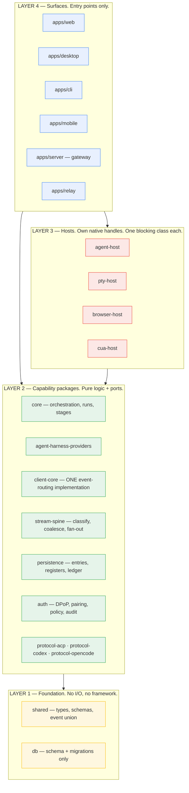
```mermaid
graph TB
  subgraph L4["LAYER 4 — Surfaces. Entry points only."]
    S1["apps/web"]:::s
    S2["apps/desktop"]:::s
    S3["apps/cli"]:::s
    S4["apps/mobile"]:::s
    S5["apps/server — gateway"]:::s
    S6["apps/relay"]:::s
  end
  subgraph L3["LAYER 3 — Hosts. Own native handles. One blocking class each."]
    H1["agent-host"]:::h
    H2["pty-host"]:::h
    H3["browser-host"]:::h
    H4["cua-host"]:::h
  end
  subgraph L2["LAYER 2 — Capability packages. Pure logic + ports."]
    C1["core — orchestration, runs, stages"]:::c
    C2["agent-harness-providers"]:::c
    C3["client-core — ONE event-routing implementation"]:::c
    C4["stream-spine — classify, coalesce, fan-out"]:::c
    C5["persistence — entries, registers, ledger"]:::c
    C6["auth — DPoP, pairing, policy, audit"]:::c
    C7["protocol-acp · protocol-codex · protocol-opencode"]:::c
  end
  subgraph L1["LAYER 1 — Foundation. No I/O, no framework."]
    F1["shared — types, schemas, event union"]:::f
    F2["db — schema + migrations only"]:::f
  end
  L4 --> L3
  L4 --> L2
  L3 --> L2
  L2 --> L1
  classDef s fill:#e8f0fe,stroke:#4285f4
  classDef h fill:#fce8e6,stroke:#ea4335
  classDef c fill:#e6f4ea,stroke:#34a853
  classDef f fill:#fef7e0,stroke:#fbbc04
```

| Rule | Enforced by | Rationale |
|---|---|---|
| Layers 1–2 may not import Express, Electron, `better-sqlite3` or `node-pty` | Lint | Otherwise the same service cannot run in the gateway, in a host, and in a unit test |
| Layer 2 depends on **ports**; implementations injected at the composition root | Lint + review | The core never branches on which implementation is loaded |
| Layer 3 hosts may not import each other | Lint | A browser bug cannot take down terminals |
| Every surface consumes `client-core` | Review + capability ledger test | L10 |
| Protocol packages depend on nothing but their generated schema | Lint | L18 |

## 3.2 Process topology

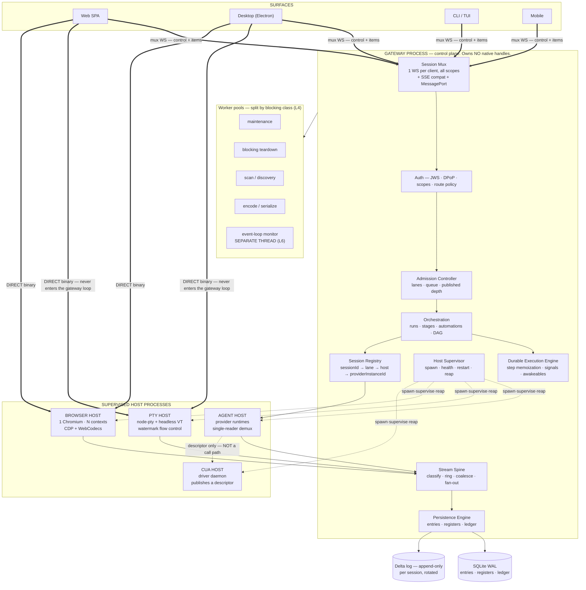
```mermaid
graph TB
  subgraph CL["SURFACES"]
    W["Web SPA"]
    D["Desktop (Electron)"]
    C["CLI / TUI"]
    M["Mobile"]
  end

  subgraph GW["GATEWAY PROCESS — control plane. Owns NO native handles."]
    MUX["Session Mux<br/>1 WS per client, all scopes<br/>+ SSE compat + MessagePort"]
    AUTH["Auth — JWS · DPoP · scopes · route policy"]
    ADM["Admission Controller<br/>lanes · queue · published depth"]
    ORCH["Orchestration<br/>runs · stages · automations · DAG"]
    DUR["Durable Execution Engine<br/>step memoization · signals · awakeables"]
    SPINE["Stream Spine<br/>classify · ring · coalesce · fan-out"]
    PERS["Persistence Engine<br/>entries · registers · ledger"]
    SUP["Host Supervisor<br/>spawn · health · restart · reap"]
    REG["Session Registry<br/>sessionId → lane → host → providerInstanceId"]
  end

  subgraph HOSTS["SUPERVISED HOST PROCESSES"]
    AH["AGENT HOST<br/>provider runtimes<br/>single-reader demux"]
    PH["PTY HOST<br/>node-pty + headless VT<br/>watermark flow control"]
    BH["BROWSER HOST<br/>1 Chromium · N contexts<br/>CDP + WebCodecs"]
    CH["CUA HOST<br/>driver daemon<br/>publishes a descriptor"]
  end

  subgraph POOLS["Worker pools — split by blocking class (L4)"]
    P1["maintenance"]
    P2["blocking teardown"]
    P3["scan / discovery"]
    P4["encode / serialize"]
    P5["event-loop monitor<br/>SEPARATE THREAD (L6)"]
  end

  DB[("SQLite WAL<br/>entries · registers · ledger")]
  DL[("Delta log — append-only<br/>per session, rotated")]

  W & D & C & M ==>|"mux WS — control + items"| MUX
  W & D ==>|"DIRECT binary — never enters the gateway loop"| PH
  W & D ==>|"DIRECT binary"| BH
  MUX --> AUTH --> ADM --> ORCH --> DUR
  ORCH --> REG --> AH
  SPINE --> PERS --> DB & DL
  AH & PH & BH --> SPINE
  SUP -.spawn·supervise·reap.-> AH & PH & BH & CH
  AH -.->|"descriptor only — NOT a call path"| CH
  GW --> POOLS
```

**Three invariants:**
1. **The gateway is a router and a bookkeeper.** It never holds a PTY handle, a browser page, a driver connection or a provider stdio pipe (L5).
2. **Terminal bytes and video frames go client ↔ host directly.** The gateway authorises, then leaves the data path.
3. **The CUA host is reachable by the *agent*, not the gateway.** The gateway reads a descriptor file and passes the spawn contract verbatim. **The gateway is not on the per-action *data* path.**
   > **△ REV2 — this does not mean security leaves the path.** The blocklist, consent gate and audit trail (`ComputerService.ts` — blocklist evaluated twice, consent resolution, `writeAudit` on success **and** refusal) are **relocated into the CUA host, not removed.** The gateway pushes the resolved policy to the host at session start; the host enforces it in-process and emits audit records **asynchronously on the item path**, so the action costs one round trip while remaining fully gated and fully audited. **Losing the ladder is not an acceptable interpretation of "zero server hops."** See W17.

**Host mechanism (decision D3):** `utilityProcess` in Electron, `child_process` on the server. **Not `worker_threads`** — a worker is a separate isolate but the *same* process, priority class, failure domain and memory accounting.

## 3.3 The stream spine

Replaces the path where one token costs 12.8 SQL statements.

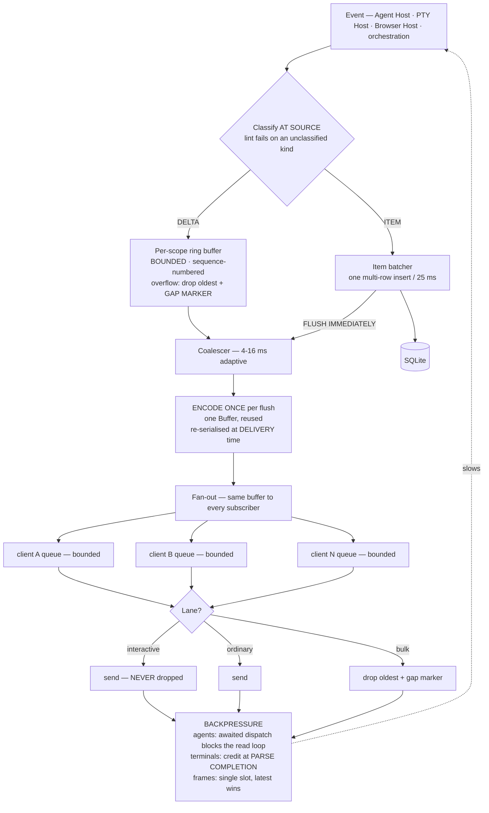
```mermaid
flowchart TB
  IN["Event — Agent Host · PTY Host · Browser Host · orchestration"] --> CLS{"Classify AT SOURCE<br/>lint fails on an unclassified kind"}
  CLS -->|DELTA| RB["Per-scope ring buffer<br/>BOUNDED · sequence-numbered<br/>overflow: drop oldest + GAP MARKER"]
  CLS -->|ITEM| JB["Item batcher<br/>one multi-row insert / 25 ms"]
  RB --> CO["Coalescer — 4-16 ms adaptive"]
  JB --> DB[("SQLite")]
  JB -->|"FLUSH IMMEDIATELY"| CO
  CO --> ENC["ENCODE ONCE per flush<br/>one Buffer, reused<br/>re-serialised at DELIVERY time"]
  ENC --> FAN["Fan-out — same buffer to every subscriber"]
  FAN --> Q1["client A queue — bounded"]
  FAN --> Q2["client B queue — bounded"]
  FAN --> QN["client N queue — bounded"]
  Q1 & Q2 & QN --> LANE{"Lane?"}
  LANE -->|interactive| SA["send — NEVER dropped"]
  LANE -->|ordinary| SB["send"]
  LANE -->|bulk| SC["drop oldest + gap marker"]
  SA & SB & SC --> BP["BACKPRESSURE<br/>agents: awaited dispatch blocks the read loop<br/>terminals: credit at PARSE COMPLETION<br/>frames: single slot, latest wins"]
  BP -.->|slows| IN
```

### Delta versus item

| Class | Examples | Persistence | Replay | Loss policy |
|---|---|---|---|---|
| **Delta** | token, thinking chunk, tool stdout chunk, browser frame, terminal bytes | Append-only log file, batched, best-effort | Bounded window (1,000 events/scope) | **Droppable** on bulk lanes, with a visible gap marker |
| **Item** | `message_complete`, `tool_call_*`, `stage_run.*`, `run.*`, artifact chunk, usage update | SQLite, batched multi-row insert | Full | **Never dropped**; the producer blocks instead |

A reconnecting client receives the last durable item snapshot plus a bounded delta replay window. Deltas older than the window are gone by design. Unbounded replay *"has OOM-killed servers on large databases."*

### Buffer rules

| Rule | Why |
|---|---|
| **Encode once per flush, fan out by reference** | Fixes P1-10 |
| **The trailing flush re-serialises at delivery time** | A coalesced frame must never be a *stale* frame |
| **Never `Buffer.concat` on the write path** — use a chunk array with head removal | Today's terminal path concats per chunk against 0.8–4 GB/s producers |
| **Scrollback is a headless VT model, not a byte buffer** | Memory O(lines × columns), not O(bytes emitted) |
| **Flush the coalescer immediately on any item** | Preserves thinking↔text ordering *without* defeating the batcher |
| **Strip cumulative snapshots at the wire boundary only** | In-process listeners keep the free snapshot; anything crossing IPC/WS gets deltas. Otherwise IPC bytes are O(n²) |
| **`JSON_PAYLOAD_MAX = 8 MB`, then stream** | A 50 MB payload is a 2-second stall |

### Backpressure — two mechanisms

| Producer | Mechanism | Why |
|---|---|---|
| **Agent** | **Awaited sequential dispatch + a drain subscriber.** The agent loop blocks itself, so token consumption stops | ~15 lines, no protocol. We control the read loop |
| **PTY** | **Credit window, acknowledged at parse completion.** Pause above 100,000 chars, resume below 5,000, ack in 5,000-char batches from inside `onParsed` | The producer is an OS process we can pause. Acking at *receipt* is the documented failure mode |
| **Browser frames** | **Single pending slot, latest wins**, ack the *discarded* frame immediately; drop when `encodeQueueSize > 2` | A stale frame has negative value |

### Constants, with justification

| Constant | Value | Justification |
|---|---|---|
| `DELTA_COALESCE_MS` | 4–16 adaptive | Two-stage coalescing compounds; orca measured a double half-window at ~8 ms of a ~19 ms total |
| `DELTA_RING_EVENTS` | 1,000/scope | Matches t3code's resume-gap ceiling |
| `ITEM_BATCH_MS` | 25 | Below the perceptual threshold for item arrival |
| `PTY_HIGH_WATERMARK` | 100,000 chars | VS Code's measured value |
| `PTY_LOW_WATERMARK` | 5,000 chars | **Must be ≥ `PTY_ACK_BATCH` or the terminal never unpauses** |
| `PTY_ACK_BATCH` | 5,000 chars | Ditto |
| `PTY_COALESCE_MS` | 5 | VS Code's per-terminal window |
| `TERMINAL_SCROLLBACK_LINES` | 1,000 (100 cross-restart) | Memory O(lines × cols) |
| `BROWSER_MIN_FRAME_MS` | 66 (~15 fps), single clamp | Replaces three contradictory clamps |
| `ENCODER_QUEUE_DROP` | > 2 | Chrome's documented idiom for live encoding |
| `CLIENT_QUEUE_BULK` | 256 frames | Drop-oldest with a gap marker |
| `MAX_PARALLEL_TOOLS` | 8 | Currently unbounded (verified) |
| `TOOL_OUTPUT_MAX_LINES / BYTES` | 2,000 / 50 KB | Overflow spilled to a file whose path is given **to the model** |
| `JSON_PAYLOAD_MAX` | 8 MB | Above this, stream |
| `SETTLE_MS` / `ACTION_GAP_MS` | 350 / 120 | OpenMausBot measured |
| `SHOT_WIDTH` / `JPEG_QUALITY` | 1280 / 75 | Ditto |
| `RUNTIME_RECYCLE_AGE` / `RSS` | 6 h / 500 MB | KiroCrew observed multi-GB RSS growth over ~24 h |
| `RSS_PROBE_MIN_AGE` | 5 min | Keeps the hot path CPU-only |

## 3.4 Persistence engine

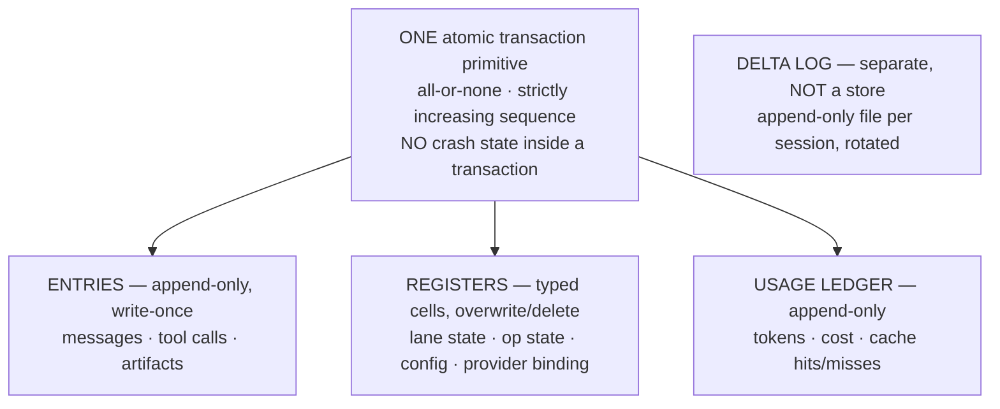
```mermaid
graph TB
  TX["ONE atomic transaction primitive<br/>all-or-none · strictly increasing sequence<br/>NO crash state inside a transaction"]
  TX --> E["ENTRIES — append-only, write-once<br/>messages · tool calls · artifacts"]
  TX --> R["REGISTERS — typed cells, overwrite/delete<br/>lane state · op state · config · provider binding"]
  TX --> L["USAGE LEDGER — append-only<br/>tokens · cost · cache hits/misses"]
  DLOG["DELTA LOG — separate, NOT a store<br/>append-only file per session, rotated"]
```

**Mechanisms:**
- **The durable program counter.** After every step, one register (`op.state/{operationId}`) is overwritten with the **complete** current state. Recovery reads it and switches. It never infers position from what is missing.
- **The effect sandwich.** Commit intent *including reserving output ids* → perform the uncertain effect → commit settlement. On restart, an operation stuck at "effect pending" gets a synthetic result under the **reserved id**, so every tool call has a result and nothing runs twice.
- **Per-tool replay policy.** `never` = terminal commands, computer-use actions, file writes, git, HTTP POST. `safe` = reads, greps, searches, window lists, page snapshots.
- **Lanes.** Three registers (`lane.leaf`, `lane.config`, `lane.state`), at most one operation each. N concurrent runs over one session cost three registers each and **zero history duplication**.
- **Corruption is a closed enum** — states the single-writer protocol cannot produce are **rejected, not repaired**.
- **Torn-tail repair.** A parse error on the *last line only* is an unacknowledged partial write → rewrite the valid prefix via temp-file-and-rename. Anywhere else is fatal.
- **Fenced writer lease** — Electron main, CLI and mobile relay can all touch one database. Claim by incrementing a fence; steal only an *expired* lease; renewal asserts exactly one row changed.

**SQLite configuration:** WAL, `synchronous=NORMAL`, **autocheckpoint disabled** with a background checkpoint driven from a size watchdog on the write-ahead file, `busy_timeout` set, scheduled `ANALYZE`, `mmap_size` set, prepared-statement cache, retention that fires.

## 3.5 Agent Host

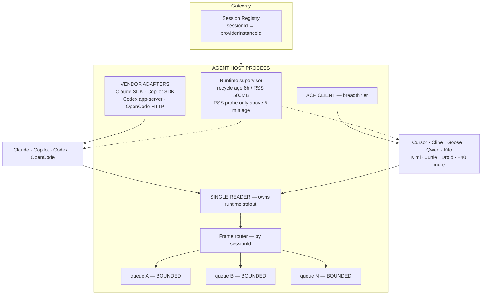
```mermaid
graph TB
  subgraph GWX["Gateway"]
    SR["Session Registry<br/>sessionId → providerInstanceId"]
  end
  subgraph AH["AGENT HOST PROCESS"]
    SUP2["Runtime supervisor<br/>recycle age 6h / RSS 500MB<br/>RSS probe only above 5 min age"]
    RD["SINGLE READER — owns runtime stdout"]
    RT["Frame router — by sessionId"]
    Q1["queue A — BOUNDED"]
    Q2["queue B — BOUNDED"]
    QN["queue N — BOUNDED"]
    VEN["VENDOR ADAPTERS<br/>Claude SDK · Copilot SDK<br/>Codex app-server · OpenCode HTTP"]
    ACPO["ACP CLIENT — breadth tier"]
  end
  P1["Claude · Copilot · Codex · OpenCode"]
  P2["Cursor · Cline · Goose · Qwen · Kilo<br/>Kimi · Junie · Droid · +40 more"]
  SR --> AH
  RD --> RT --> Q1 & Q2 & QN
  VEN --> P1
  ACPO --> P2
  P1 & P2 --> RD
  SUP2 -.-> P1 & P2
```

| Today | Target |
|---|---|
| One Copilot CLI for the whole server, head-of-line blocking | **Single-reader demux** routing frames by session id into **bounded** per-session queues |
| Claude spawns one CLI per turn, uncapped, orphans forever | Bounded spawn concurrency + **boot reaper** + parent-PID heartbeat in every child |
| One bespoke adapter per vendor | **Vendor SDK/protocol for the four we ship; one ACP client for ~45 others** |
| No process hygiene | **Recycle by age (6 h) and RSS (500 MB)**, memory probe skipped for young runtimes |
| Provider ownership lost on restart | **`providerInstanceId` persisted and used as the only routing key** |
| One account per provider | **Instance registry** — N instances of the same driver |
| Unbounded tool fan-out | `MAX_PARALLEL_TOOLS = 8` with a **poison-pill downgrade** (one sequential tool serialises the batch) and results emitted **in call order** |
| Truncated arguments executed | **All tool calls in a batch fail** when the response was truncated, with a synthetic error instructing a re-issue |
| Cancellation throws | Semantic `cancelled` **success value**; pending approvals settled **first**; non-finished calls marked cancelled preemptively; grace budget → synthesised terminal event if unacked |
| Both providers cold-probed every 5 min | **Demand-gated `Ref` snapshot** + generational enrichment + disk cache; lazy modules behind a synchronously-returned stream |
| Context inserted mid-run | **Append-only context invariant**; four cache breakpoints — one on the stable prefix, up to three on recent tool results, cleared and re-placed each turn; screenshots pruned **in batches** (keep 3, prune every 25) so the prefix stays byte-identical for 25 turns |

## 3.6 PTY Host

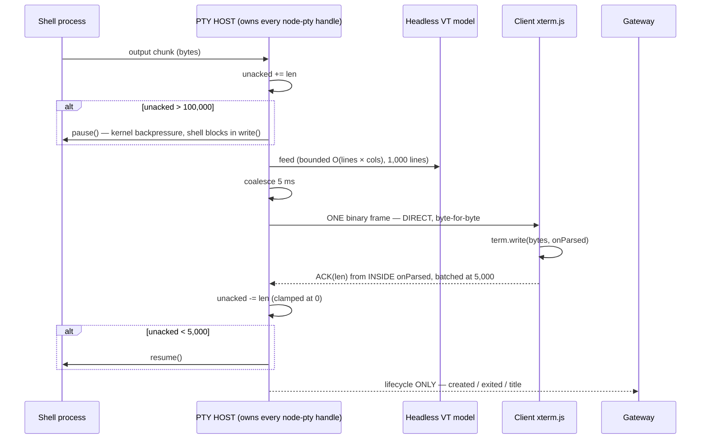
```mermaid
sequenceDiagram
  participant SH as Shell process
  participant PH as PTY HOST (owns every node-pty handle)
  participant VT as Headless VT model
  participant CL as Client xterm.js
  participant GW as Gateway
  SH->>PH: output chunk (bytes)
  PH->>PH: unacked += len
  alt unacked > 100,000
    PH->>SH: pause() — kernel backpressure, shell blocks in write()
  end
  PH->>VT: feed (bounded O(lines × cols), 1,000 lines)
  PH->>PH: coalesce 5 ms
  PH->>CL: ONE binary frame — DIRECT, byte-for-byte
  CL->>CL: term.write(bytes, onParsed)
  CL-->>PH: ACK(len) from INSIDE onParsed, batched at 5,000
  PH->>PH: unacked -= len (clamped at 0)
  alt unacked < 5,000
    PH->>SH: resume()
  end
  PH-->>GW: lifecycle ONLY — created / exited / title
```

| Issue | Fix |
|---|---|
| P0-23 copy storm | **Headless terminal model** — O(lines × columns), 1,000 lines default, 100 for cross-restart revive. Where bytes are still needed: a chunk array with head removal, **never concatenation on the write path** |
| P1-27 no coalescing | 5 ms window per terminal id, one frame — the coalescer the docs already promise |
| P1-28 per-connection watermark | Watermark moves to the **session**; acks are per-session, not per-viewer |
| P1-38 immortal PTYs | Idle keyed on **client attachment**. Corpses excluded from the cap |
| X-19 no restart survival | **Reconnect** (reload → reattach, replay serialised buffer) distinguished from **revive** (host restart → relaunch with original environment). Only sessions that produced output are serialised |
| P2-54 no instance cap | Instance cap with a typed refusal |
| §1.P divergence | Documentation rewritten to match |

**Byte-for-byte forwarding is required** — xterm.js runs its own incremental decoder, so a multi-byte character split across two reads is reassembled on the client only if we do not transcode.

> **Correction C1.** Terminal ownership is **not** inverted onto ACP. **ACP v2 deletes all five `terminal/*` methods.** An agent-run command and a user-typed command are still the same terminal object — achieved in **our** host, on every surface. If we later expose our terminal to an external agent, the v2-sanctioned route is an **MCP server**.

## 3.7 Browser Host

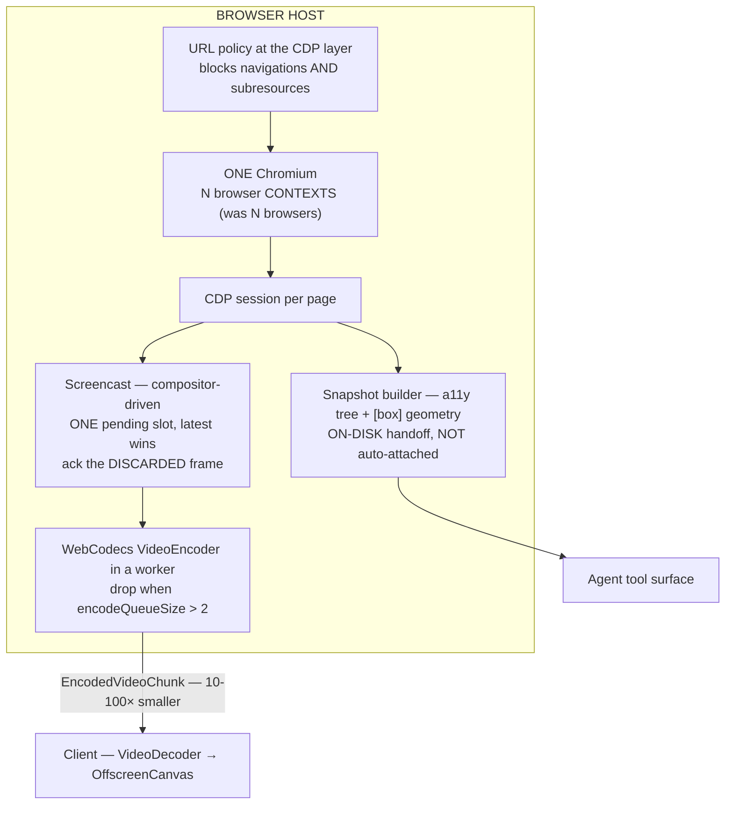
```mermaid
graph TB
  subgraph BH["BROWSER HOST"]
    CR["ONE Chromium<br/>N browser CONTEXTS (was N browsers)"]
    CDP["CDP session per page"]
    SC["Screencast — compositor-driven<br/>ONE pending slot, latest wins<br/>ack the DISCARDED frame"]
    ENC["WebCodecs VideoEncoder in a worker<br/>drop when encodeQueueSize > 2"]
    SNAP["Snapshot builder — a11y tree + [box] geometry<br/>ON-DISK handoff, NOT auto-attached"]
    POL["URL policy at the CDP layer<br/>blocks navigations AND subresources"]
  end
  CL["Client — VideoDecoder → OffscreenCanvas"]
  AG["Agent tool surface"]
  CR --> CDP --> SC --> ENC -->|"EncodedVideoChunk — 10-100× smaller"| CL
  CDP --> SNAP --> AG
  POL --> CR
```

| Issue | Fix |
|---|---|
| P0-24 deadlock leak | Resolve the waiting promise in `stop()`; the cleanup path runs; the timer clears |
| P0-25 sweeper kills a watched browser | Activity bumped by the frame and screencast paths, not only agent actions |
| P1-26 one browser per workspace | **One Chromium, N contexts.** Port allocation replaced with a counter |
| P1-33 transport by exception | **`supportsScreencast` declared** (L9). Native mode refuses the stream endpoint outright. The concurrent JPEG path is **deleted** |
| P1-34 three clamps, drop-after-encode | One clamp. Backpressure **throttles capture**: single pending slot, latest wins, ack the discarded frame immediately, drop on encoder queue depth |
| P1-32 120 ms click sleep | Real readiness check; input chain depth bounded; rate limit |
| X-17 snapshot on every result | **Not auto-attached.** The tool result is a short line (url, title, snapshot path); the tree stays on disk until asked for |
| X-14 provider-side downscale | We own the downscale, record the factor per capture, use per-model pixel budgets (1568 px/1.15 MP vs 2576 px/3.75 MP) |
| — | Screenshot codec defaults to WebP/JPEG with a server-side max width — **3–5× smaller than PNG** |
| — | **Page-id routing** so N agents share one browser |
| — | **Hybrid snapshots** — a11y tree with per-element `[box=x,y,w,h]` viewport-relative CSS px, serving both deterministic selector clicking and coordinate-based CUA clicking |

**Desktop:** a native view positioned by bounds, drawn by the compositor — **zero frames cross a process boundary.**

## 3.8 Computer-Use Host

```mermaid
sequenceDiagram
  participant HO as Host process (owns the OS permission grant)
  participant DE as descriptor file (atomic write, mode 0600)
  participant GW as Gateway
  participant AG as Agent
  participant DR as CUA driver daemon
  HO->>DR: start
  Note over HO,DR: the process that OWNS the permission grant must start the driver —<br/>macOS attributes children to the "responsible process"
  HO->>DE: {mode, socketPath, mcpCommand, mcpArgs, mcpEnv}
  GW->>DE: READ ONLY
  GW->>AG: pass the spawn contract VERBATIM
  AG->>DR: connect (unix socket / named pipe)
  rect rgb(240,248,255)
    Note over AG,DR: ONE round trip per UI step
    AG->>DR: act + settle(350ms) + capture + encode  [FUSED]
    DR-->>AG: result + frame in the SAME tool result
  end
  DR-->>GW: audit record ASYNC on the item path
  Note over GW: not on the per-action DATA path.<br/>Policy pushed to the host at session start;<br/>host enforces the ladder in-process.
```

> **△ REV2 — where the security ladder lives.** Today `ComputerService` evaluates the blocklist **twice** (requested name and resolved identity), resolves consent, and writes an audit row on **both** success and refusal — all on the action path. Fusing act+observe removes the *server hop*, not the *ladder*. The design is:
>
> | Concern | Where it lives after W17 |
> |---|---|
> | Blocklist (checked twice), consent policy, capability scopes | **Pushed to the CUA host at session start**, re-pushed on change. Enforced in-process, per action |
> | Consent prompts requiring a human | Host → gateway → client on the **control lane**; the action blocks, but no *server hop per action* |
> | Audit records | Emitted by the host, batched, written by the gateway **on the item path** — never blocking the action |
> | Keystone enable flag | Read by the **gateway** at boot from a file the agent cannot touch; the host refuses to start without it |
>
> **Acceptance is therefore two-sided:** one driver round trip per click **and** every action still produces exactly one audit record, including refusals.

| Issue | Fix |
|---|---|
| P1-29 global permit of 1 | Concurrency becomes the driver's problem, per target. **Reader/writer split** — read-only operations never queue behind synthetic input |
| P1-30 3–4 round trips + PNG + 3 writes | **Fused act+observe: one round trip.** *"Halves the model inferences per UI step."* `screenshotEveryAction` defaults off. Driver moves out of process **on Windows too** |
| P1-31 loads all artifacts | Fetch by id, stream it, check size **before** reading |
| P1-39 listener leak | Listener registered once outside the loop; file watching replaces stat polling |
| X-15 no frame integrity | **Validate terminator and byte length**, not just the magic number. One-way latch disables the inline path after the first bad payload |
| X-16 duplicate frames | Hash the **canonical full frame before cropping**; if unchanged send text only, with a response that explicitly tells the agent **not to retry** |
| X-14 coordinate space | Scaling computed at the far end from geometry resolved in the same command; factor recorded per capture; **instruction text before the image** |
| — | Use the **official computer tool type** so prompt-injection classifiers run — *"approximately zero latency and no cost"*, and they **do not run on custom tool definitions** |
| — | Native module import is **side-effect free**. **Nested deadlines**: per-call *and* aggregate |

## 3.9 Admission controller and lanes

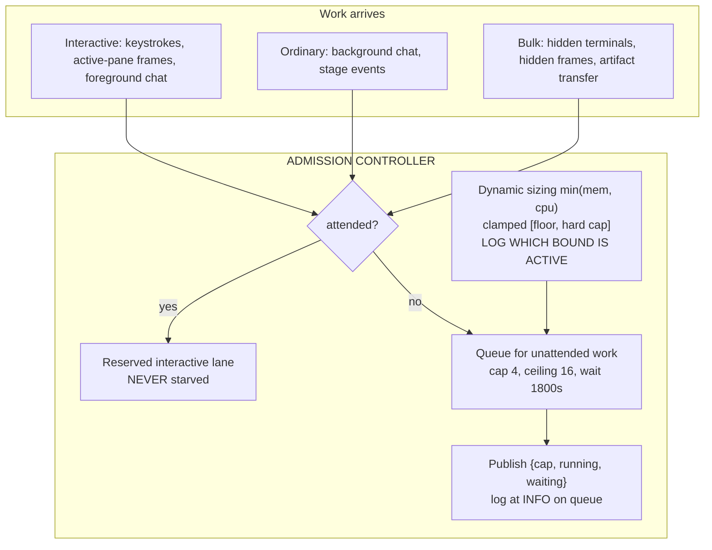
```mermaid
graph TB
  subgraph IN["Work arrives"]
    I1["Interactive: keystrokes, active-pane frames, foreground chat"]
    I2["Ordinary: background chat, stage events"]
    I3["Bulk: hidden terminals, hidden frames, artifact transfer"]
  end
  subgraph AC["ADMISSION CONTROLLER"]
    PRED{"attended?"}
    RES["Reserved interactive lane<br/>NEVER starved"]
    SEM["Queue for unattended work<br/>cap 4, ceiling 16, wait 1800s"]
    PUB["Publish {cap, running, waiting}<br/>log at INFO on queue"]
    SIZE["Dynamic sizing min(mem, cpu)<br/>clamped [floor, hard cap]<br/>LOG WHICH BOUND IS ACTIVE"]
  end
  I1 --> PRED -->|yes| RES
  I2 & I3 --> PRED -->|no| SEM --> PUB
  SIZE --> SEM
```

| Decision | Reason |
|---|---|
| **Queue agent work; reject only control-plane overload** | *"A rejected turn loses the issue it was mid-way through, while a queued one only starts late"* |
| **The lane discriminator is one predicate — `attended`** | Costs nothing on the interactive path |
| **The queue wait has its own 1800 s timeout** | Otherwise it consumes the turn's own ceiling and the failure is misattributed |
| **Log at INFO when queued** | *"The difference between 'the fleet is throttled' and 'a worker is hung'"* |
| **Publish depth in the health endpoint** | Makes throttling visible instead of mysterious |
| **Size from measured cost; log which bound is active** | An explainable startup line beats a hardcoded number that is wrong on every machine |
| **Clamp configuration on load, log, and audit** | Tampering is detectable even though the loader self-heals |

---

# PART 4 — Protocol and provider integration

## 4.1 The decision

**No protocol has feature parity with the vendor SDKs.** Ranked against what a host application can actually do:

| Surface | Parity | Character of the gap |
|---|---|---|
| Vendor's own SDK / protocol | **100%** by definition | — |
| Vendor's own ACP mode (Copilot, OpenCode, Cursor) | **~70–85%** | Strict subset. **Silent** degradation in Copilot's case |
| Third-party ACP adapter (Claude, Codex) | **~60–75%** | Subset + a vendor `_meta` dialect + a third-party release train |
| **A2A** | **~15%** | **Structural. Cannot be closed by an extension** |

### Why not A2A

A2A is for **remote autonomous agents delegating across organisational boundaries.** Its stated guiding principle:

> **"Opaque Execution:** Agents collaborate based on declared capabilities and exchanged information, **without needing to share their internal thoughts, plans, or tool implementations."**

**There is no `ToolCall` type anywhere in the spec.** Permissions are a bare `AUTH_REQUIRED` state, and §7.6.4 explicitly disclaims all semantics. There is no stdio binding, and §13.2 tells implementers to **reject localhost and private IP ranges** — exactly our topology.

**The decisive evidence:** Google wrote A2A, and to make Gemini CLI's A2A server work for coding they invented a proprietary `CoderAgentEvent` enum (`tool-call-confirmation`, `thought`, `tool-call-update`) smuggled through A2A's `metadata` escape hatch — a re-derivation of ACP's `SessionUpdate`. It ships experimental, pinned to A2A v0.3, unmentioned in the README. And **Qwen Code, forking Gemini CLI, deleted the `a2a-server` package and added an `acp-bridge`.**

Claude, Copilot, Codex, OpenCode, Cursor and Goose have **zero** A2A support. Anthropic, OpenAI, Zed and Cursor are absent from A2A's 8-seat TSC.

> **Naming trap:** IBM's Agent *Communication* Protocol merged into A2A on 2025-08-29. Zed's Agent *Client* Protocol did not. "ACP merged into A2A" is true of IBM's and false of ours.

**A2A's legitimate future use is the opposite direction** — exposing *our orchestrator* as a discoverable agent to enterprise platforms (ServiceNow, Salesforce, SAP and Workday are all on the TSC). That is a post-V2 product question.

### Why ACP is not sufficient for our core providers

Two gaps are red lines, not trade-offs:

1. **Claude over ACP cannot gate every tool call.** Anthropic: *"`canUseTool` … is invoked only when the permission evaluation flow resolves to a prompt … **To gate every tool call, use a `PreToolUse` hook instead**."* Hooks are **function-valued** and cannot cross JSON-RPC. `claude-agent-acp` has **zero references** to `createSdkMcpServer`, `sessionStore` or compaction hooks — verified by call-site count in its bundle, which only ever calls `interrupt`, `setPermissionMode`, `setModel`, `applyFlagSettings`, `getContextUsage`, `close` and three init methods. **This is a security regression (L16), not a missing feature.**
2. **Copilot's ACP mode makes tool filtering server-global.** `--available-tools`, `--excluded-tools` and `--effort` are fixed at server launch and *"apply to every session for every connecting client."* We run many concurrent sessions with different scopes. And its degradation is **silent** — unsupported slash commands are forwarded to the model as ordinary prompts.

### The empirical economics — from t3code's own tree

| Provider | Transport | Adapter LOC |
|---|---|---|
| Cursor | **ACP** | 1,188 (+1,829 shared runtime) |
| Grok | **ACP** | 1,470 (same shared runtime) |
| Codex | app-server | 3,968 |
| OpenCode | HTTP SDK | 2,513 |
| **Claude** | **hand-written SDK** | **4,644, zero reuse** (+4,613 test LOC) |

**~1.2–1.5k lines per ACP provider versus 4,644 for the one wired by hand.** That is the argument for ACP *at the breadth tier* — and the reason we do **not** hand-write adapters for the long tail.

## 4.2 The tier model

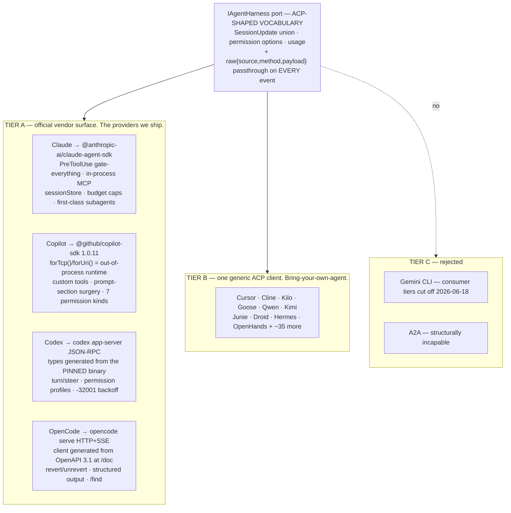
```mermaid
graph TB
  PORT["IAgentHarness port — ACP-SHAPED VOCABULARY<br/>SessionUpdate union · permission options · usage<br/>+ raw{source,method,payload} passthrough on EVERY event"]
  subgraph TA["TIER A — official vendor surface. The providers we ship."]
    A1["Claude → @anthropic-ai/claude-agent-sdk<br/>PreToolUse gate-everything · in-process MCP<br/>sessionStore · budget caps · first-class subagents"]
    A2["Copilot → @github/copilot-sdk 1.0.11<br/>forTcp()/forUri() = out-of-process runtime<br/>custom tools · prompt-section surgery · 7 permission kinds"]
    A3["Codex → codex app-server JSON-RPC<br/>types generated from the PINNED binary<br/>turn/steer · permission profiles · -32001 backoff"]
    A4["OpenCode → opencode serve HTTP+SSE<br/>client generated from OpenAPI 3.1 at /doc<br/>revert/unrevert · structured output · /find"]
  end
  subgraph TB2["TIER B — one generic ACP client. Bring-your-own-agent."]
    B1["Cursor · Cline · Kilo · Goose · Qwen · Kimi<br/>Junie · Droid · Hermes · OpenHands + ~35 more"]
  end
  subgraph TC["TIER C — rejected"]
    C1["Gemini CLI — consumer tiers cut off 2026-06-18"]
    C2["A2A — structurally incapable"]
  end
  PORT --> TA
  PORT --> TB2
  PORT -.->|"no"| TC
```

**Keep the ACP-shaped vocabulary internally regardless.** ACP's `SessionUpdate` union, permission-option model and usage record are better-designed than what we would invent; they make Tier B a decoder rather than a rewrite; and t3code proves the pattern works when paired with a **`raw` passthrough field on every event** so Tier-A depth survives normalisation.

## 4.3 ACP support matrix (verified 2026-08-17)

| Agent | ACP | Invocation | Maintainer |
|---|---|---|---|
| GitHub Copilot CLI | **Native**, public preview 2026-01-28 | `copilot --acp [--stdio\|--port N]` | GitHub (**closed source**) |
| OpenCode | **Native** | `opencode acp` | Anomaly |
| Cursor CLI | **Native** + 5 `cursor/*` methods | `cursor-agent acp` | Anysphere |
| Qwen, Cline, Kilo, Goose, Hermes, OpenHands, Droid, Kimi, Junie, Kiro | **Native** | various | vendors |
| Gemini CLI | Native, in-tree | `gemini --acp` | Google — **but see C3** |
| **Claude Code** | **Third-party adapter** | `npx @agentclientprotocol/claude-agent-acp` | **`package.json` author = "Zed Industries"**. Zero references in the `anthropics` org |
| **Codex CLI** | **Third-party adapter** | `npx @agentclientprotocol/codex-acp` | ACP org. `learn.chatgpt.com/llms.txt`: **0 matches for ACP** |
| Crush, Aider | None found | — | — |

**Protocol status:** v1 stable, **v2 in Draft since 2026-07-20 with breaking changes** — `session/prompt` no longer ends the turn; `session/load` → `session/resume` + `replayFrom`; `session/set_mode` removed; `messageId` required; **all `terminal/*` and `fs/*` removed**. Goose already ships `agent-client-protocol = "2.0.0"`. **Governance is interim (Zed + JetBrains), security triage is `security@zed.dev`. Transport is stdio only** — remote ACP is an unshipped RFD.

**Implication:** negotiate the version explicitly and gate v2 behind a flag. **Do not** repeat t3code's hardcoded `protocolVersion: 1` with an unread response.

## 4.4 Per-provider integration contract

| Provider | Surface | Key capabilities we depend on | Risk & mitigation |
|---|---|---|---|
| **Claude** | `@anthropic-ai/claude-agent-sdk` | **30 hook events**, `PreToolUse` gate-everything, `createSdkMcpServer`, `sessionStore`, `maxBudgetUsd`/`taskBudget`/`maxTurns`, `forkSession`, `parent_tool_use_id` + `parent_agent_id` on every message, `SubagentStart`/`SubagentStop` | Still `0.x`, release every 1–2 days. **Feature-detect via `system/init.capabilities`, documented as an open set.** Note: an SDK-**callback** hook that times out **fails closed**; a **command** hook fails **open** — we need the callback form |
| **Copilot** | `@github/copilot-sdk` 1.0.11 | `RuntimeConnection.forTcp()`/`.forUri()` (out-of-process, re-attachable), `defineTool`, custom slash commands, section-level prompt surgery over 12 named sections, 8 session hooks, 7 permission decision kinds incl. `approve-for-location` and `no-result`, BYOK | Breaking config changes inside patch releases. **Pin exact versions; diff changelogs in CI** |
| **Codex** | `codex app-server` JSON-RPC | `turn/steer` (with `expectedTurnId` precondition), permission profiles, `acceptWithExecpolicyAmendment` / `applyNetworkPolicyAmendment`, paginated `thread/list`, `optOutNotificationMethods`, `-32001` backpressure | **No `protocolVersion` field; ≥98 commits in 31 days.** `codex proto` was **deleted**. **Pin the binary, generate types from it, diff in CI, treat every union as open** |
| **OpenCode** | `opencode serve` HTTP+SSE | OpenAPI 3.1 at `GET /doc`, generated types, `revert`/`unrevert`, structured JSON-schema output, `prompt_async`, `fork`, on-demand `GET /session/:id/diff`, runtime `POST /mcp`, `/find*` host-side search, `--attach` warm reuse | Org moved `sst/` → **`anomalyco/`**; default branch `dev`; several endpoints experimental |
| **Tier B** | `@agentclientprotocol/sdk` | Sessions, prompts, streaming, cancellation, permission options, usage | ACP v2 breaking draft. **Negotiate the version; fail legibly** |

## 4.5 Provider port design

Adopted from t3code and Pi, with the mistakes removed.

```ts
interface ProviderAdapter {
  readonly driverKind: ProviderDriverKind          // OPEN branded slug — unknown drivers degrade, never fail boot
  readonly capabilities: ProviderCapabilities      // DECLARED struct, never probed (L9)

  startSession(input): Effect<ProviderSession, E>
  sendTurn(input): Effect<TurnStartResult, E>
  interruptTurn(threadId, turnId?): Effect<void, E>
  respondToRequest(threadId, requestId, decision): Effect<void, E>
  stopSession(threadId): Effect<void, E>
  listSessions(): Effect<Session[]>                // CANNOT FAIL
  hasSession(threadId): Effect<boolean>            // CANNOT FAIL — routing depends on it
  readThread(threadId): Effect<Snapshot, E>
  stopAll(): Effect<void, E>
  readonly streamEvents: Stream<ProviderRuntimeEvent>  // NEVER FAILS — termination is a teardown signal
}
```

| Rule | Source | Prevents |
|---|---|---|
| `hasSession` and `listSessions` **cannot fail** | t3code | A failing probe breaks routing |
| `streamEvents` **never terminates until the instance scope closes** | t3code | Makes stream termination a valid teardown signal |
| Driver is a **plain value, not a DI tag** — *"tags are singleton-per-runtime and we need many instances of the same driver"* | t3code `ProviderDriver.ts:3-12` | **N-3** |
| `provider` (credential) and `api` (wire protocol) are **separate persisted fields** | Pi `types.ts:794-822` | **N-4**. GitHub Copilot serves three wire APIs from one credential |
| Model equality is `id && provider`, never `id` alone | Pi `models.ts:939-945` | Cross-provider model collisions |
| `getModels()` **must not throw**; failure mode is `[]` | Pi `models.ts:294-300` | Boot failure from one bad provider |
| Capabilities are **opt-in frozensets, never negations** | KiroCrew `types.py:137-142` | *"`not is_claude_backend` reads correctly with two backends and then silently hands the capability to the third"* |
| Handshake capabilities **default to closed** | KiroCrew `runtime.py:715-723` | An un-handshaked backend claiming features it lacks |
| Cancellation returns `{stopReason: "cancelled"}` as a **success** | t3code | **X-4** |
| **Settle every pending approval and user-input request *before* cancelling** | t3code | A handler blocked on that promise deadlocks forever |
| Unacked cancel → **synthesised terminal event**, never a process kill on a shared runtime | KiroCrew `session_handle.py:1477-1516` | Co-tenant sessions dying |
| Bound every fan-out: `{concurrency: 8}` + per-item **and** overall timeout | t3code | *"A wedged child would block the parent interrupt forever — exactly during the runaway fleet where Stop matters most"* |
| Stream returned **synchronously**; auth/import run behind it; setup failure is an **in-band error event** | Pi `lazy.ts` | **P2-22**; two error paths collapse to one |
| Child **stderr is captured** (last N KB) and attached to spawn/exit errors | t3code's mistake | Undiagnosable startup failures |
| Unmodelled protocol events emit a **counter**, never silently dropped | t3code's mistake | Invisible schema drift |

---

# PART 5 — Transport architecture

> **△ REV3 — this Part is substantially rewritten.** Revisions 1–2 recommended migrating the event stream from SSE to WebSocket. **That recommendation is withdrawn.** It rested on the HTTP/1.1 six-connection limit, which HTTP/2 removes; and on a backpressure argument which research showed to be **backwards** — SSE's backpressure primitive is stronger than WebSocket's. The correct architecture is a **channel-split hybrid, which is what this codebase already has.** The work is to fix it, not replace it.

## 5.1 What we already have — and it is right

| Channel | Transport today | File | Verdict |
|---|---|---|---|
| Chat / run events | **SSE** | `routes/stream.ts` | ✅ **Correct. Keep.** |
| Terminal PTY bytes | **WebSocket** | `terminal-ws.ts` | ✅ **Correct. Keep.** |
| Browser video frames | **WebSocket** | `browser-ws.ts` | ✅ **Correct. Keep.** |
| Speech-to-text audio | **WebSocket** | `stt-ws.ts` | ✅ **Correct. Keep.** |
| Computer-use preview | **SSE**, unmanaged | `routes/computer.ts` | ❌ Bypasses the manager (P1-11) |

All four WebSocket paths already share one `http.Server` via `WebSocketServer({ noServer: true })` + a path regex on the `upgrade` event. `.github/docs/architecture.md:189` already records the rationale: *"they exist because binary / high-frequency payloads don't fit the SSE contract."*

**That is the same split every comparable system uses.** The defects are implementation bugs, not a wrong transport.

## 5.2 The evidence

### What modern agentic systems actually use

**Token streaming is SSE essentially everywhere. The control plane is never SSE. Nothing ships binary over SSE.**

| System | Token stream | Control plane (approve / cancel) | Binary |
|---|---|---|---|
| OpenAI Responses / Chat Completions | **SSE** | — | — |
| Anthropic Messages | **SSE** (no resumption protocol at all) | — | — |
| Google Gemini `streamGenerateContent` | **HTTP streaming** | — | Live API = WebSocket (bidirectional media) |
| **Vercel AI SDK** Data Stream Protocol | **SSE** | **HTTP POST** — `tool-approval-request` goes *down* the SSE stream, the response goes *up* via POST | — |
| **MCP** Streamable HTTP | **SSE** on GET/POST, `Last-Event-ID` resume, `Mcp-Session-Id` | POST + `CancelledNotification` | — |
| **LangGraph Platform** | **SSE**, thread-scoped, `Last-Event-ID`, open indefinitely | POST | — |
| **A2A** | **SSE** | State machine (`INPUT_REQUIRED`) + new POST | Artifacts by **URL reference** |
| **AG-UI** | **SSE** default, **plus a separate binary protocol** | — | separate binary transport |
| **ACP** | stdio (bidirectional) | `session/request_permission` — a **server→client request** | — |
| **Jupyter** | **WebSocket**, 5 ZMQ channels multiplexed, binary subprotocol | separate **`control` channel** so interrupt never queues behind execution | binary frames |
| **ttyd / Wetty / noVNC / code-server** | — | — | **WebSocket binary, unanimously** |

Vercel states its rationale explicitly: SSE for *"improved standardization, keep-alive through ping, reconnect capabilities, and better cache handling."* No performance or connection-limit claim.

### The four findings that reverse Revision 1

**1. The six-connection limit is removed by HTTP/2 — and nginx terminating HTTP/2 delivers 100% of the benefit.**
Connection management in HTTP is **hop-by-hop** (RFC 8441 §1: *"it does not offer compatibility at the connection-management level"*). The browser negotiates streams with **nginx**; what nginx speaks upstream is invisible to it. nginx advertises `http2_max_concurrent_streams` **128** by default; browsers default to 100. **Express's well-known inability to use Node's `http2` module is therefore irrelevant** — we never needed it. One `http2 on;` line at the edge.

**2. SSE's backpressure primitive is *stronger* than WebSocket's.** This inverts Revision 1's argument entirely.

| | SSE (`http.ServerResponse`) | WebSocket (`ws`) |
|---|---|---|
| Signal | `write()` returns `false` — **synchronous, per-call, impossible to miss** | `bufferedAmount` — a number you must poll and threshold yourself |
| Resume | **`'drain'` event — push-based** | send callback, or poll |
| Ecosystem | Standard Writable semantics; `pipeline()` respects it | `ws` is an EventEmitter, not a stream |

OWASP flags WebSocket flow control as an industry-wide weakness: *"Many WebSocket implementations lack proper flow control."* **P0-7 is a code defect, not a protocol limitation** — `res.write()`'s return value is checked and then discarded, and `sseWrite.ts` already contains the correct drain-aware writer with zero importers. **Wiring it is a one-file fix.**

**3. Multiplexing one SSE connection by namespace is the dominant shipped pattern — not a workaround.** Vercel's Data Stream Protocol, AG-UI, MCP's session stream, LangGraph's thread stream and A2A all carry many logical topics over one SSE connection, demultiplexed by a typed envelope and an `id`. **Our `?scope=&id=` endpoint is already this design.** The fix is to stop opening four of them.

**4. HTTP POST is the right shape for approvals and cancel.** Approvals are units-per-turn, so 1 RTT (~30–80 ms) is invisible, and Vercel ships exactly this at scale. **POST is wrong only for keystrokes — and keystrokes already go over the terminal WebSocket.**

### What genuinely favours WebSocket, kept honestly

- **Binary.** SSE is UTF-8 only, by spec, twice: *"There is no way to specify another character encoding."* Base64 costs **+33%**, and worse — the UTF-8 decode algorithm **silently replaces invalid bytes with U+FFFD**, so raw PTY bytes are not merely expensive but *corrupted*. This is why every web terminal on earth uses WebSocket binary frames. **Our terminal and video already do.**
- **HAProxy asymmetry.** After a 101 upgrade, `timeout tunnel` (recommended 1 h) governs a WebSocket; SSE never upgrades, so it is governed by `timeout server` — typically 25–50 s. **Behind HAProxy, SSE dies in under a minute while WebSocket survives an hour**, unless a dedicated backend raises the timeout.
- **Reconnect quality.** `EventSource` reconnects for free, but exponential backoff and jitter are **`MAY`, not `MUST`** in the spec — so a rolling deploy can produce a thundering herd we cannot fully control. Mitigation: emit a **randomised `retry:`** per connection.
- **`EventSource` cannot set `Authorization`.** Its entire IDL is a URL and one boolean. With DPoP-bound tokens we must use a `fetch`-based SSE client — **at which point we hand-build reconnect anyway**, and "SSE gives resume for free" evaporates.
- **OpenAI shipped a WebSocket mode for the Responses API specifically for agentic coding**, claiming *"up to roughly 40% faster end-to-end execution"* for 20+ tool-call rollouts. Read carefully: they attribute it to **connection-local caching of previous response state**, not to frame overhead. It is an argument about server-side state locality, not about SSE being slow.

### What favours SSE, also kept honestly

- **MCP evaluated exactly this decision in public and rejected WebSocket.** Their reason that survives for us: *"From a browser, there is no way to attach headers (like `Authorization`), and unlike SSE, third-party libraries cannot reimplement WebSocket from scratch in the browser."* Their other two reasons (per-call WS overhead for stateless RPC; can't upgrade a POST) do **not** apply to us — we are stateful and long-lived.
- **MCP's draft spec is retreating *further* from bidirectional-over-SSE** — removing server-initiated requests entirely and redefining cancel as "close the stream." After ~18 months in production, bidirectional RPC over HTTP was judged not worth its cost.
- **Cloudflare's WAF stops inspecting a WebSocket after the 101 upgrade.** All subsequent frames bypass it. SSE frames remain ordinary HTTP responses.
- **SSE has drain primitives WebSocket lacks**: returning **204** tells clients to stop reconnecting permanently — a clean planned-drain signal with no WS equivalent.

## 5.3 The decision

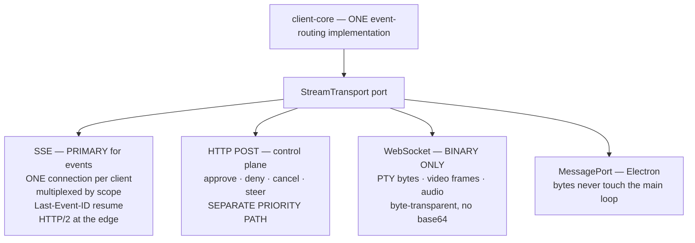
```mermaid
graph TB
  CORE["client-core — ONE event-routing implementation"] --> PORT["StreamTransport port"]
  PORT --> SSEI["SSE — PRIMARY for events<br/>ONE connection per client<br/>multiplexed by scope<br/>Last-Event-ID resume<br/>HTTP/2 at the edge"]
  PORT --> POSTC["HTTP POST — control plane<br/>approve · deny · cancel · steer<br/>SEPARATE PRIORITY PATH"]
  PORT --> WSB["WebSocket — BINARY ONLY<br/>PTY bytes · video frames · audio<br/>byte-transparent, no base64"]
  PORT --> MP["MessagePort — Electron<br/>bytes never touch the main loop"]
```

| Channel | Transport | Why |
|---|---|---|
| **LLM tokens, tool calls, lifecycle items** | **SSE**, one connection, multiplexed by scope | Universal, proxy-safe, `curl`-debuggable, stronger backpressure, and the model providers hand us SSE anyway |
| **Approvals, cancel, steer** | **HTTP POST** on a **separate priority path** | Units per turn; 1 RTT invisible. **Jupyter's lesson:** a dedicated `control` channel exists so interrupt never queues behind output. **Vercel's lesson:** once streams are resumable, *disconnect ≠ cancel* — an explicit cancel endpoint is required regardless of transport |
| **PTY bytes** | **WebSocket binary** *(already have)* | UTF-8 corruption makes SSE not merely costly but wrong |
| **Video frames** | **WebSocket binary** *(already have)* | +33% base64 and no input channel |
| **Electron** | **MessagePort** | Fastest path; no socket at all |

**This is a change of roughly one endpoint and one nginx directive — not a transport migration.**

## 5.4 What actually has to change

| # | Change | Fixes |
|---|---|---|
| 1 | **Enable HTTP/2 at the edge** (nginx `http2 on;` + `proxy_buffering off;` + `proxy_read_timeout 3600s`). Ship a reference config; Express is untouched | **P2-12** — the connection limit disappears |
| 2 | **Collapse the four bypassing SSE call sites into one multiplexed connection per browsing context**, demultiplexed by the typed envelope we already have | **P2-12** |
| 3 | **Wire `sseWrite.ts`** — the correct drain-aware writer already exists with zero importers. Honour `write()`'s return value; push to `drainWaiters` | **P0-7** |
| 4 | **Bring `routes/computer.ts` under the managed path** — connection slot, backpressure, no 250 ms filesystem poll | **P1-11** |
| 5 | **Add a control-plane POST path with its own priority**, so cancel never queues behind token output | **N-1** |
| 6 | **Move to a `fetch`-based SSE client** for `Authorization`/DPoP, with our own jittered backoff and `Last-Event-ID` handling; emit a **randomised `retry:`** per connection to break reconnect storms | **N-1**, deploy storms |
| 7 | **Heartbeat every 15–25 s on every channel.** ALB idle default is 60 s and **explicitly does not reset on HTTP/2 PING**; Cloudflare's origin read timeout is **125 s**; nginx and ingress-nginx default to 60 s | connection death behind third-party infra |
| 8 | **Handle scheduled disconnects.** ALB's `client_keep_alive` ceiling is 3600 s, then `GOAWAY`. Cloudflare restarts terminate WebSockets on release | resilience |
| 9 | Keep the four WebSocket paths **exactly as they are**, on the shared `noServer` upgrade | — |
| 10 | *(Optional, deferred)* **SharedWorker** to collapse tabs onto one `EventSource` — the WHATWG spec explicitly recommends this | multi-tab |

## 5.5 Scalability for a multi-user deployment

The two transports have **near-identical** operational hazards — both die to the same 60 s idle timeouts, both need the same heartbeat, both need the same sticky-or-pubsub design. *"WebSockets are hard to deploy"* is mostly stale folklore in 2026. What actually differs at scale:

| Concern | Verdict |
|---|---|
| Per-connection memory | **Equivalent.** Within a small constant factor. Your per-connection *application* state dominates both by an order of magnitude. **Do not choose a transport on this** |
| File descriptors | Identical — one TCP socket either way. **Note:** with nginx terminating HTTP/2, the browser uses 1 connection but nginx still opens **one upstream socket per SSE stream**. Size `worker_connections` and Node's FD limit against *total concurrent streams* |
| Sticky sessions | **Equally required** — neither protocol carries server identity. Correct answer for both: make the gateway stateless and put session state behind pub/sub, so affinity becomes a latency optimisation rather than a correctness requirement |
| Pub/sub fan-out | **Transport-independent.** It changes `res.write(sse(e))` into `ws.send(json(e))` and nothing else |
| Deploy storms | **SSE is worse by spec** (backoff is `MAY`) — mitigated by randomised `retry:`. SSE also has a **204 drain primitive** WebSocket lacks |
| Behind customer-controlled infra | **SSE safer overall**, except HAProxy where WebSocket wins. Cloudflare Argo is **incompatible with WebSocket** |
| Security | **SSE safer** — normal CORS governance; WebSocket has no preflight and `Origin` must be checked manually. Cloudflare's WAF stops inspecting WS after the 101 |
| Mobile on poor networks | **Marginal.** HTTP/2 shares one TCP connection, so packet loss head-of-line-blocks *all* streams; HTTP/3 fixes it. Favours keeping bulk video on its own WebSocket |

## 5.6 Wire formats

**Two envelopes, because there are two channel classes.**

**SSE event stream** — the typed envelope we already have, one connection, demultiplexed by `scope`:

```
id: <streamId>:<seq>
event: item | delta | control
data: {"scope":"chat:abc","kind":"message_delta","seq":1234,"payload":{...}}
```

`id:` carries the **stream-id-scoped cursor**, so a cursor from a previous boot is *rejected* rather than used to replay a different run's frames — and a browser resumes through `Last-Event-ID` with no client code. A `:` comment line every 15–25 s keeps ALB, Cloudflare, nginx and HAProxy from closing the connection.

**WebSocket binary channels** — unchanged from today, one small header per frame:

```
kind:u8 | handle:u32 | seq:u32 | payload (raw bytes)

  0x10 pty out     0x11 pty in / ack
  0x20 video chunk 0x21 input event
```

**Byte-for-byte, never transcoded** — xterm.js runs its own incremental decoder, so a multi-byte character split across two reads reassembles correctly on the client only if we do not touch it. This is also why these bytes can never move to SSE: the UTF-8 decode algorithm would replace invalid sequences with U+FFFD.

**Control plane** — an ordinary authenticated POST, correlated by `requestId` against the permission-request event that arrived on the SSE stream, on a route that is **not** behind the streaming queue.

## 5.7 Lanes on the wire

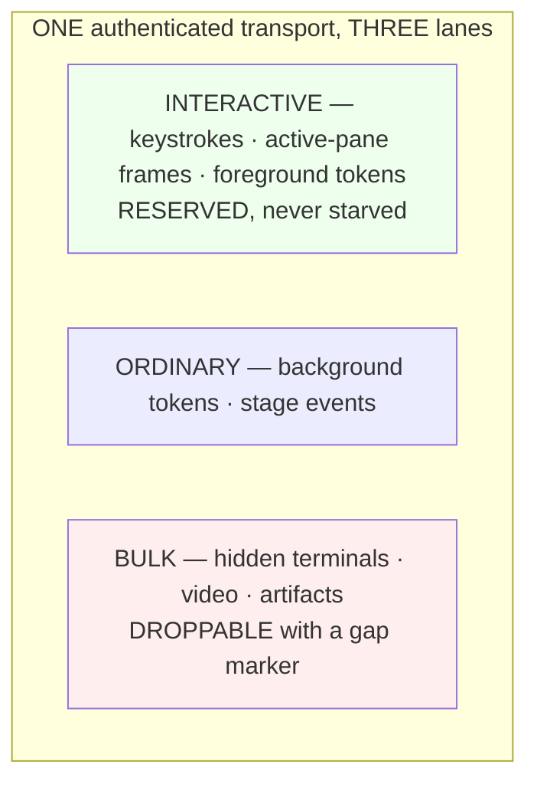
```mermaid
graph TB
  subgraph NET["ONE authenticated transport, THREE lanes"]
    L1["INTERACTIVE — keystrokes · active-pane frames · foreground tokens<br/>RESERVED, never starved"]
    L2["ORDINARY — background tokens · stage events"]
    L3["BULK — hidden terminals · video · artifacts<br/>DROPPABLE with a gap marker"]
  end
  style L1 fill:#efe
  style L3 fill:#fee
```

Weighted scheduling with a reserved interactive lane and anti-starvation counters. **Bulk traffic is chunked and interleaved rather than sent as one giant write**, so a terminal flood can never delay a keystroke echo.

## 5.8 Multi-client connectivity

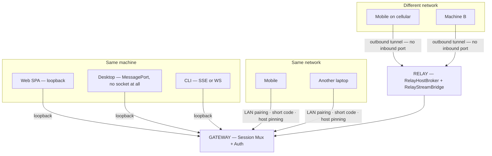
```mermaid
graph TB
  subgraph LOCAL["Same machine"]
    W1["Web SPA — loopback"]
    D1["Desktop — MessagePort, no socket at all"]
    C1["CLI — SSE or WS"]
  end
  subgraph LAN["Same network"]
    M1["Mobile"]
    W2["Another laptop"]
  end
  subgraph REMOTE["Different network"]
    M2["Mobile on cellular"]
    W3["Machine B"]
  end
  GW["GATEWAY — Session Mux + Auth"]
  RL["RELAY — RelayHostBroker + RelayStreamBridge"]
  W1 & D1 & C1 -->|loopback| GW
  M1 & W2 -->|"LAN pairing · short code · host pinning"| GW
  M2 & W3 -->|"outbound tunnel — no inbound port"| RL --> GW
```

**"Direct" means two different things by location:**

| Client location | Mechanism | What "direct" means |
|---|---|---|
| **Same machine** | Transferred `MessagePort` (Electron) or a loopback socket handed off after authorisation | Genuinely direct. Bytes never enter the gateway process |
| **Remote** | A **separate lane on the same authenticated transport**, brokered by the gateway | Not a separate socket — but a separate *lane*, scheduled independently |

**In both cases the property that matters holds:** terminal and video data never sits in the gateway's request queue behind chat tokens.

**Capability-aware behaviour.** The client declares what it is. A mobile client on a poor connection gets a lower frame rate, a wider coalescing window, and — following the lesson that *editing one message per chunk reads as a stutter on a high-latency surface* — possibly **block delivery instead of token streaming.** A `TransportCapabilities` decision, not a hardcode.

**Why the mux matters most here.** Over a relay, connection setup is expensive and mobile networks drop constantly. Five SSE connections × TLS handshake × relay brokering is a bad mobile experience. **One connection re-establishes the whole session in one round trip** — see §5.9.

## 5.9 The multiplexed stream — full design

This is the design for carrying **many concurrent chats, workflow runs, sessions and panels over one SSE connection**. It is specified in detail because the codebase has been through this loop twice, and both attempts failed for reasons recorded below.

### 5.9.1 What exists, and why it is where it is

`apps/web/src/stores/sseManager.ts` opens with an explicit rejection of multiplexing:

> *"The legacy single-global-multiplexed design was replaced because: Per-scope subscriptions are simpler (no cross-session fan-out). **Only 1-2 EventSources per tab** (chat + optionally workflow run) vs. the old 'one global stream + manual fan-out' which still needed a watchdog for its own flakiness."*

Both halves of that justification have decayed:

| Claim in the comment | Reality today |
|---|---|
| *"Only 1-2 EventSources per tab"* | **Five** on a chat tab with the right pane open — chat, browser-session, terminal-session, `BrowserPanel`, `ComputerPanel`. Seven call sites construct them |
| *"the old watchdog … is gone"* | `sseManager` **still carries a stall watchdog** (`watchdogTimer`, `gapFilling`, `contiguousSequence`, `emptyGapFills`), with a comment explaining that `EventSource` silently drops during long tool gaps and `Last-Event-ID` resume can miss the terminal `harness.idle`, *"stranding the UI on 'Copilot is thinking…' forever"* |

**The watchdog was not eliminated by de-multiplexing — it was inherited.** Per-scope connections multiplied the number of things that can silently stall, from one to five.

Parts that are already right and must be preserved:

- **No `event:` field is emitted.** Every frame fires `onmessage` and carries `kind` inside the JSON, deliberately, because there is no wildcard `addEventListener`. **This framing is already multiplex-ready.**
- **`?afterSeq=` exists** as an alternative to `Last-Event-ID` *"for callers that can't set headers."*
- **Ticket auth already solves the `Authorization` problem** — `POST /api/stream/tickets` mints 30-second, single-use, scope-bound tickets. **△ REV3: this supersedes the earlier recommendation to adopt a `fetch`-based SSE client for DPoP.** The existing ticket model is better — it keeps native `EventSource` reconnect semantics and puts no long-lived credential in a URL.
- **`X-Accel-Buffering: no`, a `: connected` priming comment, and a heartbeat** are all already correct.

### 5.9.2 The four problems that must be solved

Multiplexing is not "open one connection instead of five." Four things break:

**① Resume (N-9) — the blocking problem.** `StreamBroker` gives every `(scope, id)` an *independent* monotonic sequence. `Last-Event-ID` carries one integer. On a connection carrying `chat:A` at seq 900 and `run:B` at seq 12, a single cursor is meaningless.

**② Duplicates (N-10).** One harness event is published to `chat:<chatId>` **and** `session:<sessionId>`. Separate connections made that invisible. One connection makes it a double-render.

**③ Head-of-line blocking.** Five connections meant a stalled preview stream stalled only itself. One connection means it stalls chat tokens too. **This is exactly why Jupyter keeps a separate `control` channel** — *"to avoid queueing behind execution requests."*

**④ Subscription mutation.** SSE is `GET` with no body. Opening a second chat must not require tearing the connection down and losing position.

### 5.9.3 The design

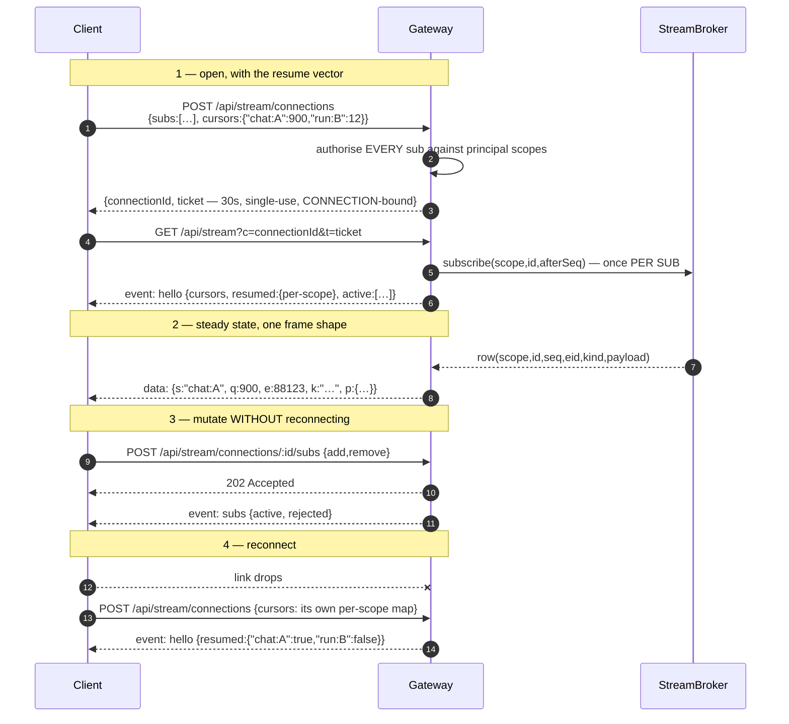
```mermaid
sequenceDiagram
  autonumber
  participant C as Client
  participant GW as Gateway
  participant B as StreamBroker

  Note over C,GW: 1 — open, with the resume vector
  C->>GW: POST /api/stream/connections<br/>{subs:[…], cursors:{"chat:A":900,"run:B":12}}
  GW->>GW: authorise EVERY sub against principal scopes
  GW-->>C: {connectionId, ticket — 30s, single-use, CONNECTION-bound}
  C->>GW: GET /api/stream?c=connectionId&t=ticket
  GW->>B: subscribe(scope,id,afterSeq) — once PER SUB
  GW-->>C: event: hello {cursors, resumed:{per-scope}, active:[…]}

  Note over C,GW: 2 — steady state, one frame shape
  B-->>GW: row(scope,id,seq,eid,kind,payload)
  GW-->>C: data: {s:"chat:A", q:900, e:88123, k:"…", p:{…}}

  Note over C,GW: 3 — mutate WITHOUT reconnecting
  C->>GW: POST /api/stream/connections/:id/subs {add,remove}
  GW-->>C: 202 Accepted
  GW-->>C: event: subs {active, rejected}

  Note over C,GW: 4 — reconnect
  C--xGW: link drops
  C->>GW: POST /api/stream/connections {cursors: its own per-scope map}
  GW-->>C: event: hello {resumed:{"chat:A":true,"run:B":false}}
```

**① Resume — the client owns a cursor *map*, not a cursor.**

`Last-Event-ID` is abandoned for the multiplexed endpoint (it stays on the legacy single-scope endpoint, which remains for the CLI and `curl`). Instead:

- Every frame carries its own `s` (scope key) and `q` (per-scope seq). The client maintains `Map<scopeKey, seq>`.
- On reconnect the client **POSTs the whole map**. The server issues one `subscribe(scope, id, {afterSeq})` per entry — using machinery that **already exists**.
- `hello` reports **per-scope** whether resume succeeded: `resumed:{"chat:A":true,"run:B":false}`. A `false` means that cursor fell outside retention and **that scope alone** re-snapshots. *Revision 1's single `hello{cursor, resumed}` was wrong for the same reason a single `Last-Event-ID` is.*
- The `id:` field still carries an opaque per-connection counter so proxies and any stray `EventSource` reconnect behave sanely, but **it is not the resume key**.

**② Duplicates — dedup on `eid`, the cross-scope identity.** `StreamBroker.publish` already returns `{seq, id, ts}` where `id` is the global `stream_cursors` row id — **stable across every scope the event fans out to**. Emit it as `e`. The client keeps a bounded LRU (~2,000) of seen `eid`s. `sseManager` already has `seenSequenceIds`; it changes key, not shape.

**③ Head-of-line blocking — two channel classes, not one connection for everything.**

| Class | Carried on | Rationale |
|---|---|---|
| **Interactive** — chat tokens, run/stage lifecycle, tool calls, approvals, gate cards | **The multiplexed SSE connection** | Bounded volume, latency-sensitive, must never be dropped |
| **Bulk binary** — browser frames, terminal bytes, computer-use preview | **The existing WebSocket paths** | Already there for terminal and browser. **`routes/computer.ts` moves onto the browser WS path** — it is JPEG frames, and it has no business on a text transport with a 250 ms filesystem poll |

**This is the decision that makes multiplexing safe.** Do not put preview frames on the shared SSE connection; that rebuilds the problem you just removed.

Within the interactive connection, per-scope bounded queues with the §3.3 lane policy apply, so a slow *scope* is dropped with a gap marker rather than stalling its siblings.

**④ Subscription mutation — POST, out of band.** `POST /api/stream/connections/:id/subs` with `{add, remove}` → **202**, then a `subs` frame confirms the active set *on the stream itself*, so the client's view of its own subscriptions is server-confirmed rather than assumed. This is precisely MCP's shape: `GET` for the stream, `POST` for everything the client says.

### 5.9.4 Frame format

Field names are short because they repeat on every token.

```jsonc
{
  "s": "chat:8f3a",   // scope key "<scope>:<id>" — routing
  "q": 1234,          // per-scope sequence — the resume cursor for THIS scope
  "e": 88123,         // global event id — the DEDUP key across scopes
  "k": "harness.token",
  "p": { }
}
```

Control frames use the SSE `event:` field, which costs nothing — the client adds exactly three named listeners and everything else still lands on `onmessage`:

| `event:` | Payload | Purpose |
|---|---|---|
| `hello` | `{connectionId, cursors, resumed:{scopeKey:bool}, active:[…]}` | Sent once, immediately. **Per-scope** resume truth |
| `subs` | `{active:[…], rejected:[{scopeKey, reason}]}` | Confirms a mutation |
| `gap` | `{s, fromSeq, toSeq, reason}` | This scope dropped frames. **Scope-local, never fatal to the connection** |

`slow_consumer_dropped` is **retained** but becomes the last resort: a slow scope gets a `gap` first, and only a connection that cannot drain at all is dropped.

### 5.9.5 Caps and authorisation

| Limit | Value | Why |
|---|---|---|
| Multiplexed connections **per principal** | **2** (a live tab + one reconnecting) | **N-11** — the existing cap is per-`(scope,id)` and bounds nothing a real tab does |
| Subscriptions **per connection** | **32** | Bounds broker fan-out registrations and `hello` size |
| Subscribers **per `(scope, id)`** | keep the existing 6 | Still the right fan-out guard |
| Ticket | **connection-bound**, 30 s, single-use | **N-12** — one ticket authorises the *connection*; **every subscription is authorised individually at subscribe time** against the principal's scopes, so a connection can never be used to widen access |

A rejected subscription must **not** fail the connection — it returns in `subs.rejected` with a reason, per Law **L7**.

### 5.9.6 Verification of the existing implementation

| Check | Finding |
|---|---|
| Frame carries a routable scope | ❌ **No.** The connection *is* the scope. `deliver()` emits only `{kind, payload}` — `s`/`q`/`e` must be added |
| Per-scope sequence spaces | ⚠️ **Yes, and that is the problem** (N-9). Correct for today's design, fatal for a naive multiplexed one |
| Cross-scope duplicate suppression | ❌ **None.** `seenSequenceIds` dedups within one scope only (N-10) |
| Per-client connection cap | ❌ **None** (N-11) |
| Subscription mutation without reconnect | ❌ **Not possible.** Scope is fixed in the URL |
| Backpressure | ⚠️ **Half-wired** (P0-7) — drain listener present, waiter never registered; real behaviour is drop-at-256 |
| Auth for `EventSource` | ✅ **Already solved** by the ticket model. **Keep it** |
| `kind`-in-payload framing | ✅ **Already multiplex-ready** |
| `?afterSeq=` resume | ✅ Exists; generalises to the cursor map |
| Stall watchdog | ⚠️ Keep, but run it **once per connection**, not once per scope |
| Retention vs replay window | ❓ **Verify before building.** Multiplexing raises the odds that *some* cursor in the map has fallen outside retention. `hello.resumed` per scope makes it survivable, but W02's TTL and the 200-row sync replay cap must be checked against a realistic reconnect gap |

**Conclusion: the transport and the framing are sound; the *addressing* is missing.** Every frame must say which scope it belongs to, every scope needs its own cursor, and duplicates need a cross-scope identity. That is an additive change to `deliver()`, a new connection registry, and a rewritten connection map in `sseManager` — **not a new transport.**

---

# PART 6 — Security architecture

## 6.1 Trust zones

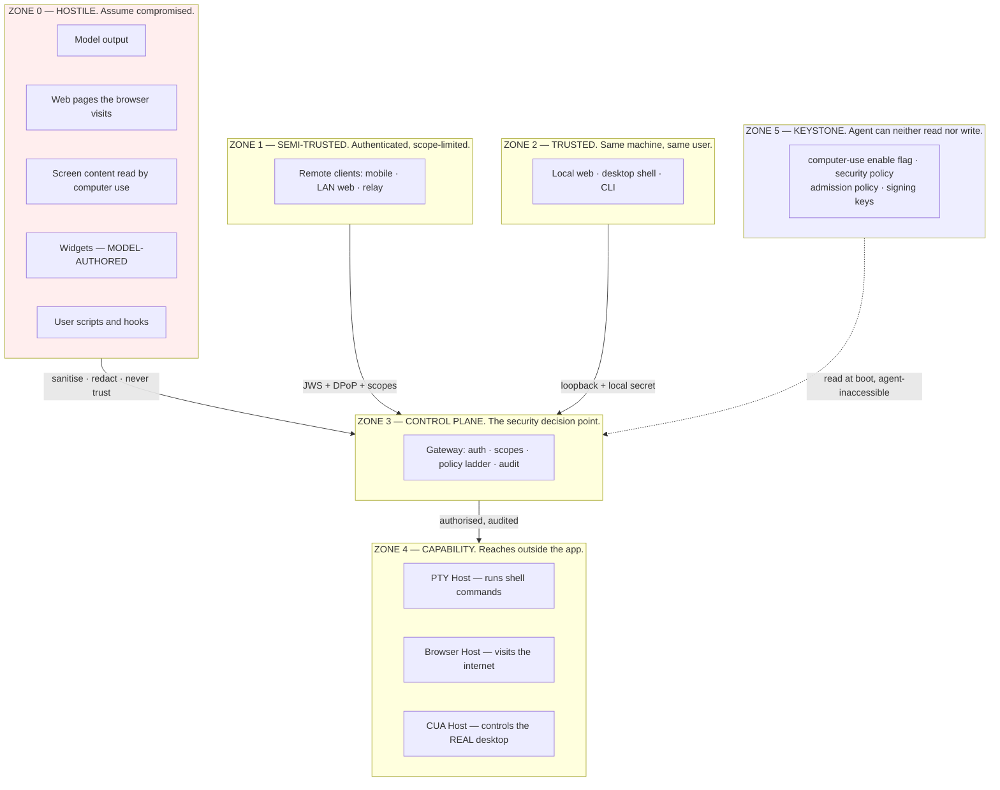
```mermaid
graph TB
  subgraph Z0["ZONE 0 — HOSTILE. Assume compromised."]
    MODEL["Model output"]
    WEBC["Web pages the browser visits"]
    SCR["Screen content read by computer use"]
    WIDG["Widgets — MODEL-AUTHORED"]
    HOOK["User scripts and hooks"]
  end
  subgraph Z1["ZONE 1 — SEMI-TRUSTED. Authenticated, scope-limited."]
    RC["Remote clients: mobile · LAN web · relay"]
  end
  subgraph Z2["ZONE 2 — TRUSTED. Same machine, same user."]
    LOCAL["Local web · desktop shell · CLI"]
  end
  subgraph Z3["ZONE 3 — CONTROL PLANE. The security decision point."]
    GW2["Gateway: auth · scopes · policy ladder · audit"]
  end
  subgraph Z4["ZONE 4 — CAPABILITY. Reaches outside the app."]
    PTY2["PTY Host — runs shell commands"]
    BR2["Browser Host — visits the internet"]
    CUA2["CUA Host — controls the REAL desktop"]
  end
  subgraph Z5["ZONE 5 — KEYSTONE. Agent can neither read nor write."]
    KEY["computer-use enable flag · security policy<br/>admission policy · signing keys"]
  end
  Z0 -->|"sanitise · redact · never trust"| Z3
  Z1 -->|"JWS + DPoP + scopes"| Z3
  Z2 -->|"loopback + local secret"| Z3
  Z3 -->|"authorised, audited"| Z4
  Z5 -.->|"read at boot, agent-inaccessible"| Z3
  style Z0 fill:#fee
  style Z5 fill:#eef
```

**The central idea: the agent is in Zone 0, not Zone 3.**

## 6.2 The identity chain (existing — stays)

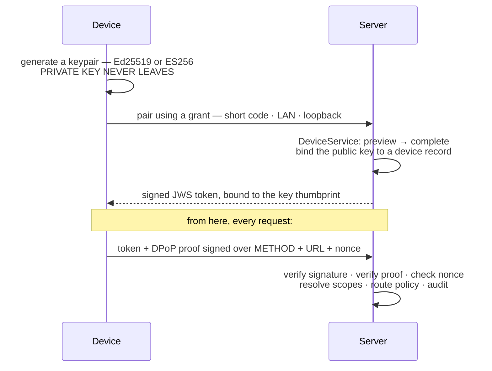
```mermaid
sequenceDiagram
  participant D as Device
  participant S as Server
  D->>D: generate a keypair — Ed25519 or ES256<br/>PRIVATE KEY NEVER LEAVES
  D->>S: pair using a grant — short code · LAN · loopback
  S->>S: DeviceService: preview → complete<br/>bind the public key to a device record
  S-->>D: signed JWS token, bound to the key thumbprint
  Note over D,S: from here, every request:
  D->>S: token + DPoP proof signed over METHOD + URL + nonce
  S->>S: verify signature · verify proof · check nonce<br/>resolve scopes · route policy · audit
```

**DPoP makes the token sender-constrained** — a stolen token is useless without the private key that never left the device.

### What changes in V2

| Change | Reason |
|---|---|
| **Auth moves to the edge, before admission** | One authorisation decision per *connection* instead of per request |
| **Stream tickets cost 1 operation, not 3** | With one mux socket per client, that happens once per client, not 4× per chat tab. Reconnect storms stop being write storms |
| **Device touch-writes batched** | Every authenticated call currently performs a device-table write |
| **Route policy memoised** | It currently re-splits the path against ~45 policies per request |
| **Hosts get their own authentication** | New requirement — §6.3 |

## 6.3 Securing the new process boundary

| Host | Bound to | Authentication | Rule |
|---|---|---|---|
| **Agent Host** | loopback socket / inherited pipe | Per-spawn secret in the environment, **never on a command line** | Never listens on a routable address |
| **PTY Host** | loopback / transferred port | Per-session capability token issued by the gateway | A client can only attach to a terminal its scopes permit |
| **Browser Host** | loopback / transferred port | Same | Frames authorised per session |
| **CUA Host** | Unix socket / named pipe, **owner-only** | Descriptor file written atomically, **mode 0600** | **The gateway never calls it.** It publishes a descriptor; the agent's tool proxy connects |

**Three rules from the reference systems:**
1. **Credentials never travel on a command line.** A process listing is world-readable to every local process. Secrets go in a mode-0600 temp file deleted when the turn settles.
2. **The computer-use driver must be started by the process that owns the OS permission grant.** On macOS the OS attributes a spawned child to its *responsible process*. If a background service starts the driver, the permission identity silently becomes the service's and **the permission check cannot detect the misattribution.**
3. **Agent-issued shell commands run with a scrubbed environment allowlist** so provider and account credentials cannot leak through a tool call.

## 6.4 The permission ladder

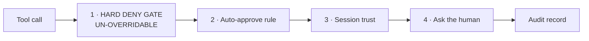
```mermaid
flowchart LR
  A["Tool call"] --> B["1 · HARD DENY GATE<br/>UN-OVERRIDABLE"]
  B --> C["2 · Auto-approve rule"]
  C --> D["3 · Session trust"]
  D --> E["4 · Ask the human"]
  E --> F["Audit record"]
```

**The order is a security property:** the hard deny gate runs *before* auto-approve and session trust, so a deny can never be overridden by a convenience setting.

**And per L16, the gate sits on `PreToolUse`, not `canUseTool`** — otherwise calls already allowed by `allowedTools`, a settings rule, or the permission mode bypass it entirely.

> **Security warning recorded from Hermes' own docs:** hosts that auto-answer permission requests convert the human-in-the-loop guarantee into arbitrary code execution — *"I asked one to run `rm -rf` against a scratch directory and it deleted it, no prompt anywhere."* Our auto-approve path must be deliberate, audited and keystone-gated.

## 6.5 Zone-0 defences

| Threat | Defence |
|---|---|
| **Prompt injection from a page or the screen** | Use the **official** computer-use tool type so the provider's injection classifiers run — approximately zero latency and no cost, and **they do not run on custom tool definitions**. Plus explicit untrusted-content boundaries in the prompt |
| **Model-authored widget escaping its sandbox** *(P1-53)* | **Refuse to render** when the assets base is empty or resolves to the host origin. Origin-pinned message handshake, not ambient messaging. CSP on the origin |
| **Agent flipping its own capability gates** | Enable flags live in **keystone files** the agent's file tools cannot read or write |
| **Agent reaching a blocked app or site** | Blocklist checked **twice** — requested name and resolved identity. URL policy enforced at the **CDP layer** so subresources are blocked too. Blocked results are **shape-identical to "not found"** so the blocklist cannot be enumerated |
| **Credential leaking through streamed output** | Rolling-buffer redaction that withholds a trailing credential-shaped run until provably safe. **Protocol de-framing runs before redaction** |
| **A refusal message leaking secrets** | Refusals go through the **same** redaction as success paths |
| **Stale approval buttons after a restart** | The widget carries a `(sessionKey, transcriptTimestamp)` token in its own id; a click is judged against the persisted transcript. Zero server state |
| **Tool acting on a stale UI snapshot** | Element index keyed by `(session, window)`, monotonic-clock TTL, fingerprint drift verified before every mutating action. **Hard fail, never a lazy re-scan** |
| **Truncated tool arguments** *(X-2)* | **All** tool calls in a truncated batch fail with an explanatory synthetic error |
| **Resource exhaustion as DoS** | Admission control with lanes; bounded queues; configuration clamps logged and audited |

## 6.6 Threat model summary

| Threat | Today | V2 |
|---|---|---|
| Stolen bearer token | Mitigated (DPoP) | Same |
| Replayed request | Mitigated (nonce) | Same |
| Malicious widget | **Sandbox can collapse to same-origin** | Refused; CSP; port handshake |
| Prompt injection via screen/page | Partial | Official tool type + classifiers; boundaries |
| **Tool gate bypass** | **Gate is inert (P1-44); would be on the wrong hook (N-5)** | **`PreToolUse`, on the path every call takes** |
| Secret in a process listing | Partial | Never on a command line; 0600 files |
| Agent disabling its own gates | Partial | Keystone files |
| One session crashing the server | **Any rejection kills the process** | Handlers everywhere; supervised hosts; capped restarts |
| Resource exhaustion | **No admission control** | Lanes + bounded queues + clamps |
| Orphaned processes | **24 live right now** | Parent-PID heartbeat + boot reaper |
| Host impersonation | Host pinning | Same + identity-checked port acquisition |
| Relay reading traffic | Device-authenticated end to end | Same |

---

# PART 7 — Feature-by-feature integration

| Feature | What changes | Net effect |
|---|---|---|
| **Chat streaming** | Delta/item split; coalescer; encode-once; mux transport | Order-of-magnitude fewer writes; no stutter under load |
| **Workflows / stages** | Permit released across gates; incremental DAG frontier; parallel workspace prep | 8 stages on approval no longer stop the server |
| **Mid-run steering** | Signal primitive (named, resolvable repeatedly), distinct from the gate primitive | Redirect a running agent without cancelling it |
| **Automations (loop/batch)** | Durable step memoization; all iterations written up front, claimed atomically | A 1000-row batch survives a restart |
| **Orchestrator / background agents** | Persisted task state; termination = budget **and** convergence **and** arbiter; global worker cap; capability inheritance (G15) | Durable and bounded |
| **Integrated terminal** | PTY Host; credit flow control; headless VT scrollback; 5 ms coalescing | A build no longer stutters your chat; terminals survive a reload |
| **Multiple terminals** | Per-session watermarks; instance cap; idle keyed on attachment | Predictable with many tabs |
| **Integrated browser** | Browser Host; one Chromium N contexts; WebCodecs | ~1 GB returned at 5 concurrent; capture throttles under pressure |
| **Multiple browser sessions** | Contexts + page-id routing | Concurrent agents share one browser |
| **Computer use** | CUA Host descriptor; fused act+observe; frame integrity + dedupe | ~half the model calls per UI step; no server-wide 30 s blocks |
| **Widgets / extensions** | Origin-pinned frames with a port handshake; bounded lifetime | Sandbox cannot collapse; widgets are torn down |
| **Agent providers** | Vendor SDK tier + ACP breadth tier; instance registry; declared capabilities | Add a long-tail provider by configuration; add depth where it matters |
| **Custom agents (G1–G16)** | Config projection through one typed path; artifact staging bridge; agent-aware binding key | Named-agent routing actually works |
| **Desktop app** | Same gateway, hosts co-located; native browser view; transferred `MessagePort` | Native performance where it matters, identical behaviour elsewhere |
| **CLI / TUI** | `client-core` + frame-aligned drain | 200 reconciles/s → ~60 |
| **Mobile** | `client-core` (already the reference implementation) | Promoted, not rewritten |
| **Cost and context visibility** | Usage update event + cache-miss accounting | You can see context fill and what a cache miss cost |

---

# PART 8 — Implementation specification

**45 work items.** W01–W33 retain their original identity **except W11**, which was renamed **W39** when correction C2 narrowed its scope from "all ACP providers" to "the long tail only" — that is a semantic change and it should not hide behind an unchanged number. **W40 and W43 are unused.** W34–W48 are new.

## 8.0 Sizing

The plan's real failure mode is **ordering, not effort** — the review found three sequencing defects and zero effort misjudgements. So the sizing dimensions here are the two that expose ordering risk. **No time estimates**: uncertainty is concentrated in the four vendor integrations, where upstream release cadence (Codex **≥98 commits in 31 days**; Claude SDK **a release every 1–2 days**) dominates any internal figure.

**Depth** = longest dependency chain to a leaf. **Blast radius** = packages × surfaces × persisted structures touched. **Reversible** = can be flipped off without stranding data.

| Work item | Depth | Blast radius | Reversible | Note |
|---|:--:|:--:|:--:|---|
| **W07** durable item writer | 3 | **high** | ❌ | Changes the durable shape. Needs W47's window |
| **W34** provider port + instance registry | 3 | **high** | ❌ | `db` + `core` + providers + every surface's model picker + a backfill |
| **W22** durable execution engine | 4 | **high** | ❌ | Most mechanism-dense item in the plan |
| **W09** transport hardening | 2 | med | ✅ | HTTP/2 is an edge config; backpressure is one file |
| **W09-a** multiplexed stream | 3 | **high** | ⚠️ | Server framing + connection registry + full `sseManager` rewrite. **Highest-risk item in Phase 1 after W07.** Third attempt at this design — read §5.9.1 before starting |
| **W33** layering lint | 1 | med | ✅ | **Critical path** — gates the whole process split |
| **W12** Agent Host | 3 | **high** | ✅ | Flag with in-process fallback |
| **W18** admission controller | 3 | **high** | ⚠️ | Changes behaviour for every subsystem at once — ship lane-by-lane |
| **W14 / W15 / W17** native hosts | 3 | **high** | ✅ | Independent of each other; one per release |
| **W47** migration and cutover | 2 | **high** | ❌ | Prerequisite for W07, W34, W22 |
| **W48** test/surface/relay migration | 2 | **high** | ✅ | Must partly precede W09 |
| **W35** Claude gate on `PreToolUse` | 2 | med | ✅ | Security-behaviour change, not additive |
| **W36** Copilot runtime lifecycle | 3 | med | ✅ | Depends on W12's supervisor |
| **W05 / W06 / W08** spine internals | 2 | med | ✅ | Kill switch viable only inside W47's window |
| **W27** web rendering | 2 | med | ✅ | Highly visible; flag per surface |
| **W37 / W38 / W39 / W10** | **1** | low | ✅ | **Depth-1 leaves — deferrable or parallelisable without moving the end date** |
| **W41 / W42 / W44 / W45** | 1–2 | low | ✅ | W44 and W45 should land *first* in Phase 2; they grade everything after |
| **W01 / W02 / W20 / W32 / W28** | 1 | low | ✅ | Independent |
| **W46-b** custom agents feature | 4 | **high** | ✅ | Post-V2, product decision |

**The critical path is `W33-layering → W12 → W36/W18 → W14/W15/W17`.** Everything hanging off Phase 2 except W34 is depth-1 or depth-2 and can move without moving the end date. **Anything in the "high blast radius × not reversible" cell — W07, W34, W22, W47 — needs a named owner and a written rollback before its phase begins.**

---

## Track 1 — Data and persistence

**W01 — Database hot-path surgery.** Gate the verbose callback on telemetry being enabled (do not pass it at all when off). Prepared-statement cache keyed on query text, hoisted out of the transaction. Remove the v1 event write from the hot path. Move the noise filter **above** the emit.
*Acceptance:* per-token statement count ≤ 2; measured per-token blocking ≤ 40 µs; benchmark asserts it.

**W02 — Storage configuration and retention.** Retention TTL that fires (7–14 days deltas, longer for items). Add the missing index. Schedule `ANALYZE`. Set `mmap_size`. Disable autocheckpoint; drive checkpointing from a size watchdog on a background path. Replace the boot aggregate with a maintained counter.
*Acceptance:* cold boot < 300 ms; database size stabilises; no full scans in the plan for stream reads.

**W03 — Transaction manager rework.** One transaction primitive. Broker appends route through it. No nesting that can degrade to a savepoint. No lock held across an `await` on external work. Per-key queues (promise-tail) replace the global mutex, with the tail catching rejections.
*Acceptance:* a test proves a broadcast row can never be rolled back; concurrent independent writes do not serialise.

**W07 — Durable item writer.** Micro-batched multi-row item inserts. Append-only delta log per session with rotation and torn-tail repair. **△ REV2 — the open either/or is decided: delete `StreamLogger`'s blocking per-event append.** The durable delta log carries the same information; keeping both is the defect. Declare the delta log's bounds explicitly: **per-session file cap, rotation count, and a global on-disk ceiling**, all enforced by the same retention sweep as W02 so L1's "bounded ceiling" is measurable rather than aspirational.
*Acceptance:* zero synchronous file writes on the event path; the delta-log directory has a measured steady-state ceiling under the §1.Q load; rotation is exercised by a test.

## Track 2 — Stream spine and transport

**W04 — Event classification.** Every event typed `delta` or `item` at its source. A lint rule fails on an unclassified kind.
*Acceptance:* exhaustive switch, no default case.

**W05 — Coalescer and fan-out.** Per-scope bounded ring buffer, 4–16 ms adaptive window, immediate flush on any item, one encoded buffer per flush, per-client bounded queue, lane-based drop with a visible gap marker.
*Acceptance:* one serialisation per flush regardless of subscriber count; a slow client drops bulk frames and receives a gap marker, never drops items.

**W06 — Backpressure.** Awaited sequential dispatch plus a drain subscriber for agent producers. Credit window with acknowledgement at parse completion for terminals. Delete the dead drain-waiter code and the orphaned writer, or wire it.
*Acceptance:* with an artificially slow client, server memory stays flat and the provider read rate drops.

**W08 — Stream cursors and resume.** Stream-id-scoped cursors in the transport's own id field. A `hello` frame carrying `{cursor, resumed}` that **tells the truth when the cursor fell off the end**. Bounded replay. Per-client subscription filters. The unmanaged endpoint acquires a slot like every other.
*Acceptance:* reconnect after a restart never replays another run's frames; a client past the window is told so and re-snapshots.

**W09 — Transport hardening.** *(△ REV3 — rescoped from "migrate to WebSocket"; multiplexing split out into W09-a. See Part 5.)* **We keep SSE for events and WebSocket for binary. Nothing migrates.**
1. **Enable HTTP/2 at the edge** with a shipped reference nginx config (`http2 on`, `proxy_buffering off`, `proxy_read_timeout 3600s`). **Express is untouched** — connection management is hop-by-hop, so terminating HTTP/2 at nginx removes the 6-connection limit regardless of the upstream protocol.
2. **Decide and implement one backpressure policy** (P0-7). The code currently promises *pause the producer* in comments and performs *drop the consumer at 256* in fact. **Recommendation: keep drop-with-a-gap-marker for bulk lanes, add real producer pause for item lanes** — push a waiter in `writeFrame` and await it, which is the half that was never written.
3. **A control-plane POST path with its own priority**, so cancel and approvals never queue behind token output.
4. **Heartbeat every 15–25 s on every channel**; handle scheduled `GOAWAY`/restart disconnects.
5. Keep `terminal-ws.ts`, `browser-ws.ts` and `stt-ws.ts` **exactly as they are**. Keep the **ticket** auth model.
6. **Move `routes/computer.ts` preview frames onto the browser WebSocket path** — they are JPEG, and the 250 ms filesystem poll goes with them (**P1-11**).
*Acceptance:* a cancel issued while 200 KB of tokens are in flight is acted on within one round trip. A deliberately slow client causes flat server memory. No SSE endpoint polls the filesystem.

**W09-a — Multiplexed stream.** *(△ REV3 — new. Fixes P2-12, N-9, N-10, N-11, N-12. Full design in §5.9.)*
**One SSE connection per client carrying every interactive scope**, replacing the five a chat tab opens today.

| Step | Contents |
|---|---|
| a.1 | **Frame addressing** — `deliver()` emits `{s, q, e, k, p}`. `s` = `"<scope>:<id>"`, `q` = per-scope seq, **`e` = the global `stream_cursors` row id already returned by `publish()`** |
| a.2 | **Connection registry** — `POST /api/stream/connections` → `{connectionId, ticket}`; ticket becomes **connection-bound**, and **every subscription is authorised individually at subscribe time** so a connection cannot widen scope |
| a.3 | **Cursor map resume** — client owns `Map<scopeKey, seq>`; `hello` reports **per-scope** `resumed:{scopeKey:bool}`. A scope whose cursor fell outside retention re-snapshots **alone** |
| a.4 | **Cross-scope dedup** — bounded LRU on `e`, replacing the per-scope `seenSequenceIds` set |
| a.5 | **Subscription mutation** — `POST /api/stream/connections/:id/subs {add, remove}` → 202, confirmed by a `subs` frame. **No reconnect, no lost position** |
| a.6 | **Per-scope queues and gap markers** inside the connection, so a slow scope never stalls its siblings |
| a.7 | **Caps** — 2 connections per principal, 32 subscriptions per connection, keep 6 subscribers per `(scope,id)` |
| a.8 | **Client rewrite** — `sseManager`'s `connections` map becomes a **subscription** map behind one connection. **`processEvent` is not touched** — CLAUDE.md flags its thinking↔token cross-buffer flush as load-bearing for temporal ordering |
| a.9 | **One watchdog per connection**, not per scope |
| a.10 | **Retire the six unmanaged call sites** — `ChatPage`, `WorkflowRunPageV2`, `BrowserPanel`, `ComputerPanel`, `useAutomationExecutionStream`, `HttpPlatformClient.subscribeToEvents` all become `subscribe(scopeKey)` against the shared connection |

**Prerequisite check (a.0):** confirm W02's retention TTL and the 200-row sync-replay cap against a realistic reconnect gap **before** building — multiplexing raises the odds that *some* cursor in the map has aged out.
*Acceptance:* a chat tab with the right pane open, plus a workflow run, plus two more chats, uses **1** SSE connection · no event renders twice · killing the network for 60 s and restoring it resumes **every** scope, and any scope that cannot resume says so in `hello.resumed` and re-snapshots by itself · a deliberately stalled preview scope does not delay chat tokens · opening a third chat adds a subscription **without reconnecting**.

## Track 3 — Protocol and providers

**W34 — Provider port and instance registry.** *(Fixes N-3, N-4, P1-42, G5)*
- Split `provider` (credential/account) from `api` (wire protocol) as **separate persisted fields** on the model record.
- `ProviderInstanceId` as the **only** routing key; `ProviderRuntimeBinding` table with `{threadId, provider, providerInstanceId, adapterKey, resumeCursor (opaque), runtimePayload, runtimeMode}`. Legacy rows promoted **at the persistence boundary only** — runtime callers must never infer.
- Driver-as-value + instance registry with scope-per-instance and reconcile-on-settings-change. **Open branded `driverKind`** — unknown drivers degrade to an "unavailable" snapshot rather than failing boot.
- Recovery strategies `adopt-existing` and `resume-thread`; persisted cwd and resume cursor reused **only if the instance id matches**.

**△ REV2 — the migration rule, which Revision 1 omitted.** Every existing chat has no `providerInstanceId`. The backfill is:

| Existing state | Promotion rule |
|---|---|
| `provider` set, exactly one configured instance of that driver | Bind to that instance |
| `provider` set, several instances configured | Bind to the **default instance for the driver**, and record `bindingOrigin: "migrated-ambiguous"` so the UI can surface it |
| `provider` null or unknown driver | Leave unbound. The next turn **re-initialises a fresh provider session** rather than guessing — an unbound thread must never resume with someone else's cursor |

Promotion happens **once, in a migration**, and at the persistence boundary on read for rows written before it. Runtime callers never infer.
*Acceptance:* two accounts of the same provider run concurrently; a Claude-owned chat routes to Claude after a restart; **a thread whose configured instance has been deleted refuses to resume and starts a new provider session, rather than resuming against a different account** — asserted by a test that deletes an instance and replays a thread.

**W42 — Capability declaration system.** *(Fixes N-2, P1-33, X-12)* Declared capability struct on every adapter. Dynamic capabilities read from the protocol's own advertisement, **never probed**. **Fail-closed defaults.** **Opt-in membership sets, never negations.**
**△ REV2 — the generated catalog is now named and falsifiable.** Static per-model capabilities (`reasoning`, `thinkingLevelMap` where `null` means unsupported, `input: ["text","image"]`, a per-wire-API `compat` flag record) are generated from a checked-in JSON catalog sourced from each vendor's published model list, regenerated by a script and **diffed in CI alongside W45's protocol schemas**.
*Acceptance:* **the link between declaration and behaviour is a conformance case, not a convention** — every declared capability has a corresponding case in the W44 suite that exercises it, and a lint rule fails when a capability field is added without one. A provider declaring `supportsScreencast: true` whose stream endpoint refuses fails CI.

**W35 — Claude provider hardening.** *(Fixes N-5, P1-44)* Keep `@anthropic-ai/claude-agent-sdk`. **Move the policy gate to a `PreToolUse` hook** — `canUseTool` cannot be a security boundary. Use the **callback** hook form (fails closed on timeout; the command form fails open). Wire `createSdkMcpServer` for in-process tools. Wire `sessionStore`. Wire `maxBudgetUsd`/`taskBudget`/`maxTurns`. Consume `parent_tool_use_id` + `parent_agent_id` and the `SubagentStart`/`SubagentStop` hooks for orchestrator visibility. Feature-detect via `system/init.capabilities` (documented as an open set).
*Acceptance:* every tool call passes the gate, including ones allowed by `allowedTools`; a hook timeout denies.

**W36 — Copilot runtime lifecycle.** *(Fixes P0-13)* **△ REV2 — rescoped and re-phased.** `RuntimeConnection.forUri()` is **already called** at `CopilotProvider.ts:271` when `cliUrl` is configured, so this is not a "move to `forTcp`" task. The actual work is: **one runtime per workspace instead of one per server**, with spawn, discovery, health, re-attach after a gateway restart, and teardown — which is why it belongs **in Phase 3 with the Host Supervisor**, not Phase 2. Wire `defineTool` custom tools, section-level prompt surgery, and the 7 permission decision kinds.
*Acceptance:* a large tool result in one workspace does not delay another workspace's tokens (measured); killing one runtime does not affect others; a gateway restart re-attaches to live runtimes rather than orphaning them.

**W37 — Codex provider.** *(Fixes N-6)* Native provider on `codex app-server` JSON-RPC. **Types generated from the pinned binary** (`codex app-server generate-ts`) and diffed in CI. `-32001` exponential backoff with jitter. `optOutNotificationMethods` to cut IPC volume. Every union treated as open with non-fatal defaults. Map `turn/steer` to the Signal primitive.
*Acceptance:* schema drift between the pinned binary and generated types fails CI; backpressure produces backoff, not a dropped turn.

**W38 — OpenCode provider.** *(Fixes N-6)* Native provider on `opencode serve` HTTP+SSE, client **generated from the OpenAPI 3.1 spec at `GET /doc`**. `--attach` for warm reuse. Expose `revert`/`unrevert`, structured output and `/find*`.
*Acceptance:* client types regenerate from `/doc` in CI.

**W39 (was W11) — ACP breadth client.** One generic client on `@agentclientprotocol/sdk` with **explicit protocol-version negotiation** and a typed `_meta` extension registry falling back to `-32601` rather than crashing. **Scope: long tail only** — not Claude, Copilot, Codex or OpenCode. Client capabilities advertise **only what we serve**: `fs: false`, `terminal: false`. Permission responses **echo an optionId the agent advertised**.
**△ REV2 — the L16 gap must be closed here.** ACP's permission model *is* the fall-through model that correction C2 disqualified as a security boundary. Therefore a Tier-B session:
- is **gated out-of-band at the host boundary** — PTY, Browser and CUA hosts enforce the ladder on every request regardless of provider, and
- is **denied by default the capability scopes we cannot gate in-provider** (computer use, unrestricted shell), which must be granted explicitly per session with an audit record.
*Acceptance:* Goose or Cursor runs end to end with no vendor-specific code; version negotiation fails legibly against a v2-only agent; **a Tier-B agent cannot reach a blocked target even though its own permission model would have allowed it.**

**W10 — ACP inbound adapter.** Expose GeneratorAI as an ACP agent over stdio. Sessions, prompts, cancellation, permission requests, usage updates, message-id segmentation.
*Acceptance:* Zed or JetBrains can drive a GeneratorAI session end to end.

**W41 — Provider status and lazy modules.** *(Fixes P2-22)* Status as a **pure `Ref` read**. Refresh **only when something is watching**. Semaphore against concurrent refreshes. **Generational enrichment** so late results from a superseded generation are discarded. Disk cache gated on instance ∧ driver ∧ enabled. `lazyStream` — return the stream synchronously, run auth/import behind it, funnel setup failure into the same in-band error channel.
*Acceptance:* creating a chat never blocks on a provider probe; boot loads zero provider SDK code.

**W13 — Provider hardening.** `MAX_PARALLEL_TOOLS = 8` with order-preserving results and poison-pill downgrade; permission checks serialised even when execution is not. **Fail all tool calls when the response stopped on `length`**, with model-legible re-issue guidance. Late-update guard. Semantic cancellation: settle pending approvals **first**, interrupt, fire the protocol cancel in the background, return `cancelled` as a **success**, with a grace budget → synthesised terminal event. **△ REV2 — restored from the provider analysis: bound every provider fan-out with concurrency *and* a per-item timeout *and* an overall timeout** — *"the transport awaits an unbounded deferred per request, so a wedged child would block the parent interrupt forever, exactly during the runaway fleet where Stop matters most."* Abort signal threaded from the stage timeout with timers cleared. Append-only context invariant with the four-breakpoint cache scheme. Per-record byte cap with drop-on-exceed.
*Acceptance:* named tests for each; a truncated response never executes a tool; **a deliberately wedged child does not delay the parent interrupt beyond the overall timeout.**
**Phase 2, step 2.13.** *(△ REV2 — this item was scheduled into no phase in Revision 1.)*

**W44 — Faux provider and conformance suites.** *(Fixes N-7, X-11)* Ship a fake provider **in the package, not in tests** — aborts at every yield point, scripts multi-turn tool loops, exercises deferred handles, delivers exhaustion as an in-band error. Shipped conformance suites as package exports for harness providers and storage backends.
*Acceptance:* cancellation, truncation and parallel-tool behaviour are testable with zero network; a new provider passes or fails in CI.

**W45 — Generated protocol schemas.** *(Fixes N-8, L18)* Generate ACP, Codex app-server and OpenCode clients from pinned upstream artifacts. Pin by release tag or commit. Diff in CI.
*Acceptance:* an upstream schema change surfaces as a failing CI diff, never as a runtime decode error.

## Track 4 — Process and concurrency

**W12 — Agent Host process.** Supervised host owning provider runtimes. **Single-reader demux** routing by session id into bounded queues. Recycling by age (6 h) and RSS (500 MB) with the probe gated above 5 min age. Bounded spawn concurrency (two semaphores: one for concurrent execution, a smaller one for concurrent cold-starts). **Child stderr captured** and attached to spawn/exit errors.
*Acceptance:* a multi-megabyte tool result in one session does not delay another session's tokens (measured); a provider crash restarts within the cap and does not take the gateway down.

**W18 — Admission controller.** Lanes; `attended` predicate; queue-don't-reject for agent work; published depth; dynamic sizing from measured cost with the **active bound logged**; configuration clamps with audit. Replace the per-run poller with one process-wide reconciler. Conditional polling for durable sleep. Fix the global-scope clamp inversion. **Release the stage permit across approval waits and hook backoff**; scope it per run.
*Acceptance:* with 8 stages on approval, unrelated runs still progress; health endpoint shows cap/running/waiting.

**W19 — Worker pools and boundary costs.** Pools split by blocking class. Size cap and streaming fallback for large payload serialisation. Memoised route policy. Raw-body retention limited to the routes that need it. Remove the synchronous existence check from the static path.
*Acceptance:* a large accessibility scan does not delay file I/O; no single payload stalls the loop beyond a bounded time.

**W20 — Process supervision.** Parent-PID heartbeat in every child. Both uncaught-exception and unhandled-rejection handlers, logging through one funnel, deregistered on dispose. Restart caps with a **conditional** predicate (do not restart on unrecoverable system errors or a single failing sub-request). **Boot-time reaper** for stray provider processes. **Identity-checked port acquisition** with a fallback ladder. Cross-platform process-tree kill.
*Acceptance:* kill the gateway and every child exits within 5 s; zero orphans after 50 restart cycles; a rejection is logged, never fatal.

**W21 — Wedge detection.** Event-loop delay monitored from a **worker thread** so it survives main-thread starvation. On trip: write a diagnostic report and replay it on next boot. Liveness probes hit a **loop-turning endpoint**, not the socket, with an in-flight guard and once-per-episode firing. Unresponsiveness attributed by acknowledgement counting, with the checker cancelled when nothing is outstanding.
*Acceptance:* an artificially blocked loop produces a diagnostic and a user-visible state within 30 s; an idle system costs zero timers.

## Track 5 — Native hosts

**W14 — PTY Host.** Supervised host owning all PTYs. Headless terminal model for scrollback. Chunk-array recorder where bytes are still needed. 5 ms coalescing. **Per-session** watermark with acknowledgement at parse completion. Reconnect versus revive. Idle keyed on attachment. Instance cap with typed refusal. Tail-limited scrollback replay. **Documentation rewritten to match.**
*Acceptance:* a `yes`-style flood is interruptible; terminal memory is O(lines × columns); chat token latency is unaffected by terminal load (measured).

**W15 — Browser Host.** One Chromium with N contexts. Resolve the stop deadlock. Bump activity on frame and screencast paths. Declared screencast capability. Single clamp. Single pending frame slot, latest wins, ack the discarded frame. WebCodecs encode in a worker with queue-depth drop; decode to an offscreen canvas. Bounded input chain with a rate limit; the fixed click sleep replaced with a readiness check. **Delete the concurrent polling path.**
*Acceptance:* 5 concurrent browsers under 1 GB; a slow client reduces host CPU; no leaked timers after 100 start/stop cycles.

**W16 — Browser tool surface.** Hybrid snapshots (a11y tree plus per-element geometry). Snapshot **not** auto-attached — the tool result is a short line plus a path. Page-id routing. URL policy at the CDP layer so subresources are blocked. Screenshot codec and size owned by us.
*Acceptance:* token cost per browser step drops measurably; blocked URLs cannot load subresources.

**W17 — CUA Host.** Descriptor model. **Fused act+settle+capture** in one round trip returning the frame in the same tool result. **△ REV2: the policy ladder and audit trail move *into* the host, they are not removed** — blocklist checked twice, consent policy pushed at session start and re-pushed on change, audit records emitted by the host and written by the gateway on the item path. Frame integrity validation with a one-way latch. Duplicate suppression with explicit no-retry guidance. Owned downscale with per-model budgets and recorded factors. Instruction text before image. Official tool type. Reader/writer split. Side-effect-free import. Nested deadlines. Batch action support for visually-independent sequences. Replace the 250 ms stat poll with file watching (**P1-11**).
*Acceptance:* one click = one driver round trip and zero gateway hops on the data path — **and** every action, including every refusal, still produces exactly one audit record with the same shape as today.

**W25 — Workspace and worktree lifecycle.** Teardown hooks ordered by **declared phase** (database → native handles → filesystem), with the browser registered. `git worktree remove`/`prune` **before** dropping rows. Parallel directory and worktree creation. Workspace creation moved off the request path with a **readiness gate the agent must pass** before using the directory.
*Acceptance:* delete a workspace with a live browser, terminal and worktree — no orphan process, no orphan worktree entry in the user's repository, no leaked port. Chat creation returns in < 500 ms.

## Track 6 — Durability and orchestration

**W22 — Durable execution engine.** Step memoization. Journal at **stage boundaries only** — token streams never enter the journal. Three coordination primitives: **Signal** (steering, named, resolvable repeatedly), **Awakeable** (approval, one-shot, external token), **workflow promise** (read-many). Suspension so a pending gate holds zero resources. All automation iterations written up front and claimed atomically. Lint rules for the interrupt hazards: idempotent pre-gate side effects; **ban `while (invalid) { await gate() }` inside a stage**; never swallow the pause exception; resume parallel gates with an **id-keyed map**, never a positional list.
*Acceptance:* kill the process mid-batch at row 40 of 1000 — on restart it resumes at 41; a gate open for 24 hours consumes no memory.

**W23 — Run identity model.** Task immutability — a terminal run never restarts; retry creates a new run in the same context with an ancestor reference. **Artifacts separated from messages** with `append`/`lastChunk` semantics, stored in the `entries` store (§3.4) with a stable `artifactId`; existing stage results carried in message rows are migrated by **W47**. Multi-stream broadcast contract.
*Acceptance:* **△ REV2 — corrected, because the previous wording contradicted W05.** Three surfaces watching one run receive the same **items** in the same order, and closing one affects none. **Delta streams are explicitly *not* required to be identical** — a client on a bulk lane may receive a gap marker instead of a frame. The invariant is: *item sequence is identical and total; delta sequence is per-client and may have declared holes.*

**W24 — Orchestration hardening.** Persist orchestrator task state. Termination conditions: time budget **and** convergence threshold **and** arbiter. Incremental DAG frontier replacing per-completion re-hashing. Fresh agent with no history for scheduled runs. Session lineage across compaction. Reduce the 5-round-trips-per-stage. Capability inheritance for workers (G15).
*Acceptance:* restart mid-wave recovers; a non-converging wave terminates on its own.

## Track 7 — Clients and surfaces

**W26 — Client runtime consolidation.** All four surfaces consume `packages/client-core`. Frame-aligned coalescing. Snapshot/stream boundary with hydrate-after-hello and a re-entrancy guard plus a 1 s hydration fallback. Invalidation de-duplication per tick. Fix the whole-record store subscription. Port the frame-aligned drain to the CLI.
*Acceptance:* one event-routing implementation; web request volume with 5 runs open drops by an order of magnitude.

**W27 — Web rendering.** Append-only incremental markdown with a prefix fast path and a word-rate buffer. Highlighting in a worker; drop auto-detection from the chat path. **Hybrid virtualization** — virtualize settled history plus content containment; render the streaming message unvirtualized. **Remove the message cap and add pagination.** Visibility gating as an early return. Bounded stores. Terminal instance cap. Remove the character-by-character placeholder build.
*Acceptance:* a 200 KB answer streams without a dropped frame; a 10,000-message chat scrolls at 60 fps.

**W28 — Bundle.** Manual chunking and vendor split. Diff providers mounted lazily. Hidden source maps. Budget enforced in CI.
*Acceptance:* under the declared budget, enforced.

**W29 — Surface parity.** `TransportCapabilities` ledger per surface with **enforced/aspirational** classification and a test that fails on an unclassified field; defaults set to the most restrictive surface. One `TurnDriver` plus per-surface `Renderer`; the shared pipeline owns the `finally` that closes the renderer **before** releasing the session semaphore. One prefix-stable, fence-aware markdown splitter. Reconcile the three drifted `HarnessConfig` definitions (G9).
*Acceptance:* a capability claim the code does not honour fails a test.

**W30 — Cost and context visibility.** *(△ REV2 — split; Revision 1 bundled nine unrelated features into one item.)* Context gauge and cost meter driven by the usage event. **Cache-miss notice** — 5 min TTL, 1024-token noise floor, miss computed as `min(prev.promptTokens, promptTokens) - usage.cacheRead`, priced at the **actually paid** rate from that message's own cost breakdown, attributed to `idleMs` or `modelChanged`, with a sticky `reportedCache` flag so providers that never report caching produce no false positives.
*Acceptance:* the user can see context fill and what a cache miss cost, on all four surfaces, from one event.

**W30-b — Turn lifecycle UX.** Activity channel (snapshot + JSON-patch delta, typed by `activityType`) for gate cards and stage progress, so they stop being forced into the message stream. `*Chunk` events with client-side Start/End synthesis — auto-open on a new id, auto-close when the id changes or the stream ends. **Two-phase stop** — 10 s soft budget clamped `[0.5, 60]`; the client's grace must be `max(floor, callerBudget)`; a **400 ms arming window** so a double-tap cannot hard-kill; a **15 s escape hatch** relabelling the button "Force reset"; backend stop-state authoritative for "second press", never the client's echo. **Depends on W13's semantic-`cancelled` contract.**
*Acceptance:* Stop always stops; no spinner outlives its producer.

**W30-c — Widget and permission affordances.** Restart-proof widget tokens — `(sessionKey, transcriptTs)` base64url in the widget's own id, judged against the persisted transcript, zero server state; unparseable means "cannot prove stale", so honour it. Widget overflow degradation in shared code — keep the first `maxButtons` as widgets, render the remainder as a **numbered text list continuing the same numbering**, with a cross-surface contract test that fails any widget-capable renderer skipping the helper. Capture-failure-as-permission-signal — ≥3 consecutive empty frames surfaces *"needs Screen Recording permission"* with an **Open Settings** button. **Depends on W17's empty-frame counter (Phase 4).** Explainable startup line and queue depth in the UI.
*Acceptance:* a gateway restart cannot turn a superseded button back into a live one; the permission prompt appears within 3 failed captures.

**W30-d — Block delivery on high-latency surfaces.** *(△ REV2 — restored; UX item 8 had no work item in Revision 1.)* A `TransportCapabilities` decision, not a hardcode: on a surface that declares itself high-latency, deliver assembled blocks with a typing indicator instead of per-chunk edits, because *editing one message per chunk reads as a stutter*.
*Acceptance:* the mode is selected by declared capability and covered by the W29 ledger test.

## Track 8 — Security, observability, cleanup

**W31 — Security.** Refuse to render a widget when the assets base is empty or resolves to the host origin. CSP on the origin rendering model-authored content. Credentials in a restricted temp file deleted on settle, **never on a command line**. Environment allowlist for agent-issued shell. Process-tree kill. Configuration clamps with audit. Capability enable-flags in keystone files the agent cannot read or write. **Log the decision NOT to act, at WARNING.**
*Acceptance:* a widget with an empty assets base does not render; no secret appears in a process listing.

**W32 — Observability.** Remove `sessionId` from redaction. **Counters on every expensive fallback, asserted in tests.** Metrics facade that costs nothing when disabled and validates before emitting. Benchmarks beside the code, out of CI, one flag from reproducible. A load-test scenario running the §1.Q load.
*Acceptance:* the load test asserts p95 token latency, a memory ceiling, and zero orphan processes.

**W33 — Extensibility and cleanup.** Ports with shipped defaults; the core never branches on which implementation is loaded. DAG scheduler lock as instance state. Composition root split. Stop reaching through the ORM to the raw driver. **Delete the dead abstractions.** Layering rules preventing shared code importing the web framework, Electron or the database driver.
*Why it matters:* without the layering rule, nothing can move out of process cleanly. **It is a prerequisite for Phase 3, not a cleanup task.**
*Acceptance:* lint enforces the boundaries; the same service code runs in the gateway, a host process, and a unit test unchanged.

**W46 — Custom agents: plumbing repair.** *(Fixes G1–G13, G16)* **△ REV2 — honestly rescoped.** Revision 1 compressed a nine-phase feature plan into one work item whose acceptance test presupposed the parts it did not build. This item is **phase 0 of that plan only** — the plumbing, which is a genuine prerequisite and is worth doing regardless of whether the feature ships.

Replace `SessionAllocator.createSession`'s 16-key hand-enumeration with a **single typed projection** so no field can silently vanish (G1, G2). Wire `skillDirectories`/`disabledSkills`/`settingSources` on the Claude provider (G3). Make `buildConversationConfig` symmetric with create (G4). Agent-aware `conversationBindingKey` (G5). `SystemArtifactService`: frontmatter parsing, path-qualified ids, deletion reconciliation, precedence resolution (G6). Implement the artifact staging bridge (G7). Persist `WorkflowDefinition.skills`/`.agents` (G8). Array-union merge semantics (G10). Fix `AgentSelector` empty instructions (G11). Enforce MCP exclusions (G12). Extend the `ChatRepository.update` whitelist (G13). Relax the `system_configs` CHECK (G16) — **note this requires a table rebuild on SQLite; it belongs in W47's migration set.**
*Acceptance:* **a property test asserts that every field on `CreateConversationParams` survives the round trip create → resume → rebind.** That is testable today and does not presuppose the Agent entity.

**W46-b — Custom agents: the feature.** *(Deferred — see Part 12, D14.)* The remaining eight phases of [AGENTS_FEATURE_RESEARCH_AND_PLAN.md](AGENTS_FEATURE_RESEARCH_AND_PLAN.md): the `agents` table and its migration, `AgentService`/`AgentResolver` and the resolution algebra, REST routes **plus route-policy entries** (that plan flags a missed policy entry as a blocker), four Web UI surfaces, CLI/SDK/desktop/mobile pickers, seven bundled system agents, and the test matrix.
**Two requirements from that plan that must not be lost:**
- **`agent_snapshot`** — resume and replay resolve from a snapshot taken at bind time, **never from the live row**, or editing an agent mid-run silently changes history.
- **A one-time import** converting existing `project_configs.type='agent'` files into rows at first boot after the migration. This is the only data migration in the entire source set.
*Sequencing:* depends on W46 and W34. Not scheduled in Phases 0–7; it is a product decision, not an architecture prerequisite.

**W47 — Migration, compatibility and cutover.** *(△ REV2 — new. Revision 1 had zero migration content while introducing four new persistent structures and deleting the write path of an existing one.)*

| Concern | Contents |
|---|---|
| **Schema versioning** | The repo is at **28 applied versions** in `packages/db/src/migrations/index.ts`. Every new structure gets a numbered migration: `ProviderRuntimeBinding` (W34), `entries`/`registers`/`usage_ledger` (§3.4), the `chats(project_id)` index (Phase 0), the `system_configs` CHECK rebuild (G16), artifact rows (W23) |
| **The 1.7 GB question** | `events` and `stream_cursors`: (1) stop the write (Phase 0), (2) **relocate the sequence source of truth** — the boot aggregate at `migrations/index.ts:76` reads `events`, which will stop growing and then be emptied, so the per-session sequence must move to a maintained register *before* retention runs, (3) delete in bounded sweeps, (4) **`VACUUM` in a maintenance window** — there is currently **no `VACUUM` anywhere in the repository**, and SQLite does not return freed pages without it, (5) drop the tables only after one full release of read-only grace |
| **Compatibility window** | Each phase that changes a durable shape ships **dual-write, single-read** for one release, then **single-write, dual-read** for one release, then cutover. The kill switch is only meaningful inside that window — outside it, flipping back strands data |
| **In-flight work** | Before each deploy: drain or checkpoint. Runs in `running`, automations mid-batch and pending gates must be enumerable and either completed or safely resumable under the *new* shape. `claimForExecution` and `StartupRecoveryService` need explicit forward-compatibility tests |
| **Rollback procedure per phase** | Not "behind a flag" but: what data was written in the new shape, whether it is readable by the old path, who decides, and how long the window stays open |

*Acceptance:* a test boots the previous release's database, applies all migrations, and replays a workflow run, a chat and a mid-batch automation to completion. Database file size returns to its expected steady state after the reclaim step.

**W48 — Test, surface and infrastructure migration.** *(△ REV2 — new. Also the owner for P1-37.)*

| Concern | Contents |
|---|---|
| **Test suite** | **△ REV3 — much smaller than Revision 2 assumed.** Because SSE stays, the specs asserting `content-type: text/event-stream` (`workflow-e2e.spec.ts`, `workflow-comprehensive-e2e.spec.ts`, `helpers/test.ts:98`) **remain valid**. What is needed: fixtures for the *consolidated* multiplexed stream, and coverage of the new control-plane POST path |
| **Mobile / CLI transport** | **△ REV3 — no transport change.** `apps/mobile/src/stream/SseClient.ts` and `packages/cli-core/src/client/createCliClient.ts:181` both stay on SSE. They adopt the shared `fetch`-based client from `client-core` for `Authorization`/DPoP parity and jittered backoff — an evolution, not a rewrite. This finally makes §0.3's *"mobile is promoted, not rewritten"* literally true |
| **Relay** | `apps/relay/src/cell.ts` runs three `WebSocketServer` instances with `RELAY_MAX_CONTROL_MESSAGE_BYTES` / `RELAY_MAX_DATA_FRAME_BYTES` caps and its own host/client/data socket split. **△ REV3:** the relay must now broker **two** transport classes — an SSE stream *and* the binary WebSocket channels — within those caps, with lane scheduling surviving brokering. Revision 1 never mentioned the relay in any work item |
| **Desktop native browser view** | §3.7 promises *"a native view positioned by bounds, zero frames cross a process boundary."* W15 is the server-side host. This builds the desktop view and the `MessagePortTransport` |
| **Unbounded maps (P1-37)** | Bound every long-lived server-side map with an eviction policy and a size counter; the counters are asserted in the §1.Q load test |
| **Documentation** | `.github/docs/` describes terminal, streaming and app architecture that Phases 1–4 invalidate. Rewrite alongside, not after |

*Acceptance:* the e2e suite passes on both transports; server RSS is flat across a 6-hour §1.Q soak; the relay carries a lane-scheduled binary stream within its existing caps.

---

# PART 9 — Phased delivery plan


```mermaid
gantt
  dateFormat X
  axisFormat %s
  section Phase 0
  Stop the bleeding              :p0, 0, 1
  section Phase 1
  Stream spine                   :p1, after p0, 3
  section Phase 2
  Provider port + contracts      :p2, after p1, 3
  section Phase 3
  Process split + admission      :p3, after p2, 4
  section Phase 4
  Native hosts                   :p4, after p3, 4
  section Phase 5
  Client rebuild                 :p5, after p2, 3
  section Phase 6
  Durability + orchestration     :p6, after p3, 3
  section Phase 7
  Guardrails                     :p7, after p4, 2
```

*Phase 5 runs in parallel with Phases 3–4 — it depends only on the transport and contracts, not on the process split.*

---

## Phase 0 — Stop the bleeding

**Tracks:** data hot path, process safety, immediate cost wins.
**Work items:** W01, W02 (partial), W20 (partial), W31 (partial), W32 (partial), W47 (reclaim only).

| # | Change | Why now |
|---|---|---|
| 1 | Gate the `verbose` callback on telemetry enabled | 35–45% of per-token CPU |
| 2 | Prepared-statement cache hoisted out of the transaction | **Measured 350 µs → 30 µs (11×)** |
| 3 | Drop the v1 `events` write from the hot path | Halves write volume for zero benefit |
| 4 | Noise filter above the emit | Filtered events cost nothing |
| **5a** | **Stop the growth** — retention TTL that actually fires; `ANALYZE`; `mmap_size` | Safe, reversible, immediate |
| **5b** | **Relocate the sequence source of truth** off `events` to a maintained register **before** 5c runs | △ REV2 — the boot aggregate reads a table 5c is about to empty. Doing 5c first breaks sequence allocation |
| **5c** | **Reclaim the space** — bounded delete sweeps **plus a `VACUUM` in a maintenance window** | △ REV2 — `maxDeletePerSweep` is 50,000 on a 6-hour sweep, so 3.49 M rows take **~17 days**, and **there is no `VACUUM` anywhere in the repository**. SQLite does not return freed pages without it. **This is not a one-deploy change** |
| **5d** | **Add the `chats(project_id)` index** | △ REV2 — this **is** a schema change and a long write-locking operation on a 1.76 GB file. Separate migration, separate rollback |
| 6 | `uncaughtException` **and** `unhandledRejection` handlers, **with a stated policy for which classes remain fatal** | △ REV2 — **Top availability risk**, but this converts hard-fail into continue-in-unknown-state. That is the right call *only* with an explicit fatal-class list |
| 7 | Parent-PID heartbeat in every spawned child | Deletes the orphan class for all **future** children |
| 8 | Boot-time reaper, **with an explicit match predicate** | △ REV2 — the existing 24 orphans predate the heartbeat, so the reaper must match on something else. **The predicate must not kill the user's own `claude`/`copilot` sessions** — match on our spawn marker in the environment, never on the image name alone |
| **9** | **Refuse to render a widget when the assets base is empty or resolves to the host origin** (P1-53) | △ REV2 — **moved up from Phase 7.** A model-authorable sandbox escape fixed by a guard clause should not wait seven phases |
| 10 | `screenshotEveryAction → false`; instruction text before image; screenshot codec → WebP/JPEG with a max width | 3–5× smaller than PNG; better model accuracy |
| 11 | `replayBuffer.push({seq, kind, frame: kind === 'screen' ? null : frame})` | Bounded preview buffer with honest gap detection |
| 12 | `unref()` audit on every long-lived timer | Clean shutdown |
| 13 | Remove `sessionId` from log redaction | **Unblocks debugging everything else** |
| 14 | Diff providers out of the app root | Bundle weight |

**Exit criteria:** per-token blocking ≤ 40 µs measured · zero *new* orphan processes after a restart cycle · **database growth stops** (reclaim tracked separately, see below) · no rejection can kill the process · a widget with an empty assets base does not render.
**Deferred exit criterion:** *~1.4 GB reclaimed and cold boot < 300 ms* — achievable only after 5c completes, which takes **~17 days of sweeps plus a `VACUUM` window**. Track it as a post-Phase-0 milestone, not a gate.
**Risk:** **△ REV2 — low-to-medium, not "very low".** Items 5b, 5c, 5d and 6 are not local, reversible tweaks: two are schema/data operations and one changes the failure model of the entire process.
**Rollback:** items 1–4 and 7–14 are independently revertible with no schema change. **5b/5c/5d require the W47 migration procedure.**

---

## Phase 1 — Stream spine

**Tracks:** event classification, coalescing, backpressure, durable writer, transport.
**Work items:** **W48 (test helpers — first)**, W47 (dual-write window), W03, W04, W05, W06, W07, W08, W09, **W09-a**.

| Step | Contents |
|---|---|
| 1.1 | **W04** — classify every event `delta` or `item` at source; lint rule fails on unclassified kinds |
| 1.2 | **W03** — one transaction primitive; broker appends route through it; no savepoint degradation; per-key queues replace the global mutex |
| 1.3 | **W07** — micro-batched multi-row item inserts; append-only delta log with rotation and torn-tail repair; delete the blocking per-event file append |
| 1.4 | **W05** — per-scope bounded ring buffer; 4–16 ms adaptive coalescer; **flush immediately on any item**; encode once per flush; per-client bounded queues with lane drop policy and gap markers |
| 1.5 | **W06** — awaited sequential dispatch + drain subscriber for agents; credit window for terminals; delete the dead drain-waiter code |
| 1.6 | **W08** — stream-id-scoped cursors; `hello{cursor, resumed}` that tells the truth; bounded replay; per-client subscription filters; the unmanaged endpoint acquires a slot |
| 1.7 | **W09** — HTTP/2 at the edge; one backpressure policy decided and implemented; control-plane POST priority path; heartbeats; computer preview moved to the browser WS |
| 1.8 | **W09-a** — **multiplexed stream** (§5.9): frame addressing, connection registry, cursor-map resume, cross-scope dedup, subscription mutation, per-scope queues, per-principal caps, client rewrite, retire the six unmanaged call sites |

**Interim topology (△ REV3 — simplified).** Because the transport is **consolidated rather than replaced**, there is no interim mismatch. `terminal-ws.ts`, `browser-ws.ts` and `stt-ws.ts` keep carrying binary on their existing WebSocket paths throughout every phase; the SSE endpoint carries control, item and delta frames. Phases 3–4 change *who owns the PTY and the browser*, not *how their bytes reach the client*.

**Exit criteria:** database write volume down ≥ 10× on a streaming benchmark · one serialisation per flush regardless of subscriber count · a deliberately slow client causes flat server memory **and** a reduced provider read rate · **a chat tab with the right pane open, plus a workflow run, plus two more chats, uses 1 SSE connection** (was 5+) · **no event renders twice** · **a 60-second network outage resumes every scope, and any scope that cannot resume says so and re-snapshots alone** · a stalled preview scope does not delay chat tokens · a cancel issued mid-stream is acted on within one round trip · the three-phase catch-up invariant is preserved and asserted.
**Risk:** **△ REV3 — medium-high, reduced from high.** The durable event shape and the transaction primitive still change together, but **the transport no longer changes** — which removes the e2e-suite breakage, the client rewrite and the reconnect-protocol rewrite from this phase.
**Mitigation:** **W47's dual-write/dual-read window remains a hard prerequisite** — a kill switch restoring the legacy per-event path is decorative unless both paths write mutually readable data. Ship the HTTP/2 edge config and the SSE consolidation **before** the persistence changes, so the two risky things land separately. Benchmark gate in CI.

---

## Phase 2 — Provider port and contracts

**Tracks:** the provider abstraction, the four vendor integrations, the ACP tiers.
**Work items:** W34, W42, W45, W44, W35, W37, W38, W39, W41, W10, W13, W46.
**△ REV2:** **W13 added** (it was in no phase in Revision 1) and **W36 removed** (moved to Phase 3 — it splits a process, which §3.1 declares impossible before the layering lint).
**Why before the process split:** the process boundary in Phase 3 must be drawn on a stable contract, not on today's ad-hoc event shapes.

| Step | Contents | Fixes |
|---|---|---|
| 2.1 | **W34** — split `provider` from `api`; `ProviderInstanceId` routing; `ProviderRuntimeBinding` table; driver-as-value instance registry; recovery strategies | N-3, N-4, P1-42, G5 |
| 2.2 | **W42** — declared capability struct; fail-closed defaults; opt-in membership sets; generated model catalog | N-2, P1-33, X-12 |
| 2.3 | **W45** — generate ACP, Codex app-server and OpenCode schemas from pinned artifacts; CI diff | N-8 |
| 2.4 | **W44** — ship the faux provider and the conformance suites **before** the adapters, so each adapter is validated as it lands | N-7, X-11 |
| 2.5 | **W35** — Claude on the SDK with the gate moved to `PreToolUse`; in-process MCP; `sessionStore`; budget caps; subagent visibility | **N-5**, P1-44 |
| 2.6 | **W13** — parallel-tool cap with poison-pill downgrade; truncated-batch failure; late-update guard; **semantic cancellation**; bounded fan-out with per-item and overall timeouts; stage-timeout abort signal | **X-1, X-2, X-3, X-4, X-5, P1-17** |
| 2.7 | **W37** — Codex on app-server with `-32001` backoff and pinned-binary types | N-6 |
| 2.8 | **W38** — OpenCode on `serve` with an OpenAPI-generated client | N-6 |
| 2.9 | **W39** — one ACP breadth client with explicit version negotiation and **out-of-band host gating for Tier B**, validated against Goose or Cursor | provider breadth, L16 |
| 2.10 | **W41** — demand-gated provider status; lazy modules behind a synchronous stream | P2-22 |
| 2.11 | **W10** — ACP inbound so editors can drive us | new capability |
| 2.12 | **W46** — custom-agents config projection, artifact staging, agent-aware binding | G1–G13, G16 |

**Exit criteria:** two accounts of the same provider run concurrently · a Claude-owned chat routes to Claude after a restart · **every** tool call passes the policy gate including ones allowed by `allowedTools` · **a truncated response never executes a tool** · **Stop returns a semantic `cancelled` outcome, never an error toast** · Codex and OpenCode run as first-class providers · Goose runs with no vendor-specific code · a Tier-B agent cannot reach a blocked target · an upstream schema change surfaces as a failing CI diff · every field on `CreateConversationParams` survives create → resume → rebind.
**Risk:** **△ REV2 — high, not medium. It is not "additive".** W34 changes the routing key and the persisted model record; W35 moves the policy gate to a different hook, which is a security-behaviour change; W13 changes cancellation semantics that the UI depends on. Only W37, W38, W39 and W10 are genuinely additive.
**Mitigation:** the conformance suite and the faux provider land **first** (2.3–2.4), so every adapter is graded against the same bar as it lands. W34 ships with the W47 backfill and a test that replays a thread whose instance was deleted. Each provider behind its own flag.

---

## Phase 3 — Process split and admission control

**Tracks:** the Agent Host, admission, pools, supervision, wedge detection.
**Work items:** W33 (layering first), W12, **W36**, W18, W19, W20 (complete), W21.

| Step | Contents |
|---|---|
| 3.1 | **W33 layering rules first** — lint boundaries so shared code cannot import Express, Electron or the database driver. **Prerequisite, not cleanup** |
| 3.2 | **W12** — Agent Host with single-reader demux, bounded per-session queues, age/RSS recycling, bounded spawn concurrency, captured stderr |
| 3.3 | **W36** — **△ REV2, moved from Phase 2.** One Copilot runtime per workspace with spawn, discovery, health, re-attach and teardown, on the Host Supervisor built in 3.2 |
| 3.4 | **W18** — admission controller, lanes, `attended` predicate, queue-don't-reject, published depth, permit released across gates |
| 3.5 | **W19** — pools split by blocking class; payload size cap with streaming fallback; memoised route policy; **batched device touch-writes and single-operation stream tickets** (P2-a) |
| 3.6 | **W20 complete** — restart caps with a conditional predicate; identity-checked port acquisition (**X-18**); cross-platform process-tree kill |
| 3.7 | **W21** — event-loop monitor on a worker thread; loop-turning liveness probe; acknowledgement-counted attribution |

**Exit criteria:** a large tool result in one session does not delay another (measured) · 8 stages on approval do not stop unrelated runs · the health endpoint publishes queue depth · an artificially blocked loop is detected and attributed within 30 s · a large accessibility scan does not delay file I/O.
**Risk:** **high — structural.**
**Mitigation:** ship the Agent Host behind a flag that falls back to in-process; run **both** paths in the load test; the layering lint lands first so the split is mechanical rather than exploratory. **△ REV2 — W18 needs its own staged rollout:** admission control changes behaviour for every subsystem at once, so it ships **lane-by-lane** (bulk first, then ordinary, then interactive) with the cap set to effectively-infinite until each lane's depth telemetry looks right.

---

## Phase 4 — Native hosts

**Tracks:** PTY, browser, computer use, workspace lifecycle.
**Work items:** W25, W14, W15, W16, W17, **W30-c**. **Hosts are independent — ship one at a time.**

| Step | Contents | Headline |
|---|---|---|
| 4.1 | **W25** — teardown ordered by declared phase with the browser registered; `git worktree remove`/`prune` before dropping rows; parallel workspace prep with a readiness gate | Fixes the only defect that damages state **outside our own directories** |
| 4.2 | **W14** — PTY Host: headless VT scrollback, 5 ms coalescing, per-session watermark with parse-completion acks, reconnect vs revive, idle keyed on attachment | Kills the **0.8–4 GB/s copy storm** |
| 4.3 | **W15** — Browser Host: one Chromium N contexts, stop-deadlock fix, activity bump on frame paths, declared screencast capability, single clamp, WebCodecs pipeline, delete the polling path | **1.5–2.5 GB** — the largest single memory win |
| 4.4 | **W16** — browser tool surface: hybrid snapshots, not auto-attached, page-id routing, CDP-layer URL policy | The dominant token cost in a browser loop |
| 4.5 | **W17** — CUA Host: descriptor model, fused act+observe **with the policy ladder and audit relocated into the host**, frame integrity, duplicate suppression, owned downscale, official tool type, file watching replacing the 250 ms stat poll (**P1-11**) | **Halves model inferences per UI step** |
| 4.6 | **W30-c** — △ REV2, moved from Phase 5: restart-proof widget tokens, widget overflow degradation, capture-failure-as-permission-signal (depends on W17's empty-frame counter) | Ships with its producer |

**Exit criteria:** terminal memory O(lines × columns) · a terminal flood does not affect chat latency (measured) · 5 browsers under 1 GB · a slow client **reduces** browser host CPU · one click = one driver round trip with zero server hops and zero database writes · workspace delete leaves no orphan process, port or worktree entry.
**Risk:** high per host, but independent.
**Mitigation:** one host per release; each behind a flag with an in-process fallback; W25 first because it is the highest-severity and lowest-coupling.

---

## Phase 5 — Client rebuild *(partially parallel with 3–4)*

**Work items:** W26, W27, W28, W29, W30, W30-b, W30-d, W09-b.

> **△ REV2 — the "fully parallel" claim in Revision 1 was wrong.** Three cross-phase dependencies exist:
> - **W30-b's two-phase Stop** requires **W13's** semantic-`cancelled` contract (Phase 2).
> - **W30-c** requires **W17's** empty-frame counter (Phase 4) — so **W30-c moves to Phase 4** and ships with the CUA host.
> - **P2-54's terminal instance cap** is claimed by both W27 (client-side count) and W14 (host-side typed refusal). **W14 is authoritative**; W27 renders the refusal, it does not enforce it.
>
> **W26 and W28 are genuinely parallel with Phases 3–4. W27, W29, W30 and W30-b are parallel with Phase 3 but gated on Phase 2.**

| Step | Contents |
|---|---|
| 5.1 | **W26** — all four surfaces on `client-core`; frame-aligned coalescing; hydrate-after-hello with a re-entrancy guard and a 1 s fallback; invalidation de-duplication; fix the whole-store subscription; port the frame-aligned drain to the CLI |
| 5.2 | **W27** — append-only incremental markdown **per block** (P0-47); highlighting in a worker; hybrid virtualization; **pagination replacing the 50-message default**; visibility gating; bounded stores |
| 5.3 | **W28** — manual chunking and vendor split; lazy diff providers; hidden source maps; budget enforced in CI |
| 5.4 | **W29** — capability ledger with **enforced/aspirational** classification (*enforced* = a test asserts the runtime honours it; *aspirational* = declared intent, no enforcement, must be listed in the UI as unsupported); one `TurnDriver` + per-surface renderers; one markdown splitter; reconcile the drifted `HarnessConfig` definitions |
| 5.5 | **W30 / W30-b / W30-d** — cost and context visibility; activity channel; chunk auto-close; two-phase stop; block delivery on high-latency surfaces |
| 5.6 | **W09-b** — **△ REV3:** SharedWorker to collapse multiple tabs onto **one `EventSource`**, which the WHATWG spec explicitly recommends (*"sharing a single EventSource object using a shared worker"*). Optional — HTTP/2 already removes the connection-limit pressure; this only matters if a single user opens more than ~100 concurrent streams |

**Exit criteria:** a 200 KB answer streams without a dropped frame · a 10,000-message chat scrolls at 60 fps · the bundle is under budget and enforced · one event-routing implementation across four surfaces · Stop always stops.
**Risk:** medium — highly visible.
**Mitigation:** feature flags per surface; mobile is the reference implementation, so web and CLI converge onto a proven design rather than a new one.

---

## Phase 6 — Durability and orchestration

**Work items:** W22, W23, W24, **W47 (compatibility windows)**.

| Step | Contents |
|---|---|
| 6.1 | **W23** — run identity: task immutability, artifacts as `entries` rows separated from messages, multi-stream broadcast contract with the **item/delta distinction** made explicit |
| 6.2 | **W22** — step memoization; journal at stage boundaries only; **the §3.4 mechanism by name: effect sandwich with reserved output ids, register overwrite as the durable program counter, per-tool replay policy, corruption as a closed enum**; Signal / Awakeable / workflow-promise primitives; suspension; iterations written up front and claimed atomically; interrupt-hazard lint rules |
| 6.3 | **W24** — persisted orchestrator state; termination = budget **and** convergence **and** arbiter; incremental DAG frontier; fresh sessions for scheduled runs; session lineage across compaction; worker capability inheritance |
| 6.4 | **W47** — the migration for `entries`/`registers`/`usage_ledger`, plus the compatibility window for artifact rows |

**Exit criteria:** kill the process mid-batch at row 40 of 1000 and it resumes at 41 · **kill it *between* an effect and its settlement and the tool call still has exactly one result** · a 24-hour gate consumes no memory · restart mid-wave recovers · a non-converging wave terminates on its own.
**Risk:** **△ REV2 — high, not medium.** W22 is the only defence against P0-41 (*"a 1000-row batch that dies at row 40 loses 960 rows silently"*), it is the most mechanism-dense item in the plan, and it lands sixth.
**Mitigation:** deliberate crash injection — kill at **each documented state transition**, not just mid-batch, and assert the recovery path for both `replay: never` and `replay: safe` tools.

---

## Phase 7 — Guardrails

**Work items:** W31 (complete), W32, W33 (complete), W44 (conformance in CI), **W48 (complete)**.

| Step | Contents |
|---|---|
| 7.1 | **W31 complete** — CSP; credentials in 0600 files; **extend** the existing `buildHarnessEnv` allowlist to agent-issued shell; keystone capability flags; log-the-non-decision at WARNING. *(The widget render refusal already shipped in Phase 0.)* |
| 7.2 | **W32** — fallback counters asserted in tests; metrics facade; benchmarks beside the code; **the §1.Q load test in CI** |
| 7.3 | **W33 complete** — delete dead abstractions; split the composition root; **instance-state DAG locks (P1-19)**; stop reaching through the ORM |
| 7.4 | **W48 complete** — relay framing, desktop native view, documentation rewrite, bounded server maps (**P1-37**) verified by a 6-hour soak |
| 7.5 | Doc-drift check for the ten claims in §1.P; a failing check blocks merge |

**Exit criteria:** the §1.Q load test runs in CI asserting p95 latency, a memory ceiling and zero orphans · every expensive fallback has a counter with a test · every tuning constant carries its measurement · every risky optimisation has a kill switch · documentation matches the code.
**Risk:** low. **This is what stops the whole effort regressing.**

---

# PART 10 — Traceability matrix

| Issue | Sev | Work item | Phase |
|---|---|---|---|
| P0-1 verbose SQL tax | P0 | W01 | 0 |
| P0-2 prepare-per-event | P0 | W01 | 0 |
| P0-3 nested transaction rollback after broadcast | P0 | W03 | 1 |
| P0-7 backpressure counted then discarded | P0 | W06 | 1 |
| P0-8 producer never slows | P0 | W06 | 1 |
| P0-13 one provider CLI, head-of-line blocking | P0 | **W36** | **3** |
| P0-14 unbounded spawns; 24 orphans | P0 | W20, W12 | 0, 3 |
| P0-15 blocking file append per event per run | P0 | W07 | 1 |
| P0-23 terminal copy storm | P0 | W14 | 4 |
| P0-24 screencast deadlock leak | P0 | W15 | 4 |
| P0-25 sweeper kills a watched browser | P0 | W15 | 4 |
| P0-35 browser missing from delete hook | P0 | W25 | 4 |
| P0-36 worktrees never pruned | P0 | W25 | 4 |
| P0-40 rejection kills the process | P0 | W20 | 0 |
| P0-41 automations lose work silently | P0 | W22 | 6 |
| P0-47 quadratic markdown re-parse | P0 | W27 | 5 |
| P0-48 50-message cap | P0 | W27 | 5 |
| P0-49 whole-store subscription | P0 | W26, W27 | 5 |
| P1-4 two logs, one unread | P1 | W01 | 0 |
| P1-5 global transaction mutex | P1 | W03 | 1 |
| P1-6 retention never fires | P1 | W02 | 0 |
| P1-9 queue serialises fan-out | P1 | W05 | 1 |
| P1-10 per-subscriber serialisation | P1 | W05 | 1 |
| P1-11 unmanaged endpoint, 250 ms poll | P1 | W05, W08 (slot + backpressure) · **W17 (the poll itself)** | 1 · **4** |
| P1-16 global stage semaphore across approvals | P1 | W18 | 3 |
| P1-17 timeout does not abort | P1 | W13 | 2 |
| P1-18 per-run 3 s poller | P1 | W18 | 3 |
| P1-19 DAG re-hash; module globals | P1 | W24 (re-hash) · **W33 (module globals)** | 6 · **7** |
| P1-20 7 git spawns per stage | P1 | W25 | 4 |
| P1-26 one Chromium per workspace | P1 | W15 | 4 |
| P1-27 no terminal coalescing | P1 | W14 | 4 |
| P1-28 per-connection watermark | P1 | W14 | 4 |
| P1-29 global CUA permit of 1 | P1 | W17 | 4 |
| P1-30 3–4 round trips + PNG | P1 | W17 | 4 |
| P1-31 screenshot loads all artifacts | P1 | W17 | 4 |
| P1-32 120 ms click sleep | P1 | W15 | 4 |
| P1-33 transport by exception | P1 | W15, **W42** | 4, 2 |
| P1-34 three clamps; drop after encode | P1 | W15 | 4 |
| P1-37 unbounded maps | P1 | **W48** (server) · W27 (web) | **7** · 5 |
| P1-38 immortal terminals | P1 | W14 | 4 |
| P1-39 listener leak in a loop | P1 | W17 | 4 |
| P1-42 provider ownership lost | P1 | **W34** | 2 |
| P1-43 orchestrator state in memory | P1 | W24 | 6 |
| P1-44 hook bridge inert | P1 | **W35**, W33 | 2, 7 |
| P1-45 worktree readiness race | P1 | W25 | 4 |
| P1-50 hidden tabs fully live | P1 | W27 | 5 |
| P1-51 invalidation storm | P1 | W26 | 5 |
| P1-52 bundle 4× over budget | P1 | W28 | 5 |
| P1-53 widget sandbox collapse | P1 | W31 | **0** (guard clause) · 7 (CSP) |
| P2-12 bypass streams; connection limit | P2 | W09 | 1 |
| P2-21 5 round trips per stage | P2 | W24 | 6 |
| P2-22 both providers cold-probed | P2 | **W41** | 2 |
| P2-46 blocking workspace creation | P2 | W25 | 4 |
| P2-54 no terminal instance cap | P2 | W27 | 5 |
| P2-55 CLI reconcile per token | P2 | W26 | 5 |
| P2-a route policy + auth writes | P2 | W19 (policy memoisation, batched device writes, single-op stream tickets) | 3 |
| P2-b raw body retained | P2 | W19 | 3 |
| P2-c boot aggregate 2.13 s | P2 | W02, **W47** (sequence source relocation) | 0 |
| P2-d unconditional polls | P2 | W18 | 3 |
| P3-a sessionId redacted | P3 | W32 | 0 |
| P3-b metrics wrong for streams | P3 | W32 | 7 |
| P3-c sync existence check | P3 | W19 | 3 |
| P3-d cap clamps global down | P3 | W18 | 3 |
| P3-e placeholder char-by-char | P3 | W27 | 5 |
| P3-f dead abstractions | P3 | W33 | 7 |
| X-1 no parallel-tool cap | P1 | W13 | 2 |
| X-2 truncated arguments executed | P1 | W13 | 2 |
| X-3 late update after settle | P1 | W13 | 2 |
| X-4 cancellation as error | P1 | W13 | 2 |
| X-5 mid-run context breaks cache | P1 | W13 | 2 |
| X-6 no cache-miss accounting | P2 | W30, W32 | 5, 7 |
| X-7 duplicated splitters | P2 | W29 | 5 |
| X-8 no wedge detection | P1 | W21 | 3 |
| X-9 unbounded payload serialisation | P1 | W19 | 3 |
| X-10 shared CPU/IO pool | P1 | W19 | 3 |
| X-11 no conformance suites | P2 | **W44** | 2 |
| X-12 no capability ledger | P2 | W29, **W42** | 5, 2 |
| X-13 no session lineage | P2 | W24 | 6 |
| X-14 provider-side downscale | P1 | W16, W17 | 4 |
| X-15 no frame integrity check | P1 | W17 | 4 |
| X-16 duplicate frames | P2 | W17 | 4 |
| X-17 snapshot auto-attached | P1 | W16 | 4 |
| X-18 no port identity check | P2 | W20 | **3** |
| X-19 terminals lost on restart | P1 | W14 | 4 |
| X-20 no wave termination | P1 | W24 | 6 |
| X-21 scheduled runs reuse sessions | P2 | W24 | 6 |
| X-22 no boot reaper | P1 | W20 | 0 |
| X-23 interrupt hazards | P1 | W22 | 6 |
| X-24 run mutated in place | P1 | W23 | 6 |
| X-25 results in messages | P1 | W23 | 6 |
| **N-1 no control-plane priority path** | **P1** | **W09** | **1** |
| **N-9 per-scope sequence spaces block multiplexed resume** | **P0** | **W09-a** | **1** |
| **N-10 same event fans out to several scopes → duplicates** | **P1** | **W09-a** | **1** |
| **N-11 connection cap is per-(scope,id), never per-client** | **P1** | **W09-a** | **1** |
| **N-12 tickets are (scope,id)-bound** | **P2** | **W09-a** | **1** |
| **N-2 capability by exception** | **P1** | **W42** | **2** |
| **N-3 one account per provider** | **P1** | **W34** | **2** |
| **N-4 provider conflated with protocol** | **P1** | **W34** | **2** |
| **N-5 gate on the wrong hook** | **P1** | **W35** | **2** |
| **N-6 no Codex / OpenCode** | **P2** | **W37, W38** | **2** |
| **N-7 no provider fake** | **P2** | **W44** | **2** |
| **N-8 hand-written schemas** | **P2** | **W45** | **2** |
| **G1–G13, G16 custom agents (plumbing)** | **P0–P2** | **W46** | **2** |
| **G14 extension contributions** | P2 | deferred | post-V2 |
| **G15 worker capability inheritance** | P2 | W24, **W46-b** | 6, post-V2 |
| **Custom agents feature (entity, resolver, REST, UI, bundled agents)** | — | **W46-b** | **post-V2, D14** |
| **UX item 8 — block delivery on high-latency surfaces** | — | **W30-d** | **5** |
| **Relay framing + lane scheduling** | — | **W48** | **7** |
| **Desktop native browser view + MessagePort** | — | **W48** | **7** |
| **Mobile / CLI transport migration** | — | **W48** | **1–5** |
| **e2e test-suite transport migration** | — | **W48** | **1** (before W09) |
| **Schema migrations, `VACUUM`, compatibility windows** | — | **W47** | **0, 2, 6** |
| §1.P doc divergences (10) | — | W14, W15, W17, W18, W03, W08, W25, W48 | 1–7 |
| Missing CSP | P2 | W31 | 7 |

**Coverage: 119 defect rows + 10 documentation divergences → all mapped.** Purely enabling items with no defect attached: **W04** (classification, enables W05/W07), **W10** (inbound ACP), **W39** (breadth tier), **W23** (partly), **W32** (partly), **W44/W45** (grading and drift-detection infrastructure).

---

# PART 11 — Guardrails, benchmarks and acceptance

## 11.1 Rules that stop this regressing

| Rule | Mechanism |
|---|---|
| Every tuning constant carries the measurement that produced it | Lint flagging bare numeric constants in listed hot-path files |
| Every risky optimisation has an environment kill switch | Naming convention + a registry test that every switch is documented |
| Every expensive fallback increments a counter | Counter registry; tests assert deltas |
| Documentation matches code | Doc-drift check for the ten claims in §1.P; failing check blocks merge |
| Shared code cannot import the web framework, Electron or the database driver | Layering lint — **prerequisite for Phase 3** |
| No new synchronous filesystem or process call on the event loop | Lint tripwire with a shrink-only allowance |
| No `stream.on('data', d => other.write(d))` | Lint rule. Measured cost of ignoring backpressure: **~17× memory for zero throughput gain** |
| Disposables registered at creation | Lint rule |
| A new capability field must be classified enforced or aspirational | Capability ledger test |
| A new provider or storage backend must pass the shipped conformance suite | CI |
| **Protocol schemas are generated and diffed** | CI diff against the pinned upstream artifact |
| **No capability may be granted by negation** | Review rule + membership-set lint |

## 11.2 Benchmarks (beside the code, out of CI, one flag from reproducible)

| Benchmark | Asserts |
|---|---|
| Token throughput through the spine | Statements per token; blocking µs per token; allocations per token |
| Terminal end-to-end | MB/s sustained; interrupt latency under flood; memory ceiling |
| Browser frames | fps at N sessions; host CPU with a slow consumer versus a fast one |
| Stage start latency | Round trips and process spawns to first token |
| Client render | Frames dropped while streaming a 200 KB answer; scroll at 10,000 messages |
| Cold start | Time to first usable UI; time to first response on the API |
| **Provider conformance** | Every adapter against the shipped suite, including abort at five yield points |

## 11.3 The load test that must pass

The §1.Q scenario — **5 chats + 3 workflow runs + 1 automation × 20 iterations + 5 terminals + 3 browsers + 2 computer-use sessions** — in CI, asserting:

- p95 token delivery latency below a threshold
- resident memory below a ceiling for the duration
- **zero orphan processes at the end**
- zero unbounded queue growth (sampled)
- no dropped **items** (deltas may drop on bulk lanes; items never)
- clean shutdown within 5 seconds

**Today nothing in the test suite exercises concurrency at all.** This is the single most important addition in Phase 7.

---

# PART 12 — Open decisions

| # | Decision | Options | Recommendation | Needed by |
|---|---|---|---|---|
| D1 | **Delta log storage** | (a) append-only files per session, (b) SQLite with aggressive retention, (c) in-memory only | **(a)** — every system studied uses files; SQLite becomes purely the item index and can be rebuilt | Phase 1 |
| D2 | **Transport** | (a) migrate events to WebSocket, (b) keep SSE and enable HTTP/2, (c) channel-split hybrid | **△ REV3 — CHANGED from (a) to (c).** **SSE for events** (one multiplexed connection, HTTP/2 at the edge, `fetch`-based client for DPoP), **POST on a priority path** for approvals/cancel/steer, **WebSocket for binary only** (PTY, video, audio), **MessagePort** on Electron. Revision 1 chose WebSocket-primary on a six-connection argument that HTTP/2 removes, and a backpressure argument that research showed to be **backwards**. **This is what the codebase already does** | Phase 1 |
| D3 | **Host process mechanism** *(scope: hosts owning native handles only)* | (a) `utilityProcess` + `child_process`, (b) `worker_threads`, (c) separate services | **(a)** — a worker is a separate isolate but the *same* process, priority class, failure domain and memory accounting. **△ REV2 — this is not a blanket ban on workers.** W21's event-loop monitor and W27's highlighter **must** be worker threads; they own no native handles and W21 specifically needs to survive main-thread starvation (L6) | Phase 3 |
| D4 | **Durable engine** | (a) step memoization on our SQLite, (b) embed an engine, (c) deterministic replay | **(a)** — no determinism rules on our TypeScript; self-hosts on the database we already have | Phase 6 |
| D5 | **Browser live view** | (a) JPEG with fixes, (b) WebCodecs over the existing socket, (c) WebRTC | **(b)** — encoded chunks 10–100× smaller, hardware-accelerated, off-main-thread, one transport, no signalling. Selkies proves WebSocket at 60 fps/1080p | Phase 4 |
| ~~D6~~ | **Browser tool surface** | — | **△ REV2 — CLOSED, not open.** W16 already assumes the answer: shell capability with on-disk handoff as the default (removes tool schemas from every request), MCP retained for exploratory loops. Recorded here so the decision is traceable | — |
| D7 | **ACP scope** | (a) inbound only, (b) outbound only, (c) both | **(c)** — inbound makes us drivable by editors; outbound covers the long tail. **Cost is one adapter, and it is explicitly not the path for our four core providers** | Phase 2 |
| D8 | **Chat transcript rendering** | (a) JS virtualization, (b) CSS containment, (c) hybrid | **(c)** — containment preserves find-in-page, tab order, selection and the accessibility tree, all of which windowing breaks | Phase 5 |
| D9 | **Per-run sandbox isolation** | (a) git worktrees as today, (b) copy-on-write overlays, (c) full sandboxes | **(a) now, (b) evaluated in Phase 4** | Phase 4 |
| D10 | **Heavyweight concurrency unit** | (a) in-process lanes only, (b) lanes plus profile isolation | **(b)** — profile isolation is a much cheaper failure-containment boundary than a container | Phase 3 |
| **D11** | **ACP protocol version target** | (a) v1 only, (b) v2 only, (c) v1 with negotiated v2 behind a flag | **(c)** — v2 is a breaking Draft; Goose already ships it. Negotiate explicitly and **never** hardcode an unread version | Phase 2 |
| **D12** | **Codex `experimentalApi`** | (a) stay off it, (b) opt in for queued turns and `thread/revert` | **(a) initially** — it carries *"no backwards-compatible guarantees"*. Feature-detect the capability error string if we later need it | Phase 2 |
| **D13** | **A2A as an outbound surface** | (a) never, (b) evaluate post-V2 for enterprise agent interop | **(b)** — rejected for provider integration, but the enterprise TSC membership makes it plausible as an *exposure* surface later | post-V2 |
| **D14** | **Custom agents feature scope** | (a) ship the full nine-phase feature inside V2, (b) ship only the plumbing (W46) in V2 and defer the feature (W46-b), (c) drop it | **(b)** — the plumbing repairs (G1–G13) are genuine prerequisites that pay off regardless, and they are cheap. The feature itself is a product decision competing with the architecture work for the same people. **△ REV2 — Revision 1 accidentally implied (a) by giving W46 a feature-level acceptance test it could not satisfy** | Phase 2 |
| **D15** | **Delta-log on-disk ceiling** | (a) per-session cap only, (b) per-session cap + global ceiling with oldest-session eviction | **(b)** — L1 promises a bounded ceiling; without a global bound, N sessions × a per-session cap is not a bound. W07 owns it | Phase 1 |

---

## Completeness check

**Verified after the Revision 2 review:**

- ✅ All **65** issues from the performance review are in Part 1 and Part 10 — **P1-37 was missing from Revision 1 and is now restored** with an owner (W48).
- ✅ All **25** externally-surfaced X-issues appear in Part 1 and Part 10.
- ✅ All **8** N-issues from the provider/protocol analysis are registered and mapped.
- ✅ All **16** custom-agent gaps registered: 13 in W46 (Phase 2), G15 split across W24 and W46-b, G14 deferred, G16 routed through W47's migration set.
- ✅ All **10** documentation-versus-code divergences listed (§1.P) and assigned.
- ✅ All **12** reversals R1–R12 incorporated — **R3 and R4 amended by corrections C1 and C2**, with reasons recorded.
- ✅ All **12** experience items from the harness research have a work item — **item 8 had none in Revision 1 and is now W30-d**.
- ✅ Every work item referenced in Part 10 exists in Part 8, and appears in exactly one phase in Part 9. **W13 appeared in no phase in Revision 1; it is now Phase 2 step 2.6.**
- ✅ Every phase has contents, exit criteria, risk, mitigation and rollback.
- ✅ Every work item has a falsifiable acceptance test.
- ✅ The §1.Q load test is a delivery requirement, not an aspiration.
- ✅ **Fifteen** open decisions surfaced; D6 closed, D14 and D15 added.
- ✅ Sizing present as dependency depth and blast radius (§8.0). Deliberately no time estimates.

**Corrections applied in Revision 2**, in order of severity:

| # | Defect in Revision 1 | Fix |
|---|---|---|
| **0** | **△ REV3 — the SSE→WebSocket migration was wrong.** It rested on the HTTP/1.1 six-connection limit (removed by HTTP/2 at the edge, hop-by-hop) and on a backpressure claim that is **backwards** (SSE's `write()`+`'drain'` is stronger than `bufferedAmount`). The existing channel-split is what the whole industry ships | W09 rescoped from migration to consolidation; D2 changed from (a) to (c); Phase 1 risk reduced; correction C4 added |
| 1 | **W13 scheduled into no phase**, silently dropping X-2 (*data loss from truncated tool arguments*), P1-17, X-1, X-3, X-4, X-5 — and stranding W30-b's Stop work | Added as Phase 2 step 2.6 |
| 2 | **W36 split a process in Phase 2**, one phase before the layering lint that §3.1 declares a hard prerequisite, and before any supervisor existed | Moved to Phase 3 step 3.3 and rescoped (`forUri` is already called at `CopilotProvider.ts:271`) |
| 3 | **The computer-use design deleted the security ladder** — "zero server hops" as written removed the blocklist, consent gate and audit that §0.3 promises stays | Ladder and audit **relocated into the CUA host**; acceptance is now two-sided |
| 4 | **P1-37 missing from the register** despite being cited in L2 and the matrix; neither assigned item addressed the server side | Restored; W48 owns it |
| 5 | **No migration content at all** while introducing four persistent structures and deleting an existing write path | W47 added: schema versioning, the 1.7 GB reclaim including `VACUUM`, compatibility windows, in-flight survival, per-phase rollback |
| 6 | **Phase 0 exit criterion unachievable** — `maxDeletePerSweep=50,000` on a 6-hour sweep needs ~17 days, and there is **no `VACUUM` anywhere in the repository** | Item 5 split into 5a/5b/5c/5d; reclaim moved to a tracked milestone; risk reclassified low–medium |
| 7 | **Phase 1 exit criterion physically impossible** — a WebSocket cannot be shared across browsing contexts | Criterion corrected to 5 connections; cross-tab sharing scoped as W09-b in Phase 5 |
| 8 | **Custom agents compressed from nine phases to one work item** with an acceptance test it could not satisfy | Split into W46 (plumbing, Phase 2) and W46-b (feature, deferred under D14); `agent_snapshot` and the one-time import restored |
| 9 | **Phase 5 declared parallel** while three of its items depended on Phases 2 and 4 | W30-c moved to Phase 4; dependencies stated; parallelism scoped to W26/W28 |
| 10 | **L1 was false of its own design** — deltas *are* persisted, to files | Rephrased as a measurable claim; D15 added for the global ceiling |
| 11 | **Three inaccurate citations** — `MarkdownBody` is live code (rendered at `MarkdownRenderer.tsx:61`), P2-c's line reference was wrong, the env allowlist already exists | All three corrected; `MarkdownBody` removed from the dead-abstractions list before someone deleted it |
| 12 | **Relay, desktop native view, mobile/CLI transport and the e2e suite had no owner** | W48 added |
| 13 | **P1-53 (model-authorable sandbox escape) scheduled last** | Guard clause moved to Phase 0 |
| 14 | Counts wrong ("106 defects, 46 work items") | 115 rows, 45 items; W11→W39 rename made explicit; W40/W43 declared unused |
