# GeneratorAI V2 — End-to-End System Design

> **Purpose:** the single reference for *how the system is built*, consolidating four prior documents into one component/control-flow/protocol view.
> **Reads with:** [ARCHITECTURE_V2_MASTER_PLAN.md](ARCHITECTURE_V2_MASTER_PLAN.md) (issues, work items, phases) · [ARCHITECTURE_PERFORMANCE_REVIEW.md](ARCHITECTURE_PERFORMANCE_REVIEW.md) (evidence) · [HARNESS_RESEARCH_AND_REVISED_ARCHITECTURE.md](HARNESS_RESEARCH_AND_REVISED_ARCHITECTURE.md) (comparative research) · [AGENT_PROVIDER_INTEGRATION_ANALYSIS.md](AGENT_PROVIDER_INTEGRATION_ANALYSIS.md) (provider decisions) · [ARCHITECTURE_V2_ACP_AND_SECURITY.md](ARCHITECTURE_V2_ACP_AND_SECURITY.md) (auth/remote).
> **Date:** 2026-08-18 · No code written.

---

> **⚠️ PART A IS SUPERSEDED.** The SSE→WebSocket recommendation below was **withdrawn on 2026-08-19**. Both of its main arguments failed under research: the six-connection limit is HTTP/1.1-only and is removed by terminating HTTP/2 at the edge (connection management is hop-by-hop, so Express's lack of `http2` support is irrelevant); and SSE's backpressure primitive is *stronger* than WebSocket's, not weaker — `res.write()` returns a synchronous boolean and emits `'drain'`, whereas `ws.bufferedAmount` is an advisory number OWASP flags as an industry weakness. **See [ARCHITECTURE_V2_MASTER_PLAN_FINAL.md](ARCHITECTURE_V2_MASTER_PLAN_FINAL.md) Part 5 for the current decision:** SSE for events, POST for control, WebSocket for binary only — which is what this codebase already does.

# PART A — Why we move from SSE to WebSocket *(superseded)*

The plan never says this in one place, so here it is assembled. **Five independent reasons, three of which are already causing measured harm today.**

## A.1 We are already over the browser connection limit

HTTP/1.1 browsers cap **6 concurrent connections per origin**. Both Chrome and Firefox have marked raising it *"Won't fix."* Today:

- Four call sites bypass the ref-counted stream manager and open raw `EventSource` connections — `ChatPage.tsx:429`, `ChatPage.tsx:492`, `BrowserPanel.tsx:414`, `server/index.ts:32`.
- **One chat page with three browser tabs holds 7 streams.** We have no HTTP/2 anywhere.

Past six, *everything else queues behind the streams* — REST calls, images, widget assets. And the retry logic turns saturation into a reconnect storm. This is `P2-12`, and it is happening now, not hypothetically.

**One multiplexed WebSocket carries every scope on one connection.** Five browser tabs plus a chat go from 7 connections to 1.

## A.2 SSE is unidirectional, and the control plane needs a return path

This is the structural reason. SSE is server→client only. But the V2 design needs **client→server messages on the same ordered channel**:

| Client→server message | Why it cannot be a separate POST |
|---|---|
| **Terminal credit acknowledgements** (`ACK(len)` from inside `onParsed`) | Batched at 5,000 chars, arriving continuously. A POST per ack is absurd; and ordering against the byte stream matters |
| **Terminal keystrokes** | Latency-critical; a POST round trip per keypress is visible |
| **Permission / approval responses** mid-turn | ACP's `session/request_permission` is a *request* — it needs a response on the same channel, correlated by id |
| **Cancellation** | Must arrive while the turn is streaming, and must be ordered against it |
| **Mid-turn steering** (the Signal primitive) | Same |
| **Browser input events** (mouse, keys, scroll) | High rate, ordered, latency-critical |
| **Frame acknowledgements** (browser latest-wins slot) | Continuous |

With SSE, every one of these is a separate HTTP request — **which also consumes the 6-connection budget from A.1**, compounding the problem.

## A.3 Backpressure is not implementable over SSE, and ours is currently fake

`stream.ts:94-113` checks `res.write()`'s return value, counts the failure, and **then tells the caller it succeeded.** The `drainWaiters` array is declared, spliced and cleared — **nothing ever pushes to it.** A correct drain-aware writer exists at `sseWrite.ts:22` with **zero importers**.

A slow client accumulates ~400 KB in-process before anything reacts. On WebSocket we get `bufferedAmount` and real drain semantics, which is what Law **L3** ("backpressure is granted at the consume point") requires. The measured stakes, from the research: honouring backpressure vs ignoring it on the same 9 GB workload is **87.81 MB RSS vs 1.52 GB — about 17× — with no throughput gain** (55.3 s vs 55.9 s).

## A.4 We need binary frames

SSE is a **text** protocol. Two of our highest-volume payloads are binary:

- **Terminal bytes.** Byte-for-byte forwarding matters — xterm.js runs its own incremental decoder, so a multi-byte character split across two reads is reassembled correctly on the client *only if we do not transcode*.
- **Video.** The browser live-view upgrade is CDP screencast → `VideoFrame` → `VideoEncoder` → **`EncodedVideoChunk`**, which is 10–100× smaller than the raw frame.

Base64 over SSE costs **+33% bytes** plus encode/decode CPU on both ends, for data that is already the bulk of our traffic.

## A.5 One transport, one flow-control implementation

Today the browser live view has *two* paths — a WebSocket path and a concurrent JPEG-polling HTTP path — chosen by catching an exception (`P1-33`). Terminals are already on a WebSocket (`terminal-ws.ts`). Chat is on SSE. That is three transports with three different (or absent) flow-control stories.

## A.6 What SSE gives us that we must now rebuild

Being honest about the cost, because it is real:

| SSE advantage | How the plan replaces it |
|---|---|
| **`EventSource` auto-reconnects and resends `Last-Event-ID` with zero client code.** Our stream-id-scoped cursor rides in the SSE `id:` field and resumes for free | W08's explicit `hello{cursor, resumed}` frame. We now own reconnect, jittered backoff, and the "your cursor fell off the window" honesty flag |
| Trivially debuggable with `curl` | Mitigated by keeping the SSE implementation (below) |
| Passes every proxy | Mitigated by keeping SSE as the fallback |

## A.7 The actual decision: not a replacement — a port with three implementations

Decision **D2** in the master plan chose **(c) both**. This matters and is easy to misread:

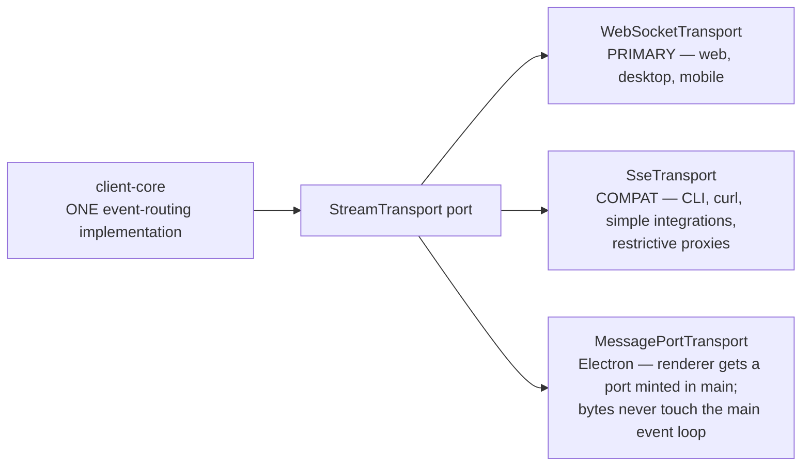

**WebSocket becomes primary. SSE is retained, not deleted.** The CLI keeps it. And on desktop we do better than both — a transferred `MessagePort`, which is what VS Code does so that terminal bytes and agent tokens never traverse the main process's event loop.

---

# PART B — Plan status after the last three corrections

You asked me to analyse the final plan. **It is coherent, but three items are now internally inconsistent** because of findings in the provider analysis. These need fixing before implementation starts.

| # | Location | Says | Now known | Action |
|---|---|---|---|---|
| **B1** | Master plan §3.2 protocol table; §3.6 "*we adopt ACP's client-provided terminal capability*"; ACP doc §A.3 | Desktop terminal ownership inverts onto ACP's `terminal/*` | **ACP v2 removes all five `terminal/*` and both `fs/*` methods.** Both serious ACP clients audited (t3code, KiroCrew) hardcode `terminal: false, fs: false` | **Strike the ACP terminal claim.** W14 (our own PTY Host) is unchanged and remains correct. If we ever expose our terminal to an agent, use an **MCP server** |
| **B2** | W11 acceptance: "*Claude Code and Codex run as providers with no vendor-specific adapter code*" | ACP replaces the vendor adapters | ACP cannot gate every tool call on Claude (`canUseTool` fires only on permission fall-through; hooks are function-valued and cannot cross JSON-RPC), and Copilot's ACP mode makes tool filtering **server-global** | **Re-scope W11 to breadth only.** Claude/Copilot/Codex/OpenCode stay on vendor surfaces. Add W11-c (Codex app-server) and W11-d (OpenCode HTTP) |
| **B3** | §3.5 diagram shows `claude / codex / gemini via ACP` | Gemini is a target | **Gemini CLI stopped serving consumer tiers on 2026-06-18.** Successor `agy` is closed-source with no known programmatic surface | **Remove Gemini from the roadmap.** It costs nothing if it arrives via the ACP registry |

Everything else — the 15 laws, the stream spine, the persistence engine, the admission controller, the host split, the phase ordering — survives intact. **The corrections narrow the protocol's role; they do not change the architecture.**

---

# PART C — Modularity: package layering

The layering rule is a **prerequisite for the process split**, not a cleanup task (W33). Nothing can move out of process while shared code imports Express, Electron, or the database driver.

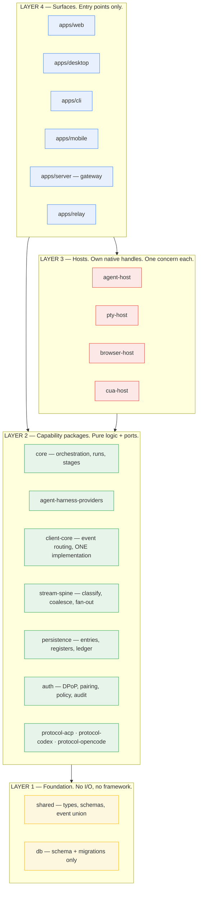

**Enforced by lint, not convention:**

| Rule | Rationale |
|---|---|
| Layer 1 and 2 may not import Express, Electron, `better-sqlite3`, or `node-pty` | Otherwise the same service cannot run in the gateway, in a host, and in a unit test |
| Layer 2 depends on **ports**; implementations are injected at the composition root | W33: "the core never branches on which implementation is loaded" |
| Layer 3 hosts may not import each other | A browser bug cannot take down terminals |
| Every surface consumes `client-core` — **no surface owns event routing** | L10 "one core, N surfaces, one contract". Mobile is already the reference implementation and gets **promoted, not rewritten** |
| Protocol packages depend on **nothing but their schema** | Generated schemas (ACP, Codex app-server, OpenCode OpenAPI) stay diffable in CI |

---

# PART D — Process topology

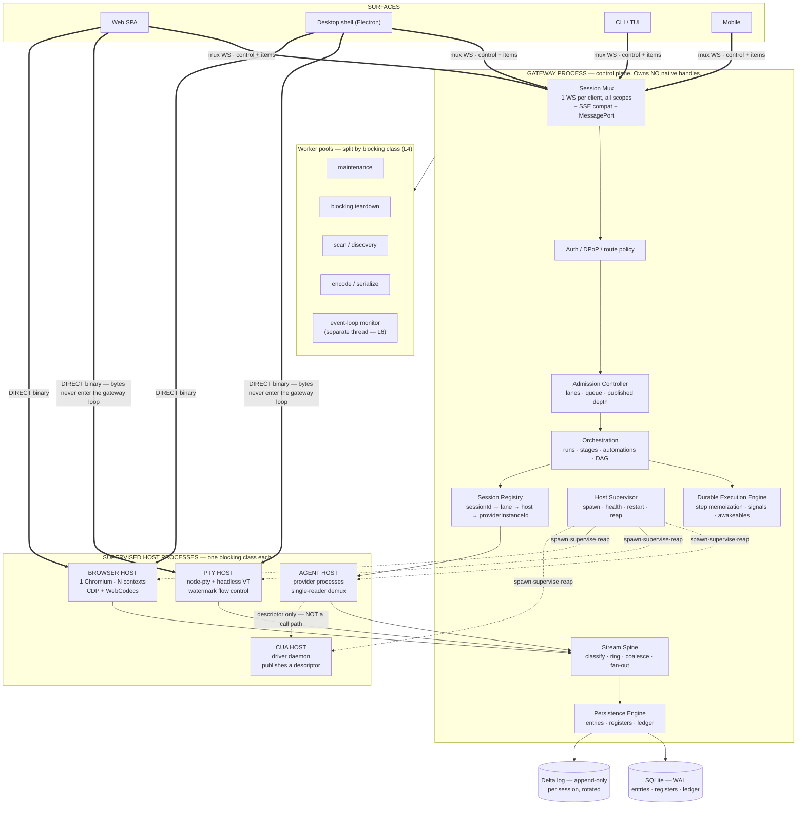

**Three invariants make this design work:**

1. **The gateway is a router and a bookkeeper.** It never holds a PTY handle, a browser page, a driver connection or a provider stdio pipe (Law **L5**).
2. **Terminal bytes and video frames go client ↔ host directly.** The gateway authorises the connection and then leaves the data path. On desktop this is a transferred `MessagePort`; on a server it is a dedicated socket handed off after authorisation.
3. **The computer-use host is reachable by the *agent*, not by the gateway.** The gateway reads a descriptor file and passes the spawn contract verbatim. **Our server is not on the action path at all** — no server hop, no DB write per click.

---

# PART E — End-to-end control flow

## E.1 A chat turn, client → provider → client

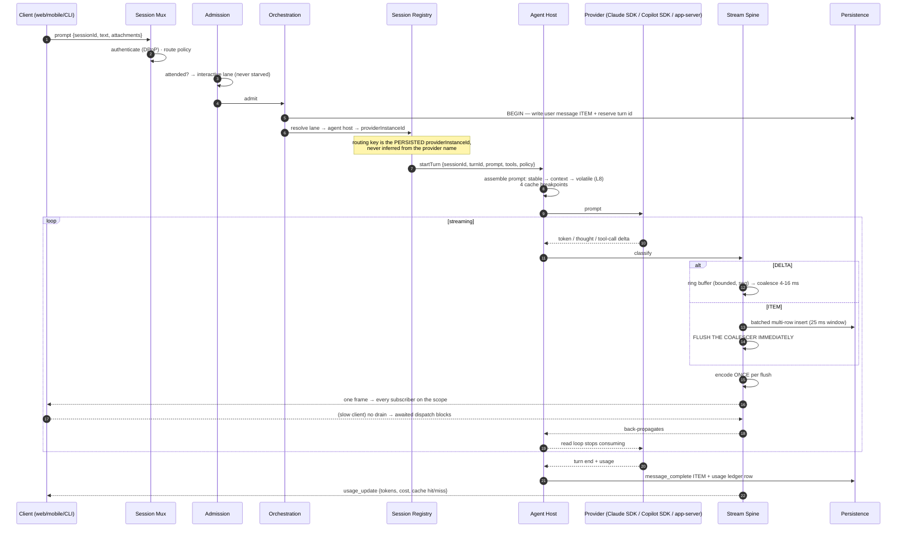

**The critical property:** at step 12 the backpressure chain is *continuous* — a slow client stops the provider read loop. Today it does not, and we buffer ~400 KB in-process instead.

## E.2 A tool call requiring approval

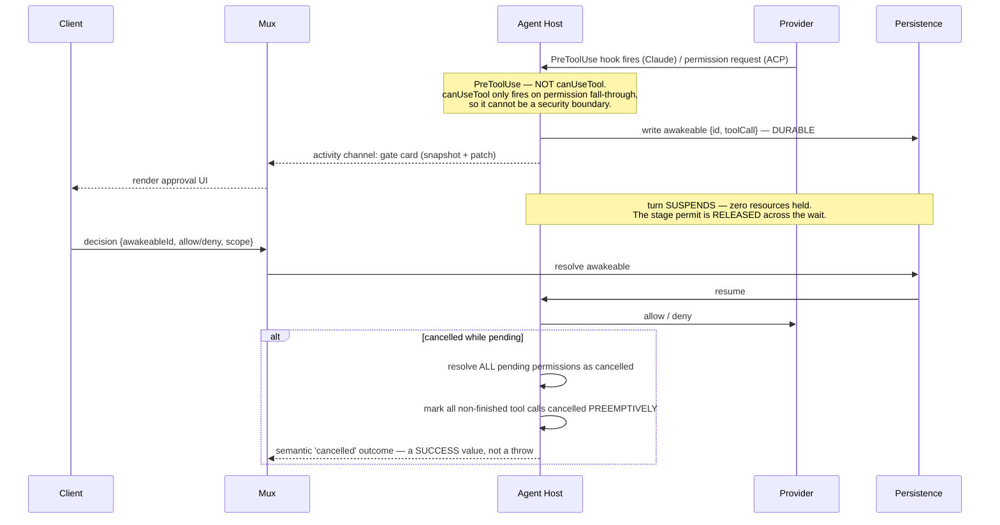

Two details that come straight from the research and are easy to get wrong:

- **Settle pending approvals *before* cancelling.** t3code's cancel path resolves every pending approval as "cancel" and every pending user-input as `{}` *first* — otherwise the RPC handler blocked on that promise deadlocks forever.
- **A cancel always produces a terminal event.** If the provider never acknowledges within the grace budget, KiroCrew synthesises `stop_reason: "error: cancel unacked"` rather than killing a shared process.

---

# PART F — Server components

| Component | Owns | Never does |
|---|---|---|
| **Session Mux** | One WS per client; scope subscription; frame encode/decode; `hello{cursor, resumed}`; heartbeat | Business logic; touch the DB |
| **Auth** | Ed25519/ES256 JWS, DPoP sender-constrained tokens + nonce anti-replay, device pairing, route policy, hash-chained audit | *(already built and sound — see the ACP/security doc)* |
| **Admission Controller** | `attended` predicate → lanes; queue for unattended work (cap 4, ceiling 16, wait 1800 s); publish `{cap, running, waiting}`; dynamic sizing with the **active bound logged** | Reject agent work (queue it — a rejected turn loses its context; a queued one just starts late) |
| **Orchestration** | Runs, stages, DAG frontier (incremental, not re-hashed per completion), automations, orchestrator waves | Hold native handles |
| **Durable Execution Engine** | Step memoization; Signal (steering) / Awakeable (approval) / workflow promise; suspension; all automation iterations written up front and claimed atomically | Journal token streams — **stage boundaries only** |
| **Stream Spine** | Classify delta vs item; per-scope ring buffer; coalescer; encode-once; bounded per-client queues; lane drop policy | Persist deltas per token |
| **Persistence Engine** | Entries (append-only), Registers (typed cells), Usage Ledger; one atomic transaction primitive | Hold a lock across an `await` on external work |
| **Host Supervisor** | Spawn, health, restart caps with a **conditional** predicate, boot-time reaper, process-tree kill | Sit on any host's data path |
| **Session Registry** | `sessionId → lane → host → providerInstanceId` | Infer the provider from a name |
| **Event-loop monitor** | Runs on a **separate thread** so it survives main-thread starvation (Law **L6**) | Live inside the loop it watches |

---

# PART G — Persistence

## G.1 Three stores, one write primitive

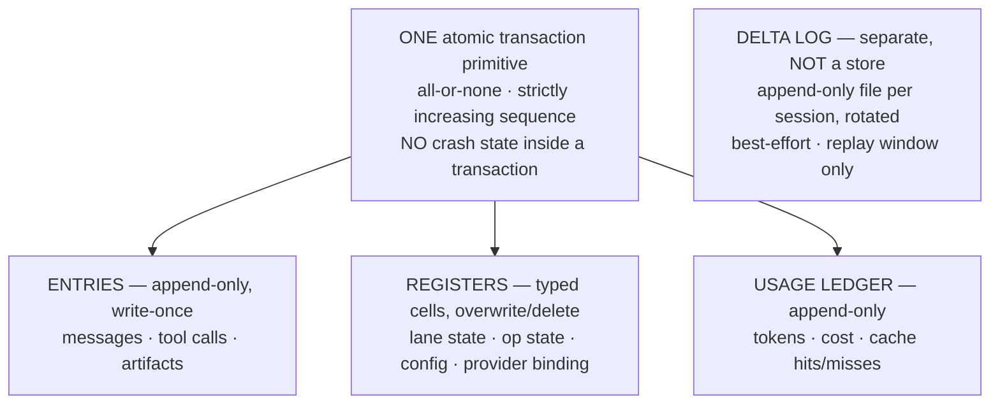

**The change that matters most:** today `stream_cursors` holds 2.30 M rows / 893 MB and `events` 1.19 M rows / 531 MB — **81% of a 1,759 MB database is token log**, while `chat_messages` is only 6,922 rows. Law **L1** — *tokens are transport, not storage* — deletes that category of write entirely.

| Class | Where | Replay | Loss policy |
|---|---|---|---|
| **Delta** — token, thought, tool stdout, frame, terminal bytes | Append-only file, batched, best-effort | Bounded window (1,000 events/scope) | **Droppable** on bulk lanes, with a visible gap marker |
| **Item** — `message_complete`, tool call, lifecycle, artifact, usage | SQLite, batched multi-row insert (25 ms) | Full | **Never dropped** — the producer blocks instead |

A reconnecting client gets **the last durable item snapshot + a bounded delta replay window**. Anything older is gone by design. Unbounded replay *"has OOM-killed servers on large databases"* — that is a direct quote from one of the reference implementations.

## G.2 Crash recovery

- **The durable program counter.** After each step, one register (`op.state/{operationId}`) is overwritten with the **complete** current state. Recovery reads it and switches. It never infers position from what is missing (Law **L12**).
- **The effect sandwich.** Commit intent *including reserving the output ids* → perform the uncertain effect → commit settlement. On restart, an operation stuck at "effect pending" gets a synthetic result written **under the id reserved in the intent** — so every tool call has a result and nothing runs twice.
- **Per-tool replay policy.** `replay: "never"` for terminal commands, computer-use actions, file writes, git, HTTP POST. `replay: "safe"` for reads, greps, window lists, page snapshots.
- **Torn-tail repair.** A parse error on the *last line only* of an append-only file is an unacknowledged partial write → rewrite the valid prefix via temp-file-and-rename. A parse error anywhere else is fatal.
- **Corruption is a closed enum** — states the single-writer protocol cannot produce are **rejected, not repaired**.
- **Fenced writer lease**, because Electron main, the CLI and the mobile relay can all touch one database: claim by incrementing a fence, steal only an *expired* lease, renewal asserts exactly one row changed.

## G.3 Lanes — how N concurrent runs stay cheap

A lane is **three registers** (`lane.leaf`, `lane.config`, `lane.state`) and owns **at most one operation**. N concurrent runs over one session cost three registers each and **zero history duplication**. That is what makes "multiple workflows in one chat" and "background agents over shared history" affordable.

---

# PART H — The streaming pipeline and buffer handling

This is the component that replaces the path where **one token currently costs 12.8 SQL statements**.

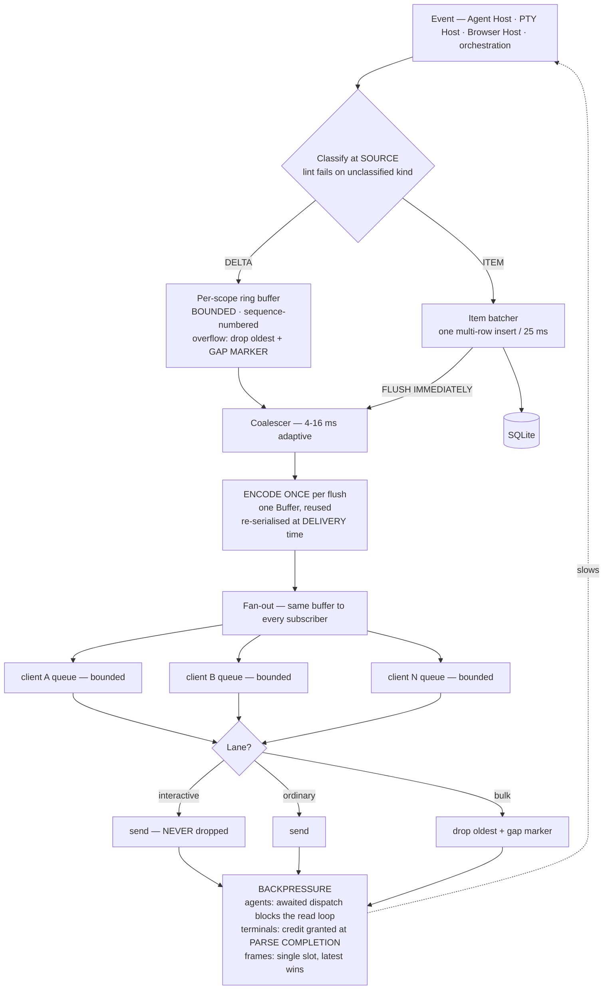

## H.1 Buffer rules — the concrete answers

| Rule | Why |
|---|---|
| **Encode once per flush, not once per subscriber.** One `Buffer`, fanned out by reference | Fixes `P1-10` — today we serialise per subscriber |
| **The trailing flush re-serialises at delivery time** | A coalesced frame must never be a *stale* frame |
| **Never `Buffer.concat` on the write path.** Where a byte buffer is genuinely needed, use a **string/chunk array with head removal** | Today's terminal path does `Buffer.concat` per chunk against producers hitting **0.8–4 GB/s** (`P0-23`) |
| **Scrollback is a headless terminal model, not a byte buffer** | Memory becomes **O(lines × columns)**, not O(bytes ever emitted) |
| **Flush the coalescer immediately on any item** | Never coalesce a text delta with a tool call, approval or lifecycle event — this preserves thinking↔text ordering *without* defeating the batcher |
| **Strip cumulative snapshots at the wire boundary only** | In-process listeners keep the free snapshot; anything crossing IPC/WS gets deltas only. Otherwise IPC bytes are O(n²) |
| **`JSON_PAYLOAD_MAX = 8 MB`, then stream** | A 50 MB payload is a 2-second event-loop stall |

## H.2 Wire framing on the mux

```
┌─────────┬───────────┬──────────┬───────────────────────────┐
│ kind:u8 │ scope:u32 │  seq:u32 │ payload                   │
└─────────┴───────────┴──────────┴───────────────────────────┘
  0x01 control    JSON   — subscribe, hello, ack, cancel, approval
  0x02 item       JSON   — durable, never dropped
  0x03 delta      JSON   — coalesced text/thought batch
  0x10 pty        BINARY — byte-for-byte, no transcoding
  0x11 video      BINARY — EncodedVideoChunk
```

`seq` is **scoped to the stream id**, so a cursor from a previous boot is *rejected* rather than used to replay a different run's frames.

## H.3 Backpressure — two mechanisms, chosen by producer

| Producer | Mechanism | Why this one |
|---|---|---|
| **Agent** | **Awaited sequential dispatch + a drain subscriber.** Listeners are awaited in order; one no-op subscriber awaits the slow sink's drain, so the agent loop blocks itself and stops consuming from the provider | ~15 lines, no protocol. We control the read loop |
| **PTY** | **Credit window, acknowledged at parse completion.** Pause above 100,000 chars, resume below 5,000, ack in 5,000-char batches from inside `onParsed` | The producer is an OS process we can actually pause. Acknowledging at *receipt* is the documented failure mode |
| **Browser frames** | **Single pending slot, latest wins**, acknowledge the *discarded* frame immediately so the browser keeps producing; drop when `encodeQueueSize > 2` | A stale frame has negative value |

**`PTY_LOW_WATERMARK` must be ≥ `PTY_ACK_BATCH`** or the terminal never unpauses. That constraint is why both are 5,000.

---

# PART I — Terminal processing

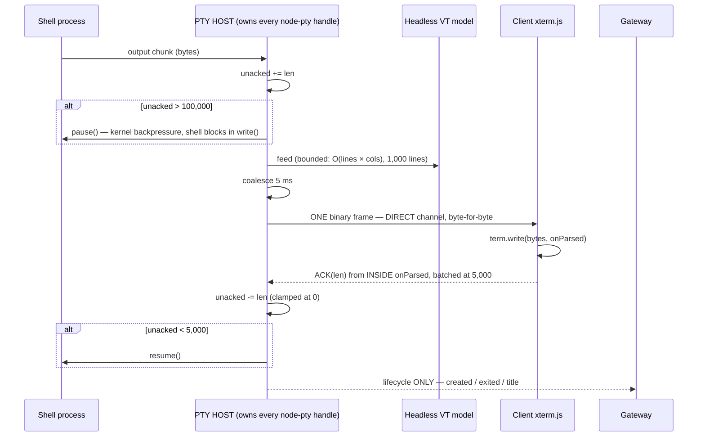

| Today | V2 |
|---|---|
| `Buffer.concat` per chunk, producers at 0.8–4 GB/s | Headless VT model; **no concatenation on the write path** |
| One socket send per chunk — 2,500 sends/s at 5 terminals. The docs describe a 4 ms/32 KB coalescer that **does not exist** | 5 ms coalescing window, one frame per window. The coalescer now exists |
| Watermark is **per connection** — two viewers fight over pause/resume | Watermark moves to the **session**; acks are per-session, not per-viewer |
| Idle timer keyed on **output** → immortal PTYs | Idle keyed on **client attachment**; corpses excluded from the cap |
| No restart survival | **Reconnect** (reload → reattach to the live process, replay serialised buffer) is distinguished from **revive** (host restart → relaunch with the original environment). Only sessions that produced output are serialised |
| Terminal load stutters chat | Bytes never enter the gateway loop |

> **Correction B1 applies here.** An earlier draft proposed inverting terminal ownership onto **ACP's client-provided terminal capability** on desktop. **ACP v2 deletes all five `terminal/*` methods.** We own the PTY Host end to end. The "agent-run and user-typed commands are the same terminal object" goal is still right — we achieve it in our own host, and if we ever need to expose it to an external agent, the v2-sanctioned route is an **MCP server**.

---

# PART J — Browser, computer use, and parallel processes

## J.1 Browser Host

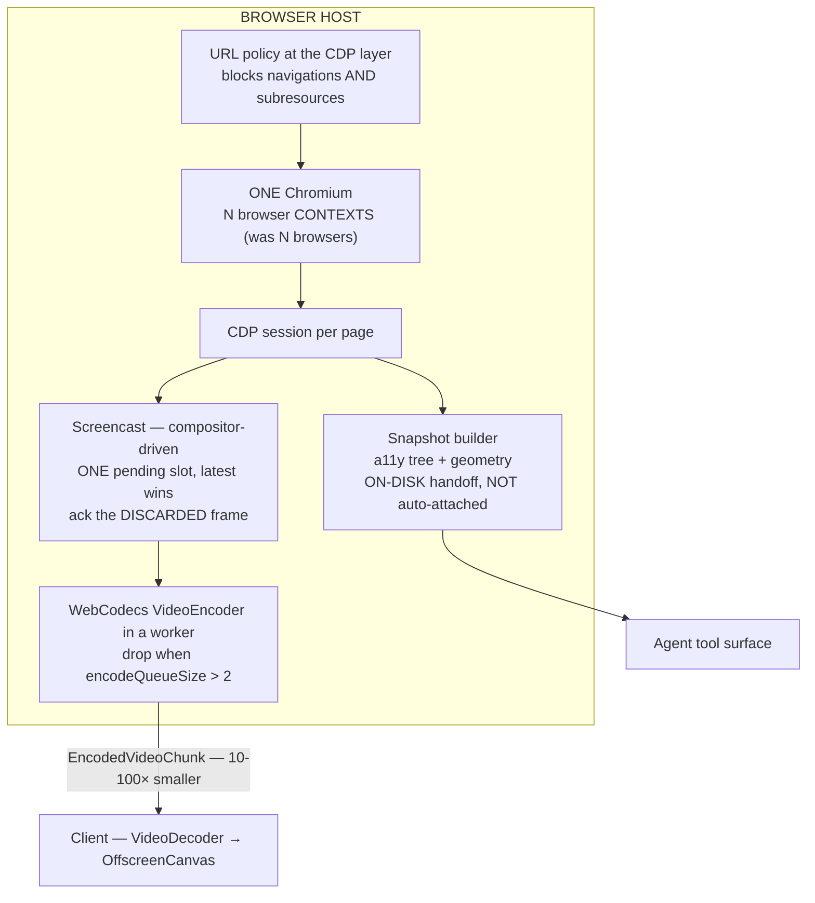

**One Chromium with N contexts instead of N browsers is the largest single memory win available — 1.5–2.5 GB.** Everything that appeared to require separate browsers (profile isolation, permissions, request routing, init scripts, cookies, CDP sessions) is a **per-context** API.

Also fixed: the `stop()` deadlock that leaks the tree; the idle sweeper that kills a browser you are actively watching; the **120 ms hardcoded sleep after every click** (Ctrl+Shift+P is currently 7 sequential round trips); three contradictory frame clamps collapsed to one; the concurrent JPEG-polling path deleted and `supportsScreencast` **declared** rather than discovered by exception.

## J.2 Computer-Use Host — the gateway leaves the path

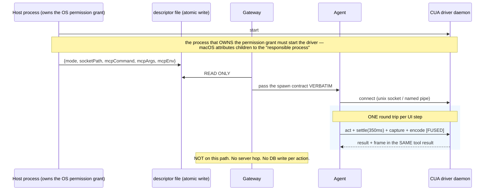

Today one click costs 3–4 driver round trips, a full-screen PNG **written to disk**, an artifact row, an audit row and an event emit — **1–3 MB written per click** — with the driver running **in-process on Windows** on the same 4-slot pool as all file I/O. Fusing act+observe *"halves the model inferences per UI step."*

Plus: frame integrity validated by **terminator and byte length**, not just the magic number (a truncated JPEG has a valid header and renders as a grey half-frame); duplicate frames suppressed by hashing the **canonical full frame before cropping**, with a response that explicitly tells the agent **not to retry**; and the **official computer tool type** so prompt-injection classifiers run — they *"add approximately zero latency and no cost"* and **do not run on custom tool definitions**.

## J.3 Parallel processes — pools split by blocking class

Law **L4**: *the pool that recovers from a wedge must never be the pool that wedges.*

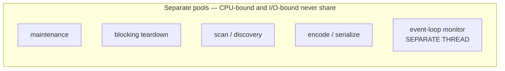

A CPU-bound worker only progresses when scheduled — 5 workers on 4 cores is pure overhead — while I/O workers progress while descheduled. Today a 1,200-element accessibility scan blocks 25% of the file-I/O pool.

**Concurrency control** is the Admission Controller: one predicate (`attended`) splits interactive from queued. Human-watched turns bypass the cap entirely; unattended work queues with a **separate 1800 s queue timeout** so a long wait is not misattributed to the turn's own budget, and depth is **published** — *"the difference between 'the fleet is throttled' and 'a worker is hung'."*

---

# PART K — Protocol matrix

| Boundary | Protocol | Notes |
|---|---|---|
| Client ↔ Gateway | **WebSocket mux** (primary) · SSE (compat) · MessagePort (Electron) | One connection, all scopes, binary + JSON |
| Gateway ↔ Hosts | JSON-RPC over stdio/socket | Control only |
| Client ↔ PTY / Browser Host | **Direct binary channel** | Authorised by the gateway, then the gateway leaves |
| Gateway → **Claude** | **`@anthropic-ai/claude-agent-sdk`** | Only path to `PreToolUse` gate-everything, in-process MCP, `sessionStore`, budget caps |
| Gateway → **Copilot** | **`@github/copilot-sdk`** via `forTcp()`/`forUri()` | Out-of-process, re-attachable runtime — the direct fix for one-CLI-per-server |
| Gateway → **Codex** | **`codex app-server`** JSON-RPC, types generated from the pinned binary | `codex proto` was deleted. Implement `-32001` backoff |
| Gateway → **OpenCode** | **`opencode serve`** HTTP+SSE, client generated from OpenAPI 3.1 at `/doc` | Strict superset of its own ACP mode |
| Gateway → **~45 other agents** | **One generic ACP client** | Breadth tier. Accept the subset |
| GeneratorAI **as** an agent | **ACP inbound** (W10) | Zed / JetBrains can drive us |
| Agent ↔ tools | **MCP** | Also the ACP-v2-sanctioned way to expose our terminal/FS |
| Run/task data model | **A2A *concepts*** — task immutability, `contextId`, `referenceTaskIds`, artifacts ≠ messages | The **concepts**, not the wire. A2A itself is rejected as a transport |
| Surface event vocabulary | **AG-UI** | Activity channel for gate cards and stage progress |

**Internally we keep an ACP-shaped event vocabulary with a `raw{source, method, payload}` passthrough on every event** — so vendor-SDK depth survives normalisation and the ACP breadth tier is a decoder rather than a rewrite.

---

# PART L — Multi-client connectivity

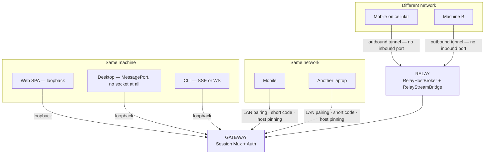

**Four paths, one auth model.** All of this already exists and is sound — Ed25519/ES256 JWS, **DPoP sender-constrained tokens** with nonce anti-replay, device pairing grants (create → preview → complete), platform-default scopes, route policy, hash-chained audit.

| Path | Mechanism |
|---|---|
| **Loopback** | Origin-checked, no pairing |
| **LAN** | Device pairing → **short numeric code** shown on the host, entered on the client → DPoP-bound token scoped to that device |
| **Remote (machine A ↔ machine B)** | The host dials **out** to the relay; the client dials out too. **No inbound port, no firewall change.** The relay brokers by pairing id and bridges the stream. It sees ciphertext framing, not application secrets |
| **Desktop** | MessagePort — the fastest path and the only one with no socket |

**Why one WebSocket mux matters more here than anywhere else.** Over a relay, connection setup is expensive and mobile networks drop connections constantly. Seven SSE connections × TLS handshake × relay brokering is a bad mobile experience. **One connection with `hello{cursor, resumed}` re-establishes the whole session state in one round trip.**

**Capability honesty across surfaces (W29).** A `TransportCapabilities` ledger per surface — `maxMessageChars`, `maxButtons`, `streaming`, `edit`, `supportsProactiveSend`, `supportsSessionResume` — each classified **ENFORCED** or **ASPIRATIONAL**, with a test that fails when a new field is left unclassified, and defaults set to the most restrictive surface. Mobile already solves 16 ms de-duplication that web does not; under L10 it gets **promoted to the reference implementation, not rewritten**.

---

# Summary

**Why WebSocket:** we are already past the browser's 6-connection limit and starving REST behind streams; the control plane needs a client→server return path (acks, approvals, cancellation, steering, input) that SSE structurally cannot provide; our backpressure is currently fake and cannot be fixed over SSE; and terminal bytes plus video need binary frames. **SSE is retained as a compatibility implementation behind a `StreamTransport` port, not deleted.**

**The architecture in one line:** a control-plane gateway that owns no native handles, four supervised hosts that own one blocking class each, a stream spine that separates droppable transport from durable items, and a persistence engine with a durable program counter — with clients talking to hosts *directly* for bytes and to the gateway only for control.

**Three plan corrections to apply before implementation:** strike the ACP terminal-capability claim (v2 deletes it), re-scope W11 to breadth-only (vendor SDKs stay for Claude/Copilot/Codex/OpenCode), and remove Gemini CLI from the roadmap.
