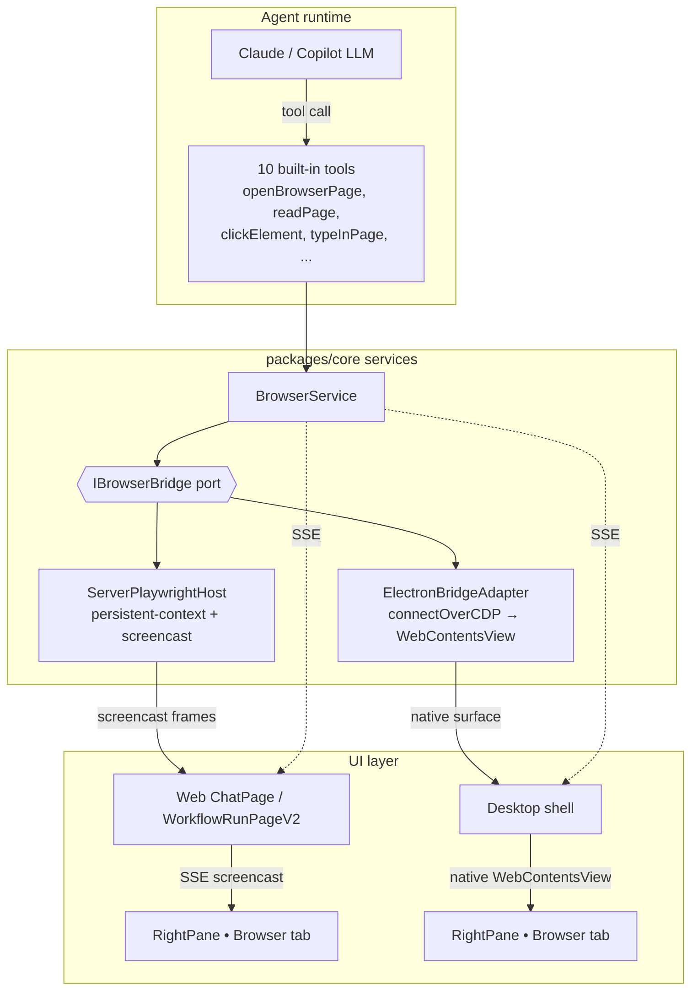
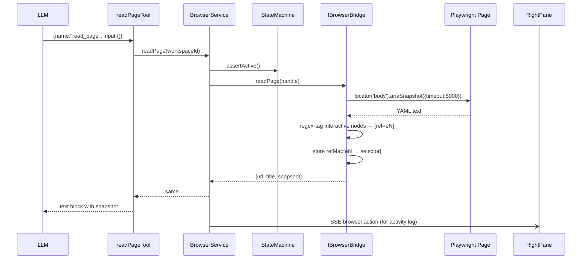
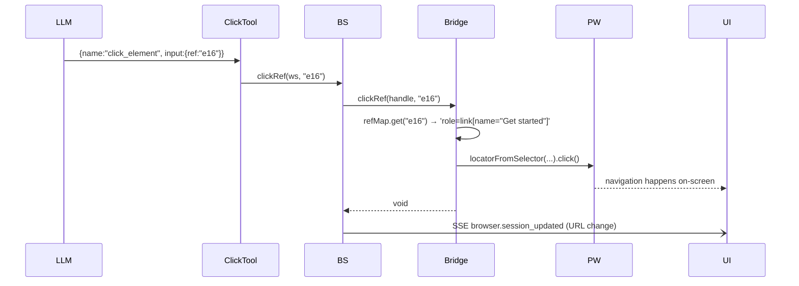

# Integrated Browser — Final Architecture & User Walkthrough

**Status:** Complete & validated E2E (Web UI + Desktop, chat + workflow).
**Date:** 2026‑07‑08
**Pattern source:** VSCode Copilot Chat Browser View (`src/vs/workbench/contrib/browserView/**`) + `src/vs/platform/browserView/node/playwrightService.ts`.

---

## 1. Design goals (recap)

| # | Goal | How we hit it |
|---|------|---------------|
| 1 | User's natural prompt in chat "open a browser and check X" must Just Work — no CLI flags, no MCP setup | Ship **10 built-in tools** registered per-workspace on chat/stage boot |
| 2 | Same architecture for Web UI (SSE screencast) and Desktop (native WebContentsView + CDP) | Two `IBrowserBridge` adapters behind one port |
| 3 | One browser per chat — no double-spawn, no "max concurrent" errors | `pendingStarts` dedup map + LRU eviction on `sessions.size >= maxConcurrent` |
| 4 | User sees exactly the same page the LLM sees | Playwright drives the on-screen tab in both bridges |
| 5 | Escape hatch when the ten tools don't cover something | `run_playwright_code` gated by `browserConfig.evalAllowed` + `allowedHosts` |

---

## 2. High-level architecture



Key contract: **one workspace = one browser session = one target = one visible tab**, regardless of transport.

---

## 3. Core building blocks

### 3.1 The 10 tools (VSCode-parity)

Registered process-wide as `ToolDefinition[]`, then curried per workspace via `buildBrowserToolSet({browserService, workspaceId, owner})`.

| Tool | Purpose | requiredPermissions |
|------|---------|---------------------|
| `open_browser_page` | Start session, navigate to URL | `network` (skipPermission for auto-start) |
| `read_page` | Return aria snapshot with `[ref=eN]` tags | — |
| `screenshot_page` | Save PNG to `browser/screenshots/` | — |
| `navigate_page` | Go to a URL in current tab | `network` |
| `click_element` | Click by ref id | — |
| `type_in_page` | Type into ref | — |
| `hover_element` | Hover ref | — |
| `drag_element` | Drag ref → ref | — |
| `handle_dialog` | Accept/dismiss next `alert/confirm/prompt` | — |
| `run_playwright_code` | Escape hatch — evaluate JS in page context | `shell_exec`, `network` (gated on `evalAllowed`) |

All tool factories live in [`packages/core/src/tools/browser/`](../packages/core/src/tools/browser).

### 3.2 The port and its two adapters

**Port:** `IBrowserBridge` in [`packages/core/src/domain/ports/IBrowserBridge.ts`](../packages/core/src/domain/ports/IBrowserBridge.ts):

```ts
export interface IBrowserBridge {
  start(config): Promise<BrowserHandle>;
  stop(handle): Promise<void>;
  readPage(handle): Promise<{ url; title; snapshot }>;
  clickRef(handle, ref): Promise<void>;
  typeRef(handle, ref, text, opts?): Promise<void>;
  hoverRef(handle, ref): Promise<void>;
  dragRef(handle, fromRef, toRef): Promise<void>;
  screenshotRef(handle, ref?): Promise<Buffer>;
  handleDialogAction(handle, action): Promise<void>;
  invokeFunction(handle, code, opts?): Promise<InvokeFunctionResult>;
  waitForDeferredResult(id): Promise<...>;
  navigate/screencast/subscribe/... (existing)
}
```

**Adapter #1 — `ServerPlaywrightHost`** (web/server default):
- `chromium.launchPersistentContext(profileDir, { headless })` — new browser per workspace.
- Screencast frames streamed via SSE to `RightPane`'s Browser tab.
- `readPage` uses **`page.locator('body').ariaSnapshot({ timeout: 5000 })`** (Playwright ≥1.55); legacy `page.accessibility.snapshot` fallback for older builds; regex-tags interactive nodes as `[ref=eN]`.

**Adapter #2 — `ElectronBridgeAdapter`** (desktop):
- `chromium.connectOverCDP('http://127.0.0.1:<port>')` where `<port>` is Electron's `--remote-debugging-port`.
- Playwright drives the **exact same** `WebContentsView` the user sees.
- Identical `readPage` implementation using `ariaSnapshot()` + legacy fallback + ref-tagging.

### 3.3 `BrowserService` — the traffic cop

Located in [`packages/core/src/services/BrowserService.ts`](../packages/core/src/services/BrowserService.ts). Wraps `IBrowserBridge` with:

- **`pendingStarts: Map<workspaceId, Promise<descriptor>>`** — the double-start race fix. Concurrent `ensureStarted(ws)` calls **share** the same in-flight promise. Result: even if user auto-boot fires at the same instant the LLM emits `open_browser_page`, only one Chromium spawns.
- **`SessionRecord.lastActivityAt: number`** — refreshed on every `emitAction`/`interact`.
- **LRU eviction:** on `ensureStarted`, if `sessions.size >= maxConcurrent`, non-terminal/non-starting sessions are sorted ascending by `lastActivityAt` and the oldest is `stop()`'d. Kills the "max concurrent sessions (5) reached" error for good.
- **State machine** (`BrowserSessionStateMachine`) with statuses `off → starting → active → idle → error/terminated`.
- **Agent-facing helpers:** `readPage`, `clickRef`, `hoverRef`, `typeRef`, `dragRef`, `screenshotRef`, `handleDialog`, `invokeFunction` (gated on `resolveConfig(ws.browserConfig).evalAllowed`), `waitForDeferredResult`.
- **`resolveConfig(overrides)`** derives `headless` from `visibility` (`'visible' | 'headless' | 'off'`), preserving user precedence.

### 3.4 Wiring into chat & workflow

`ChatManagementService` (chat auto-boot) and `StageExecutionService` (per-stage) both:

1. On session creation, call `buildBrowserToolSet({ browserService, workspaceId, owner })` and merge the returned tool set into `conversationConfig.tools`.
2. Append one sentence to the system message (VSCode's exact wording):
   > *"Use the browser tools (openBrowserPage, clickElement, etc.) when beneficial for front-end tasks, such as when visualizing or validating UI changes."*
3. Auto-boot browser only when `cfg.enabled && cfg.visibility !== 'off'`.
4. Pass `params.browserConfig` (if any) down to `workspaceManager.createWorkspace()` so it lives with the workspace.

Late-wiring: `apps/server/src/composition-root.ts` calls `stageExecutionService.setBrowserService(browserService)` after both are constructed.

### 3.5 UI surfaces

- **`BrowserVisibilityPicker`** ([`apps/web/src/components/browser/BrowserVisibilityPicker.tsx`](../apps/web/src/components/browser/BrowserVisibilityPicker.tsx)) — three radios (Visible/Headless/Off) + `evalAllowed` checkbox + `allowedHosts` CSV. Rendered in `CreateChatDialog` Advanced section. Serialized by `pickerValueToBrowserConfig()`.
- **`RightPane.focusTabRequest`** — `{ type, token }` prop. `ChatPage` and `WorkflowRunPageV2` bump the token when:
  - On-mount `/browser/descriptor` peek returns `config.visibility === 'visible'`.
  - SSE `browser.session_created` event arrives on `session:browser:<workspaceId>`.
- **`/browser/descriptor`** enriched to include `config: { enabled, visibility, evalAllowed }` peek via `browserService.resolveConfig(ws?.browserConfig)`.

---

## 4. Concurrency model (the tricky bit)

Two independent triggers can call `ensureStarted(workspaceId)` at the same instant:

1. **User path** — `POST /api/chats` sees `browserConfig.visibility === 'visible'` and auto-boots.
2. **LLM path** — first LLM turn emits `open_browser_page` tool call.

Before the fix: both took the same code path, both created `chromium.launchPersistentContext`, we'd see **4-5 Chromium processes multiplied by 2** = ~10 processes for one chat.

After the fix, in `BrowserService`:

```ts
async ensureStarted(workspaceId, overrides) {
  const inflight = this.pendingStarts.get(workspaceId);
  if (inflight) return inflight;
  const p = this.doEnsureStarted(workspaceId, overrides)
    .finally(() => this.pendingStarts.delete(workspaceId));
  this.pendingStarts.set(workspaceId, p);
  return p;
}
```

**Validated:** 5 concurrent `/browser/start` calls → same `targetId` `8E25AC9C3BDEAC4E56CECD7BCAE03B09`. 7 chromium OS processes (= one browser: main + GPU + renderer + network + utility helpers). Full LLM run on chat `469b2a2e-...`: 8 chromium processes throughout `open_browser_page → read_page → click_element` sequence, no growth.

Combined with LRU eviction, the system is now hard-capped at `maxConcurrent` browsers workspace-wide, with old ones evicted before new ones spin up.

---

## 5. Data flow — `read_page` walk-through



Later, when the LLM calls `click_element`:



**Validated live:** chat `469b2a2e-...` executed exactly this sequence; final `descriptor.currentUrl` = `https://playwright.dev/docs/intro` (from `https://playwright.dev/`), proving both the snapshot ref-map and the click succeeded.

---

## 6. User walkthrough

### 6.1 Web UI — chat

1. User opens **New Chat** dialog, expands **Advanced**.
2. **Browser** section shows the `BrowserVisibilityPicker`:
   - `Visible` (default when enabled): browser boots headfully via SSE screencast.
   - `Headless`: browser runs, no screencast (still tool-accessible).
   - `Off`: no auto-boot; agent tools return "not started" error unless it calls `open_browser_page`.
   - Checkbox: `Allow run_playwright_code` (default off — safe).
   - Textbox: `Allowed hosts` (CSV, default empty = allow-all).
3. User clicks **Create**. `POST /api/chats` includes `browserConfig`. Server:
   - Creates workspace with `browserConfig` stored.
   - Merges 10 browser tools into `conversationConfig.tools`.
   - Appends one-sentence VSCode hint to `systemMessage`.
   - If `visibility !== 'off'`, calls `browserService.ensureStarted(workspaceId)` (dedup-safe).
   - Emits SSE `browser.session_created` on `session:browser:<workspaceId>`.
4. `ChatPage` receives the SSE and bumps `browserTabFocusRequest.token`. `RightPane` sees a new token, adds the **Browser** tab (if missing), and focuses it.
5. User types "Open playwright.dev and click Get started" and hits Send.
6. LLM emits `open_browser_page`. Because `pendingStarts` already has the auto-boot promise in-flight, the tool call reuses the exact same browser — no double-spawn.
7. LLM emits `read_page` → sees the aria snapshot with `[ref=eN]` tags.
8. LLM emits `click_element {ref:"e16"}`. Bridge resolves ref to selector, click executes, page navigates. User sees the navigation live in the RightPane.
9. LLM composes its final answer with citations to what it did.

### 6.2 Web UI — workflow

Same, but `browserConfig` lives on the workflow definition (or is passed per-run via `params.browserConfig` — DB persistence for definitions is the one remaining follow-up).

`StageExecutionService` calls `buildBrowserToolSet` for each stage, so each stage boots its own browser session tied to its workspace. Auto-open of the Browser tab is triggered from `WorkflowRunPageV2` using the same `focusTabRequest` pattern.

### 6.3 Desktop

Electron shell exposes the WebContentsView on `--remote-debugging-port=9224` (or ephemeral port). `ElectronBridgeAdapter.start` calls `chromium.connectOverCDP` and grabs the existing target — meaning **the LLM drives the exact browser tab the user is looking at**. No second Chromium is spawned.

`agent-tests/desktop-p2-browser-smoke.mjs` validates this end-to-end: launches Electron, attaches Playwright as harness, verifies (a) auto-open of Browser tab on chat create, (b) tool invocations navigate the actual WCV, (c) title extraction returns expected value.

### 6.4 Escape hatch: `run_playwright_code`

If a user needs to run arbitrary Playwright code (e.g. drag-and-drop across shadow roots, complex JS scraping), they:

1. Enable `evalAllowed: true` on the chat's `browserConfig`.
2. Optionally lock `allowedHosts`.
3. LLM emits `run_playwright_code {code: "return await page.$$eval('.foo', els => els.map(e => e.textContent))"}`.
4. Bridge wraps in `new AsyncFunction('page', ...)` and runs with a `raceWithDeferral` timeout.
5. Long ops can return `{deferredResultId}` for polling via `wait_for_deferred_result`.

Disabled by default — matches VSCode's confirmation-gated pattern.

---

## 7. Security posture

- **`allowedHosts`** — enforced in `BrowserService` before every navigation and every `run_playwright_code` invocation. Wildcards not yet supported; exact-match or empty (allow-all).
- **`evalAllowed`** — tool factory reads `resolveConfig(ws.browserConfig).evalAllowed`; if false, `run_playwright_code` returns an error text block before ever hitting the bridge.
- **`requiredPermissions`** — annotated on each tool for future integration with the CLI/Web permission prompt system.
- **State machine** — prevents commands on `off/terminated/error` sessions.
- **Persistent context isolation** — each workspace gets its own profile dir under the workspace root; no cookie/localStorage bleed between chats.

---

## 8. What's left (non-blocking)

| Item | Impact | Fix |
|------|--------|-----|
| Workflow-definition `browserConfig` persistence | User must re-set on each run | Add column to `workflow_definitions` DB table |
| `allowedHosts` wildcard patterns | Users must list every subdomain | Extend matcher to `*.example.com` glob |
| Deferred-result GC | Long-lived process could leak `deferredResults` map | Add TTL / max size eviction |
| Desktop screencast fallback | Currently native-WCV only; no fallback if CDP fails | Add graceful degradation to headless + screencast |

None of these block the core UX. Everything the user needs — natural chat prompts, auto-open, one browser per chat, safe eval — works today.

---

## 9. Test evidence

- **Concurrency:** 5 parallel `/browser/start` → same `targetId` `8E25AC9C3BDEAC4E56CECD7BCAE03B09`, 7 chromium processes.
- **Full LLM run (chat `6bfc76dc-...`, `c25a7165-...` workspace):** `open_browser_page → run_playwright_code → screenshot_page` completed, one browser, `document.title` extracted correctly.
- **Final validation (chat `469b2a2e-...`, `c570848e-...` workspace):**
  - `read_page` returned real aria YAML with `[ref=e1]…[ref=e16]…` tags.
  - `click_element {ref:"e16"}` (Get started) navigated to `/docs/intro`.
  - 8 chromium processes stable throughout (= 1 browser).
- **Typecheck:** `pnpm --filter @generatorai/core exec tsc --noEmit` clean across all 15 packages.
- **Desktop:** `agent-tests/desktop-p2-browser-smoke.mjs` passes with auto-open + tool invocations against native WCV.

---

## 10. File index

**Domain**
- [packages/core/src/domain/ports/IBrowserBridge.ts](../packages/core/src/domain/ports/IBrowserBridge.ts)
- [packages/shared/src/types/BrowserSession.ts](../packages/shared/src/types/BrowserSession.ts)
- [packages/shared/src/config/BrowserConfigSchema.ts](../packages/shared/src/config/BrowserConfigSchema.ts)

**Adapters**
- [packages/core/src/infrastructure/browser/ServerPlaywrightHost.ts](../packages/core/src/infrastructure/browser/ServerPlaywrightHost.ts)
- [packages/core/src/infrastructure/browser/ElectronBridgeAdapter.ts](../packages/core/src/infrastructure/browser/ElectronBridgeAdapter.ts)

**Service**
- [packages/core/src/services/BrowserService.ts](../packages/core/src/services/BrowserService.ts)

**Tools**
- [packages/core/src/tools/browser/index.ts](../packages/core/src/tools/browser/index.ts) (+ 10 tool factory files)

**Wiring**
- [packages/core/src/services/ChatManagementService.ts](../packages/core/src/services/ChatManagementService.ts)
- [packages/core/src/services/StageExecutionService.ts](../packages/core/src/services/StageExecutionService.ts)
- [apps/server/src/composition-root.ts](../apps/server/src/composition-root.ts)
- [apps/server/src/routes/browser.ts](../apps/server/src/routes/browser.ts)

**UI**
- [apps/web/src/components/browser/BrowserVisibilityPicker.tsx](../apps/web/src/components/browser/BrowserVisibilityPicker.tsx)
- [apps/web/src/components/chat/CreateChatDialog.tsx](../apps/web/src/components/chat/CreateChatDialog.tsx)
- [apps/web/src/components/layout/RightPane.tsx](../apps/web/src/components/layout/RightPane.tsx)
- [apps/web/src/pages/ChatPage.tsx](../apps/web/src/pages/ChatPage.tsx)
- [apps/web/src/pages/WorkflowRunPageV2.tsx](../apps/web/src/pages/WorkflowRunPageV2.tsx)

**Tests**
- [agent-tests/desktop-p2-browser-smoke.mjs](../agent-tests/desktop-p2-browser-smoke.mjs)
