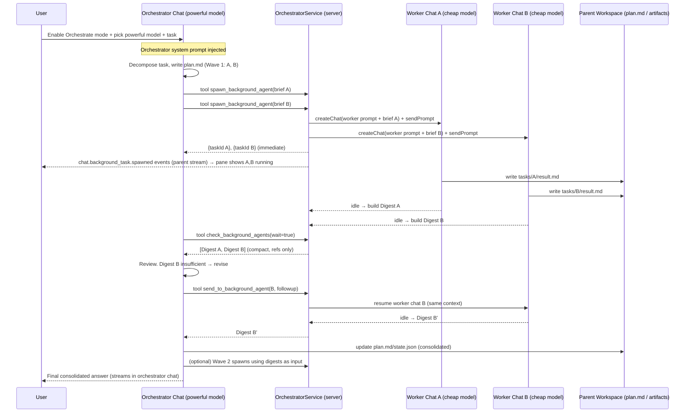

# Orchestrator Mode for Chat — Research, Evidence & End-to-End Implementation Plan

> **Status:** REVIEWED DRAFT (rev 2) — no production code has been written. This document is the analysis + plan you asked for. It has been **cross-checked against the live codebase** and revised for a **prompt-caching / context-repetition strategy** now woven throughout (see §5.8, §4, §9, and §12 for what changed and why).
> **Scope:** Add an **Orchestrator Mode** to the Chat feature. When enabled, a chat runs a powerful "lead" model that decomposes a task, spawns **background agent tasks** (each a real, isolated chat/session, possibly on a cheaper model) via a tool call, monitors/streams them in a right-pane panel, reviews their results, iterates with follow-ups until satisfied, and consolidates a final answer — all linked back to the originating chat for history.
> **Audience:** You (product owner) + the engineer who will implement this next.

---

## 0. TL;DR (read this first)

- **What we build:** An orchestrator chat gets one new capability — a `spawn_background_agent` tool (plus `check_background_agent`, `send_to_background_agent`, and `list_background_agents`). Each spawn creates a **native GeneratorAI Chat + Session + Workspace** (reusing 100% of the existing chat runtime) tagged as a *background task* linked to the parent. The orchestrator gets structured results back, reviews them, sends follow-ups, and consolidates.
- **Why native chats (not SDK in-process subagents):** Your requirements — *separate visible sessions, their own streaming pane, per-task model choice, history linkage, orchestrator-driven review loops* — map exactly to the existing Chat entity. The Claude/Copilot SDKs' built-in subagents run **inside one harness process** and only surface a final summary; they cannot give you independent, resumable, individually-streamed, persisted chat sessions. We reuse the SDK subagent *idea* but implement it on **your** chat primitives so it works identically on Copilot **and** Claude.
- **The critical part — context handoff:** We move context by **reference, not by copy**. The orchestrator writes a compact, self-contained *task brief* to each worker; workers write their full output to **workspace artifacts** and return only a **structured digest** (summary + artifact refs + status + follow-up hooks). This is the single most important cost/quality lever and is backed by Anthropic's published data (below).
- **The second cost lever — prompt caching (§5.8):** Spawning many workers repeats the same system-prompt + tool-definition prefix. But provider prompt caches are **org/workspace-scoped and matched by exact prefix hash**, so identical prefixes across workers *share* the cache: the repeated block is billed at full price **once** (a cache write) and at **~10% (0.1×) for every other worker** and every subsequent turn. Repetition is cheap; **prefix *divergence* is what's expensive.** We therefore make every worker's `tools + system` prefix **byte-identical** (one canonical worker prompt + deterministic tool serialization; the per-task brief goes in the *first user message*, never the system prompt), **sequence the first worker then fan out the rest** so the cache is warm before parallel workers hit it, and **batch same-model workers into a wave**. This flips "cache hit rate will be minimal" into "high by construction."
- **Evidence base:** Anthropic's multi-agent research system (orchestrator-worker; 90.2% > single-agent; token usage explains 80% of performance variance; multi-agent burns ~15× chat tokens; "subagent output to filesystem to minimize the game of telephone"), the Claude Agent SDK subagents doc (context isolation, parallelization, background execution, model-per-agent), the OpenAI Agents SDK orchestration guide (agents-as-tools vs handoffs), and the Anthropic + OpenAI **prompt-caching** docs (prefix-hash matching, org-scope sharing, 0.1× reads, warm-first-then-parallel). Full citations in §3.
- **Cost posture:** Model tiering (powerful orchestrator + cheap workers), reference-based handoff, **prefix-stable prompt caching**, hard budgets (max parallel workers, max review rounds, per-task token ceiling), and summary compaction keep this economically sane and *opt-in per chat*.

---

## 1. How GeneratorAI works today (the parts this feature touches)

This is a condensed map; the canonical source is [.github/AGENTS.md](../.github/AGENTS.md) and the per-feature docs it links.

### 1.1 The Chat execution object
- **One Chat ↔ one Session ↔ one harness conversation.** Optional project + up to 3–5 codebases + a per-run **Execution Workspace** (isolated filesystem + worktrees + artifacts).
- Table: `chats` (`packages/db/src/schema.ts`) with `sessionId`, `model`, `harnessConfig` (JSON), `projectId`, `workspaceId`, `codebaseIds`, `tags`, `status`.
- Service: [`ChatManagementService`](../packages/core/src/services/ChatManagementService.ts) — `createChat(params)`, `sendPrompt(chatId, prompt, attachments?)`. Everything the HTTP routes do, we can also do **server-side from a tool handler**.
- Live output is an **SSE stream**: `GET /api/stream?scope=chat&id=<chatId>` with `Last-Event-ID` resume + REST replay ([`apps/server/src/routes/stream.ts`](../apps/server/src/routes/stream.ts)). Scopes: `session | run | chat | global | automation`.

### 1.2 The harness abstraction & tools
- Every service talks to [`IAgentHarness`](../packages/core/src/domain/ports/IAgentHarness.ts). SDK types never leak out of `packages/agent-harness-providers/` (invariant #1).
- **`ToolDefinition { name, description, parametersSchema (JSON Schema), handler: (args) => Promise<unknown>, owner?, requiredPermissions?, skipPermission? }`** — adapters compile it to Copilot `defineTool()` or a Claude MCP tool at conversation-create time.
- **Tool handlers can call application services.** Proven pattern: [`buildBrowserToolSet({ browserService, workspaceId, owner })`](../packages/core/src/services/ChatManagementService.ts) at `ChatManagementService.ts:299` — the handlers close over `browserService`. We mirror this exactly with `buildOrchestratorToolSet({ orchestratorService, parentChatId, owner })`.
- Tools are injected via **`ChatManagementServiceExtensions`** (`ChatManagementService.ts:39`, wired in constructor at `:114`, e.g. `customToolRegistry`). This is our injection seam.

### 1.3 System prompt injection
- `harnessConfig.systemMessage: { mode: 'append' | 'replace', content }` (schema: [`ChatSchemas.ts`](../packages/shared/src/config/ChatSchemas.ts)), applied at `ChatManagementService.ts:244` (create) and `:640` (resume). Browser mode already **appends** a tool hint to the system message at `:324` — the exact template for conditionally injecting an **orchestrator system prompt** when a flag is on.

### 1.4 What already exists vs. what's missing
| Capability | Exists? | Notes |
|---|---|---|
| Create chat/session/workspace server-side | ✅ | `ChatManagementService.createChat/sendPrompt` |
| Service-injected tools with handlers | ✅ | `buildBrowserToolSet`, `customToolRegistry` |
| Per-chat model + system prompt | ✅ | `harnessConfig.model` / `.systemMessage` |
| Independent SSE stream per chat | ✅ | `scope=chat&id=<id>` |
| Provider-agnostic (Copilot + Claude) | ✅ | `HarnessProxy` |
| **Background-task chat concept + parent linkage** | ❌ | New: `parentChatId` + `backgroundTask` metadata |
| **Orchestrator tool set (spawn/check/send/list)** | ❌ | New |
| **Orchestrator system prompt** | ❌ | New |
| **Background Tasks right-pane panel** | ❌ | New UI (RightPane already supports tabs) |
| **Result digest / artifact-reference handoff** | ❌ | New (the critical piece) |
| Persistent task queue / concurrency governor | ⚠️ partial | Fire-and-forget exists; we add a lightweight in-proc governor |

**Key finding:** ~80% of the machinery already exists. This is mostly **orchestration glue + prompting + UI**, not new infrastructure. That is what makes it practical.

---

## 2. What you asked for, restated as requirements

1. **Opt-in per chat.** A toggle at chat creation → "Orchestrate mode". When on, the user picks a **powerful** model for the orchestrator, and the orchestrator system prompt is injected.
2. **Orchestrator decomposes** a task into granular chunks.
3. **Orchestrator spawns background agent tasks via a tool call**, choosing the **model per task** and passing task details. The app turns each tool call into a **new chat session** and shows it as a running background task.
4. **Multiple parallel** background tasks from the main chat.
5. **Background Tasks pane on the right**; clicking a task shows its **live streaming**; tasks are **linked to the origin chat** for history.
6. **Orchestrator consumes results, hands off to other workers, reviews, and sends follow-ups** until satisfied, then **consolidates**.
7. **Strong prompting** for both orchestrator and workers.
8. **CRITICAL: a well-researched context-handoff strategy** (summaries, not full context) to control token/cost and coordinate parallel + sequential agents.
9. **CRITICAL: a prompt-caching / context-repetition strategy** so that spawning multiple workers does not defeat provider prompt caches (repeated system + tool context) and inflate cost. Addressed in §5.8.

---

## 3. Research & evidence (why this design, backed by industry practice)

### 3.1 Anthropic — "How we built our multi-agent research system" (Jun 2025)
- **Architecture = orchestrator-worker.** A lead agent "coordinates the process while delegating to specialized subagents that operate in parallel," each with **its own context window**. → *This is exactly the shape you described.*
- **Performance:** multi-agent (Opus lead + Sonnet subagents) beat single-agent Opus by **90.2%** on their internal research eval. → *Justifies powerful orchestrator + cheaper workers.*
- **Why it works:** "token usage by itself explains **80%** of the variance" in performance; multi-agent "effectively scales token usage for tasks that exceed the limits of single agents." → *The value is parallel context capacity, not magic.*
- **Cost reality:** "agents typically use about **4× more tokens** than chat… multi-agent systems use about **15× more tokens** than chats… require tasks where the value is high enough." → *Justifies opt-in, model tiering, and hard budgets.*
- **Delegation prompting:** "Each subagent needs an **objective, an output format, guidance on tools/sources, and clear task boundaries**." Vague instructions cause duplicated work and gaps. → *Drives our structured task-brief schema (§5.3).*
- **Effort scaling:** embed explicit rules — "simple fact-finding = 1 agent, 3-10 tool calls; comparisons = 2-4 subagents; complex = 10+" to stop over-spawning. → *Drives our budget rules in the orchestrator prompt.*
- **Context survival:** the lead **saves its plan to memory** so a >200k-token context truncation doesn't lose it; agents "**summarize completed work phases and store essential information in external memory** before proceeding," and "spawn fresh subagents with clean contexts while maintaining continuity through **careful handoffs**." → *Drives our plan-file + digest strategy (§5).*
- **THE key handoff rule:** *"Subagent output to a filesystem to minimize the 'game of telephone.' … implement artifact systems where specialized agents create outputs that persist independently. Subagents call tools to store their work in external systems, then pass **lightweight references** back to the coordinator. This prevents information loss … and reduces token overhead from copying large outputs through conversation history."* → **This is the single most important citation for your CRITICAL requirement. We adopt it verbatim: workers write artifacts, return references.**
- **Coordination caveat:** their lead executes subagents **synchronously** today and notes async would add "challenges in result coordination, state consistency, and error propagation." → *We start synchronous-per-wave with async fan-out inside a wave (safest), and design for async later.*
- **Eval approach:** LLM-as-judge on a rubric; **end-state** evaluation over step-by-step; start with ~20 real queries. → *Drives our eval harness (§8).*

### 3.2 Anthropic — "Building effective agents" (Dec 2024)
- Defines the **Orchestrator-workers** workflow: "a central LLM dynamically breaks down tasks, delegates them to worker LLMs, and synthesizes their results," ideal when "you can't predict the subtasks needed" (explicitly citing **coding across multiple files**). → *Matches your use case; distinct from static parallelization because subtasks are decided at runtime.*
- **Evaluator-optimizer** workflow: one call generates, another critiques in a loop until criteria are met. → *This is your "orchestrator reviews and sends follow-ups until satisfied" requirement, as a named, proven pattern.*
- **Routing** ("route easy/common questions to smaller, cost-efficient models … and hard ones to more capable models"). → *Backs per-task model selection by the orchestrator.*
- Principle: keep it simple, prioritize transparency (show planning), and invest heavily in the **agent-computer interface (tool docs)**. → *Drives our tool-schema and prompt investment.*

### 3.3 Claude Agent SDK — "Subagents in the SDK"
- Confirms the primitive we're emulating: **context isolation** ("each subagent runs in its own fresh conversation. Intermediate tool calls and results stay inside the subagent; only its final message returns to the parent"), **parallelization**, **model override per agent**, **tool restrictions**, **background execution**, and **resume** (via `agentId`).
- **Crucial limitation for us:** *"A subagent's context window starts fresh… The only content you pass from parent to subagent is the Agent tool's prompt string, so include any file paths, error messages, or decisions the subagent needs directly in that prompt."* And the parent only ever sees the **final message**. → This is powerful but **in-process and invisible** — no separately persisted/streamed/resumable chat entity, no cross-provider parity (Copilot has its own `customAgents`). Your product needs *visible, clickable, historical* background chats, so **we implement the same semantics on GeneratorAI's own Chat primitive** and keep SDK subagents as an optional future optimization for cheap read-only fan-out.
- Confirms the handoff contract we should copy: **put everything the worker needs in the brief; get back one clean result.**

### 3.4 OpenAI — Agents SDK "Agent orchestration"
- Two canonical patterns: **Agents-as-tools** ("a manager agent keeps control of the conversation and calls specialist agents through `Agent.as_tool()`… you want one agent to own the final answer, combine outputs from multiple specialists") vs **Handoffs** ("a specialist becomes the active agent for the rest of the turn").
- → **We choose agents-as-tools** (manager/orchestrator owns the final answer and consolidation) because your spec says the orchestrator reviews and consolidates. Handoff (transfer of control) is explicitly *not* what you want.
- Reinforces: invest in prompts, run in a self-critique loop, prefer **specialized** agents over one generalist, and invest in evals.

### 3.5 Cross-platform synthesis (Claude "Cowork"/Research, Codex "Symphony"-style, OpenAI Swarm, LangGraph supervisor)
Every serious platform converges on the **same three invariants**, which we adopt:
1. **Orchestrator-worker topology** with a lead that plans, delegates, and synthesizes.
2. **Isolated worker context windows** + **reference-based result passing** (artifacts/memory) to avoid context explosion and the "game of telephone."
3. **Explicit delegation contracts** (objective / output format / boundaries / budget) + a **review/evaluator loop** with hard stopping conditions.

**Conclusion:** The design below is not novel guesswork — it is the industry-standard orchestrator-worker pattern, implemented on GeneratorAI's existing chat/session/workspace/streaming primitives, with the one non-negotiable cost lever (artifact-reference handoff) that Anthropic's data shows dominates both cost and quality.

### 3.6 Prompt-caching mechanics (Anthropic + OpenAI docs) — basis for §5.8
Both providers cache by **exact prompt-prefix hash**, in the order `tools → system → messages`, and the cache is **shared across requests within an org/workspace** (not limited to one conversation). Key facts we rely on:
- **Reads are ~0.1× base; writes are ~1.25× base (5-min TTL) / 2× (1-h TTL).** Anthropic: *"Cache read tokens are 0.1× the base input tokens price."* So the repeated worker prefix costs full price once, then 90% off for every other worker and every later turn.
- **A change at any level invalidates that level and everything after it.** Anthropic: *"modifying tool definitions (names, descriptions, parameters) invalidates the entire cache."* → tools + system must be byte-identical across workers; **the per-task brief must live in the first *user* message**, not the system prompt.
- **Warm-first-then-parallel is required for concurrent hits.** Anthropic, verbatim: *"a cache entry only becomes available after the first response begins. If you need cache hits for parallel requests, wait for the first response before sending subsequent requests."* → our concurrency governor spawns worker #1, waits for response-start (or pre-warms), then releases the rest.
- **Breakpoint must sit on the last *identical* block, not on the varying suffix** (the documented "common mistake"). The brief/timestamp/user turn is the varying suffix → the cacheable prefix ends *before* it.
- **Caches are model-specific and org/workspace-scoped**, matched exactly (100% identical prefix). → workers on the *same* model tier share a cache; scattering across many models fragments it (drives D12).
- **TTL:** default 5-min (Anthropic) / ~5–10-min in-memory (OpenAI); a wave longer than that should use Anthropic's **1-hour cache** or OpenAI/Codex **extended retention** (up to 24h on GPT-5/Codex models).
- **OpenAI-side (Copilot provider):** automatic caching for prompts ≥1024 tokens, prefix-hash routing on first ~256 tokens; `prompt_cache_key` improves routing (required on GPT-5.6+); reads billed at the cached-input rate. → set a stable `prompt_cache_key` per (parent, model-tier) where the harness exposes it.
- **Realism caveat:** our harness talks to **CLI/SDK** providers (Copilot CLI, Claude Agent SDK), which manage caching largely **automatically** and may **not expose explicit `cache_control` breakpoints or `prompt_cache_key`**. Our primary, always-available levers are therefore **prefix stability + warm-first-then-parallel + reference handoff** (which shrink the varying suffix). Explicit breakpoints / cache keys / 1-h TTL are **best-effort enhancements** applied only where the provider surface allows (tracked as a stretch item in Phase 5).

---

## 4. Design decisions (with rationale)

| # | Decision | Rationale / Evidence |
|---|---|---|
| D1 | **Background task = a native GeneratorAI Chat** (new `chats` row, own session/workspace/stream), *not* an SDK in-process subagent. | Meets your "visible, clickable, streamed, history-linked, resumable, per-task model" requirements; provider-agnostic (Copilot+Claude); reuses ~80% existing code. SDK subagents can't be individually surfaced/persisted. |
| D2 | **Agents-as-tools** (orchestrator owns final answer), not handoff. | OpenAI guide §3.4; matches "orchestrator reviews & consolidates." |
| D3 | **Reference-based handoff**: workers persist full output to workspace artifacts; return a **structured digest** (summary + refs + status). | Anthropic "game of telephone" finding §3.1; the core cost lever. |
| D4 | **Model tiering**: powerful orchestrator, orchestrator-chosen (usually cheaper) workers. | Anthropic 90.2% result + routing §3.2; cost control. |
| D5 | **Synchronous waves, parallel within a wave.** Orchestrator spawns N workers (async fan-out), awaits the wave (or polls), consolidates, then spawns the next wave. | Anthropic's own system is synchronous per wave for "result coordination, state consistency, error propagation"; safest v1. |
| D6 | **Hard budgets**: max parallel workers, max total workers, max review rounds per worker, per-worker token ceiling, global orchestrator token ceiling. | Anthropic "effort scaling"/"spiraling out of control"; prevents runaway cost. |
| D7 | **Shared orchestrator plan/scratchpad file** in the parent workspace; workers may read designated shared artifacts (read-only) and write only to their own artifact namespace. | Anthropic "save plan to memory"; enables consolidation without re-sending context. |
| D8 | **Opt-in per chat via a flag**; orchestrator system prompt injected only then. | Your requirement; avoids polluting normal chats and their cost. |
| D9 | **Reuse SSE scopes**; add a `chat.background_task.*` event family on the **parent** scope so the parent chat UI learns about spawns/status without polling; each worker keeps its own `scope=chat&id=<workerId>` stream. | Reuses streaming infra (invariants #2/#3); one new event kind family (AGENTS.md §8 "Add a new SSE event kind"). |
| D10 | **One canonical, byte-identical worker `tools + system` prefix** across all workers. The worker system prompt is a **constant template** (no per-worker interpolation); tool definitions are emitted with **deterministic ordering + stable JSON key order**; the per-task brief is passed as the **first user message**. | Prompt-caching §3.6: any prefix divergence forces a fresh cache write per worker and near-zero cross-worker hits. This is the core caching lever. |
| D11 | **Warm-first-then-parallel** fan-out: within a wave, the governor spawns worker #1, waits for its response to begin (or issues a `max_tokens:0` pre-warm), then releases the remaining workers in parallel. | Anthropic §3.6: a cache entry is only available after the first response begins; turns N cold misses into 1 miss + (N−1) 0.1× reads. |
| D12 | **Batch same-model workers into a wave.** The orchestrator picks a *model tier* per task; the governor groups same-tier tasks so they share one cached prefix. (Partially constrains "any model per task" — see §11 Q7.) | Caches are model-specific (§3.6); scattering models fragments the shared prefix. |

---

## 5. The context-handoff, communication & prompt-caching strategy (the CRITICAL section)

This is the heart of the feature. Goal: maximize task success while **minimizing tokens/cost** and avoiding context-window exhaustion, for both **parallel** and **sequential** coordination.

### 5.1 Principle: move references, not transcripts
- Orchestrator never forwards its own raw conversation to a worker.
- Workers never dump their raw transcript back to the orchestrator.
- Large payloads (generated code, long analyses, data) live as **workspace artifacts**; only **paths + a short digest** cross the boundary. (Anthropic §3.1.)

### 5.2 Three memory tiers
1. **Orchestrator private context** — the parent chat conversation (the user's task, the orchestrator's reasoning). Kept small.
2. **Shared plan/scratchpad artifact** — `orchestrator/plan.md` + `orchestrator/state.json` in the **parent** workspace. Holds the decomposition, per-task status, and consolidated findings. Survives context truncation (Anthropic "save plan to memory"). The orchestrator updates it as tasks complete.
3. **Worker private context** — each background chat's own conversation + its own workspace artifact namespace `tasks/<taskId>/…`.

### 5.3 Downward handoff — the **Task Brief** (orchestrator → worker)
The `spawn_background_agent` tool argument is a **self-contained brief** (Anthropic delegation contract §3.1). Schema:
```jsonc
{
  "taskName": "string (short, unique)",
  "model": "string (optional; orchestrator picks tier; validated per provider)",
  "objective": "string — the ONE outcome this worker must produce",
  "context": "string — ONLY the facts/decisions the worker needs (self-contained, no 'see above')",
  "inputArtifacts": ["orchestrator/plan.md", "tasks/t1/result.md"],  // read-only refs the worker may open
  "outputContract": {                    // what the worker MUST return
    "artifacts": ["tasks/<taskId>/result.md"],
    "digestFields": ["summary", "keyFindings", "risks", "openQuestions"]
  },
  "toolPolicy": { "allow": ["read","write","browser"], "deny": ["spawn_background_agent"] }, // no nested spawning in v1
  "boundaries": "string — explicit out-of-scope list to prevent overlap with sibling tasks",
  "budget": { "maxTokens": 60000, "maxToolCalls": 25 }
}
```
- The worker chat is created with a **worker system prompt** (§7.2) + this brief as the first user message.
- `context` must be **explicit and complete** — the SDK doc §3.3 warns the worker inherits nothing else.
- `boundaries` is what prevents the "3 subagents duplicating work" failure Anthropic described.
- **Caching requirement (§5.8):** the brief goes in the **first user message**, never in the system prompt, so every worker's `tools + system` prefix stays byte-identical and shares the provider cache. Per-task variance (objective/context/artifacts) lives entirely in that user message (the varying suffix).

### 5.4 Upward handoff — the **Result Digest** (worker → orchestrator)
When a worker finishes, the app returns to the orchestrator's tool result **only a compact digest**, never the transcript:
```jsonc
{
  "taskId": "…", "taskName": "…",
  "status": "completed | failed | needs_input | partial",
  "summary": "≤ N tokens — what was done + the answer",
  "keyFindings": ["…"],
  "artifacts": [{ "path": "tasks/t1/result.md", "bytes": 12043, "kind": "response_md" }],
  "risks": ["…"], "openQuestions": ["…"],
  "usage": { "inputTokens": …, "outputTokens": …, "costCredits": … },
  "reviewHook": "how the orchestrator can verify / what to check"
}
```
- The full output stays in `tasks/<taskId>/result.md`; the orchestrator **reads it only if the digest is insufficient** (lazy pull) using its normal `read` tool. This is the token-saving move.
- The digest is produced by the worker itself (instructed by its system prompt to end with a `TASK_RESULT` block) **and/or** synthesized by a cheap "compaction" model call if the worker didn't comply (defensive). Compaction fallback keeps cost predictable.

### 5.5 Review / follow-up loop (evaluator-optimizer, §3.2)
- After reading a digest, the orchestrator decides: **accept**, **request revision** (`send_to_background_agent(taskId, followupPrompt)` — resumes the *same* worker chat, preserving its context), or **spawn a new worker** with the digest as input.
- **Stopping conditions (hard):** per-worker `maxReviewRounds` (e.g. 3), global `maxWorkers`, global token/credit ceiling. On breach, the orchestrator must consolidate with what it has and report the shortfall. Prevents infinite critique loops (Anthropic "spiraling").

### 5.6 Parallel consolidation
- Orchestrator spawns a **wave** (e.g. 3–5 workers) in parallel; the app runs them concurrently (bounded by a concurrency governor).
- Orchestrator either (a) `await`s the whole wave via a blocking `check_background_agents(wait=true)` call, or (b) polls `check_background_agent(taskId)`; each returns digests only.
- Orchestrator merges digests into `orchestrator/state.json`, updates `plan.md`, then decides the next wave or final consolidation. Because merges use **digests + lazy artifact reads**, the orchestrator context stays bounded even across many workers.

### 5.7 Token/cost budget model (concrete)
| Lever | Mechanism | Effect |
|---|---|---|
| Model tiering | orchestrator=powerful; workers default to a cheap tier unless the brief overrides | biggest cost reduction |
| Reference handoff | artifacts + digests, lazy pulls | avoids 15× blowup on the orchestrator side |
| Digest cap | worker prompt caps summary length; compaction fallback | bounded upward tokens |
| Budgets | `maxWorkers`, `maxParallel`, `maxReviewRounds`, per-task `maxTokens/maxToolCalls`, global credit ceiling | hard ceiling on runaway spend |
| **Prompt caching (§5.8)** | byte-identical worker prefix + warm-first-then-parallel + same-model batching + reference handoff | repeated system+tool prefix billed ~once (write), then **0.1×** per worker & per turn (~78% saving on the repeated block in the worked example) |
| Opt-in | only orchestrator chats pay the multiplier | normal chats unaffected |
| Live meter | UI shows running credit/token total across orchestrator + all workers; orchestrator prompt is told the remaining budget each wave | user visibility + agent self-throttling |

### 5.8 Prompt-caching & context-repetition strategy (addresses requirement 9)
**Problem:** with N workers, the identical worker system prompt + tool definitions repeat N times; a naive implementation (per-worker system prompts, per-request tool reordering, brief injected into the system message, models scattered across tiers, simultaneous cold fan-out) gets **near-zero cache hits** and multiplies cost.

**Insight (from §3.6):** provider caches are **org/workspace-scoped, prefix-hash-matched, and model-specific.** Identical prefixes across *different* workers/conversations **share** the cache. So repetition is cheap — **prefix *divergence* is the real cost.** Every rule below forces the `tools + system` prefix to be byte-identical and warm.

**Worked example** (worker prefix ≈ 5,000 tokens, 10 workers, Sonnet-class @ $3/MTok): no sharing = 50,000 tokens ≈ $0.150; shared (1 write @1.25× + 9 reads @0.1×) = 10,750 effective tokens ≈ $0.032 → **~78% saving on the repeated block**, recurring on every worker turn.

**Design rules (wired to the touch points in §8):**
| # | Rule | Where it lands |
|---|---|---|
| M1 | **Canonical worker prefix.** One constant worker system prompt (no per-worker interpolation); ALL per-task content in the first user message. | `worker.md` constant (§7.2/Phase 5); `OrchestratorService.spawnBackgroundAgent` passes brief as first user message, not `systemMessage`. |
| M2 | **Deterministic tool serialization.** Stable tool order + stable JSON key order in `parametersSchema`. | `buildOrchestratorToolSet` and the worker tool set (Phase 1) emit a fixed, sorted order (guard against Go/Swift-style key randomization noted in §3.6). |
| M3 | **Warm-first-then-parallel.** Governor spawns worker #1, awaits response-start (or `max_tokens:0` pre-warm), then releases the rest of the wave. | Concurrency governor in `OrchestratorService` (Phase 1). |
| M4 | **Batch by model tier.** Group same-model tasks into one wave so they share a prefix. | Governor wave-planning (Phase 1); orchestrator prompt asks for a *tier* per task (§7.1). |
| M5 | **Reference handoff doubles as a caching rule.** Never paste shared context into each worker; workers read `orchestrator/plan.md` via a tool only if needed — this keeps the prefix identical *and* small. | Already §5.1–§5.4. |
| M6 | **Keep the orchestrator's own tools/system stable across turns** (don't add/remove spawn tools mid-conversation) so its single growing conversation auto-caches; digests keep the suffix tiny. | `ChatManagementService` tool re-injection must rebuild the **identical** set on resume (Phase 1). |
| M7 | **Best-effort provider hints where exposed:** stable `prompt_cache_key = orch:<parentChatId>:tier:<model>` (OpenAI/Copilot), explicit breakpoint on the tools+system boundary, and 1-h/extended TTL for waves >5 min. **Skipped gracefully** if the CLI/SDK harness doesn't expose them (§3.6 realism caveat). | Provider adapters / Phase 5 stretch item; never a correctness dependency. |
| M8 | **Observe it.** Surface per-wave cache-read / cache-write token counts (from `usage`) in the budget meter so we can verify hit rates and tune. | Budget accounting (Phase 1) + UI meter (Phase 3). |

**Trade-off to decide (§11 Q7):** M4 (batch by model tier) mildly constrains "orchestrator freely picks any model per task." Recommendation — orchestrator picks a **tier**; the governor batches same-tier tasks into a wave. This preserves ~all the routing benefit while keeping caches shared.

---

## 6. End-to-end flow



**UI flow:** User toggles *Orchestrate* in the create-chat dialog → picks a powerful model. In the chat, when the orchestrator calls `spawn_background_agent`, a **Background Tasks** tab appears in the RightPane with a live list (status chips: running / needs-review / done / failed, model, token/credit meter, and a **cache read/write** indicator per §5.8/M8). Clicking a task opens that worker's **live stream** (its own `scope=chat` SSE), plus its artifacts. Everything is linked to the parent chat, so re-opening the parent later shows the full task tree in history.

---

## 7. System prompts (drafts — to be refined during build)

### 7.1 Orchestrator system prompt (injected only when orchestrate mode is on)
Key sections (full text authored in build):
- **Role & mandate:** "You are an orchestrator. You do not do all the work yourself; you decompose, delegate to background agents, review their results, and consolidate."
- **Decompose first:** think in an explicit plan; write it to `orchestrator/plan.md`; identify parallelizable vs sequential subtasks.
- **Delegation contract:** every `spawn_background_agent` call MUST include objective, self-contained context, explicit boundaries (to avoid worker overlap), output contract, and a budget. Never say "see above" — workers see nothing but your brief.
- **Effort scaling rules (anti-over-spawn):** trivial → answer yourself; small → 1 worker; comparison/multi-file → 2-4 workers; large → up to `maxWorkers`. Respect the remaining budget shown to you each wave.
- **Model routing:** choose the cheapest model that can do each subtask; reserve powerful models for hard reasoning.
- **Review loop:** read each digest; if insufficient, either `send_to_background_agent` (revise, ≤ `maxReviewRounds`) or read the artifact for detail before deciding. Accept when the output meets the objective.
- **Consolidation:** merge digests into a final answer for the user; cite which task produced what; surface risks/open questions.
- **Stopping conditions & honesty:** if budgets are exhausted, consolidate what you have and clearly state gaps.
- **Parallelism:** prefer spawning an independent wave together over one-at-a-time.

### 7.2 Background worker system prompt (injected into every spawned worker)
> **Caching constraint (§5.8/M1):** this prompt is a **constant template with no per-worker interpolation** — identical bytes for every worker — so the `tools + system` prefix is cacheable and shared. All per-task content arrives in the first user message (the brief), not here.
- **Role:** "You are a focused background agent. Complete exactly the objective in your brief. Stay within boundaries. Do not spawn other agents."
- **Self-containment:** treat the brief as your only context; if something is missing, set status `needs_input` and say precisely what you need — do not guess.
- **Persist then digest:** write full output to the artifact path(s) in your output contract; end your final message with a machine-readable `TASK_RESULT` block (the digest in §5.4) — summary capped, refs to artifacts, risks, open questions.
- **Efficiency:** respect `budget.maxToolCalls/maxTokens`; don't pad; prefer references over pasting large content.

### 7.3 Prompt-engineering commitments (from §3)
- Iterate prompts by simulation/observability (Anthropic principle #1 "think like your agents").
- Poka-yoke the tools: absolute artifact paths, clear param docs, examples in the tool description (Anthropic ACI appendix).
- Ship an eval set of ~20 real tasks and an LLM-judge rubric (accuracy, completeness, tool efficiency, cost) before broad rollout.

---

## 8. Implementation plan (phased, with exact touch points)

> Nothing below is built yet. File paths are where the work lands, following AGENTS.md §8/§9 conventions (start in `shared/types` → port → service → route → UI).

### Phase 0 — Data model & schema (foundation)
- `packages/shared/src/types/Chat.ts` — add to `CreateChatParams` + `Chat`: `orchestratorMode?: boolean`, `parentChatId?: string`, `backgroundTask?: { orchestratorChatId, taskName, taskIndex?, status }`.
- `packages/shared/src/config/ChatSchemas.ts` — extend `CreateChatSchema` (`orchestratorMode`, `parentChatId`, `backgroundTask`) with validation; add `OrchestratorTaskBriefSchema` + `TaskResultDigestSchema` (§5.3/§5.4) in a new `packages/shared/src/config/OrchestratorSchemas.ts`.
- `packages/db/src/schema.ts` — add columns to `chats`: `orchestrator_mode` (bool), `parent_chat_id` (self-referencing FK→chats, `set null`), `background_task_name`, `background_task_index`, `background_task_status`.
- `packages/db/src/migrations/index.ts` — **append-only migration `v17`** (invariant #13). ⚠️ *Review correction:* the latest existing migration is **v16** (`integrated_browser_artifact_types`), so the next number is **v17, not v9**. The self-referencing FK follows the proven `workflow_runs.parent_stage_run_id` precedent (there is no self-FK on `chats` yet). Add columns + FK + an index on `parent_chat_id`. Symmetric JSON validation for any JSON column (invariant #12).
- `packages/db/src/repositories/ChatRepository.ts` — read/write new fields; add `listBackgroundTasks(parentChatId)`.

### Phase 1 — OrchestratorService + tool set (core logic)
- New `packages/core/src/services/OrchestratorService.ts`:
  - deps (constructor): `chatManagementService`, `chatRepo`, `workspaceManager`, `eventBus`, config/budgets.
  - `spawnBackgroundAgent(parentChatId, brief)` → validates brief + budget, **validates the worker model** against `harness.listModels()` (there is currently *no* provider-model validator in `createChat`, so the orchestrator must do it and return a clear tool error the agent can react to; auto-cap `budget.maxTokens` for `category: 'lightweight'` models), calls `chatManagementService.createChat({ parentChatId, backgroundTask, model, harnessConfig.systemMessage=workerPrompt, projectId/codebaseIds inherited as needed })`, then `sendPrompt(workerChatId, briefAsFirstMessage)`, emits `chat.background_task.spawned` on the **parent** scope, returns `{ taskId }` immediately.
  - `checkBackgroundAgent(taskId, { wait })` / `checkBackgroundAgents(parentChatId, { wait })` → returns digests; if `wait`, resolves when worker session reaches `idle`.
  - `sendToBackgroundAgent(taskId, followup)` → `sendPrompt` on the worker chat (resumes context), emits status events.
  - `listBackgroundAgents(parentChatId)` → task tree + statuses + usage.
  - `buildDigest(workerChatId)` → parse the worker's final `TASK_RESULT` block; **compaction fallback** (cheap model summarization) if absent.
  - **Concurrency governor** (bounded parallelism) + **budget accounting** (aggregate usage across parent+workers; enforce ceilings). **Caching-aware (§5.8):** wave-plans by **grouping same-model tasks** (M4), and within a wave uses **warm-first-then-parallel** — spawn worker #1, await response-start (or `max_tokens:0` pre-warm) before releasing the rest (M3). Budget accounting also records **cache-read / cache-write tokens** from `usage` (M8).
  - **Worker creation must NOT interpolate the brief into the system prompt.** Pass the **constant** worker system prompt (`worker.md`, M1) via `harnessConfig.systemMessage` and the **brief as the first user message** (`sendPrompt`), so every worker's `tools + system` prefix is byte-identical and cache-shareable.
- New `packages/core/src/tools/orchestrator/index.ts` — `buildOrchestratorToolSet({ orchestratorService, parentChatId, owner })` returning `ToolDefinition[]` for `spawn_background_agent`, `check_background_agent(s)`, `send_to_background_agent`, `list_background_agents`. **Mirror `buildBrowserToolSet` exactly** (closure over the service). Rich descriptions + examples (ACI). **Emit tools with deterministic order + stable JSON key order in `parametersSchema`** (M2) so the tool prefix hashes identically across workers/turns; the same rule applies to the worker-facing tool set.
- `packages/core/src/services/ChatManagementService.ts`:
  - extend `ChatManagementServiceExtensions` with `orchestratorService?`.
  - in `createChat`, when `params.orchestratorMode`: **append** the orchestrator system prompt to `systemMessage` (template = browser hint block at `:324`) **and** inject `buildOrchestratorToolSet(...)` into the conversation tools (alongside `customToolRegistry`, `:490`).
  - ensure the tool set is **re-injected on `resumeConversation`/`sendPrompt`** rebuild path (`:640`) so handlers survive process restart (noted limitation). **The rebuilt set must be byte-identical to the original** (same tools, same order, same key order — M2/M6) or the orchestrator's own prompt cache is invalidated on every resume.
  - guard: background-task worker chats do **not** get orchestrator tools (no nested spawning in v1, D6/§5.3 `toolPolicy.deny`).

### Phase 2 — Streaming & events
- `packages/shared/src/types/AgentEvent.ts` — add event kinds: `chat.background_task.spawned | .status | .digest | .completed | .failed` (AGENTS.md §8 recipe). Payload carries `parentChatId`, `taskId`, `taskName`, `status`, `model`, `usage`.
- Emit from `OrchestratorService` via `eventBus.emit(parentSessionId, …)` enriched with `chatId=parentChatId` so it fans to `scope=chat&id=<parent>` (mirror `enrichWithChatId`, `ChatManagementService.ts:92`). Worker token stream already flows on `scope=chat&id=<workerId>` for free.
- `apps/web/src/stores/sseManager.ts` `processEvent()` — handle the new kinds → update a `backgroundTasks` slice (do **not** touch the load-bearing cross-buffer flush, invariant #4).
- `apps/cli/src/streaming/EventRenderer.ts` — render background-task lines in `run watch`/chat watch (parity).

### Phase 3 — Web UI
- Create-chat dialog ([`apps/web/src/components/chat/CreateChatDialog.tsx`](../apps/web/src/components/chat/CreateChatDialog.tsx)) — add an **Orchestrate mode** toggle; when on, force/hint a **powerful** model (filter model picker to `category: 'powerful'`), show a short explainer + budget defaults.
- RightPane ([`apps/web/src/components/layout/RightPane.tsx`](../apps/web/src/components/layout/RightPane.tsx)) — new **Background Tasks** tab (auto-added on first `spawned` event, like the Widget tab). Contents:
  - Task list: name, model chip, status chip, live token/credit meter, review-round counter.
  - Click a task → embedded **worker stream view** (reuse `StreamingMessage`/chat stream components bound to `scope=chat&id=<workerId>`) + the worker's artifacts (reuse `ChatFilesPanel` against the worker workspace).
  - "Open as full chat" link (navigates to the worker chat route; it's a real chat).
- New hooks in `apps/web/src/hooks/queries.ts`: `useBackgroundTasks(parentChatId)`, `useBackgroundTaskStream(taskId)`.
- Parent chat message list: render `spawn`/digest tool calls as first-class "delegation" cards (transparency, Anthropic principle).

### Phase 4 — Server routes (thin)
- `apps/server/src/routes/chats.ts` (or a new `orchestrator-tasks.ts`) — REST reads used by the UI: `GET /api/chats/:id/background-tasks`, `GET /api/chats/:id/background-tasks/:taskId`. Spawning itself happens **via the tool**, not a public route (the agent drives it); but expose a **cancel** endpoint `POST …/:taskId/cancel` → `harness.abortConversation(workerSessionId)`.
- Wire `OrchestratorService` in [`apps/server/src/composition-root.ts`](../apps/server/src/composition-root.ts) and pass it into `ChatManagementServiceExtensions` (single DI truth, AGENTS.md §9).

**⚠️ Circular-dependency (must-handle):** `OrchestratorService` depends on `ChatManagementService`, and `ChatManagementService` needs `orchestratorService` in its extensions to expose the tool set → a constructor cycle. **Resolution (proven precedent):** construct `ChatManagementService` first with the orchestrator extension *omitted*, construct `OrchestratorService` next (passing `chatManagementService`), then **late-bind** `chatExtensions.orchestratorService = orchestratorService`. This mirrors the existing late-bind of `worktreeService` in `composition-root.ts`. Tool handlers read `this.extensions.orchestratorService` at call time, so late binding is safe.

**⚠️ Blocking-wait / deadlock guard:** `check_background_agents(wait=true)` must NOT block the harness event loop. Implement `waitForSessionIdle(sessionId, timeoutMs)` as an **EventBus subscription** that resolves on the worker's `harness.idle` event, wrapped in `Promise.race([idlePromise, timeout])` (default e.g. 5 min/worker). On timeout, return current digests with `status: 'partial'` and let the orchestrator consolidate. Never `await` worker completion *inside* the spawn handler — the orchestrator spawns (handler returns immediately with `taskId`), then makes a *separate* `check_*` tool call; this matches the agents-as-tools control flow.

### Phase 5 — Prompts, budgets, config
- New `templates/system/artifacts/prompts/orchestrator.md` + `worker.md` (system-scope prompts, editable without rebuild) OR constants in core; pick artifact files for hot-editability (matches existing `extension-author` skill pattern). **`worker.md` must be a constant template with no per-worker interpolation** (§5.8/M1); the brief is delivered as the first user message.
- Config/env: `GENERATORAI_ORCH_MAX_WORKERS`, `_MAX_PARALLEL`, `_MAX_REVIEW_ROUNDS`, `_WORKER_TOKEN_CEILING`, `_GLOBAL_CREDIT_CEILING`, `_DEFAULT_WORKER_MODEL` (per provider). Document in [operations.md].
- **Caching config:** `_WARM_FIRST` (bool, default on — warm-first-then-parallel, M3), `_PREWARM` (bool — use `max_tokens:0` pre-warm vs await first response), `_CACHE_TTL` (`5m`|`1h`, M7). **Stretch (best-effort, §3.6 caveat):** where a provider adapter exposes them, set a stable `prompt_cache_key = orch:<parentChatId>:tier:<model>` and an explicit breakpoint on the tools+system boundary; skip silently otherwise.

### Phase 6 — Tests & eval
- Unit: `OrchestratorService` (spawn, digest parse + compaction fallback, budget enforcement, concurrency governor), schema validation.
- Integration: tool handler → real `createChat`/`sendPrompt` on a stub harness; event fan-out to parent scope.
- E2E (Playwright, `agent-tests/`): create orchestrator chat → send a task that forces ≥2 parallel spawns → assert Background Tasks tab appears, both stream, digests return, consolidation message renders, budget meter increments, cancel works.
- **Caching assertions:** unit-test that two workers produce **identical `tools + system` prefixes** (byte-for-byte) and that tool JSON key order is stable; assert the governor releases wave workers **after** worker #1's response-start (warm-first). Where the harness exposes `usage`, assert `cache_read` tokens > 0 on workers #2..N in an integration test.
- **Eval harness:** ~20 real tasks + LLM-judge rubric (accuracy/completeness/tool-efficiency/cost) + a **cost regression gate** comparing orchestrator vs single-agent baseline (Anthropic §3.1 eval methodology).

### Phase 7 — Docs
- New `.github/docs/feature-orchestrator-mode.md`; link from AGENTS.md §2 table + feature matrix §7; add invariants (budget ceilings, no nested spawning v1, digest-not-transcript rule).

---

## 9. Risks & mitigations
| Risk | Mitigation |
|---|---|
| **Runaway cost** (15× blowup) | Opt-in; model tiering; hard budgets + global credit ceiling; live meter; orchestrator told remaining budget each wave. |
| **Orchestrator over-spawns** | Effort-scaling rules in prompt; `maxWorkers`/`maxParallel` enforced server-side (not just prompted). |
| **Context exhaustion on orchestrator** | Digest-only handoff + lazy artifact pulls + plan.md externalized memory. |
| **Workers duplicate work** | Mandatory `boundaries` field in brief; orchestrator prompt requires explicit division of labor. |
| **Tool handlers lost on restart** | Re-inject tool set on `resume/sendPrompt` rebuild path (`ChatManagementService.ts:640`); reconcile in-flight tasks in a `StartupRecoveryService` pass. |
| **Infinite review loop** | `maxReviewRounds` hard cap → force consolidate. |
| **Provider model mismatch** | Validate worker model against active provider (invariant #8); reject brief with a clear tool error the orchestrator can react to. |
| **Streaming ordering / SSE invariants** | Only add new event kinds; never touch EventBus queue, StreamBroker commit order, or sseManager cross-buffer flush (invariants #2/#3/#4). |
| **Nested spawning explosion** | Disabled in v1 (`toolPolicy.deny`); revisit with depth limit later (SDK precedent: `CLAUDE_CODE_MAX_SUBAGENT_SPAWN_DEPTH`). |
| **Minimal prompt-cache hits / repeated system+tool context inflates cost** | §5.8: byte-identical worker prefix (constant `worker.md`, brief in first user message), deterministic tool serialization, warm-first-then-parallel, same-model batching, reference handoff; observe cache-read/write tokens. Provider caches are org-scoped + prefix-hashed, so identical prefixes share the cache (reads 0.1×). |
| **Cache thrash from provider not exposing explicit controls (CLI/SDK harness)** | Rely on **automatic/implicit** provider caching + prefix stability + warm-first (§3.6 realism caveat); explicit `cache_control`/`prompt_cache_key`/1-h TTL are best-effort, never correctness dependencies. |
| **Model scatter fragments the shared prefix** | Orchestrator picks a *tier*; governor batches same-model tasks into a wave (D12/§5.8 M4). |
| **Security / prompt injection via worker output** | Treat worker digests as untrusted input to the orchestrator; sanitize control-tag/turn-marker patterns (SDK "output scanning" precedent §3.3). |

---

## 10. Why this is the most practical, cost-effective, optimal choice (from the user's perspective)
1. **Practical:** ~80% of the runtime already exists (chats, sessions, workspaces, tools-with-service-handlers, per-chat model/prompt, per-chat SSE). We add glue + prompts + one UI tab — not new infrastructure. Provider-agnostic by construction.
2. **Cost-effective:** The reference-based handoff (Anthropic's own #1 recommendation) plus **prefix-stable prompt caching** (§5.8: repeated system+tool prefix billed ~once, then 0.1× per worker/turn), model tiering, and hard budgets directly attack the 15× token multiplier that kills naive multi-agent systems. Opt-in means normal chats never pay for it.
3. **Optimal quality:** Orchestrator-worker + evaluator loop is the exact pattern Anthropic measured at **+90.2%** over single-agent, and the pattern OpenAI/Claude SDK both ship. We're implementing a proven topology, not inventing one.
4. **User experience:** Visible, clickable, independently-streamed background tasks with history linkage — something SDK in-process subagents *cannot* give you — while still benefiting from their isolation semantics.
5. **Safe rollout:** Phased, test + eval-gated, respects every documented invariant, and degrades gracefully (budgets, honesty-on-shortfall, cancel).

---

## 11. Open questions for you (please decide before build)
1. **Worker workspaces:** should workers share the parent's worktree/codebases (for coding tasks that edit the same repo) or get isolated worktrees (safer, but merges needed)? Recommendation: **isolated by default; opt-in shared** via the brief.
2. **Default worker model** per provider (e.g. `gpt-5.4-mini` on Copilot / `claude-haiku`/`sonnet` on Claude)? 
3. **Budgets:** starting values for `maxWorkers` / `maxParallel` / `maxReviewRounds` / credit ceiling?
4. **Consolidation artifact:** should the final consolidated report always be saved as a parent artifact (`orchestrator/final.md`) in addition to streaming in chat? Recommendation: **yes**.
5. **Async vs sync waves:** ship v1 as synchronous-per-wave (recommended) and defer fully-async steering to v2?
6. **CLI/SDK parity:** expose orchestrator mode in CLI (`chat --orchestrate`) and SDK (`ai.chat({ orchestratorMode })`) in v1, or web-only first?
7. **Caching vs. free model choice (§5.8/D12):** OK to have the orchestrator pick a **model tier** (so the governor can batch same-model workers and share the prompt cache), rather than an arbitrary model per individual task? Recommendation: **yes** (keeps ~all routing value, preserves cache sharing).
8. **Cache TTL / pre-warm defaults:** default `_CACHE_TTL` = `5m` with warm-first-then-parallel on, upgrading to `1h`/extended only for long waves? Enable `max_tokens:0` pre-warm by default? Recommendation: **5m + warm-first on; 1h only when a wave is expected to exceed 5 min.**

---

## 12. Review corrections folded in (codebase-verified)
A review pass cross-checked this plan against the live source. Confirmed-correct: the service-injected tool-handler pattern (`ChatManagementService.ts:114/299`), tool re-injection on resume (`:640`), event routing via `enrichWithChatId` (`:92`), `harness.idle` detection for wait, `HarnessModel.category` field, and RightPane dynamic-tab support (Browser tab auto-add precedent). Corrections applied above:
- **Migration is v17, not v9** (latest existing is v16 `integrated_browser_artifact_types` in `packages/db/src/migrations/index.ts`).
- **Self-referencing `parent_chat_id` FK** has no precedent on `chats` but follows `workflow_runs.parent_stage_run_id`.
- **Circular dependency** between `OrchestratorService` and `ChatManagementService` resolved by **late-binding** into `chatExtensions` (precedent: `worktreeService`).
- **Blocking wait** must use EventBus `harness.idle` subscription + `Promise.race` timeout to avoid deadlock; spawn handler returns immediately, orchestrator polls via a separate tool call.
- **Worker model validation** must be done explicitly in `OrchestratorService` via `harness.listModels()` (no provider-model validator exists in `createChat` today).
- **Workers always get isolated workspaces** today; sharing parent context is via `inputArtifacts` refs in the brief (consistent with §5.2), not shared worktrees — confirms the §11.1 recommendation.
- **New event kinds + TASK_RESULT parser + compaction fallback** do not exist yet and are net-new (already in Phases 1–2).

### 12.1 Rev 2 — prompt-caching pass (this revision)
An extensive re-review added a **prompt-caching / context-repetition strategy** end-to-end (not as an add-on): TL;DR cost posture + new bullet; requirement 9 (§2); evidence §3.6 (Anthropic + OpenAI caching mechanics); design decisions **D10–D12** (canonical prefix, warm-first-then-parallel, same-model batching); the CRITICAL section renamed and extended with **§5.8** (rules M1–M8 + worked example + trade-off); budget table row; worker-prompt constant constraint (§7.2); implementation wiring in **Phase 1** (governor warm-first + wave batching, brief-as-first-user-message, deterministic tool serialization), **Phase 5** (cache config + best-effort provider hints), and **Phase 6** (caching assertions); three new **§9 risks**; §10 cost point; and §11 Q7–Q8. **Realism caveat recorded:** the CLI/SDK harness may not expose explicit `cache_control`/`prompt_cache_key`, so our guaranteed levers are prefix stability + warm-first + reference handoff, with explicit breakpoints/keys/1-h TTL as best-effort.

---

### Appendix A — Primary sources
- Anthropic, *How we built our multi-agent research system* — https://www.anthropic.com/engineering/multi-agent-research-system
- Anthropic, *Building effective agents* — https://www.anthropic.com/engineering/building-effective-agents
- Claude Agent SDK, *Subagents in the SDK* — https://docs.claude.com/en/api/agent-sdk/subagents
- OpenAI Agents SDK, *Agent orchestration* — https://openai.github.io/openai-agents-python/multi_agent/
- Anthropic, *Prompt caching* — https://docs.claude.com/en/docs/build-with-claude/prompt-caching
- OpenAI, *Prompt caching* — https://platform.openai.com/docs/guides/prompt-caching
- Claude Code, *Dynamic workflows* — https://code.claude.com/docs/en/workflows
- Claude Code, *Agent teams* — https://code.claude.com/docs/en/agent-teams
- OpenAI, *Codex orchestration: Symphony* — https://openai.com/index/open-source-codex-orchestration-symphony/

### Appendix B — Key code anchors (verified)
- `ChatManagementService` create/prompt/tool-injection: `packages/core/src/services/ChatManagementService.ts` (extensions `:39`, ctor `:114`, systemMessage `:244`/`:640`, browser-hint template `:324`, browser tool build `:299`, custom tools `:490`).
- Tool contract: `packages/core/src/domain/ports/IAgentHarness.ts` (`ToolDefinition`, `SystemMessageConfig`).
- Chat schema: `packages/shared/src/config/ChatSchemas.ts` (`CreateChatSchema`, `AgentHarnessConfigSchema`).
- Streaming: `apps/server/src/routes/stream.ts` (scopes), `apps/web/src/stores/sseManager.ts` (processEvent).
- DI: `apps/server/src/composition-root.ts`.
