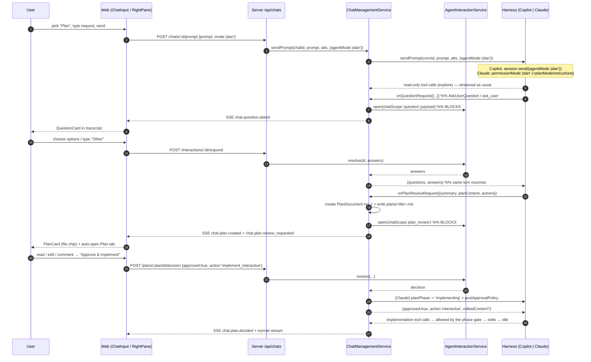

# Plan Mode — Research, Architecture & Implementation Plan

> **Status:** REV 3 — implemented and validated end-to-end (web UI, Copilot provider).
> **Scope:** Add an agent-mode selector (Interactive / Plan) to the chat composer, a native
> plan-generation flow, a reviewable plan document surfaced as a chat card + right-pane tab,
> an approve / request-changes gate before implementation, and in-chat interactive
> clarifying questions.
>
> **Rev 3 changelog (what shipping actually taught us):**
> 1. **Copilot per-message `agentMode` does not enable the plan tool.** See §D.3.1 — this was
>    the root cause of "plan mode runs but nothing ever blocks". `session.rpc.mode.set` is required.
> 2. Plan/question cards must render in **read-only history replay** too, so their handler props
>    are optional and the card degrades rather than disappearing.
> 3. Card reconciliation against the polled pending-gate list needs an **`openedAt` vs
>    `dataUpdatedAt` comparison**; without it a 5s-old poll instantly expires a live gate.
> 4. `chat.plan.review_requested` must carry `title`/`fileName` — otherwise the card header
>    falls back to the entire summary.
> 5. Model summaries routinely open with `**Goal:** …`; the title derivation strips inline
>    markdown so it never leaks into the card header **or the plan file slug**.
>
> **Rev 2 changelog (what the adversarial review changed):**
> 1. Migration is **v21**, not v18 (v18 checkpoints, v19 review threads, v20 checkpoint phase already exist).
> 2. **Claude `ExitPlanModeInput` has no declared `plan` field** — removed all reliance on it;
>    added a 3-source plan-extraction chain.
> 3. **`Query.setPermissionMode()` is unusable** in our adapter (single-shot `claudeQuery({prompt: string})`
>    per turn; control requests need streaming-input mode). Replaced with an **in-callback phase gate**
>    inside `canUseTool` — strictly better, no SDK redesign needed.
> 4. **`MultiHarness` was missing** from the design — it is the real runtime router and must forward options.
> 5. Optional params/methods can be **silently dropped** by proxies while still compiling → forwarding tests are mandatory.
> 6. Copilot `planContent` is **optional**, not guaranteed.
> 7. New-prompt-during-gate concurrency was unspecified → **409 INTERACTION_PENDING**.
> 8. `HitlService` is **not** refactored in v1.
> 9. Web replay has **three** paths (live SSE, event replay, message replay), not one.
> 10. Plan files go to an **ignored metadata dir**, not a git-tracked workspace path.

---

## 0. Executive summary

**The single most important finding of this research:** both SDKs we already ship
**natively support plan mode**, and we currently use **none of it**.

| Capability | Claude Agent SDK `0.3.220` | Copilot SDK `1.0.8` | We use it today |
|---|---|---|---|
| Plan mode switch | `permissionMode: 'plan'` per query | `MessageOptions.agentMode: 'interactive' \| 'plan' \| 'autopilot' \| 'shell'` | ❌ |
| Plan approval gate | `ExitPlanMode` tool → routed to `canUseTool` | `SessionConfig.onExitPlanModeRequest` handler + `exit_plan_mode.requested/completed` events | ❌ |
| Plan content delivery | `ExitPlanModeOutput.plan` / `.filePath` | `ExitPlanModeRequestedData.planContent` + `session.plan_changed` events + `<workspacePath>/plan.md` | ❌ |
| Interactive questions | `AskUserQuestion` tool (1–4 questions × 2–4 options, multiSelect, previews) | `SessionConfig.onUserInputRequest` → `UserInputRequest/Response` (`ask_user` tool) | ❌ |
| Custom planning workflow | `planModeInstructions` (replaces default plan workflow body) | system message / custom agents | ❌ |

So this is **not** a "simulate plan mode with prompt engineering" feature. It is an
**adapter + UI + durable-gate** feature: expose a mode on the composer, thread it through
`IAgentHarness`, translate it per provider, and build the three missing UI surfaces
(plan card, plan tab, question card) plus one missing backend primitive
(a **chat-scoped durable human-interaction gate** — today HITL only exists for workflow stage runs).

**Estimated shape:** ~7 vertical slices, 4 of which are backend-only and independently testable.

---

# PART A — Research: how modern agentic platforms implement plan mode

## A.1 Claude Code / Claude Agent SDK

Verified against the installed package
(`node_modules/@anthropic-ai/claude-agent-sdk/{sdk.d.ts,sdk-tools.d.ts}`) and
`code.claude.com/docs/en/agent-sdk/{permissions,user-input}`.

### Permission evaluation order (6 steps)

```
tool request
  1. Hooks (PreToolUse)          → can deny outright; runs before everything
  2. Deny rules                  → blocks even in bypassPermissions
  3. Ask rules                   → routes to canUseTool even in bypassPermissions
                                   (AskUserQuestion ALWAYS lands here)
  4. Permission mode             → bypassPermissions=approve, acceptEdits=approve file ops,
                                   plan=route file-edit+shell-write to canUseTool
  5. Allow rules                 → auto-approve
  6. canUseTool callback         → your UI decides
```

### `permissionMode` union (exact, from `sdk.d.ts:2092`)

```ts
export declare type PermissionMode =
  'default' | 'acceptEdits' | 'bypassPermissions' | 'plan' | 'dontAsk' | 'auto';
```

**Plan mode semantics:** Claude explores with read-only tools normally; **file edits are
never auto-approved, even if an allow rule matches** — they always land on `canUseTool`.
On CLI ≥ v2.1.212 shell commands that mutate files (`touch`, `rm`) do too.

### The exit gate: `ExitPlanMode`

```ts
// sdk-tools.d.ts:568
export interface ExitPlanModeInput {
  allowedPrompts?: { tool: "Bash"; prompt: string }[];   // "Deprecated: no longer used."
  [k: string]: unknown;                                  // ← open bag; `plan` is NOT declared
}
// sdk-tools.d.ts:2998
export interface ExitPlanModeOutput {
  plan: string | null;          // the plan presented to the user
  isAgent: boolean;
  filePath?: string;            // where the plan was saved
  hasTaskTool?: boolean;
  planWasEdited?: boolean;      // true when the user edited the plan → echoed back in tool_result
  awaitingLeaderApproval?: boolean;
}
```

The agent finishes planning by **calling the `ExitPlanMode` tool**. Because plan mode routes
it through the permission flow, the host intercepts it in `canUseTool`, blocks, and returns allow/deny.

> **⚠ REV 2 CORRECTION.** `ExitPlanModeInput` **does not declare a `plan` field** — the plan lives in
> `ExitPlanModeOutput`. The `[k: string]: unknown` index signature means a runtime `input.plan` is
> *possible* but **not contractually guaranteed**. The design therefore must NOT depend on it.
> See §D.3 for the 3-source extraction chain.

### Clarifying questions: `AskUserQuestion`

```ts
// sdk-tools.d.ts:848
export interface AskUserQuestionInput {
  questions: [ {                       // 1..4 questions
    question: string;                  // full text
    header: string;                    // ≤12 char chip label
    options: [ {                       // 2..4 options
      label: string;                   // 1-5 words
      description: string;             // trade-offs / implications
      preview?: string;                // optional markdown/HTML mockup
    }, ... ];
    multiSelect?: boolean;
  }, ... ];
}
```

Response is returned **through `canUseTool`** as
`{ behavior: 'allow', updatedInput: { questions, answers } }` where `answers` maps
**question text → selected label(s)**, plus an optional top-level `response` string for a
freeform reply that dismisses the card. Docs explicitly note: *"There should be no 'Other'
option, that will be provided automatically"* — i.e. **the host is expected to render a
free-text escape hatch**, which is precisely what the user asked for.

Related knobs found in `sdk.d.ts`:
- `toolConfig.askUserQuestion.previewFormat?: 'markdown' | 'html'` (line ~6951) — SDK strips
  `<script>/<style>/<!DOCTYPE>` before the callback.
- `askUserQuestionTimeout?: '60s' | '5m' | '10m' | 'never'` (line ~6354).
- **Limitation:** `AskUserQuestion` is *not* available inside subagents spawned via the Agent tool.

### Other levers

- `planModeInstructions?: string` (`sdk.d.ts:~1744`) — **replaces the default
  code-implementation workflow body** in the plan-mode system reminder; the CLI still wraps
  it with the read-only enforcement preamble and the ExitPlanMode protocol footer.
  → This is how we inject *our* plan template (file layout, risk section, test plan, etc.).
- `Query.setPermissionMode(mode)` (`sdk.d.ts:2300`) — live mode flip, **"Only available in streaming
  input mode"**. ⚠ **Our adapter calls `claudeQuery({ prompt: <string>, options })` once per turn**
  (`ClaudeAgentProvider.ts:~985`), i.e. single-shot mode with `options.resume` for continuity —
  so **`setPermissionMode` is NOT available to us.** See §D.3 for the replacement mechanism.
- `canUseTool` context is rich: `{ signal, suggestions, blockedPath, decisionReason, title,
  displayName, description, toolUseID }` — we already use `title/description` in our adapter.
- **The callback may stay pending indefinitely**; the SDK only cancels on query cancellation.
  For very long waits there is a *defer* hook decision that lets the process exit and resume
  from the persisted session.
- Subagents inherit the parent permission mode.

---

## A.2 GitHub Copilot CLI / Copilot SDK

Verified against `node_modules/@github/copilot-sdk/dist/{types.d.ts,session.d.ts,generated/session-events.d.ts}`
and GitHub's *About GitHub Copilot CLI* docs.

Copilot CLI's UX (Shift+Tab cycles modes) is exactly the target UX:
> *"In plan mode, Copilot analyzes your request, **asks clarifying questions** to understand
> scope and requirements, and builds a plan before writing any code."*

### Per-message mode — the key API

```ts
// types.d.ts:2367  (MessageOptions — passed to session.send()/sendAndWait())
agentMode?: "interactive" | "plan" | "autopilot" | "shell";
// "The UI mode the agent was in when this message was sent.
//  Defaults to the session's current mode when unset."
```

This is a **per-turn** switch on the same call our `CopilotProvider.sendPrompt()` already
makes (`session.send({ prompt, attachments })`, CopilotProvider.ts:905). Adding plan mode on
the Copilot side is *literally one extra field* plus a handler.

### Plan approval handler + events

```ts
// types.d.ts:899
export interface ExitPlanModeRequest {
  summary: string;
  planContent?: string;
  actions: string[];
  recommendedAction: string;
}
export interface ExitPlanModeResult {
  approved: boolean;
  selectedAction?: string;
  feedback?: string;            // ← "request changes" text
}
export type ExitPlanModeHandler =
  (request: ExitPlanModeRequest, invocation: { sessionId: string }) =>
    Promise<ExitPlanModeResult> | ExitPlanModeResult;

// types.d.ts:1836  (SessionConfig)
onExitPlanModeRequest?: ExitPlanModeHandler;
```

Actions (`session-events.d.ts:523`):

```ts
export type ExitPlanModeAction =
  | "exit_only"        // exit plan mode without starting implementation
  | "interactive"      // exit and continue in interactive mode
  | "autopilot"        // exit and continue autonomously
  | "autopilot_fleet"; // exit and continue with parallel autonomous workers
```

Streaming events (all `ephemeral: true`):

| Event | Payload |
|---|---|
| `exit_plan_mode.requested` | `{ requestId, summary, planContent, actions[], recommendedAction }` |
| `exit_plan_mode.completed` | `{ requestId, approved?, selectedAction?, feedback?, autoApproveEdits? }` |
| `session.plan_changed` | `{ operation: 'create' \| 'update' \| 'delete' }` |
| `session.mode_changed` | `{ previousMode, newMode }` where `SessionMode = 'interactive' \| 'plan' \| 'autopilot'` |
| `session.todos_changed` | signal-only; read via `session.plan.readSqlTodosWithDependencies()` |

The plan file lives at `<session.workspacePath>/plan.md`
(`session.d.ts:67` — *"Contains checkpoints/, plan.md, and files/ subdirectories"*), available
when **infinite sessions** are enabled (`InfiniteSessionConfig.enabled` default `true`).
`planContent` is delivered in the request payload too, so **we do not have to depend on the file**.

### Clarifying questions

```ts
// types.d.ts:862
export interface UserInputRequest { question: string; choices?: string[]; allowFreeform?: boolean }
export interface UserInputResponse { answer: string; wasFreeform: boolean }
// types.d.ts:1798 (SessionConfig)
onUserInputRequest?: UserInputHandler;   // "enables ask_user tool"
```

Simpler than Claude's (one question, flat string choices, explicit `allowFreeform`), but the
same shape after normalisation.

### Sibling primitives worth knowing about

- `onElicitationRequest` (`ElicitationHandler`) — form-based dialogs (schema-driven), a richer
  future path for structured input.
- `session.ui` (`SessionUiApi`) — `confirm()` etc., gated on `session.capabilities.ui.elicitation`.
- `PermissionsChangedEvent` / `PermissionAllowAllMode = 'off' | 'on' | 'auto'`.

---

## A.3 Cursor

From `cursor.com/docs/agent/plan-mode`:

1. Agent **asks clarifying questions**
2. Researches the codebase
3. Creates a comprehensive implementation plan
4. **User reviews and edits the plan through chat *or markdown files***
5. Click to build the plan

Plus: **`Shift+Tab` rotates modes**; the mode picker lives in the composer; Cursor *suggests*
plan mode when the prompt looks complex; plans are saved to the home dir with a
**"Save to workspace"** action for team sharing; and the documented recovery loop is
*"revert changes → refine the plan → re-run"* rather than patching a bad in-flight agent.

## A.4 VS Code Copilot Chat / Agents window

Not a distinct "plan mode" primitive; instead **per-session configuration**:
*agent type, agent, **permission level**, language model*, plus custom agents
(`.agent.md`), queue/steer/stop message handling, and checkpoints. The relevant lesson is
**mode is session configuration surfaced in the composer**, and **permission level is a
first-class, user-visible dial** — which matches the design below.

## A.5 Codex / OpenAI

Codex's analogue is an outer control plane (spec → tickets → isolated workspace per issue)
rather than an in-conversation plan gate — the same conclusion recorded in
`session-99-orchestrator-mode-research-plan.md`. Our Automations/DAG workflows already occupy
that niche, so Codex is **not** the model to copy for this feature.

## A.6 Synthesis — the 6 invariants every implementation shares

1. **Mode is chosen in the composer, per-turn**, and is visually persistent
   (Shift+Tab in Claude Code / Copilot CLI / Cursor; mode picker dropdown everywhere).
2. **Plan mode is enforced by the permission layer, not by prompting** — writes are
   *structurally* impossible to auto-approve while planning.
3. **The agent signals "I'm done planning" with an explicit tool call**
   (`ExitPlanMode`), not by ending its turn.
4. **The plan is a document** (markdown), addressable as a file, editable by the user, and the
   edited version is what gets fed back.
5. **Approval is a blocking, structured decision** with at least: approve, approve-and-run,
   reject-with-feedback. Feedback re-enters the same conversation, it does not start a new one.
6. **Clarifying questions are structured multiple-choice + free text**, rendered inline in the
   transcript, and answered *inside the same agent turn* (the tool call blocks).

---

# PART B — Capability matrix: what maps natively vs what we must build

| Requirement (from your brief) | Claude | Copilot | Verdict |
|---|---|---|---|
| Mode selector: Interactive / Plan | `permissionMode:'plan'` per query | `agentMode:'plan'` per message | **Native both** |
| Agent produces a plan document | `ExitPlanModeOutput.plan/.filePath` **(input NOT guaranteed)** | `ExitPlanModeRequestedData.planContent` **(optional)** + `plan.md` | **Native, extraction chain required** |
| Block in chat showing plan file name | — | — | **Build (UI)** |
| Click → opens right-pane tab labelled "Plan" | — | — | **Build (UI)** |
| Approve → agent starts implementing | allow `ExitPlanMode` + **in-callback phase gate** (NOT `setPermissionMode`) | `ExitPlanModeResult{approved, selectedAction:'interactive'}` | **Native Copilot / adapter-side Claude** |
| Request changes with comments | deny + message / `planWasEdited` echo | `ExitPlanModeResult.feedback` | **Native both** |
| Agent asks the user questions | `AskUserQuestion` | `onUserInputRequest` | **Native both** |
| Interactive answer control in chat | — | — | **Build (UI)** |
| Durable pending-approval state | — | — | **Build (backend)** |
| Chat-scoped permission policy | — | — | **Build (backend)** |

**Net new backend surface (REV 2 — the earlier "exactly one primitive" claim was understated):**
chat-scoped durable interaction gate **+** plan/revision/comment aggregate + repositories **+**
chat concurrency policy **+** provider-side plan-phase gating **+** restart/expiry recovery **+**
transcript persistence **+** three web reconstruction paths. Everything else is adapter plumbing + UI.

---

# PART C — Where this lands in the current architecture

## C.1 Verified anchors (file : line)

**Harness port**
- `packages/core/src/domain/ports/IAgentHarness.ts:152` — `CreateConversationParams`
  (has `onPermissionRequest`, `hooks`, `reasoningEffort`, `contextTier`; **no** `permissionMode`).
- `:105` `PermissionRequestHandler`, `:109` `PermissionRequest`, `:116` `PermissionResponse`.
- `sendPrompt(conversationId, prompt, attachments?)` — **no per-turn options bag**.

**Providers**
- `packages/agent-harness-providers/src/providers/claude-agent/ClaudeAgentProvider.ts`
  - `createConversation` ~`:382-480` stores `permissionMode: this.options.defaultPermissionMode ?? 'bypassPermissions'`.
  - `buildQueryOptions` ~`:880-945` — **⚠ currently forces `permissionMode:'default'` whenever a
    domain `onPermissionRequest` exists (HITL-06)**. This must become plan-aware.
  - `permissionPending` map = "waiting on human" counter that pauses the watchdog.
- `packages/agent-harness-providers/src/providers/copilot/CopilotProvider.ts`
  - `createConversation` ~`:450-575` builds `SessionConfig`; `onPermissionRequest` bridged ~`:525-560`.
  - `sendPrompt` `:893-916` → `session.send({ prompt, attachments })` ← **insertion point for `agentMode`**.
  - `permissionMap.ts` — exhaustive SDK-kind → domain-type map (must stay exhaustive).

**Chat service**
- `packages/core/src/services/ChatManagementService.ts`
  - `ChatManagementServiceExtensions` `:25-75` (browser, widgets, orchestrator, checkpoints, hook bridge…)
  - `createChat` `:160-384` (workspace, worktrees, tool sets, hook bridge, `harness.createConversation`)
  - `buildConversationConfig` `:716-816` (resume path — **must mirror every new field**)
  - `sendPrompt` `:827-1150` — turnId, checkpoints, user message persist, event subscription loop,
    metadata accumulation, persist-on-idle, `harness.sendPrompt(...)` at `~:1085`.
  - **No `onPermissionRequest` is wired for chats today** — only `StageExecutionService` does that.

**HITL / permissions**
- `packages/core/src/services/HitlService.ts:52` — `interrupt()` `:74`, `resume()` `:109`,
  `cancelWaiter()` `:145`, `listPending()` `:152`. **Keyed by `stageRunId` only.**
- `packages/core/src/permissions/PermissionPolicy.ts:59` — `PermissionMode` already includes `'plan'`
  (`:144` → every tool call becomes `ask`). `evaluatePermission()` `:126`, `evaluateToolPermissions()` `:188`.
- `packages/core/src/permissions/policyHookBridge.ts:52` `makePolicyHookBridge()`, `:93` `mergeHookBridges()`.
- `packages/core/src/services/StageExecutionService.ts:231-285` `buildPermissionHandler()`
  — the exact pattern to clone for chats.

**Persistence**
- `packages/shared/src/types/ChatMessage.ts:4-43` `ChatMessageMetadata` — open-ended, already carries
  `toolCalls`, `thinkingText`, `widgetInstanceIds`, `turnId`. **Un-migrated extension point.**
- `packages/db/src/schema.ts` — `chatMessages.metadata` is free-form JSON; `chats` table gained
  orchestrator columns in migration v17; latest applied migration is **v20** (`checkpoint_phase`)
  → **plan mode is v21**.

**Web**
- `apps/web/src/components/chat/ChatInput.tsx` — toolbar `:821-1130`; **mode picker goes at `:890`**
  right after `ModelPicker`; overflow behaviour via `collapseControls`; `handleSend` `:470-530`;
  `activeCommand`/`SlashCommand` is an existing "mode-like" state precedent.
- `apps/web/src/components/layout/RightPane.tsx` — `RightPaneTabDef` `:40-65`,
  `focusTabRequest` `:120-140`, add/focus effect `:378-425`.
- `apps/web/src/pages/ChatPage.tsx` — tabs record + `focusTabRequest` wiring `:697-714`,
  auto-open effects `:217-271`, `useFileTabs` hook.
- `apps/web/src/stores/streamStore.ts:9-68` — `StreamBlock` union
  (`thinking|text|tool_call|system|widget`) + `addWidget/updateWidgetState/setWidgetStatus`.
- `apps/web/src/components/agent/deriveTimeline.ts` `deriveStreamView()` → segments/steps/answer/widgets.
- `apps/web/src/components/agent/StreamPanel.tsx:68-105` — segment renderer.
- `apps/web/src/components/agent/chatMessageToBlocks.ts:18-60` — **replay path**; must learn the new blocks.
- `apps/web/src/components/workflow/redesign/InlineHitlControls.tsx` — closest existing
  approve/request-changes control (workflow-only today).

## C.2 The one structural gap

`HitlService` is `stage_run`-shaped: it writes `stage_runs.status='awaiting_input'` +
`interrupt_data`, and resolves via `POST /workflow-runs/:runId/stages/:stageId/approve`.
**Chats have no equivalent.** Plan mode needs the same interrupt/resume semantics keyed by
`(chatId, turnId, interactionId)`.

---

# PART D — Proposed architecture

## D.1 Domain model (new types in `@generatorai/shared`)

```ts
// types/AgentMode.ts
export type AgentMode = 'interactive' | 'plan';            // extensible: 'autopilot' | 'shell'
export const DEFAULT_AGENT_MODE: AgentMode = 'interactive';

// types/Plan.ts
export type PlanStatus =
  | 'drafting'            // agent is in plan mode, no ExitPlanMode yet
  | 'awaiting_review'     // gate open, blocking the agent
  | 'changes_requested'   // user sent feedback; agent is revising
  | 'approved'            // user approved; implementation authorised
  | 'rejected'            // user declined; agent exits plan mode without implementing
  | 'superseded'          // a newer revision replaced this one
  | 'expired';            // server restarted / turn cancelled while pending

export interface PlanRevision {
  revision: number;                 // 1-based
  content: string;                  // markdown
  summary: string;
  authoredBy: 'agent' | 'user';     // 'user' when the user edited it in the Plan tab
  createdAt: Date;
}

export interface PlanDocument {
  id: string;
  chatId: string;
  sessionId: string;
  turnId: string;                   // turn that produced the current revision
  title: string;                    // derived: slug of summary, e.g. "Add OAuth login"
  fileName: string;                 // e.g. "plans/2026-07-29-add-oauth-login.md"
  filePath?: string;                // materialised absolute path inside the workspace
  status: PlanStatus;
  currentRevision: number;
  revisions: PlanRevision[];
  harnessType: 'copilot' | 'claude-agent';
  availableActions: PlanAction[];   // normalised from the provider
  recommendedAction?: PlanAction;
  decision?: PlanDecision;
  comments: PlanComment[];
  createdAt: Date; updatedAt: Date;
}

export type PlanAction = 'exit_only' | 'implement_interactive' | 'implement_autopilot';

export interface PlanDecision {
  approved: boolean;
  action?: PlanAction;
  feedback?: string;
  editedContent?: string;           // set when the user edited before approving
  decidedAt: Date;
  // REV 2: `decidedBy` removed. The server has API-key auth only
  // (apps/server/src/middleware/auth.ts) — there is no verified user identity to record.
  // A neutral actor tag is stored in the interaction resolution instead.
}

export interface PlanComment {                 // inline "select text + comment" review
  id: string;
  revision: number;
  // REV 2: line numbers alone drift across revisions. Follow the v19 review-thread precedent
  // (anchor_text + anchor_hash) so an anchor can be re-located or marked outdated.
  anchor?: { startLine: number; endLine: number; quotedText: string; contentHash: string };
  body: string;
  createdAt: Date;
  resolved: boolean;
}

// types/AgentQuestion.ts   (unified AskUserQuestion + UserInputRequest)
export interface AgentQuestionOption { label: string; description?: string; preview?: string }
export interface AgentQuestion {
  id: string;
  header: string;                    // ≤12 chars (Claude constraint)
  question: string;
  options: AgentQuestionOption[];     // may be empty for Copilot freeform-only
  multiSelect: boolean;
  allowFreeform: boolean;
}
export interface AgentQuestionRequest {
  id: string; chatId: string; sessionId: string; turnId: string;
  questions: AgentQuestion[];         // 1..4
  askedAt: Date;
  expiresAt?: Date;
}
export interface AgentQuestionResponse {
  answers: Record<string /*questionId*/, string[]>;  // labels or freeform text
  freeformResponse?: string;                          // "dismiss card and just say this"
}
```

## D.2 Harness port changes (`IAgentHarness.ts`)

```ts
// 1. per-turn options bag — additive, backwards compatible
export interface SendPromptOptions {
  agentMode?: AgentMode;
  permissionMode?: HarnessPermissionMode;   // escape hatch, mostly derived from agentMode
}
sendPrompt(conversationId, prompt, attachments?, options?: SendPromptOptions): Promise<void>;
sendPromptAndWait(conversationId, prompt, attachments?, signal?, options?: SendPromptOptions): Promise<ConversationResponse>;

// 2. session-level defaults + live flip
export type HarnessPermissionMode =
  'default' | 'acceptEdits' | 'bypassPermissions' | 'plan' | 'dontAsk';
// CreateConversationParams additions:
  permissionMode?: HarnessPermissionMode;
  planModeInstructions?: string;                     // Claude-native; Copilot → system message
  onPlanReviewRequest?: PlanReviewRequestHandler;    // NEW blocking gate
  onQuestionRequest?: QuestionRequestHandler;        // NEW blocking gate
// new method (no-op where unsupported):
setPermissionMode?(conversationId: string, mode: HarnessPermissionMode): Promise<void>;
//   ⚠ REV 2: Claude cannot implement this (single-shot query). It exists only for future
//   streaming-input providers. Nothing in the plan-mode flow may depend on it.

// 3. the two new handler types (vendor-neutral)
export type PlanReviewRequestHandler =
  (req: {
     summary: string; planContent: string;
     actions: PlanAction[]; recommendedAction?: PlanAction;
     filePath?: string; requestId?: string;
   }) => Promise<{ approved: boolean; action?: PlanAction; feedback?: string; editedContent?: string }>;

export type QuestionRequestHandler =
  (req: { questions: AgentQuestion[] }) => Promise<AgentQuestionResponse>;
```

> **Design note.** Two *dedicated* handlers instead of overloading `onPermissionRequest`.
> Rationale: Copilot exposes them as first-class SessionConfig handlers, and conflating them
> with permissions would force every consumer (stages, automations) to discriminate on payload
> shape. Claude routes both through `canUseTool` — the *adapter* does the demultiplexing, which
> is exactly the adapter's job.

## D.3 Provider mappings

### Copilot (`CopilotProvider.ts`)

| Domain | SDK |
|---|---|
| `sendPrompt(..., { agentMode:'plan' })` | **`session.rpc.mode.set({ mode })` first**, then `session.send({ prompt, attachments, agentMode })` — see §D.3.1 |
| `onPlanReviewRequest` | `SessionConfig.onExitPlanModeRequest` → map `ExitPlanModeRequest` ⇄ `ExitPlanModeResult` |
| `onQuestionRequest` | `SessionConfig.onUserInputRequest` → wrap the single `UserInputRequest` into a 1-element `AgentQuestion[]`; return `{ answer, wasFreeform }` |
| plan actions | `exit_only`→`exit_only`, `interactive`→`implement_interactive`, `autopilot`→`implement_autopilot`, `autopilot_fleet`→ hidden (v1). **Normalise defensively — never trust raw provider strings.** |
| plan content | `planContent` is **optional** (`types.d.ts:899-928`). Chain: `planContent` → `<session.workspacePath>/plan.md` → last accumulated assistant text → **fail loudly** (never approve an empty plan). |
| plan file changes | map `session.plan_changed` → `harness.plan_changed` AgentEvent |
| mode changes | map `session.mode_changed` → `harness.mode_changed` AgentEvent |

#### D.3.1 The session mode is what actually enables the plan tool

This is the single subtlety that decides whether plan mode works at all, and it
is not discoverable from the SDK typings.

`MessageOptions.agentMode` (`types.d.ts:2367`) looks like the switch, but on the
CLI side it is **display metadata only** — it is recorded on the user message
(the HTML transcript exporter renders it as a `<span class="agent-mode">`) and
never assigned to `session.currentMode`.

The CLI resolves the tool list from the **session** mode and removes the plan
tool whenever that mode is not `plan`:

```js
// copilot CLI app.js (bundled), LU === "exit_plan_mode"
Kt && this.currentMode !== "plan" && (k = k.filter(rn => rn.name !== LU), …)
// and registration itself:
if (h.planModeActive && h.onExitPlanMode) { P.push(Tft(…)) }
```

So a turn sent with `agentMode:'plan'` alone produces an agent that has been
*instructed* to call `exit_plan_mode` but has not been *given* it. Observed
failure mode: the model falls back to `skill(exit_plan_mode)`, the CLI answers
`"Skill not found: exit_plan_mode"`, the plan prose is written, and **no gate
ever opens** — the turn just ends and the UI looks stuck.

The fix is `session.rpc.mode.set({ mode })` (`rpc.d.ts:16554`,
`ModeSetRequest { mode: SessionMode }`), issued **before** each `session.send`.
`CopilotProvider.applySessionMode()` implements this:

- caches the last mode applied per conversation, so steady-state turns cost nothing;
- mirrors CLI-initiated changes by listening for `session.mode_changed` (an approved
  `exit_plan_mode` moves the session itself), so the cache never goes stale;
- is best-effort — the RPC is `@experimental`, so a failure is logged, the cache is
  cleared so the next turn retries, and the turn proceeds without the native gate.

Note also that there is **no capability flag** to probe: `SessionCapabilities`
(`types.d.ts:556-600`) exposes only `ui.{elicitation,mcpApps,canvases}`. The CLI
enables the callback purely from `requestExitPlanMode: !!config.onExitPlanModeRequest`
at session create/resume.

Regression coverage: `packages/agent-harness-providers/__tests__/copilot-session-mode.test.ts`.

**Handlers must be installed on BOTH create and resume paths** — `CopilotProvider` rebuilds
`SessionConfig` on resume, and a handler missing there means plan mode silently dies after a
server restart.

Additional mapper work in `event-mapper.ts`: `exit_plan_mode.requested` / `.completed` are
`ephemeral` events that arrive **in parallel with** the handler callback — treat the handler as
the source of truth and the events as telemetry/observability (avoid double-prompting).

**Watchdog:** extend the existing `permissionPending` counter to also increment during
plan-review and question waits, otherwise `sendPromptAndWait`'s timer will fire while a human
is reading a plan. *(This is a real defect risk — see §F.2.)*

### Claude (`ClaudeAgentProvider.ts`) — **REV 2: redesigned**

The original design was invalid on two counts (no `input.plan`; `setPermissionMode` unusable).
Replacement design uses a **per-conversation plan-phase gate implemented inside our own
`canUseTool`** — no SDK redesign, no streaming-input migration, fully testable.

```
planPhase: Map<conversationId, { phase: 'planning' | 'implementing';
                                 postApprovalPolicy: 'acceptEdits' | 'bypassPermissions';
                                 planText: string }>
```

`canUseTool(toolName, input, ctx)` dispatch order:

| `toolName` | Behaviour |
|---|---|
| `AskUserQuestion` | → `onQuestionRequest(questions)`; return `{behavior:'allow', updatedInput:{questions, answers}}` (+ optional `response`) |
| `ExitPlanMode` | → extract plan (chain below) → `onPlanReviewRequest(...)` **blocks**. **Approved:** set `phase='implementing'` + `postApprovalPolicy`, return `{behavior:'allow', updatedInput: input}`. **Changes requested:** stay `planning`, return `{behavior:'deny', message: feedback}` |
| any other tool, `phase==='implementing'` | apply `postApprovalPolicy` locally: `acceptEdits` → allow file ops, defer the rest to the domain permission handler; `bypassPermissions` → allow all |
| any other tool, `phase==='planning'` | defer to the domain permission handler (chat permission mode) |
| no plan phase (interactive) | unchanged from today |

> **Why this is strictly better than `setPermissionMode`.** In `permissionMode:'plan'` every write
> lands on `canUseTool` *by construction*. So "flip to acceptEdits after approval" is simply
> **"start returning allow"** — the mode transition is realised in our callback, inside the same
> single-shot query, with no SDK control-request dependency. Same-turn implementation works.

**Plan extraction chain (ordered, first hit wins):**
1. `input['plan']` when it is a non-empty string (opportunistic — permitted by the index signature).
2. The provider's **per-turn accumulated assistant text** (`planText`) — in plan mode the model
   writes the plan as its message immediately before calling `ExitPlanMode`. The provider already
   accumulates `fullContent` in `runQueryInBackground`; hoist it into `planPhase`.
3. `input['filePath']` / `input['path']` when present and inside the workspace → read via `resolveWithinBase`.
4. **None of the above** → do **not** open a gate. Emit `chat.plan.extraction_failed`, deny the tool with
   an actionable message ("Could not capture your plan — please restate it in your reply"), and
   surface a system block. Never approve an empty plan.

Other Claude wiring: `permissionMode:'plan'` from `agentMode`; `planModeInstructions`;
`toolConfig.askUserQuestion.previewFormat:'markdown'`; `permissionPending` incremented for both
new gate types (the counter already exists at `ClaudeAgentProvider.ts:~209`).

**⚠ Must-fix in `buildQueryOptions`:** today
`effectivePermissionMode = hasDomainHandler ? 'default' : (config.permissionMode ?? 'bypassPermissions')`.
An explicitly requested `'plan'` must win:

```
requested = turnOptions.permissionMode ?? modeToPermissionMode(turnOptions.agentMode)
effective = requested ?? (hasDomainHandler ? 'default' : stored ?? 'bypassPermissions')
```

### The routing layer — **REV 2: `MultiHarness` was missing from Rev 1**

`MultiHarness` (`packages/agent-harness-providers/src/MultiHarness.ts:37`) is the **canonical
`IAgentHarness` the server injects** (`composition-root.ts:~205`). It owns conversation→provider
ownership and forwards `sendPrompt` at `:176` / `sendPromptAndWait` at `:180`.
`HarnessProxy` (`:28`) forwards at `:107`/`:110`.

**Every one of these must forward the new options; TypeScript will NOT catch a dropped optional
parameter.** Complete implementer list:

| Implementation | File |
|---|---|
| `CopilotProvider` | `providers/copilot/CopilotProvider.ts:162` |
| `ClaudeAgentProvider` | `providers/claude-agent/ClaudeAgentProvider.ts:196` |
| `MultiHarness` | `MultiHarness.ts:37` |
| `HarnessProxy` | `HarnessProxy.ts:28` |
| `MockAgentHarness` (core tests) | `packages/core/__tests__/MockAgentHarness.ts:17` |
| server test harness object | `apps/server/__tests__/helpers/testApp.ts:177`, `:229` |
| structural cast | `packages/core/__tests__/SessionAllocator.test.ts:46` |

`IAgentHarness` is a **published BYOH contract** (`packages/sdk/API-STABILITY.md:32-35`) → additive
only, plus release notes.

**Mandatory forwarding tests** (Slice "contract"): assert that a `sendPrompt` issued through
`MultiHarness` → `HarnessProxy` → provider arrives with `options.agentMode` intact. A green build
is *not* sufficient evidence.

### Fallback (any future provider without native plan mode)

Emulation profile, kept behind one function so it is not scattered:
`systemMessage += PLAN_MODE_PREAMBLE` + `excludedTools = WRITE_TOOLS` +
inject a domain tool `submit_plan({ summary, plan })` whose handler *is* `onPlanReviewRequest`,
and a domain tool `ask_user({...})` whose handler *is* `onQuestionRequest`.
This also gives us a deterministic test double.

## D.4 The new backend primitive: `AgentInteractionService`

`packages/core/src/services/AgentInteractionService.ts` — generalises `HitlService` beyond stage runs.

```ts
type InteractionScope = { kind: 'chat'; chatId: string; sessionId: string; turnId: string }
                      | { kind: 'stage_run'; stageRunId: string; workflowRunId: string };

type InteractionKind = 'plan_review' | 'question' | 'tool_permission';

class AgentInteractionService {
  open<T>(scope, kind, payload, opts?: { timeoutMs?: number }): Promise<T>; // BLOCKS
  resolve(interactionId, resolution): Promise<{ ok: boolean; reason?: string }>;
  cancel(interactionId, reason): void;
  cancelForTurn(chatId, turnId, reason): void;      // on chat cancel
  listPending(scope): Promise<AgentInteraction[]>;
  expireOrphans(): Promise<number>;                  // startup recovery
}
```

Mirrors `HitlService`'s hard-won invariants:
- register the in-memory resolver **synchronously before any await** (HitlService.ts:82-85)
- persist **before** emitting the event (durability)
- atomic conditional resolve (`WHERE status='pending'`) so only one approver wins
- `cancelWaiter` semantics on parent cancellation

> **REV 2 correction — `HitlService` is NOT refactored in v1.** The review is right that
> `HitlService` is tightly coupled to stage rows + scheduler restart semantics, and chat SDK
> callbacks have fundamentally different recovery semantics (a stage re-runs; a blocked SDK
> callback cannot). `AgentInteractionService` is introduced **alongside** it, copying the
> invariants rather than absorbing the service. Workflow HITL behaviour and its existing tests
> (`packages/core/__tests__/HitlService.test.ts`) are untouched. Consolidation is a later,
> separately-reviewed refactor.

### Interaction state machine (REV 2 — expanded)

```
pending ─┬─→ approved            (plan review, user approved)
        ├─→ changes_requested   (plan review, feedback supplied — gate reopens on next revision)
        ├─→ answered            (question resolved)
        ├─→ rejected            (plan discarded / exit_only)
        ├─→ cancelled           (turn cancelled by user)
        ├─→ expired             (max age exceeded, or orphaned by restart)
        └─→ failed              (provider/extraction error)
```

Plan-document status and interaction status are **separate** — one plan can span several
interactions (one per review round). At most **one `pending` interaction per
`(chatId, turnId, kind)`**, enforced by a partial unique index and a conditional `UPDATE`.

**Idempotency:** replaying the *same* resolution returns the stored outcome (200);
a *conflicting* resolution returns **409**, it never mutates an already-approved plan.

### Concurrency: what happens if the user sends a new message while a gate is open

> **REV 2 — this was entirely unspecified in Rev 1 and is genuinely unsafe.**
> `ChatManagementService.sendPrompt` only unsubscribes the previous listener before installing a
> new one (`:939-957`); it does **not** abort or serialise the prior turn. A second prompt during a
> gate would leave the first SDK query blocked, detach its listener, mis-attribute late events to
> the new `turnId`, and on Claude overwrite the `activeQueries` entry while the old process lives.

**v1 policy:** while any `pending` interaction exists for a chat, `POST /chats/:id/prompt`
returns **`409 INTERACTION_PENDING`** with `{ interactionId, kind, planId? }`. The web client
renders this as an inline hint on the composer ("Resolve the open plan review to continue")
and offers **"Cancel review and send"**, which calls `POST /chats/:id/cancel` first.
No implicit queueing or steering in v1.

### Runtime expiry (REV 2 — not only startup)

A sweeper (default every 60s, `GENERATORAI_INTERACTION_MAX_AGE_MS`, default 24h) expires
abandoned gates: mark `expired` → resolve the waiter as `{approved:false, reason:'expired'}` →
the provider callback's `finally` decrements `permissionPending` → emit `chat.plan.expired`.
Startup `expireOrphans()` handles the restart case.

**Restart semantics (explicit decision required — see §H, Q4).** Unlike stage runs, a chat's
pending gate cannot be resumed after a server restart because the SDK query/session that is
blocked on the handler is gone. Proposal: on boot, `expireOrphans()` marks pending chat
interactions `expired`, emits `chat.plan.expired`, and the UI renders the plan read-only with a
**"Re-submit plan for review"** action that replays the plan as a new user turn.

## D.5 Chat-scoped permission policy

New: `chats.permission_mode` (`'bypassPermissions' | 'default' | 'acceptEdits' | 'plan'`,
default `'bypassPermissions'` — preserves today's behaviour exactly).

`ChatManagementService.buildChatPermissionHandler(chatId, sessionId)` clones
`StageExecutionService.buildPermissionHandler` (`:231-285`):

```
read chat.permissionMode (live, per call — enables mid-turn flips)
  bypassPermissions            → { granted: true }                       (fast path)
  acceptEdits + file_read/write→ { granted: true }
  otherwise                    → interactions.open(chatScope,'tool_permission', req)  [BLOCKS]
```

**Attachment gating (important):** the handler is attached **only when
`chat.permissionMode !== 'bypassPermissions'` or the chat has ever used plan mode.** Reason: on
Claude, merely providing `onPermissionRequest` forces `permissionMode:'default'`, which would
turn every existing chat into a prompt-storm. This is a behaviour-preservation guard, not an
optimisation.

**Mode → permission mode mapping**

| Composer mode | Turn permission mode | After plan approved |
|---|---|---|
| Interactive | chat's `permission_mode` (default `bypassPermissions`) | n/a |
| Plan | `plan` (forced) | `acceptEdits` if action = `implement_interactive`; `bypassPermissions` if `implement_autopilot`; revert to chat default if `exit_only` |

## D.6 Persistence — migration **v21**

> **REV 2 correction.** v18 = `workspace_checkpoints`, v19 = `review_threads_and_comments`,
> v20 = `checkpoint_phase` already exist in `packages/db/src/migrations/index.ts`.
> **The next free version is v21.**

```
plan_documents
  id PK, chat_id FK→chats, session_id, turn_id,
  title, file_name, file_path,
  status, current_revision, harness_type,
  available_actions JSON, recommended_action,
  decision JSON, created_at, updated_at
  INDEX (chat_id, created_at), INDEX (chat_id, status)

plan_revisions
  id PK, plan_id FK→plan_documents, revision INT,
  content TEXT, summary TEXT, authored_by, created_at
  UNIQUE (plan_id, revision)

plan_comments
  id PK, plan_id FK, revision INT,
  anchor_start_line INT, anchor_end_line INT,
  anchor_text TEXT, anchor_hash TEXT,        -- v19 review-thread precedent: text+hash survive drift
  body TEXT, resolved BOOL, created_at

agent_interactions
  id PK, scope_kind, scope_id, chat_id, session_id, turn_id,
  kind, status ('pending'|'approved'|'changes_requested'|'answered'
               |'rejected'|'cancelled'|'expired'|'failed'),
  payload JSON, resolution JSON, created_at, resolved_at, expires_at
  INDEX (chat_id, status), INDEX (scope_kind, scope_id, status)
  UNIQUE partial: one row with status='pending' per (chat_id, turn_id, kind)

chats  + permission_mode TEXT DEFAULT 'bypassPermissions'
       + default_agent_mode TEXT DEFAULT 'interactive'
chat_messages: no schema change — use metadata JSON (see D.7)
```

Follows the v17–v20 precedent (`ALTER TABLE ... ADD COLUMN` + `CREATE TABLE IF NOT EXISTS`,
registered in `packages/db/src/migrations/index.ts`, runs on server boot).

**Plan file materialisation — REV 2: NOT git-tracked.** DB is authoritative. The projection goes to
an **application metadata directory that is git-ignored**
(`<workspace root>/.generatorai/plans/<planId>-<slug>.md`), *not* into the tracked working tree.
Rationale from review: auto-writing every draft plan into the working tree pollutes the Changes
panel, checkpoints, review surfaces, agent context, and can end up committed/pushed.
A **"Save to workspace"** action (Cursor's affordance) explicitly promotes an approved plan to a
tracked path when the user wants it versioned.

**Write safety (mandatory):**
- File name and directory are **always server-generated** — never provider-supplied.
- Resolve through `resolveWithinBase()` (`packages/core/src/utils/safePath.ts:36`) which is
  realpath-aware and handles symlinked ancestors / nonexistent descendants.
- Reject when the target exists and `isSymlink()` (`safePath.ts:71`).
- Atomic temp-write + rename; no-clobber create; strict slug charset `[a-z0-9-]{1,64}`.

## D.7 Transcript persistence (no migration)

Extend `ChatMessageMetadata`:

```ts
planCards?: Array<{ planId: string; revision: number; title: string; fileName: string;
                    summary: string; status: PlanStatus }>;
questionCards?: Array<{ interactionId: string; questions: AgentQuestion[];
                        response?: AgentQuestionResponse; status: 'pending'|'answered'|'expired' }>;
agentMode?: AgentMode;   // which mode produced this turn (badge on the message)
```

This is exactly how `widgetInstanceIds` already works, and it makes replay
(`chatMessageToBlocks.ts`) a pure function of the stored message.

## D.8 Events (`packages/shared/src/types/AgentEvent.ts`)

```
chat.plan.drafting          { chatId, turnId }
chat.plan.created           { chatId, planId, revision, title, fileName, summary }
chat.plan.updated           { chatId, planId, revision }
chat.plan.review_requested  { chatId, planId, revision, actions[], recommendedAction, summary }
chat.plan.decided           { chatId, planId, approved, action?, feedback? }
chat.plan.expired           { chatId, planId, reason }
chat.question.asked         { chatId, interactionId, questions[] }
chat.question.answered      { chatId, interactionId, answers }
chat.question.expired       { chatId, interactionId }
chat.mode_changed           { chatId, previous, next }
harness.plan_changed        { operation }        // provider passthrough (telemetry)
harness.mode_changed        { previousMode, newMode }
```

All emitted through `ChatManagementService.enrichWithChatId` (`:92`) so they ride the existing
dual-scope SSE routing and the durable replay window.

> **REV 2 — every chat-scoped payload MUST carry `chatId`.** The event bridge in
> `apps/server/src/composition-root.ts:~505-539` publishes to *session* scope only when `chatId`
> is absent, so a missing `chatId` silently drops the card from the chat stream.

### The three web reconstruction paths (REV 2 — Rev 1 named only one)

| Path | File | When |
|---|---|---|
| Live SSE dispatch | `apps/web/src/stores/sseManager.ts:~187-214` (switch on `event.kind`) | while streaming |
| Persisted **event** replay | `apps/web/src/utils/replayEvents.ts:~112-156` | reconnect / reload mid-turn |
| Persisted **message** replay | `apps/web/src/components/agent/chatMessageToBlocks.ts:17-80` | historical transcript |

`replayEvents.ts:~156-229` **skips event replay for completed chats** (fast path). Plan and
question cards must therefore be persisted into `ChatMessageMetadata` (§D.7) so path 3 alone can
rebuild them — do **not** rely on event replay for historical plans.

## D.9 HTTP API (`apps/server/src/routes/chats.ts`)

```
POST   /api/chats/:id/prompt              + `mode` field in the multipart body   (existing route)
                                          → 409 INTERACTION_PENDING when a gate is open
GET    /api/chats/:id/plans                                   → PlanDocument[]
GET    /api/chats/:id/plans/:planId                           → PlanDocument (with revisions)
GET    /api/chats/:id/plans/:planId/content?revision=n         → markdown
PUT    /api/chats/:id/plans/:planId/content                    → user edit → new revision
                                          body: { content, expectedRevision }  → 409 on mismatch
POST   /api/chats/:id/plans/:planId/comments                   → PlanComment
POST   /api/chats/:id/plans/:planId/decision                   → { approved, action?, feedback?, useEditedContent?, expectedRevision }
POST   /api/chats/:id/plans/:planId/save-to-workspace          → promote to a tracked path
GET    /api/chats/:id/interactions?status=pending              → AgentInteraction[]   (reconnect recovery)
POST   /api/chats/:id/interactions/:interactionId/respond      → AgentQuestionResponse
PATCH  /api/chats/:id/permission-mode                          → { mode }
```

**Every handler must verify `planId` / `interactionId` actually belong to the `:id` chat**
(the server has API-key auth, not per-user authz — ownership validation is the only defence
against cross-chat mutation). Enforce request-size caps on `content`, `feedback`, and comment
bodies; never log plan bodies or feedback.

`SendChatPromptSchema` gains `mode: z.enum(['interactive','plan']).optional()`;
`AgentHarnessConfigSchema` gains `permissionMode` and `planModeInstructions`.

## D.10 Web UI

### (a) Mode picker — `ChatInput.tsx` at `:890`

Segmented control / dropdown immediately after `ModelPicker`, matching the existing inline-pill
pattern used by Reasoning (`:905`) and Context (`:947`):

- Collapsed label: `⚡ Interactive` / `📋 Plan`
- Items: **Interactive** *(“Agent works and edits directly”)*, **Plan** *(“Agent researches and
  proposes a plan for your approval — no edits”)*
- New props `agentMode` / `onAgentModeChange`; new state `showModeDropdown` + ref
- Must join the `collapseControls` overflow menu (`:1002`) on narrow widths — **never simply hide**
- **The mode must be threaded all the way through**: `ChatInput.handleSend` → `ChatPage.customSendFn`
  (which today strips the payload down to `{prompt, attachments}`) → `useSendChatPrompt` →
  `HttpPlatformClient` → `FormData` → route → zod → `ChatManagementService` → `MultiHarness` → provider
- Mode cycling shortcut is opt-in and composer-scoped; **`Shift+Tab` is not hijacked globally**
  (accessibility — it is the standard reverse-focus key)
- Persisted to `chats.default_agent_mode` via `useUpdateChat` (same pattern as model/reasoning)
- Sticky visual affordance while a plan turn is in flight (a "Plan mode" chip above the composer)
- When the composer is blocked by an open gate, show an inline hint + **"Cancel review and send"**

### (b) Plan card in the transcript — new `StreamBlock`

```ts
export interface PlanBlock {
  type: 'plan'; blockId: number;
  planId: string; revision: number;
  title: string; fileName: string; summary: string;
  status: PlanStatus;
  actions: PlanAction[]; recommendedAction?: PlanAction;
}
export interface QuestionBlock {
  type: 'question'; blockId: number;
  interactionId: string; questions: AgentQuestion[];
  response?: AgentQuestionResponse;
  status: 'pending' | 'answered' | 'expired';
}
```

Wired exactly like `WidgetBlock`:
`streamStore` (`addPlan/updatePlanStatus`, `addQuestion/answerQuestion`) →
`deriveStreamView` emits `{type:'plan'|'question'}` segments →
`StreamPanel` (`:68-105`) renders `<PlanCard/>` / `<QuestionCard/>` →
`chatMessageToBlocks` rehydrates from `metadata.planCards/questionCards`.

`PlanCard` visual: file-ish chip — 📄 `add-oauth-login.md` · *Plan · rev 2* · status pill,
one-line summary, and the action row **Review plan** (opens the tab) ·
**Approve & implement** · **Request changes**. Clicking the file name/chip is the primary
"open the plan tab" affordance from your brief.

`QuestionCard`: one section per question with the ≤12-char `header` as a chip, radio
(or checkbox when `multiSelect`) options showing `label` + `description`, an **Other…**
free-text row (required by the Claude contract), optional `preview` rendered under the focused
option, and a single **Submit answers** button. Disabled + summarised once answered.

### (c) Plan tab in the right pane

New `RightPaneTabDef` `'plan'` in `ChatPage.tsx`'s tabs record, `allowMultiple: true`
(one instance per plan), `getTabLabel: () => 'Plan · ' + title`, opened programmatically via the
existing `focusTabRequest` token mechanism (`RightPane.tsx:378-425`) — the same call path
`/browser` and `/terminal` already use.

`PlanDocumentPanel` contents:
- Markdown render of the current revision (reuse `MarkdownRenderer`)
- **Edit** toggle → textarea/editor → `PUT .../content` creates revision *n+1* `authoredBy:'user'`
- **Select-text → Comment** using the same interaction model as `ChangesSurface` review comments
  (session-86); comments are anchored `{startLine, endLine, quotedText}`
- Revision switcher + diff between revisions
- Sticky footer: **Approve & implement** ▾ (`implement_interactive` / `implement_autopilot`) ·
  **Request changes** (composes unresolved comments + free text into the feedback string) ·
  **Discard plan** (`exit_only`)
- Auto-opens (once per plan, guarded like `bgTabAutoOpened`) when
  `chat.plan.review_requested` arrives **and** `document.visibilityState === 'visible'`
  (same guard as the browser tab auto-open at `ChatPage.tsx:217-250`)

### (d) Request-changes payload

```
## Requested changes to plan "<title>" (revision <n>)

### Inline comments
1. > "<quoted text>"   (lines 41-46)
   <comment body>
2. ...

### Additional notes
<free text>
```

Sent as the `feedback` string in the decision. **Claude:** returned as
`{behavior:'deny', message: feedback}` → the model sees it and revises **within the same turn**.
**Copilot:** `{approved:false, feedback}` → same. No new user turn is created, which matches how
every reference implementation behaves.

---

# PART E — End-to-end flows

## E.1 Happy path



## E.2 Request-changes loop

`decision {approved:false, feedback}` → adapter denies `ExitPlanMode` with the feedback message
→ model revises → calls `ExitPlanMode` again → **new revision on the same `PlanDocument`**
(`currentRevision++`, previous revision retained, plan card updates in place, tab refreshes).
Loop bounded by `GENERATORAI_PLAN_MAX_REVISIONS` (default 10) to prevent runaway spend.

## E.3 Cancellation — REV 2: full unwind order

`POST /chats/:id/cancel` must perform **all** of these, in order. Aborting the provider alone does
**not** settle a blocked handler promise — that was a real leak in Rev 1.

1. Mark every pending interaction for the turn `cancelled` (conditional update).
2. Resolve the in-memory waiters with `{approved:false, reason:'cancelled'}` — this lets the
   provider callback return, and its `finally` decrements `permissionPending`.
3. `harness.abortConversation(conversationId)`.
4. Unsubscribe the chat event listener.
5. Emit `chat.plan.decided`/`chat.question.expired` + `harness.idle` so the UI unblocks.
6. Subsequent decision/respond calls for those interactions return **409**.

## E.4 Reconnect / page reload while pending

`GET /chats/:id/interactions?status=pending` on mount rehydrates the cards; the plan tab is
restored from `localStorage` by the existing `RightPane` `storageKey` mechanism. Blocking
promises live server-side, so nothing depends on the browser staying connected.

---

# PART F — Edge cases, failure modes, and non-obvious risks

**F.1 Claude's forced `'default'` mode (HITL-06).** Highest-risk existing behaviour.
Attaching `onPermissionRequest` to chats will silently change Claude chat behaviour unless the
attachment gate (§D.5) and the `buildQueryOptions` precedence fix (§D.3) both land in the same slice.

**F.2 Watchdog vs human latency.** `sendPromptAndWait` applies a rolling timeout that is paused
only while `permissionPending > 0`. Plan review can take *minutes*. Both providers must
increment the same counter for plan-review and question waits, or long reviews will abort the
turn. Add a regression test that holds a gate open past the watchdog interval.

**F.3 Copilot capability probing.** `agentMode` / `onExitPlanModeRequest` availability may vary
by CLI build. Probe `session.capabilities` at create time, record
`chat.metadata.planModeSupported`, and **disable the Plan option in the composer with a tooltip**
when unsupported, rather than failing at send time.

**F.4 `plan.md` requires infinite sessions.** `session.workspacePath` is `undefined` when
infinite sessions are off. We therefore rely on `ExitPlanModeRequestedData.planContent`
(always present) and treat the file as optional enrichment.

**F.5 Nothing forces `ExitPlanMode`.** A model can end its turn in plan mode having only written
prose. Mitigation: on `harness.idle` while `agentMode==='plan'` with no plan for the turn, emit
`chat.plan.drafting` → offer a **"Capture as plan"** action that promotes the final assistant
message into a `PlanDocument` rev 1 (reusing the ≥500-char artifact-writing path that already
exists in `sendPrompt`).

**F.6 Orchestrator interaction.** Background workers must **not** open interaction gates
(no human is watching a worker chat). Force `agentMode:'interactive'` and
`permissionMode:'bypassPermissions'` for chats with `parentChatId` set. A worker that blocks
forever would hang the orchestrator's `check_background_agents(wait=true)`.

**F.7 `AskUserQuestion` is unavailable in Claude subagents.** Document it; do not promise
questions from delegated work.

**F.8 Tool-restricted chats.** If a chat sets `availableTools`, `AskUserQuestion` (Claude) must
be added to the list or clarifying questions silently never happen. Handle in
`buildConversationConfig` so the resume path matches.

**F.9 Preview HTML.** Use `previewFormat:'markdown'` only. `MarkdownRenderer` does **not** enable
raw HTML (verified) and links already carry `noopener noreferrer`; still add an explicit
safe-protocol URL transform and tests for `javascript:` / `data:` / encoded variants. Never enable
raw HTML in the transcript.

**F.13 Prompt injection (REV 2, new).** Plan text, user edits, and comments are **untrusted input**
that gets sent back to an agent. Delimit them explicitly, label them as review data rather than
instructions, never interpolate into shell commands, cap total size, and preserve provenance
(agent-authored vs user-authored).

**F.14 Accessibility (REV 2, new).** The mode picker must be keyboard-reachable and participate in
the existing overflow logic (not vanish on narrow widths). Do **not** hijack `Shift+Tab`
unconditionally — it is the standard reverse-focus key; bind mode cycling to an explicit,
discoverable shortcut and only while the composer has focus and no menu is open. Cards need focus
transfer, ARIA live status announcements, and non-colour status indicators.

**F.10 Concurrent approvers.** Conditional `UPDATE ... WHERE status='pending'` + `409` on the
loser, mirroring `resumeFromInterrupt` (`StageRunRepository.ts:185-197`).

**F.11 Plan file collides with user files.** Namespace under `plans/` and never overwrite an
existing non-plan path; on collision, suffix `-2`.

**F.12 Cost.** Plan turns are exploration-heavy. Surface the existing usage chip on plan turns
and consider defaulting plan turns to a cheaper model tier (deferred; see §H Q6).

---

# PART G — Phased implementation plan (REV 2 — re-ordered)

> Rev 1's ordering let Slice 0 "pass" while routers silently dropped options, and deferred the
> riskiest provider assumptions to the end. Corrected ordering front-loads provider proof and
> merges the contract + all forwarders into one atomic slice.

### Slice 0 — Contracts + **all** forwarders (atomic)
`shared`: `AgentMode`, `Plan*`, `AgentQuestion*`, `AgentInteraction*` types + exports;
`AgentEvent` additions; `SendChatPromptSchema.mode`;
`AgentHarnessConfigSchema.permissionMode`/`planModeInstructions`; `ChatMessageMetadata` additions.
`core`: `IAgentHarness` — `SendPromptOptions`, `permissionMode`, `planModeInstructions`,
`onPlanReviewRequest`, `onQuestionRequest`.
**Same slice** (because optionals compile silently): `MultiHarness`, `HarnessProxy`,
`CopilotProvider`, `ClaudeAgentProvider` signatures, `MockAgentHarness`,
`apps/server/__tests__/helpers/testApp.ts`, `SessionAllocator.test.ts` cast,
`packages/sdk/API-STABILITY.md` note.
✅ *Exit:* backend typecheck + build clean **and** a forwarding test proves `agentMode` survives
`MultiHarness → HarnessProxy → provider`.

### Slice 1 — Provider adapters (the risky one, done early)
`CopilotProvider`: `agentMode` on `session.send`; `onExitPlanModeRequest` / `onUserInputRequest`
bridges **on both create and resume**; action normalisation; plan-content fallback chain;
`permissionPending` extension; `event-mapper` additions (`exit_plan_mode.*`,
`session.plan_changed`, `session.mode_changed`); capability probe.
`ClaudeAgentProvider`: permission-mode precedence fix; `planModeInstructions`; **`planPhase` gate**
inside `canUseTool` (`ExitPlanMode` / `AskUserQuestion` / post-approval policy);
per-turn plan-text accumulation; extraction chain + `extraction_failed` path;
`toolConfig.askUserQuestion`; `permissionPending` extension.
✅ *Exit:* unit tests with fake SDK sessions prove mode + both gates + the post-approval
phase flip round-trip on both providers, incl. extraction failure.

### Slice 2 — Interaction primitive + persistence (**migration v21**)
`AgentInteractionService` (**standalone — `HitlService` untouched**); full state machine;
partial-unique pending constraint; conditional resolve; idempotent replay; runtime expiry sweeper;
`StartupRecoveryService.expireOrphans()`; `PlanRepository` + `AgentInteractionRepository` + ports;
`PlanFileProjector` using `resolveWithinBase` + atomic no-clobber write into `.generatorai/plans/`.
✅ *Exit:* service + repo unit tests incl. concurrent-resolve, idempotent replay, cancel-for-turn,
expiry, path-traversal and symlink rejection.

### Slice 3 — Chat service wiring
`ChatManagementService`: `sendPrompt(..., options)`; mode → permission-mode resolution;
**409 INTERACTION_PENDING guard**; `buildChatPermissionHandler` (**gated**, §D.5);
`buildPlanReviewHandler`; `buildQuestionHandler`; plan create/revise + projection;
new events (**all carrying `chatId`**); plan/question cards written into `ChatMessageMetadata`;
**mirror every field in `buildConversationConfig`** (resume path);
full cancellation unwinding (§E.3); orchestrator-worker forced-interactive guard.
✅ *Exit:* headless integration test drives plan → question → request-changes → approve → implement
against `MockAgentHarness`; plus cancel-mid-gate and restart-mid-gate.

### Slice 4 — Server API
The 11 endpoints in §D.9 + `mode` extraction in the prompt route + zod validation +
chat-ownership checks + `expectedRevision` preconditions + size caps.
✅ *Exit:* a scripted HTTP client completes the whole loop with no browser; 409 paths asserted.

### Slice 5 — Web data paths (**before** UI)
`HttpPlatformClient` (`mode` in the multipart body) + `queries.ts` hooks;
`streamStore` `PlanBlock`/`QuestionBlock` + actions;
**`sseManager.ts`** live dispatch cases; **`replayEvents.ts`** event replay + completed-chat fast-path;
`chatMessageToBlocks.ts` message replay; `deriveTimeline.ts` segments;
pending-interaction rehydration on mount.
✅ *Exit:* cards appear live, after reload mid-turn, and in historical transcripts.

### Slice 6 — Web UX
`ChatInput` mode picker (+ overflow participation, persistence, 409 hint) — and the mode must
survive `ChatInput.handleSend` → `ChatPage.customSendFn` → hook → platform → FormData;
`PlanCard`; `QuestionCard`; `PlanDocumentPanel`; `'plan'` right-pane tab + auto-open;
accessibility (keyboard, focus transfer, ARIA live status, non-colour status).
✅ *Exit:* full browser E2E on **both** providers + design-system audit.

### Slice 7 — Validation & polish
Packaged desktop smoke; OTel spans/metrics (mode, provider, gate kind, wait duration, outcome,
revisions, extraction failures — **never plan bodies**); retention/cascade delete;
regression pass on orchestrator + workflow HITL. **CLI parity is explicitly out of scope for v1**
(plan mode is web/desktop-only; the CLI will report `409 INTERACTION_PENDING` clearly).

---

# PART H — Decisions (RESOLVED in Rev 2)

| # | Question | Decision (REV 2, post-review) |
|---|---|---|
| Q1 | Mode scope | **Sticky per-chat default + per-turn override**, with an explicit visible "Plan mode" chip so it can never be carried silently; workers forced to interactive. |
| Q2 | Auto-implement after approval? | **Yes, seamless UX** — but *not* promised as the same SDK turn. Copilot: native `selectedAction`. Claude: same query via the in-callback phase gate, with an automatic resumed continuation turn if the query ends first. |
| Q3 | Post-approval permission mode | **`acceptEdits`** for `implement_interactive`, **`bypassPermissions`** for `implement_autopilot`; **always restored to the chat default** after `exit_only`, cancel, expiry, or failure. |
| Q4 | Pending gate across restart | **Expire + "Re-submit plan"**, which creates a *new* interaction and a *new* query — never revives the dead callback. |
| Q5 | Plan storage | **DB authoritative + git-IGNORED metadata projection** (`.generatorai/plans/`). Reviewer was right: auto-writing into the tracked tree pollutes diffs/checkpoints/commits. Explicit **"Save to workspace"** promotes it. |
| Q6 | Cheaper model for plan turns | **No in v1.** |
| Q7 | Expose `autopilot` / `shell` | **No — two options in v1.** |
| Q8 | Questions in Interactive mode too | **Yes for attended chats; suppressed (auto-denied) for background workers and automations.** |
| Q9 | Comment anchoring | **Revision + line range + quoted text + content hash** (v19 `anchor_text`/`anchor_hash` precedent). Line numbers alone drift across revisions. |
| Q10 | Plan ownership | **Chat-scoped in v1**; `projectId` reserved. Workspace/repo identity matters more than project for projection. |

---

# PART I — Test plan

**Unit** — mode→permission-mode resolution table; Copilot ⇄ domain request/result mappers;
Claude `canUseTool` demux (`ExitPlanMode` / `AskUserQuestion` / ordinary tool);
`AgentInteractionService` (synchronous-registration invariant, concurrent resolve, cancel, expiry);
plan revisioning + feedback composition.

**Integration (headless, emulated provider)** — full plan→question→request-changes→approve→implement
loop; cancel mid-review; restart mid-review → expired; orchestrator worker never opens a gate;
watchdog does not fire during a long review.

**E2E (browser, real SDKs — both providers)** — mode picker renders and persists; plan turn makes
no file writes before approval *(assert via the Changes panel and git status)*; question card
answers flow back within the same turn; plan card opens the Plan tab; edit + comment + request
changes produces revision 2; approve triggers real edits; reload mid-review rehydrates; the
Files tab shows `plans/<file>.md`.

**Regression** — existing interactive chats behave **byte-identically** (no permission prompts
introduced); orchestrator E2E (session-99) still passes; workflow HITL (`InlineHitlControls`,
`/approve`, `/pending-interrupts`) unchanged after the `HitlService` refactor.

---

## Appendix — verified source references

| Fact | Source |
|---|---|
| `PermissionMode` union incl. `'plan'` | `node_modules/@anthropic-ai/claude-agent-sdk/sdk.d.ts:2092` |
| `planModeInstructions` | same, `~:1744` |
| `Query.setPermissionMode` | same, `:2300` |
| `CanUseTool` signature + context | same, `:206` |
| `toolConfig.askUserQuestion.previewFormat` | same, `~:1491`, `~:6951` |
| `askUserQuestionTimeout` | same, `~:6354` |
| `ExitPlanModeInput` / `Output` | `.../sdk-tools.d.ts:568` / `:2998` |
| `AskUserQuestionInput` / `Output` | same, `:848` / `:3396` |
| `MessageOptions.agentMode` | `node_modules/@github/copilot-sdk/dist/types.d.ts:2367` |
| `ExitPlanModeRequest/Result/Handler` | same, `:899-927` |
| `SessionConfig.onExitPlanModeRequest` | same, `:1836` |
| `SessionConfig.onUserInputRequest` | same, `:1798` |
| `UserInputRequest/Response` | same, `:862-890` |
| `SessionMode`, `PlanChangedOperation`, `UserMessageAgentMode` | `.../generated/session-events.d.ts:68-135` |
| `ExitPlanModeAction` | same, `:523` |
| `ExitPlanModeRequested/CompletedEvent` | same, `:8037` / `:8089` |
| `PlanChangedEvent`, `ModeChangedEvent` | same, `:1499` / `:1368` |
| `plan.md` in session workspace | `.../session.d.ts:67` |
| `session.send(MessageOptions)` | same, `:108` |
| Permission evaluation order, plan-mode semantics, `AskUserQuestion` contract | code.claude.com/docs/en/agent-sdk/permissions, /user-input |
| Copilot CLI plan mode UX (Shift+Tab, clarifying questions) | docs.github.com — *About GitHub Copilot CLI* |
| Cursor plan mode UX (questions → plan → edit → build; Shift+Tab) | cursor.com/docs/agent/plan-mode |
