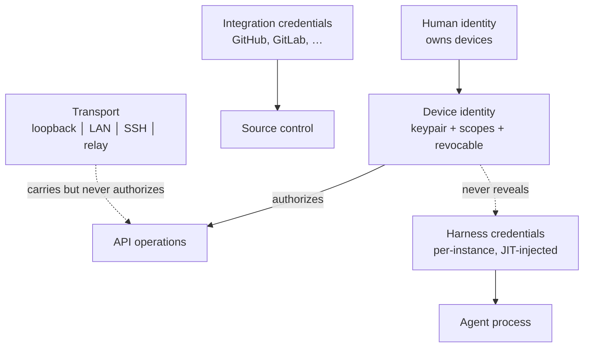
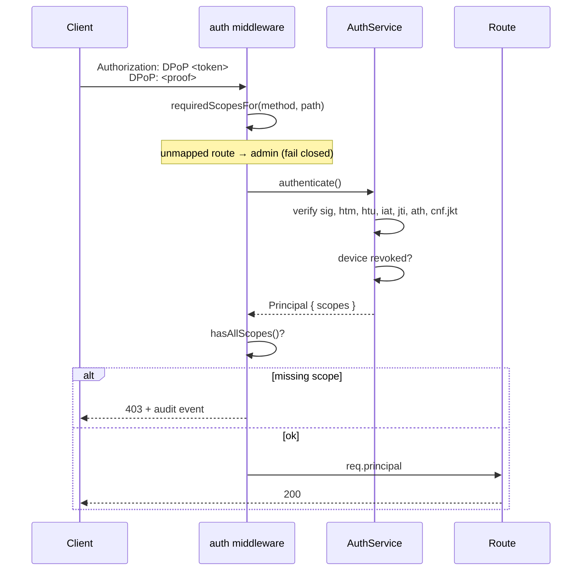
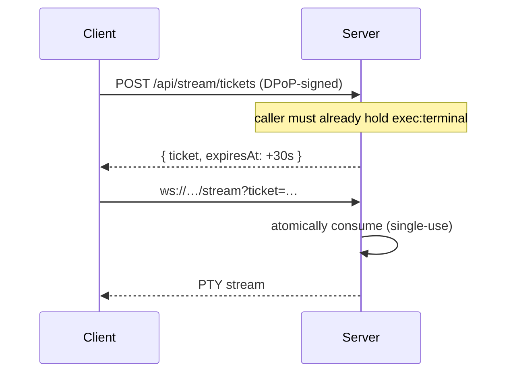
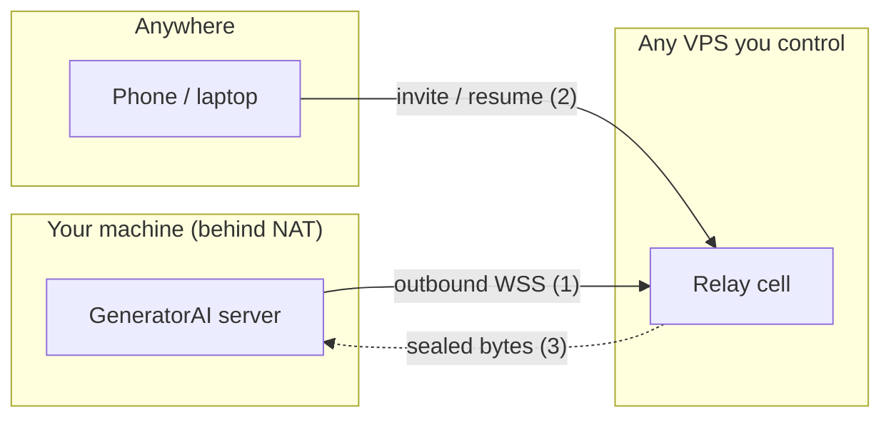

# GeneratorAI Security, Auth & Relay — Implementation Reference

**Status:** Implemented and validated end to end
**Date:** 2026-08-01
**Plan this implements:** [SECURITY_AUTH_RELAY_MOBILE_ARCHITECTURE_PLAN.md](./SECURITY_AUTH_RELAY_MOBILE_ARCHITECTURE_PLAN.md)

This is the *as-built* reference. The plan describes what we intended; this
describes what actually exists, where it lives, how it was verified, and how a
user experiences it.

---

## 1. Verification Summary

| Suite | Command | Result |
|---|---|---|
| Typecheck | `npx turbo typecheck` | **34/34 packages** |
| Unit tests | `npx turbo test --filter='!@generatorai/agent-tests'` | **20/20 tasks** |
| Security invariants | `node scripts/check-security-invariants.mjs` | **8/8 rules** |
| CDP guard | `node scripts/check-no-app-wide-cdp.mjs` | pass |
| Server auth E2E | `node agent-tests/security-e2e.mjs` | **51/51** |
| Relay E2E | `node agent-tests/relay-e2e.mjs` | **17/17** |
| Host pinning E2E | `node --import tsx agent-tests/host-pinning-e2e.mjs` | **10/10** |
| Desktop security | `node agent-tests/desktop-security-smoke.mjs` | **15/15** |
| Harness env isolation | `pnpm --filter @generatorai/agent-harness-providers test` | **31/31** |

Also verified interactively: live web UI (pairing → dashboard → Security panel
→ SSE → terminal WebSocket → device revocation), live CLI (all seven `device`
subcommands), and the real Electron desktop shell.

### Test-running gotchas

- **`host-pinning-e2e.mjs` requires `--import tsx`.** It drives the real client
  runtime by importing its TypeScript source, so assertions cannot drift from
  the shipped implementation.
- **Rebuild the web app before the desktop smoke test.** The shell serves
  `apps/web/dist`; a stale dist silently tests old code.
  Run `pnpm --filter @generatorai/web build` first.
- **Kill stray `electron` processes before the desktop smoke test.** The
  single-instance lock makes a second run hang indefinitely rather than fail.

---

## 2. The Five Independent Planes

The central design rule: these never collapse into one another.



**Transport never implies authorization.** A request arriving over the relay
from another continent passes through byte-identical DPoP verification and
scope checks as one from `127.0.0.1`. That is precisely why the relay is
allowed to be a dumb pipe.

---

## 3. Package Map

| Package | Responsibility |
|---|---|
| `packages/secrets` | `SecretStore` SPI, XChaCha20-Poly1305 vault, KEK providers, `redactDeep()` |
| `packages/auth` | Scopes, principals, DPoP (RFC 9449), tokens, devices, route policy, audit |
| `packages/relay-protocol` | Wire schemas, E2EE, pairing offers, host-proof transcript |
| `packages/client-runtime` | **One** auth engine shared by web, desktop, CLI, and (next) mobile |
| `apps/relay` | Self-hostable director + blind-forwarder cell |

### Key server files

| File | Role |
|---|---|
| `apps/server/src/composition/security.ts` | Fail-closed startup gate, secret store, identity, services |
| `apps/server/src/composition/bootstrapPairing.ts` | First-run pairing grant (0600 file + log) |
| `apps/server/src/middleware/auth.ts` | Principal resolution + scope enforcement |
| `apps/server/src/middleware/wsAuth.ts` | WebSocket upgrade authentication |
| `apps/server/src/routes/auth.ts` | Pairing, refresh, devices, audit |
| `apps/server/src/routes/security.ts` | `/api/security/posture` |
| `apps/server/src/routes/internal-desktop.ts` | Loopback channel for the Electron shell |
| `apps/server/src/relay/RelayHostBroker.ts` | Outbound relay control channel |
| `apps/server/src/relay/RelayStreamBridge.ts` | Pipes relay streams into the local HTTP listener |

### Key client files

| File | Role |
|---|---|
| `packages/client-runtime/src/AuthenticatedClientRuntime.ts` | DPoP, refresh, tickets, pinning |
| `apps/web/src/platform/authTransport.ts` | Global `fetch` interceptor, SSE/WS helpers |
| `apps/web/src/components/AuthGate.tsx` | Pairing screen + desktop auto-pairing |
| `apps/web/src/components/settings/sections/Security.tsx` | Security & Devices panel |
| `apps/cli/src/platform/authRuntime.ts` | Vault-backed CLI device identity |
| `apps/cli/src/commands/device.ts` | `pair`/`status`/`forget`/`list`/`revoke`/`invite`/`audit` |
| `apps/desktop/src/main/secret-protection.ts` | `safeStorage`-protected vault key |

---

## 4. Request Lifecycle



Two properties make this hold up under change:

1. **Unmapped routes fail closed.** `DEFAULT_POLICY` demands admin, so a new
   endpoint is unreachable until it declares a scope policy. The opposite of
   the historical "public unless explicitly guarded".
2. **`cnf.jkt` binding.** A stolen access token is useless without the device
   private key, which never leaves the device.

---

## 5. Streams: The Ticket Exchange

`EventSource` and `WebSocket` cannot send headers. The old design put a
long-lived API key in the URL, where it leaks into access logs, referrers,
browser history and traces.



Because a ticket is single-use, the browser's built-in `EventSource` retry
would present an already-redeemed ticket and be killed permanently. So the
client **owns reconnection**: it mints a fresh ticket and resumes from
`?afterSeq=` so no event is lost in the gap. See
`openAuthenticatedEventSource` in `apps/web/src/platform/authTransport.ts`.

A ticket also cannot be laundered into wider access: minting a `terminal`
ticket requires the caller to already hold `exec:terminal`, and a ticket
cannot mint another ticket.

---

## 6. Remote Access — Broadcast and Connect



1. The server **dials out**. No inbound firewall rule is ever required.
2. A client presents a single-use invite (first contact) or a resume
   credential; the cell matches the two streams.
3. The cell forwards opaque bytes into `127.0.0.1:<port>`, so a remote client
   enters **the same front door** as a LAN client — same DPoP, same scopes,
   same rate limits. There is no second, divergent authorization path.

The relay learns nothing it could act on. Host identity is an Ed25519
signature over a transcript binding the relay origin, its ephemeral key and the
assignment epoch, so a captured proof cannot be replayed at a different relay
or rolled back to an earlier epoch.

**What the relay *can* observe:** connection times, approximate traffic
volume, and opaque host/device IDs. It can also deny service. That is
documented rather than hidden.

---

## 7. Harness Credential Isolation

The most dangerous gap the audit found. Agents execute model-authored shell
commands, so anything in their environment is one prompt injection away from
exfiltration.

```
BEFORE: { ...process.env }  →  agent could read GENERATORAI_SECRET_KEY,
                                GENERATORAI_DESKTOP_ADMIN_TOKEN, GITHUB_TOKEN,
                                DATABASE_URL, AWS_SECRET_ACCESS_KEY, …

AFTER:  buildHarnessEnv()   →  PATH, HOME, LANG, HTTPS_PROXY, …
                             + ONLY this instance's own credential
                             + its own CLAUDE_CONFIG_DIR / COPILOT_HOME
```

Implemented in `packages/agent-harness-providers/src/childEnv.ts`. It is an
**allowlist, not a blocklist** — so a variable added to the server next year is
private by default rather than leaked by default. A CI rule
(`no-parent-env-clone-into-harness`) prevents the pattern from returning.

Each harness instance also gets `<dataDir>/harnesses/<id>/home`, so two
accounts of the same provider never share a credential file or race on writes.

---

## 8. Fail-Closed Startup

`createSecurityContext()` refuses to build a container that would expose an
unsafe API:

| Condition | Outcome |
|---|---|
| loopback + dev + explicit opt-in | Unauthenticated, loudly warned |
| loopback + dev, no opt-in | Authenticated (pairing available) |
| Non-loopback **or** production | Authentication **required**, secret store must be OS-protected |
| `ALLOW_UNAUTHENTICATED_LOOPBACK` off-loopback | `StartupSecurityError` — process does not listen |

The opt-in is an environment variable rather than a config field, so it cannot
be switched on by a checked-in file. Disabling authentication has to be a
deliberate act on the machine that runs the server.

---

## 9. End-to-End User Walkthrough

Meet **Priya** — a developer with a workstation, a laptop and a phone.

### Day 1 — Desktop (zero friction)

She double-clicks GeneratorAI.

Behind the scenes, in about two seconds: Electron unlocks a vault key via
`safeStorage` (Keychain / DPAPI / libsecret) and passes it to the server; the
renderer asks the shell for a pairing code over a loopback channel guarded by a
per-launch token; it generates a **non-extractable** key in IndexedDB and
enrols itself as a device.

> **She sees:** the dashboard. No QR code, no password.

She never types a credential because the app that *started* the server does not
need to prove anything to it.

### Day 2 — Laptop browser over LAN

On the workstation, **Settings → Security & Devices**:

```
Authentication   DEVICE          Secret storage   KEYCHAIN ✓
Listening on     0.0.0.0         Host identity    nshHUplY…HbLiwzw
```

She picks the **"Full workstation"** preset, clicks **Generate pairing code**,
and a QR appears with a 10-minute countdown.

On the laptop she scans it and gets an informed-consent screen:

```
You are about to connect to:
  Server         UI-5CG4400GH2
  Endpoint       http://192.168.1.40:3100
  Host identity  nshHUplY…HbLiwzw     ← she compares this to the workstation

This device will be granted:
  read:chats  write:chats  exec:agent  exec:terminal …
```

She clicks **Connect**. Working.

That fingerprint is the entire trust anchor. If someone later squats on
`192.168.1.40`, the laptop compares identities, **refuses to send its
credential**, and explains why — verified by `host-pinning-e2e.mjs`.

### Day 3 — Phone, from a café

Back home she enables the relay and generates a **Mobile companion** code:

```
✓ read, chat, approve, review
✗ exec:terminal   ✗ exec:browser   ✗ admin:*
```

From the café her phone cannot reach her LAN, so the runtime falls back to the
relay. She reviews a diff and approves a change — over the internet, with no
port forwarded on her home network.

Her phone **cannot** open a terminal. Not because the UI hides the button, but
because minting a terminal ticket requires `exec:terminal`, which her phone was
never granted. Ten negative tests confirm this containment.

### Day 4 — CLI in CI

```console
$ generatorai device invite --name "CI runner" --platform cli --json
$ generatorai device pair "generatorai://pair?code=…"

  Pairing with
    server    UI-5CG4400GH2
    endpoint  http://127.0.0.1:3100
    identity  nshHUplY_yXccZ6Tj0XOjAOec3LHm25kqf7VHbLiwzw
    scopes    read:status, read:chats, exec:agent

  ✓ Paired as "CI runner"

$ generatorai device status
  Status:        authenticated
  Secret store:  encrypted-file/local-file-key

  ⚠ Key-encryption key is stored in a mode-0600 file. Any process running as
    this OS user can read it. Set GENERATORAI_SECRET_KEY /
    GENERATORAI_SECRET_PASSPHRASE, or run inside the desktop shell, to use an
    OS-protected key.
```

That warning is deliberate. The system reports the truth about its own
weaknesses rather than implying it is safer than it is.

### Day 5 — The phone is stolen

**Settings → Security → Revoke** on any trusted device.

- Local registry: revoked **immediately**
- Live relay streams for that binding: killed
- If the relay is offline: queued in a durable outbox and delivered on
  reconnect (`SqliteRelayRevokeOutboxRepository` + `drainRevokeOutbox()`)

Her laptop and CLI are untouched — each device holds its own independent key.

---

## 10. Operational Notes

### Behaviour changes to be aware of

1. **Agent permission default is deployment-aware.** On loopback + dev it stays
   `bypassPermissions` (fully autonomous, as before). Off-loopback or in
   production it defaults to `acceptEdits`, so agents ask before touching the
   host. Override with `GENERATORAI_DEFAULT_PERMISSION_MODE=bypassPermissions`
   — this logs a critical audit event.

2. **`GENERATORAI_API_KEY` still works** but is now modelled as a revocable
   service account and warns on every use. Existing setups keep working; the
   migration path is `generatorai device pair`.

3. **The relay is opt-in and self-hostable.** Nothing contacts a cloud service
   unless you enable it and point it at a host you run.

### Environment variables

| Variable | Purpose |
|---|---|
| `GENERATORAI_SECRET_KEY` | 32-byte base64 KEK for the vault (preferred) |
| `GENERATORAI_SECRET_PASSPHRASE` | Argon2id-derived KEK alternative |
| `GENERATORAI_ALLOW_UNAUTHENTICATED_LOOPBACK` | Dev-only; refuses off-loopback |
| `GENERATORAI_BIND_HOST` | Listener bind address (default `127.0.0.1`) |
| `GENERATORAI_ADVERTISED_URL` | Origin advertised in pairing offers |
| `GENERATORAI_SERVER_NAME` | Human-readable name shown during pairing |
| `GENERATORAI_CONFIG_DIR` | Overrides the CLI config + vault directory |
| `GENERATORAI_DEFAULT_PERMISSION_MODE` | Overrides the posture-derived default |
| `GENERATORAI_DESKTOP_ADMIN_TOKEN` | Set by the Electron shell; never by hand |

### CI gates

`pnpm run check:security` runs both scripts. The eight invariants:

1. `no-long-lived-key-in-url`
2. `no-direct-credential-env-reads`
3. `no-credential-logging`
4. `no-insecure-secret-fallback`
5. `no-unauthenticated-non-loopback-bind`
6. `no-default-bypass-permissions`
7. `no-secret-fields-in-config-schemas`
8. `no-parent-env-clone-into-harness`

A genuine exception is waived per-line with `// security-ok: <reason>`, so it is
explicit and reviewable rather than a silently loosened rule.

---

## 11. Bugs Found by Live Testing

Fourteen real defects were caught by running the system rather than by
compiling it. The most significant:

| # | Bug | Impact |
|---|---|---|
| 1 | CORS did not allow the `DPoP` header nor expose `DPoP-Nonce` | Every cross-origin client would have been broken |
| 2 | Harness children cloned `process.env` | Vault key, admin token, GitHub token and DB credentials reachable by model-authored shell |
| 3 | Host identity pinned but never verified | Pinning was security theatre; a substituted LAN server would have been trusted |
| 4 | Bootstrap pairing printed a live code into the desktop log | Working credential in a log file |
| 5 | Runtime probed the auth-gated `/api/security/posture` | Unpaired clients could never discover an open server |
| 6 | Bypass header leaked into the outbound request | Broke CORS preflight |
| 7 | Runtime never lazily loaded the stored session | Every CLI command failed after a successful pair |
| 8 | CLI unit tests read the developer's real vault | Tests passed or failed depending on who ran them |

---

## 12. Readiness for the Mobile App

The mobile client requires **no new server work**. It implements four things
against contracts that already exist and are tested:

1. Platform secure storage (Keychain / Android Keystore)
2. A QR scanner
3. Pairing consent UI
4. `@generatorai/client-runtime` — the same engine web, desktop and CLI run

`DEFAULT_MOBILE_SCOPES` already excludes `exec:terminal`, `exec:browser` and
all `admin:*`, and the negative tests proving that containment are in place.
