# GeneratorAI — End-to-End System Architecture

> **What this document is.** A complete, plain-language map of how GeneratorAI actually works today,
> written from the code on the `arch-redesign` branch — not from older design documents.
> Every diagram, name, path and flow below was read out of the implementation.
>
> **Who it is for.** Anyone who needs to understand the whole system: a new engineer, a reviewer,
> an operator, or you six months from now. It assumes you can read a diagram and know what an
> HTTP request is. It does not assume you know this codebase.
>
> **How to read it.** Parts 1–5 are the 20-minute overview. Parts 6–11 are the spine of the system
> (clients → server → agent providers → streaming → chat). Parts 12–19 are one feature each.
> Part 20 onwards is reference material. Every part ends with a *"where the code lives"* pointer.

---

## Table of contents

| Part | Title | Read it if you want to know… |
|---|---|---|
| 1 | [What GeneratorAI is](#part-1--what-generatorai-is) | the one-paragraph answer |
| 2 | [The big picture](#part-2--the-big-picture) | how the pieces fit together |
| 3 | [Process topology](#part-3--process-topology--who-runs-where) | what actually runs as an OS process |
| 4 | [Code layout and layering](#part-4--code-layout-and-layering) | where anything lives |
| 5 | [The domain model](#part-5--the-domain-model) | what the nouns mean |
| 6 | [Clients and transports](#part-6--clients-and-transports) | how web/CLI/desktop/mobile connect |
| 7 | [Identity, pairing and permissions](#part-7--identity-pairing-and-permissions) | how auth works |
| 8 | [The server: a request end to end](#part-8--the-server-a-request-end-to-end) | the HTTP path |
| 9 | [The harness layer](#part-9--the-harness-layer--multi-provider-ai) | how we talk to AI providers |
| 10 | [The event and streaming spine](#part-10--the-event-and-streaming-spine) | how a token reaches a screen |
| 11 | [Chat, end to end](#part-11--chat-end-to-end) | the single most important flow |
| 12 | [Workflows and stages](#part-12--workflows-and-stages--the-dag-engine) | the DAG engine |
| 13 | [Automations](#part-13--automations--triggers-loops-and-batches) | schedules, webhooks, batches |
| 14 | [Orchestrator mode](#part-14--orchestrator-mode-and-background-agents) | agents that spawn agents |
| 15 | [Plan mode and human-in-the-loop](#part-15--plan-mode-and-human-in-the-loop) | approval gates |
| 16 | [Workspaces, worktrees, checkpoints, diffs](#part-16--workspaces-worktrees-checkpoints-and-diffs) | where files live |
| 17 | [Right-pane capabilities](#part-17--right-pane-capabilities) | terminal, browser, computer use, widgets |
| 18 | [Voice](#part-18--voice--speech-in-speech-out) | speech-to-text and text-to-speech |
| 19 | [Extensibility and external integrations](#part-19--extensibility-and-external-integrations) | hooks, MCP, skills, tools, SDK, webhooks, push |
| 20 | [Durability and recovery](#part-20--durability-and-recovery) | what survives a crash |
| 21 | [Observability and health](#part-21--observability-and-health) | how you tell if it is healthy |
| 22 | [Configuration and deployment](#part-22--configuration-and-deployment) | how to run it |
| A–D | [Appendices](#appendix-a--the-event-catalogue) | event catalogue, API map, file map, glossary |

---

# Part 1 — What GeneratorAI is

**GeneratorAI is a self-hosted control plane for AI coding agents.**

You point it at one or more AI agent providers — GitHub Copilot, Claude, Codex, OpenCode, or any
agent that speaks the Agent Client Protocol. It then gives you four things on top of them:

1. **Chat** — a normal conversation with an agent, but with a real workspace behind it: git worktrees,
   checkpoints, a diff view, an embedded terminal, an embedded browser, and optional control of your
   actual desktop.
2. **Workflows** — a directed graph of prompt "stages" that run in dependency order, with retries,
   conditions, sub-workflows, loops, and approval gates.
3. **Automations** — workflows on a trigger: a cron schedule, a webhook, or a dataset iterated row by row.
4. **Orchestration** — one agent that spawns, monitors and consolidates the work of many background agents.

It runs entirely on your own machine or your own server. There is no GeneratorAI cloud. The database
is a local SQLite file. Speech recognition and speech synthesis run locally on CPU. The only outbound
network calls are to the AI provider you chose and to any git remotes you configure.

Four client surfaces talk to one server — a **web app**, a **native desktop app**, a **terminal
CLI/TUI**, and a **mobile companion app** — and they all speak the same HTTP + streaming API, so
no feature is exclusive to one of them.

---

# Part 2 — The big picture

## 2.1 System context

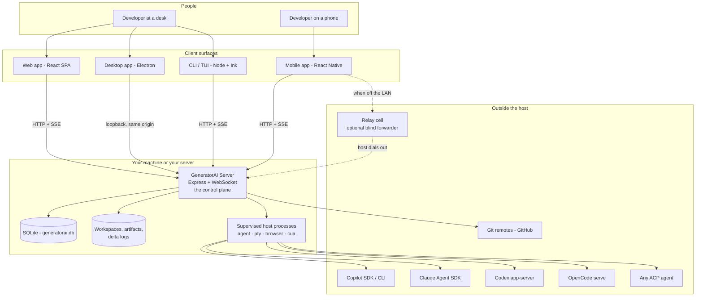

**The single most important rule in this picture:** the server is the only thing that holds state.
Clients are views. Close every client and work keeps running; reconnect and you get the history back
from the durable event log.

## 2.2 The rules everything else follows

These are enforced in code — by types, by the lint scripts under `scripts/check-*.mjs`, and by tests —
not by convention.

| # | Rule | What it means in practice |
|---|---|---|
| **R1** | **Tokens are not database rows.** | Streaming deltas (tokens, progress ticks) go to a rotating append-only file, not SQL. Only *completed* items are transactional and queryable. |
| **R2** | **Every queue is bounded and states its overflow behaviour in code.** | It either applies backpressure to its producer, or it drops with a visible gap marker. Never "grow until something breaks". |
| **R3** | **Native handles never live in the control plane.** | PTYs, browsers, desktop drivers and provider runtimes live in separate supervised OS processes. |
| **R4** | **Capabilities are declared, never discovered by throwing.** | A provider or host publishes what it supports; callers branch on the declaration. Defaults fail closed. |
| **R5** | **One core, N surfaces, one contract.** | Web, desktop, CLI and mobile share the same API, the same event router and the same stream reducer. They differ only at the entry point. |
| **R6** | **Transport never implies authorization.** | A request over loopback is authorized exactly like one over the relay. There is no "it came from localhost so it must be fine" path. |
| **R7** | **Recovery reads state, it never infers it.** | Every durable operation writes its complete current state after each step, so restart logic switches on a value instead of guessing from what is missing. |
| **R8** | **A terminal run never restarts.** | Retrying a finished run creates a *new* run that references its ancestor. |

---

# Part 3 — Process topology — who runs where

GeneratorAI is deliberately **not** one process. Anything that can hang, leak a native handle, or be
killed by the OS is pushed out of the control plane.

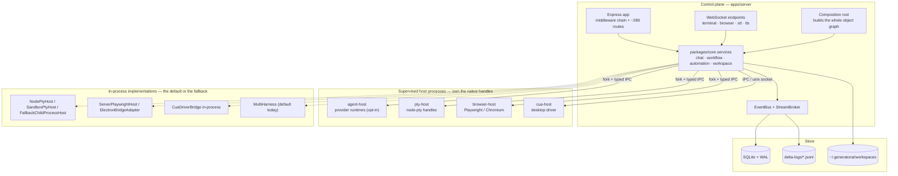

## 3.1 What each host owns

| Host | Owns | Entry point | Why it is separate |
|---|---|---|---|
| `agent-host` | Provider runtimes, session demux, per-session queues, runtime supervisor | `apps/agent-host/src/index.ts` | A wedged provider must not stall every other session. **Opt-in** via `GENERATORAI_AGENT_HOST=true`; the default today is the in-process `MultiHarness`. |
| `pty-host` | `node-pty` file descriptors, a headless terminal model for scrollback | `apps/pty-host/src/index.ts` | A PTY leak or a native crash is contained. |
| `browser-host` | Playwright/Chromium browser contexts | `apps/browser-host/src/index.ts` | Chromium is heavy and does crash; it gets its own address space. |
| `cua-host` | The `cua-driver` connection that controls your real desktop | `apps/cua-host/src/index.ts` | On macOS the driver must sit inside the signed app's spawn chain to be granted Accessibility and Screen Recording. |

## 3.2 How a host is supervised

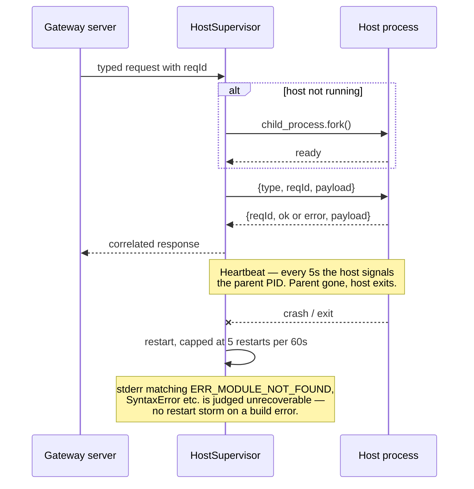

Combined with `killOwnDescendants()` on the server's shutdown path and a boot-time
`reapOrphanedHarnessChildren()`, this is what prevents the "two dozen orphaned agent processes"
failure class.

**Where the code lives:** `packages/core/src/infrastructure/HostSupervisor.ts`,
`packages/agent-harness-providers/src/{AgentHostSupervisor,childRegistry}.ts`,
`packages/shared/src/ipc/*Ipc.ts` (the four IPC contracts).

---

# Part 4 — Code layout and layering

## 4.1 The four layers

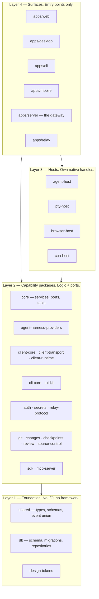

**The layering rules, and why each exists**

| Rule | Why |
|---|---|
| Layers 1–2 may not import Express, Electron, `better-sqlite3` or `node-pty` | Otherwise the same service cannot run in the gateway, inside a host process, *and* in a unit test. |
| Layer 2 depends on **ports**; implementations are injected at the composition root | The core never branches on which implementation is loaded. |
| Layer 3 hosts may not import each other | A browser bug cannot take down terminals. |
| Every surface consumes `client-core` | This is what makes "one core, N surfaces" true rather than aspirational. |

## 4.2 The workspace map

**Applications (`apps/`) — 10**

| App | What it is |
|---|---|
| `server` | The control plane. Express + WebSocket. Everything else is a client or a host of this. |
| `web` | React 19 SPA — Vite, React Router, TanStack Query, Zustand, Tailwind with shadcn-style primitives. |
| `desktop` | Electron shell that launches the server as a supervised child process and opens a window on its loopback URL. Adds native browser tabs with a per-tab scoped CDP proxy, the computer-use host, tray, deep links and auto-update. |
| `cli` | One binary, three surfaces: scriptable commands, an interactive TUI (Ink), and a machine "companion" gateway. |
| `mobile` | React Native / Expo companion: chat, runs, diffs, approvals, push notifications, voice. |
| `relay` | Optional blind-forwarding rendezvous so a phone off the LAN can reach your host without an inbound firewall rule. |
| `agent-host` `pty-host` `browser-host` `cua-host` | The supervised native-handle hosts from Part 3. |

**Packages (`packages/`) — 20**

| Package | Role |
|---|---|
| `shared` | The foundation. Domain types, Zod config schemas, the `AgentEvent` union, event classification, IPC contracts, telemetry helpers. Zero runtime dependencies on anything else in the repo. |
| `db` | Drizzle schema (41 declared tables), 44 sequential migrations, one repository class per aggregate. |
| `core` | The brain. 70 service files, 34 port interfaces, the DAG engine, state machines, tool sets, permissions, the event bus, infrastructure adapters. |
| `agent-harness-providers` | The five AI provider adapters plus the registry, the router and the hardening layer. |
| `auth` | DPoP, device pairing, tokens, scopes, route policy, the security audit log. |
| `client-core` | The **shared client brain**: API client, SSE parser, multiplexed stream client, event router, stream reducer, diff parser. Used by web, CLI and mobile. |
| `client-transport` | How a client reaches a host: loopback / LAN / SSH / relay adapters, endpoint supervisor, jittered backoff. |
| `client-runtime` | Credentials — device keypairs, pairing, DPoP proof generation, per-platform key stores. |
| `cli-core` | The CLI command registry (one declaration, five derived consumers) plus view models. |
| `tui-kit` | Ink components: screen, split, tabs, panel, composer, status bar, keymap hooks, theming. |
| `git` | A thin, testable git client behind a port. |
| `changes` | "What changed?" — change sets, summaries, repo discovery, workspace file tree. |
| `checkpoints` | Workspace snapshots stored as private git refs, with restore and retention. |
| `review` | Review threads and comments anchored to file positions that survive later edits. |
| `source-control` | Provider registry plus the GitHub provider (pull requests, repo slugs). |
| `secrets` | Encrypted-at-rest secret store with a pluggable key provider. |
| `relay-protocol` | The relay wire protocol and the end-to-end encryption layer. |
| `sdk` | Embed GeneratorAI in your own Node program: `createGeneratorAI()` plus 12 facades. |
| `mcp-server` | Advertise our tool registry over MCP (adapter complete; HTTP transport deferred). |
| `design-tokens` | One palette definition emitted three ways — CSS variables (web), ANSI (TUI), native objects (mobile). 17 theme families. |

---

# Part 5 — The domain model

## 5.1 How the entities relate

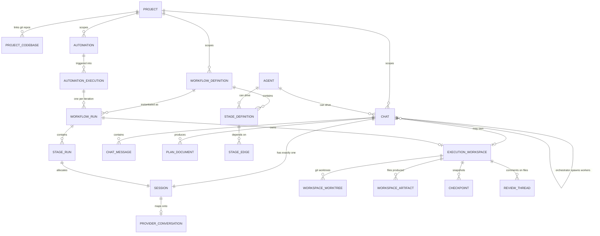

## 5.2 What each noun means

| Noun | Plain meaning | Lifecycle |
|---|---|---|
| **Project** | A named container linking one or more git repositories ("codebases") plus shared config, skills, prompts and agents. | Long-lived. |
| **Codebase** | One git repository linked to a project, under an alias. | Long-lived. |
| **Chat** | One conversation. Owns exactly one Session and optionally one workspace. Carries a mode (`auto` / `plan`), a permission mode, an optional agent, an optional browser config and an orchestrator flag. | `active` → `archived`. |
| **Session** | A thin wrapper over one provider conversation. Carries `conversationId`, status, and who owns it (`chat`, `stage_run` or `workflow_run`). | `created → active → paused → closing → closed` (or `error`). |
| **Agent** | A user-authored bundle: instructions + capability policy (tool groups, skills, MCP servers) + runtime policy (model, effort, permission mode), addressed as `scope:slug` where scope is `system`, `global` or `project`. Can drive a chat, a stage or an orchestrator worker. | Versioned; soft-deletable. |
| **Workflow definition** | A DAG of stages. Each stage is a prompt list (or a sub-workflow, or a loop) with retries, conditions, hooks, variables and an optional agent. | Versioned. |
| **Workflow run** | One execution of a definition. Owns a workspace, produces stage runs. | `created → starting → running → paused/cancelling → completed/failed/cancelled`. Retry creates a **new** run with `ancestorRunId` set. |
| **Stage run** | One stage executing. Allocates a Session, sends prompts, may sleep, may wait for a human. | `pending → queued → running → (sleeping / awaiting_input) → completed / failed / cancelled / skipped`. |
| **Automation** | A workflow plus a trigger (`manual` / `schedule` / `webhook`) and an input mode (`single` / `loop` / `batch` / `script`). | Enabled / disabled. |
| **Execution workspace** | A directory on disk holding worktrees, artifacts and capability state for a chat or a run. | Created on demand; torn down in ordered phases. |
| **Checkpoint** | A snapshot of a workspace repo stored as a private git ref, so you can restore what an agent changed. | Retained by policy. |

## 5.3 The database

- **Engine.** SQLite via `better-sqlite3` and Drizzle ORM, WAL mode, a single file (default
  `~/.generatorai/generatorai.db`).
- **Shape.** About 60 live tables. 41 of them are declared in the Drizzle schema
  (`packages/db/src/schema.ts`); the rest — auth, relay, SSH, push and provider-routing tables — are
  created by raw SQL inside the migrations and reached through their own repository classes. There are
  44 forward-only migrations in `packages/db/src/migrations/index.ts`, tracked in `_schema_versions`.
- **Seam for other engines.** `GENERATORAI_DATABASE_URL` selects a driver. Non-SQLite URLs are
  recognised and throw a clear "not yet wired" error rather than silently misbehaving.
- **Access pattern.** One repository class per aggregate (`DrizzleChatRepository`,
  `DrizzleWorkflowRunRepository`, …), each behind a port interface in `packages/core/src/domain/ports/`.

**The tables, grouped**

| Group | Tables |
|---|---|
| Streaming | `stream_cursors`, `stream_sequences`, `stream_meta`, `events`, `event_sequences` |
| Chat | `chats`, `chat_messages`, `sessions`, `session_allocations` |
| Plans and HITL | `plan_documents`, `plan_revisions`, `plan_comments`, `agent_interactions` |
| Workflows | `workflow_definitions`, `stage_definitions`, `stage_edges`, `workflow_runs`, `stage_runs`, `stage_session_maps`, `workflows` |
| Automations | `automations`, `automation_executions`, `automation_execution_runs`, `idempotency_keys` |
| Durability | `registers`, `entries` |
| Projects | `projects`, `project_codebases`, `project_configs`, `worktrees`, `system_configs` |
| Workspaces | `execution_workspaces`, `workspace_worktrees`, `workspace_artifacts`, `checkpoints` |
| Review | `review_threads`, `review_comments` |
| Agents and UI | `agents`, `widget_instances`, `artifacts` |
| Computer use | `computer_use_grants`, `computer_use_audit` |
| Webhooks | `webhook_registrations`, `webhook_deliveries` |
| Auth *(migration SQL)* | `auth_devices`, `auth_device_credentials`, `auth_pairing_grants`, `auth_service_accounts`, `auth_stream_tickets`, `auth_nonces`, `auth_replay_entries`, `signed_links`, `security_audit_events`, `device_push_tokens` |
| Relay / SSH *(migration SQL)* | `relay_revoke_outbox`, `ssh_targets`, `ssh_host_keys` |
| Provider routing *(migration SQL)* | `conversation_ownership`, `conversation_instance_ownership`, `harness_instances` |

---

# Part 6 — Clients and transports

## 6.1 The four surfaces, and what they share

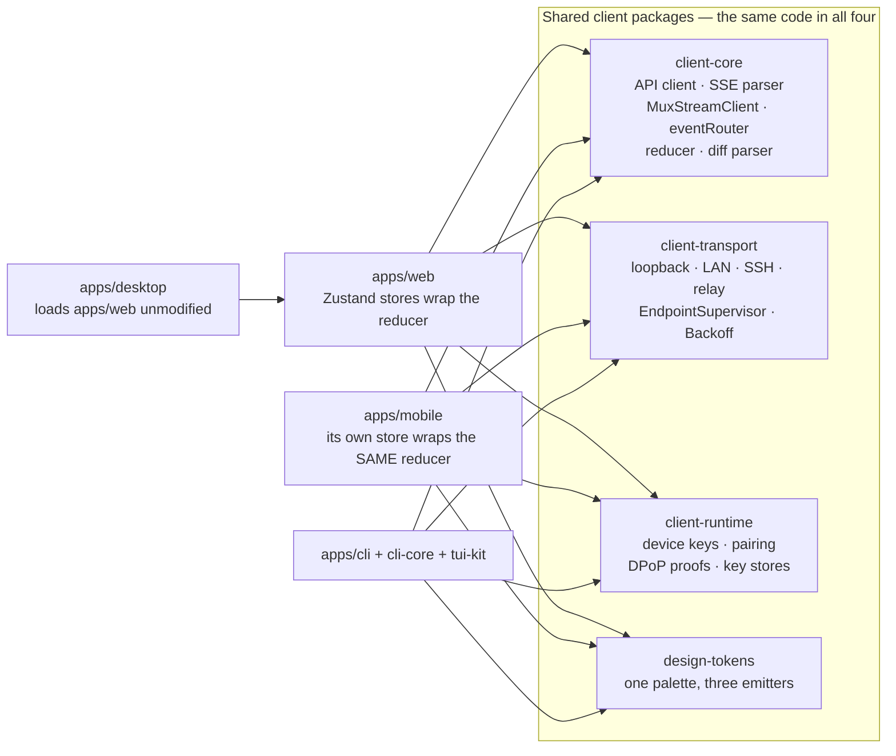

The pure stream reducer in `packages/client-core/src/stream/reducer.ts` is the clearest example of
rule R5. Web wraps it in Zustand; mobile wraps the identical functions in its own store. They cannot
diverge in behaviour because there is only one implementation.

## 6.2 What each surface adds

| Surface | Entry | What is specific to it |
|---|---|---|
| **Web** | `apps/web/src/main.tsx` | Route-level code splitting, TanStack Query for REST caching, a right-pane store for the diff/terminal/browser/computer panes, widget iframes served from a separate origin. |
| **Desktop** | `apps/desktop/src/main/index.ts` | Starts the server as a **child process** (so a backend crash restarts the backend, not the app) and opens a window on that loopback URL, which serves the built SPA same-origin. Adds native browser tabs backed by a **per-tab scoped CDP proxy**, an embedded computer-use host, tray, deep links (`generatorai://`), downloads and auto-update. |
| **CLI/TUI** | `apps/cli/src/index.tsx` | Three surfaces behind one binary — see 6.3. |
| **Mobile** | `apps/mobile` | Expo; uses `expo/fetch` because React Native's default `fetch` has no readable stream body. Push notifications, on-device voice capture, native diff rendering. |

## 6.3 The CLI: one declaration, five derived surfaces

Everything a user can invoke is declared **once** as a `CommandSpec`, and five consumers are derived
from that declaration, so they cannot drift from each other:

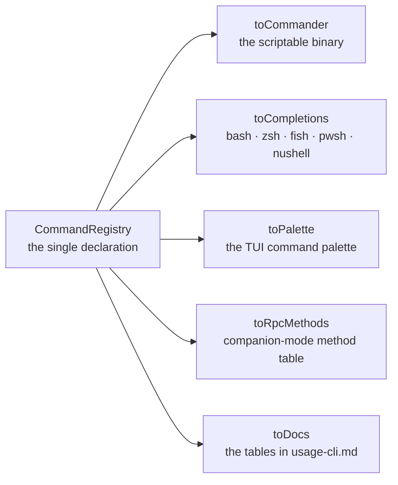

The binary has three modes:

- `generatorai <group> <verb>` — scriptable, deterministic, pipeable (`--json`, `--ndjson`, `--yaml`, `-q`).
- `generatorai` on a TTY (or `-i` / `tui`) — the interactive workbench: tabs, a split pane tree, a
  composer, a status bar, a leader-key modal keymap. Panes include dashboard, chat, run, automation,
  workflow, changes, workspace, command, inspector, settings, terminal, browser and computer.
- `generatorai companion --stdio` — a machine gateway. Every registry command becomes an RPC method,
  **plus** host-side actions the server cannot perform because it may be on another machine: open a
  file, run an allowlisted command, read the clipboard, raise a notification. It listens on stdio or
  a `0600` socket — never a TCP port — authenticates with a nonce handed over by the parent process,
  and appends every `host.*` call to an audit log.

## 6.4 Transports — how bytes reach the host

A transport answers exactly one question: *given a request path, how do bytes get to the host and back?*
It knows nothing about credentials. That separation is what lets the same auth code work over
loopback, LAN and a blind relay.

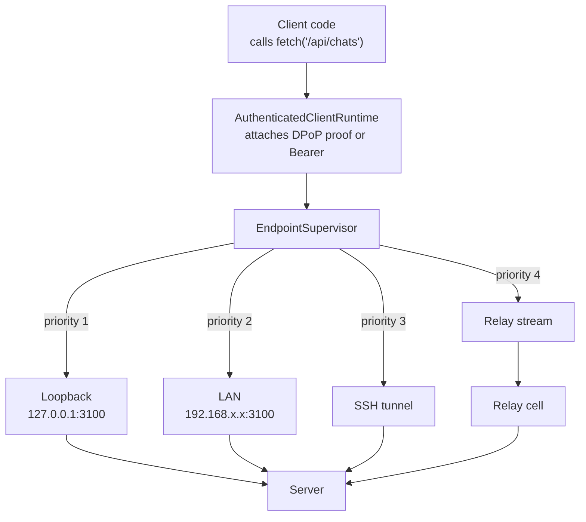

`EndpointSupervisor` does four things: tries candidates in priority order (LAN before relay — faster,
and it keeps traffic off a third party entirely); **verifies the host's pinned identity before any
credential is sent** by calling the unauthenticated `GET /api/auth/server-info`; retries with bounded
jittered backoff; and fails over to the next candidate when one is unreachable. If the identity key
changed, it raises `HostIdentityMismatchError` rather than silently re-pairing.

## 6.5 The relay — reaching your host from anywhere

The relay exists so a phone on cellular data can reach a laptop behind NAT **without any inbound
firewall rule**.

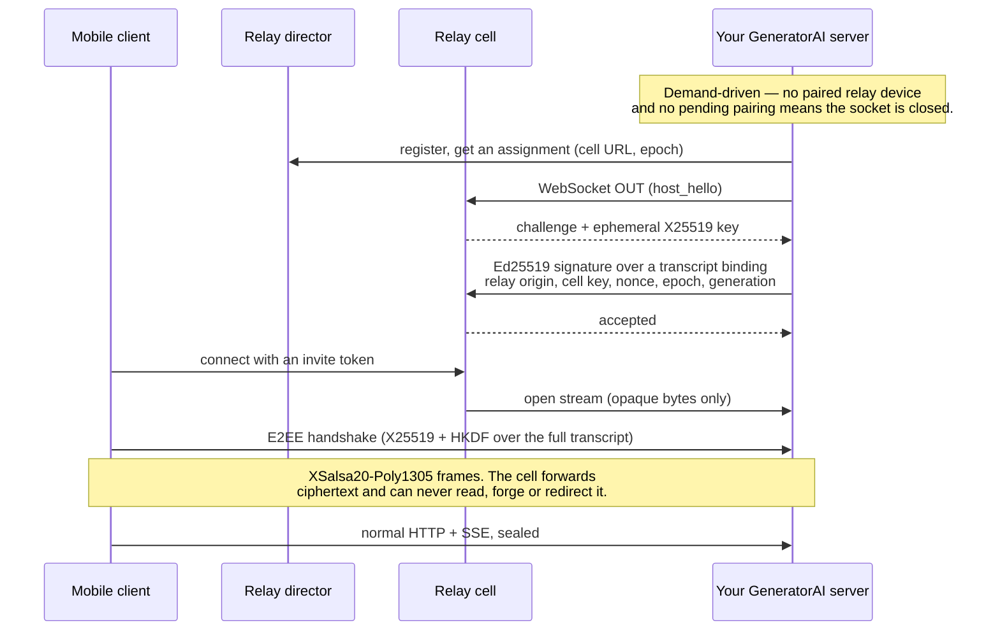

The transcript binds protocol version, both public keys, both nonces, the framing, **the transport kind
and the host identity**. A relay that tries to present itself as a different host, or to downgrade
`relay` to `direct`, produces a different key and the handshake simply fails to decrypt. A malicious
relay can observe metadata and deny service; it cannot read or tamper with traffic.

**Where the code lives:** `packages/client-transport/`, `packages/client-runtime/`,
`packages/relay-protocol/{relayProtocol,e2ee}.ts`, `apps/relay/src/cell.ts`,
`apps/server/src/relay/{RelayHostBroker,RelayStreamBridge}.ts`.

---

# Part 7 — Identity, pairing and permissions

## 7.1 Who can be making a request

There is no user database. Identity is per **device** and per **service account**.

| Principal type | Who it is | Typical credential |
|---|---|---|
| `local-desktop` | The trusted in-process/loopback desktop shell | Handshake token |
| `paired-device` | A browser, phone or CLI holding a device keypair | DPoP access token |
| `service-account` | CI, automation, a webhook client, the legacy global API key | Bearer secret |
| `signed-link` | A narrowly scoped share link | Signed link token |
| `internal-service` | The relay connector, the embedded SDK | In-process |
| `user-session` | Reserved for a future OIDC phase | — |

## 7.2 Credentials, in the order they are accepted

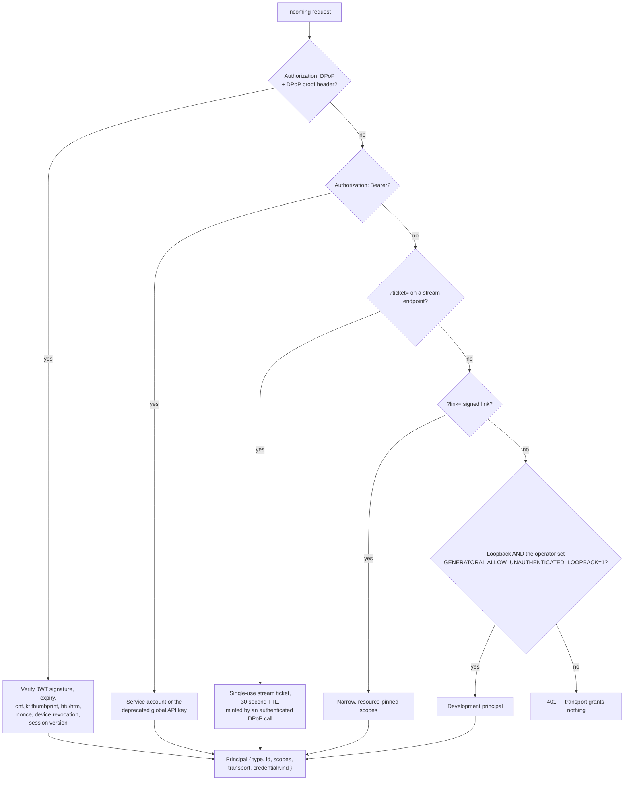

Two properties matter and are enforced:

- **Sender-constrained tokens.** A DPoP access token is bound to the device's public key thumbprint.
  Stealing the token is not enough; you also need the private key that signs each proof.
- **Terminal credentials.** A `stream-ticket` or `signed-link` principal can never mint another
  credential (`canMintDerivedCredentials()` returns false), so one leak cannot become an endless chain.

## 7.3 Device pairing

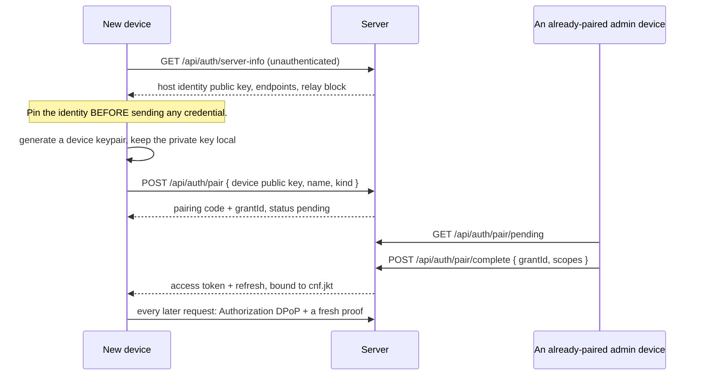

Default scope grants differ by device kind, and admin/exec scopes are never granted implicitly:

| Grant | Includes | Deliberately excludes |
|---|---|---|
| `DEFAULT_DEVICE_SCOPES` (browser/desktop) | reads, `write:chats`, `write:workflows`, `write:reviews`, `stream:events`, `exec:agent` | all `admin:*`, `exec:terminal`, `exec:browser`, `exec:computer` |
| `DEFAULT_MOBILE_SCOPES` | as above minus `write:workflows` | same |
| `DEFAULT_CLI_SCOPES` | device scopes plus `write:projects`, `write:workspaces`, `write:files`, `exec:terminal` | `exec:browser`, `exec:computer`, all `admin:*` |

## 7.4 The scope table

```
read:status  read:projects  read:workspaces  read:chats  read:workflows  read:files  read:reviews
write:projects  write:workspaces  write:chats  write:workflows  write:files  write:reviews
stream:events
exec:agent  exec:terminal  exec:browser  exec:computer
admin:harnesses  admin:credentials  admin:devices  admin:settings  admin:relay
```

Every REST route, SSE subscription and WebSocket upgrade maps to one or more of these in
`packages/auth/src/routePolicy.ts`. **Unclassified routes fail closed** — they require
`admin:settings`. Public routes (health, webhooks, pairing bootstrap) are declared explicitly.

`exec:computer` is separate from `exec:browser` because it authorises control of the physical machine,
and separate from `exec:agent` so that approving an agent's *question* never implies approving its
access to your desktop.

## 7.5 The permission ladder inside a turn

Authorization answers "may this caller reach this endpoint". A second, independent ladder answers
"may this agent run this tool".

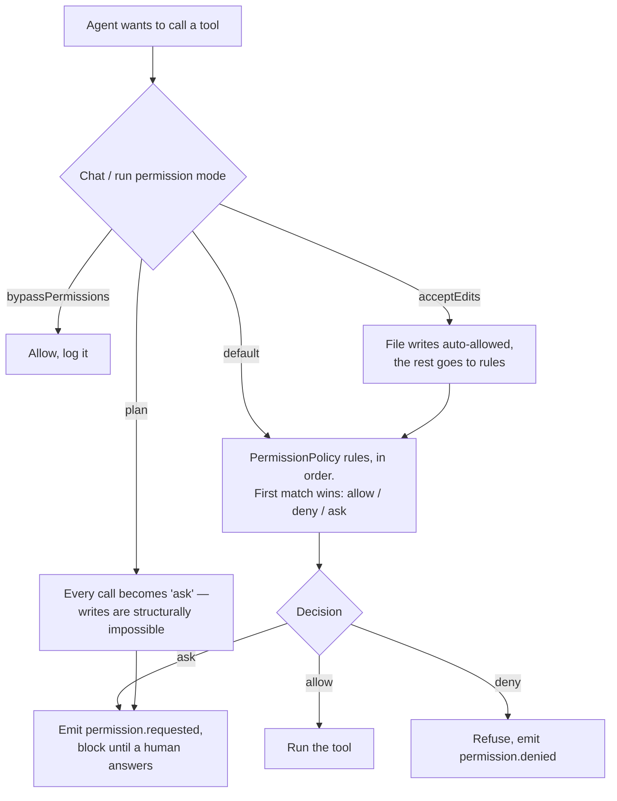

Capability-specific gates sit on top of this — a computer-use action passes a kill switch, a blocklist,
a tier gate and a stored consent grant before it is even admitted (Part 17.3).

**Where the code lives:** `packages/auth/*`, `apps/server/src/middleware/{auth,wsAuth}.ts`,
`packages/core/src/permissions/*`, `apps/server/src/composition/security.ts`.

---

# Part 8 — The server: a request end to end

## 8.1 Boot sequence

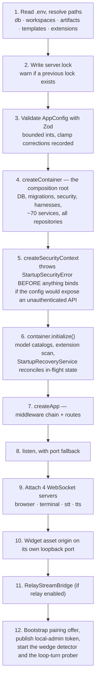

The ordering is deliberate: security posture is decided **before** the listener binds, so the process
never serves a single request in a configuration it would have refused.

## 8.2 The middleware chain

```mermaid
graph LR
  R["Request"] --> M1["requestId"]
  M1 --> M2["requestMetrics — OTel"]
  M2 --> M3["CORS — configured origins<br/>+ widget origin + reachable origins"]
  M3 --> M4["CSP — hash-source script-src,<br/>no unsafe-inline"]
  M4 --> M5["Body parsers<br/>JSON 2MB · urlencoded 1MB · 100 params<br/>raw body captured only on webhook paths"]
  M5 --> M6["/api auth gate<br/>Principal + route→scope, fail closed"]
  M6 --> M7["/api rate limit<br/>600/key/min, 6000 global"]
  M7 --> M8["Internal desktop routes<br/>/internal/browser · /internal/computer · /internal/desktop<br/>loopback + per-launch bearer, NOT the API gate"]
  M8 --> M9["/api router — ~280 handlers"]
  M9 --> M10["Static files (production)"]
  M10 --> M11["Error handler"]
```

## 8.3 The API surface

Roughly 280 handlers across 32 route modules, all mounted under `/api`:

| Area | Mount | Highlights |
|---|---|---|
| Chats | `/api/chats` | create, list, send, cancel, messages, background tasks, plans, plan decisions, interactions, permission mode |
| Agents | `/api/agents` | CRUD, import/export, preview the resolved projection |
| Workflow definitions | `/api/workflow-definitions` | CRUD, stages, edges |
| Workflow runs | `/api/workflow-runs` | start, pause, resume, retry, cancel, per-stage controls, interrupts, approvals, scratchpad |
| Orchestrator | `/api/orchestrator` | system workflows, from-template, runs, run context, uploads, workspace browse/download/diff |
| Projects | `/api/projects` | CRUD, codebases, configs, worktrees |
| Automations | `/api/automations` | CRUD, triggers, executions, data-source tests |
| Workspaces | `/api/workspaces` | files, tree, artifacts, checkpoints, changes; `/:id/review` nests review threads |
| Capabilities | `/api/workspaces/:id/{browser,terminals,computer}` | scoped to the owning workspace |
| Harness | `/api/harness` | provider readiness, live model catalogs, switch the primary |
| Widgets/Extensions | `/api/widgets`, `/api/extensions`, `/api/widget-assets` | agent-rendered UI |
| Streaming | `/api/stream` | tickets, connections, subscriptions, the SSE feed, REST replay |
| Auth/Security | `/api/auth`, `/api/security` | pairing, devices, scopes, rotation, push tokens, audit |
| Ops | `/api/health`, `/api/openapi.json`, `/api/docs` | health payload, generated OpenAPI, Swagger UI |
| Webhooks | `/api/webhooks`, `/api/automations/webhooks` | HMAC-verified inbound triggers |

Unknown `/api/*` paths return a structured `404 NOT_FOUND` rather than falling through to the SPA.

## 8.4 The composition root

`apps/server/src/composition-root.ts` (~2,400 lines) is the only place the object graph is assembled.
It is long on purpose: dependency wiring lives in one readable file instead of being scattered through
decorators and service locators.

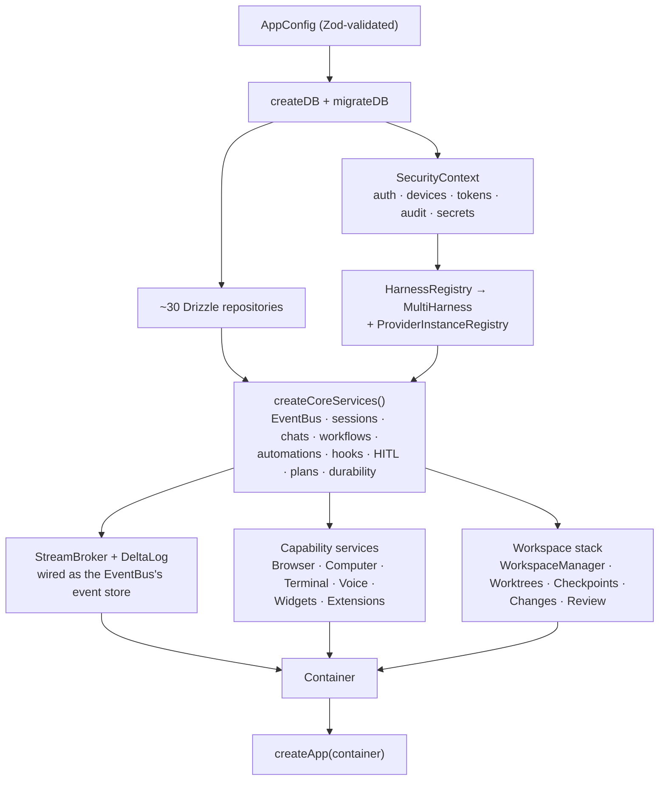

`packages/core/src/bootstrap/createCoreServices.ts` is the shared half — the CLI's direct mode and the
embedded SDK build the same graph from the same factory, so a signature change is one edit, not three.

**Where the code lives:** `apps/server/src/{index,app,composition-root}.ts`,
`apps/server/src/routes/index.ts`, `apps/server/src/middleware/*`.

---

# Part 9 — The harness layer — multi-provider AI

This is the heart of the system: the layer that lets one chat run on Claude while another runs on
Copilot, in the same process, at the same time.

## 9.1 The port

Everything in `packages/core` talks to AI through exactly one interface, `IAgentHarness`. No provider
SDK type ever reaches core. The interface is composed from five smaller capability interfaces:

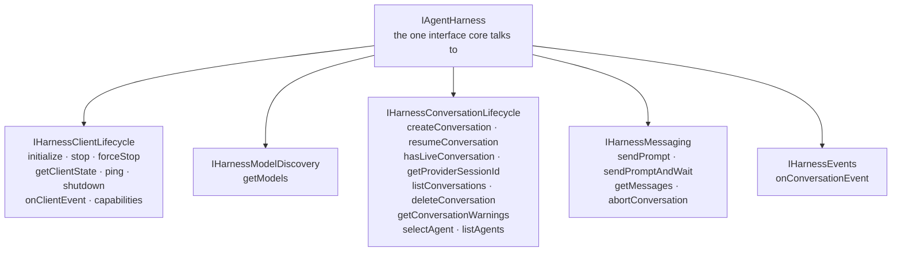

Three details in this port carry a lot of weight:

- **`capabilities()`** returns a declared struct (rule R4). Callers branch on it rather than trying a
  feature and catching an error. Everything defaults to false.
- **`resumeProviderSessionId`** on `CreateConversationParams`. `conversationId` is *our* id; every
  provider also keeps an id of its own that actually carries the message history. When a runtime is
  recycled, that id is read from the outgoing adapter and handed to the new one — otherwise the model
  silently starts over with no memory of the chat.
- **`getConversationWarnings()`** returns machine-readable codes
  (`FIELD_UNSUPPORTED_BY_PROVIDER`, `FIELD_COERCED`, `AGENT_NOT_REGISTERED`) so configuration that a
  provider silently dropped is surfaced instead of lost.

## 9.2 The routing stack

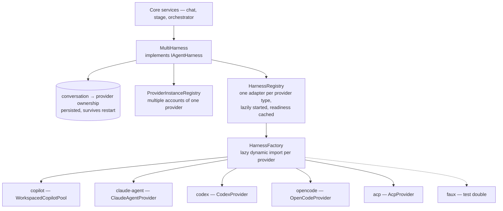

**How a conversation is routed** — and why it matters:

1. If the conversation has a persisted `providerInstanceId`, that wins. (Routing a conversation to the
   wrong provider hands an SDK a session id it has never seen.)
2. Otherwise, if `harnessType` was named explicitly, use it.
3. Otherwise, resolve the provider that owns the requested `model` from the merged catalog.
4. Otherwise, fall back to the primary provider.

If a conversation is bound to a provider instance that no longer exists, `MultiHarness` throws
`ProviderInstanceUnavailableError` rather than falling back to another account — resuming a cursor
issued by account A against account B would be a cross-account data leak, not a graceful degradation.

## 9.3 The five providers

| Provider | Wire protocol | Notes |
|---|---|---|
| **copilot** | GitHub Copilot SDK over stdio | Runs as `WorkspacedCopilotPool` — one CLI process **per workspace**, LRU-evicted, cold starts gated by a shared semaphore so opening many workspaces does not produce a thundering herd. |
| **claude-agent** | Anthropic Claude Agent SDK | Native plan mode, `canUseTool` permission routing, hook events, file checkpointing, per-instance `CLAUDE_CONFIG_DIR` so a work and a personal account can run side by side. |
| **codex** | Codex `app-server`, JSON-RPC over stdio | `thread/start` → `turn/start`, streamed as `item/*` and `turn/*` notifications; cancel is `turn/interrupt`. Answers the server's approval requests (fail-closed). Types generated into `protocol/codex.generated.ts`. |
| **opencode** | OpenCode `serve`, HTTP + JSON, plus one server-wide SSE stream | The prompt route returns JSON; streaming comes from a single shared `GET /event` subscription, demultiplexed by session. No default port — `opencode serve` binds an ephemeral one, so you pass `baseUrl` or let the provider start a server and read the address back. Types generated into `protocol/opencode.generated.ts`. |
| **acp** | Agent Client Protocol, JSON-RPC over stdio | The breadth tier — any long-tail agent that speaks ACP. Schema in `protocol/acp.generated.ts`. |
| *faux* | none | Deterministic test double used by the conformance suite. |

Provider modules are **lazily dynamically imported** and cached. If you never select `claude-agent`,
the Claude SDK is never loaded and does not need to be installed. A missing optional SDK produces an
actionable message ("run `pnpm add …`"), marks that provider unavailable, and the server still starts.

## 9.4 Readiness — what "ready" actually means

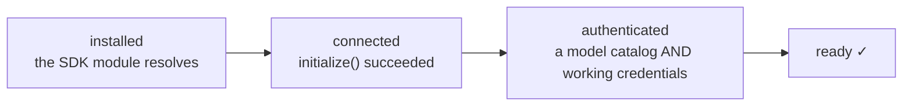

Listing models is necessary but not sufficient: the Claude CLI answers `supportedModels()` from a local
table even with no credentials, so a catalog-only check reported a logged-out provider as ready and the
picker happily offered models whose every turn failed. Providers that can report account state are
therefore asked for it, and `credentialFailure()` only reports "logged out" on **positive** evidence —
an absent field is never treated as a verdict.

Status refresh is demand-gated: `statusSnapshot()` reads synchronously, `requestRefresh()` is
fire-and-forget, and a disk cache means a cold boot returns stale-but-useful data instantly rather than
blocking the composer for ~20 seconds behind a full cold probe.

## 9.5 Provider event mapping

Each adapter maps its vendor's native events onto the shared `AgentEvent` union:

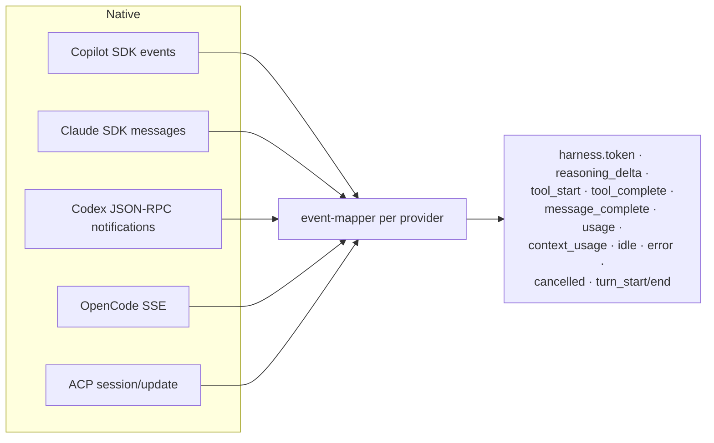

Anything a mapper does not recognise becomes `harness.unknown` carrying the raw payload — never
silently dropped, and never guessed at.

## 9.6 The hardening layer

Sitting between the router and each adapter, `packages/agent-harness-providers/src/hardening/`
enforces limits that no provider SDK guarantees:

| Module | What it protects against |
|---|---|
| `byteCap` | A tool result or a message that would blow up memory |
| `truncation` | Oversized payloads, truncated with a visible marker |
| `contextLedger` | Context growing anywhere but at the tail — an insertion before the previous request's tail invalidates the provider's prompt cache and multiplies cost |
| `semanticCancel` | User "stop" being reported as an error; it becomes `harness.cancelled` with a reason |
| `lateUpdateGuard` | Events arriving after a turn has ended reviving a terminal state |
| `poisonPill` | A payload that repeatedly crashes an adapter being retried forever |
| `approvalGate` | Tool calls escaping the permission ladder |
| `fanout` | Unbounded subscriber fan-out |
| `toolSemaphore` | Too many concurrent tool executions per session |

There is also a **conformance suite** (`src/conformance/`) that every provider is run against, so
"this provider implements the port" is a test result rather than an assertion.

## 9.7 The optional agent-host

When `GENERATORAI_AGENT_HOST=true` and the build exists, `AgentHostClient` replaces `MultiHarness` on
the gateway side and provider runtimes move into `apps/agent-host`:

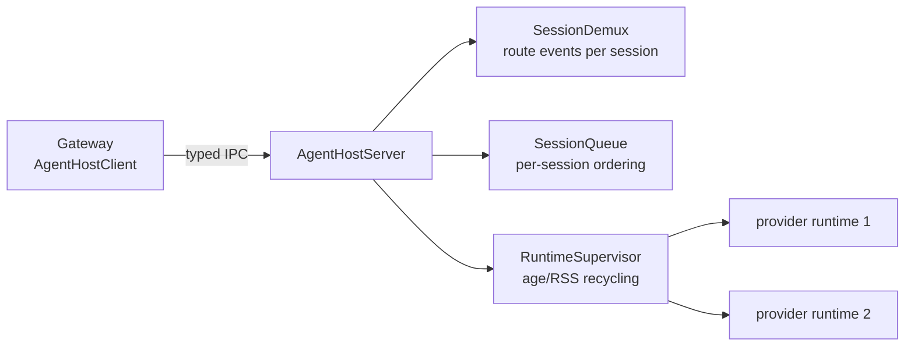

It is opt-in rather than default because parts of it are still Phase-B scaffolding (`getModels()`,
`selectAgent()` and `listAgents()` are explicit stubs, and the host's own resource bounding is
incomplete). The composition root documents this in place.

**Where the code lives:** `packages/core/src/domain/ports/IAgentHarness.ts`,
`packages/agent-harness-providers/src/{MultiHarness,HarnessRegistry,HarnessFactory,ProviderInstanceRegistry,HarnessProxy}.ts`,
`packages/agent-harness-providers/src/providers/*/`, `apps/agent-host/src/`.

---

# Part 10 — The event and streaming spine

Everything a user sees while an agent works arrives through this path. It is the most carefully
engineered part of the system.

## 10.1 The event union

`AgentEvent` in `packages/shared/src/types/AgentEvent.ts` is a discriminated union of **166 event
kinds** across 20 families:

| Family | Count | Examples |
|---|---|---|
| `harness.*` (excluding widgets) | 23 | `token`, `reasoning_delta`, `tool_start`, `tool_complete`, `message_complete`, `usage`, `context_usage`, `idle`, `cancelled` |
| `harness.widget.*` | 7 | `render`, `state`, `action`, `invoke`, `teardown` |
| `workflow_run.*` | 29 | lifecycle, orchestration, pre/post-processing, sandbox, permission mode |
| `chat.*` | 21 | lifecycle, `plan.*`, `question.*`, `background_task.*`, `mode_changed` |
| `stage_run.*` | 16 | lifecycle plus `sleeping`, `woken`, `awaiting_input`, `input_received` |
| `automation_execution.*` | 10 | started, progress, iteration lifecycle, recovered |
| `browser.*` / `computer.*` | 8 each | sessions, actions, snapshots, consent, refusals |
| `git.*` / `session.*` / `voice.*` | 6 each | |
| `extension.*` / `hook.*` | 4 each | |
| `agent.*` / `permission.*` / `script.*` / `terminal.*` | 3 each | |
| `artifact.*` / `checkpoint.*` | 2 each | |
| `workspace.changed` / `subscriber.error` | 1 each | |

## 10.2 Delta versus item — the classification that drives everything

Every event kind is classified **at compile time** in `packages/shared/src/types/eventClass.ts`. The
table is typed `Record<AgentEvent['kind'], EventClass>`, so adding a kind without classifying it fails
`tsc`. That is stronger than a lint rule, which can be disabled inline.

| Class | Meaning | Persistence | Under pressure | Replay |
|---|---|---|---|---|
| **delta** | Transport-only. The next one supersedes it; the completed item supersedes them all. | Append-only file (`DeltaLog`) | **Dropped**, and the loss is announced in a `gap` frame | Bounded window |
| **item** | Durable. Losing one is a hole the client cannot detect or repair. | SQL (`stream_cursors`), batched | **Queued**, never dropped; the producer is slowed instead | Full |

Deltas are deliberately few — `harness.token`, `harness.reasoning_delta`, `git.clone_progress`,
`script.stdout/stderr`, `automation_execution.progress`, plus two payload-discriminated
`harness.session_info` types. The bar is: *does a later event of the same kind make this one worthless,
**and** is it emitted more than once per logical step?* Both must hold. `harness.usage` looks like a
delta and is not — each carries a distinct cost figure that nothing supersedes.

## 10.3 From an event to the wire

```mermaid
graph TB
  P["Producer<br/>provider adapter, service, capability"] --> EB["EventBus.emit(sessionId, event)"]
  EB --> NF{"isNoiseEventKind?"}
  NF -->|yes| DROP["Dropped before sequencing.<br/>One Set lookup, no INSERT, no fan-out."]
  NF -->|no| Q["Per-session emit queue<br/>serialises so sequence order is strict"]
  Q --> ES["eventStore.append()<br/>= StreamBroker.publish(primary scope)"]
  ES --> WB["StreamWriteBatcher<br/>several events share one WAL commit"]
  WB --> SQL[("stream_cursors + stream_sequences")]
  ES --> CLS{"classifyEvent"}
  CLS -->|delta| DL[("DeltaLog<br/>rotating .jsonl, buffered")]
  ES --> FO["fanOut — awaited, sequential"]
  FO --> SUB["Live subscribers"]
  Q --> BR["bridgeEvent → deriveStreamScopes()"]
  BR --> SEC["Secondary scopes:<br/>run · chat · automation · workspace · global"]
  SEC --> SB2["StreamBroker.publish (fire and forget)"]
  SB2 --> SQL
```

Three invariants are visible in that diagram:

1. **Commit then broadcast.** The DB write resolves *before* the in-memory fan-out. A REST replay
   fetched immediately after a publish resolves always includes the new event. There is no window in
   which a live subscriber sees something replay cannot return.
2. **Fan-out is awaited.** `publish()` waits for handlers. A connection only returns a pending promise
   when an *item* had to be queued — deltas are dropped, never waited on — so backpressure reaches all
   the way back to the provider's read loop for that session, and only when it is real.
3. **The primary scope is published once.** The bridge publishes only *secondary* scopes, because the
   event store already appended the primary one. Otherwise every event would appear twice.

## 10.4 Scopes — the same event, several views

An event is published to one primary scope and zero or more secondary ones, each with its own
independent monotonic sequence:

| Scope | Addressed by | Who watches it |
|---|---|---|
| `session` | the session id | the transcript of one conversation or stage |
| `chat` | the chat id | a chat page |
| `run` | the workflow run id | a run page |
| `automation` | execution id **and** automation id | one execution, and the execution history list |
| `workspace` | workspace id | the changes/files pane |
| `global` (`id=all`) | — | list views, so a list stays correct without polling |
| `computer` *(ephemeral)* | workspace id | live-only preview; never persisted |

`deriveStreamScopes()` is a pure function — an event in, a list of `(scope, id)` pairs out — extracted
so the single piece of logic deciding who sees which event is testable.

Only a **closed list of lifecycle kinds** reaches `global`. The bridge sees every event on the bus,
including one `harness.token` per streamed character; fanning those to a scope every client subscribes
to would multiply the busiest traffic in the system by the number of clients, to tell them something no
list view renders.

## 10.5 The multiplexed stream protocol

One socket per tab (or per CLI process), carrying every scope that surface cares about.

```mermaid
sequenceDiagram
  participant C as Client
  participant S as Server /api/stream

  C->>S: POST /api/stream/tickets           (authenticated)
  S-->>C: single-use ticket, 30s TTL
  C->>S: POST /api/stream/connections { subs[], cursors{} }
  S-->>C: { connectionId, ticket }
  C->>S: GET /api/stream?c=connectionId   -- EventSource or fetch stream
  S-->>C: hello { activeSubs, resumed per scope, streamSpaceId }
  loop live
    S-->>C: frame { s: scope key, e: row id, seq, kind, payload }
  end
  C->>S: POST /api/stream/connections/:id/subs   (add or remove a scope)
  S-->>C: subs { authoritative active set }
  Note over C,S: On reconnect the client POSTs its whole cursor MAP.<br/>One Last-Event-ID is meaningless when sequence spaces are per scope.
```

Four problems this design solves, each of which was a real defect:

- **Resume.** A client-owned cursor *map*, POSTed on connect; `hello.resumed` answers per scope.
- **Duplicates.** One event fans out to several scopes, so dedup keys on `e`, the global
  `stream_cursors` row id, which is stable across every scope the event reaches.
- **Caps.** The server bounds connections per principal and subscriptions per connection.
- **Tickets.** One ticket authorises the *connection*; **every subscription is authorised
  individually as it is added**, so a connection can never be used to widen access.

Subscription state is **reconciled, not sequenced**: `hello` and `subs` report the server's
authoritative active set, and the client POSTs the difference. A mutation lost to a reconnect heals on
the next frame instead of leaving the two sides silently disagreeing.

## 10.6 Backpressure — what happens when a client cannot keep up

```mermaid
graph TB
  E["Event for scope X on a shared connection"] --> C{"Socket congested?"}
  C -->|no| W["Write, coalesced into a batched frame"]
  C -->|yes| K{"delta or item?"}
  K -->|delta| D["Drop it. Count it.<br/>Emit a scope-local gap frame<br/>saying how many were lost."]
  K -->|item| Q{"Scope queue under 64 items?"}
  Q -->|yes| QU["Queue it. Return a pending promise<br/>→ the producer slows down."]
  Q -->|no| DO["Drop the oldest, gap-mark the scope.<br/>The scope rejoins the live edge;<br/>replay() can return history far more cheaply."]
  W --> BYTES{"Connection queued bytes over 8 MB?"}
  BYTES -->|yes| KILL["Disconnect: slow_consumer_dropped.<br/>The only connection-wide bound."]
```

The key property is that **every bound is per scope**. A stalled computer-preview scope cannot stall
chat tokens on the same socket — that head-of-line problem is exactly why five separate connections
existed before. Only a socket that cannot drain *at all* costs the connection.

Coalescing, by contrast, is deliberately connection-wide: batching frames from several scopes into one
write is the entire point of having one socket.

**Loss is always visible.** Nothing is dropped without a `gap` frame saying so, so a client
re-snapshots instead of silently rendering a hole.

## 10.7 Resume correctness

A cursor is validated against the **database's** stream space id (`stream_sequences` persists and is
never reset), not the process's. So a cursor minted before a restart is still valid — an earlier design
keyed this on a per-boot id and silently skipped replay for exactly the outage the mechanism exists to
cover. A mismatch now means the numbers genuinely changed underneath the client: a restored backup, a
wiped dev database, or a different machine behind the same URL.

If a cursor falls outside retention, the client is **told** via `onResume({ resumed: false, reason:
'cursor_expired' })`. Replaying "everything after seq 40" when the oldest surviving row is 100 would
deliver renderable rows while leaving 41–99 missing forever, with nothing to detect it by.

## 10.8 The client side

```mermaid
graph LR
  SSE["SSE frames"] --> SP["SseParser"]
  SP --> MSC["MuxStreamClient<br/>dedup by row id, per-scope cursors,<br/>filter unions, reconnect with backoff"]
  MSC --> ER["eventRouter<br/>kind → intent"]
  ER --> RED["reducer (pure)<br/>append-ordered blocks, monotonic ids,<br/>terminal states never revived,<br/>widgets survive turn boundaries,<br/>LRU-bounded record"]
  RED --> ST["Zustand store (web) /<br/>RN store (mobile) /<br/>TUI store (CLI)"]
  ST --> UI["Rendered transcript"]
  MSC --> FS["frameScheduler<br/>batch renders to animation frames"]
```

The reducer encodes six invariants that were each learned the hard way:

1. `blocks` is append-ordered and never re-sorted — temporal order *is* the data.
2. `_nextBlockId` is monotonic **across** turns, or React keys collide when a node is reused.
3. Terminal statuses (`complete`, `idle`, `error`) are never revived by a late event.
4. Widget blocks survive turn boundaries and `clearStream` — they are sandboxed iframes holding their
   own DOM state, carried by no chat message.
5. `usage` and `contextUsage` survive `clearStream` — the context gauge describes the conversation,
   not the turn.
6. The record is **bounded**: every write stamps `lastActivityAt` and `pruneStreams` evicts the
   least-recently-touched entries past a cap.

**Where the code lives:** `packages/shared/src/types/{AgentEvent,eventClass}.ts`,
`packages/core/src/events/EventBus.ts`, `packages/core/src/services/{StreamBroker,StreamWriteBatcher,DeltaLog}.ts`,
`apps/server/src/composition/streamScopes.ts`, `apps/server/src/streaming/*`,
`apps/server/src/routes/stream.ts`, `packages/client-core/src/stream/*`.

---

# Part 11 — Chat, end to end

This is the flow to understand if you only understand one. Everything else is a variation on it.

## 11.1 Creating a chat

```mermaid
sequenceDiagram
  participant U as Client
  participant API as POST /api/chats
  participant CMS as ChatManagementService
  participant WM as WorkspaceManager
  participant AR as AgentResolver
  participant MH as MultiHarness
  participant BUS as EventBus

  U->>API: { name, projectId, codebaseIds, model, agentRef, mode, browserConfig, orchestratorMode }
  API->>CMS: createChat(params)
  CMS->>CMS: create Chat row + Session row
  opt project codebases or local folders
    CMS->>WM: create ExecutionWorkspace + git worktrees
    WM-->>CMS: workspaceId, root path
  end
  CMS->>AR: resolve agent projection<br/>(instructions + tool policy + runtime policy + overrides)
  AR-->>CMS: ResolvedAgentProjection
  CMS->>CMS: assemble the tool set —<br/>browser · computer · widgets · orchestrator ·<br/>record_plan · extension tools · custom tools
  CMS->>CMS: compose the system message —<br/>agent instructions + capability hints
  CMS->>MH: createConversation({ conversationId, model, harnessType,<br/>tools, systemMessage, mcpServers, skills, agents,<br/>permissionMode, hooks, onPlanReviewRequest, onQuestionRequest })
  MH-->>CMS: provider conversation bound (90s deadline)
  CMS->>BUS: chat.created
  API-->>U: 201 { chat }
```

The **agent projection** is the one place a stored Agent definition is combined with binding-site
overrides. `append` projection keeps the platform capability blocks (browser, widgets, orchestrator,
plan instructions) and appends the agent's instructions; `replace` drops the base instructions but
still keeps the capability blocks, because otherwise the tools they describe become unusable.

## 11.2 Sending a prompt — the full path

```mermaid
sequenceDiagram
  autonumber
  participant U as Client
  participant API as POST /api/chats/id
  participant AC as AdmissionController
  participant CMS as ChatManagementService
  participant H as Harness adapter
  participant P as Provider CLI/SDK
  participant BUS as EventBus
  participant SB as StreamBroker
  participant DB as SQLite
  participant DL as DeltaLog
  participant SSE as /api/stream

  U->>API: { prompt, attachments, mode }
  API->>AC: admit(lane = interactive)
  AC-->>API: ticket
  API-->>U: 202 Accepted  (the turn runs in the background)

  API->>CMS: sendPrompt(chatId, prompt, ...)
  CMS->>CMS: persist the user ChatMessage
  CMS->>BUS: chat.prompt_sent + harness.turn_start (our own turnId)
  CMS->>H: onConversationEvent(conversationId, handler)
  CMS->>H: sendPrompt(conversationId, prompt, attachments, {agentMode, permissionMode})
  H->>P: native protocol

  loop the agentic turn
    P-->>H: native event
    H-->>CMS: mapped AgentEvent
    CMS->>CMS: accumulate into turn metadata<br/>(text segments, thinking, tool calls)
    CMS->>BUS: emit, enriched with chatId
    BUS->>SB: publish (session scope) — awaited
    SB->>DB: batched INSERT (items)
    SB->>DL: append (deltas)
    SB->>SSE: fan out to subscribers
    BUS->>SB: bridge → chat / workspace / global scopes
    SSE-->>U: frames
  end

  P-->>H: idle
  CMS->>CMS: finalizeTurn — persist the assistant ChatMessage<br/>with segments, tool calls, thinking, usage
  CMS->>BUS: harness.turn_end + harness.idle
  SSE-->>U: final frames
```

Points worth noticing:

- **The HTTP request returns immediately (202).** The turn is not tied to the request's lifetime, so
  closing the tab or losing the network does not cancel it.
- **Turn ids are ours.** The provider's own `turn_start` is dropped and replaced with a server-generated
  one, because duplicates would overwrite the stream's turn id and break content-free deduplication.
- **`user_message` and `session_start` echoes are dropped** — the SDK re-emits them and forwarding
  would double the event log and trigger spurious client resets.
- **Message segments are discrete, not cumulative.** An agentic turn narrates between tool waves; each
  narration is its own event, and they are all kept in order so the transcript can be rebuilt exactly
  as it streamed.
- **Long responses become artifacts.** Assistant content of 500+ characters is also written to
  `<workspace>/artifacts/responses/` so it appears in the Files pane. Failure here is non-fatal.

## 11.3 Stopping a turn

Two-phase, because the two things a user means by "stop" are different:

```mermaid
graph LR
  S1["First Stop press"] --> A["abortConversation() — ask the provider to end the turn.<br/>Emits harness.cancelled { reason: user_abort }, not an error."]
  A --> W["Wait briefly"]
  W --> S2["Second Stop press"] --> F["forceStop() — kill the runtime.<br/>The session is rebuilt on the next prompt<br/>using resumeProviderSessionId to keep history."]
```

`harness.cancelled` is a first-class event kind precisely so a user pressing Stop is never rendered as
a failure.

## 11.4 Resuming after a restart

```mermaid
graph TB
  A["Client reopens a chat"] --> B["GET /api/chats/:id/messages — durable transcript"]
  B --> C["Subscribe scope=chat with the cursor from the snapshot"]
  C --> D{"Server: is the conversation live in the adapter?"}
  D -->|yes| E["Stream continues"]
  D -->|no| F["resumeConversation(id, params)<br/>WITH params, so tool handlers are re-registered"]
  F --> G["resumeProviderSessionId restores the provider's own history"]
  G --> E
```

Resuming *without* params restores the message history but no tools — the SDK then tells the model
those tools "are no longer available" and it refuses tool-using tasks for the rest of the chat. That is
why `hasLiveConversation()` exists and why the resume path always passes params.

**Where the code lives:** `packages/core/src/services/ChatManagementService.ts` (~2,500 lines),
`apps/server/src/routes/chats.ts`, `packages/core/src/services/{AgentResolver,AgentStagingService}.ts`.

---

# Part 12 — Workflows and stages — the DAG engine

## 12.1 The shape of a workflow

A **workflow definition** is a set of stages plus edges between them. A **stage** is one or more
prompts sent to an agent, with:

- retry policy (max retries, backoff, multiplier)
- a condition (`always` / `on_success` / `on_failure` / an expression)
- timeout, hooks, variables, context filters
- optionally an agent ref, skills, tool policy overrides, harness config overrides
- optionally a **sub-workflow** (with input/output mapping) or a **loop** (with an exit condition and
  a max-iteration bound)

## 12.2 Running one

```mermaid
sequenceDiagram
  participant API as POST /api/workflow-runs/id/start
  participant WRS as WorkflowRunService
  participant WO as WorkflowOrchestrator
  participant WM as WorkspaceManager
  participant WP as WorkflowPreprocessor
  participant DAG as DAGScheduler
  participant SES as StageExecutionService
  participant AC as AdmissionController
  participant H as Harness
  participant BUS as EventBus

  API->>WRS: start(runId)
  WRS->>BUS: workflow_run.starting
  WRS->>WO: orchestrate(run)
  WO->>WM: create workspace + worktrees per codebase alias
  WO->>BUS: worktree_creating / worktree_created
  WO->>WP: preprocessing steps
  WP->>BUS: preprocessing_step_started / completed / failed
  WO->>BUS: workflow_run.running

  loop until no stages remain
    WRS->>DAG: getReadyStages(runId)
    DAG->>DAG: build/validate the DAG (cached, two-tier signature)
    DAG->>DAG: evaluate each edge condition
    DAG-->>WRS: ready stage runs
    loop each ready stage
      WRS->>AC: admit(lane = ordinary)
      WRS->>SES: execute(stageRun)
      SES->>SES: resolve prompts, interpolate variables,<br/>resolve the agent projection, build the tool set
      SES->>H: createConversation + sendPromptAndWait
      H-->>SES: response
      SES->>BUS: stage_run.* lifecycle
      SES->>WRS: completed / failed / awaiting_input / sleeping
    end
  end

  WO->>WP: post-processing steps
  WRS->>BUS: workflow_run.completed
```

## 12.3 Stage run states

```mermaid
stateDiagram-v2
  [*] --> pending
  pending --> queued: dependencies satisfied
  queued --> running: admitted
  running --> sleeping: step.sleep
  sleeping --> running: woken by DurableSleepService
  running --> awaiting_input: human-in-the-loop interrupt
  awaiting_input --> running: input received
  running --> paused: user pause
  paused --> running: resume
  running --> completed
  running --> failed
  failed --> retrying: retry policy allows
  retrying --> running
  running --> cancelled
  pending --> skipped: condition evaluated false
  completed --> [*]
  failed --> [*]
  cancelled --> [*]
  skipped --> [*]
```

## 12.4 Design details that matter

- **Two-tier DAG cache.** Validating the cache used to SHA-1 every stage and edge on every stage
  completion. Now a non-allocating integer fold catches everything except an edit to a *condition body*,
  and the expensive digest is reached only when the cheap check already matched.
- **One reconciler, not one timer per run.** Each active run used to create its own 3-second interval;
  22 live runs meant ~200 no-op queries every 3 seconds. There is now one process-wide reconciler.
- **A concurrency cap on stages** (`maxConcurrentStages`, default 8) bounds provider subprocess fan-out
  across all runs.
- **Parking.** A stage waiting on human approval gives its admission permit back (`ticket.pause()`) and
  re-queues afterwards (`ticket.resume()`). Without this, eight stages on approval would consume the
  whole lane and unrelated runs would stop.
- **Programmatic workflows.** `.workflow.mjs` files loaded by `WorkflowScriptLoader` can build
  definitions in code via `WorkflowBuilder` / `StageBuilder`.

**Where the code lives:** `packages/core/src/services/{WorkflowRunService,DAGScheduler,StageExecutionService,WorkflowOrchestrator,WorkflowPreprocessor,ResultValidator,WorkflowScriptLoader}.ts`,
`packages/core/src/domain/dag/*`, `packages/core/src/domain/state-machines/*`.

---

# Part 13 — Automations — triggers, loops and batches

An automation is a workflow definition plus a trigger and an input mode.

```mermaid
graph TB
  subgraph Triggers
    T1["manual — a button"]
    T2["schedule — node-cron,<br/>with a cross-process DB lease<br/>so two servers do not double-fire"]
    T3["webhook — HMAC-verified POST,<br/>idempotency key deduplicated"]
  end

  subgraph InputModes
    I1["single — one run"]
    I2["loop — repeat until an exit condition"]
    I3["batch — one run per dataset row"]
    I4["script — a data-source script produces the rows"]
  end

  T1 --> AE["AutomationExecution"]
  T2 --> AE
  T3 --> AE
  I1 --> AE
  I2 --> AE
  I3 --> AE
  I4 --> AE

  AE --> DS["DataSourceResolver<br/>static · script · http · file · workflow_script"]
  DS --> IP["IterationPlanner<br/>plan every iteration up front"]
  IP --> DUR["DurableExecutionEngine<br/>write ALL iteration rows in one transaction"]
  DUR --> CL["claimNextIteration — atomic UPDATE…RETURNING<br/>stamps an owner + lease"]
  CL --> WR["one WorkflowRun per iteration"]
  WR --> CO["completeIteration — write the outcome back"]
  CO --> RC["reclaimExpiredIterations —<br/>a lease that expired means a process died mid-iteration"]
```

The iteration-claiming design is what fixes the worst failure mode this feature had: a 1,000-row batch
that died at row 40 used to lose 960 rows **silently**, because a claimed row was indistinguishable
from a finished one. Now every row is written up front, claimed atomically with a lease, and its
outcome written back — so recovery can tell "running" from "done" from "abandoned".

`AutomationRecoveryService` runs at boot to reconcile executions that were in flight when the process
stopped, and sweeps expired idempotency keys.

**Where the code lives:** `packages/core/src/services/{AutomationService,AutomationRecoveryService,DataSourceResolver,IterationPlanner,DurableExecutionEngine}.ts`,
`apps/server/src/routes/{automations,webhooks}.ts`.

---

# Part 14 — Orchestrator mode and background agents

An orchestrator chat is a normal chat with `orchestratorMode: true`. That flips two things: it gets the
orchestrator system prompt, and it gets the background-agent tool set.

```mermaid
sequenceDiagram
  participant U as You
  participant O as Orchestrator chat
  participant OS as OrchestratorService
  participant W1 as Worker chat 1
  participant W2 as Worker chat 2
  participant BUS as EventBus

  U->>O: "Refactor these three modules and write tests"
  O->>OS: spawn_background_agent([brief1, brief2, brief3])
  OS->>OS: check budgets — maxWorkers 12, maxWaves 10,<br/>timeBudget 30min, convergenceThreshold
  OS->>W1: create a REAL Chat + Session + Workspace
  Note over OS,W1: warmFirst — the first worker is staggered<br/>so the prompt cache warms before the rest
  OS->>W2: create
  OS->>BUS: chat.background_task.spawned ×N → routed to the PARENT chat scope

  loop while workers run
    W1->>BUS: its own harness.* events on its own chat scope
    OS->>BUS: chat.background_task.status → parent scope
  end

  O->>OS: check_background_agents(wait = true)
  W1-->>OS: TASK_RESULT digest { summary, converged, artifacts }
  OS-->>O: compact digests only — not full transcripts

  alt needs another round
    O->>OS: send_to_background_agent(id, feedback)
    Note over OS: bounded by maxReviewRounds (default 3)
  end

  O->>U: consolidated answer
```

**The tools an orchestrator gets:** `spawn_background_agent`, `check_background_agents`,
`check_background_agent`, `send_to_background_agent`, `list_background_agents`, `list_models`,
`list_available_agents`.

**Why workers are real chats.** A worker is a full Chat with its own Session, workspace and event
stream, so you can open it, watch it, and intervene. Background-task lifecycle events are additionally
routed to the *parent* chat scope so the orchestrator's UI shows worker cards without subscribing to
every worker.

**Termination is explicit**, because the natural failure mode of an orchestrator is cycling forever.
Three conditions are checked and all must pass to continue: wave count under `maxWaves`, elapsed time
under `timeBudgetMs`, and the fraction of the current wave reporting `converged: true` below
`convergenceThreshold`. Convergence is a *claim a worker makes* in its digest, not something that
finishing a turn implies — a failed or cancelled worker never converges.

**Where the code lives:** `packages/core/src/services/orchestrator/{OrchestratorService,prompts}.ts`,
`packages/core/src/tools/orchestrator/index.ts`, `apps/server/src/routes/orchestrator.ts`.

---

# Part 15 — Plan mode and human-in-the-loop

## 15.1 Agent modes

There are two, and adding a third is a single registry entry rather than a cross-cutting edit:

| Mode | Behaviour |
|---|---|
| `auto` | The agent works and edits directly, approving its own tool use. If asked for a plan it still produces one — recorded, non-blocking — and then implements it. |
| `plan` | The agent researches and proposes a plan, then **blocks** for human approval. Writes are structurally impossible until approved. |

A mode is not a label; it is a bundle: which permission policy applies, whether a produced plan blocks,
whether a blocking question gate may open, and what extra instructions the agent receives. Every
behavioural decision reads `AGENT_MODE_REGISTRY` rather than an `if (mode === 'plan')` scattered across
the server and both adapters.

## 15.2 The plan gate

```mermaid
sequenceDiagram
  participant A as Agent
  participant H as Harness adapter
  participant CMS as ChatManagementService
  participant PS as PlanService
  participant BUS as EventBus
  participant U as You

  A->>H: finishes planning<br/>(Copilot: onExitPlanModeRequest · Claude: ExitPlanMode tool)
  H->>CMS: onPlanReviewRequest({ summary, planContent, actions })
  CMS->>PS: persist PlanDocument + revision
  CMS->>BUS: chat.plan.created, chat.plan.review_requested
  BUS-->>U: a plan card, with actions
  Note over H: The adapter's idle watchdog is PAUSED<br/>for the whole wait — a human may take hours.
  U->>CMS: POST /api/chats/:id/plans/:planId/decision<br/>{ approved, action, feedback, editedContent }
  CMS->>BUS: chat.plan.decided
  CMS-->>H: PlanReviewDecision
  H-->>A: proceed / revise with feedback
```

Plans are real documents: revisions, comments, editable content, and "save to workspace". Both
supported first-tier providers implement plan mode natively; the adapters normalise the two very
different shapes into one `PlanReviewRequest`.

## 15.3 Questions and workflow interrupts

The same shape covers two more gates:

- **`onQuestionRequest`** — the agent asks clarifying questions (Copilot's `onUserInputRequest`,
  Claude's `AskUserQuestion`). Emits `chat.question.asked`, blocks, resolves with
  `chat.question.answered`. Unanswered gates expire with `chat.question.expired` rather than hanging
  forever.
- **`HitlService`** — a workflow stage raises an interrupt. Emits `stage_run.awaiting_input`, the run
  parks (giving back its admission permit), and
  `POST /api/workflow-runs/:runId/stages/:stageId/approve` resumes it with
  `stage_run.input_received`.

**Where the code lives:** `packages/shared/src/types/AgentMode.ts`,
`packages/core/src/services/{PlanService,AgentInteractionService,HitlService,agentModePolicy}.ts`,
`packages/agent-harness-providers/src/providers/*/plan-gate.ts`.

---

# Part 16 — Workspaces, worktrees, checkpoints and diffs

## 16.1 What a workspace is

```
~/.generatorai/workspaces/<workspaceId>/
├── worktrees/<alias>/        git worktrees, one per linked codebase
├── artifacts/                files the agent produced
│   └── responses/            long assistant messages saved as markdown
├── browser/                  browser profile + playwright-cli skill output
└── manifest.json
```

A workspace is created on demand for a chat or a run, and every native resource that touches it
registers a teardown listener.

## 16.2 Ordered teardown

```mermaid
graph LR
  DEL["deleteWorkspace()"] --> P1["Phase 1 — native<br/>Chromium profiles · PTYs · CUA sessions"]
  P1 --> P2["Phase 2 — storage<br/>review threads · checkpoints · staged agent bodies"]
  P2 --> RM["Remove the directory tree"]
```

The **phase**, not the registration order, fixes the ordering. Teardown previously ran in push order,
so a listener registered early (staging, which does an `fs.rm`) ran ahead of the browser/terminal
teardown registered later — on Windows that means `EBUSY`, or worse, a delete succeeding out from under
a live process.

## 16.3 Checkpoints

A checkpoint is a snapshot of a repo's working tree stored as a **private git ref** (`GitShadowRefStore`)
rather than a commit on any branch — so it is invisible to normal git usage and cannot pollute history.

```mermaid
graph LR
  T["Agent turn / stage boundary"] --> CP["CheckpointService.create()"]
  CP --> LOCK["Single-flight lock per (workspace, repoAlias)<br/>— two concurrent captures would share<br/>one throwaway index file and tear the tree"]
  LOCK --> REF["Write a shadow ref"]
  REF --> ROW["checkpoints row + checkpoint.created event"]
  ROW --> R["Restore: write files back,<br/>take a pre-restore checkpoint first,<br/>report restored / deleted / skipped counts"]
```

## 16.4 Changes and review

```mermaid
graph TB
  W["Workspace"] --> RD["RepoDiscovery — find every repo under the root"]
  RD --> CS["ChangeSetService — one 'what changed?' engine<br/>used identically by chat, runs and automations"]
  CS --> SUM["ChangeSummaryService — stats per file/repo"]
  CS --> TREE["WorkspaceTreeService — the file tree"]
  CS --> UI["Diff pane"]
  UI --> RT["ReviewThreadService<br/>threads + comments anchored to positions"]
  RT --> AR["AnchorResolver — anchors survive later edits"]
  RT --> RPS["ReviewPromptSerializer — feed the review back to the agent"]
```

The diff pane is not polled. `workspace.changed` events are emitted (debounced at the emitter, never
by dropping events in the bus, which would break per-session ordering) and bridged to the `workspace`
scope, so a write-heavy agent turn produces a couple of refetches rather than a poll loop.

**Path safety** is centralised in `PathResolver` and `safePath.ts`: absolute paths are rejected,
resolved paths must stay inside the workspace boundary, and symlinks are resolved and re-checked
(`PathEscapeError` / `SymlinkEscapeError`).

**Where the code lives:** `packages/core/src/services/{WorkspaceManager,WorktreeService,WorkspaceCheckpointService,PathResolver}.ts`,
`packages/{checkpoints,changes,review,git,source-control}/src/`.

---

# Part 17 — Right-pane capabilities

The right-hand pane in the web and desktop UI (and the equivalent panes in the TUI) hosts four
capabilities. All four follow the same structural pattern, which is worth stating once:

> A capability service owns sessions keyed by workspace, chooses an implementation behind a port,
> enforces a concurrency cap, keeps a **per-workspace FIFO emit queue** so events stay ordered,
> **writes artifacts before emitting the event that references them**, reaps idle sessions, and
> registers a teardown listener with `WorkspaceManager`.

## 17.1 Integrated terminal

```mermaid
graph TB
  UI["xterm.js in the browser / TUI terminal pane"] -->|WS| WSE["/api/workspaces/:id/terminals/:sid/stream"]
  WSE --> AUTH["WS upgrade resolves a full Principal<br/>and requires exec:terminal"]
  AUTH --> TS["TerminalService"]
  TS --> HOSTS{"ITerminalHost chain"}
  HOSTS --> H1["PtyHostAdapter → pty-host process"]
  HOSTS --> H2["NodePtyHost in-process"]
  HOSTS --> H3["SandboxPtyHost"]
  HOSTS --> H4["FallbackChildProcessHost"]
  TS --> RING["Ring buffer ~4 MiB per session<br/>for reconnect scrollback"]
  TS --> CAPS["Caps: 5 per workspace, 20 global,<br/>30 min idle reaper"]
```

**Wire format.** Binary frames are raw PTY bytes fed straight into `xterm.write`. Text frames are JSON
control: server sends `ready` / `exit` / `resized` / `error`; client sends `input` / `resize` / `ack` /
`signal`.

**Flow control** is the interesting part. The watermark belongs to the **session**, not the connection.
With two viewers attached, per-connection watermarks meant one viewer crossing its high mark paused the
shared PTY for both, and the other's next ack — covering a different byte range entirely — resumed it.
They oscillated and neither bound was enforced. Now `attachViewer()` hands each connection an ack cursor
into the session's shared watermark and **the slowest attached viewer governs**. A socket whose
`bufferedAmount` is too high reports a *stall* rather than directly pausing the PTY, so it is arbitrated
with every other viewer instead of racing them.

**Resize authority** is arbitrated too: with two clients attached, an unarbitrated resize was
last-write-wins, so a passive viewer's window size could win over the client actually driving.

## 17.2 Integrated browser

```mermaid
graph TB
  UI["Browser pane"] -->|WS| BWS["/api/workspaces/:id/browser/stream"]
  BWS --> BS["BrowserService"]
  BS --> BR{"IBrowserBridge"}
  BR --> B1["ServerPlaywrightHost — headless Chromium"]
  BR --> B2["ElectronBridgeAdapter — a real desktop tab<br/>via a per-tab ScopedCdpProxy"]
  BS --> CFG["browserConfig — allowedHosts, dialogPolicy, PII redaction"]
  BS --> ART["Screenshots and snapshots → workspace artifacts"]
  BS --> EV["browser.* events"]
  AGENT["Agent tool set:<br/>open_browser_page · navigate · click · type ·<br/>hover · drag · read_page · screenshot ·<br/>handle_dialog · run_playwright_code"] --> BS
```

**One transport carries everything.** Server→client text JSON for `stream_unavailable` /
`stream_error`; server→client binary frames with a 16-byte header where **every frame states its own
codec**, so falling back from VP8 to JPEG mid-stream is a value the client reads rather than a failure
it infers; client→server JSON for `hello` and input events.

**Transport is declared, not discovered.** This used to call `screencast()` inside a `try` and fall
back to HTTP polling in the `catch` — a feature detector built out of an exception, which cannot tell
"this bridge has no screencast" from "the screencast just failed". One transient error therefore
demoted a healthy session to five HTTP screenshots per second for the rest of its life. It now asks
`screencastCapabilities()`, which is synchronous, total, and unable to lie by omission. The polling
loop is gone.

**Input is bounded two ways.** Depth (24 pending) bounds how far behind reality the page may fall; rate
(120/s, burst 60) bounds sustained cost. Pointer **moves are coalesced**, because position is state —
replaying twenty stale positions is strictly worse than jumping to the current one. Clicks, keys and
wheels are discrete and are dropped over the bound, which is the honest failure (a lost keystroke)
rather than the dishonest one (a keystroke landing ten seconds late on another element).

**Desktop-specific security.** The Electron app never opens an app-wide `--remote-debugging-port` — that
would expose *every* webContents including the privileged main window over one unauthenticated loopback
port. Instead each tab gets a `ScopedCdpProxy`: a CDP WebSocket server bound to exactly one
`webContents`, fabricating the `Target` domain so Playwright sees a normal single-page browser,
rejecting any upgrade carrying an `Origin` header, and requiring a random per-instance token compared
in constant time. A repo lint script (`scripts/check-no-app-wide-cdp.mjs`) keeps it that way.

## 17.3 Computer use

This one controls your actual desktop, so **the execution order is the security design**:

```mermaid
graph TB
  A1["1 · Feature gate — env kill switch, then config.enabled"]
  A2["2 · Bridge resolution — first bridge whose isAvailable is true"]
  A3["3 · App resolution — an ambiguous ref must resolve to exactly one identity"]
  A4["4 · Blocklist — on the resolved identity AND its window titles"]
  A5["5 · Tier gate — synthetic input requires an explicit opt-in"]
  A6["6 · Consent — a stored grant of sufficient scope, else prompt the human"]
  A7["7 · Concurrency permit — the desktop is a singleton resource"]
  A8["8 · Re-resolve — the app may have exited during the prompt"]
  A9["9 · Snapshot fence — reject a superseded or foreign snapshotId"]
  A10["10 · Dispatch — bridge.act, cancellable"]
  A11["11 · Invalidate — the UI moved, every snapshot for the app is stale"]
  A12["12 · Artifact write — screenshot to the repository"]
  A13["13 · Audit — success AND refusal"]
  A14["14 · Event emit — per-workspace FIFO queue"]
  A1 --> A2 --> A3 --> A4 --> A5 --> A6 --> A7
  A7 -->|"steps 8-14 run INSIDE the permit"| A8
  A8 --> A9 --> A10 --> A11 --> A12 --> A13 --> A14
```

Steps 8–11 are inside the permit deliberately: checking the fence outside it lets two concurrent calls
carrying the same `snapshotId` both pass, then serialise — the second acting on a UI the first just
moved, which is exactly the "index 12 meant something else" bug the fence exists to prevent.

**Element addressing is the driver's, not ours.** `get_window_state` returns a `snapshot_id` and
per-element `element_index`; `click` / `set_value` / `type_text` accept them directly. We pass them
straight through rather than caching bounds and computing a centre point, because the driver resolves
the element through the accessibility API on its side — which survives the window moving and cannot
land on a neighbouring application the way a stale coordinate can.

**Input does not steal focus.** On Windows the driver delivers via `PostMessage` to the target window,
so typing works against a backgrounded window and never moves your cursor.

The live preview is an **ephemeral scope** — a frame per action plus a cursor sample every ~30 ms, none
of which anyone will ever replay. It bypasses `StreamBroker` entirely so it never becomes a database
row, and a single producer serves N watchers (it used to be a 250 ms filesystem poll *per connection*).

## 17.4 Widgets and extensions

An agent can render real interactive UI inline in the chat.

```mermaid
sequenceDiagram
  participant A as Agent
  participant WS as WidgetService
  participant BUS as EventBus
  participant UI as Client
  participant IF as Widget iframe

  A->>WS: render_widget(descriptorId, props)
  WS->>WS: create a widget_instances row
  WS->>BUS: harness.widget.render
  BUS-->>UI: frame
  UI->>IF: mount a sandboxed iframe from the widget-asset origin
  IF->>UI: postMessage — state change
  UI->>WS: PATCH /api/widgets/:id/state
  WS->>BUS: harness.widget.state
  IF->>UI: postMessage — user action
  UI->>WS: POST /api/widgets/:id/actions
  WS->>BUS: harness.widget.action → the agent sees it
  A->>WS: read_widget / update_widget / widget_exec
```

Widget assets are served from a **separate loopback origin** on its own port, so widget code cannot
reach the API's origin or the SPA's DOM. All widget events are classified as *items*: a widget's state
is authoritative (dropping one leaves the UI showing something the agent believes it changed), and
actions are user intent, which nothing supersedes.

**Extensions** are directories containing an `extension.json` manifest, discovered from three scopes
with precedence `workspace > user > system`. They contribute widgets, tools, MCP servers and hooks.
`reload()` re-scans without a server restart. There are also built-in extension-author tools
(`write_extension`, `reload_extension`) so an agent can build its own UI.

**Where the code lives:** `packages/core/src/services/{TerminalService,BrowserService,ComputerService,WidgetService,ExtensionManager,ExtensionApi}.ts`,
`packages/core/src/infrastructure/{terminal,browser,computer}/`, `packages/core/src/tools/{browser,computer,widgetTools}`,
`apps/server/src/{terminal-ws,browser-ws}.ts`, `apps/server/src/routes/{terminals,browser,computer,widgets,extensions}.ts`,
`apps/desktop/src/main/cdp/ScopedCdpProxy.ts`.

---

# Part 18 — Voice — speech in, speech out

Everything runs **locally on CPU**. No cloud, no API key, no per-minute cost.

## 18.1 Speech to text

```mermaid
sequenceDiagram
  participant M as Microphone
  participant C as Client
  participant WS as /api/stt/stream
  participant VS as VoiceService
  participant VAD as Silero / Energy VAD
  participant E as STT engine
  participant F as Text formatter

  C->>WS: connect (ticket, scope write:chats)
  WS-->>C: { t: 'ready' }
  C->>WS: { t: 'start', lang }
  loop while speaking
    M->>C: audio
    C->>WS: binary — 16 kHz mono Float32 PCM
    WS->>VS: feed
    VS->>VAD: is this speech?
    VAD-->>VS: speech / silence
    VS->>E: transcribe the open segment
    E-->>VS: interim text
    VS-->>C: { t: 'interim', text }
    Note over VS: On end-of-utterance (silence):
    VS-->>C: { t: 'segment', text }  — session stays open
  end
  C->>WS: { t: 'pause' } / { t: 'resume' }   — model stays warm, no teardown
  C->>WS: { t: 'stop' }
  VS->>F: cleanup pass (rule-based or LLM-assisted)
  VS-->>C: { t: 'final', text }
```

**Engines** are chosen by configuration, not code (`VoiceEngineFactory`, deliberately mirroring
`HarnessFactory`): `parakeet`, `moonshine`, `whisper`, `disabled`, or `auto` — which is a **cascade**:
try the preferred engine, fall back to Whisper if it cannot load (no network on first run, wiped cache,
bad override, out-of-memory session), and report which one actually won.

Each engine carries a measured descriptor — download size, dtype, latency, and `casedOutput`. That last
field is load-bearing: an engine that emits neither capitals nor punctuation cannot have them added back
downstream, so a UI letting a user pick an engine has to be able to say so.

## 18.2 Text to speech

```mermaid
sequenceDiagram
  participant C as Client
  participant WS as /api/tts/stream
  participant VS as VoiceService
  participant BUS as EventBus
  participant K as Kokoro TTS

  C->>WS: connect (scope read:chats)
  WS-->>C: { t: 'ready', sampleRate }

  alt read a finished message
    C->>WS: { t: 'speak', text }
  else read the agent LIVE as it types
    C->>WS: { t: 'speak_stream', sessionId }
    WS->>BUS: subscribe to that session's harness.token
    BUS-->>WS: tokens
    WS->>WS: SentenceBoundaryBuffer — cut at sentence ends
  end

  WS->>K: synthesize
  K-->>WS: PCM
  WS-->>C: { t: 'sentence' } then binary Float32 PCM frames
  WS-->>C: { t: 'done' }
  C->>WS: { t: 'stop' }   — barge-in, immediate
```

Two design notes worth keeping:

- **The EventBus subscription is created per connection and torn down with it.** A chat nobody asked to
  have read aloud has no listener attached — live narration is never an always-on tax.
- **`{ t: 'sentence' }` exists for mobile.** Raw PCM carries no boundaries and React Native can only
  play whole files, so mobile cuts the stream where a speaker pauses rather than mid-word. A client
  that ignores the marker hears identical audio.

Authorization is symmetric and deliberate: speech **in** needs `write:chats` (it becomes a chat
message); speech **out** needs `read:chats` (reading a message aloud carries the same authority as
reading it).

**Where the code lives:** `packages/core/src/services/VoiceService.ts`,
`packages/core/src/infrastructure/voice/*` (17 files), `apps/server/src/{stt-ws,tts-ws}.ts`,
`apps/web/src/hooks/{useSpeechToText,useTextToSpeech}.ts`, `apps/mobile/src/voice/`.

---

# Part 19 — Extensibility and external integrations

Everything in this part is a seam: a documented place where something outside the core plugs in.

## 19.1 The integration map

```mermaid
graph TB
  subgraph Core["GeneratorAI core"]
    CTR["CustomToolRegistry<br/>one per process"]
    HX["HookExecutor + HookInterceptor"]
    MCPH["IMcpHub — MCP server config"]
    CAT["ArtifactCatalog<br/>skills + MCP servers, by ID"]
    EXT["ExtensionManager"]
    SCM["SourceControlRegistry"]
    PUSH["PushDispatcher"]
    SBX["ISandboxProvider"]
  end

  subgraph Inbound["Things that call INTO GeneratorAI"]
    WH["Webhooks — HMAC verified"]
    SDKC["Embedded SDK — createGeneratorAI()"]
    COMP["CLI companion RPC — stdio / 0600 socket"]
    AWK["Awakeable resolve — engine primitive; HTTP route not yet mounted"]
  end

  subgraph Outbound["Things GeneratorAI calls OUT to"]
    PROV["AI providers — 5 harness adapters"]
    MCPS["MCP servers — stdio / HTTP"]
    GH["GitHub — pull requests, repo metadata"]
    GITR["Git remotes — clone, fetch, push"]
    HTTPH["HTTP hooks — outbound POST"]
    EXPO["Expo Push — mobile notifications"]
    DOCK["Docker sandbox — isolated script execution"]
  end

  WH --> Core
  SDKC --> Core
  COMP --> Core
  AWK --> Core

  CTR --> PROV
  MCPH --> MCPS
  CAT --> MCPS
  SCM --> GH
  Core --> GITR
  HX --> HTTPH
  HX --> SBX
  SBX --> DOCK
  PUSH --> EXPO
  EXT --> CTR
  EXT --> MCPH
  EXT --> HX
```

## 19.2 Hooks — running your own code at 20 points in a turn

A hook is a piece of work bound to a **phase**. There are 20 phases:

```
pre_run  post_run  pre_clone  post_clone  pre_prompt  post_prompt
pre_commit  post_commit  on_error  on_cancel
pre_tool_use  post_tool_use  on_message  on_reasoning
on_session_start  on_session_idle  on_session_error  on_session_cancelled
on_client_start  on_client_stop  on_client_error  on_client_restart
```

Note that `on_session_cancelled` is deliberately **not** implied by `on_session_error` — a user
pressing Stop is not a failure, and a hook that should fire on both must opt into both.

Three backends, all behind ports:

| Backend | How it runs | Notes |
|---|---|---|
| `script` | A sandboxed subprocess via `IScriptRunner` | Command allowlist; `cmd.exe` is denied by platform invariant. `SANDBOX_ENABLED=true` requires a Docker sandbox. |
| `http` | An outbound request via `IHttpClient` | The request is cancelled at the socket on timeout. |
| `function` | Either an in-process registered callback (trusted, shares the DI container) or a subprocess running a user-supplied Node module | |

**Cancellation is real.** Each invocation gets its own `AbortController`; when the per-hook timer fires
or the caller aborts, both the child process and any in-flight fetch are cancelled at their respective
ports. An earlier implementation raced a promise against a timeout, so the underlying work kept running
after the result had been discarded — burning CPU and tokens on nothing.

Two entry paths exist. `HookExecutor.executePhase` is the direct, blocking call. `HookInterceptor`
subscribes to the event bus and routes *passive* events into the same executor for post-hoc
observability — so you get hook coverage even for providers with no synchronous hook surface. Where a
provider *does* have one, `HookBridge` is passed into `createConversation` and the adapter translates
each handler to the vendor's native hook API, which is what lets a hook actually **block** or **modify
arguments** before the harness proceeds.

## 19.3 MCP — Model Context Protocol

MCP is consumed natively by both first-tier providers, so GeneratorAI owns the **configuration** side
and lets the adapter own the connection.

```mermaid
graph LR
  CFG["Workflow / chat / agent config"] --> HUB["IMcpHub.resolve()"]
  CAT2["ArtifactCatalog — vetted server entries, by ID"] --> HUB
  HUB --> CCP["CreateConversationParams.mcpServers"]
  CCP --> AD["Provider adapter"]
  AD --> SRVR["MCP server process or endpoint"]
```

One security property is worth stating: an Agent definition may reference an MCP server **only by ID**
from the vetted catalog. It can never carry an inline server definition, because that would be an
arbitrary local process-spawn primitive that bypasses the `exec:terminal` scope entirely.

In the other direction, `packages/mcp-server` can advertise our own `CustomToolRegistry` as MCP tools.
The translation adapter is complete and tested; the HTTP transport is deliberately deferred.

## 19.4 Skills, prompts and system artifacts

```mermaid
graph LR
  FS["templates/system/artifacts/<br/>skills · prompts · agents<br/>markdown with YAML frontmatter"] --> SAS["SystemArtifactService<br/>loads at boot, persists to system_configs"]
  PC["Project configs — per-project artifacts"] --> CAT3["ArtifactCatalog"]
  SAS --> CAT3
  CAT3 --> AS["AgentService — validates references"]
  CAT3 --> AR2["AgentResolver — materialises the projection"]
  AR2 --> STAGE["AgentStagingService<br/>writes resolved skill bodies into<br/>the workspace for the provider to read"]
```

Skills are markdown files with frontmatter. They are resolved by id, staged into the workspace at
conversation-create time, and handed to the provider through `skillDirectories` / `skills`.

## 19.5 Custom tools

`CustomToolRegistry` is a single per-process catalog of harness-agnostic `ToolDefinition` objects.
Adapters pull the compiled list at conversation-create time and compile it to their vendor's native
tool schema. Double registration throws rather than silently overwriting, so a collision between two
plug-ins is a startup error rather than a mystery at runtime. `getSubset(names)` lets a workflow expose
a whitelisted slice.

A tool definition carries more than a schema and a handler: `requiredPermissions` is evaluated by the
domain `PermissionPolicy` before execution, `skipPermission` marks inherently safe tools, and `owner`
tags it for telemetry. Tools may also return binary attachments the *model* should see, under a
vendor-neutral key that each adapter maps or strips — so a screenshot never ends up base64-dumped into
the text channel of a provider that cannot take images.

## 19.6 Extensions

An extension is a directory with an `extension.json` manifest, discovered from three roots with
precedence **workspace > user > system**:

```mermaid
graph TB
  SCAN["Scan systemDir, userDir, workspaceDir"] --> VAL["Validate each manifest with Zod"]
  VAL --> RES["Resolve conflicts by scope precedence"]
  RES --> REG["Register contributions:<br/>widgets · tools · MCP servers · hooks"]
  REG --> EV["extension.installed / reloaded events"]
  EV --> UI["The UI picks them up live"]
```

`reload()` re-scans without restarting the server, so dropping files on disk (or having an agent write
them with `write_extension`) takes effect immediately.

## 19.7 Webhooks in, notifications out

**Inbound.** `POST /api/webhooks/...` and `POST /api/automations/webhooks/...` are HMAC-verified. The
raw request body is captured **only** on those path prefixes, so no other request pays the cost of a
second buffered copy. Deliveries are recorded, and an idempotency key deduplicates retries.

**Outbound push.** `PushDispatcher` subscribes to the event bus and turns interesting events into
mobile notifications through the Expo provider. Three constraints shape it:

1. **Scope is enforced per device.** A notification body carries content — run names, error text, plan
   summaries. A device without the corresponding read scope must never receive it, or push becomes a
   side channel around the authorization model every HTTP route is checked against.
2. **Delivery is fire-and-forget.** A slow push service must never block the bus that also drives SSE
   to every connected client. A dropped notification is an annoyance; a stalled bus is an outage.
3. **Deduplication is by (device, thread, category).** Agents re-emit gate events on reconnect and
   replay, and buzzing a phone five times for one approval is how users disable notifications forever.

## 19.8 Sandboxing

`ISandboxProvider` has two implementations: `DockerSandboxProvider` (microVM isolation via the
`docker sandbox` CLI) and `HostProcessSandboxProvider` (process-level isolation).
`SandboxLifecycleManager` creates and destroys them per run, and `StartupRecoveryService` reaps
orphans left by a crash. `SandboxedScriptRunner` is what hook scripts and data-source scripts execute
through.

## 19.9 The embedded SDK

```javascript
import { createGeneratorAI } from '@generatorai/sdk';

const ai = await createGeneratorAI({ provider: 'copilot' });
const run = await ai.workflows.run(defId, { variables: { code: '…' } });
```

The SDK builds the **same core service graph** via `createCoreServices()` — no HTTP, no Express, no
listener. Twelve facades cover workflows, chats, automations, events, scripts, tools, projects, hooks,
HITL, workspaces, agents and browser. `MockHarness` and the testing helpers let you write tests against
a deterministic agent. Because the event bus in this configuration has no `StreamBroker` wired, it
falls back to the legacy `events` table so that events are still persisted and replayable.

**Where the code lives:** `packages/core/src/services/{HookExecutor,HookInterceptor,SystemArtifactService,ArtifactCatalog,SandboxLifecycleManager}.ts`,
`packages/core/src/tools/CustomToolRegistry.ts`, `packages/core/src/mcp/IMcpHub.ts`,
`packages/core/src/services/push/*`, `packages/sdk/src/`, `packages/mcp-server/src/`.

---

# Part 20 — Durability and recovery

## 20.1 What is durable, and where

| Data | Store | Guarantee |
|---|---|---|
| Items (completed messages, tool calls, lifecycle) | `stream_cursors` (SQL, batched) | Never dropped. Full replay. |
| Deltas (tokens, progress) | `delta-logs/*.jsonl` (rotating) | Bounded, coalesced, droppable with a gap marker. |
| Chat transcripts | `chat_messages` | Written at turn finalization with full metadata. |
| Run and stage state | `workflow_runs`, `stage_runs` | State machine transitions. |
| Durable operations | `registers` + `entries` | The effect sandwich, below. |
| Workspace contents | Filesystem + git shadow refs | Checkpoints restore them. |
| Credentials | Encrypted secret store | Key from the platform key provider. |

## 20.2 The effect sandwich

```mermaid
sequenceDiagram
  participant E as DurableExecutionEngine
  participant R as registers table
  participant N as entries table
  participant T as The actual effect

  E->>R: 1. write INTENT — the operation is now visible to recovery,<br/>output ids reserved so a settled id is stable across restarts
  E->>T: 2. perform the uncertain effect
  T-->>E: result
  E->>N: 3a. write the result row
  E->>R: 3b. flip the register to SETTLED

  Note over E,R: On restart, recovery READS the register.<br/>It never infers position from what is missing.
```

Recovery switches on what it finds:

| Register state | Entries row | Action |
|---|---|---|
| `settled` | present | Return the stored result. The effect does not re-run. |
| `intent` | present | Return the stored result — it landed before the crash. |
| `intent` | absent, tool `replay: safe` | Re-run. Reads, greps, searches, snapshots are idempotent. |
| `intent` | absent, tool `replay: never` | Return a synthetic error. Terminal commands, computer-use actions, file writes, git and HTTP POST must never run twice. |

Corruption is a **closed enum**: `torn_tail` (a parse error on the last entry only — recoverable),
`missing_settlement` (recoverable; replay policy decides), `unreachable_state` (a value the
single-writer protocol cannot produce — fatal, and loud).

The engine also provides two coordination primitives: **Signals** (named, resolvable repeatedly — a
running agent awaits one without blocking a thread, and a new awaiter is a new subscription rather
than a replay of the old entry) and **Awakeables** (one-time wake-up tokens; a second resolve rejects).

> **Status note.** Awakeables are implemented in the engine and usable in-process, but the external
> `POST /api/awakeables/:token/resolve` route described in the engine's own header comment is **not
> mounted today**. Resolving one currently requires in-process access (the SDK, a hook, or a tool).

## 20.3 What happens on restart

```mermaid
graph TB
  B["Server boots"] --> L["Read server.lock — a different PID means<br/>the previous process may not have exited cleanly"]
  L --> M["Run migrations forward"]
  M --> SR["StartupRecoveryService"]
  SR --> R1["Reconcile in-flight runs and stage runs"]
  SR --> R2["Reclaim expired iteration leases"]
  SR --> R3["Restore conversation → provider ownership from DB"]
  SR --> R4["Reap orphaned harness child processes"]
  SR --> R5["Clean orphaned sandboxes"]
  SR --> R6["Replay a WedgeDetector report from the process that died"]
  R1 --> RDY["Serve traffic"]
  R6 --> RDY
```

Conversation ownership deserves a call-out: before it was persisted, every restart silently lost which
provider owned which conversation and routed old conversations to the primary provider — handing an SDK
a session id it had never seen.

## 20.4 Retention

- `EventRetentionService` sweeps `events` and `stream_cursors` older than the configured TTL, capped per
  sweep so it cannot monopolise the SQLite write lock.
- `DeltaLog` enforces three bounds: an in-memory buffer per scope, a rotated file size per scope with a
  kept-generation count, and a **global on-disk ceiling** that deletes the oldest rotated files across
  every scope until it is back under budget.
- Checkpoints and workspaces have their own retention policies.

**Where the code lives:** `packages/core/src/services/{DurableExecutionEngine,StartupRecoveryService,DurableSleepService,AutomationRecoveryService,DeltaLog}.ts`,
`packages/db/src/services/EventRetentionService.ts`, `packages/core/src/infrastructure/WedgeDetector.ts`.

---

# Part 21 — Observability and health

## 21.1 Admission lanes

Work is admitted into one of three lanes so a flood of background jobs cannot stop an interactive turn:

| Lane | For | Sizing envelope (floor → hard cap) | Memory budgeted per task |
|---|---|---|---|
| `interactive` | UI-initiated chat turns, inline completions | 2 → 8 | 256 MB |
| `ordinary` | Workflow stage launches | 2 → 16 | 512 MB |
| `bulk` | Background batch work, embeddings, large exports | 1 → 4 | 512 MB |

Caps are not fixed constants: each lane is **sized from measured machine capacity** and then clamped
into its envelope, so a small box stays usable (the floor) and a large one cannot spawn unbounded work
(the hard cap). Reserved interactive capacity is what stops unattended fan-out from starving a person.

Lane selection is one cheap predicate: *is a human waiting on this right now?* Callers are **never
rejected for queue length** — a rejected turn loses the issue it was mid-way through, while a queued one
only starts late. Queue waits are bounded by `queueWaitTimeoutMs`.

## 21.2 The health endpoint

`GET /api/health` is intentionally rich, because the alternative is guessing:

```json
{
  "status": "ok | degraded",
  "harness": { "type": "copilot", "healthy": true },
  "db": true,
  "uptime": 12345,
  "activeChats": 3,
  "activeWorkflowRuns": 1,
  "runningChatIds": ["chat_..."],
  "memory": { "rss": 0, "heapUsed": 0 },
  "admission": [{ "lane": "interactive", "cap": 4, "running": 1, "waiting": 0, "parked": 0 }],
  "configCorrections": [],
  "fallbacks": [],
  "otel": { "enabled": false, "endpoint": null, "serviceName": "generatorai" }
}
```

Three of those fields exist specifically to make silent degradation visible:

- **`admission[].parked`** — work waiting on a human has given its permit back. A lane showing
  `parked: 8, running: 0` is idle and healthy; the same number under `running` would mean saturated.
- **`configCorrections`** — anything the numeric-config loader had to clamp or reject at boot. Empty in
  a correctly configured process; non-empty means an env var is being silently ignored or capped.
- **`fallbacks`** — expensive fallback paths that have actually fired (an HTTP-polled screencast, a
  TTY-less terminal, a dropped broadcast). Empty is healthy; an entry means the system is quietly paying
  for a degraded path while still returning 200s.

## 21.3 Wedge detection

`GET /api/health/loop-turn` is a deliberately trivial endpoint (no DB, no I/O) so its response latency
reflects only event-loop health.

The in-process `WedgeDetector` follows the rule that a detector must not be downstream of the failure it
detects: it runs the monitor in a **worker thread**, the main thread ticks into it, and a missing tick
means the main loop is wedged. On trip it writes a diagnostic report to disk and replays it on the
**next** boot — because a wedge that ends in `SIGKILL` leaves nothing in the logs of the process that died.

## 21.4 Telemetry

OpenTelemetry metrics and tracing are wired through `packages/shared/src/telemetry/`. Named metrics
include `eventbus.events.emitted`, `eventbus.subscriber.errors`, `eventbus.persist.errors`,
`eventbus.events.suppressed`, `workflow.runs.total`, `workflow.run.duration_ms`,
`workflow.active_runs`, `workflow.stages.total` and `workflow.stage.duration_ms`. Disabled by default;
enabled by pointing at an OTLP endpoint.

## 21.5 Repo-level invariant checks

`pnpm lint` runs five guard scripts alongside ESLint, each protecting a property that is easy to
regress and hard to notice:

| Script | Guards |
|---|---|
| `check-no-app-wide-cdp.mjs` | No app-wide Chromium debugging port ever reappears |
| `check-security-invariants.mjs` | Auth/route-policy invariants |
| `check-durability-invariants.mjs` | The effect-sandwich contract |
| `check-doc-drift.mjs` | Docs matching the code they describe |
| `check-sync-io-budget.mjs` | Synchronous filesystem I/O against a recorded baseline |

---

# Part 22 — Configuration and deployment

## 22.1 Deployment shapes

```mermaid
graph TB
  subgraph D1["1 — Desktop app (simplest)"]
    E["Electron main"] --> ES["Server child process"] --> ED[("~/.generatorai")]
  end
  subgraph D2["2 — Local dev"]
    V["Vite dev server :5173"] --> S2["pnpm dev:server :3100"]
  end
  subgraph D3["3 — Self-hosted server"]
    N["Reverse proxy / TLS"] --> S3["Server + built SPA, same origin"]
    S3 --> DB3[("SQLite on a volume")]
    PH["Phones and laptops pair as devices"] --> N
  end
  subgraph D4["4 — Server + relay"]
    S4["Server behind NAT, dials OUT"] --> C4["Relay cell"]
    M4["Mobile anywhere"] --> C4
  end
  subgraph D5["5 — Embedded SDK"]
    APP["Your Node program"] --> SDK["createGeneratorAI()"] --> CORE5["core services in-process"]
  end
```

## 22.2 Key configuration

Configuration is validated by Zod at boot (`AppConfigSchema`). Numeric env vars go through
`readBoundedInt`, which clamps out-of-range values and **records the correction** on the health endpoint
rather than letting a typo silently remove a bound (a `NaN` cap makes every `>=` check against it false).

| Variable | Purpose | Default |
|---|---|---|
| `PORT` | HTTP port | `3100` |
| `DB_PATH` | SQLite file | `~/.generatorai/generatorai.db` |
| `GENERATORAI_DATABASE_URL` | Alternate driver seam | unset (SQLite) |
| `WORKSPACES_DIR`, `ARTIFACTS_DIR`, `TEMPLATES_DIR`, `GENERATORAI_EXTENSIONS_DIR` | Storage roots | under `~/.generatorai` |
| `MAX_CONCURRENT_SESSIONS` | Session cap | 10 (bounded 1–500) |
| `GENERATORAI_MAX_CONCURRENT_AGENT_TURNS` | Provider turn cap | 16 |
| `GENERATORAI_MAX_CONCURRENT_COLD_STARTS` | Provider cold-start gate | 4 |
| `GENERATORAI_AGENT_HOST` | Move provider runtimes out of process | `false` |
| `GENERATORAI_HARNESS_ISOLATED_HOMES` | Per-instance provider home dirs | off |
| `COPILOT_MODEL`, `COPILOT_GH_HOST`, `COPILOT_GITHUB_TOKEN` | Copilot provider | — |
| `STT_ENGINE`, `GENERATORAI_STT`, `GENERATORAI_TTS` | Voice engines / kill switches | `auto`, on, on |
| `GENERATORAI_RATE_LIMIT_PER_KEY` / `_GLOBAL` / `_WINDOW_MS` | API rate limit | 600 / 6000 / 60000 |
| `GENERATORAI_JSON_BODY_LIMIT`, `GENERATORAI_URLENCODED_LIMIT` | Body caps | `2mb`, `1mb` |
| `GENERATORAI_ALLOW_UNAUTHENTICATED_LOOPBACK` | Dev-only auth bypass | off |
| `WIDGET_ORIGIN` / `WIDGET_PORT` | Widget asset origin | `http://127.0.0.1:3101` |
| `SANDBOX_ENABLED` | Require a Docker sandbox for hook scripts | off |
| `GENERATORAI_LEGACY_EVENT_LOG` | Also write the legacy `events` table | off |

## 22.3 Build and test

```bash
pnpm install
pnpm build           # turbo build across the graph
pnpm typecheck       # turbo typecheck — composite projects need this, not bare tsc
pnpm test            # vitest across every workspace
pnpm lint            # eslint + the five invariant guards
pnpm dev             # server + web together
pnpm dev:desktop     # Electron
pnpm dev:cli --      # the CLI
```

> **Note for contributors:** `apps/server`, `packages/db` and `packages/core` are TypeScript composite
> projects. Run `turbo typecheck`, not a bare `tsc --noEmit`, or you will be checking against stale
> `dist` output.

---

# Appendix A — The event catalogue

All 166 kinds, grouped. Classification: **D** = delta (droppable, file-logged), **I** = item (durable).

**harness.\*** — `token`(D) `message_complete` `user_message` `reasoning_delta`(D) `reasoning_complete`
`tool_start` `tool_complete` `idle` `error` `cancelled` `session_start` `usage` `context_usage`
`turn_start` `turn_end` `session_info` `unknown` `plan_changed` `mode_changed` `client_started`
`client_stopped` `client_error` `client_restarting`

**harness.widget.\*** — `render` `state` `action` `invoke` `teardown` `closed` `error`

**chat.\*** — `created` `prompt_sent` `prompt_failed` `archived` `deleted` `mode_changed`
`agent_changed`; `plan.{drafting,created,updated,review_requested,decided,expired,extraction_failed}`;
`question.{asked,answered,expired}`; `background_task.{spawned,status,completed,failed}`

**agent.\*** — `created` `updated` `deleted`

**workflow_run.\*** — `created` `starting` `running` `paused` `resumed` `cancelling` `completed`
`failed` `cancelled` `retried` `orchestration_{started,failed,completed}`
`worktree_{creating,created}` `preprocessing_{started,completed,step_started,step_completed,step_failed}`
`postprocessing_{…same five…}` `stage_validation` `sandbox_{created,destroyed}` `permission_mode_changed`

**stage_run.\*** — `pending` `queued` `running` `step_started` `step_completed` `paused` `resumed`
`completed` `failed` `cancelled` `skipped` `retrying` `sleeping` `woken` `awaiting_input` `input_received`

**automation_execution.\*** — `started` `progress`(D) `completed` `failed` `cancelled` `recovered`
`iteration_{started,completed,failed,retried}`

**session.\*** — `created` `active` `paused` `closing` `closed` `error`

**browser.\*** — `session_{created,stopped,updated}` `action_{started,completed}` `snapshot`
`selection` `error`

**computer.\*** — `session_{started,stopped}` `snapshot` `action` `refusal`
`consent_{required,resolved}` `error`

**terminal.\*** — `session_{created,closed,resized}`

**voice.\*** — `stt_session_{started,ended}` `stt_{paused,resumed}` `tts_session_{started,ended}`

**git.\*** — `clone_start` `clone_progress`(D) `clone_complete` `commit` `push` `pr_created`

**workspace / checkpoint / artifact** — `workspace.changed` `checkpoint.{created,restored}`
`artifact.{created,available}`

**hook / permission / script / extension / subscriber** — `hook.{started,completed,failed,skipped}`
`permission.{requested,granted,denied}` `script.{stdout,stderr}`(D) `script.exit`
`extension.{installed,uninstalled,reloaded,error}` `subscriber.error`

---

# Appendix B — API map at a glance

```
/api
├── health                     GET /  · /loop-turn · /config
├── auth                       server-info · nonce · pair · pair/complete · pair/preview
│                              token/refresh · devices · devices/:id/{scopes,rotate}
│                              push-token{,/mute} · audit
├── security                   posture · secret-backend diagnostics
├── harness                    GET / · /providers · /models · POST /switch
├── copilot                    models · state · conversations · ping
├── chats                      CRUD · cancel · messages · background-tasks
│                              plans{,/content,/comments,/decision,/save-to-workspace}
│                              interactions · permission-mode
├── agents                     CRUD · import/export · preview
├── workflow-definitions       CRUD · stages · edges
├── workflow-runs              start · pause · resume · retry · cancel
│                              stages/:id/{pause,resume,retry,cancel,interrupt,approve}
│                              pending-interrupts · permission-mode · scratchpad
├── workflow-scripts           list · load · validate · run
├── orchestrator               system-workflows · from-template · runs
│                              runs/:id/{context,cancel,uploads,workspace{,/download,/content,/diff}}
├── automations                CRUD · trigger · executions · data-source test · webhooks
├── projects                   CRUD · codebases · configs · worktrees
├── system                     system-level skills · prompts · agents
├── workspaces                 CRUD · files · tree · artifacts · checkpoints · changes
│   ├── :id/review             threads · comments
│   ├── :id/browser            start · stop · actions · capture · read-page · input · descriptor
│   │                          + WS /stream
│   ├── :id/terminals          create · list · scrollback · resize · signal · delete
│   │                          + WS /:sid/stream
│   └── :id/computer           consent · grants · runtime · recording · frames · activity
│                              + preview/stream
├── source-control             providers · PR config
├── sessions                   message history by session id
├── templates                  list · get
├── webhooks                   register · deliveries · inbound
├── hooks                      phases · session hooks · test
├── extensions / widgets       install · reload · CRUD · state · actions · invoke-result
├── widget-assets              (also served from a separate loopback origin)
├── stream                     POST /tickets · POST /connections · POST /connections/:id/subs
│                              GET / (SSE) · GET /replay
└── openapi.json · docs        generated spec + Swagger UI

/internal/{browser,computer,desktop}   loopback + per-launch bearer. Not under the API gate.
ws://…/api/{stt,tts}/stream            local speech in / out
```

---

# Appendix C — Where to start reading the code

| If you want to understand… | Start here |
|---|---|
| The whole object graph | `apps/server/src/composition-root.ts` |
| A request's path | `apps/server/src/app.ts` → `routes/index.ts` |
| A chat turn | `packages/core/src/services/ChatManagementService.ts` (`sendPrompt`) |
| Provider abstraction | `packages/core/src/domain/ports/IAgentHarness.ts` |
| Provider routing | `packages/agent-harness-providers/src/{MultiHarness,HarnessRegistry}.ts` |
| Event classification | `packages/shared/src/types/eventClass.ts` |
| The streaming spine | `packages/core/src/services/StreamBroker.ts` → `apps/server/src/streaming/muxConnection.ts` |
| Client-side stream handling | `packages/client-core/src/stream/{MuxStreamClient,eventRouter,reducer}.ts` |
| Workflow execution | `packages/core/src/services/{WorkflowRunService,DAGScheduler,StageExecutionService}.ts` |
| Durability | `packages/core/src/services/DurableExecutionEngine.ts` |
| Auth | `packages/auth/src/{AuthService,scopes,routePolicy}.ts` |
| The CLI surface | `packages/cli-core/src/registry/CommandSpec.ts` |
| Database shape | `packages/db/src/schema.ts` + `migrations/index.ts` |

---

# Appendix D — Glossary

| Term | Meaning |
|---|---|
| **Harness** | Our word for an AI agent provider integration. `IAgentHarness` is the port; the five adapters are the implementations. |
| **Conversation** | A provider-side thread. Our `Session` wraps one. Note that each provider *also* keeps its own session id, which is what carries the history. |
| **Scope** (streaming) | A named stream a client can subscribe to: `session`, `chat`, `run`, `automation`, `workspace`, `global`, or the ephemeral `computer`. |
| **Scope** (auth) | A permission string like `write:chats`. Unrelated to the streaming sense. |
| **Delta / Item** | The event classification that decides persistence, coalescing, dropping and replay. |
| **Gap frame** | An SSE frame announcing that N events for one scope were dropped, so the client re-snapshots instead of rendering a hole. |
| **Lane** | An admission-control priority class: `interactive`, `ordinary`, `bulk`. |
| **Parked** | Admitted work that gave its concurrency permit back while waiting on a human. |
| **Projection** (agent) | The resolved combination of a stored Agent definition and binding-site overrides. |
| **Worktree** | A git worktree created inside a workspace for one linked codebase. |
| **Checkpoint** | A workspace snapshot stored as a private git ref. |
| **Register / Entry** | The two durability tables: a register is an operation's current state; an entry is a settled result. |
| **Wave** | One round of an orchestrator spawning background workers. |
| **Companion mode** | The CLI acting as a machine gateway over stdio or a `0600` socket. |
| **Cell / Director** | Relay components. The director assigns; the cell blindly forwards ciphertext. |
| **DPoP** | Demonstrating Proof of Possession — a per-request signature that binds a token to a device keypair. |
| **Stream ticket** | A single-use, 30-second credential that lets a browser `EventSource` (which cannot send headers) open an authorized stream. |

---

# Keeping this document true

This document was written by reading the implementation, not by summarising older design documents.
That means it can drift. Three habits keep it honest:

1. **Every claim points at a file.** Each part ends with a *"where the code lives"* line. If you change
   one of those files in a way that changes behaviour described here, this document is part of the
   change.
2. **Numbers are derivable.** Event-kind counts, table counts, route counts and provider lists were all
   produced by reading the code, and can be re-derived the same way:

   ```bash
   # event kinds
   grep -oE "kind: '[a-zA-Z_.]+'" packages/shared/src/types/AgentEvent.ts | sort -u | wc -l
   # tables
   grep -oE "CREATE TABLE IF NOT EXISTS [a-z_]+" packages/db/src/migrations/index.ts | sort -u
   # route handlers per module
   for f in apps/server/src/routes/*.ts; do echo "$(basename $f): $(grep -cE "router\.(get|post|put|patch|delete)\(" $f)"; done
   # provider list
   grep -A8 "ALL_HARNESS_TYPES" packages/agent-harness-providers/src/HarnessRegistry.ts
   ```
3. **Status notes are explicit.** Where something is designed but not yet wired — the out-of-process
   `agent-host`, the MCP HTTP transport, the awakeable HTTP route, the delta-log read path — this
   document says so rather than describing the intent as though it shipped. Keep that habit: a document
   that quietly describes plans as facts is worse than no document.

**Known gaps between design intent and shipped code, as of this writing**

| Area | Intent | Today |
|---|---|---|
| `agent-host` | Provider runtimes always out of process | Opt-in behind `GENERATORAI_AGENT_HOST=true`; `getModels` / `selectAgent` / `listAgents` are stubs, and the host's own age/RSS recycling is scaffolding |
| Delta log | Deltas read *from* the log, and not written to SQL at all | Dual-write: deltas still go to `stream_cursors` **and** to the log. The cutover is a durable-shape change, deliberately deferred |
| Noise suppression | `tool_partial_result` / `tool_progress` classified as deltas and logged | Still suppressed outright before classification, because a delta is currently still a SQL row |
| `mcp-server` | Expose our tool registry over MCP | Translation adapter complete; HTTP transport deferred until there is a tool worth exposing |
| Awakeables | External resolve over HTTP | Engine primitive only; no mounted route |
| Legacy per-scope stream routes | Removed | Retained for `curl`, scripts and third-party clients. All four first-party surfaces — web, desktop, CLI and mobile — now use the multiplexed endpoint |

---

*Generated from the `arch-redesign` branch. Source of truth is always the code.*
