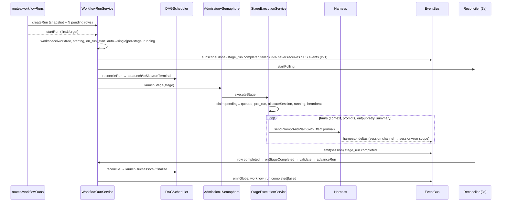
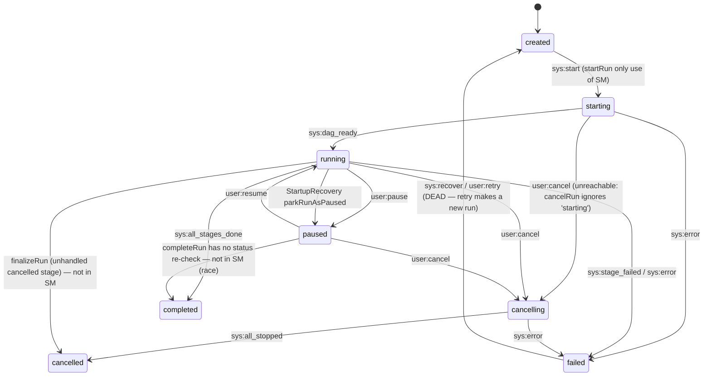

# B — Workflow run-time engine audit (branch `desktop_redesign`, 2026-09-24)

Scope: `packages/core/src/services/{WorkflowRunService,DAGScheduler,StageExecutionService,DurableExecutionEngine,DurableSleepService,HitlService,SessionAllocator,StartupRecoveryService,ResultValidator,WorkflowPreprocessor}.ts`, `domain/dag/*`, `domain/state-machines/*`, `apps/server/src/routes/workflowRuns.ts`, the stream bridge in `apps/server/src/composition-root.ts`.

All paths below are relative to the repo root. `WRS` = `packages/core/src/services/WorkflowRunService.ts`, `SES` = `packages/core/src/services/StageExecutionService.ts`, `SCH` = `packages/core/src/services/DAGScheduler.ts`.

**How this was checked.** I traced every finding from the write to the read. Findings marked **[verified]** were also reproduced with scratch vitest probes. The probes run the real `WorkflowRunService`, `DAGScheduler`, `StageExecutionService`, `HitlService`, `ResultValidator` and `EventBus` against the repo's `MockRepositories`, and they live outside the repo in `scratchpad/probe/probe*.test.ts`. The probe output is quoted where it matters.

**Existing unit tests.** I ran 25 files with `npx vitest run --maxWorkers=2`, covering DAGScheduler, DAGValidator, ConditionEvaluator, both state machines, StageExecution*, Durable*, WorkflowRun*, Hitl*, resolveStageHooks, ResultValidator, SessionAllocator, StreamBroker/Resume/WriteBatcher, Semaphore and AdmissionController. Result: **373 passed, 1 failed.** The one failure is `StageExecutionService.test.ts > delivers uploaded prompt files … without following symlinks`. It fails alone too, with `EPERM: operation not permitted, symlink`: Windows needs developer mode or admin rights to create symlinks. This is an environment problem, not a code defect.

**Fixes from the prior audit (Sept 2026)**
- ✅ AND/OR tokenizer (`ConditionEvaluator.ts:166-189`)
- ✅ override-skip no longer runs validation (`WRS:1326`)
- ✅ retry route starts the new run (`workflowRuns.ts:182-188`)
- ✅ StageExecutionError args are in the right order at the retry call sites (`SES:2755,2761`). One remaining misuse is at `SES:377`: `stageDef.id` is passed as `stageRunId`.
- ✅ pause→summary fallback excerpt (`SES:2195-2221`)
- ✅ "Wake now" route (`workflowRuns.ts:290-327`). It cannot actually fire, though: nothing ever puts a stage to sleep (B-17).
- ⚠️ The in-session retry fix is partial. `mayRetryInSession` (`SES:210-219`) only looks at stage-level `resultValidation`, so workflow-level `orchestratorConfig.resultValidations` still release the conversation before the retry needs it (B-12).

---

## (a) End-to-end run flow

### Narrative

1. **Create.** `POST /workflow-runs` calls `WRS.createRun` (`WRS:408-579`). This:
   - freezes a `definitionSnapshot` of stages and edges (`:419-421`);
   - type-checks variables (`:430-474`) and fills in defaults (`:484-492`);
   - drops the inherited workspace keys for scheduled runs (`:508-519`);
   - inserts the run and N `pending` stage_runs in one transaction (`:538-560`);
   - then emits `workflow_run.created`.
2. **Start.** Either `POST /:id/start` (fire-and-forget, `workflowRuns.ts:129`) or `WorkflowOrchestrator.execute`, which clones repos, runs preprocessing and a sandbox, arms post-processing, then calls `startRun`. `WRS.startRun` (`:675-864`):
   - provisions a workspace or worktree (`:684-750`) and a JSONL `RunLogger`;
   - applies `sm.transition('sys:start')`, sets status `starting`, fires the `on_run_start` hooks;
   - builds the DAG from the snapshot;
   - resolves `auto` session mode to `single` for a linear DAG or `per-stage` otherwise, and forces `single` to `per-stage` when there is parallelism (`:813-834`);
   - sets status `running`;
   - calls `subscribeRunEvents`, which subscribes to **global** events (`:932-947`);
   - calls `startPolling`, a 3 s process-wide reconciler (`:1009-1070`);
   - calls `advanceRun`.
3. **Schedule.** `advanceRun` (`:1466-1527`) calls `SCH.reconcileRun`, which takes a per-run FIFO lock (`SCH:433-444`) and runs the pure `reconcileDAG` (`SCH:228-269`). It returns `{toLaunch, toSkip, runTerminal}`. `advanceRun` then:
   - persists the skips as `skipped` with "unreachable";
   - for each launch: checks operator overrides (`findStageOverride`), fires `on_parallel_join` when a stage has more than one predecessor, gathers predecessor summaries, and calls `launchStage`;
   - calls `finalizeRun` if the run is terminal.
4. **Launch.** `launchStage` (`:264-338`) goes through the admission `ordinary` lane, then the stage `Semaphore` (8), then `SES.executeStage`. It is fire-and-forget: **only a rejection** is routed (to `onStageFailed`).
5. **Execute.** `SES.executeStage` (`SES:1035-2734`):
   - atomic claim `pending→queued` (`:1091`), a "before" checkpoint, `stage_run.queued`;
   - builds the session config and resolves the agent;
   - runs `pre_run` hooks (`:1265-1307`), then `allocateSession` (`:1310`);
   - sets the row to `running` (`:1350`), emits `stage_run.running`, and starts the heartbeat (`:1373`);
   - subscribes to harness events.
   
   Inside the `try` (`:1668`), each turn goes through `runTurn`, the durable effect sandwich (`:1586-1666`), in this order:
   - context turn, validation-feedback turn, hook-context turns;
   - N prompt turns, with the status re-checked between prompts at `:1821`;
   - up to 2 output-format retry turns;
   - the summary turn;
   - artifact persistence, `post_run` hooks, and the optional approval-gate loop (`:2301-2529`).
   
   It then seals the artifact, runs a "settled elsewhere?" check (`:2554`), writes `completed` (`:2564`), releases the journal, and emits `stage_run.completed` **on the session channel** (`:2586`). The `catch` (`:2619-2721`) handles errors: paused or cancelled means return; otherwise it retries via `retryStage` (default 1 retry, 3 s) or writes `failed` and emits `stage_run.failed` (session channel).
6. **Advance.** Because of B-1, SES completions never reach the run's global subscription. The DAG advances **only** from the reconciler tick (`WRS:1022-1063`): completed rows go to `onStageCompleted`, failed rows to `onStageFailed`, stale rows to `failStaleStage`, and if anything is pending, `advanceRun` runs. `onStageCompleted` (`:1290-1404`) runs result validation, may call `retryStageAfterValidation` (`:1646-1726`) or escalate to `onStageFailed`, releases a per-stage session, fires hooks, and calls `advanceRun`.
7. **Finish.**
   - `finalizeRun` (`:1536-1582`) → `completeRun` (`:1730-1759`: release all sessions, complete the workspace, `on_run_complete`, `workflow_run.completed`), or it writes `failed`/`cancelled` itself. The failed path has **no session release** (B-15).
   - The orchestrator's global listener then runs post-processing (commit, push, PR), `WorkflowOrchestrator.ts:1041-1081`.
8. **Other controls.**
   - Pause/resume: `WRS:1116-1181`.
   - Cancel: `WRS:1186-1233`.
   - Run retry: `retryRun` (`:599-670`) creates a **new** run with the ancestor's snapshot, copies completed and skipped stages, and strips the workspace, worktree and repo variables.
   - Stage-level pause/resume/retry/cancel/interrupt/approve: `workflowRuns.ts:247-562`.

### Sequence



### Run state machine (declared, `domain/state-machines/WorkflowRunStateMachine.ts:9-49`) vs what the code actually writes



Only `startRun` builds a `WorkflowRunStateMachine` (`WRS:681`), and it applies its transitions *after* the workspace has been created. Every other run transition is a raw `updateStatus` or `update`: pause, resume, cancel, finalize, complete, redrive, the orchestrator's error path (`WorkflowOrchestrator.ts:753`) and recovery.

### Stage-run state machine (declared, `StageRunStateMachine.ts:10-80`)

States: `pending, queued, running, paused, completed, failed, cancelled, skipped, sleeping, awaiting_input`. The SM is used only as an **after-the-fact assertion** in `executeStage` (`SES:1062,1097,1360`). The DB write happens first. Transitions that happen in the DB but are *not* in the table:

| Actual transition | Where |
|---|---|
| completed → running | `retryStageAfterValidation` `WRS:1666-1671`; `sendStageFollowUp` `SES:3002`; approval-gate feedback `SES:2486` |
| completed → failed | validation escalation `WRS:1367` → `:1426` |
| completed → awaiting_input | `single` mode permission handler bound to stage 1 (B-9); `POST /stages/:id/interrupt` (no guard, `StageRunRepository.interrupt` `:190-199`) |
| cancelled → queued → running | `retryStage` after `cancelStage` (B-3) **[verified]** |
| paused → queued | same race via `pauseStage` (B-3) |
| failed → running | full-restart validation retry after the reaper failed it (DB write at `SES:1350` precedes the throwing `sm.transition` at `:1360`) |
| awaiting_input → pending | `HitlService.resume` with no live waiter (`HitlService.ts:387-390`) |
| awaiting_input → queued | `retryStage` after a turn timeout during a HITL wait (B-7) |
| pending → failed | `launchStage` catch (admission timeout, pre-claim throw) `WRS:335-337` → `:1426` |

`computeTerminalRunStatus` (`SCH:177-217`): if there are no failed or cancelled stages, the result is `completed`. Otherwise a failed or cancelled stage counts as "handled" if one of its outgoing edges that is *active for that status* leads to a `completed` stage, or to a transitively handled one. Any unhandled `failed` stage means `failed`; else any unhandled `cancelled` stage means `cancelled`; else `completed`. Because `always` and `on_completion` edges are active on failure, a trailing cleanup or notify stage turns a failed run into `completed` (B-16) **[verified S3]**.

---

## (b) Scheduler and edge semantics

| Aspect | Behaviour | Evidence |
|---|---|---|
| Readiness | Only `pending` rows are considered. **All** predecessors must be terminal (`completed/failed/skipped/cancelled`) | `SCH:124-136`, `:66-81` |
| Edge activation | `on_success`: completed · `on_failure`: failed · `on_completion`: completed or failed · `always`: any terminal status, including skipped and cancelled. A missing type means on_success | `SCH:91-102` |
| Join | **AND-join with veto.** Any inbound edge that is inactive while its predecessor has a real outcome (completed/failed/cancelled) vetoes the stage, which becomes `skip`. An inactive edge from a **skipped** predecessor is neutral. At least one active edge is required. There is no OR-join: `B -on_success-> D <-on_failure- C` with both B and C completed skips D **[verified S4]** | `SCH:138-151` |
| Multiple edges between the same pair | Allowed when the types differ (the validator's dedup key includes the type, `DAGValidator.ts:106`). A→B with both on_success and on_failure edges means **B is always skipped** **[verified S2]** | B-18 |
| Stage `condition` | Evaluated once per *activating* parent, with `some()` semantics. A root uses `completed`. False means skip | `SCH:153-161` |
| Skip propagation / dead-path elimination | `reconcileDAG` loops to a fixed point, marking skips in memory; successors of a skipped stage see neutral edges and cascade. **Operator override-skip now cascades too.** A→B→C with B overridden: C is skipped **[verified S1]**. The Sept "known quirk" (override advances on_success edges) has **flipped** | `SCH:237-254`; `WRS:1504-1506,1888-1912` |
| Terminal status | See `computeTerminalRunStatusFor` above | `SCH:177-217` |
| Fan-out | Every ready stage is launched in one `advanceRun` pass, in `dag.nodes` insertion order (snapshot order) | `WRS:1495-1524` |
| Concurrency | Admission `ordinary` lane (default sized from machine capacity, env `GENERATORAI_ORDINARY_CONCURRENCY`, queue wait 30 min, then `AdmissionTimeoutError` → stage failed) **plus** a stage `Semaphore(8)` (`MAX_CONCURRENT_STAGES`). Both are process-wide; there is no per-run `maxParallel` | `composition-root.ts:1585-1600`; `createCoreServices.ts:464` |
| Idempotent launch | The DB claim `pending→queued` (`StageRunRepository.ts:167-177`) makes duplicate launches no-ops | `SES:1091-1096` |
| Cycles | Rejected (Kahn's algorithm). Disconnected stages only produce a warning | `DAGValidator.ts:123-200` |
| Loops / foreach / map | **None in the DAG.** `IterationConfig` (sub-workflow loop, `maxIterations`) exists in the types, schema, DB column and SDK builder, but **has no executor**: it is silently ignored (B-17). `DurableExecutionEngine` iterations are for *automation batches* only | `shared/types/StageDefinition.ts:44-56`; grep shows no reader |
| Sub-workflows | Not implemented (see above) | — |
| Topology freeze | The snapshot freezes stages and edges, **but** `executeStage`, `onStageCompleted` and `retryStageAfterValidation` re-read the **live** `stageDefRepo` (B-13) | `SES:1063`; `WRS:1327,1652` |

---

## (c) Conditions, validation, retry, timeouts

### ConditionEvaluator grammar (`domain/dag/ConditionEvaluator.ts`)

```
condition   := {type: always|on_success|on_failure} | {type: expression, expression}
expr        := orExpr ;  shunting-yard, precedence NOT(3,right) > AND(2) > OR(1), parentheses
op          := AND|OR|NOT (case-insensitive, word-boundary) | && | || | ! (not before '=')
leaf        := 'true' | 'false' | cmp | value            (leaf = text between ops/parens)
cmp         := \S+ (==|!=|<=|>=|<|>) .+                  (left side cannot contain spaces)
value       := 'str' | "str" | number(Number()) | true|false | status | parentStatus | variables.a.b.c
```

- Scopes: `status`/`parentStatus` (the activating parent's status) and `variables.*` (run variables, which are **static**). There is **no access to predecessor output, `outputData` or summary**, so a branch cannot be chosen on a stage's result.
- Equality is loose: it compares numerically when both sides are numeric, otherwise by string (`'02134' == 2134` is true). Relational operators are numeric-only.
- It is safe against injection: no `eval`, read-only path walks.
- It is **not entirely fail-safe**, contrary to its doc comment (`:67-68`):
  - `NOT` and `!` alone evaluate to **true**: `stack.pop() ?? false` (`:249`).
  - A dangling `OR x` evaluates as `x`.
  - Unquoted strings (`variables.env == prod`) are silently false.
  - A quoted left side containing spaces is silently false.
  
  All of this is **[verified S5]** (B-22).
- Unknown condition types are false. Parse exceptions are false.
- The preprocessor has a **second, different** condition grammar (`WorkflowPreprocessor.ts:747-778`).

### Result validation (`ResultValidator.ts`)

- **Rule types:** `contains`, `not_contains`, `min_length`, `max_length`, `regex` (user RegExp, no ReDoS guard), `custom_script` (a shell command with `cwd` set to the workspace, `STAGE_OUTPUT` env capped at 32 KB, 60 s timeout, exit code 0 = pass), `json_schema` (top-level keys only, from the **first** ```json block), and `llm_validation`, which is fake: it only checks length ≥ 50 (`:233-248`). Unknown types pass.
- **Input:** every assistant message for the stage in its current session (`:49-56`). That includes context acknowledgements, summary answers, output-retry answers and, on in-session retry, **the rejected previous answers** (B-11).
- **Where it runs:** only in `WRS.onStageCompleted` (`:1326-1392`), which in practice means inside the reconciler tick (B-1).
- **Rule sources:** workflow rules come from `orchestratorConfig.resultValidations` matched by `stageIndex === stageDef.order`, plus stage rules.
- **On failure:**
  - If `retryCount < retryPolicy.maxRetries` (default **0** here), `retryStageAfterValidation` runs.
  - Otherwise `onStageFailed` runs.
  - If validation *throws*, that counts as a pass.
- **Retry strategy:** in-session for attempts below `max(1, maxRetries-1)`, full restart for the last one (`WRS:1657-1658`).
  - Backoff is `backoffMs * mult^retryCount`, with **no jitter**, awaited **inside the tick** (`:1680-1681`).
  - In-session retry (`SES:2744-2938`): a follow-up prompt, then re-summarise, re-persist artifacts, `post_run`, `completed`. It does **not** update `outputText`/`outputData`/`artifactManifest` or the sealed durable artifact (B-11), and it has **no heartbeat** (B-2).
  - Full restart: release the session, set `queued`, run `executeStage` with the `__validationFeedback` var.

### Execution-error retry (`SES:2665-2688,3279-3317`)

- Uses `stageDef.retryPolicy ?? {maxRetries:1, backoffMs:3000, mult:1}`. **Every stage is retried once by default**, including deterministic errors such as auth failures, a missing model or a quota error. There is no error classification; only `StageRejectedError` is excluded.
- There is no jitter. It restarts from step 0 with a new epoch `a{retryCount}v{…}`, so every prompt and tool call is redone.
- `retryCount` is one budget shared between execution retries and validation retries.
- Errors thrown **before** the `try` block get no retry and no `on_error` hook. That covers agent resolution (`:377`), a `pre_run` abort (`:1280`) and `allocateSession`/`createConversation` failures (`:1310`).
- The retry calls `executeStage` recursively inside the `catch`, so stack depth is bounded only by `maxRetries`.
- It never checks whether the stage or run was cancelled in the meantime (B-3).

### Timeouts, heartbeat and wedge detection

- **Per-prompt timeout.** Only applies to the main *prompt* turns, and only when `stageDef.timeoutMs || prompt.waitForCompletion` (default 300 s, `SES:1995-2010`). `withStageTimeout` aborts the harness signal (`:622-644`).
  - The timeout covers HITL tool-permission waits inside the turn (B-7).
  - `waitForCompletion:false` (a UI checkbox, `PromptEditor.tsx:137`; optional in `WorkflowScriptSchema.ts:50`) means `sendPrompt` fire-and-forget with **no wait and no timeout**. The loop runs on and captures an empty `outputText`.
- **Unbounded turns.** Context, validation-feedback, hook-context, output-retry, summary, replay-recap, review-feedback, `retryInSession` and `sendStageFollowUp` turns call `sendPromptAndWait` with **no timeout and no signal** (B-8).
- **Heartbeat.** `setInterval(10 s)` writes `heartbeat_at` only while the row is `queued`/`running` (`StageRunRepository.ts:289-299`). The reconciler fails any `queued`/`running` row whose beat is older than 30 s (`WRS:1587-1624`). This measures **process liveness, not progress**: a wedged turn in a live process beats forever. And any path that puts a row back into `running`/`queued` without restarting the beat gets reaped (B-2) **[verified P4]**.
- There is no compensation or saga mechanism. Failure handling is limited to the `on_failure`/`on_completion`/`always` edges, `on_error`/`on_stage_failed`/`on_run_failed` hooks, and post-processing that runs only on `completed`.

---

## (d) Sessions and context passing

- **Modes.** `per-stage`, `single`, `auto`. `auto` resolves at start: `single` if every execution layer has exactly one node and there is one root, else `per-stage`. An explicit `single` with parallelism is forced to `per-stage` (`WRS:813-834`). The resolved mode is persisted on the run. There is no per-chain mode.
- **SessionAllocator** (`SessionAllocator.ts`) holds per-run state in memory, mirrored to `session_allocations` and `stage_session_maps`. Operations are serialised per run (`:43-59`).
  - `single`: the first stage creates the shared session **with its own config** (model, harnessType, tools, agent, `onPermissionRequest` closure bound to *that* stage's id). Later stages only get `resumeConversation` and a refcount bump (`:248-308`). Their agent, model, tool and permission config is silently dropped (B-9).
  - `per-stage` (and auto): one session per stage run, reused if the stage→session map already has one (for example after rehydrate).
- **Release.**
  - Per-stage: on success the session is released in SES (`:2612-2618`) unless a validation in-session retry *may* follow (`mayRetryInSession`) or a follow-up is pending. Otherwise WRS releases it after validation (`WRS:1386-1390`), or on failure (`WRS:1436-1440`, `SES:2720`).
  - `completeRun` and `cancelRun` call `releaseAll`. **`finalizeRun` (failed/cancelled) does not** (B-15).
  - Cancel calls `harness.destroyConversation` in `cancelStage`.
- **Context passing.** `gatherPredecessorSummaries` (`WRS:1800-1857`):
  - Sources are `contextSources` (stage **names**; first match wins; completed stages only), otherwise direct DAG predecessors (any status).
  - Output text prefers the durable artifact `stage-output` over the `outputText` column.
  - Injected by `contextFilter` (`SES:1672-1737`): `summary-only` (default) · `full` (full output) · `structured` (summary plus `outputData` JSON) · `none`. It goes in as a separate internal turn, also in `single` mode, where it duplicates the conversation.
- **Summaries.** A text stage gets an LLM summary turn. A JSON stage gets an auto summary listing its keys. If the summary turn fails, the fallback is the first 3000 characters of the output (`SES:2141-2222`).
- **Templating.** `interpolateVariables` does `{{ name }}` and dotted paths over run variables plus hook-injected variables, single pass, and reports unresolved names as a `harness.session_info` warning (`SES:1853-1876`; `shared/utils/pure.ts:75-124`). Stage outputs cannot be templated.
  - `pre_run` hook variables mutate the passed object in place (`SES:1286-1290`). With no override, that object is `run.variables` shared across the whole launch batch, so they leak across siblings, and they are never persisted.
- **Workspace.** `startRun` calls `WorkspaceManager.createWorkspace`. That uses a worktree when `useWorktree`, and adds project worktrees via `setupProjectWorktrees` (`WRS:684-750,872-925`). Orchestrated runs clone repos in `WorkflowOrchestrator` (`:589-606`) before `startRun`. A retry strips `__workingDirectory`, `__artifactsDirectory`, `__workspaceId`, `repo_path_*` and `repo_branch_*` (`WRS:59-80`), and gets no clone, no preprocessing and no post-processing (B-6).
- **Pre-/post-processing.** Only in the orchestrator path:
  - Preprocessing: `WorkflowPreprocessor.execute` runs clone/run_script (`sh -c`)/validate/set_var/conditional.
  - Post-processing: runs on `workflow_run.completed` (`WorkflowOrchestrator.ts:1041-1081`). The listener has a **24 h TTL**, while HITL waits can last 30 days (B-19), and it is not one-shot while its async handler runs.

---

## (e) Durability and recovery

- **Effect sandwich** (`DurableExecutionEngine.ts:425-571`). The unit is one **turn**, with op id `a{retryCount}v{validationAttempt}/{context|prompt/i|summary|…}` (`SES:1504-1511`).
  - Intent goes into the register. `perform` runs. The settlement (`tool_result` entry plus the register flipped to `settled`) is written in one transaction.
  - On replay, a settled turn returns its stored record and the accumulators are restored. An in-flight turn with policy `safe` re-runs. With policy `never` it gets a **synthetic result and the turn is skipped**; the stage then continues and **completes** (B-10).
  - The policy is `never` unless every enabled tool group is `fileRead`/`web` (`:176-197`), so in practice it is `never` for almost every stage.
  - The journal is released only after the terminal write (`SES:2584,2711`).
- **Boot recovery** (`StartupRecoveryService.ts:143-231`). For runs in `running`/`starting`, stages in `running`/`queued` are reset to `pending`, `currentStep` to 0, and `sessionId` is nulled. Then `redriveRun` runs: re-attach the logger and polling, pre-seed dedup keys, `advanceRun`. Runs in `cancelling` are completed as `cancelled`, but their `pending`/`awaiting_input`/`sleeping` stages are left alone. `awaiting_input` and `sleeping` stages are left untouched. `HitlService.resume` with no live frame sets the stage to `pending` and redrives the run; the post-restart verdict is held in memory for 1 h (`HitlService.ts:379-476`).
- **Ordering bug.** `recover()` redrives runs, which launches stages and allocates sessions **before** `sessionAllocator.rehydrate()` (`StartupRecoveryService.ts:99 vs 109`). `rehydrate` does `allocations.set(runId, oldRow)` unconditionally (`SessionAllocator.ts:75-90`) (B-20).
- **Durable sleep.** The sweeper and `wake()` claim are sound, but **no production code calls `sleep()`** (B-17).
- **Idempotency.** The stage claim, `resumeFromInterrupt` and `wake` are conditional UPDATEs. Heartbeat `leaseOwner` exists but is never passed. There is no owner-fenced lease on stage rows.

### Thought experiment: server killed while 3 parallel stages run

1. **On reboot**, the run is still `running` and the 3 rows are `running`. Each is reset to `pending` with `currentStep=0` and a null session. The run is redriven, `advanceRun` launches all 3, the claims succeed, and new sessions are allocated. This races with allocator rehydrate (B-20).
2. **Settled turns** replay from the journal without re-running.
3. **The in-flight turn:**
   - On a mutating stage it is **skipped** with a notice. The stage completes on whatever that turn had done: an empty `stageOutputContent` if it was the only prompt, and a summary of nothing. Successors run on that. **No double execution, but silent partial completion** (B-10).
   - On a read-only stage it re-runs. If the old CLI child survived (Windows does not kill descendants, and `OrphanProcessReaper` runs *after* recovery, fire-and-forget, and only knows `rg`/claude, `composition-root.ts:2482,2504-2515`), two agents can briefly work in the same directory.
4. **Double execution** therefore comes not from the replay path but from cancel/pause races (B-3), reaper races (B-2), and route retries with no guard (B-5).
5. **HITL stages** that were `awaiting_input` stay parked. Approving one after the restart re-executes the stage from the top (journal replay); the gate consumes the held verdict. If the gate was a *tool-permission* inside an in-flight turn, the turn is skipped (policy `never`), so the approved action never happens.

---

## (f) Streaming events catalog

**Transport.**
- `EventBus.emit(sessionId)` persists through `StreamBroker.publish('session', id)` as the commit point, with a per-session serial queue. It broadcasts on `session:<id>` and `session:*` (`EventBus.ts:288-411`).
- `emitGlobal` → `('global','all')`, broadcast to `globalHandlers` only (`:430-560,666-671`).
- A bridge (`composition-root.ts:1000-1048`, `composition/streamScopes.ts`) republishes every event that carries `workflowRunId` to `scope='run'` (and `chat`/`workspace`/`automation`/lifecycle→global), **fire-and-forget**.
- The client subscribes via `GET /api/stream?scope=run&id=<runId>` with `Last-Event-ID` / `afterSeq` (`routes/stream.ts:604-770`): replay from `stream_cursors`, capped at 100 synchronously, with an `onResume` verdict (`cursor_expired`, `replay_truncated`), then live.
- Each scope has its own monotonic `seq`. Deltas are dropped under congestion and announced with a `gap` frame; items are never dropped.
- Messages are persisted separately in `messages`: the user prompt per turn, the assistant reply on `harness.idle`, partials on pause.

| Event | Emitted by | Channel | Payload |
|---|---|---|---|
| `workflow_run.created` | WRS:565 | global→run | workflowRunId, name, workflowDefinitionId |
| `workflow_run.starting` | WRS:769 | global | workflowRunId |
| `workflow_run.running` | WRS:840 | global | workflowRunId |
| `workflow_run.paused` | WRS:1129, Recovery:272 | global | workflowRunId, (reason:'crash_recovery') |
| `workflow_run.resumed` | WRS:392,1178 | global | workflowRunId |
| `workflow_run.cancelling` / `.cancelled` | WRS:1202 / 1229,1578 | global | workflowRunId |
| `workflow_run.completed` | WRS:1756 | global | workflowRunId |
| `workflow_run.failed` | WRS:1572; Orchestrator:761 | global | workflowRunId, error |
| `workflow_run.retried` | WRS:664 | global | workflowRunId (new), ancestorRunId |
| `workflow_run.permission_mode_changed` | WRS:1253 | global | workflowRunId, mode, previous |
| `workflow_run.stage_validation` | ResultValidator:76 | global | workflowRunId, stageRunId, stageName, passed, failures[] |
| `workflow_run.orchestration_started/_completed/_failed` | Orchestrator:372/1012/761 | global | workflowRunId, … |
| `workflow_run.preprocessing_started/_completed`, `…preprocessing_step_started/_completed/_failed` | Orchestrator:626/646; Preprocessor:160/179/198 | global | workflowRunId, stepName, stepType/success/durationMs/error, stepCount/results |
| `workflow_run.postprocessing_started/_completed`, `…postprocessing_step_*` | Orchestrator:932/951; Preprocessor:268/288/312 | global | same shape |
| `workflow_run.worktree_creating`, `.sandbox_created`, `.sandbox_destroyed` | Orchestrator:519,581/698/992 | global | workflowRunId, codebases / sandbox info |
| `stage_run.queued` | SES:1120 (session) / 1125 (global) | session or global | stageRunId, workflowRunId, name |
| `stage_run.running` | SES:1364,2488,2765,3004 | session | stageRunId, workflowRunId, sessionId, name |
| `stage_run.step_started` / `.step_completed` | SES:1828 / 2062 | session | stageRunId, workflowRunId, step, totalSteps, label |
| `stage_run.completed` | SES:2587,2920,3089 | **session** (not seen by WRS, B-1) | stageRunId, workflowRunId, name |
| `stage_run.failed` | SES:2715,2934,3105 (session); WRS:1620 (global) | mixed | stageRunId, workflowRunId, error, name |
| `stage_run.skipped` | WRS:1490,1900 | global | stageRunId, workflowRunId, reason: unreachable / runtime_override |
| `stage_run.retrying` | WRS:1687 | global | stageRunId, workflowRunId, retryCount |
| `stage_run.awaiting_input` / `.input_received` | HitlService:335 / 428 | global | stageRunId, workflowRunId, interruptData, prompt / value |
| `stage_run.sleeping` / `.woken` | DurableSleep:100 / 211 | global | stageRunId, workflowRunId, wakeAt, reason / overdueMs |
| `stage_run.paused` | Recovery:277 only | global | stageRunId, workflowRunId, reason |
| *(missing)* `stage_run.paused` for a user pause, `stage_run.cancelled` | `pauseStage`/`cancelStage` emit nothing (`SES:3121-3137,3247-3275`) | — | — |
| `harness.*` (message_delta, reasoning_delta, tool_start, tool_complete, message_complete, idle, cancelled, error, session_info …) | SES:1400 (re-emitted with `stageRunId`, `workflowRunId`, `__isInternalTurn`) | session → run | provider payload + ids |
| `harness.session_info` infoType `unresolved_variables` / `durable_turn_skipped` | SES:1863 / 1637 | session | message, stageRunId, workflowRunId, unresolved[] |
| `session.active` | SessionAllocator:400 | session | … |
| hook lifecycle `hook.*` | HookExecutor (stamped workflowRunId) | → run | … |

**Ordering and replay guarantees.**
- Commit-then-broadcast holds on the primary scope.
- The **run scope is a best-effort copy**: a failed republish is only logged (`composition-root.ts:1009-1015`), so a run-scope replay can have holes that the session scope does not.
- With more than one subscriber on the same run scope, the watermark logic in `StreamBroker.subscribe` (`:227-236`) plus sequential awaited fan-out (`:201-218`) can drop a non-delta row for the second subscriber when publishes from different sessions interleave (B-21).

---

## (g) Issues

Severity: **P0** stuck, lost or duplicated work on the normal path · **P1** a common feature is broken or causes silent data loss · **P2** an edge-case bug or a notable semantics gap · **P3** hygiene or latent.

### B-1 (P1) Event-driven DAG routing is dead: every hop waits for the 3 s poll, and validation and backoff block the whole run **[verified]**

- **Evidence:**
  - `WRS.subscribeRunEvents` uses `eventBus.subscribeGlobal` (`WRS:934`). Global handlers only fire from `emitGlobal` (`EventBus.ts:553,666-671`).
  - SES emits `stage_run.completed`/`failed` with `eventBus.emit(session.id, …)` (`SES:2586,2714,2919,2933,3088,3104`). Those go to `session:*` only (`EventBus.ts:397`).
  - `launchStage` handles only rejections (`WRS:335`).
  - Probe P1: a session emit was not seen by `subscribeGlobal`. Probe P2: successor B launched **1511 ms** after A with a 1.5 s tick. In production that is up to 3 s per hop.
- **Failure scenario:**
  - A 10-stage linear workflow adds up to about 30 s of dead time.
  - Worse, `onStageCompleted` runs *inside* the non-reentrant tick. A `custom_script` validation (up to 60 s per rule) plus the retry backoff sleep (`WRS:1681`) blocks reaping, completion processing and launches for every other stage of that run.
  - The "commit/finalize is serialized" property is accidental. If someone fixes routing by switching SES to `emitGlobal`, the double-`completeRun` race comes back (see B-23).
- **Fix:**
  - Subscribe with `subscribeToWorkflowRun`/`subscribeAll` filtered by `workflowRunId`, or emit terminal stage events globally.
  - Move validation and backoff out of the tick (queue them per stage).
  - Make `completeRun`/`finalizeRun` a CAS (`UPDATE … WHERE status='running'`).

### B-2 (P0) Heartbeat reaper kills healthy stages that re-enter `running` without a fresh beat **[verified P4]**

- **Evidence:**
  - `isHeartbeatStale` compares the stale-beat age to 30 s for any `queued`/`running` row (`WRS:1587-1593,1038-1042`).
  - Heartbeat writes are gated to `queued`/`running` (`StageRunRepository.ts:296`), so the beat freezes during `awaiting_input`/`paused`/`completed`.
  - Nothing refreshes `heartbeat_at` when a row goes back into `running`. Paths that do this:
    - (a) `HitlService.resume` to `running` (`HitlService.ts:387`; `resumeFromInterrupt` only sets status);
    - (b) approval-gate feedback, `status:'running'` (`SES:2486`);
    - (c) `retryStageAfterValidation` sets `running`/`queued` (`WRS:1666`); `retryInSession` **never starts a heartbeat** (`SES:2744-2938`);
    - (d) `sendStageFollowUp` sets `running` with no heartbeat (`SES:3002`);
    - (e) `resumeStage` sets `running` (`SES:3218-3223`) well before `startHeartbeat` (`:1373`).
  - Probe P4 (production policy scaled 100×): the tool-permission approval came back `failed (Stage heartbeat stale …)`.
- **Failure scenario:**
  - In `default` or `plan` permission mode, a human approves a tool call after more than 30 s. In production the reconciler (3 s tick) usually runs before the next 10 s beat (about 85% of cases), then aborts the turn (`abortStage`) and fails the stage. Then the aborted turn's `catch` sees `failed`, which is not paused or cancelled, so it calls `retryStage` and **re-executes the stage inside an already-failing run**.
  - Every in-session validation retry and every legacy follow-up longer than about 20 s is killed the same way. "Request changes" on an approval gate is killed about 85% of the time.
- **Fix:** Make every transition into `running`/`queued` stamp `heartbeat_at = now`: do it in `resumeFromInterrupt`, `update(status)` and `claimForExecution`. Have `retryInSession` and `sendStageFollowUp` call `startHeartbeat`. Better still, key the reaper on an owner-fenced lease rather than a bare timestamp.

### B-3 (P0) Cancelling (or pausing) a running stage resurrects it: `retryStage` re-executes it after the cancel **[verified P5]**

- **Evidence:**
  - `cancelStage` aborts, then awaits `destroyConversation` and the on_cancel hooks, and only then writes `cancelled` (`SES:3252-3273`).
  - Claude and Copilot reject `sendPromptAndWait` on abort (`agent-harness-providers/src/conformance/index.ts:216-222`).
  - The executor's `catch` reads the status, which is still `running` (`SES:2625`), and goes to `retryStage` (`:2672-2687`). That sleeps 3 s, then **unconditionally** writes `queued` over `cancelled` (`SES:3296-3300`) and runs `executeStage` again.
  - `pauseStage` has the same shape: abort before writing `paused` (`SES:3129-3136`).
  - Probe P5, with a 50 ms teardown delay: `status right after cancelStage=cancelled; 3.6s later=running retryCount=1; harness calls=[send, abort, send]`.
- **Failure scenario:**
  - User clicks Cancel run. `cancelRun` marks the run `cancelled`, calls `releaseAll`, and completes the workspace (auto-commit).
  - 3 s later every in-flight stage restarts from step 0 on a **new, never-released session**. It burns tokens and writes to the workspace after the run is terminal. Its completion is then ignored (the run is not `running`).
  - Pause resumes work behind the user's back (the stage goes `queued` then `running` while the run is `paused`).
- **Fix:** Write `cancelled`/`paused` **before** aborting. In `catch` and in `retryStage`, re-read the status and the run status, and bail unless the stage is still `running` and the run is `running`. Use a versioned CAS for `queued`.

### B-4 (P1) Cancelling a run strands `awaiting_input` and `sleeping` stages; approving later revives work in a cancelled run

- **Evidence:**
  - `cancelRun` only cancels `running|paused|queued|pending` (`WRS:1209`).
  - `HitlService.cancelWaiter` has **zero production callers** (grep).
  - Recovery's cancelling path has the same filter (`StartupRecoveryService.ts:236`).
- **Failure scenario:** A run with a pending approval is cancelled. The `executeStage` frame, its 30-day awakeable timer, its heartbeat interval and the admission ticket stay alive. The stage stays listed in pending interrupts. If someone approves, the frame resumes on a destroyed conversation, which fails and triggers a retry that re-executes the stage (B-3). `deleteRun` leaves the same zombie with its rows deleted.
- **Fix:** Cancel all non-terminal statuses, call `hitl.cancelWaiter` for `awaiting_input`, and add `sleeping`.

### B-5 (P1) Stage-level retry and resume routes lose variables, workspace and context, and treat any settle as "completed"

- **Evidence:**
  - `POST /stages/:id/retry` calls `executeStage(stageRun, runId, run.sessionMode)` with no variables, harnessConfig or predecessor summaries (`workflowRuns.ts:343-346`). `POST /stages/:id/resume` does the same (`:269-272`). The durable-sleep `onWake` does the same (`composition-root.ts:1092-1095`).
  - With no `__workingDirectory`, the agent runs in **the server's `process.cwd()`** (`SES:1168-1172`). `{{vars}}` go unresolved and no predecessor context is passed.
  - `.then(() => onStageCompleted)` fires even when `executeStage` returned early or wrote `failed` itself. `onStageCompleted` never checks for `completed` (`WRS:1326`), so it validates a failed or paused stage and may retry it.
  - The retry route has no status guard (it can reset a `running` stage) and bypasses admission and the semaphore.
  - If the run is already `failed`, the retried stage runs but the run never advances (`WRS:1302`).
- **Failure scenario:** The user retries a failed stage from the UI. The agent edits files in the server's working directory with literal `{{topic}}` prompts.
- **Fix:** Route both through a `WRS.retryStage`/`resumeStage` that rebuilds context like `resumeRun` (`WRS:1137-1171`). Only call `onStageCompleted` when `status==='completed'`. Guard on the status.

### B-6 (P1) Run retry: copied stages are re-validated against nothing and failed, and the fresh workspace loses the earlier stages' files, clones and PR step **[verified P3]**

- **Evidence:**
  - `retryRun` copies `completed` rows without `sessionId` (`WRS:651-660`). They are not pre-seeded into `processedStageRuns` (unlike `redriveRun`, `:378-384`).
  - The first tick calls `onStageCompleted`, and `ResultValidator` finds no session, so there are no messages and the output is `''` (`ResultValidator.ts:49-51`). `min_length`, `contains`, `json_schema` and `regex` fail; `custom_script` runs in the **new, empty** workspace. With `maxRetries ?? 0`, `onStageFailed` marks the copied stage failed.
  - Probe P3: `copied stage A in retry run is now: failed (Validation failed after 1 attempt(s): A too short)`.
  - The retry strips the workspace and repo variables (`WRS:59-80,619`), and `startRun` does not clone orchestrator `gitRepositories`, run preprocessing, or arm post-processing (these exist only in `WorkflowOrchestrator.ts:589-744`).
- **Failure scenario:** A 3-stage coding workflow fails at stage 3. Retry: stage 1 (which has validation) is instantly failed, so the run ends `failed` again. Even without validation, stage 3 runs in an empty directory without stage 1–2's files or the cloned repo (`{{repo_path_target}}` is unresolved), and no PR is created.
- **Fix:** Pre-seed the dedup keys for copied rows (or mark them `copiedFrom`). Snapshot or copy the ancestor workspace, or re-run clone and preprocessing through the orchestrator. Carry the post-processing intent over.

### B-7 (P1) The stage timeout covers human approval time; a slow approver gets the stage silently restarted, and permits leak

- **Evidence:**
  - The permission handler runs inside the `withStageTimeout`-wrapped `sendPromptAndWait` (`SES:1999-2010`, `759-777`). The default is 300 s.
  - On timeout, `catch` sees `awaiting_input` (not paused or cancelled) and calls `retryStage`, which writes `queued` over `awaiting_input` (`SES:3296`).
  - The stale handler frame stays pending. When it is later superseded, its `finally` calls `semaphoreCallbacks.resume()` (`WRS:300-309`), which re-acquires a stage permit **after** `launchStage`'s `finally` has already run (`permitHeld` was false), so the permit is never released.
  - `retryStage` doesn't pass `semaphoreCallbacks`, so HITL waits in retries pin a permit.
- **Failure scenario:** The approver takes 6 minutes. The stage restarts from scratch, the approval UI returns 409, and one semaphore permit (of 8) is lost each time. Enough of these and every launch waits in admission for 30 minutes, then fails.
- **Fix:** Pause the timeout while `awaiting_input` (race the deadline only against agent time), or exclude HITL time. Make the pause/resume callbacks idempotent and owned by the launch.

### B-8 (P1) No wedge detection within a live process; internal turns have no timeout

- **Evidence:** The context, feedback, hook-context, output-retry, summary, recap and review turns, plus `retryInSession` and `sendStageFollowUp`, call `sendPromptAndWait` with no deadline (`SES:1733,1770,1798,2129,2188,1570,2500,2860,2875,3085`). The heartbeat is a bare `setInterval` (`SES:580-588`), independent of progress.
- **Failure scenario:** The provider hangs in the summary turn. The stage stays `running` forever and the run never finishes.
- **Fix:** Wrap every turn in `withStageTimeout`. Make the heartbeat reflect progress (for example, last harness event within N minutes).

### B-9 (P1) `auto` resolves to `single` for every linear workflow; stages 2..N then silently run with stage 1's model, agent, tools and permission handler

- **Evidence:**
  - `auto` becomes `single` when there is no parallelism (`WRS:815-818`). The definition default is `auto` (`WorkflowDefinitionService.ts:501`).
  - `createSession` binds `config` (including `onPermissionRequest`, whose closure holds stage 1's `stageRunId` and agent tool groups) once (`SessionAllocator.ts:387-394`, `SES:1322-1327`). Reuse only calls `resumeConversation` (`:281-285`). Per-turn options carry only `agentMode` and `permissionMode` (`SES:3399-3405`).
- **Failure scenario:**
  - Stage 2 is bound to a different agent or model: ignored.
  - In HITL mode, stage 2's tool request parks **stage 1's** completed row in `awaiting_input` (no guard in `StageRunRepository.interrupt`). The approval sets stage 1 back to `running`, the reaper (B-2) fails it, and the run ends `failed`.
- **Fix:** Resolve `auto` to `per-stage` (or reuse only when the configs are equal). Bind the permission handler per turn and route it by the currently active stage.

### B-10 (P1) A crash mid-turn on any mutating stage marks the turn skipped and then **completes** the stage

- **Evidence:** A `never` policy with a missing settlement produces a synthetic result, and `runTurn` returns `''` with a notice (`SES:1624-1647`). Execution continues to the summary and `completed` (`:2564`). The policy is `never` for any stage with write, shell or browser tools (`DurableExecutionEngine.ts:176-197`).
- **Failure scenario:** A server restart during a single-prompt "implement feature" stage: after reboot the stage completes in seconds with an empty output and a "summary" of nothing, and successors proceed. A tool-permission approval that arrives after a restart likewise never executes.
- **Fix:** On a synthetic result for the main prompt turn, fail the stage (or park it for operator retry) instead of continuing. Surface it in the run status.

### B-11 (P1) In-session validation retry cannot succeed for negative or structural rules, and its corrected output never reaches successors

- **Evidence:**
  - The validator concatenates **all** of the stage's assistant messages in its session (`ResultValidator.ts:49-56`), including the rejected answer.
  - `json_schema` takes the **first** ```json block (`:209`). `not_contains` and `max_length` can never recover.
  - `retryInSession` updates only `status`, `completedAt` and `summary` (`SES:2913-2917`). `outputText`, `outputData` and `artifactManifest` stay stale, and the durable `stage-output` artifact stays sealed with the old text (successors prefer it, `WRS:1838-1842`).
- **Failure scenario:** A JSON stage fails `json_schema`. The in-session retry produces valid JSON but validation still reads the old block and fails. If it does pass, downstream `contextFilter:'full'/'structured'` stages receive the rejected output.
- **Fix:** Validate only the latest attempt (mark a message boundary). Rewrite the output columns, reopen and append the artifact in `retryInSession`.

### B-12 (P2) Workflow-level validation rules still release the conversation before an in-session retry

- **Evidence:** `mayRetryInSession` checks only `stageDef.resultValidation` (`SES:210-219`). WRS merges `orchestratorConfig.resultValidations` (`WRS:1329-1332`). `retryInSession` finds the (closed) session row, sends to a destroyed conversation, and fails.
- **Fix:** Pass the merged rule set, or have WRS decide the release.

### B-13 (P2) Run snapshot covers topology only; live stage edits and deletes change or wedge in-flight runs

- **Evidence:** `SES:1063`, `WRS:1327,1652` read `stageDefRepo` live. `deleteStage` has no active-run guard (`WorkflowDefinitionService.ts:317-325`). In `onStageCompleted` the key is recorded (`WRS:1299`) before `stageDefRepo.getById` throws (`:1327`, outside the `try`). The tick then only calls `advanceRun` when something is `pending` (`:1051`).
- **Failure scenario:** The user deletes or re-creates the last stage while it runs. Its completion throws once, is deduped forever, and the run **stays `running` indefinitely**. Prompt and retry edits leak into in-flight stages, contrary to the WS-D1 claim.
- **Fix:** Read stage definitions from `run.definitionSnapshot`. Record the dedup key only after success. Always `advanceRun` when every stage is terminal.

### B-14 (P2) Dedup-before-guard in `onStageCompleted`/`onStageFailed` loses events

- **Evidence:** The key is added (`WRS:1299,1416`) before `run.status !== 'running'` returns (`:1302,1419`), and before throwing reads. A direct caller (`launchStage.catch`, route `.then`, `skipStageByOverride`) hitting a paused run consumes the key. A pre-claim failure leaves the row `queued` with a null heartbeat (never reaped, `WRS:1591`), so on resume the run is stuck.
- **Fix:** Add the key only after the run is confirmed `running` and the handler has finished. Treat `queued` rows with a null heartbeat older than a timeout as stale.

### B-15 (P2) Sessions and allocator rows leak on failed or cancelled finalisation

- **Evidence:** `finalizeRun` for `failed`/`cancelled` never calls `sessionAllocator.releaseAll` (`WRS:1536-1582`; compare `completeRun:1746`, `cancelRun:1215`).
- **Failure scenario:** A `single`-mode shared conversation (a live CLI process for persistent providers) survives every failed run. `session_allocations` rows accumulate and are rehydrated at every boot.
- **Fix:** Call `releaseAll` in `finalizeRun`.

### B-16 (P2) Failure masking: `always` and `on_completion` "cleanup/notify" stages turn failed runs into `completed` **[verified S3]**

- **Evidence:** `computeTerminalRunStatusFor` treats any active outgoing edge to a completed stage as "handled" (`SCH:195-201`).
- **Failure scenario:** Build fails, the Notify stage (on_completion) succeeds, the run reports `completed`, and post-processing auto-commits and opens a PR (`WorkflowOrchestrator.ts:908`).
- **Fix:** Only `on_failure` edges should absorb a failure. Or add a per-edge or per-stage "handles failure" flag.

### B-17 (P2) Dead features that look live: durable sleep, sub-workflow iteration, SM retry transitions

- **Evidence:**
  - `DurableSleepService.sleep` has no production caller (grep). `onWake` is wired but also lacks context (B-5).
  - `iterationConfig` is persisted and exposed in the SDK (`StageBuilder.ts:219`) but never executed.
  - `user:retry`/`sys:recover` are unused.
  - `AppConfig.workflow.{stageTimeoutMs,heartbeatIntervalMs,heartbeatStaleMultiplier}` (`shared/src/config/AppConfig.ts:59-70`) is never wired to `setDefaultStageTimeoutMs`/`setHeartbeatPolicy`.
- **Fix:** Wire them or remove and hide them. Reject `iterationConfig` at validation until it is implemented.

### B-18 (P2) Validator accepts unsatisfiable fan-ins; override-skip semantics flipped **[verified S1, S2]**

- **Evidence:**
  - The duplicate key includes `edgeType` (`DAGValidator.ts:106`), so A→B on_success plus A→B on_failure is accepted. The veto rule (`SCH:146-148`) then always skips B.
  - An operator override-skip of B in A→B→C now cascades skip to C (the "known quirk" said the opposite).
- **Fix:** Reject multiple edges per (from,to) pair, or evaluate the veto per predecessor (any active edge from the same predecessor wins). Decide on and document override semantics (probably: an override-skip should propagate as `completed` for gating).

### B-19 (P2) Post-processing listener expires after 24 h and is not one-shot

- **Evidence:** `MAX_LISTENER_TTL_MS = 24h` (`WorkflowOrchestrator.ts:1048`), while HITL waits can last 30 days (`HitlService.ts:92`). The handler awaits `handleRunTerminal` before `unsubscribe()` (`:1069-1070`).
- **Failure scenario:** A run waiting on a weekend approval completes, and no commit or PR is created. A duplicate `completed` event (see B-23) runs commit, push and PR twice.
- **Fix:** Drive the handler from the persisted intent (already stored) with no TTL. Set a "handled" flag synchronously before awaiting.

### B-20 (P2) Boot-order race: redrive allocates sessions before `SessionAllocator.rehydrate()` overwrites the map

- **Evidence:** `StartupRecoveryService.ts:99` (redrive, launch) runs before `:109` (rehydrate). `rehydrate` calls `allocations.set(runId, oldRow)` unconditionally (`SessionAllocator.ts:82-88`). Recovery nulls `stage.sessionId`, but `stage_session_maps` still maps the stage to its **old** session.
- **Failure scenario:** Either the new session is dropped from the map (never released, a leaked process), or a relaunched stage reuses the dead pre-crash session. That contradicts the "fresh session" intent and the X-13 lineage.
- **Fix:** Rehydrate before redrive. Delete the stage maps for reset stages.

### B-21 (P2) Run-scope stream: fire-and-forget republish, and a watermark drop with multiple subscribers

- **Evidence:** The bridge's `publishToBroker(...).catch(log)` (`composition-root.ts:1009-1015`). `StreamBroker.subscribe` live filter `row.seq <= deliveredUpTo` (`:232`), with sequential awaited fan-out (`:201-218`), across concurrently publishing sessions.
- **Failure scenario:** Tab 1 applies backpressure on row N (an item). Row N+1 (a delta, from another stage's session) reaches tab 2 first, so tab 2 drops row N (for example `stage_run.completed`). Its stage spinner never stops until a refetch.
- **Fix:** Per-subscriber ordered queues (enqueue in seq order, no watermark drop). Retry or await secondary-scope publishes.

### B-22 (P3) ConditionEvaluator is not fully fail-safe **[verified S5]**

`NOT`, `!`, dangling `OR x` evaluate truthy (`ConditionEvaluator.ts:249-254`); unquoted string literals are silently false; there is no access to stage outputs. **Fix:** validate the operand count (throw leads to false); reject unknown bare identifiers at definition-validate time; add `stages.<name>.output.*`.

### B-23 (P3) Finalisation is check-then-act

`completeRun` never re-checks the status (`WRS:1730-1743`). `finalizeRun` re-reads but doesn't CAS (`:1543-1564`). It is currently masked by B-1's poll-only serialisation. It can double-fire `on_run_complete`, `workflow_run.completed` and post-processing, or overwrite a concurrent `cancelled`. **Fix:** a conditional `UPDATE … WHERE status='running' RETURNING`.

### B-24 (P3) Assorted smaller problems

- **Non-waiting prompts.** `waitForCompletion:false` means `sendPrompt` with no wait and no timeout (`SES:2011-2017`), so the output is captured empty.
- **Pause loses work.** Pause mid-turn on Claude persists partial text as a *complete* message (via the `harness.idle` that `abortConversation` emits, `ClaudeAgentProvider.ts:2104-2109` → `SES:1463`), so resume skips the rest of the prompt (`SES:3180-3182,3210-3221`).
- **Pause doesn't stop queued stages.** `pauseRun` ignores `queued` stages (`WRS:1123`).
- **Admission timeout.** A 30-minute admission queue timeout fails stages that never ran.
- **Double start.** Starting twice leaks a `RunLogger` or workspace (`WRS:684-760`).
- **Unused override fields.** Override `agentName` and `timeoutMs` are parsed but ignored (`WRS:1867-1883`), and `stageIndex` uses unordered `getByRunId` (`StageRunRepository.ts:52-58`).
- **Hooks.** `pre_run` variables leak across the sibling launch batch. `cancelStage` skips hooksFile hooks and uses `process.cwd()`.
- **ReDoS.** `regex` rules are unguarded against catastrophic backtracking (`ResultValidator.ts:141-144`).
- **Fake rule.** `llm_validation` is a placeholder.
- **Missing events.** `stage_run.cancelled`, and `stage_run.paused` for a user pause, are never emitted.
- **Windows.** Preprocessor `run_script` uses `sh -c`, which is often missing on Windows (`WorkflowPreprocessor.ts:659`).
- **Wrong id.** `StageExecutionError(…, stageDef.id)` at `SES:377` passes a definition id as the stage-run id.

### Performance notes (B-25, P3)

- **Per token.** Each `harness.*` delta is written to SQL twice: the session scope, which is the commit point and awaited, and the run scope via the bridge. Both go through `StreamWriteBatcher`. With `GENERATORAI_DELTA_LOG=true` there is a third write to a file nobody reads.
- **Per stage.** Roughly 25–40 writes:
  - the claim;
  - checkpoint capture;
  - queued, running, step_started and step_completed events (×2 scopes);
  - session row plus allocation rows;
  - a `currentStep` write and a status read per prompt;
  - per turn: user message, register intent, entry settlement, artifact append, assistant message;
  - a final update, the journal delete, the completed event;
  - a heartbeat every 10 s.
- **Per active run every 3 s.** 2 reads, plus one `getById` per completed or failed stage (the dedup key needs `retryCount`, `WRS:1296`), plus 3–4 reads when anything is pending. This runs **for the life of the run**, including 30-day HITL waits. O(N) per tick per run.
- **Scheduler.** `reconcileDAG` is a fixed point with a worst case of O(V²·deg). `computeTerminalRunStatusFor` is O(F²·deg). `validateDAG` uses `queue.shift`/`includes`/`edges.some`, which is O(V²+V·E). The DAG is built three times per `buildDAG`, but cached per run (512 cap). Fine at today's sizes (tens of stages).
- **Memory.** Per cancelled or zombie HITL frame (B-4): an executeStage closure, a 30-day awakeable timer and a 10 s heartbeat interval. Allocator entries for failed runs are never dropped (B-15). A leaked `RunLogger` on double start.
